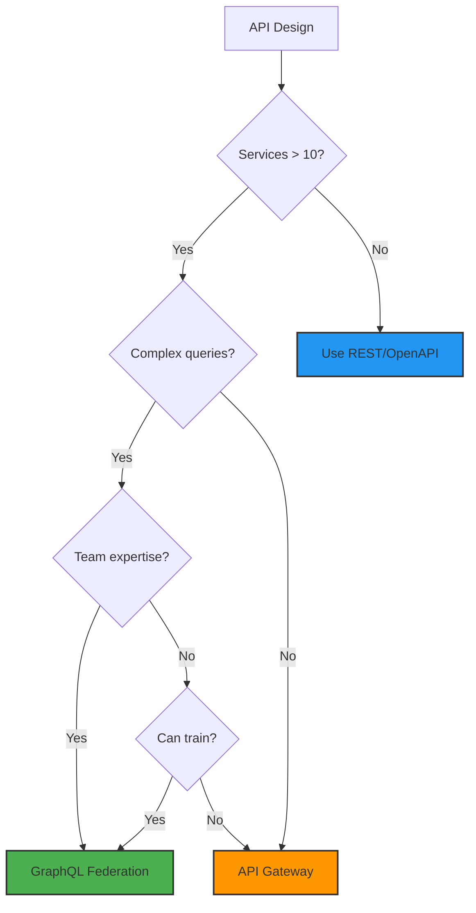
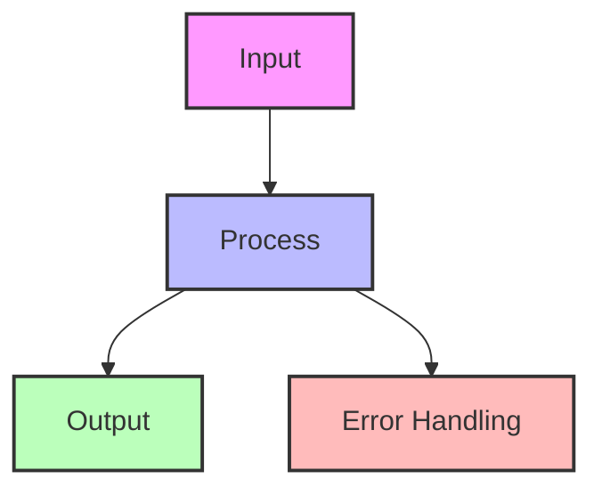
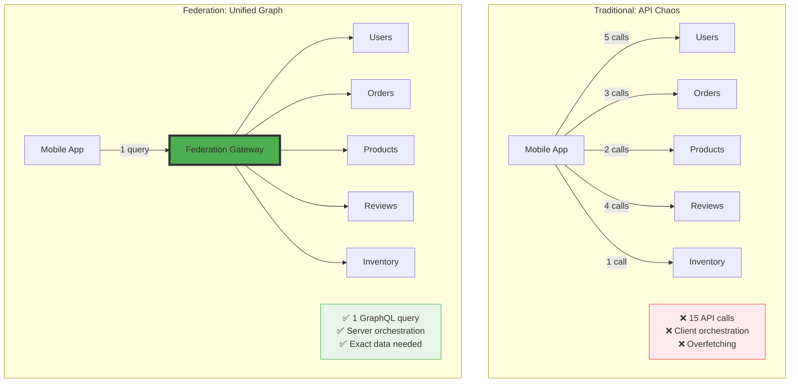
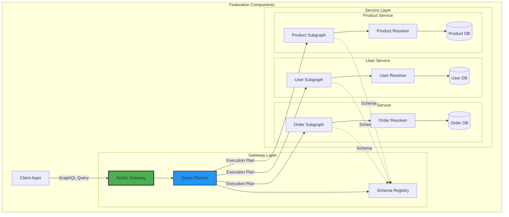
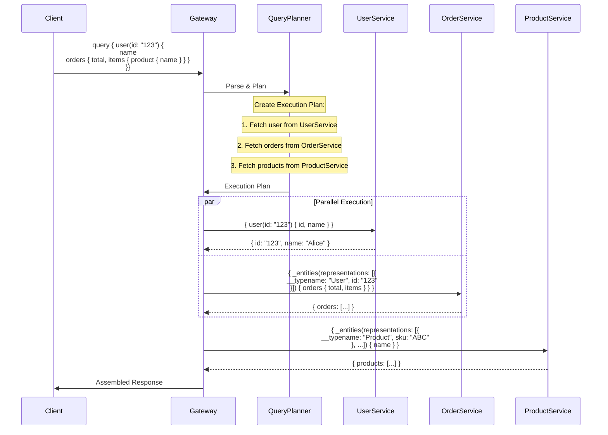
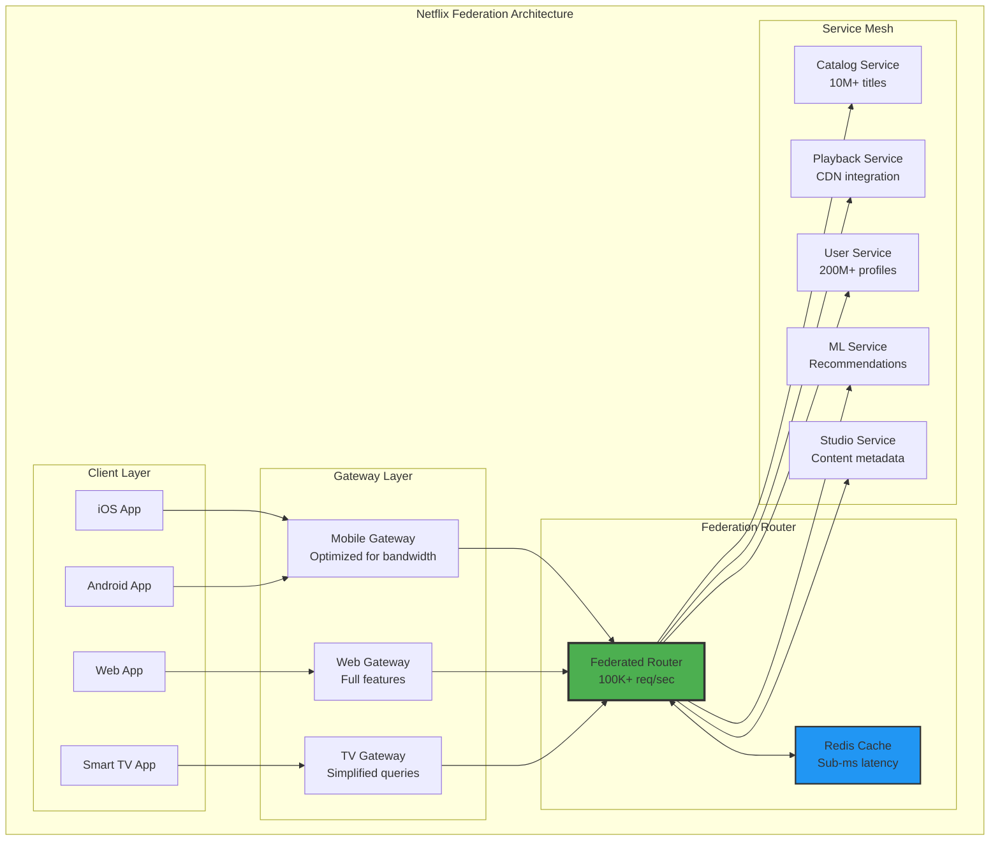
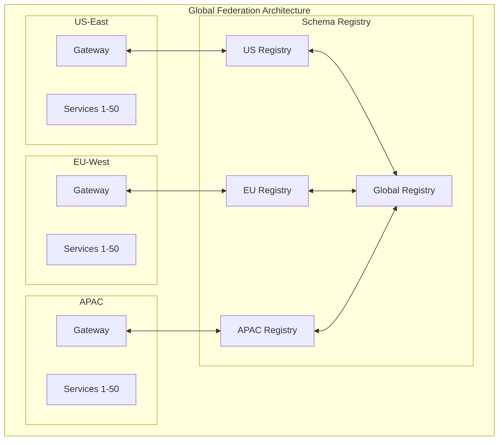

## Essential Question

**How do we structure our system architecture to leverage graphql federation?**


# GraphQL Federation

!!! warning "🥈 Silver Tier Pattern"
    **Modern API approach with performance considerations**
    
    GraphQL Federation elegantly solves API composition but can introduce performance bottlenecks and debugging complexity at scale. Requires careful query optimization and monitoring.
    
    **Best suited for:**
    - Mobile applications with varying data needs
    - API gateways unifying microservices
    - Internal service composition
    - Teams with GraphQL expertise

**One graph to rule them all - Composing distributed APIs into a unified experience**

> *"The best API is not one that does everything, but one that appears to do everything while elegantly delegating to specialized services."*

---

## The Essential Question

**How do we compose multiple GraphQL services into a unified API without creating a monolithic gateway or sacrificing performance?**

## When to Use / When NOT to Use

### ✅ Use GraphQL Federation When

| Scenario | Why Federation Helps | Example |
|----------|---------------------|----------|
| **10+ Microservices** | Unified schema across services | Netflix: 100+ services, one graph |
| **Mobile Optimization** | Reduce API calls & bandwidth | Airbnb: 10 calls → 1 query |
| **Polyglot Services** | Language-agnostic composition | GitHub: Ruby, Go, Java services |
| **Team Autonomy** | Services evolve independently | Spotify: Squad ownership model |
| **Complex Data Needs** | Flexible client queries | Shopify: Merchant dashboards |

### ❌ Don't Use Federation When

| Scenario | Why It's Wrong | Better Alternative |
|----------|----------------|--------------------|
| **< 5 Services** | Overhead exceeds benefit | GraphQL monolith or REST |
| **Simple CRUD** | Over-engineering | REST with OpenAPI |
| **Ultra-low latency** | Extra hop adds 10-50ms | Direct service calls |
| **No GraphQL expertise** | Steep learning curve | REST or gRPC |
| **Tight coupling required** | Federation enforces boundaries | Shared database |

### Decision Matrix



---

## Level 1: Intuition

### The Orchestra Metaphor

<div class="axiom-box">
<h4>🎼 The API Orchestra</h4>

Imagine an orchestra where each section (strings, brass, woodwinds) plays independently but creates unified music. The conductor (gateway) doesn't play instruments but coordinates the performance.

**GraphQL Federation = Conductor coordinating service orchestras**
</div>

### Visual Comparison



<details>
<summary>View implementation code</summary>



</details>

### Real Impact Example


<details>
<summary>View implementation code</summary>

```javascript
// ❌ Without Federation: Mobile battery drain
async function loadProductPage(productId) {
  // 6 sequential API calls = 6 × 200ms = 1.2s minimum
  const product = await fetch(`/api/products/${productId}`);
  const reviews = await fetch(`/api/reviews?product=${productId}`);
  const inventory = await fetch(`/api/inventory/${productId}`);
  const seller = await fetch(`/api/sellers/${product.sellerId}`);
  const similar = await fetch(`/api/recommendations/${productId}`);
  const shipping = await fetch(`/api/shipping/estimate/${productId}`);
}

// ✅ With Federation: One efficient query
const PRODUCT_QUERY = `
  query GetProduct($id: ID!) {
    product(id: $id) {
      name, price, description
      reviews { rating, comment, author { name } }
      inventory { inStock, quantity }
      seller { name, rating }
      similar { id, name, price }
      shipping { methods { name, cost, days } }
    }
  }
`;
// Result: 1 call, 200ms total, exact data needed
```

</details>

---

## Level 2: Foundation

### Core Federation Concepts

| Concept | Purpose | Example |
|---------|---------|----------|
| **Entity** | Shareable type across services | `User` type referenced everywhere |
| **Key** | Unique identifier for entities | `@key(fields: "id")` |
| **Extension** | Add fields from other services | Order service adds `orders` to User |
| **Reference** | Link between services | Order contains User reference |

### Federation vs Monolith vs Stitching

| Approach | Architecture | Pros | Cons |
|----------|-------------|------|------|
| **Monolith** | Single GraphQL server | Simple, fast | No team autonomy, scaling issues |
| **Schema Stitching** | Gateway merges schemas | Some separation | Gateway knows all, complex |
| **Federation** | Services self-declare | True autonomy, scalable | Learning curve, complexity |

### Federation Architecture


<details>
<summary>View implementation code</summary>



</details>

### Basic Federation Example


<details>
<summary>View implementation code</summary>

```graphql
# User Service - Owns user data
type User @key(fields: "id") {
  id: ID!
  name: String!
  email: String!
  createdAt: DateTime!
}

type Query {
  user(id: ID!): User
  users: [User!]!
}

# Order Service - Extends User with orders
extend type User @key(fields: "id") {
  id: ID! @external
  orders: [Order!]!  # This service adds orders to User
}

type Order {
  id: ID!
  total: Float!
  status: OrderStatus!
  items: [OrderItem!]!
}

# Product Service - Owns product data
type Product @key(fields: "sku") {
  sku: String!
  name: String!
  price: Float!
  inventory: Int!
}

# The Gateway automatically combines into:
type User {
  id: ID!
  name: String!
  email: String!
  createdAt: DateTime!
  orders: [Order!]!  # Added by Order Service
}
```

</details>

---

## Level 3: Deep Dive

### Query Planning & Execution


<details>
<summary>View implementation code</summary>



</details>

### Performance Optimization Strategies

| Strategy | Implementation | Impact |
|----------|---------------|--------||
| **DataLoader Pattern** | Batch entity lookups | N+1 queries → 1 batch query |
| **Query Complexity** | Limit depth & breadth | Prevent expensive queries |
| **APQ (Persisted Queries)** | Send hash not query | 95% bandwidth reduction |
| **Edge Caching** | Cache at CDN | 10ms response for repeat queries |
| **Schema Registry** | Central schema store | Faster startup, validation |

### Advanced Federation Patterns

#### 1. Entity Resolution with Caching


<details>
<summary>View implementation code</summary>

```python
class FederatedEntityResolver:
    def __init__(self):
        self.cache = LRUCache(maxsize=10000)
        self.loader = DataLoader(batch_load_fn=self._batch_load)
        
    async def resolve_reference(self, reference):
        # Check cache first
        cache_key = f"{reference['__typename']}:{reference['id']}"
        if cached := self.cache.get(cache_key):
            return cached
            
        # Use DataLoader for batching
        entity = await self.loader.load(reference)
        
        # Cache for subsequent requests
        self.cache[cache_key] = entity
        return entity
        
    async def _batch_load(self, references):
        # Group by type for efficient queries
        by_type = defaultdict(list)
        for ref in references:
            by_type[ref['__typename']].append(ref)
            
        # Parallel fetch by type
        results = await asyncio.gather(*[
            self._fetch_entities(typename, refs)
            for typename, refs in by_type.items()
        ])
        
        # Flatten and return in order
        entity_map = {}
        for batch in results:
            for entity in batch:
                key = f"{entity['__typename']}:{entity['id']}"
                entity_map[key] = entity
                
        return [entity_map.get(f"{ref['__typename']}:{ref['id']}") 
                for ref in references]
```

</details>

#### 2. Query Complexity Analysis

```graphql
# Assign costs to fields
type Query {
  user(id: ID!): User @cost(complexity: 1)
  users(first: Int!): [User!]! @cost(complexity: { 
    multipliers: ["first"], 
    value: 1 
  })
  search(query: String!): SearchResults @cost(complexity: 100)
}

type User {
  id: ID! @cost(complexity: 0)
  name: String! @cost(complexity: 0)
  orders(first: Int!): [Order!]! @cost(complexity: {
    multipliers: ["first"],
    value: 2
  })
  friends: [User!]! @cost(complexity: 10)
}
```

<div class="decision-box">
<h4>🎯 Complexity Limits by Use Case</h4>

- **Public API**: Max 1000 points
- **Mobile App**: Max 5000 points  
- **Internal Services**: Max 10000 points
- **Admin Tools**: Max 50000 points

Formula: `complexity = basesCost × depth × multipliers`
</div>

---

## Level 4: Expert

### Production Architecture Patterns

#### Netflix's Federated GraphQL


<details>
<summary>View implementation code</summary>



</details>

<div class="failure-vignette">
<h4>💥 Netflix's Federation Migration (2019-2021)</h4>

**Challenge**: 700+ microservices, 100+ client teams, multiple languages

**Solution Architecture**:
- Phased migration over 18 months
- Service-by-service federation
- Backwards compatible REST wrapper
- Gradual client migration

**Results**:
- 60% reduction in client-server traffic
- 80% faster feature development
- 90% reduction in client bugs
- $2M annual savings in bandwidth

**Key Learning**: "Start with high-value, low-risk services"
</div>

#### GitHub's Federation Strategy

| Service | Ownership | Entities | Extensions |
|---------|-----------|----------|------------|
| **Core** | Git team | Repository, Commit, Branch | - |
| **Issues** | Issues team | Issue, PullRequest | Repository.issues |
| **Users** | Identity team | User, Organization | - |
| **Actions** | CI/CD team | Workflow, Job | Repository.workflows |
| **Packages** | Registry team | Package | Repository.packages |

### Advanced Optimization Techniques

#### 1. Automatic Persisted Queries (APQ)


<details>
<summary>View implementation code</summary>

```javascript
// Client-side APQ implementation
class APQClient {
  constructor() {
    this.queryCache = new Map();
  }
  
  async executeQuery(query, variables) {
    // Generate query hash
    const queryHash = sha256(query);
    
    // Try with hash first
    try {
      return await this.fetchWithHash(queryHash, variables);
    } catch (error) {
      if (error.message === 'PersistedQueryNotFound') {
        // Register query and retry
        await this.registerQuery(queryHash, query);
        return await this.fetchWithHash(queryHash, variables);
      }
      throw error;
    }
  }
  
  async fetchWithHash(hash, variables) {
    return fetch('/graphql', {
      method: 'POST',
      body: JSON.stringify({
        extensions: {
          persistedQuery: {
            version: 1,
            sha256Hash: hash
          }
        },
        variables
      })
    });
  }
}

// Result: 100-byte hash instead of 10KB query
```

</details>

#### 2. Response Caching Strategy


<details>
<summary>View implementation code</summary>

```yaml
# Multi-layer caching configuration
caching:
  edge_layer:
    provider: cloudflare
    ttl: 5m
    key: "query_hash:user_role:variables_hash"
    invalidation: "tag_based"  # Invalidate by entity type
    
  gateway_layer:
    provider: redis
    ttl: 1m
    key: "normalized_query:user_context"
    invalidation: "event_driven"  # Pub/sub from services
    
  service_layer:
    provider: in_memory
    ttl: 10s
    key: "entity_type:entity_id:fields"
    invalidation: "write_through"
    
  dataloader_layer:
    provider: request_scoped
    ttl: request_lifetime
    key: "entity_type:entity_id"
    invalidation: "automatic"
```

</details>

---

## Level 5: Mastery

### Theoretical Foundations

<div class="axiom-box">
<h4>🔬 Federation as Distributed Type System</h4>

GraphQL Federation implements a distributed type system where:
- **Types** are distributed ownership boundaries
- **Fields** are service capabilities
- **Resolvers** are distributed functions
- **Schema** is the emergent API contract

This maps to category theory where services are categories and federation is a functor preserving morphisms (relationships).
</div>

### Production Patterns at Scale

#### 1. Multi-Region Federation


<details>
<summary>View implementation code</summary>



</details>

#### 2. Schema Evolution Strategies

| Strategy | When to Use | Example |
|----------|-------------|----------|
| **Field Deprecation** | Removing fields | `@deprecated(reason: "Use newField")` |
| **Type Extension** | Adding capabilities | `extend type User` |
| **Interface Evolution** | Changing contracts | Version interfaces |
| **Federation Migration** | Service boundaries | Gradual ownership transfer |

### Mathematical Models

#### Query Cost Function
```
C(Q) = Σᵢ (RTTᵢ + Procᵢ) + Coord × log(n)

Where:
- RTTᵢ = Round trip time to service i
- Procᵢ = Processing time at service i
- Coord = Coordination overhead
- n = Number of services involved
```

#### Federation Efficiency Score
```
E = (Qserial / Qfederated) × (1 - Overhead)

Where:
- Qserial = Time for sequential API calls
- Qfederated = Time for federated query
- Overhead = Gateway processing time
```

### Migration Playbook

<div class="decision-box">
<h4>📋 12-Week Federation Migration</h4>

**Weeks 1-2: Assessment**
- Map service dependencies
- Identify entity boundaries
- Estimate query patterns

**Weeks 3-4: Pilot**
- Choose 2-3 low-risk services
- Implement basic federation
- Measure performance impact

**Weeks 5-8: Core Services**
- Migrate user service
- Migrate product catalog
- Add caching layers

**Weeks 9-10: Complex Services**
- Migrate services with dependencies
- Implement advanced patterns
- Add monitoring

**Weeks 11-12: Optimization**
- Tune query planner
- Optimize caching
- Document patterns
</div>

### Economic Analysis


<details>
<summary>View implementation code</summary>

```python
def calculate_federation_roi():
    # Costs
    implementation_cost = 500_000  # Engineering time
    infrastructure_cost = 100_000  # Gateway, caching
    training_cost = 50_000        # Team education
    
    # Savings
    reduced_api_calls = 0.8       # 80% reduction
    bandwidth_per_call = 0.00001  # $0.01 per 1000 calls
    calls_per_day = 1_000_000_000 # 1B calls/day
    
    daily_savings = calls_per_day * reduced_api_calls * bandwidth_per_call
    annual_savings = daily_savings * 365
    
    # Developer productivity
    developers = 100
    hours_saved_per_week = 5
    hourly_rate = 150
    productivity_savings = developers * hours_saved_per_week * hourly_rate * 52
    
    total_investment = implementation_cost + infrastructure_cost + training_cost
    total_annual_savings = annual_savings + productivity_savings
    
    return {
        'investment': total_investment,
        'annual_savings': total_annual_savings,
        'payback_months': (total_investment / total_annual_savings) * 12,
        'five_year_roi': ((total_annual_savings * 5) - total_investment) / total_investment
    }
    
# Result: 6-month payback, 400% 5-year ROI
```

</details>

---

## 📚 Quick Reference

### Federation Cheat Sheet


<details>
<summary>View implementation code</summary>

```graphql
# Entity Definition
type Product @key(fields: "sku") {
  sku: String!
  name: String!
  price: Float!
}

# Service Extension
extend type Product @key(fields: "sku") {
  sku: String! @external
  reviews: [Review!]!
}

# Reference Resolver
_entities(representations: [_Any!]!): [_Entity]!

# Directives
@key(fields: "id")        # Entity identifier
@external                 # Field from another service  
@requires(fields: "id")   # Required fields
@provides(fields: "name") # Optimization hint
```

</details>

### Common Pitfalls & Solutions

| Pitfall | Symptom | Solution |
|---------|---------|----------||
| **N+1 Queries** | Slow nested queries | DataLoader pattern |
| **Over-federation** | Complex debugging | Start with monolith |
| **Missing Keys** | Failed entity resolution | Consistent ID strategy |
| **Circular Dependencies** | Schema won't compose | Clear service boundaries |
| **Performance Degradation** | Slow responses | Query complexity limits |

### Performance Benchmarks

| Metric | Without Federation | With Federation | Improvement |
|--------|-------------------|-----------------|-------------|
| **API Calls** | 10-15 per screen | 1 query | 90% reduction |
| **Bandwidth** | 50KB average | 5KB average | 90% reduction |
| **Latency** | 500ms (sequential) | 150ms (parallel) | 70% faster |
| **Client Code** | 500 lines | 50 lines | 90% less |

---

## Related Patterns

- [API Gateway](../architecture/api-gateway.md) - Simpler alternative for REST APIs
- [Service Mesh](../architecture/service-mesh.md) - Network-level service composition
- [CQRS](../architecture/cqrs.md) - Separate read/write models
- [Event Sourcing](../architecture/event-sourcing.md) - Event-driven composition
- [BFF Pattern](../architecture/bff.md) - Backend for Frontend alternative

---

**Previous**: [← API Gateway](../architecture/api-gateway.md) | **Next**: [Event Streaming →](../architecture/event-streaming.md)