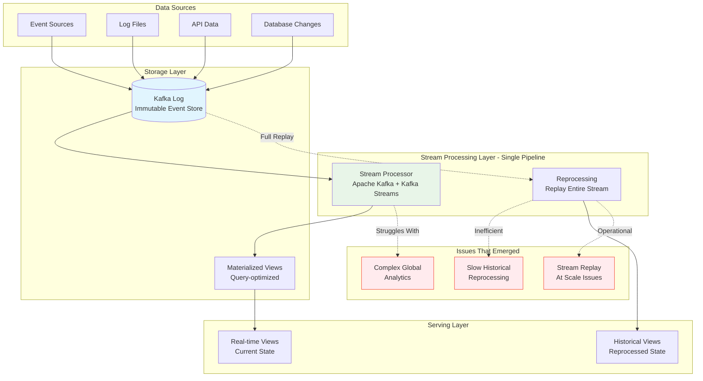
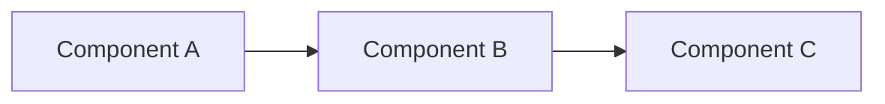
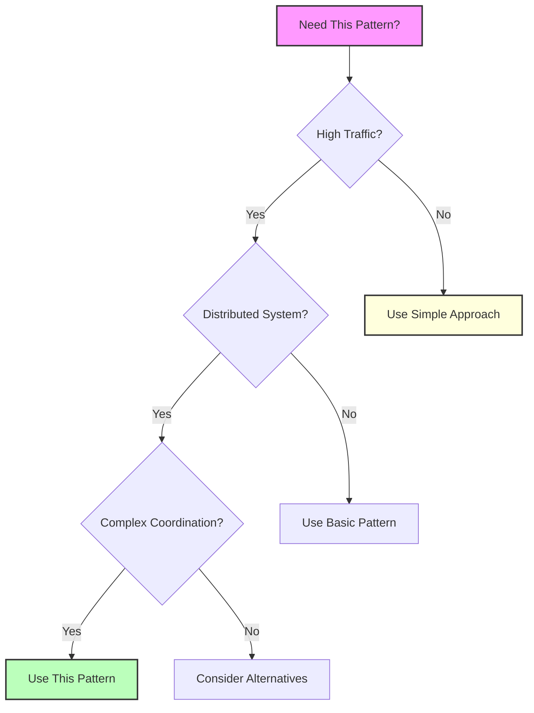

## The Complete Blueprint

Kappa architecture was a simplification attempt of Lambda architecture that proposed using only stream processing for all data processing needs, eliminating the complexity of maintaining both batch and streaming systems. This pattern advocated for a single, unified stream processing engine that would handle both real-time processing and historical data reprocessing by treating all data as an infinite stream, with the ability to replay the entire stream from the beginning when recomputation was needed. While conceptually elegant—reducing operational overhead by maintaining just one processing paradigm—Kappa architecture revealed practical limitations that led to its decline. Reprocessing large historical datasets through streaming proved inefficient compared to specialized batch processing, the approach struggled with complex analytics that required global views of data, and the operational reality of managing infinite stream replay at scale became more complex than initially anticipated. Modern data architectures have largely moved toward unified processing frameworks (Apache Beam, Flink) that provide the simplicity Kappa sought while maintaining the performance benefits of specialized batch processing when needed.

### What You'll Master

By understanding Kappa architecture, you'll gain insight into **stream-first thinking** that treats all data as continuous flows rather than static snapshots, **architectural simplification attempts** and why they sometimes don't work in practice despite theoretical elegance, **unified processing concepts** that influenced modern frameworks like Apache Beam and Flink, **historical context** for why the industry moved from Kappa to more hybrid approaches, and **practical lessons** about the importance of matching processing paradigms to data characteristics and business requirements. You'll understand when pure streaming works and when specialized approaches are still necessary.

## Essential Question

**How do we structure our system architecture to leverage kappa architecture?**

# Kappa Architecture

!!! danger "🥉 Bronze Tier Pattern"
    **Superseded by more practical approaches**
    
    Kappa architecture's pure streaming approach seemed elegant but proved impractical for many use cases. Lambda architecture and modern unified processing frameworks offer better solutions.
    
    **Use modern alternatives:**
    - **Apache Beam** for unified batch/stream processing
    - **Flink** for stateful stream processing
    - **Kafka Streams** for event streaming

> *This content is currently under development.*

## When to Use / When NOT to Use

### When to Use

| Scenario | Why It Fits | Alternative If Not |
|----------|-------------|-------------------|
| High availability required | Pattern provides resilience | Consider simpler approach |
| Scalability is critical | Handles load distribution | Monolithic might suffice |
| Distributed coordination needed | Manages complexity | Centralized coordination |

### When NOT to Use

| Scenario | Why to Avoid | Better Alternative |
|----------|--------------|-------------------|
| Simple applications | Unnecessary complexity | Direct implementation |
| Low traffic systems | Overhead not justified | Basic architecture |
| Limited resources | High operational cost | Simpler patterns |

## Overview

This page will cover kappa architecture in distributed systems.

## Key Concepts

Coming soon...

## Related Topics

- See other [patterns](../)

---

*This is a stub page. Full content coming soon.*

## Level 1: Intuition (5 minutes)

*Start your journey with relatable analogies*

### The Elevator Pitch
[Pattern explanation in simple terms]

### Real-World Analogy
[Everyday comparison that explains the concept]

## Level 2: Foundation (10 minutes)

*Build core understanding*

### Core Concepts
- Key principle 1
- Key principle 2
- Key principle 3

### Basic Example

## Level 3: Deep Dive (15 minutes)

*Understand implementation details*

### How It Really Works
[Technical implementation details]

### Common Patterns
[Typical usage patterns]

## Level 4: Expert (20 minutes)

*Master advanced techniques*

### Advanced Configurations
[Complex scenarios and optimizations]

### Performance Tuning
[Optimization strategies]

## Level 5: Mastery (30 minutes)

*Apply in production*

### Real-World Case Studies
[Production examples from major companies]

### Lessons from the Trenches
[Common pitfalls and solutions]

## Decision Matrix

### Quick Decision Table

| Factor | Low Complexity | Medium Complexity | High Complexity |
|--------|----------------|-------------------|-----------------|
| Team Size | < 5 developers | 5-20 developers | > 20 developers |
| Traffic | < 1K req/s | 1K-100K req/s | > 100K req/s |
| Data Volume | < 1GB | 1GB-1TB | > 1TB |
| **Recommendation** | ❌ Avoid | ⚠️ Consider | ✅ Implement |
