## The Complete Blueprint

Kappa architecture was a simplification attempt of Lambda architecture that proposed using only stream processing for all data processing needs, eliminating the complexity of maintaining both batch and streaming systems. This pattern advocated for a single, unified stream processing engine that would handle both real-time processing and historical data reprocessing by treating all data as an infinite stream, with the ability to replay the entire stream from the beginning when recomputation was needed. While conceptually elegant—reducing operational overhead by maintaining just one processing paradigm—Kappa architecture revealed practical limitations that led to its decline. Reprocessing large historical datasets through streaming proved inefficient compared to specialized batch processing, the approach struggled with complex analytics that required global views of data, and the operational reality of managing infinite stream replay at scale became more complex than initially anticipated. Modern data architectures have largely moved toward unified processing frameworks (Apache Beam, Flink) that provide the simplicity Kappa sought while maintaining the performance benefits of specialized batch processing when needed.


### What You'll Master

By understanding Kappa architecture, you'll gain insight into **stream-first thinking** that treats all data as continuous flows rather than static snapshots, **architectural simplification attempts** and why they sometimes don't work in practice despite theoretical elegance, **unified processing concepts** that influenced modern frameworks like Apache Beam and Flink, **historical context** for why the industry moved from Kappa to more hybrid approaches, and **practical lessons** about the importance of matching processing paradigms to data characteristics and business requirements. You'll understand when pure streaming works and when specialized approaches are still necessary.

## Essential Question

**How do we structure our system architecture to leverage kappa architecture?**


# Kappa Architecture

!!! danger "🥉 Bronze Tier Pattern"
    **Superseded by more practical approaches**
    
    Kappa architecture's pure streaming approach seemed elegant but proved impractical for many use cases. Lambda architecture and modern unified processing frameworks offer better solutions.
    
    **Use modern alternatives:**
    - **Apache Beam** for unified batch/stream processing
    - **Flink** for stateful stream processing
    - **Kafka Streams** for event streaming

> *This content is currently under development.*


## When to Use / When NOT to Use

### When to Use

| Scenario | Why It Fits | Alternative If Not |
|----------|-------------|-------------------|
| High availability required | Pattern provides resilience | Consider simpler approach |
| Scalability is critical | Handles load distribution | Monolithic might suffice |
| Distributed coordination needed | Manages complexity | Centralized coordination |

### When NOT to Use

| Scenario | Why to Avoid | Better Alternative |
|----------|--------------|-------------------|
| Simple applications | Unnecessary complexity | Direct implementation |
| Low traffic systems | Overhead not justified | Basic architecture |
| Limited resources | High operational cost | Simpler patterns |

## Overview

This page will cover kappa architecture in distributed systems.

## Key Concepts

Coming soon...

## Related Topics

- See other [patterns](...md)

---

*This is a stub page. Full content coming soon.*

## Level 1: Intuition (5 minutes)

*Start your journey with relatable analogies*

### The Elevator Pitch
Kappa architecture attempted to simplify data processing by using only streaming—like trying to run a restaurant using only a conveyor belt sushi system. While this works great for real-time orders, it becomes inefficient when you need to prepare a banquet for 500 people or analyze last year's sales patterns.

### Real-World Analogy
Imagine a factory that decides to eliminate its warehouse and batch production lines, processing everything item-by-item on a single conveyor belt. Initially, this seems simpler—one system to maintain, one process to optimize. But when you need to fulfill a large historical order or run quality analysis on past production, you're forced to replay months of items through the same conveyor belt at real-time speed. What seemed like simplification becomes a bottleneck. This is exactly what happened with Kappa architecture—the elegance of "everything is a stream" collided with the reality that some operations are fundamentally more efficient in batch mode.

## Level 2: Foundation (10 minutes)

*Build core understanding*

### The Kappa Processing Model

```python
class KappaProcessor:
    """Simplified Kappa architecture implementation"""
    
    def __init__(self, kafka_config):
        self.kafka = KafkaClient(kafka_config)
        self.processor = StreamProcessor()
        self.views = {}
    
    def process_stream(self, topic, start_offset='latest'):
        """Process events from Kafka stream"""
        # For real-time: start from latest
        # For reprocessing: start from beginning
        consumer = self.kafka.consumer(topic, start_offset)
        
        for event in consumer:
            # Single processing logic for all data
            result = self.processor.transform(event)
            self.update_view(result)
    
    def reprocess_historical(self):
        """Reprocess by replaying entire stream"""
        # This is where Kappa's weakness showed:
        # Replaying 6 months takes 6 months!
        self.views.clear()  # Clear all state
        self.process_stream('events', start_offset='earliest')
    
    def update_view(self, result):
        """Update materialized views"""
        # All views computed from stream
        self.views[result.key] = result.value
```

### Why It Seemed Elegant

1. **Single Codebase**: Write transformation logic once
2. **Consistent Results**: Same code for real-time and historical
3. **Simplified Operations**: One system to monitor and scale
4. **Natural Versioning**: Deploy new code, replay stream

## Level 3: Deep Dive (15 minutes)

*Understand implementation details*

### How Kappa Really Worked (And Why It Failed)

**The LinkedIn Implementation (2014)**
```yaml
architecture:
  data_sources:
    - MySQL binlog
    - Application events
    - User activity logs
  
  stream_infrastructure:
    platform: Apache Kafka
    retention: 7 days initially, later infinite
    partitions: 1000+
    throughput: 1M events/sec
  
  processing:
    engine: Samza (LinkedIn's stream processor)
    parallelism: 100s of tasks
    checkpointing: Kafka offsets
  
  serving:
    storage: RocksDB (local state)
    queries: Simple key-value lookups
```

**The Reprocessing Problem in Practice:**
```python
# The promise: Simple reprocessing
def reprocess_with_new_logic():
    # Deploy new processing logic
    deploy_new_version()
    
    # Replay entire stream from beginning
    # PROBLEM: This takes as long as the data spans!
    start_reprocessing(offset='earliest')
    
    # 6 months of data = 6 months to reprocess
    # Meanwhile, business waits for corrected reports...
```

### Where Kappa Broke Down

1. **Complex Joins Became Impossible**
   ```sql
   -- This query in batch: 10 minutes on 1TB
   SELECT u.country, COUNT(DISTINCT p.product_id), SUM(p.amount)
   FROM users u
   JOIN purchases p ON u.user_id = p.user_id
   WHERE p.timestamp > '2023-01-01'
   GROUP BY u.country;
   
   -- In Kappa: Requires maintaining massive state
   -- for all users and purchases in memory/RocksDB
   ```

2. **Resource Inefficiency**: Keeping 100 nodes running 24/7 vs spinning up 1000 nodes for 2 hours
3. **Late Data Nightmare**: 3-day late events meant 3-day reprocessing or incorrect results
4. **Debugging Issues**: Bug discovered meant weeks of stream replay vs hours of batch

## Level 4: Expert (20 minutes)

*Master advanced techniques*

### The Evolution Beyond Kappa

**Modern Unified Processing (Apache Beam Model)**
```python
class UnifiedProcessor:
    """Modern approach: Write once, run anywhere"""
    
    def process(self, pipeline):
        # Same code, multiple runners
        result = (pipeline
            | 'Read' >> ReadFromSource()
            | 'Transform' >> Transform()
            | 'Window' >> WindowInto()
            | 'Aggregate' >> CombinePerKey()
            | 'Write' >> WriteToSink())
        
        # Choose execution mode based on requirements
        if is_historical:
            # Run on Spark/Flink batch mode (fast)
            pipeline.run(BatchRunner())
        else:
            # Run on streaming runner (real-time)
            pipeline.run(StreamRunner())
```

### Performance Comparison: Kappa vs Modern

| Operation | Kappa Architecture | Modern Lakehouse | Improvement |
|-----------|-------------------|------------------|-------------|
| **Reprocess 1 year** | 365 days | 2-4 hours | 2,000x faster |
| **Complex joins (10TB)** | Not feasible | 15 minutes | Enables new use cases |
| **Storage cost (1PB)** | $100K/month | $23K/month | 4x cheaper |
| **Late data handling** | Full reprocessing | Incremental | 100x efficient |

## Level 5: Mastery (30 minutes)

*Apply in production*

### Real-World Case Studies

**LinkedIn's Journey (2014-2018)**
- **2014**: Pioneered Kappa with Samza and Kafka
- **Challenge**: Reprocessing user profiles (500M users) took weeks
- **2016**: Added batch processing back for large-scale jobs
- **2018**: Moved to unified processing with Apache Beam
- **Lesson**: "Pure streaming works for operational data, not analytical workloads"

**Netflix's Rejection of Kappa (2015)**
- **Scale**: 100M users × 1000 events/user/day = 100B events/day
- **Problem**: Reprocessing for ML algorithm changes took 30+ days
- **Decision**: Stayed with Lambda architecture using Spark + Flink
- **Quote**: "We need to iterate on ML models daily, not monthly"

**Uber's Data Platform Evolution (2016-2020)**
- **Initial**: Attempted Kappa for trip analytics
- **Issue**: Couldn't handle complex geospatial joins in streaming
- **Pivot**: Built hybrid system with Apache Hudi + Flink
- **Result**: 100x faster analytics with 10x less infrastructure

### Lessons from Kappa's Failure

**What Killed Kappa:**
1. **Linear Reprocessing Time**: 6 months of data = 6 months to reprocess
2. **Resource Inefficiency**: Always-on streaming for occasional batch needs
3. **Complexity Ceiling**: Stream processing couldn't handle complex SQL
4. **Cost Explosion**: 5-10x more expensive than hybrid approaches

**What Survived from Kappa:**
- Event-first thinking and stream-table duality
- Unified processing APIs (Apache Beam)
- Immutable log as source of truth concept
- Replay capability for reprocessing

**Modern Best Practice (2024):**
```yaml
recommended_architecture:
  real_time:
    use_case: Operational, low-latency
    technology: Kafka + Flink/KStreams
    latency: <1 second
  
  near_real_time:
    use_case: Analytics, dashboards
    technology: Spark Streaming + Delta Lake
    latency: 1-5 minutes
  
  batch:
    use_case: ML training, reprocessing
    technology: Spark/Trino on S3/GCS
    latency: Hours but massive scale
```


## Decision Matrix

```mermaid
graph TD
    Start[Considering Kappa?] --> Q1{Only Simple<br/>Event Processing?}
    Q1 -->|Yes| Q2{Small Data<br/>Volume <1TB?}
    Q1 -->|No| Lambda[Use Lambda/<br/>Lakehouse Architecture]
    Q2 -->|Yes| Q3{No Complex<br/>Analytics Needed?}
    Q2 -->|No| Hybrid[Use Hybrid<br/>Stream+Batch]
    Q3 -->|Yes| Q4{Rare<br/>Reprocessing?}
    Q3 -->|No| Batch[Need Batch<br/>Processing Power]
    Q4 -->|Yes| Maybe[⚠️ Kappa<br/>Might Work]
    Q4 -->|No| Modern[Use Modern<br/>Unified Framework]
    
    style Start fill:#f9f,stroke:#333,stroke-width:2px
    style Maybe fill:#ffffcc,stroke:#333,stroke-width:2px
    style Lambda fill:#bfb,stroke:#333,stroke-width:2px
    style Modern fill:#bfb,stroke:#333,stroke-width:2px
    style Hybrid fill:#bbf,stroke:#333,stroke-width:2px
    style Batch fill:#bbf,stroke:#333,stroke-width:2px
```



### Modern Alternatives Comparison

| Requirement | Kappa (2014) | Lambda Architecture | Modern Lakehouse | Recommendation |
|-------------|-------------|-------------------|------------------|----------------|
| **Real-time Processing** | ✅ Native | ✅ Stream layer | ✅ Stream tables | Any works |
| **Historical Reprocessing** | ❌ Linear time | ✅ Batch layer | ✅ Time travel | Avoid Kappa |
| **Complex Analytics** | ❌ Limited | ✅ Batch SQL | ✅ Unified SQL | Avoid Kappa |
| **Operational Simplicity** | ⚠️ False promise | ❌ Two systems | ✅ One platform | Use Lakehouse |
| **Cost Efficiency** | ❌ Always-on | ⚠️ Duplicate compute | ✅ Elastic | Use Lakehouse |
| **Late Data Handling** | ❌ Full replay | ✅ Batch updates | ✅ Merge on read | Avoid Kappa |

## References and Further Reading

- [Jay Kreps - "Questioning the Lambda Architecture" (2014)](https://www.oreilly.com/radar/questioning-the-lambda-architecture/) - Original Kappa proposal
- [Martin Kleppmann - "Stream Processing Hard Parts"](https://martin.kleppmann.com/2015/01/29/stream-processing-hard-parts.html) - Theoretical analysis
- [Apache Beam Documentation](https://beam.apache.org/) - Modern unified processing model
- [Delta Lake Architecture](https://delta.io/) - Lakehouse pattern that replaced Kappa
- [Uber Engineering - "Reliable Reprocessing with Kafka"](https://eng.uber.com/reliable-reprocessing/) - Practical lessons

## Related Patterns and Laws

- **[Lambda Architecture](./lambda-architecture.md)**: The successful pattern Kappa tried to replace
- **[Event Sourcing](../data-management/event-sourcing.md)**: Philosophical foundation that Kappa built upon
- **[Stream Processing](../data-management/stream-processing.md)**: Core technology behind Kappa
- **[Law of Economic Reality](../../core-principles/laws/economic-reality.md)**: Kappa violated cost efficiency principles
- **[Law of Asynchronous Reality](../../core-principles/laws/asynchronous-reality.md)**: Stream replay doesn't escape time constraints
- **[Work Distribution Pillar](../../core-principles/pillars/work-distribution.md)**: Batch processing is superior work distribution for large datasets
