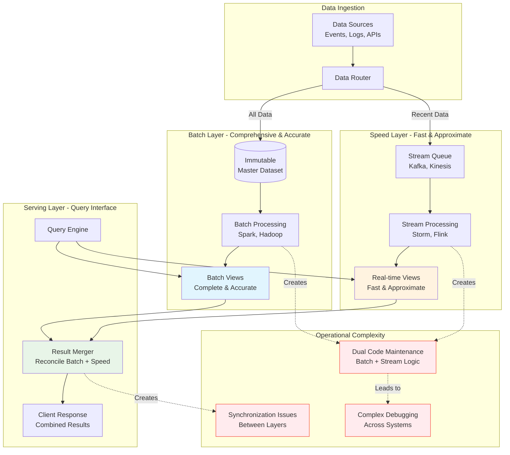

## The Complete Blueprint

Lambda architecture was a pioneering data processing pattern that attempted to solve the challenge of providing both real-time and accurate analytics by maintaining two parallel processing pipelines: a batch layer for comprehensive historical processing and a speed layer for real-time approximations. The architecture split data processing into three layers: the batch layer that processed all historical data to create comprehensive, accurate views; the speed layer that provided fast, approximate results for recent data; and the serving layer that merged results from both systems to answer queries. While innovative for its time, Lambda architecture created significant operational complexity by requiring teams to maintain two entirely different processing systems, write business logic twice (once for batch, once for stream processing), and manage the complex reconciliation between batch and speed layer results. The dual-pipeline approach led to consistency challenges, increased operational overhead, and complicated debugging across two different computational paradigms. Modern unified processing frameworks have largely superseded Lambda architecture by providing single systems that can handle both batch and streaming workloads efficiently.

### What You'll Master

By understanding Lambda architecture, you'll appreciate the **historical evolution** of big data processing patterns and why dual-pipeline approaches emerged, **complexity tradeoffs** between accuracy and latency in data systems, **operational challenges** of maintaining multiple processing paradigms and the lessons learned from this approach, **architectural thinking** about how to balance different system requirements (speed vs. accuracy, complexity vs. capability), and **modern alternatives** that solve the same problems with less operational overhead. You'll understand why unified processing frameworks became the preferred solution while gaining insight into the fundamental challenges Lambda architecture attempted to solve.

## When to Use / When NOT to Use

### When to Use

| Scenario | Why It Fits | Alternative If Not |
|----------|-------------|-------------------|
| High availability required | Pattern provides resilience | Consider simpler approach |
| Scalability is critical | Handles load distribution | Monolithic might suffice |
| Distributed coordination needed | Manages complexity | Centralized coordination |

### When NOT to Use

| Scenario | Why to Avoid | Better Alternative |
|----------|--------------|-------------------|
| Simple applications | Unnecessary complexity | Direct implementation |
| Low traffic systems | Overhead not justified | Basic architecture |
| Limited resources | High operational cost | Simpler patterns |
# Lambda Architecture

!!! danger "🥉 Bronze Tier Pattern"
    **Replaced by unified processing frameworks**
    
    Lambda architecture's dual pipeline approach (batch + stream) created operational complexity. Modern unified processing frameworks eliminate the need for maintaining separate systems.
    
    **Use modern alternatives:**
    - **Apache Beam** for unified batch/stream
    - **Delta Lake/Iceberg** for lakehouse architectures
    - **Flink/Spark Structured Streaming** for unified processing

**Hybrid approach combining batch and stream processing for complete data analytics**

> *"Lambda architecture attempted to get the best of both worlds - batch accuracy and stream latency - but ended up with the complexity of both."*

---

## Essential Questions for Architects

### 🤔 Key Decision Points

1. **Do you need both historical and real-time views?**
   - Only real-time → Use stream processing
   - Only historical → Use batch processing
   - Both required → Consider Lambda (or modern unified)

2. **Can you tolerate eventual consistency?**
   - Strong consistency needed → Avoid Lambda
   - Eventual consistency OK → Lambda viable
   - Read-after-write needed → Stream-only better

3. **What's your operational capacity?**
   - Limited ops team → Avoid Lambda
   - Mature ops → Lambda manageable
   - Cloud-native → Use managed services

4. **How complex are your computations?**
   - Simple aggregations → Stream-only sufficient
   - Complex ML/analytics → Lambda beneficial
   - Iterative algorithms → Batch layer needed

5. **What's your reprocessing frequency?**
   - Rare reprocessing → Stream-focused approach
   - Frequent updates → Lambda helps
   - Continuous refinement → Unified processing

---

## Decision Criteria Matrix

| Factor | Use Lambda | Use Stream-Only | Use Unified |
|--------|------------|-----------------|-------------|
| **Data Volume** | Massive historical | Moderate, recent | Any volume |
| **Latency Needs** | Minutes OK | Seconds required | Flexible |
| **Accuracy Requirement** | Eventually perfect | Good enough | Configurable |
| **Reprocessing** | Frequent | Rare | As needed |
| **Team Skills** | Batch + Stream | Stream focused | Modern stack |
| **Operational Overhead** | Can manage 2 systems | Need simplicity | Prefer unified |

---

## Architectural Decision Framework

---

## Core Architecture Pattern

---

## Architecture Trade-offs

| Aspect | Lambda Benefits | Lambda Drawbacks |
|--------|-----------------|------------------|
| **Accuracy** | ✅ Batch layer ensures correctness | ❌ Complexity of reconciliation |
| **Latency** | ✅ Speed layer provides low latency | ❌ Two systems to optimize |
| **Flexibility** | ✅ Can reprocess historical data | ❌ Code duplication |
| **Fault Tolerance** | ✅ Batch layer can recover | ❌ Two failure modes |
| **Scalability** | ✅ Independent scaling | ❌ Double infrastructure |
| **Maintenance** | ❌ Two codebases | ❌ Synchronization issues |

---

## Level 1: Intuition (5 minutes)

*Start your journey with relatable analogies*

### The Elevator Pitch
[Pattern explanation in simple terms]

### Real-World Analogy
[Everyday comparison that explains the concept]

## Level 2: Foundation (10 minutes)

*Build core understanding*

### Core Concepts
- Key principle 1
- Key principle 2
- Key principle 3

### Basic Example

## Level 3: Deep Dive (15 minutes)

*Understand implementation details*

### How It Really Works
[Technical implementation details]

### Common Patterns
[Typical usage patterns]

## Level 4: Expert (20 minutes)

*Master advanced techniques*

### Advanced Configurations
[Complex scenarios and optimizations]

### Performance Tuning
[Optimization strategies]

## Level 5: Mastery (30 minutes)

*Apply in production*

### Real-World Case Studies
[Production examples from major companies]

### Lessons from the Trenches
[Common pitfalls and solutions]

## Decision Matrix

### Quick Decision Table

| Factor | Low Complexity | Medium Complexity | High Complexity |
|--------|----------------|-------------------|-----------------|
| Team Size | < 5 developers | 5-20 developers | > 20 developers |
| Traffic | < 1K req/s | 1K-100K req/s | > 100K req/s |
| Data Volume | < 1GB | 1GB-1TB | > 1TB |
| **Recommendation** | ❌ Avoid | ⚠️ Consider | ✅ Implement |

## Implementation Strategies

### Layer Comparison

| Layer | Purpose | Technology | Latency | Accuracy |
|-------|---------|------------|---------|----------|
| **Speed Layer** | Real-time insights | Kafka Streams, Flink | Seconds | Approximate |
| **Batch Layer** | Perfect computation | Spark, MapReduce | Hours | Exact |
| **Serving Layer** | Query interface | Druid, Cassandra | Milliseconds | Mixed |

### Common Technology Stacks

| Component | Traditional | Modern | Cloud-Native |
|-----------|-------------|--------|--------------|
| **Ingestion** | Kafka | Kafka/Pulsar | Kinesis/Event Hubs |
| **Batch** | Hadoop/Spark | Spark/Beam | EMR/Dataproc |
| **Stream** | Storm | Flink/Kafka Streams | Kinesis Analytics |
| **Storage** | HDFS | S3/ADLS | Cloud Storage |
| **Serving** | HBase/Cassandra | Druid/Pinot | DynamoDB/Cosmos |

---

## Migration to Modern Architectures

### From Lambda to Unified

### Migration Strategies

| From Lambda | To Modern | Benefits |
|-------------|-----------|----------|
| **Hadoop + Storm** | Apache Beam | Unified API |
| **Spark Batch + Streaming** | Structured Streaming | Single engine |
| **Custom Pipelines** | Flink | True streaming |
| **AWS Lambda** | Kinesis Analytics | Managed service |

---

## Common Implementation Pitfalls

| Pitfall | Impact | Solution |
|---------|--------|----------|
| **Logic Duplication** | Bugs, maintenance burden | Shared libraries |
| **State Synchronization** | Inconsistent results | Event sourcing |
| **Schema Evolution** | Breaking changes | Schema registry |
| **Reprocessing Complexity** | Operational overhead | Automated workflows |
| **Cost Explosion** | 2x infrastructure | Right-size layers |

---

## Modern Alternatives Comparison

| Pattern | Complexity | Use Case | Key Benefit |
|---------|------------|----------|-------------|
| **Lambda** | High | Historical + real-time | Complete view |
| **Kappa** | Medium | Stream-only | Simplicity |
| **Unified Batch/Stream** | Low | Most cases | One system |
| **Lakehouse** | Medium | Analytics focus | Storage efficiency |

---

## Level 1: Intuition (5 minutes)

*Start your journey with relatable analogies*

### The Elevator Pitch
[Pattern explanation in simple terms]

### Real-World Analogy
[Everyday comparison that explains the concept]

## Level 2: Foundation (10 minutes)

*Build core understanding*

### Core Concepts
- Key principle 1
- Key principle 2
- Key principle 3

### Basic Example

## Level 3: Deep Dive (15 minutes)

*Understand implementation details*

### How It Really Works
[Technical implementation details]

### Common Patterns
[Typical usage patterns]

## Level 4: Expert (20 minutes)

*Master advanced techniques*

### Advanced Configurations
[Complex scenarios and optimizations]

### Performance Tuning
[Optimization strategies]

## Level 5: Mastery (30 minutes)

*Apply in production*

### Real-World Case Studies
[Production examples from major companies]

### Lessons from the Trenches
[Common pitfalls and solutions]

## Decision Matrix

### Quick Decision Table

| Factor | Low Complexity | Medium Complexity | High Complexity |
|--------|----------------|-------------------|-----------------|
| Team Size | < 5 developers | 5-20 developers | > 20 developers |
| Traffic | < 1K req/s | 1K-100K req/s | > 100K req/s |
| Data Volume | < 1GB | 1GB-1TB | > 1TB |
| **Recommendation** | ❌ Avoid | ⚠️ Consider | ✅ Implement |

## Implementation Checklist

- [ ] **Requirements Analysis**
  - [ ] Define latency requirements
  - [ ] Identify reprocessing needs
  - [ ] Determine accuracy requirements
  
- [ ] **Technology Selection**
  - [ ] Choose batch framework
  - [ ] Choose stream framework
  - [ ] Select serving layer
  
- [ ] **Architecture Design**
  - [ ] Design data flow
  - [ ] Plan state management
  - [ ] Define merge strategy
  
- [ ] **Operational Planning**
  - [ ] Monitor both pipelines
  - [ ] Plan for failures
  - [ ] Automate reprocessing

---

## Quick Reference

### When Lambda Still Makes Sense

✅ **Consider Lambda for:**
- Regulatory requirements for reprocessing
- Complex ML pipelines needing batch training
- Legacy system migrations
- Proven architecture needs

❌ **Avoid Lambda for:**
- Simple analytics
- Real-time only needs
- Small teams
- Greenfield projects

### Decision Tree

📄 View mermaid code (7 lines)

---

## 🎓 Key Takeaways

1. **Complexity Cost** - Lambda doubles operational overhead
2. **Modern Alternatives** - Unified processing usually better
3. **Legacy Value** - Still valid for specific use cases
4. **Migration Path** - Move to unified when possible
5. **Trade-off Awareness** - Accuracy vs complexity vs latency

---

*"Lambda architecture was a stepping stone to better solutions. Honor its contribution but embrace modern unified approaches."*

---

**Previous**: ← GraphQL Federation | **Next**: → Kappa Architecture

