# Microservices Decomposition Mastery
*A Production-Focused Learning Module on Domain-Driven Design and Service Decomposition*

!!! abstract "Master Enterprise-Scale Service Decomposition"
    This comprehensive learning module transforms experienced developers into microservices decomposition experts through production case studies, hands-on implementation, and battle-tested strategies from companies like Amazon, Netflix, Uber, and Shopify. Learn to decompose complex systems using Domain-Driven Design principles while avoiding the pitfalls that lead to distributed monoliths.

**Estimated Learning Time**: 420+ minutes | **Difficulty**: Expert Level

## Table of Contents

- [🎯 Learning Module Overview](#-learning-module-overview)
- [📋 Prerequisites & Readiness Check](#-prerequisites-readiness-check)
- [🏗️ Part 1: Strategic Domain-Driven Design (90 min)](#-part-1-strategic-domain-driven-design-90-min)
- [⚡ Part 2: Microservices Decomposition Strategies (80 min)](#-part-2-microservices-decomposition-strategies-80-min)
- [🔄 Part 3: Data Decomposition & Transaction Boundaries (70 min)](#-part-3-data-decomposition-transaction-boundaries-70-min)
- [🎯 Part 4: Production Case Studies Deep Dive (60 min)](#-part-4-production-case-studies-deep-dive-60-min)
- [🚫 Part 5: Anti-Patterns & Failure Analysis (50 min)](#-part-5-anti-patterns-failure-analysis-50-min)
- [🔄 Part 6: Migration Strategies & Implementation (70 min)](#-part-6-migration-strategies-implementation-70-min)
- [🧪 Part 7: Testing Strategies for Decomposed Services (40 min)](#-part-7-testing-strategies-for-decomposed-services-40-min)
- [🕸️ Part 8: Service Mesh Integration (30 min)](#-part-8-service-mesh-integration-30-min)
- [💪 Hands-On Exercises](#-hands-on-exercises)
- [📝 Assessment & Validation](#-assessment-validation)
- [📚 Additional Resources](#-additional-resources)

## 🎯 Learning Module Overview

### What You'll Master

<div class="grid cards" markdown>

- :material-sitemap:{ .lg } **Strategic Domain Modeling**
    
    ---
    
    Master bounded context identification, aggregate design, and context mapping strategies that have scaled to thousands of services at companies like Amazon and Netflix.
    
    **Key Skills**: Event storming, domain modeling, context boundaries

- :material-chart-tree:{ .lg } **Decomposition Strategies**
    
    ---
    
    Learn proven strategies for breaking down monoliths: by business capability, by subdomain, by team structure, and by data access patterns.
    
    **Key Skills**: Service boundary design, dependency analysis, coupling reduction

- :material-database-sync:{ .lg } **Data Architecture**
    
    ---
    
    Navigate complex data decomposition challenges including shared databases, transaction boundaries, and consistency guarantees.
    
    **Key Skills**: Database per service, saga patterns, event sourcing

- :material-alert-octagon:{ .lg } **Anti-Pattern Mastery**
    
    ---
    
    Learn from real-world failures including distributed monoliths, chatty interfaces, and data consistency nightmares.
    
    **Key Skills**: Pattern recognition, failure analysis, remediation strategies

</div>

### Real-World Case Studies Covered

| Company | Architecture Challenge | Decomposition Strategy | Key Learnings |
|---------|----------------------|----------------------|---------------|
| **Amazon** | Monolithic e-commerce platform | Service-oriented architecture by business capability | Conway's Law application, team autonomy |
| **Netflix** | DVD shipping to streaming platform | Bounded context decomposition | Event-driven architecture, chaos engineering |
| **Uber** | Ride-hailing monolith | Domain service architecture | Geographic partitioning, real-time processing |
| **Shopify** | Modular monolith evolution | Gradual extraction patterns | Risk mitigation, parallel development |

## 📋 Prerequisites & Readiness Check

!!! warning "Expert-Level Prerequisites Required"
    This module assumes significant experience with distributed systems. Complete the readiness assessment below before proceeding.

### Technical Prerequisites

**Mandatory Experience** (Must Have All):
- [ ] 3+ years designing and implementing distributed systems
- [ ] Deep understanding of API design patterns and REST principles  
- [ ] Experience with relational and NoSQL databases
- [ ] Knowledge of messaging systems (Kafka, RabbitMQ, etc.)
- [ ] Container orchestration experience (Kubernetes, Docker Swarm)
- [ ] Transaction management and ACID property understanding

**Recommended Background** (Nice to Have):
- [ ] Previous exposure to Domain-Driven Design concepts
- [ ] Event sourcing and CQRS implementation experience
- [ ] Service mesh deployment and configuration
- [ ] Observability and monitoring tool usage
- [ ] Experience with gradual migration patterns

### Readiness Self-Assessment

**Rate your proficiency (1-5 scale):**

1. **Domain Modeling**: Can you identify business subdomains and their relationships? ___/5
2. **Service Design**: Can you design REST APIs with proper resource modeling? ___/5  
3. **Data Consistency**: Do you understand CAP theorem trade-offs in practice? ___/5
4. **Distributed Transactions**: Can you explain two-phase commit limitations? ___/5
5. **Team Dynamics**: Have you worked in multiple team service ownership? ___/5

**Minimum Total**: 18/25 to proceed effectively

### Learning Time Commitment

| Learning Component | Time Investment | Skill Level Gained |
|-------------------|-----------------|-------------------|
| **Theory & Concepts** | 120 minutes | Foundation understanding |
| **Case Study Analysis** | 180 minutes | Pattern recognition |
| **Hands-on Exercises** | 150 minutes | Implementation skills |
| **Assessment** | 60 minutes | Competency validation |
| **Additional Reading** | 90 minutes | Advanced mastery |

## 🏗️ Part 1: Strategic Domain-Driven Design (90 min)

### The Foundation of Successful Decomposition

!!! info "Why Strategic DDD Matters"
    Strategic Domain-Driven Design provides the conceptual framework for identifying natural service boundaries. Companies that skip this step often create distributed monoliths that are harder to maintain than the original monolith.

### 1.1 Understanding Business Domains (25 min)

**Core Concept**: A business domain represents the sphere of knowledge and activity around which the business logic revolves.

#### Domain Identification Framework

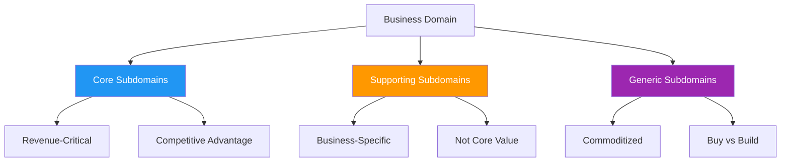

#### Practical Domain Analysis

**E-commerce Platform Example**:

| Subdomain | Type | Characteristics | Service Candidates |
|-----------|------|----------------|-------------------|
| **Product Catalog** | Core | Unique product data, search algorithms | `catalog-service`, `search-service` |
| **Order Management** | Core | Complex business rules, state transitions | `order-service`, `fulfillment-service` |
| **Payment Processing** | Supporting | Business-specific but not differentiating | `payment-service` |
| **User Authentication** | Generic | Standard identity management | `auth-service` (or buy) |
| **Email Notifications** | Generic | Standard messaging functionality | `notification-service` (or SaaS) |

**Key Learning**: Core subdomains should become your most carefully designed microservices with dedicated team ownership.

### 1.2 Bounded Context Identification (30 min)

**Definition**: A bounded context is the boundary within which a particular domain model is defined and applicable.

#### Context Boundary Indicators

**Strong Indicators for Context Boundaries**:

1. **Different Mental Models**: Same entity name, different meaning
   ```
   "Customer" in Sales Context: Lead, prospect, demographic data
   "Customer" in Support Context: Account holder, ticket history, SLA status
   "Customer" in Billing Context: Payer, invoice recipient, payment methods
   ```

2. **Different Data Models**: Same concept, different structure
   ```json
   // Sales Context - Customer
   {
     "customerId": "LEAD_12345",
     "leadScore": 85,
     "acquisitionChannel": "paid_search",
     "estimatedValue": 50000
   }
   
   // Billing Context - Customer  
   {
     "customerId": "BILL_12345", 
     "paymentMethods": ["visa_****1234"],
     "billingAddress": {...},
     "creditLimit": 10000
   }
   ```

3. **Different Business Rules**: Same operation, different logic
   ```
   Order Validation in Sales: Credit check, inventory availability
   Order Validation in Fulfillment: Shipping restrictions, packaging requirements
   Order Validation in Billing: Payment method verification, tax calculation
   ```

#### Context Mapping Patterns

**Practical Context Relationships**:

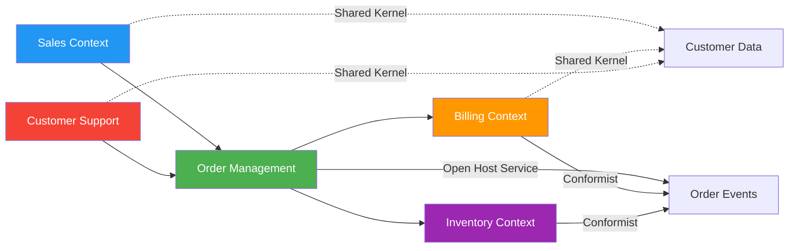

**Context Integration Patterns**:

| Pattern | When to Use | Implementation | Risk Level |
|---------|-------------|---------------|------------|
| **Shared Kernel** | Core shared concepts | Shared library/database | High coupling |
| **Customer-Supplier** | Clear upstream/downstream | API contract | Medium |
| **Conformist** | Must follow external model | Adapt to their API | Low control |
| **Anti-Corruption Layer** | Legacy integration | Translation layer | Added complexity |
| **Open Host Service** | Many consumers | Published API/events | API versioning |

### 1.3 Aggregate Design & Transaction Boundaries (35 min)

**Critical Concept**: Aggregates define consistency boundaries and therefore natural service boundaries.

#### Aggregate Design Rules

**The Four Golden Rules**:

1. **Aggregate = Consistency Boundary**: All invariants within aggregate enforced in single transaction
2. **Reference by ID**: Aggregates reference other aggregates by ID only  
3. **Small Aggregates**: Minimize concurrency conflicts and improve performance
4. **Eventual Consistency Between**: Use domain events for cross-aggregate consistency

#### Production Aggregate Examples

**E-commerce Order Aggregate**:

```java
@Entity
public class Order {
    private OrderId orderId;
    private CustomerId customerId;  // Reference by ID only
    private List<OrderLine> orderLines; // Part of aggregate
    private OrderStatus status;
    private Money totalAmount;
    
    // Business invariant: order total matches line items
    public void addOrderLine(ProductId productId, Quantity quantity, Money unitPrice) {
        // Validate business rules within aggregate
        if (status != OrderStatus.DRAFT) {
            throw new IllegalStateException("Cannot modify confirmed order");
        }
        
        OrderLine orderLine = new OrderLine(productId, quantity, unitPrice);
        orderLines.add(orderLine);
        recalculateTotal(); // Maintain invariant
        
        // Publish domain event for other bounded contexts
        DomainEvents.publish(new OrderLineAdded(orderId, productId, quantity));
    }
    
    public void confirm() {
        // Business rule: order must have at least one line item
        if (orderLines.isEmpty()) {
            throw new IllegalStateException("Order must contain items");
        }
        
        status = OrderStatus.CONFIRMED;
        DomainEvents.publish(new OrderConfirmed(orderId, customerId, totalAmount));
    }
}
```

#### Cross-Aggregate Consistency Patterns

**Saga Pattern for Order Processing**:

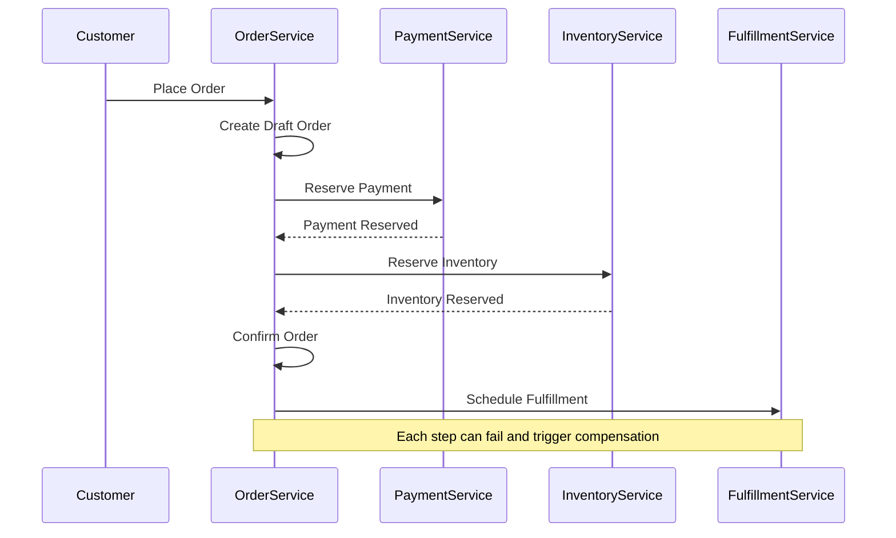

**Key Learning**: Design aggregates first, then map them to microservices. This ensures proper transaction boundaries.

### 1.4 Event Storming for Service Identification

**Event Storming Process**:

1. **Domain Events**: What important things happen in the business?
2. **Commands**: What triggers these events?
3. **Actors**: Who or what triggers commands?
4. **Aggregates**: What enforces business rules?
5. **Bounded Contexts**: Where do models change meaning?

**Practical Workshop Results**:

```
E-commerce Event Storm Results:

Events: OrderPlaced, PaymentProcessed, InventoryReserved, OrderShipped
Commands: PlaceOrder, ProcessPayment, ReserveInventory, ShipOrder  
Actors: Customer, PaymentProcessor, WarehouseManager, ShippingProvider
Aggregates: Order, Payment, InventoryItem, Shipment
Contexts: Sales, Billing, Inventory, Fulfillment

Resulting Services: order-service, payment-service, inventory-service, fulfillment-service
```

## ⚡ Part 2: Microservices Decomposition Strategies (80 min)

### Proven Strategies from Production Systems

!!! success "Strategic Approach"
    Successful decomposition combines multiple strategies rather than relying on a single approach. Learn when and how to apply each strategy based on your specific context.

### 2.1 Decomposition by Business Capability (25 min)

**Definition**: Organize services around stable business functions rather than technical layers.

#### Business Capability Analysis Framework

**Step 1: Capability Mapping**

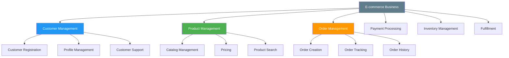

**Amazon's Approach** (Real Production Example):

| Business Capability | Service Responsibility | Team Ownership |
|-------------------|----------------------|----------------|
| **Customer Account** | Registration, authentication, profile | Customer Identity Team |
| **Product Catalog** | Product data, search, recommendations | Catalog Team |
| **Shopping Cart** | Cart management, wishlist, saved items | Shopping Experience Team |
| **Order Processing** | Order creation, modification, tracking | Order Management Team |  
| **Payment** | Payment methods, processing, billing | Payment Team |
| **Inventory** | Stock levels, availability, allocation | Inventory Team |
| **Fulfillment** | Picking, packing, shipping | Fulfillment Team |

#### Service Responsibility Assignment

**Clear Ownership Principles**:

```yaml
Service: customer-service
Responsibilities:
  - Customer registration and authentication
  - Profile management and preferences  
  - Customer communication preferences
  
Does NOT own:
  - Order history (belongs to order-service)
  - Payment methods (belongs to payment-service)
  - Support tickets (belongs to support-service)

Service: order-service  
Responsibilities:
  - Order creation and lifecycle management
  - Order status tracking and updates
  - Order modification and cancellation
  
Does NOT own:
  - Product details (belongs to catalog-service)
  - Payment processing (belongs to payment-service)
  - Inventory allocation (belongs to inventory-service)
```

### 2.2 Decomposition by Subdomain (20 min)

**Strategic vs Tactical Decomposition**:

#### Core Domain Focus Strategy

**Production Example - Netflix Evolution**:

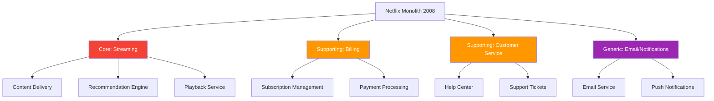

**Domain-Based Service Extraction Order**:

1. **Extract Generic First**: Low risk, high learning value
   ```
   Phase 1: notification-service, email-service
   Benefits: Learn deployment, monitoring, team coordination
   Risk: Minimal business impact if issues occur
   ```

2. **Extract Supporting Domains**: Medium risk, clear boundaries  
   ```
   Phase 2: billing-service, customer-support-service
   Benefits: Clear domain boundaries, separate team ownership
   Risk: Moderate - affects customer experience
   ```

3. **Extract Core Last**: High risk, maximum benefit
   ```
   Phase 3: recommendation-service, content-delivery-service
   Benefits: Maximum scalability and innovation potential
   Risk: High - core business functionality
   ```

### 2.3 Decomposition by Team Structure (Conway's Law) (20 min)

**Conway's Law**: Organizations design systems that mirror their communication structure.

#### Team Topology Patterns

**Spotify's Squad Model Applied**:

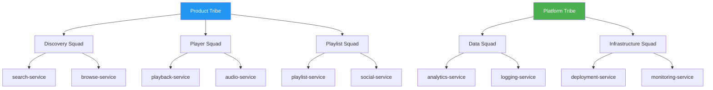

#### Team-Service Alignment Principles

**Effective Team-Service Mapping**:

| Team Structure | Service Ownership | Communication Pattern | Scaling Approach |
|---------------|------------------|---------------------|------------------|
| **2-Pizza Team (6-8 people)** | 1-3 related services | Autonomous decision making | Vertical scaling of team |
| **Squad (4-6 people)** | 1-2 services in domain | Weekly sync with other squads | Horizontal - spawn new squads |
| **Capability Team (8-12 people)** | Service ecosystem (5-8 services) | Formal API contracts | Split into focused squads |

**Anti-Pattern**: Service ownership by multiple teams
```
❌ BAD: order-service owned by Orders Team + Payments Team + Inventory Team
✅ GOOD: order-service owned by Orders Team, with clear API contracts to other teams
```

### 2.4 Data Access Pattern Decomposition (15 min)

**Strategy**: Identify services based on data access patterns and ownership.

#### Database Decomposition Patterns

**Shared Database Anti-Pattern**:
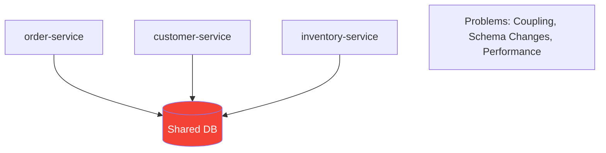

**Database Per Service Pattern**:
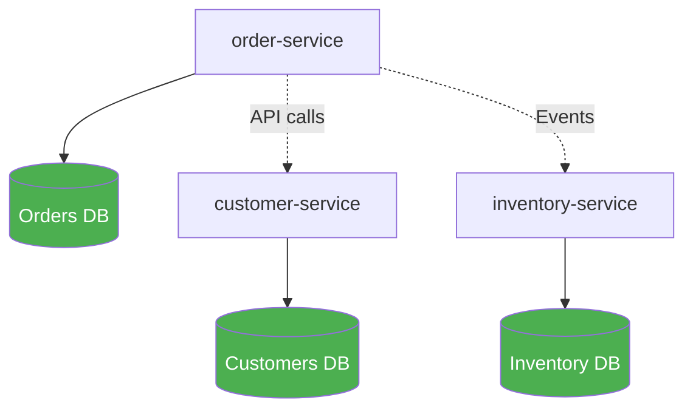

**Data Ownership Matrix**:

| Data Entity | Primary Owner | Read-Only Access | Sync Method |
|-------------|--------------|------------------|-------------|
| **Customer Profile** | customer-service | order-service, support-service | REST API |
| **Product Catalog** | catalog-service | order-service, recommendation-service | Events + Cache |
| **Order Data** | order-service | billing-service, fulfillment-service | Events |
| **Payment Methods** | payment-service | order-service | REST API |
| **Inventory Levels** | inventory-service | order-service, catalog-service | Events |

## 🔄 Part 3: Data Decomposition & Transaction Boundaries (70 min)

### Managing Data in Distributed Systems

!!! warning "Most Complex Challenge"
    Data decomposition is often the most challenging aspect of microservices architecture. This section provides practical strategies used in production systems to handle distributed data management.

### 3.1 Database Per Service Pattern (25 min)

**Core Principle**: Each microservice owns its data and database, accessed only through the service API.

#### Implementation Strategies

**Database Technology Selection**:

```yaml
# Service-Specific Database Choices
order-service:
  database: PostgreSQL
  rationale: ACID transactions, complex queries, reporting
  schema: Relational with order/order_line tables

inventory-service:
  database: Redis + PostgreSQL
  rationale: High-frequency reads/writes, caching
  schema: Key-value for real-time + relational for persistence

catalog-service:
  database: Elasticsearch + PostgreSQL  
  rationale: Full-text search, complex product queries
  schema: Document store + normalized relational

recommendation-service:
  database: Neo4j
  rationale: Graph relationships, recommendation algorithms
  schema: Graph database for user-product relationships
```

**Data Ownership Boundaries**:

```sql
-- ❌ WRONG: Services sharing database tables
-- Both order-service and billing-service access orders table directly

-- ✅ CORRECT: Clear data ownership per service

-- ORDER SERVICE owns:
CREATE TABLE orders (
    order_id UUID PRIMARY KEY,
    customer_id UUID NOT NULL,  -- Reference, not owned data
    status VARCHAR(20) NOT NULL,
    created_at TIMESTAMP NOT NULL
);

CREATE TABLE order_lines (
    line_id UUID PRIMARY KEY,
    order_id UUID REFERENCES orders(order_id),
    product_id UUID NOT NULL,   -- Reference, not owned data  
    quantity INTEGER NOT NULL,
    unit_price DECIMAL(10,2) NOT NULL
);

-- CUSTOMER SERVICE owns:
CREATE TABLE customers (
    customer_id UUID PRIMARY KEY,
    email VARCHAR(255) UNIQUE NOT NULL,
    first_name VARCHAR(100),
    last_name VARCHAR(100)
);

-- No direct foreign keys between services' databases
```

#### Data Synchronization Patterns

**Event-Driven Synchronization**:

```java
// Order Service publishes events
@Service
public class OrderService {
    
    public void confirmOrder(OrderId orderId) {
        Order order = orderRepository.findById(orderId);
        order.confirm();
        orderRepository.save(order);
        
        // Publish event for other services
        OrderConfirmedEvent event = new OrderConfirmedEvent(
            order.getOrderId(),
            order.getCustomerId(),
            order.getTotalAmount(),
            order.getOrderLines()
        );
        
        eventPublisher.publish(event);
    }
}

// Billing Service consumes events
@EventHandler
public class BillingService {
    
    public void handle(OrderConfirmedEvent event) {
        // Create billing record based on order data
        BillingRecord billing = new BillingRecord(
            event.getOrderId(),
            event.getCustomerId(), 
            event.getTotalAmount()
        );
        
        billingRepository.save(billing);
        // Process payment asynchronously
        paymentProcessor.processPayment(billing);
    }
}
```

### 3.2 Managing Distributed Transactions (25 min)

**Challenge**: Maintaining consistency across multiple services without distributed transactions.

#### Saga Pattern Implementation

**Choreography-Based Saga** (Decentralized):

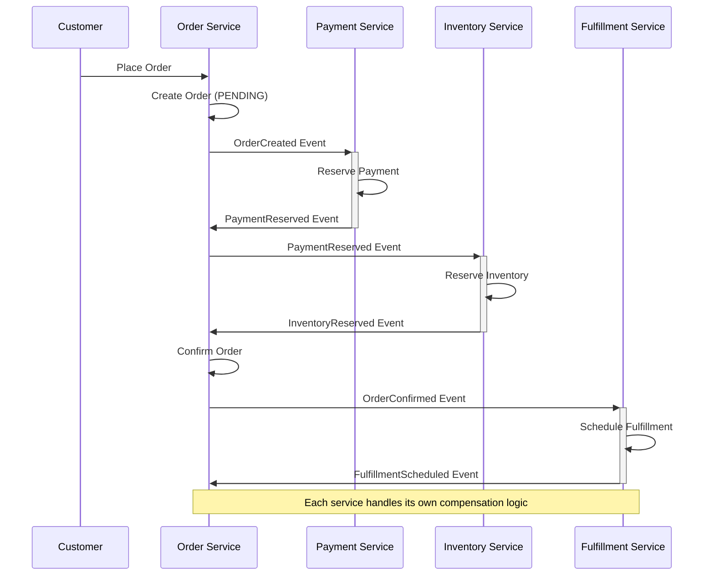

**Orchestration-Based Saga** (Centralized):

```java
@Component
public class OrderProcessingSaga {
    
    public void processOrder(PlaceOrderCommand command) {
        SagaTransaction saga = SagaTransaction.begin();
        
        try {
            // Step 1: Create order
            OrderId orderId = orderService.createOrder(command);
            saga.addCompensation(() -> orderService.cancelOrder(orderId));
            
            // Step 2: Reserve payment
            PaymentReservation payment = paymentService.reservePayment(
                command.getCustomerId(), 
                command.getAmount()
            );
            saga.addCompensation(() -> paymentService.releaseReservation(payment.getId()));
            
            // Step 3: Reserve inventory
            InventoryReservation inventory = inventoryService.reserveItems(
                command.getOrderLines()
            );
            saga.addCompensation(() -> inventoryService.releaseReservation(inventory.getId()));
            
            // Step 4: Confirm order
            orderService.confirmOrder(orderId);
            
            saga.complete();
            
        } catch (Exception e) {
            saga.compensate(); // Run all compensation actions
            throw new OrderProcessingException("Order processing failed", e);
        }
    }
}
```

#### Compensation Strategy Examples

**Production Compensation Patterns**:

| Service | Action | Compensation | Timeout | Retry Strategy |
|---------|--------|--------------|---------|----------------|
| **Payment** | Reserve funds | Release reservation | 30 minutes | 3 attempts, exponential backoff |
| **Inventory** | Reserve items | Return to available stock | 15 minutes | 5 attempts, linear backoff |
| **Shipping** | Create shipment | Cancel shipment | 60 minutes | Manual intervention after 3 attempts |
| **Loyalty** | Award points | Deduct points | N/A | Eventual consistency acceptable |

### 3.3 Event Sourcing for Auditability (20 min)

**Use Case**: When you need complete audit trails and complex business logic replay.

#### Event Store Implementation

**Event-Sourced Order Aggregate**:

```java
@Entity
public class Order {
    private OrderId orderId;
    private List<DomainEvent> uncommittedEvents = new ArrayList<>();
    
    // Current state derived from events
    private OrderStatus status;
    private Money totalAmount;
    private List<OrderLine> orderLines;
    
    // Factory method - creates order from events
    public static Order fromHistory(OrderId orderId, List<DomainEvent> history) {
        Order order = new Order();
        order.orderId = orderId;
        
        for (DomainEvent event : history) {
            order.apply(event);
        }
        
        return order;
    }
    
    // Business methods generate events
    public void addItem(ProductId productId, Quantity quantity, Money unitPrice) {
        // Business rule validation
        if (this.status != OrderStatus.DRAFT) {
            throw new IllegalStateException("Cannot modify confirmed order");
        }
        
        // Generate event
        OrderItemAddedEvent event = new OrderItemAddedEvent(
            orderId, productId, quantity, unitPrice, Instant.now()
        );
        
        // Apply event to update state
        apply(event);
        uncommittedEvents.add(event);
    }
    
    // Event application methods
    private void apply(OrderItemAddedEvent event) {
        OrderLine orderLine = new OrderLine(
            event.getProductId(), 
            event.getQuantity(), 
            event.getUnitPrice()
        );
        this.orderLines.add(orderLine);
        recalculateTotal();
    }
    
    private void apply(OrderConfirmedEvent event) {
        this.status = OrderStatus.CONFIRMED;
    }
}
```

**Event Store Schema**:

```sql
CREATE TABLE event_store (
    event_id UUID PRIMARY KEY,
    aggregate_id UUID NOT NULL,
    aggregate_type VARCHAR(100) NOT NULL,
    event_type VARCHAR(100) NOT NULL,
    event_data JSONB NOT NULL,
    event_version INTEGER NOT NULL,
    occurred_at TIMESTAMP NOT NULL,
    
    UNIQUE(aggregate_id, event_version)
);

CREATE INDEX idx_aggregate_events ON event_store(aggregate_id, event_version);
```

**Query Example - Rebuild Order State**:

```java
@Repository
public class EventSourcedOrderRepository {
    
    public Order findById(OrderId orderId) {
        List<DomainEvent> events = jdbcTemplate.query(
            "SELECT event_type, event_data FROM event_store " +
            "WHERE aggregate_id = ? ORDER BY event_version",
            new Object[]{orderId.getValue()},
            this::mapToEvent
        );
        
        if (events.isEmpty()) {
            throw new OrderNotFoundException(orderId);
        }
        
        return Order.fromHistory(orderId, events);
    }
    
    public void save(Order order) {
        List<DomainEvent> uncommittedEvents = order.getUncommittedEvents();
        
        for (DomainEvent event : uncommittedEvents) {
            jdbcTemplate.update(
                "INSERT INTO event_store (event_id, aggregate_id, aggregate_type, " +
                "event_type, event_data, event_version, occurred_at) VALUES (?, ?, ?, ?, ?, ?, ?)",
                event.getEventId(),
                order.getOrderId(),
                "Order",
                event.getClass().getSimpleName(),
                JsonUtil.toJson(event),
                event.getVersion(),
                event.getOccurredAt()
            );
        }
        
        order.markEventsAsCommitted();
    }
}
```

## 🎯 Part 4: Production Case Studies Deep Dive (60 min)

### Real-World Decomposition Success Stories

!!! info "Learn from Production Experience"
    These case studies reveal the actual strategies, challenges, and solutions used by major companies during their microservices transformations.

### 4.1 Amazon's Service-Oriented Architecture Journey (15 min)

**Timeline**: 2002-2006 transformation from monolithic e-commerce platform

#### The Bezos Mandate (2002)

**Famous Internal Directive**:
> 1. All teams will expose their data and functionality through service interfaces
> 2. Teams must communicate through these interfaces  
> 3. No other form of interprocess communication is allowed
> 4. It doesn't matter what technology you use for your interface
> 5. All service interfaces must be designed from the ground up to be externalizable
> 6. Anyone who doesn't do this will be fired

#### Decomposition Strategy

**Business Capability Mapping**:

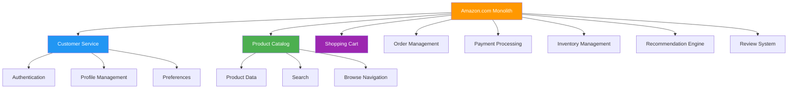

**Key Implementation Decisions**:

| Decision | Rationale | Impact |
|----------|-----------|---------|
| **Database per service** | Eliminate shared database bottlenecks | Enabled independent scaling |
| **REST APIs mandatory** | Standardize communication | Services became externalizable (AWS APIs) |
| **Team ownership** | Conway's Law - teams design what they communicate | Clear accountability |
| **Service contracts** | Backward compatibility requirements | Reduced deployment coordination |

#### Results and Lessons

**Measured Outcomes** (2006):
- **Development velocity**: 2x faster feature delivery
- **System reliability**: 99.9% uptime (from 99.5%)
- **Team autonomy**: 85% reduction in cross-team dependencies
- **Scalability**: Individual services scaled independently

**Key Lessons**:
1. **Top-down mandate essential**: CEO-level commitment required
2. **Service contracts critical**: Backward compatibility prevents breaking changes
3. **Monitoring becomes crucial**: Distributed systems are harder to debug
4. **Team structure matters**: Each service needs dedicated team ownership

### 4.2 Netflix's Bounded Context Evolution (15 min)

**Timeline**: 2007-2012 transformation from DVD-by-mail to streaming platform

#### Domain Evolution Strategy

**Phase 1: Extract Supporting Domains** (2008-2009)
```
Extracted Services:
- billing-service: Subscription management
- customer-service: Account management  
- email-service: Communications
- recommendation-service: Movie suggestions

Strategy: Start with clear domain boundaries, low business risk
```

**Phase 2: Core Domain Decomposition** (2009-2011)
```
Core Streaming Services:
- content-service: Movie metadata, licensing
- encoding-service: Video processing pipeline
- cdn-service: Content delivery optimization
- playback-service: Video streaming logic

Strategy: Extract core capabilities with highest scalability needs
```

#### Bounded Context Identification

**Content Domain Context Map**:

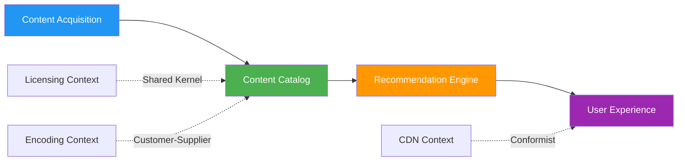

**Context Boundaries Discovery**:

| Context | Mental Model | Key Entities | Business Rules |
|---------|-------------|---------------|----------------|
| **Content Acquisition** | Asset for licensing | Content, License, Territory | Licensing restrictions |
| **Content Catalog** | Searchable media | Movie, Series, Episode | Metadata completeness |  
| **Recommendation** | User preference data | Profile, Rating, View | Algorithm training |
| **Playback** | Streaming session | Stream, Quality, Device | Adaptive bitrate |

#### Event-Driven Architecture

**Production Event Flow**:

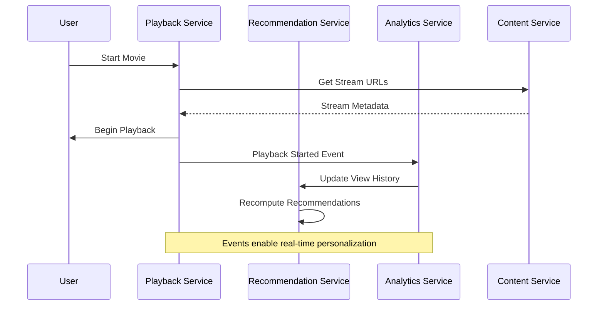

**Key Architectural Decisions**:

```yaml
Event Processing:
  - Apache Kafka for event streaming
  - Schema registry for event contracts
  - Consumer groups for parallel processing
  
Service Communication:
  - Hystrix for circuit breaking
  - Ribbon for load balancing
  - Eureka for service discovery
  
Data Strategy:
  - Cassandra for high-volume time series
  - MySQL for transactional data
  - Elasticsearch for search
```

### 4.3 Uber's Domain Services Architecture (15 min)

**Timeline**: 2013-2017 transformation from monolithic ride-hailing platform

#### Geographic Domain Decomposition

**Regional Service Architecture**:

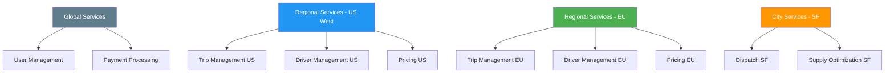

#### Core Domain Service Design

**Trip Management Bounded Context**:

```java
// Trip Aggregate - Core business logic
@Aggregate
public class Trip {
    private TripId tripId;
    private RiderId riderId;
    private DriverId driverId;
    private Location pickupLocation;
    private Location dropoffLocation;
    private TripStatus status;
    private Pricing pricing;
    
    public void requestTrip(RiderId riderId, Location pickup, Location dropoff) {
        // Validate business rules
        if (!isServiceableLocation(pickup)) {
            throw new UnsupportedLocationException("Pickup location not serviceable");
        }
        
        this.tripId = TripId.generate();
        this.riderId = riderId;
        this.pickupLocation = pickup;
        this.dropoffLocation = dropoff;
        this.status = TripStatus.REQUESTED;
        
        // Publish domain event
        DomainEvents.publish(new TripRequestedEvent(
            tripId, riderId, pickup, dropoff, Instant.now()
        ));
    }
    
    public void assignDriver(DriverId driverId, EstimatedArrival eta) {
        if (this.status != TripStatus.REQUESTED) {
            throw new InvalidTripStateException("Trip not in requested state");
        }
        
        this.driverId = driverId;
        this.status = TripStatus.DRIVER_ASSIGNED;
        
        DomainEvents.publish(new DriverAssignedEvent(
            tripId, driverId, eta, Instant.now()
        ));
    }
}
```

**Service Interaction Patterns**:

```yaml
# Real-time trip processing flow
trip-service:
  responsibilities:
    - Trip lifecycle management
    - Business rule enforcement
    - Trip state transitions
    
dispatch-service:
  responsibilities:  
    - Driver matching algorithms
    - Supply-demand optimization
    - Real-time location processing
    
pricing-service:
  responsibilities:
    - Dynamic pricing calculation
    - Surge multiplier computation
    - Fare estimation
    
# Event-driven coordination
events:
  TripRequested: 
    consumers: [dispatch-service, pricing-service, analytics-service]
  DriverAssigned:
    consumers: [notification-service, eta-service, rider-service]
  TripCompleted:
    consumers: [billing-service, rating-service, analytics-service]
```

#### Scaling Challenges and Solutions

**Geographic Data Partitioning**:

```sql
-- Partition trips by geographic region
CREATE TABLE trips (
    trip_id UUID PRIMARY KEY,
    region_code VARCHAR(10) NOT NULL,
    rider_id UUID NOT NULL,
    driver_id UUID,
    status VARCHAR(20) NOT NULL,
    created_at TIMESTAMP NOT NULL
) PARTITION BY LIST (region_code);

-- Regional partitions
CREATE TABLE trips_us_west PARTITION OF trips FOR VALUES IN ('US_WEST');
CREATE TABLE trips_us_east PARTITION OF trips FOR VALUES IN ('US_EAST');  
CREATE TABLE trips_eu PARTITION OF trips FOR VALUES IN ('EU');
```

**Real-Time Processing Architecture**:
- **Apache Kafka**: Event streaming between services
- **Apache Storm**: Real-time trip matching
- **Redis**: Driver location caching
- **Cassandra**: Time-series location data storage

### 4.4 Shopify's Modular Monolith to Microservices (15 min)

**Timeline**: 2015-2020 gradual extraction from Rails monolith

#### Modular Monolith Foundation

**Pre-Microservices Architecture**:

```ruby
# Shopify's modular monolith structure
shopify_core/
├── app/
│   ├── models/
│   │   ├── shop/           # Shop domain
│   │   ├── product/        # Product catalog domain  
│   │   ├── order/          # Order management domain
│   │   ├── payment/        # Payment processing domain
│   │   └── fulfillment/    # Fulfillment domain
│   ├── controllers/
│   │   ├── api/v1/         # External API
│   │   └── admin/          # Merchant interface
│   └── services/
│       ├── order_processing_service.rb
│       ├── payment_service.rb
│       └── inventory_service.rb
└── lib/
    ├── shop_domain/        # Domain logic isolation
    ├── product_domain/     
    └── order_domain/
```

#### Gradual Extraction Strategy

**Phase 1: Extract Infrastructure Services** (2016)
```yaml
Extracted Services:
  - identity-service: Authentication/authorization
  - notification-service: Email/SMS/push notifications  
  - file-service: Image and document storage
  - analytics-service: Event tracking and reporting

Strategy: Low-risk, clear boundaries, reusable across domains
Success Criteria: No impact on core business flows
```

**Phase 2: Extract Supporting Business Services** (2017-2018)
```yaml
Extracted Services:
  - tax-service: Tax calculation and compliance
  - shipping-service: Carrier integrations and rates
  - inventory-service: Stock level management
  - pricing-service: Discount and promotion engine

Strategy: Well-defined business capabilities with clear APIs
Success Criteria: Improved scalability for merchant-facing features
```

**Phase 3: Extract Core Business Services** (2019-2020)
```yaml
Extracted Services:
  - checkout-service: Purchase flow optimization
  - payment-service: Payment processing and fraud detection
  - fulfillment-service: Order processing and tracking

Strategy: Highest business impact, maximum technical complexity
Success Criteria: Support Black Friday/Cyber Monday traffic spikes
```

#### Strangler Fig Pattern Implementation

**Gradual API Migration**:

```ruby
# Monolith controller with progressive migration
class OrdersController < ApplicationController
  def create
    # Feature flag determines routing
    if FeatureFlag.enabled?(:checkout_service_migration, current_shop)
      # Route to new microservice
      result = CheckoutService.create_order(order_params)
      
      if result.success?
        render json: result.order
      else
        render json: { errors: result.errors }, status: 422
      end
    else
      # Legacy monolith code path
      @order = Order.new(order_params)
      
      if @order.save
        OrderProcessingService.new(@order).process!
        render json: @order
      else
        render json: { errors: @order.errors }, status: 422
      end
    end
  end
  
  private
  
  def order_params
    params.require(:order).permit(:shop_id, :customer_id, line_items: [:product_id, :quantity])
  end
end
```

**Database Migration Strategy**:

```sql
-- Phase 1: Dual writes to maintain data consistency
BEGIN;
  -- Update monolith database
  UPDATE orders SET status = 'confirmed' WHERE id = ?;
  
  -- Also update microservice database  
  -- (via API call or event publication)
COMMIT;

-- Phase 2: Read from new service, write to both
-- Gradually shift reads to microservice

-- Phase 3: Full migration
-- Stop writing to monolith database
-- Remove legacy code paths
```

#### Lessons Learned

**Success Factors**:
1. **Modular monolith first**: Clean domain boundaries before extraction
2. **Feature flags essential**: Safe rollback mechanism for each migration
3. **Dual-write strategy**: Maintain consistency during transition
4. **Team ownership**: Each extracted service gets dedicated team
5. **Gradual rollout**: Percentage-based traffic shifting

**Challenges Overcome**:
- **Data consistency**: Careful transaction boundary management
- **Performance**: Initial latency increase from network calls
- **Debugging complexity**: Distributed tracing implementation
- **Team coordination**: Clear API contracts and versioning strategy

## 🚫 Part 5: Anti-Patterns & Failure Analysis (50 min)

### Learning from Production Failures

!!! danger "Critical Knowledge"
    Understanding anti-patterns is as important as knowing patterns. These real-world failures provide valuable lessons for avoiding costly mistakes in microservices decomposition.

### 5.1 The Distributed Monolith Anti-Pattern (15 min)

**Definition**: Microservices that are so tightly coupled they must be deployed together, negating the benefits of the architecture.

#### Identifying Distributed Monoliths

**Warning Signs Checklist**:

- [ ] **Synchronous call chains**: Service A calls B calls C calls D for single user request
- [ ] **Shared databases**: Multiple services reading/writing same database tables  
- [ ] **Coordinated deployments**: Services must be deployed together
- [ ] **Chatty interfaces**: Hundreds of calls between services for single operation
- [ ] **Shared data models**: Same DTOs/entities used across multiple services

#### Real-World Example: E-commerce Anti-Pattern

**The Problem**: Poorly decomposed order processing system

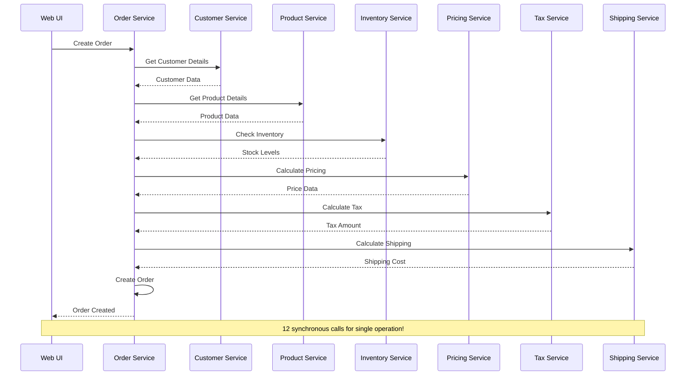

**Impact Analysis**:
- **Latency**: 12 service calls = 12 × 50ms = 600ms minimum latency
- **Reliability**: 99.9%^12 = 98.8% success rate (1.2% failure rate)
- **Scalability**: Bottlenecked by slowest service
- **Development**: Cannot deploy services independently

#### Solution: Proper Service Boundaries

**Corrected Architecture**:

```java
// Aggregate all data in single service call
@Service  
public class OrderCreationService {
    
    @Transactional
    public OrderResult createOrder(CreateOrderCommand command) {
        // Validate within service boundary
        validateOrderData(command);
        
        // Single aggregate encompasses order creation logic
        Order order = new Order(
            command.getCustomerId(),
            command.getOrderLines()
        );
        
        // Apply business rules within aggregate
        order.calculateTotals();
        order.validateInventory();
        order.applyPromotions();
        
        // Persist in single transaction
        orderRepository.save(order);
        
        // Async events for downstream processes
        eventPublisher.publish(new OrderCreatedEvent(order));
        
        return OrderResult.success(order);
    }
}
```

**Event-Driven Coordination**:

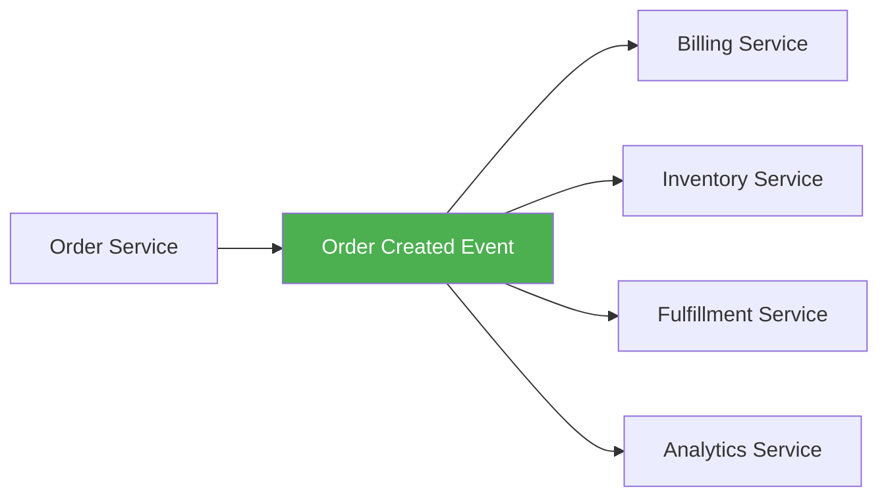

### 5.2 Premature Decomposition Failures (12 min)

**Problem**: Breaking down monoliths before understanding domain boundaries properly.

#### Case Study: Social Media Platform Failure

**Company**: Mid-size social media startup
**Timeline**: 2018-2019 decomposition attempt
**Result**: 18-month delay, $2M additional costs, rollback to monolith

**Flawed Decomposition Strategy**:

```yaml
# Technical layer decomposition (WRONG approach)
Services Created:
  - user-api-service: REST endpoints for users
  - user-data-service: Database access for users  
  - post-api-service: REST endpoints for posts
  - post-data-service: Database access for posts
  - notification-api-service: REST endpoints for notifications
  - notification-data-service: Database access for notifications

Problems:
  - No clear business boundaries
  - Data services tightly coupled to API services
  - Cross-cutting concerns duplicated
  - Complex deployment dependencies
```

**What Should Have Been Done**:

```yaml
# Domain-driven decomposition (CORRECT approach)
Proper Services:
  - user-management-service: Complete user lifecycle
  - content-service: Posts, comments, media management
  - social-graph-service: Friendships, following, blocking
  - notification-service: All notification types and delivery
  - feed-service: Timeline generation and personalization

Benefits:
  - Clear business ownership
  - Cohesive functionality within services
  - Minimal inter-service dependencies
  - Independent deployment capability
```

#### Prevention Strategies

**Domain Understanding Checklist**:

```yaml
Before Decomposition:
  - [ ] Business domain modeling completed
  - [ ] Bounded contexts identified and validated
  - [ ] Data ownership boundaries clear
  - [ ] Team ownership structure defined
  - [ ] Migration strategy documented
  - [ ] Rollback plan established
  - [ ] Success metrics defined

Red Flags to Stop:
  - [ ] "We need to be microservices" (no business driver)
  - [ ] Technical decomposition without domain analysis
  - [ ] Shared database between "microservices"
  - [ ] No clear team ownership structure
  - [ ] Complex deployment dependencies
```

### 5.3 Data Consistency Nightmares (13 min)

**Problem**: Underestimating the complexity of distributed data management.

#### Case Study: Financial Services Rollback

**Company**: Regional bank implementing loan processing system
**Timeline**: 2019-2020 failed microservices initiative
**Result**: Complete rollback after data corruption incidents

**Architecture That Failed**:

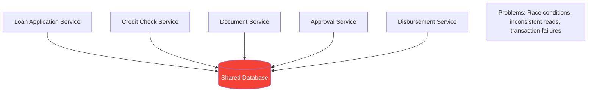

**Specific Failures**:

1. **Race Condition Example**:
```sql
-- Service A reads balance
SELECT balance FROM accounts WHERE account_id = '12345';
-- Returns: $1000

-- Service B simultaneously reads balance  
SELECT balance FROM accounts WHERE account_id = '12345';
-- Returns: $1000

-- Service A deducts $600
UPDATE accounts SET balance = balance - 600 WHERE account_id = '12345';
-- Balance now: $400

-- Service B deducts $500 (based on stale read of $1000)
UPDATE accounts SET balance = balance - 500 WHERE account_id = '12345';  
-- Balance now: -$100 (INCORRECT! Should have failed)
```

2. **Partial Update Failures**:
```java
// Multi-service transaction that failed
try {
    loanService.approveApplication(loanId);        // SUCCESS
    creditService.recordCreditCheck(customerId);  // SUCCESS  
    disbursementService.createPayment(amount);    // FAILURE
    documentService.generateContract(loanId);     // NOT EXECUTED
    
    // Result: Approved loan with no contract, inconsistent state
} catch (Exception e) {
    // No way to rollback across services
}
```

#### Proper Solutions

**Event Sourcing with Saga Pattern**:

```java
// Correct implementation with saga pattern
@SagaOrchestrator
public class LoanProcessingSaga {
    
    public void processLoan(LoanApplicationId loanId) {
        SagaTransaction saga = new SagaTransaction();
        
        try {
            // Step 1: Reserve credit check
            CreditCheckId creditCheckId = creditService.reserveCheck(loanId);
            saga.addCompensation(() -> 
                creditService.cancelCheck(creditCheckId));
            
            // Step 2: Generate documents
            DocumentSet documents = documentService.generateLoanDocs(loanId);
            saga.addCompensation(() -> 
                documentService.deleteDocuments(documents.getId()));
            
            // Step 3: Create disbursement record
            DisbursementId disbursementId = disbursementService.prepareDisbursement(loanId);
            saga.addCompensation(() -> 
                disbursementService.cancelDisbursement(disbursementId));
            
            // Step 4: Final approval (point of no return)
            loanService.finalizeApproval(loanId);
            
            saga.complete();
            
        } catch (Exception e) {
            saga.compensate(); // Runs all compensation actions
            throw new LoanProcessingException("Failed to process loan", e);
        }
    }
}
```

**Event Store Pattern**:

```sql
-- Event-driven approach for auditability  
CREATE TABLE loan_events (
    event_id UUID PRIMARY KEY,
    loan_id UUID NOT NULL,
    event_type VARCHAR(100) NOT NULL,
    event_data JSONB NOT NULL,
    occurred_at TIMESTAMP NOT NULL,
    processed_at TIMESTAMP,
    
    INDEX(loan_id, occurred_at)
);

-- Example events
INSERT INTO loan_events (event_id, loan_id, event_type, event_data, occurred_at) VALUES
(uuid(), 'loan_123', 'LoanApplicationSubmitted', '{"amount": 50000, "term": 60}', NOW()),
(uuid(), 'loan_123', 'CreditCheckCompleted', '{"score": 750, "result": "approved"}', NOW()),
(uuid(), 'loan_123', 'DocumentsGenerated', '{"contract_id": "doc_456"}', NOW()),
(uuid(), 'loan_123', 'LoanApproved', '{"approved_amount": 45000}', NOW());
```

### 5.4 Organizational Anti-Patterns (10 min)

**Problem**: Microservices without proper organizational structure and culture.

#### Conway's Law Violations

**Anti-Pattern**: Single team managing multiple services
```
Team Structure (WRONG):
├── Backend Team (10 developers)
│   ├── Manages: user-service, order-service, payment-service
│   ├── Manages: inventory-service, shipping-service  
│   └── Problem: No clear ownership, coordination overhead
```

**Correct Pattern**: Service ownership alignment
```
Team Structure (CORRECT):  
├── User Experience Team (6 developers)
│   └── Owns: user-service, profile-service
├── Commerce Team (8 developers)  
│   └── Owns: order-service, cart-service
├── Payment Team (5 developers)
│   └── Owns: payment-service, billing-service
└── Fulfillment Team (7 developers)
    └── Owns: inventory-service, shipping-service
```

#### Cultural Anti-Patterns

**Shared Database Culture**:
```yaml
Problem Behaviors:
  - Teams directly accessing other teams' databases
  - "It's faster to query directly than call the API"
  - Resistance to API-first development
  - Database schema changes requiring coordination

Solution:
  - Database access policies and enforcement
  - API performance SLAs and monitoring
  - Team incentives aligned with service boundaries
  - Regular architecture reviews and governance
```

**Deployment Coordination Culture**:
```yaml
Problem Behaviors:
  - Weekly "deployment coordination meetings"
  - Services that cannot be deployed independently  
  - Fear of breaking downstream services
  - Manual testing across all services

Solution:
  - Contract testing and API versioning
  - Automated deployment pipelines
  - Feature flags for gradual rollouts
  - Service-level monitoring and alerting
```

## 🔄 Part 6: Migration Strategies & Implementation (70 min)

### Practical Approaches to Monolith Decomposition

!!! tip "Gradual Migration Success"
    Successful migrations are almost always gradual, allowing teams to learn and adapt while maintaining system stability.

### 6.1 The Strangler Fig Pattern (20 min)

**Strategy**: Gradually replace parts of the monolith by intercepting requests and routing them to new microservices.

#### Implementation Architecture

**Phase 1: Initial Setup**

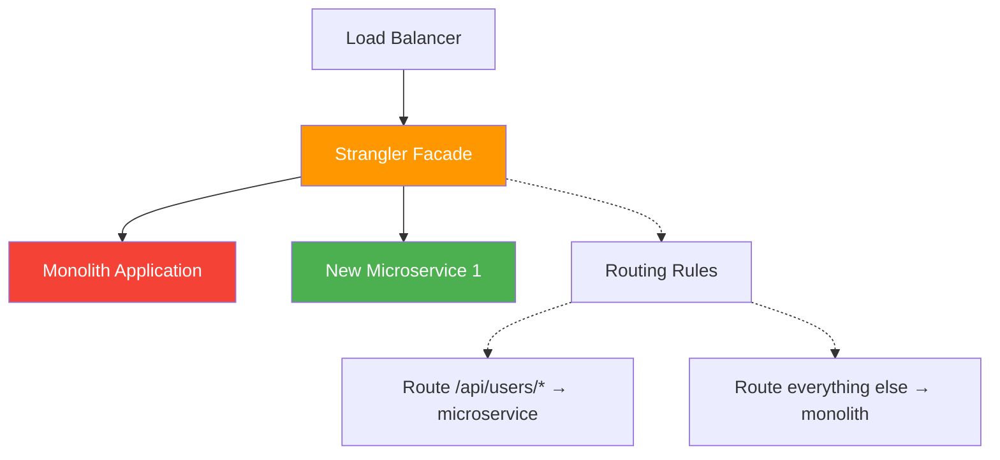

**Production Implementation Example**:

```yaml
# Nginx configuration for strangler facade
upstream monolith {
    server monolith-app-1:8080;
    server monolith-app-2:8080;
}

upstream user-service {
    server user-service-1:8080;
    server user-service-2:8080;
}

server {
    listen 80;
    
    # Route user management to microservice
    location ~ ^/api/users/ {
        proxy_pass http://user-service;
        proxy_set_header Host $host;
        proxy_set_header X-Real-IP $remote_addr;
    }
    
    # Route everything else to monolith
    location / {
        proxy_pass http://monolith;
        proxy_set_header Host $host;
        proxy_set_header X-Real-IP $remote_addr;
    }
}
```

#### Database Migration Strategy

**Dual Writing Pattern**:

```java
// Monolith code during migration
@Service
public class UserService {
    
    @Autowired
    private UserRepository legacyUserRepository;
    
    @Autowired  
    private UserMicroserviceClient userMicroserviceClient;
    
    @Autowired
    private FeatureToggle featureToggle;
    
    @Transactional
    public User createUser(CreateUserRequest request) {
        // Always write to legacy database for consistency
        User legacyUser = legacyUserRepository.save(
            new User(request.getEmail(), request.getName())
        );
        
        // Also write to new microservice (async to avoid blocking)
        if (featureToggle.isEnabled("DUAL_WRITE_USER_SERVICE")) {
            CompletableFuture.runAsync(() -> {
                try {
                    userMicroserviceClient.createUser(
                        new CreateUserMicroserviceRequest(
                            legacyUser.getId(),
                            legacyUser.getEmail(),
                            legacyUser.getName()
                        )
                    );
                } catch (Exception e) {
                    // Log error but don't fail main transaction
                    log.error("Failed to sync user to microservice", e);
                    // Could add to retry queue here
                }
            });
        }
        
        return legacyUser;
    }
    
    public User getUser(Long userId) {
        if (featureToggle.isEnabled("READ_FROM_USER_SERVICE", userId)) {
            // Gradually shift reads to microservice
            return userMicroserviceClient.getUser(userId);
        } else {
            return legacyUserRepository.findById(userId);
        }
    }
}
```

#### Migration Timeline Example

**6-Month User Service Migration**:

| Phase | Duration | Activities | Success Criteria |
|-------|----------|------------|------------------|
| **Setup** | 2 weeks | Deploy microservice, implement dual writes | Dual writes working without errors |
| **Read Migration** | 4 weeks | Gradually shift reads using feature flags | 100% reads from microservice |
| **Write Migration** | 4 weeks | Switch writes to microservice, stop dual writes | All writes go to microservice |
| **Cleanup** | 2 weeks | Remove legacy code, database cleanup | Monolith has no user-related code |

### 6.2 Branch by Abstraction (15 min)

**Strategy**: Create abstraction layer in monolith to enable parallel development of replacement services.

#### Implementation Pattern

**Step 1: Create Abstraction**

```java
// Original monolith code
@Service
public class OrderService {
    
    public void processOrder(Order order) {
        // Direct database access
        orderRepository.save(order);
        
        // Direct method calls
        inventoryService.reserveItems(order.getItems());
        paymentService.processPayment(order.getPayment());
        
        // Email notification
        emailService.sendOrderConfirmation(order);
    }
}

// Step 1: Introduce abstraction
public interface OrderProcessor {
    void processOrder(Order order);
}

@Service("legacyOrderProcessor")
public class LegacyOrderProcessor implements OrderProcessor {
    // Move existing logic here
    public void processOrder(Order order) {
        orderRepository.save(order);
        inventoryService.reserveItems(order.getItems());
        paymentService.processPayment(order.getPayment());
        emailService.sendOrderConfirmation(order);
    }
}

@Service
public class OrderService {
    
    @Autowired
    @Qualifier("legacyOrderProcessor")
    private OrderProcessor orderProcessor;
    
    public void processOrder(Order order) {
        orderProcessor.processOrder(order);
    }
}
```

**Step 2: Implement New Version**

```java
@Service("microserviceOrderProcessor")
public class MicroserviceOrderProcessor implements OrderProcessor {
    
    @Autowired
    private OrderServiceClient orderServiceClient;
    
    public void processOrder(Order order) {
        // Call new microservices
        CreateOrderRequest request = new CreateOrderRequest(
            order.getCustomerId(),
            order.getItems(),
            order.getShippingAddress()
        );
        
        orderServiceClient.createOrder(request);
    }
}
```

**Step 3: Switch Implementation**

```java
@Service
public class OrderService {
    
    @Value("${order.processor.type:legacy}")
    private String processorType;
    
    @Autowired
    private ApplicationContext applicationContext;
    
    public void processOrder(Order order) {
        OrderProcessor processor = (OrderProcessor) applicationContext.getBean(
            processorType + "OrderProcessor"
        );
        
        processor.processOrder(order);
    }
}

# Configuration switch
# application.properties
order.processor.type=microservice  # Switch to new implementation
```

### 6.3 Database Decomposition Strategies (20 min)

**Challenge**: Separating shared database while maintaining data integrity.

#### Shared Database Anti-Pattern

**Current State Problem**:

```sql
-- Monolithic database with tangled relationships
CREATE TABLE customers (id, email, name, created_at);
CREATE TABLE orders (id, customer_id, total, status, created_at);
CREATE TABLE order_items (id, order_id, product_id, quantity, price);
CREATE TABLE products (id, name, description, price, inventory_count);
CREATE TABLE payments (id, order_id, amount, status, processed_at);

-- Problem: All services access all tables
-- order-service reads customers, products, payments
-- customer-service reads orders for customer history
-- inventory-service reads order_items for allocation
```

#### Database-First Decomposition

**Strategy**: Start by separating databases, then extract services.

**Phase 1: Database Separation**

```sql
-- Customer Service Database
CREATE DATABASE customer_service;
USE customer_service;

CREATE TABLE customers (
    id UUID PRIMARY KEY,
    email VARCHAR(255) UNIQUE NOT NULL,
    name VARCHAR(200) NOT NULL,
    created_at TIMESTAMP NOT NULL
);

-- Order Service Database  
CREATE DATABASE order_service;
USE order_service;

CREATE TABLE orders (
    id UUID PRIMARY KEY,
    customer_id UUID NOT NULL,  -- Reference only, no FK
    total DECIMAL(10,2) NOT NULL,
    status VARCHAR(20) NOT NULL,
    created_at TIMESTAMP NOT NULL
);

CREATE TABLE order_items (
    id UUID PRIMARY KEY,
    order_id UUID NOT NULL REFERENCES orders(id),
    product_id UUID NOT NULL,   -- Reference only, no FK
    quantity INTEGER NOT NULL,
    unit_price DECIMAL(10,2) NOT NULL
);
```

**Phase 2: Data Migration Pipeline**

```java
@Component
public class DatabaseMigrationService {
    
    @Scheduled(fixedDelay = 60000) // Run every minute
    public void syncCustomerData() {
        // Read from monolith database
        List<Customer> legacyCustomers = legacyCustomerRepository.findModifiedSince(
            lastSyncTimestamp
        );
        
        // Write to microservice database
        for (Customer customer : legacyCustomers) {
            CustomerEntity microserviceCustomer = new CustomerEntity(
                customer.getId(),
                customer.getEmail(), 
                customer.getName(),
                customer.getCreatedAt()
            );
            
            microserviceCustomerRepository.save(microserviceCustomer);
        }
        
        lastSyncTimestamp = Instant.now();
    }
    
    @EventListener
    public void handleCustomerUpdated(CustomerUpdatedEvent event) {
        // Real-time sync for critical updates
        microserviceCustomerRepository.updateCustomer(
            event.getCustomerId(),
            event.getEmail(),
            event.getName()
        );
    }
}
```

#### Event-Driven Data Consistency

**Change Data Capture Pattern**:

```yaml
# Debezium CDC configuration
debezium:
  connectors:
    - name: customer-connector
      config:
        connector.class: io.debezium.connector.mysql.MySqlConnector
        database.hostname: legacy-db-host
        database.port: 3306
        database.user: debezium
        database.password: dbz123
        database.server.id: 184054
        database.server.name: legacy-customers
        table.whitelist: customer_service.customers
        
    - name: order-connector  
      config:
        connector.class: io.debezium.connector.mysql.MySqlConnector
        database.hostname: legacy-db-host
        database.port: 3306
        database.user: debezium  
        database.password: dbz123
        database.server.id: 184055
        database.server.name: legacy-orders
        table.whitelist: order_service.orders,order_service.order_items
```

**Event Processing**:

```java
@KafkaListener(topics = "legacy-customers.customer_service.customers")
public void handleCustomerChange(CustomerChangeEvent event) {
    switch (event.getOperation()) {
        case CREATE:
        case UPDATE:
            customerService.upsertCustomer(
                event.getAfter().getId(),
                event.getAfter().getEmail(),
                event.getAfter().getName()
            );
            break;
            
        case DELETE:
            customerService.deleteCustomer(event.getBefore().getId());
            break;
    }
}
```

### 6.4 Team Organization & Ownership (15 min)

**Critical Success Factor**: Align team structure with desired service architecture.

#### Team Formation Strategies

**Two-Pizza Team Structure**:

```yaml
User Management Team (6 people):
  responsibilities:
    - user-service: Registration, authentication, profile management
    - notification-service: Email, SMS, push notifications  
  skills:
    - 2 Senior developers (Java/Spring Boot)
    - 2 Mid-level developers  
    - 1 DevOps engineer
    - 1 QA engineer
  ownership:
    - Code repositories and CI/CD pipelines
    - Production deployment and monitoring
    - On-call rotation and incident response
    - API contracts and documentation

Order Management Team (8 people):
  responsibilities:
    - order-service: Order lifecycle management
    - cart-service: Shopping cart and wishlist
    - pricing-service: Dynamic pricing and promotions
  skills:
    - 3 Senior developers (distributed systems experience)
    - 3 Mid-level developers
    - 1 DevOps engineer  
    - 1 QA engineer
  ownership:
    - End-to-end order processing reliability
    - Performance and scalability
    - Business metric tracking (conversion rates)
```

#### Ownership Responsibilities Matrix

| Responsibility | Team Owner | Shared | Platform |
|----------------|------------|--------|----------|
| **Service code** | Service Team | - | - |
| **API design** | Service Team | Architecture review | Standards |
| **Database schema** | Service Team | - | Migration tools |
| **Deployment** | Service Team | - | CI/CD platform |
| **Monitoring** | Service Team | - | Observability platform |
| **On-call** | Service Team | Escalation to platform | Infrastructure issues |
| **Capacity planning** | Service Team | Architecture review | Resource allocation |
| **Security** | Service Team | Security review | Security platform |

#### Migration Team Coordination

**Coordination Mechanisms**:

```yaml
Weekly Service Owner Sync:
  attendees: Lead from each service team
  duration: 30 minutes
  agenda:
    - Cross-service integration updates
    - API contract changes  
    - Performance and reliability issues
    - Migration progress and blockers

Monthly Architecture Review:
  attendees: Service leads + architects
  duration: 90 minutes
  agenda:
    - New service proposals
    - Major architectural changes
    - Service boundary adjustments
    - Technology standard updates

Quarterly Migration Retrospective:
  attendees: All team members involved in migration
  duration: 2 hours
  agenda:
    - What worked well
    - What could be improved
    - Process adjustments
    - Knowledge sharing
```

**Success Metrics by Team**:

| Team | Technical Metrics | Business Metrics | Process Metrics |
|------|------------------|------------------|-----------------|
| **User Management** | 99.9% auth uptime, <100ms login | User registration funnel | Deploy frequency, lead time |
| **Order Management** | 99.95% order processing, <200ms cart | Order conversion rate, cart abandonment | Incident MTTR, team autonomy |
| **Payment** | Zero payment data loss, PCI compliance | Payment success rate, fraud detection | Security review frequency |

## 🧪 Part 7: Testing Strategies for Decomposed Services (40 min)

### Comprehensive Testing in Distributed Systems

!!! info "Testing Pyramid Evolution"
    Microservices require a different testing approach than monoliths. The traditional testing pyramid needs to be adapted for distributed systems challenges.

### 7.1 Testing Strategy Overview (10 min)

#### Microservices Testing Pyramid

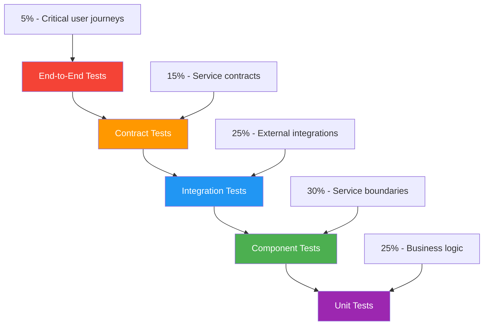

**Testing Investment Distribution**:

| Test Level | Monolith | Microservices | Reason for Change |
|-----------|----------|---------------|-------------------|
| **Unit Tests** | 70% | 25% | Less integration complexity per service |
| **Component Tests** | 20% | 30% | Service boundary testing critical |
| **Integration Tests** | 5% | 25% | External dependencies increase |
| **Contract Tests** | 0% | 15% | Service interaction validation |
| **End-to-End Tests** | 5% | 5% | Same coverage, different complexity |

### 7.2 Contract Testing Implementation (15 min)

**Purpose**: Ensure service interfaces remain compatible during independent development.

#### Consumer-Driven Contract Testing

**Pact Implementation Example**:

```java
// Consumer test (order-service testing customer-service)
@ExtendWith(PactConsumerTestExt.class)
@PactTestFor(providerName = "customer-service")
public class CustomerServiceContractTest {
    
    @Pact(consumer = "order-service")
    public RequestResponsePact getCustomerPact(PactDslWithProvider builder) {
        return builder
            .given("customer exists with ID 12345")
            .uponReceiving("a request for customer details")
                .path("/api/customers/12345")
                .method("GET")
                .headers("Authorization", "Bearer valid-token")
            .willRespondWith()
                .status(200)
                .headers("Content-Type", "application/json")
                .body(LambdaDsl.newJsonObject(o -> o
                    .stringValue("customerId", "12345")
                    .stringValue("email", "john.doe@example.com")
                    .stringValue("name", "John Doe")
                    .stringValue("status", "ACTIVE")
                ))
            .toPact();
    }
    
    @Test
    @PactTestFor(pactMethod = "getCustomerPact")
    public void testCustomerRetrieval(MockServer mockServer) {
        // Configure service to use mock server
        CustomerServiceClient client = new CustomerServiceClient(mockServer.getUrl());
        
        // Test the interaction
        Customer customer = client.getCustomer("12345");
        
        assertThat(customer.getCustomerId()).isEqualTo("12345");
        assertThat(customer.getEmail()).isEqualTo("john.doe@example.com");
        assertThat(customer.getName()).isEqualTo("John Doe");
        assertThat(customer.getStatus()).isEqualTo(CustomerStatus.ACTIVE);
    }
}
```

**Provider Verification**:

```java
// Provider test (customer-service verifying contract)
@SpringBootTest(webEnvironment = SpringBootTest.WebEnvironment.RANDOM_PORT)
@Provider("customer-service")
@PactFolder("pacts")
public class CustomerServiceProviderTest {
    
    @LocalServerPort
    private int port;
    
    @TestTemplate
    @ExtendWith(PactVerificationInvocationContextProvider.class)
    public void verifyPact(PactVerificationContext context) {
        context.verifyInteraction();
    }
    
    @BeforeEach
    public void setupTestTarget(PactVerificationContext context) {
        context.setTarget(new HttpTestTarget("localhost", port));
    }
    
    @State("customer exists with ID 12345")
    public void customerExists() {
        // Setup test data
        Customer testCustomer = new Customer(
            "12345", 
            "john.doe@example.com", 
            "John Doe", 
            CustomerStatus.ACTIVE
        );
        customerRepository.save(testCustomer);
    }
}
```

#### Schema Evolution Testing

**API Version Compatibility**:

```yaml
# Contract testing for API evolution
contract_tests:
  customer_service:
    v1_compatibility:
      - consumer: order-service-v1
        contract: customer-v1-contract.json
        required: true
        
      - consumer: billing-service-v1  
        contract: customer-v1-contract.json
        required: true
        
    v2_compatibility:
      - consumer: order-service-v2
        contract: customer-v2-contract.json
        required: false  # Optional for new features
        
# Contract evolution rules
evolution_rules:
  - name: "Additive changes only"
    rule: "New fields can be added but existing fields cannot be removed"
    
  - name: "Backward compatibility"  
    rule: "v1 consumers must continue working with v2 provider"
    
  - name: "Graceful field deprecation"
    rule: "Deprecated fields supported for minimum 6 months"
```

### 7.3 Component Testing (10 min)

**Purpose**: Test service in isolation with all external dependencies mocked.

#### Test Container Implementation

```java
@Testcontainers
@SpringBootTest(webEnvironment = SpringBootTest.WebEnvironment.RANDOM_PORT)
public class OrderServiceComponentTest {
    
    @Container
    static PostgreSQLContainer<?> postgres = new PostgreSQLContainer<>("postgres:13")
            .withDatabaseName("order_service_test")
            .withUsername("test")  
            .withPassword("test");
            
    @Container
    static KafkaContainer kafka = new KafkaContainer(DockerImageName.parse("confluentinc/cp-kafka:6.2.0"));
    
    @Container
    static MockServerContainer mockServer = new MockServerContainer(DockerImageName.parse("jamesdbloom/mockserver:mockserver-5.11.2"));
    
    @DynamicPropertySource
    static void configureProperties(DynamicPropertyRegistry registry) {
        registry.add("spring.datasource.url", postgres::getJdbcUrl);
        registry.add("spring.datasource.username", postgres::getUsername);
        registry.add("spring.datasource.password", postgres::getPassword);
        
        registry.add("spring.kafka.bootstrap-servers", kafka::getBootstrapServers);
        
        registry.add("customer-service.base-url", 
                () -> mockServer.getEndpoint());
    }
    
    @BeforeEach
    public void setupMocks() {
        // Setup customer service mock
        new MockServerClient(mockServer.getHost(), mockServer.getServerPort())
                .when(request()
                        .withMethod("GET")
                        .withPath("/api/customers/.*"))
                .respond(response()
                        .withStatusCode(200)
                        .withHeader("Content-Type", "application/json")
                        .withBody("""
                                {
                                    "customerId": "12345",
                                    "email": "test@example.com",
                                    "name": "Test Customer",
                                    "status": "ACTIVE"
                                }
                                """));
    }
    
    @Test
    public void shouldCreateOrderSuccessfully() {
        // Given
        CreateOrderRequest request = CreateOrderRequest.builder()
                .customerId("12345")
                .orderLines(List.of(
                        OrderLine.builder()
                                .productId("product-1")
                                .quantity(2)
                                .unitPrice(new BigDecimal("29.99"))
                                .build()
                ))
                .build();
        
        // When
        ResponseEntity<OrderResponse> response = restTemplate.postForEntity(
                "/api/orders", request, OrderResponse.class);
        
        // Then
        assertThat(response.getStatusCode()).isEqualTo(HttpStatus.CREATED);
        assertThat(response.getBody().getOrderId()).isNotNull();
        assertThat(response.getBody().getStatus()).isEqualTo("PENDING");
        assertThat(response.getBody().getTotalAmount()).isEqualTo(new BigDecimal("59.98"));
        
        // Verify event published
        verify(eventPublisher).publish(any(OrderCreatedEvent.class));
    }
}
```

### 7.4 Chaos Engineering for Resilience (5 min)

**Purpose**: Test system behavior under failure conditions.

#### Chaos Experiments

```java
@Component
public class ChaosEngineeringTests {
    
    @Scheduled(cron = "0 0 2 * * ?") // Run at 2 AM daily
    public void runChaosExperiments() {
        if (chaosConfig.isEnabled() && !chaosConfig.isProductionTime()) {
            runNetworkLatencyExperiment();
            runServiceFailureExperiment();  
            runDatabaseConnectionExperiment();
        }
    }
    
    private void runNetworkLatencyExperiment() {
        ChaosExperiment experiment = ChaosExperiment.builder()
                .name("Network Latency Test")
                .description("Add 500ms latency to customer-service calls")
                .duration(Duration.ofMinutes(10))
                .target(Target.service("customer-service"))
                .fault(NetworkLatencyFault.of(Duration.ofMillis(500)))
                .successCriteria(List.of(
                        "Order processing success rate > 95%",
                        "Order API response time < 2 seconds",
                        "No cascading failures to other services"
                ))
                .build();
                
        ChaosResult result = chaosEngine.run(experiment);
        
        if (!result.isSuccessful()) {
            alerting.sendAlert("Chaos experiment failed", result.getFailures());
        }
    }
    
    private void runServiceFailureExperiment() {
        ChaosExperiment experiment = ChaosExperiment.builder()
                .name("Service Failure Test")
                .description("Kill 50% of inventory-service instances")
                .duration(Duration.ofMinutes(5))
                .target(Target.service("inventory-service"))
                .fault(KillInstancesFault.percentage(50))
                .successCriteria(List.of(
                        "Order processing continues with degraded inventory checks",
                        "Circuit breaker activates within 30 seconds",
                        "Service recovers within 2 minutes"
                ))
                .build();
                
        chaosEngine.run(experiment);
    }
}
```

## 🕸️ Part 8: Service Mesh Integration (30 min)

### Production-Ready Service Communication

!!! tip "Service Mesh Benefits"
    Service mesh provides cross-cutting concerns like security, observability, and traffic management without requiring application code changes.

### 8.1 Service Mesh Architecture (15 min)

#### Istio Implementation for Microservices

**Service Mesh Components**:

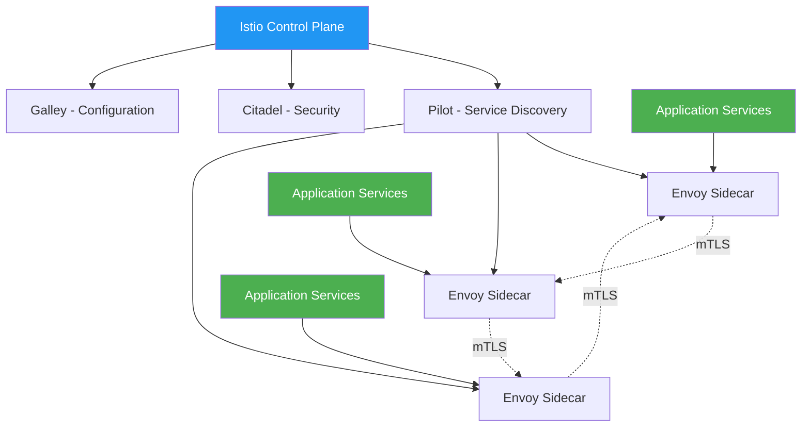

**Istio Configuration for Microservices**:

```yaml
# Service mesh configuration
apiVersion: install.istio.io/v1alpha1
kind: IstioOperator
metadata:
  name: microservices-mesh
spec:
  values:
    global:
      meshID: production-mesh
      network: production-network
      
  components:
    pilot:
      k8s:
        resources:
          requests:
            memory: "128Mi"
            cpu: "100m"
          limits:
            memory: "256Mi" 
            cpu: "200m"
            
    ingressGateways:
    - name: istio-ingressgateway
      enabled: true
      k8s:
        service:
          type: LoadBalancer
```

**Service Configuration**:

```yaml
# Order service with service mesh
apiVersion: apps/v1
kind: Deployment
metadata:
  name: order-service
  labels:
    app: order-service
    version: v1
spec:
  replicas: 3
  selector:
    matchLabels:
      app: order-service
      version: v1
  template:
    metadata:
      labels:
        app: order-service
        version: v1
      annotations:
        sidecar.istio.io/inject: "true"  # Enable sidecar injection
    spec:
      containers:
      - name: order-service
        image: order-service:1.2.0
        ports:
        - containerPort: 8080
        env:
        - name: CUSTOMER_SERVICE_URL
          value: "http://customer-service:8080"
        - name: INVENTORY_SERVICE_URL  
          value: "http://inventory-service:8080"
---
apiVersion: v1
kind: Service
metadata:
  name: order-service
  labels:
    app: order-service
spec:
  ports:
  - port: 8080
    targetPort: 8080
    name: http
  selector:
    app: order-service
```

### 8.2 Traffic Management & Resilience (15 min)

#### Advanced Traffic Routing

**Canary Deployment Configuration**:

```yaml
# Traffic split for gradual rollout
apiVersion: networking.istio.io/v1beta1
kind: VirtualService
metadata:
  name: order-service-canary
spec:
  hosts:
  - order-service
  http:
  - match:
    - headers:
        canary-user:
          exact: "true"
    route:
    - destination:
        host: order-service
        subset: v2
      weight: 100
  - route:
    - destination:
        host: order-service
        subset: v1
      weight: 90    # 90% to stable version
    - destination:
        host: order-service
        subset: v2
      weight: 10    # 10% to canary version
---
apiVersion: networking.istio.io/v1beta1
kind: DestinationRule
metadata:
  name: order-service
spec:
  host: order-service
  subsets:
  - name: v1
    labels:
      version: v1
  - name: v2
    labels:
      version: v2
  trafficPolicy:
    connectionPool:
      tcp:
        maxConnections: 100
      http:
        http1MaxPendingRequests: 50
        maxRequestsPerConnection: 10
    circuitBreaker:
      consecutive5xxErrors: 3
      interval: 30s
      baseEjectionTime: 30s
```

**Fault Injection for Testing**:

```yaml
# Inject faults to test resilience
apiVersion: networking.istio.io/v1beta1
kind: VirtualService
metadata:
  name: inventory-service-fault-injection
spec:
  hosts:
  - inventory-service
  http:
  - match:
    - headers:
        test-fault-injection:
          exact: "true"
    fault:
      delay:
        percentage:
          value: 50    # 50% of requests
        fixedDelay: 2s # Add 2 second delay
      abort:
        percentage:
          value: 10    # 10% of requests
        httpStatus: 503  # Return 503 error
    route:
    - destination:
        host: inventory-service
  - route:
    - destination:
        host: inventory-service
```

**Security Policies**:

```yaml
# mTLS enforcement
apiVersion: security.istio.io/v1beta1
kind: PeerAuthentication
metadata:
  name: default
spec:
  mtls:
    mode: STRICT  # Require mTLS for all services
---
# Authorization policies
apiVersion: security.istio.io/v1beta1
kind: AuthorizationPolicy
metadata:
  name: order-service-policy
spec:
  selector:
    matchLabels:
      app: order-service
  rules:
  - from:
    - source:
        principals: ["cluster.local/ns/default/sa/api-gateway"]
  - to:
    - operation:
        methods: ["GET", "POST", "PUT"]
        paths: ["/api/orders/*"]
---
# JWT validation
apiVersion: security.istio.io/v1beta1
kind: RequestAuthentication
metadata:
  name: jwt-auth
spec:
  selector:
    matchLabels:
      app: order-service
  jwtRules:
  - issuer: "https://auth.company.com"
    jwksUri: "https://auth.company.com/.well-known/jwks.json"
```

## 💪 Hands-On Exercises

### Practical Implementation Challenges

!!! success "Apply Your Knowledge"
    Complete these exercises to reinforce learning and build practical experience with microservices decomposition.

### Exercise 1: Domain Modeling Workshop (45 min)

**Scenario**: You're architecting a food delivery platform similar to DoorDash/UberEats.

**Task**: Complete domain analysis and service identification

**Step 1: Event Storming** (15 min)
```
Business Events (What happens in the domain?):
- Customer registers account
- Restaurant onboards to platform  
- Customer searches for restaurants
- Customer places order
- Restaurant accepts/rejects order
- Driver accepts delivery request
- Driver picks up order
- Driver delivers order
- Customer rates order
- Payment is processed
- Restaurant receives payout

Domain Commands (What triggers events?):
- RegisterCustomer
- OnboardRestaurant
- SearchRestaurants
- PlaceOrder
- AcceptOrder
- AssignDriver
- PickupOrder
- DeliverOrder
- RateOrder
- ProcessPayment

Actors (Who/what triggers commands?):
- Customer
- Restaurant Manager
- Delivery Driver
- Payment Processor
- Platform Admin
```

**Step 2: Bounded Context Identification** (15 min)

Identify contexts where the same entity has different meanings:

| Entity | Customer Context | Restaurant Context | Delivery Context | Payment Context |
|--------|------------------|-------------------|------------------|-----------------|
| **Order** | Food request with preferences | Preparation instructions | Pickup/delivery job | Payment transaction |
| **Customer** | Account holder, preferences | Order recipient, location | Delivery destination | Payer, billing info |
| **Driver** | Delivery person | Not relevant | Worker, location, capacity | Payee, earnings |

**Step 3: Service Boundary Design** (15 min)

Based on your analysis, design service boundaries:

```yaml
# Your Solution Here
proposed_services:
  - name: customer-management-service
    responsibilities:
      - Customer registration and authentication
      - Profile and preference management
      - Customer communication
    data_owned:
      - customer profiles
      - preferences
      - communication history
    
  - name: restaurant-management-service  
    responsibilities:
      # Fill in responsibilities
    data_owned:
      # Fill in data ownership
      
  - name: order-management-service
    responsibilities:
      # Fill in responsibilities
    data_owned:
      # Fill in data ownership
      
  # Add more services as needed
```

### Exercise 2: API Design & Contract Testing (60 min)

**Scenario**: Design APIs for the order processing workflow.

**Task**: Create API contracts and implement contract tests

**Step 1: API Design** (20 min)

Design the Order API:

```yaml
# order-service API specification
openapi: 3.0.0
info:
  title: Order Service API
  version: 1.0.0
  
paths:
  /api/orders:
    post:
      summary: Create new order
      requestBody:
        required: true
        content:
          application/json:
            schema:
              type: object
              properties:
                customerId:
                  type: string
                  format: uuid
                restaurantId:
                  type: string
                  format: uuid
                deliveryAddress:
                  $ref: '#/components/schemas/Address'
                orderItems:
                  type: array
                  items:
                    $ref: '#/components/schemas/OrderItem'
              required: [customerId, restaurantId, deliveryAddress, orderItems]
      responses:
        '201':
          description: Order created successfully
          content:
            application/json:
              schema:
                $ref: '#/components/schemas/Order'
                
components:
  schemas:
    Order:
      type: object
      properties:
        orderId:
          type: string
          format: uuid
        customerId:
          type: string
          format: uuid
        restaurantId:
          type: string  
          format: uuid
        status:
          type: string
          enum: [PENDING, CONFIRMED, PREPARING, READY, PICKED_UP, DELIVERED, CANCELLED]
        totalAmount:
          type: number
          format: decimal
        estimatedDeliveryTime:
          type: string
          format: date-time
          
    # Define OrderItem and Address schemas
```

**Step 2: Consumer Contract Test** (20 min)

Write a Pact test for the order service consuming restaurant service:

```java
// RestaurantServiceContractTest.java
@ExtendWith(PactConsumerTestExt.class)
@PactTestFor(providerName = "restaurant-service")
public class RestaurantServiceContractTest {
    
    @Pact(consumer = "order-service")
    public RequestResponsePact getRestaurantAvailabilityPact(PactDslWithProvider builder) {
        // TODO: Define contract for checking restaurant availability
        // Should verify restaurant is open and accepting orders
        return builder
                .given("restaurant is open and accepting orders")
                .uponReceiving("a request for restaurant availability")
                    .path("/api/restaurants/12345/availability")
                    .method("GET")
                .willRespondWith()
                    .status(200)
                    .headers("Content-Type", "application/json")
                    .body(/* Define expected response body */)
                .toPact();
    }
    
    @Test
    @PactTestFor(pactMethod = "getRestaurantAvailabilityPact")  
    public void testRestaurantAvailability(MockServer mockServer) {
        // TODO: Implement test logic
    }
}
```

**Step 3: Provider Verification** (20 min)

Implement provider verification for restaurant service:

```java
// RestaurantServiceProviderTest.java
@SpringBootTest(webEnvironment = SpringBootTest.WebEnvironment.RANDOM_PORT)
@Provider("restaurant-service")
@PactFolder("pacts")
public class RestaurantServiceProviderTest {
    
    @TestTemplate
    @ExtendWith(PactVerificationInvocationContextProvider.class)
    public void verifyPact(PactVerificationContext context) {
        context.verifyInteraction();
    }
    
    @State("restaurant is open and accepting orders")
    public void restaurantIsOpenAndAcceptingOrders() {
        // TODO: Setup test data for restaurant availability
    }
}
```

### Exercise 3: Saga Implementation (75 min)

**Scenario**: Implement order processing saga with compensation logic.

**Task**: Design and implement saga pattern for order fulfillment

**Step 1: Saga Design** (15 min)

Design the order processing saga:

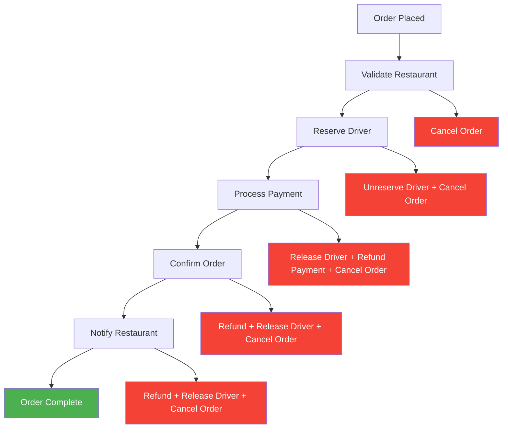

**Step 2: Saga Implementation** (40 min)

Implement the order processing saga:

```java
// OrderProcessingSaga.java
@Component
public class OrderProcessingSaga {
    
    private final RestaurantService restaurantService;
    private final DriverService driverService;
    private final PaymentService paymentService;
    private final NotificationService notificationService;
    
    public void processOrder(OrderCreatedEvent event) {
        SagaTransaction saga = SagaTransaction.begin(event.getOrderId());
        
        try {
            // Step 1: Validate restaurant availability
            RestaurantValidation validation = restaurantService.validateOrder(
                event.getRestaurantId(), event.getOrderItems()
            );
            
            if (!validation.isValid()) {
                throw new RestaurantUnavailableException(validation.getReason());
            }
            
            saga.addCompensation(() -> 
                orderService.cancelOrder(event.getOrderId(), "Restaurant validation failed"));
            
            // Step 2: Reserve driver
            // TODO: Implement driver reservation with compensation
            
            // Step 3: Process payment  
            // TODO: Implement payment processing with compensation
            
            // Step 4: Confirm order
            // TODO: Implement order confirmation with compensation
            
            // Step 5: Notify restaurant
            // TODO: Implement restaurant notification with compensation
            
            saga.complete();
            
        } catch (Exception e) {
            saga.compensate();
            throw new OrderProcessingException("Order processing failed", e);
        }
    }
}
```

**Step 3: Compensation Logic** (20 min)

Implement compensation methods:

```java
// PaymentService.java
@Service
public class PaymentService {
    
    public PaymentReservation reservePayment(String customerId, BigDecimal amount) {
        // TODO: Implement payment reservation
        // Should hold funds but not charge immediately
    }
    
    public void confirmPayment(String reservationId) {
        // TODO: Implement payment confirmation
        // Actually charge the reserved amount
    }
    
    public void refundPayment(String reservationId) {
        // TODO: Implement payment refund
        // Compensation action for failed order
    }
}
```

## 📝 Assessment & Validation

### Competency Validation Framework

!!! note "Assessment Guidelines"
    Complete all sections to validate your microservices decomposition expertise. This assessment covers practical skills essential for production environments.

### Knowledge Assessment (30 min)

**Domain-Driven Design Questions**:

1. **Bounded Context Identification** (10 points)
   ```
   Scenario: Online banking system with the following features:
   - Account management (checking, savings, credit cards)
   - Transaction processing (transfers, payments, deposits)  
   - Customer service (support tickets, chat, phone)
   - Loan processing (applications, underwriting, approvals)
   - Investment services (portfolio management, trading)
   
   Question: Identify 3-5 bounded contexts and explain the boundaries.
   
   Your Answer:
   Context 1: ____________________
   Boundary rationale: ____________________
   
   Context 2: ____________________
   Boundary rationale: ____________________
   
   [Continue for remaining contexts]
   ```

2. **Aggregate Design** (10 points)
   ```
   Design an aggregate for order processing that enforces these business rules:
   - Order total must match sum of line items
   - Cannot modify confirmed orders  
   - Maximum 20 items per order
   - Discounts cannot exceed 50% of order total
   
   Include:
   - Aggregate root identification
   - Invariant enforcement methods
   - Domain event publication
   
   Your Solution:
   [Provide code or detailed design]
   ```

**Decomposition Strategy Questions**:

3. **Service Boundary Decision** (15 points)
   ```
   You have a monolithic e-learning platform with these capabilities:
   - User registration and profiles
   - Course catalog and search
   - Video streaming and progress tracking
   - Assessments and grading  
   - Certificates and achievements
   - Payment processing
   - Discussion forums
   - Analytics and reporting
   
   Design microservices architecture:
   a) Identify 4-6 services with clear responsibilities
   b) Define data ownership for each service
   c) Specify integration patterns between services
   d) Justify your decomposition strategy
   
   Your Architecture:
   [Provide service design with justification]
   ```

4. **Anti-Pattern Recognition** (10 points)
   ```
   Identify problems in this microservices design:
   
   Services:
   - user-api-service (REST endpoints only)
   - user-data-service (database access only)
   - order-api-service (REST endpoints only)  
   - order-data-service (database access only)
   - shared-database (used by all services)
   
   Problems identified:
   1. ____________________
   2. ____________________
   3. ____________________
   
   Corrective actions:
   1. ____________________
   2. ____________________
   3. ____________________
   ```

### Practical Implementation Assessment (90 min)

**Migration Planning Exercise**:

5. **Strangler Fig Implementation** (45 points)
   ```
   Design a migration plan for extracting user management from a monolith:
   
   Monolith Components:
   - User registration and authentication
   - Profile management
   - Password reset functionality
   - Email notification for user events
   - Integration with order history display
   
   Requirements:
   a) Design 3-phase migration plan
   b) Define routing rules for strangler facade
   c) Plan database migration strategy  
   d) Define rollback procedures
   e) Specify success criteria for each phase
   
   Your Migration Plan:
   [Provide detailed phase-by-phase plan]
   ```

**Saga Implementation Exercise**:

6. **Distributed Transaction Design** (30 points)
   ```
   Implement saga pattern for travel booking:
   
   Steps Required:
   1. Reserve flight seats
   2. Reserve hotel rooms  
   3. Process payment
   4. Send confirmation emails
   5. Update loyalty points
   
   Design Requirements:
   a) Choose orchestration vs choreography (justify choice)
   b) Define compensation actions for each step
   c) Handle partial failures and timeout scenarios
   d) Implement idempotency for retry safety
   
   Your Saga Design:
   [Provide implementation approach with compensation logic]
   ```

### Case Study Analysis (60 min)

**Production Scenario Analysis**:

7. **Architecture Review** (40 points)
   ```
   Analyze this production microservices architecture:
   
   Company: Food delivery platform (50M orders/month)
   Services: 25 microservices, 150 developers, 15 teams
   
   Current Issues:
   - Average API response time: 800ms (target: <200ms)
   - Order processing success rate: 94% (target: >99%)
   - Weekly deployment failures: 15% (target: <5%)
   - Cross-team dependencies causing deployment delays
   
   Your Analysis:
   a) Identify likely architectural problems
   b) Propose specific solutions with implementation steps  
   c) Define metrics to track improvement
   d) Estimate implementation timeline and effort
   
   Your Architecture Assessment:
   [Provide detailed analysis and recommendations]
   ```

8. **Technology Selection** (20 points)
   ```
   Choose appropriate technologies for these service requirements:
   
   Service A: Real-time location tracking for delivery drivers
   - 100K+ location updates per minute
   - Sub-100ms response time for location queries
   - Geographic search capabilities
   
   Service B: Order event processing  
   - 1M+ events per day
   - Guaranteed delivery and ordering
   - Complex event routing and filtering
   
   Service C: Customer analytics and reporting
   - Complex aggregations across multiple data sources
   - Both real-time and batch processing
   - Historical data analysis
   
   Your Technology Choices:
   Service A: ____________________
   Justification: ____________________
   
   Service B: ____________________  
   Justification: ____________________
   
   Service C: ____________________
   Justification: ____________________
   ```

### Assessment Scoring

**Scoring Rubric**:

| Score Range | Competency Level | Interpretation |
|-------------|------------------|----------------|
| **90-100** | Expert | Ready to lead complex microservices transformations |
| **80-89** | Advanced | Can design and implement microservices independently |
| **70-79** | Intermediate | Needs mentorship for complex scenarios |
| **60-69** | Beginner | Requires additional study and practice |
| **<60** | Novice | Should complete prerequisite learning |

**Areas of Focus by Score**:
- **Domain Modeling (25 points)**: Strategic DDD understanding
- **Decomposition Strategies (25 points)**: Practical service boundary design  
- **Migration Planning (45 points)**: Real-world transformation skills
- **Problem Solving (30 points)**: Anti-pattern recognition and resolution
- **Technology Decisions (20 points)**: Production-ready technology selection

## 📚 Additional Resources

### Extended Learning Materials

#### Essential Books (In Order of Priority)

1. **Building Microservices** - Sam Newman ⭐⭐⭐⭐⭐
   - **Focus**: Practical microservices architecture
   - **Key Chapters**: 2-4 (Modelling Services), 7-8 (Testing, Monitoring)
   - **Time Investment**: 15 hours
   - **Why Essential**: Best practical guide for service decomposition

2. **Microservices Patterns** - Chris Richardson ⭐⭐⭐⭐⭐
   - **Focus**: Proven patterns for microservices challenges
   - **Key Chapters**: 2 (Decomposition strategies), 4-5 (Sagas, Business logic)
   - **Time Investment**: 20 hours  
   - **Why Essential**: Comprehensive pattern catalog with implementation details

3. **Domain-Driven Design** - Eric Evans ⭐⭐⭐⭐⭐
   - **Focus**: Strategic design and bounded contexts
   - **Key Chapters**: 4-6 (Domain isolation), 14-16 (Strategic design)
   - **Time Investment**: 25 hours
   - **Why Essential**: Foundation for proper service boundaries

4. **Implementing Domain-Driven Design** - Vaughn Vernon ⭐⭐⭐⭐
   - **Focus**: Tactical DDD patterns and implementation
   - **Key Chapters**: 7-10 (Services, Domain events, Modules)
   - **Time Investment**: 18 hours
   - **Why Essential**: Practical DDD implementation guidance

5. **Release It!** - Michael Nygard ⭐⭐⭐⭐
   - **Focus**: Production stability and resilience patterns
   - **Key Chapters**: 5-8 (Stability patterns), 17-18 (Operations)
   - **Time Investment**: 12 hours
   - **Why Essential**: Critical for production microservices reliability

#### Technical Resources

**Architecture Patterns**:
- [Martin Fowler's Microservices Articles](https://martinfowler.com/microservices/) - Foundational concepts
- [Microservice.io](https://microservices.io/) - Chris Richardson's pattern catalog
- [AWS Architecture Center](https://aws.amazon.com/architecture/) - Cloud-native patterns
- [Google Cloud Architecture Framework](https://cloud.google.com/architecture/framework) - Enterprise patterns

**Production Case Studies**:
- [Netflix Tech Blog](https://netflixtechblog.com/) - Large-scale microservices insights
- [Uber Engineering](https://eng.uber.com/) - Real-time systems and microservices  
- [Shopify Engineering](https://shopify.engineering/) - E-commerce microservices evolution
- [Amazon Builder's Library](https://aws.amazon.com/builders-library/) - Distributed systems best practices

**Tools and Platforms**:
- [Istio Documentation](https://istio.io/docs/) - Service mesh implementation
- [Kubernetes Patterns](https://k8spatterns.io/) - Container orchestration patterns
- [Apache Kafka Documentation](https://kafka.apache.org/documentation/) - Event streaming
- [Spring Cloud Documentation](https://spring.io/projects/spring-cloud) - Java microservices framework

#### Video Content & Conferences

**Essential Conference Talks**:
1. **"Mastering the Art of Microservices"** - Sam Newman (goto; Amsterdam 2020)
2. **"Building Event-Driven Microservices"** - Adam Bellemare (Kafka Summit 2021)
3. **"Microservices at Netflix Scale"** - Josh Evans (QCon 2016)  
4. **"Domain-Driven Design and Microservices"** - Vaughn Vernon (DDD Europe 2019)

**Recommended YouTube Channels**:
- **InfoQ** - Architecture and design presentations
- **GOTO Conferences** - Expert talks on microservices topics
- **Confluent** - Event streaming and Kafka best practices
- **Google Cloud Tech** - Cloud-native architecture patterns

#### Community Resources

**Professional Communities**:
- **DDD Community** - Domain-driven design practitioners
- **Microservices Practitioners** - LinkedIn group for microservices professionals
- **CNCF Community** - Cloud-native computing foundation
- **Software Architecture Community** - Architecture-focused discussions

**Certification Paths**:
| Certification | Relevance | Timeline | Cost |
|---------------|-----------|----------|------|
| **AWS Solutions Architect Professional** | 85% | 3 months | $300 |
| **Certified Kubernetes Application Developer** | 90% | 2 months | $375 |
| **Google Professional Cloud Architect** | 80% | 4 months | $200 |
| **Azure Solutions Architect Expert** | 75% | 3 months | $330 |

#### Continuous Learning Path

**Monthly Learning Schedule**:

```yaml
Month 1-2: Foundation Building
  - Read "Building Microservices" chapters 1-6
  - Complete hands-on exercises from this module
  - Join DDD Community and participate in discussions
  - Set up personal microservices project

Month 3-4: Advanced Patterns  
  - Read "Microservices Patterns" chapters 1-8
  - Implement saga pattern in personal project
  - Study Netflix and Uber case studies in detail
  - Present learning to team or meetup group

Month 5-6: Production Skills
  - Read "Release It!" stability patterns
  - Implement service mesh in personal project  
  - Complete AWS or Kubernetes certification
  - Contribute to open source microservices project

Month 7-8: Mastery and Leadership
  - Read "Domain-Driven Design" strategic patterns
  - Lead microservices assessment at current company
  - Speak at local meetup or conference
  - Mentor junior developers in microservices concepts

Month 9-12: Specialization
  - Choose specialization: Platform Engineering, SRE, or Data Architecture
  - Contribute to microservices thought leadership (blog, talks)
  - Lead production microservices transformation
  - Pursue advanced certifications
```

---

!!! success "Congratulations on Completing Microservices Decomposition Mastery!"
    You've gained comprehensive knowledge of domain-driven design principles, practical decomposition strategies, and production-proven implementation techniques. You're now equipped to lead successful microservices transformations and avoid the common pitfalls that plague distributed systems initiatives.

**Next Steps**: 
- Apply these concepts in your current projects
- Share knowledge with your team through workshops or presentations
- Consider advancing to specialized areas like Platform Engineering or Site Reliability Engineering
- Stay engaged with the microservices community through conferences and meetups

**Remember**: Microservices are a means to an end - organizational scalability and technical agility. Always start with the business problem and let domain boundaries guide your architectural decisions.