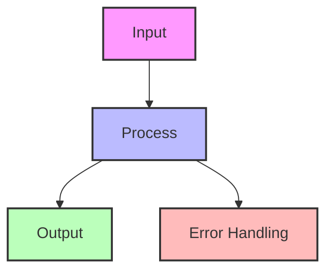

## Essential Question
## When to Use / When NOT to Use

### When to Use

| Scenario | Why It Fits | Alternative If Not |
|----------|-------------|-------------------|
| High availability required | Pattern provides resilience | Consider simpler approach |
| Scalability is critical | Handles load distribution | Monolithic might suffice |
| Distributed coordination needed | Manages complexity | Centralized coordination |

### When NOT to Use

| Scenario | Why to Avoid | Better Alternative |
|----------|--------------|-------------------|
| Simple applications | Unnecessary complexity | Direct implementation |
| Low traffic systems | Overhead not justified | Basic architecture |
| Limited resources | High operational cost | Simpler patterns |
**How do we structure our system architecture to leverage serverless/faas (function-as-a-service)?**

# Serverless/FaaS (Function-as-a-Service)

!!! warning "🥈 Silver Tier Pattern"
    **Great for specific use cases with trade-offs**
    
    Serverless excels at event-driven, sporadic workloads but struggles with consistent high-throughput applications. Cold starts, vendor lock-in, and debugging complexity require careful consideration.
    
    **Best suited for:**
    - Event-driven processing
    - APIs with highly variable traffic
    - Scheduled jobs and automation
    - Rapid prototyping and MVPs

**The cloud's promise fulfilled: infinite scale, zero servers, pay-per-millisecond**

> *"Serverless is about running code, not managing infrastructure. It's the difference between owning a power plant and plugging into the grid."*

---

## Level 1: Intuition

### The Restaurant Kitchen Analogy

### Real-World Examples

| Company | Use Case | Impact |
|---------|----------|---------|
| **Netflix** | Video encoding | 0 → 1000s encoders in seconds |
| **iRobot** | 100% serverless backend | 90% cost reduction |
| **Coca-Cola** | Vending machine payments | Pay only when someone buys |
| **FINRA** | 500 billion validations/day | 50% cost savings |
| **The Seattle Times** | Image resizing | From $1500/month to $15/month |

### Basic Implementation

---

## Level 2: Foundation

### Core Concepts

### Serverless Cost Comparison

### Serverless Patterns

#### 1. Request-Response Pattern

### Performance Optimization

#
## Decision Matrix

### Quick Decision Table

| Factor | Low Complexity | Medium Complexity | High Complexity |
|--------|----------------|-------------------|-----------------|
| Team Size | < 5 developers | 5-20 developers | > 20 developers |
| Traffic | < 1K req/s | 1K-100K req/s | > 100K req/s |
| Data Volume | < 1GB | 1GB-1TB | > 1TB |
| **Recommendation** | ❌ Avoid | ⚠️ Consider | ✅ Implement |

## Implementation Checklist

- [ ] Identify stateless workloads
- [ ] Design event-driven architecture  
- [ ] Minimize deployment package
- [ ] Implement connection pooling
- [ ] Plan cold start mitigation
- [ ] Set up distributed tracing
- [ ] Configure auto-scaling limits
- [ ] Design idempotent operations
- [ ] Implement error handling
- [ ] Set up monitoring/alerting
- [ ] Plan for vendor lock-in
- [ ] Document local testing

### Common Anti-Patterns

1. **Stateful operations** - Serverless is stateless
2. **Long-running tasks** - 15-minute limit
3. **Large deployments** - Slow cold starts
4. **Synchronous chains** - Use async patterns
5. **Ignoring cold starts** - Plan for them

---

## 🎓 Key Takeaways

1. **Serverless = NoOps** - Focus on code, not infrastructure
2. **Event-driven by design** - React to events, don't poll
3. **Granular scaling** - Each request scales independently
4. **Pay per use** - True utility computing
5. **Cold starts are real** - Design around them

---

*"The best server is no server. The best ops team is no ops team. The best infrastructure is the one you never see."*

---

**Previous**: [← Saga (Distributed Transactions)](../data-management/saga.md) | **Next**: [Service Discovery Pattern →](../communication/service-discovery.md)

