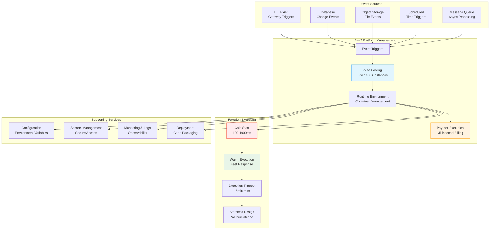

## The Complete Blueprint

Serverless/FaaS (Function-as-a-Service) is a cloud computing paradigm that abstracts server management completely, allowing developers to run code in stateless compute containers managed by cloud providers without provisioning or managing underlying infrastructure. This pattern enables you to write single-purpose functions that automatically scale from zero to thousands of concurrent executions, with billing based only on actual compute time consumed down to the millisecond. FaaS platforms like AWS Lambda, Google Cloud Functions, and Azure Functions handle all operational concerns—server provisioning, scaling, patching, monitoring, and fault tolerance—while developers focus purely on business logic. The pattern excels for event-driven architectures where functions respond to triggers like HTTP requests, database changes, file uploads, or scheduled events. However, it introduces constraints including cold start latency (100-1000ms), execution time limits (typically 15 minutes), stateless requirements, and potential vendor lock-in. Success requires designing applications as collections of small, focused functions that can start quickly, execute efficiently within resource constraints, and communicate through managed services rather than maintaining persistent connections.

### What You'll Master

By implementing serverless/FaaS, you'll achieve **zero infrastructure management** where cloud providers handle all server operations, scaling, and maintenance, **cost optimization** through pay-per-use billing that eliminates idle resource costs, **automatic scaling** that handles traffic spikes from zero to thousands of concurrent executions without configuration, **rapid development cycles** where you focus purely on business logic without operational complexity, and **event-driven architecture** mastery where functions respond to various triggers in loosely coupled systems. You'll learn to design applications that embrace statelessness, handle cold starts effectively, and leverage managed services for persistence and communication.

## Essential Question
## When to Use / When NOT to Use

### When to Use

| Scenario | Why It Fits | Alternative If Not |
|----------|-------------|-------------------|
| High availability required | Pattern provides resilience | Consider simpler approach |
| Scalability is critical | Handles load distribution | Monolithic might suffice |
| Distributed coordination needed | Manages complexity | Centralized coordination |

### When NOT to Use

| Scenario | Why to Avoid | Better Alternative |
|----------|--------------|-------------------|
| Simple applications | Unnecessary complexity | Direct implementation |
| Low traffic systems | Overhead not justified | Basic architecture |
| Limited resources | High operational cost | Simpler patterns |
**How do we structure our system architecture to leverage serverless/faas (function-as-a-service)?**

# Serverless/FaaS (Function-as-a-Service)

!!! warning "🥈 Silver Tier Pattern"
    **Great for specific use cases with trade-offs**
    
    Serverless excels at event-driven, sporadic workloads but struggles with consistent high-throughput applications. Cold starts, vendor lock-in, and debugging complexity require careful consideration.
    
    **Best suited for:**
    - Event-driven processing
    - APIs with highly variable traffic
    - Scheduled jobs and automation
    - Rapid prototyping and MVPs

**The cloud's promise fulfilled: infinite scale, zero servers, pay-per-millisecond**

> *"Serverless is about running code, not managing infrastructure. It's the difference between owning a power plant and plugging into the grid."*

---

## Level 1: Intuition

### The Restaurant Kitchen Analogy

### Real-World Examples

| Company | Use Case | Impact |
|---------|----------|---------|
| **Netflix** | Video encoding | 0 → 1000s encoders in seconds |
| **iRobot** | 100% serverless backend | 90% cost reduction |
| **Coca-Cola** | Vending machine payments | Pay only when someone buys |
| **FINRA** | 500 billion validations/day | 50% cost savings |
| **The Seattle Times** | Image resizing | From $1500/month to $15/month |

### Basic Implementation

---

## Level 2: Foundation

### Core Concepts

### Serverless Cost Comparison

### Serverless Patterns

#### 1. Request-Response Pattern

### Performance Optimization

#
## Decision Matrix

### Quick Decision Table

| Factor | Low Complexity | Medium Complexity | High Complexity |
|--------|----------------|-------------------|-----------------|
| Team Size | < 5 developers | 5-20 developers | > 20 developers |
| Traffic | < 1K req/s | 1K-100K req/s | > 100K req/s |
| Data Volume | < 1GB | 1GB-1TB | > 1TB |
| **Recommendation** | ❌ Avoid | ⚠️ Consider | ✅ Implement |

## Implementation Checklist

- [ ] Identify stateless workloads
- [ ] Design event-driven architecture  
- [ ] Minimize deployment package
- [ ] Implement connection pooling
- [ ] Plan cold start mitigation
- [ ] Set up distributed tracing
- [ ] Configure auto-scaling limits
- [ ] Design idempotent operations
- [ ] Implement error handling
- [ ] Set up monitoring/alerting
- [ ] Plan for vendor lock-in
- [ ] Document local testing

### Common Anti-Patterns

1. **Stateful operations** - Serverless is stateless
2. **Long-running tasks** - 15-minute limit
3. **Large deployments** - Slow cold starts
4. **Synchronous chains** - Use async patterns
5. **Ignoring cold starts** - Plan for them

---

## 🎓 Key Takeaways

1. **Serverless = NoOps** - Focus on code, not infrastructure
2. **Event-driven by design** - React to events, don't poll
3. **Granular scaling** - Each request scales independently
4. **Pay per use** - True utility computing
5. **Cold starts are real** - Design around them

---

*"The best server is no server. The best ops team is no ops team. The best infrastructure is the one you never see."*

---

**Previous**: [← Saga (Distributed Transactions)](../data-management/saga.md) | **Next**: [Service Discovery Pattern →](../communication/service-discovery.md)

