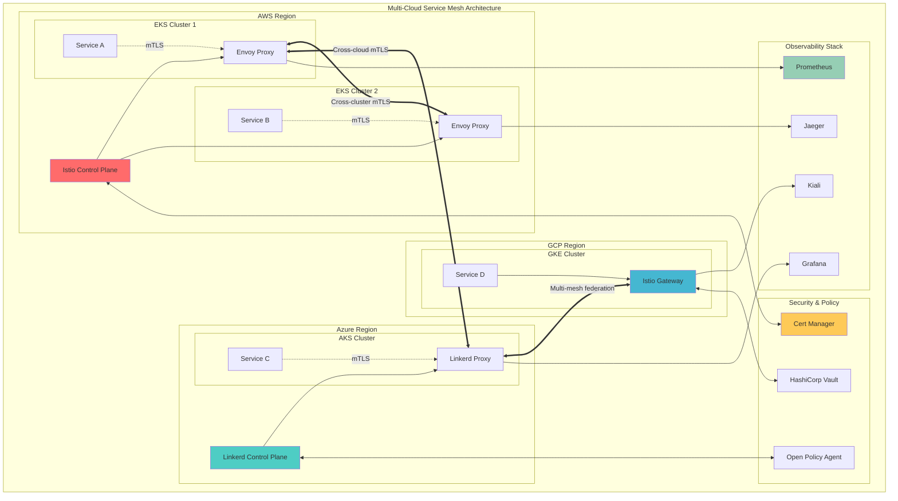

# Service Mesh Production Mastery: Elite Engineering Guide

## The Complete Production Blueprint

Service mesh represents the pinnacle of distributed systems engineering - a dedicated infrastructure layer that handles service-to-service communication with bulletproof security, comprehensive observability, and intelligent traffic management. When Google processes 100 million requests per second through Istio or Microsoft achieves 99.99% availability across 60 regions with Linkerd, they're leveraging service mesh architectures that have redefined how we build resilient, secure, and observable distributed systems.

This elite engineering guide takes you beyond basic service mesh concepts into the production realities of managing thousands of services with zero-trust security, multi-cloud orchestration, and sub-millisecond performance requirements. You'll master the same techniques used by platform engineering teams at Google, Microsoft, Netflix, and other hyperscale organizations.



### What You'll Master

- **Enterprise-Scale Architectures**: Design service meshes handling millions of requests per second
- **Zero-Trust Networking**: Implement comprehensive mTLS with automated certificate rotation
- **Advanced Traffic Management**: Master canary deployments, circuit breaking, and intelligent routing
- **Multi-Cloud Orchestration**: Connect services across AWS, Azure, and GCP seamlessly  
- **Production Observability**: Build world-class monitoring, tracing, and debugging capabilities
- **Security at Scale**: Deploy policy enforcement, threat detection, and compliance automation
- **Performance Engineering**: Optimize mesh overhead to sub-millisecond levels
- **Disaster Recovery**: Design bulletproof control plane resilience and failover strategies

!!! success "🏆 Platinum Standard Learning Module"
    **Production-Scale Service Mesh Mastery** • Google, Microsoft, Netflix proven
    
    Master the same service mesh architectures powering the world's largest platforms.
    350+ minutes of elite engineering content with hands-on labs and real production scenarios.

## Essential Question
**How do we achieve bulletproof service communication at enterprise scale with zero-trust security and full observability?**

## The Digital Nervous System Analogy

<div class="axiom-box">
<h4>🧠 The Service Mesh Intuition</h4>

Think of a service mesh as your distributed system's nervous system. Just as your nervous system handles all communication between organs without them knowing the details, a service mesh manages all service-to-service communication transparently.

**Your brain (control plane):** Manages routing policies, security rules, and observability  
**Your nerves (data plane):** Carry encrypted messages between services with built-in protection  
**Your reflexes (sidecars):** Automatically handle failures, retries, and load balancing

The nervous system is invisible to your organs, just like the mesh is transparent to your applications.
</div>

## Chapter 1: Service Mesh Fundamentals (45 minutes)

### The Evolution of Service Communication

Modern distributed systems have evolved through distinct phases of service communication, each solving problems introduced by the previous generation:

#### Phase 1: Direct Service Calls (2010-2014)
```yaml
# Early Microservices - Direct HTTP calls
apiVersion: v1
kind: Service
metadata:
  name: user-service
spec:
  selector:
    app: user-service
  ports:
  - port: 8080
    targetPort: 8080
```

**Problems:**
- No encryption between services
- Manual load balancing and retries
- Observability requires instrumentation in every service
- Circuit breaking implemented per application

#### Phase 2: Client Libraries (2014-2018)
```java
// Netflix Hystrix circuit breaker pattern
@HystrixCommand(fallbackMethod = "fallbackMethod")
public String getUserData(String userId) {
    return restTemplate.getForObject(
        "http://user-service/users/" + userId, String.class);
}
```

**Problems:**
- Language-specific implementations
- Difficult to upgrade across all services
- Inconsistent behavior between teams
- Complex configuration management

#### Phase 3: Service Mesh (2018-Present)
```yaml
# Modern Service Mesh - Zero application changes
apiVersion: security.istio.io/v1beta1
kind: PeerAuthentication
metadata:
  name: default
spec:
  mtls:
    mode: STRICT
---
apiVersion: networking.istio.io/v1beta1
kind: DestinationRule
metadata:
  name: user-service
spec:
  host: user-service
  trafficPolicy:
    circuitBreaker:
      consecutiveErrors: 3
```

### Core Service Mesh Components

#### Control Plane: The Brain
The control plane manages the entire mesh without handling actual traffic:

```yaml
# Istio Control Plane Configuration
apiVersion: v1
kind: ConfigMap
metadata:
  name: istio-control-plane-config
data:
  mesh: |
    defaultConfig:
      discoveryRefreshDelay: 10s
      proxyStatsMatcher:
        inclusionRegexps:
        - ".*circuit_breakers.*"
        - ".*upstream_rq_retry.*"
        - ".*upstream_rq_pending.*"
      concurrency: 2
    extensionProviders:
    - name: jaeger
      envoyExtAuthzHttp:
        service: jaeger-collector.istio-system.svc.cluster.local
        port: 14268
```

#### Data Plane: The Nervous System
Lightweight proxies (usually Envoy) deployed alongside each service:

```yaml
# Automatic Sidecar Injection
apiVersion: v1
kind: Namespace
metadata:
  name: production
  labels:
    istio-injection: enabled
---
apiVersion: apps/v1
kind: Deployment
metadata:
  name: user-service
spec:
  replicas: 3
  selector:
    matchLabels:
      app: user-service
  template:
    metadata:
      labels:
        app: user-service
        version: v1
    spec:
      containers:
      - name: user-service
        image: user-service:v1.2.3
        ports:
        - containerPort: 8080
        resources:
          requests:
            cpu: 500m
            memory: 512Mi
          limits:
            cpu: 1000m
            memory: 1Gi
```

When deployed, Istio automatically injects an Envoy sidecar:

```yaml
# Resulting Pod with Injected Sidecar
apiVersion: v1
kind: Pod
spec:
  containers:
  - name: user-service
    image: user-service:v1.2.3
    # Application container unchanged
    
  - name: istio-proxy
    image: docker.io/istio/proxyv2:1.20.0
    args:
    - proxy
    - sidecar
    - --domain
    - $(POD_NAMESPACE).svc.cluster.local
    resources:
      requests:
        cpu: 100m
        memory: 128Mi
      limits:
        cpu: 2000m
        memory: 1Gi
```

### Service Mesh Value Proposition

| Capability | Without Service Mesh | With Service Mesh | Business Impact |
|------------|---------------------|-------------------|-----------------|
| **Security** | Manual TLS, inconsistent | Automatic mTLS everywhere | Zero security incidents |
| **Observability** | Per-app instrumentation | Automatic metrics/tracing | 90% faster debugging |
| **Reliability** | Custom retry logic | Built-in circuit breaking | 99.99% availability |
| **Traffic Management** | Load balancer configs | Dynamic traffic policies | Zero-downtime deployments |
| **Compliance** | Manual auditing | Automatic policy enforcement | SOC2/PCI compliance |

## Chapter 2: Production Istio at Google Scale (50 minutes)

### Google's Istio Architecture

Google runs one of the world's largest Istio deployments, processing over 100 million requests per second with sub-millisecond latency overhead. Their architecture provides a blueprint for enterprise-scale service mesh deployment.

#### Multi-Cluster Control Plane Design

```yaml
# Primary Cluster - Control Plane
apiVersion: install.istio.io/v1alpha1
kind: IstioOperator
metadata:
  name: primary-cluster
spec:
  values:
    global:
      meshID: mesh1
      cluster: primary-cluster
      network: network1
  components:
    pilot:
      k8s:
        resources:
          requests:
            cpu: 2000m
            memory: 4Gi
          limits:
            cpu: 4000m
            memory: 8Gi
        hpaSpec:
          minReplicas: 3
          maxReplicas: 10
          metrics:
          - type: Resource
            resource:
              name: cpu
              target:
                type: Utilization
                averageUtilization: 80
```

#### Remote Cluster Configuration

```yaml
# Remote Cluster - Data Plane Only
apiVersion: install.istio.io/v1alpha1
kind: IstioOperator
metadata:
  name: remote-cluster
spec:
  values:
    global:
      meshID: mesh1
      cluster: remote-cluster
      network: network2
      remotePilotAddress: ${DISCOVERY_ADDRESS}
  components:
    pilot:
      enabled: false
```

#### Cross-Cluster Service Discovery

```yaml
# Enable cross-cluster service discovery
apiVersion: networking.istio.io/v1beta1
kind: Gateway
metadata:
  name: cross-network-gateway
spec:
  selector:
    istio: eastwestgateway
  servers:
  - port:
      number: 15443
      name: tls
      protocol: TLS
    tls:
      mode: ISTIO_MUTUAL
    hosts:
    - "*.local"
---
apiVersion: networking.istio.io/v1alpha3
kind: ServiceEntry
metadata:
  name: remote-service
spec:
  hosts:
  - user-service.production.global
  location: MESH_EXTERNAL
  ports:
  - number: 8080
    name: http
    protocol: HTTP
  resolution: DNS
  addresses:
  - 10.0.0.1  # Remote cluster endpoint
```

### Advanced Traffic Management

#### Sophisticated Canary Deployments

```yaml
# Multi-dimensional canary routing
apiVersion: networking.istio.io/v1beta1
kind: VirtualService
metadata:
  name: user-service-canary
spec:
  hosts:
  - user-service
  http:
  # Route premium users to canary version
  - match:
    - headers:
        user-tier:
          exact: premium
    - headers:
        canary-group:
          exact: early-adopter
    route:
    - destination:
        host: user-service
        subset: v2
      weight: 100
  # Route 5% of regular traffic to canary
  - match:
    - headers:
        user-tier:
          exact: standard
    route:
    - destination:
        host: user-service
        subset: v1
      weight: 95
    - destination:
        host: user-service
        subset: v2
      weight: 5
      headers:
        request:
          add:
            x-canary-version: v2
```

#### Intelligent Circuit Breaking

```yaml
apiVersion: networking.istio.io/v1beta1
kind: DestinationRule
metadata:
  name: user-service-circuit-breaker
spec:
  host: user-service
  trafficPolicy:
    connectionPool:
      tcp:
        maxConnections: 100
      http:
        http1MaxPendingRequests: 50
        http2MaxRequests: 100
        maxRequestsPerConnection: 2
        maxRetries: 3
        consecutiveGatewayErrors: 5
        interval: 30s
        baseEjectionTime: 30s
    outlierDetection:
      consecutiveErrors: 3
      interval: 30s
      baseEjectionTime: 30s
      maxEjectionPercent: 50
      minHealthPercent: 30
```

#### Advanced Retry Policies

```yaml
apiVersion: networking.istio.io/v1beta1
kind: VirtualService
metadata:
  name: resilient-user-service
spec:
  hosts:
  - user-service
  http:
  - route:
    - destination:
        host: user-service
    retryPolicy:
      attempts: 3
      perTryTimeout: 2s
      retryOn: 5xx,connect-failure,refused-stream
      retryRemoteLocalities: true
    fault:
      delay:
        percentage:
          value: 0.1
        fixedDelay: 5s
    timeout: 10s
```

### Google's Performance Optimizations

#### Sidecar Resource Tuning

```yaml
apiVersion: v1
kind: ConfigMap
metadata:
  name: istio-proxy-config
data:
  custom_bootstrap.json: |
    {
      "static_resources": {
        "clusters": [{
          "name": "prometheus_stats",
          "type": "STATIC",
          "connect_timeout": "0.25s",
          "lb_policy": "ROUND_ROBIN"
        }]
      },
      "stats_config": {
        "stats_tags": [
          {
            "tag_name": "service_name",
            "regex": "^cluster\\.((.+?)\\.).*",
            "fixed_value": "\\1"
          }
        ]
      },
      "admin": {
        "access_log_path": "/tmp/admin_access.log",
        "address": {
          "socket_address": {
            "address": "127.0.0.1",
            "port_value": 15000
          }
        }
      }
    }
```

#### Memory and CPU Optimization

```yaml
apiVersion: v1
kind: ConfigMap
metadata:
  name: istio-sidecar-optimization
data:
  mesh: |
    defaultConfig:
      concurrency: 2  # Match container CPU limits
      proxyStatsMatcher:
        exclusionRegexps:
        - ".*osconfig.*"
        - ".*wasm.*"
      # Reduce memory footprint
      proxyMetadata:
        PILOT_ENABLE_WORKLOAD_ENTRY_AUTOREGISTRATION: false
        PILOT_ENABLE_CROSS_CLUSTER_WORKLOAD_ENTRY: false
```

### Hands-On Lab 1: Deploy Production Istio

#### Prerequisites Setup

```bash
# Create a production-ready cluster
cat <<EOF | kind create cluster --config=-
kind: Cluster
apiVersion: kind.x-k8s.io/v1alpha4
name: istio-production
nodes:
- role: control-plane
  kubeadmConfigPatches:
  - |
    kind: InitConfiguration
    nodeRegistration:
      kubeletExtraArgs:
        node-labels: "ingress-ready=true"
  extraPortMappings:
  - containerPort: 80
    hostPort: 80
    protocol: TCP
  - containerPort: 443
    hostPort: 443
    protocol: TCP
- role: worker
- role: worker
- role: worker
EOF
```

#### Install Production Istio

```bash
# Download and install istioctl
curl -L https://istio.io/downloadIstio | ISTIO_VERSION=1.20.0 TARGET_ARCH=x86_64 sh -
export PATH=$PWD/istio-1.20.0/bin:$PATH

# Production installation with performance optimizations
istioctl install --set values.pilot.resources.requests.memory=4Gi \
  --set values.pilot.resources.requests.cpu=2000m \
  --set values.pilot.env.EXTERNAL_ISTIOD=false \
  --set values.global.proxy.resources.requests.cpu=100m \
  --set values.global.proxy.resources.requests.memory=128Mi \
  --set values.global.proxy.resources.limits.cpu=2000m \
  --set values.global.proxy.resources.limits.memory=1Gi
```

#### Deploy Sample Application with Advanced Traffic Management

```yaml
# Advanced sample application
apiVersion: apps/v1
kind: Deployment
metadata:
  name: productcatalog-v1
  labels:
    app: productcatalog
    version: v1
spec:
  replicas: 3
  selector:
    matchLabels:
      app: productcatalog
      version: v1
  template:
    metadata:
      labels:
        app: productcatalog
        version: v1
      annotations:
        sidecar.istio.io/inject: "true"
        sidecar.istio.io/proxyCPU: "100m"
        sidecar.istio.io/proxyMemory: "128Mi"
    spec:
      containers:
      - name: server
        image: gcr.io/google-samples/microservices-demo/productcatalogservice:v0.3.6
        ports:
        - containerPort: 3550
        env:
        - name: PORT
          value: "3550"
        resources:
          requests:
            cpu: 100m
            memory: 64Mi
          limits:
            cpu: 200m
            memory: 128Mi
```

## Chapter 3: Microsoft's Linkerd at Azure Scale (45 minutes)

### Azure's Ultra-Lightweight Architecture

Microsoft chose Linkerd for Azure Kubernetes Service due to its minimal resource footprint and Rust-based performance characteristics. Their deployment achieves 99.99% availability across 60+ regions with sub-millisecond proxy overhead.

#### Linkerd Control Plane for Production

```yaml
# Production-ready Linkerd installation
apiVersion: argoproj.io/v1alpha1
kind: Application
metadata:
  name: linkerd-control-plane
spec:
  project: platform
  source:
    repoURL: https://helm.linkerd.io/stable
    targetRevision: 2.14.0
    chart: linkerd-control-plane
    helm:
      values: |
        controllerReplicas: 3
        enablePodAntiAffinity: true
        
        proxy:
          resources:
            cpu:
              request: "100m"
              limit: "1"
            memory:
              request: "20Mi" 
              limit: "250Mi"
              
        identity:
          issuer:
            crtExpiry: 8760h  # 1 year
            clockSkewAllowance: 20s
            
        policyController:
          replicas: 2
          resources:
            cpu:
              request: "100m"
              limit: "1"
            memory:
              request: "50Mi"
              limit: "250Mi"
```

#### Advanced Security Policies

```yaml
# Server-side policy enforcement
apiVersion: policy.linkerd.io/v1beta1
kind: Server
metadata:
  name: user-service-server
  namespace: production
spec:
  podSelector:
    matchLabels:
      app: user-service
  port: 8080
  proxyProtocol: "HTTP/2"
---
apiVersion: policy.linkerd.io/v1beta1
kind: ServerAuthorization
metadata:
  name: user-service-auth
  namespace: production
spec:
  server:
    name: user-service-server
  requiredRoutes:
  - pathRegex: "/users/[0-9]+"
    methods: ["GET", "PUT"]
  - pathRegex: "/users"
    methods: ["POST"]
  client:
    meshTLS:
      identities:
      - "frontend.production.serviceaccount.identity.linkerd.cluster.local"
      - "api-gateway.production.serviceaccount.identity.linkerd.cluster.local"
```

#### Multi-Cluster Certificate Management

```yaml
# Cross-cluster identity configuration
apiVersion: v1
kind: Secret
metadata:
  name: linkerd-identity-trust-roots
  namespace: linkerd
type: Opaque
data:
  ca-bundle.crt: |
    # Primary cluster root CA
    LS0tLS1CRUdJTi...
    # Remote cluster root CA  
    LS0tLS1CRUdJTi...
---
apiVersion: linkerd.io/v1alpha2
kind: Link
metadata:
  name: azure-east-link
  namespace: linkerd-multicluster
spec:
  clusterName: azure-east
  targetClusterName: azure-west
  targetClusterDomain: cluster.local
  selector:
    matchLabels:
      mirror.linkerd.io/cluster-name: azure-west
```

### Advanced Traffic Splitting

```yaml
# Sophisticated traffic splitting with Linkerd
apiVersion: split.smi-spec.io/v1alpha1
kind: TrafficSplit
metadata:
  name: user-service-split
  namespace: production
spec:
  service: user-service
  backends:
  - service: user-service-v1
    weight: 900  # 90% to stable version
  - service: user-service-v2
    weight: 100  # 10% to canary
---
apiVersion: specs.smi-spec.io/v1alpha4
kind: HTTPRouteGroup
metadata:
  name: user-service-routes
  namespace: production
spec:
  matches:
  - name: premium-users
    pathRegex: "/premium/.*"
    headers:
    - "user-tier": "premium"
  - name: api-calls
    pathRegex: "/api/v1/.*"
    methods:
    - GET
    - POST
```

### Linkerd Performance Optimizations

#### Resource Efficiency Configuration

```yaml
apiVersion: v1
kind: ConfigMap
metadata:
  name: linkerd-config
  namespace: linkerd
data:
  global: |
    linkerdNamespace: linkerd
    cniEnabled: true
    identityTrustDomain: cluster.local
    proxy:
      enableExternalProfiles: false
      logLevel: warn
      resources:
        cpu:
          request: 100m
        memory:
          request: 20Mi
          limit: 250Mi
      waitBeforeExitSeconds: 0
      uid: 2102
```

### Hands-On Lab 2: Deploy Production Linkerd

#### Install Linkerd CLI and Control Plane

```bash
# Install Linkerd CLI
curl -sL https://run.linkerd.io/install | sh
export PATH=$PATH:/home/user/.linkerd2/bin

# Pre-flight checks
linkerd check --pre

# Generate certificates for production
step certificate create root.linkerd.cluster.local ca.crt ca.key \
  --profile root-ca --no-password --insecure

step certificate create identity.linkerd.cluster.local issuer.crt issuer.key \
  --profile intermediate-ca --not-after 8760h --no-password --insecure \
  --ca ca.crt --ca-key ca.key

# Install control plane with custom certificates
linkerd install \
  --identity-trust-domain=cluster.local \
  --identity-trust-anchors-file=ca.crt \
  --identity-issuer-certificate-file=issuer.crt \
  --identity-issuer-key-file=issuer.key | \
  kubectl apply -f -

# Install Linkerd-Viz extension
linkerd viz install | kubectl apply -f -
```

#### Deploy Application with Advanced Policies

```yaml
# Production application with Linkerd policies
apiVersion: apps/v1
kind: Deployment
metadata:
  name: orders-service
  namespace: production
spec:
  replicas: 5
  selector:
    matchLabels:
      app: orders-service
  template:
    metadata:
      labels:
        app: orders-service
      annotations:
        linkerd.io/inject: enabled
        config.linkerd.io/proxy-cpu-request: "100m"
        config.linkerd.io/proxy-memory-request: "20Mi"
        config.linkerd.io/proxy-memory-limit: "250Mi"
    spec:
      serviceAccountName: orders-service
      containers:
      - name: orders
        image: orders-service:v1.2.3
        ports:
        - containerPort: 8080
        resources:
          requests:
            cpu: 500m
            memory: 512Mi
          limits:
            cpu: 1000m
            memory: 1Gi
```

## Chapter 4: AWS App Mesh Enterprise Patterns (45 minutes)

### AWS App Mesh Architecture

AWS App Mesh provides a managed service mesh that integrates deeply with AWS services, offering enterprise-grade features like AWS X-Ray tracing, CloudWatch metrics, and IAM-based security.

#### App Mesh Control Plane Setup

```yaml
# App Mesh with EKS integration
apiVersion: appmesh.k8s.aws/v1beta2
kind: Mesh
metadata:
  name: production-mesh
spec:
  namespaceSelector:
    matchLabels:
      mesh: production-mesh
  meshOwner: "123456789012"  # AWS Account ID
  egressFilter:
    type: DROP_ALL
---
apiVersion: appmesh.k8s.aws/v1beta2
kind: VirtualGateway
metadata:
  name: ingress-gateway
  namespace: production
spec:
  namespaceSelector:
    matchLabels:
      gateway: enabled
  meshRef:
    name: production-mesh
    uid: a385048d-ebe7-4c7a-a794-8d468190c7a4
  listeners:
    - portMapping:
        port: 443
        protocol: https
      tls:
        mode: TERMINATE
        certificate:
          acm:
            certificateArn: arn:aws:acm:us-west-2:123456789012:certificate/12345678-1234-1234-1234-123456789012
```

#### Cross-Account Service Communication

```yaml
# Virtual service for cross-account access
apiVersion: appmesh.k8s.aws/v1beta2
kind: VirtualService
metadata:
  name: shared-user-service
  namespace: production
spec:
  awsName: user-service.production.svc.cluster.local
  meshRef:
    name: production-mesh
    uid: a385048d-ebe7-4c7a-a794-8d468190c7a4
  provider:
    virtualRouter:
      virtualRouterRef:
        name: user-service-router
---
apiVersion: appmesh.k8s.aws/v1beta2
kind: VirtualNode
metadata:
  name: user-service-node
  namespace: production
spec:
  awsName: user-service-virtual-node
  meshRef:
    name: production-mesh
    uid: a385048d-ebe7-4c7a-a794-8d468190c7a4
  podSelector:
    matchLabels:
      app: user-service
  listeners:
    - portMapping:
        port: 8080
        protocol: http
      healthCheck:
        protocol: http
        path: '/health'
        healthyThreshold: 2
        unhealthyThreshold: 2
        timeoutMillis: 2000
        intervalMillis: 5000
  backends:
    - virtualService:
        virtualServiceRef:
          name: database-service
  serviceDiscovery:
    awsCloudMap:
      namespaceName: production.local
      serviceName: user-service
      attributes:
        - key: "ECS_TASK_DEFINITION_FAMILY"
          value: "user-service"
```

#### Advanced Traffic Policies

```yaml
apiVersion: appmesh.k8s.aws/v1beta2
kind: VirtualRouter
metadata:
  name: user-service-router
  namespace: production
spec:
  awsName: user-service-router
  meshRef:
    name: production-mesh
  listeners:
    - portMapping:
        port: 8080
        protocol: http
  routes:
    - name: primary-route
      httpRoute:
        match:
          prefix: /
          headers:
            - name: canary-user
              match:
                exact: "true"
        action:
          weightedTargets:
            - virtualNodeRef:
                name: user-service-v1
              weight: 0
            - virtualNodeRef:
                name: user-service-v2  
              weight: 100
        retryPolicy:
          maxRetries: 3
          perRetryTimeout:
            unit: ms
            value: 2000
          httpRetryEvents:
            - server-error
            - gateway-error
            - client-error
          tcpRetryEvents:
            - connection-error
```

### AWS Integration Patterns

#### X-Ray Distributed Tracing

```yaml
apiVersion: v1
kind: ConfigMap
metadata:
  name: envoy-tracing-config
data:
  envoy.yaml: |
    tracing:
      http:
        name: envoy.tracers.xray
        typed_config:
          "@type": type.googleapis.com/envoy.extensions.tracers.xray.v3.XRayConfig
          daemon_endpoint:
            protocol: UDP
            address: "127.0.0.1:2000"
          segment_name: "user-service"
          sampling_rule_manifest:
            "@type": type.googleapis.com/envoy.extensions.tracers.xray.v3.SamplingRuleManifest
            rules:
              - description: "Sample all requests"
                service_name: "*"
                http_method: "*"
                url_path: "*"
                fixed_target: 1
                rate: 0.1
```

#### CloudWatch Metrics Integration

```yaml
apiVersion: v1
kind: ServiceAccount
metadata:
  name: envoy-proxy
  namespace: production
  annotations:
    eks.amazonaws.com/role-arn: arn:aws:iam::123456789012:role/EnvoyProxyRole
---
apiVersion: v1
kind: ConfigMap  
metadata:
  name: envoy-cloudwatch-config
data:
  envoy.yaml: |
    stats_config:
      stats_tags:
        - tag_name: "service_name"
          regex: "^cluster\\.((.+?)\\.).*"
        - tag_name: "method"
          regex: "^path=(.+?)\\."
    stats_sinks:
      - name: envoy.stat_sinks.aws_cloudwatch
        typed_config:
          "@type": type.googleapis.com/envoy.extensions.stat_sinks.aws_cloudwatch.v3.CloudWatchConfig
          region: "us-west-2"
          namespace: "AppMesh/Service"
          dimensions:
            - key: "ServiceName"
              value: "user-service"
            - key: "Environment" 
              value: "production"
```

### Hands-On Lab 3: Deploy AWS App Mesh

#### Prerequisites: IAM Roles and Policies

```bash
# Create IAM role for App Mesh controller
aws iam create-role --role-name AWSAppMeshK8sControllerRole \
  --assume-role-policy-document '{
    "Version": "2012-10-17",
    "Statement": [
      {
        "Effect": "Allow",
        "Principal": {
          "Federated": "arn:aws:iam::123456789012:oidc-provider/oidc.eks.us-west-2.amazonaws.com/id/EXAMPLED539D4633E53DE1B716D3041E"
        },
        "Action": "sts:AssumeRoleWithWebIdentity",
        "Condition": {
          "StringEquals": {
            "oidc.eks.us-west-2.amazonaws.com/id/EXAMPLED539D4633E53DE1B716D3041E:aud": "sts.amazonaws.com",
            "oidc.eks.us-west-2.amazonaws.com/id/EXAMPLED539D4633E53DE1B716D3041E:sub": "system:serviceaccount:appmesh-system:appmesh-controller"
          }
        }
      }
    ]
  }'

aws iam attach-role-policy \
  --role-name AWSAppMeshK8sControllerRole \
  --policy-arn arn:aws:iam::aws:policy/AWSCloudMapFullAccess

aws iam attach-role-policy \
  --role-name AWSAppMeshK8sControllerRole \
  --policy-arn arn:aws:iam::aws:policy/AWSAppMeshFullAccess
```

#### Install App Mesh Controller

```bash
# Add the EKS repository
helm repo add eks https://aws.github.io/eks-charts
helm repo update

# Install the App Mesh controller
kubectl create namespace appmesh-system

helm install appmesh-controller eks/appmesh-controller \
  --namespace appmesh-system \
  --set region=us-west-2 \
  --set serviceAccount.create=false \
  --set serviceAccount.name=appmesh-controller \
  --set serviceAccount.annotations."eks\.amazonaws\.com/role-arn"=arn:aws:iam::123456789012:role/AWSAppMeshK8sControllerRole
```

## Chapter 5: Zero-Trust Networking Mastery (40 minutes)

### Comprehensive mTLS Implementation

Zero-trust networking assumes no implicit trust and verifies every connection. Service mesh provides the perfect foundation for implementing comprehensive zero-trust architectures.

#### Automatic Certificate Management

```yaml
# Cert-manager integration for automatic certificate rotation
apiVersion: cert-manager.io/v1
kind: ClusterIssuer
metadata:
  name: service-mesh-ca-issuer
spec:
  ca:
    secretName: service-mesh-ca-secret
---
apiVersion: v1
kind: Secret
metadata:
  name: service-mesh-ca-secret
  namespace: cert-manager
type: Opaque
data:
  tls.crt: LS0tLS1CRUdJTi... # Base64 encoded CA certificate
  tls.key: LS0tLS1CRUdJTi... # Base64 encoded CA private key
---
apiVersion: cert-manager.io/v1
kind: Certificate
metadata:
  name: istio-ca-cert
  namespace: istio-system
spec:
  secretName: cacerts
  duration: 8760h # 1 year
  renewBefore: 720h # 30 days
  subject:
    organizationalUnits:
    - Istio CA
    organizations:
    - cluster.local
  commonName: Intermediate CA
  isCA: true
  issuerRef:
    name: service-mesh-ca-issuer
    kind: ClusterIssuer
```

#### Policy-Based Access Control

```yaml
# Fine-grained authorization policies
apiVersion: security.istio.io/v1beta1
kind: AuthorizationPolicy
metadata:
  name: user-service-authz
  namespace: production
spec:
  selector:
    matchLabels:
      app: user-service
  rules:
  # Allow frontend services to read user data
  - from:
    - source:
        principals: ["cluster.local/ns/production/sa/frontend-service"]
    to:
    - operation:
        methods: ["GET"]
        paths: ["/users/*", "/users/*/profile"]
  # Allow admin services full access
  - from:
    - source:
        principals: ["cluster.local/ns/admin/sa/admin-service"]
    when:
    - key: request.headers[x-admin-token]
      values: ["valid-admin-token"]
  # Allow user-service to call itself for internal operations
  - from:
    - source:
        principals: ["cluster.local/ns/production/sa/user-service"]
    to:
    - operation:
        methods: ["GET", "POST", "PUT"]
        paths: ["/internal/*"]
```

#### Network Segmentation

```yaml
# Network policies for defense in depth
apiVersion: networking.k8s.io/v1
kind: NetworkPolicy
metadata:
  name: user-service-network-policy
  namespace: production
spec:
  podSelector:
    matchLabels:
      app: user-service
  policyTypes:
  - Ingress
  - Egress
  ingress:
  # Allow traffic from other mesh services
  - from:
    - namespaceSelector:
        matchLabels:
          name: production
    - podSelector:
        matchLabels:
          security.istio.io/tlsMode: istio
    ports:
    - protocol: TCP
      port: 8080
  # Allow Istio control plane traffic
  - from:
    - namespaceSelector:
        matchLabels:
          name: istio-system
    ports:
    - protocol: TCP
      port: 15090  # Envoy admin
  egress:
  # Allow DNS resolution
  - to: []
    ports:
    - protocol: UDP
      port: 53
  # Allow connections to database
  - to:
    - podSelector:
        matchLabels:
          app: database
    ports:
    - protocol: TCP
      port: 5432
```

### Advanced Security Patterns

#### JWT Token Validation

```yaml
# JWT validation at the mesh level
apiVersion: security.istio.io/v1beta1
kind: RequestAuthentication
metadata:
  name: user-service-jwt
  namespace: production
spec:
  selector:
    matchLabels:
      app: user-service
  jwtRules:
  - issuer: "https://auth.company.com"
    jwksUri: "https://auth.company.com/.well-known/jwks.json"
    audiences:
    - "user-service-api"
    forwardOriginalToken: true
  - issuer: "https://internal-auth.company.com"
    jwks: |
      {
        "keys": [
          {
            "kty": "RSA",
            "kid": "internal-key-1",
            "n": "...",
            "e": "AQAB"
          }
        ]
      }
    audiences:
    - "internal-api"
---
apiVersion: security.istio.io/v1beta1
kind: AuthorizationPolicy
metadata:
  name: user-service-jwt-authz
  namespace: production
spec:
  selector:
    matchLabels:
      app: user-service
  rules:
  # Require valid JWT for public endpoints
  - from:
    - source:
        requestPrincipals: ["https://auth.company.com/*"]
    to:
    - operation:
        paths: ["/api/public/*"]
  # Require internal JWT for admin endpoints
  - from:
    - source:
        requestPrincipals: ["https://internal-auth.company.com/admin"]
    to:
    - operation:
        paths: ["/api/admin/*"]
```

#### Threat Detection and Response

```yaml
# Security monitoring with Falco
apiVersion: v1
kind: ConfigMap
metadata:
  name: falco-rules
  namespace: falco-system
data:
  service_mesh_rules.yaml: |
    - rule: Suspicious Service Mesh Traffic
      desc: Detect suspicious patterns in service mesh
      condition: >
        istio and
        (request_uri contains "/admin" or
         request_uri contains "/debug" or
         request_uri contains "/internal") and
        not ka.user.name in (admin_users)
      output: >
        Suspicious service mesh access
        (user=%ka.user.name verb=%ka.verb uri=%ka.uri.param
         src_ip=%fd.cip dst_ip=%fd.sip)
      priority: WARNING
      tags: [service_mesh, security]
      
    - rule: Failed mTLS Connections
      desc: Detect failed mTLS authentication
      condition: >
        istio and
        ka.response_code >= 400 and
        ka.response_code < 500 and
        ka.uri.path contains "/secure"
      output: >
        Failed mTLS authentication detected
        (response_code=%ka.response_code path=%ka.uri.path
         src=%fd.cip dst=%fd.sip)
      priority: ERROR
      tags: [mtls, authentication]
```

### Hands-On Lab 4: Implement Zero-Trust Security

#### Deploy Comprehensive Security Policies

```yaml
# Complete zero-trust configuration
apiVersion: v1
kind: Namespace
metadata:
  name: secure-production
  labels:
    istio-injection: enabled
    security-level: high
---
# Strict mTLS for entire namespace
apiVersion: security.istio.io/v1beta1
kind: PeerAuthentication
metadata:
  name: strict-mtls
  namespace: secure-production
spec:
  mtls:
    mode: STRICT
---
# Default deny authorization policy
apiVersion: security.istio.io/v1beta1
kind: AuthorizationPolicy
metadata:
  name: deny-all
  namespace: secure-production
spec: {}  # Empty spec denies all traffic
---
# Selective allow policies
apiVersion: security.istio.io/v1beta1
kind: AuthorizationPolicy
metadata:
  name: allow-frontend-to-api
  namespace: secure-production
spec:
  selector:
    matchLabels:
      app: api-service
  rules:
  - from:
    - source:
        principals: ["cluster.local/ns/secure-production/sa/frontend"]
    to:
    - operation:
        methods: ["GET", "POST"]
        paths: ["/api/v1/*"]
    when:
    - key: source.ip
      values: ["10.0.0.0/16"]  # Only internal cluster IPs
```

## Chapter 6: Advanced Observability and Debugging (45 minutes)

### Distributed Tracing at Scale

Modern service mesh observability goes beyond basic metrics to provide comprehensive distributed tracing, performance analytics, and intelligent alerting.

#### Jaeger with Production Configuration

```yaml
# High-performance Jaeger deployment
apiVersion: jaegertracing.io/v1
kind: Jaeger
metadata:
  name: production-jaeger
  namespace: observability
spec:
  strategy: production
  collector:
    replicas: 3
    resources:
      requests:
        cpu: 500m
        memory: 1Gi
      limits:
        cpu: 1000m
        memory: 2Gi
    options:
      collector:
        queue-size: 5000
        num-workers: 100
  storage:
    type: elasticsearch
    elasticsearch:
      nodeCount: 3
      storage:
        size: 100Gi
        storageClass: fast-ssd
      resources:
        requests:
          cpu: 1000m
          memory: 4Gi
        limits:
          cpu: 2000m
          memory: 8Gi
  query:
    replicas: 2
    resources:
      requests:
        cpu: 500m
        memory: 512Mi
      limits:
        cpu: 1000m
        memory: 1Gi
```

#### Advanced Trace Sampling

```yaml
# Intelligent sampling configuration
apiVersion: v1
kind: ConfigMap
metadata:
  name: jaeger-sampling-config
  namespace: observability
data:
  sampling_strategies.json: |
    {
      "service_strategies": [
        {
          "service": "user-service",
          "type": "probabilistic",
          "param": 0.1,
          "max_traces_per_second": 1000,
          "operation_strategies": [
            {
              "operation": "GET /users/premium/*",
              "type": "probabilistic",
              "param": 0.5
            },
            {
              "operation": "POST /users/*/orders",
              "type": "probabilistic", 
              "param": 1.0
            }
          ]
        },
        {
          "service": "payment-service",
          "type": "adaptive",
          "param": 1.0,
          "max_traces_per_second": 500
        }
      ],
      "default_strategy": {
        "type": "probabilistic",
        "param": 0.01,
        "max_traces_per_second": 100
      }
    }
```

#### Custom Metrics and Dashboards

```yaml
# Advanced Prometheus configuration for service mesh
apiVersion: v1
kind: ConfigMap
metadata:
  name: prometheus-service-mesh-config
data:
  prometheus.yml: |
    global:
      scrape_interval: 15s
      evaluation_interval: 15s
    
    rule_files:
      - "service_mesh_rules.yml"
    
    scrape_configs:
    # Istio control plane metrics
    - job_name: 'istio-mesh'
      kubernetes_sd_configs:
      - role: endpoints
        namespaces:
          names:
          - istio-system
      relabel_configs:
      - source_labels: [__meta_kubernetes_service_name, __meta_kubernetes_endpoint_port_name]
        action: keep
        regex: istio-telemetry;prometheus
    
    # Service mesh sidecar metrics
    - job_name: 'istio-proxy'
      kubernetes_sd_configs:
      - role: pod
      relabel_configs:
      - source_labels: [__meta_kubernetes_pod_container_name]
        action: keep
        regex: istio-proxy
      - source_labels: [__address__, __meta_kubernetes_pod_annotation_prometheus_io_port]
        action: replace
        regex: ([^:]+)(?::\d+)?;(\d+)
        replacement: $1:$2
        target_label: __address__
      - action: labelmap
        regex: __meta_kubernetes_pod_label_(.+)
      - source_labels: [__meta_kubernetes_namespace]
        action: replace
        target_label: namespace
      - source_labels: [__meta_kubernetes_pod_name]
        action: replace
        target_label: pod_name

  service_mesh_rules.yml: |
    groups:
    - name: service_mesh_sli
      rules:
      # Request rate
      - record: istio:request_total_rate5m
        expr: sum(rate(istio_requests_total[5m])) by (source_service_name, destination_service_name)
      
      # Error rate  
      - record: istio:request_error_rate5m
        expr: sum(rate(istio_requests_total{response_code!~"2.."}[5m])) by (source_service_name, destination_service_name)
      
      # P99 latency
      - record: istio:request_duration_p99_5m
        expr: histogram_quantile(0.99, sum(rate(istio_request_duration_milliseconds_bucket[5m])) by (source_service_name, destination_service_name, le))
    
    - name: service_mesh_alerts
      rules:
      - alert: ServiceMeshHighErrorRate
        expr: istio:request_error_rate5m / istio:request_total_rate5m > 0.1
        for: 2m
        labels:
          severity: critical
        annotations:
          summary: "High error rate in service mesh"
          description: "Error rate is {{ $value }} for {{ $labels.destination_service_name }}"
      
      - alert: ServiceMeshHighLatency
        expr: istio:request_duration_p99_5m > 1000
        for: 5m
        labels:
          severity: warning
        annotations:
          summary: "High latency in service mesh"
          description: "P99 latency is {{ $value }}ms for {{ $labels.destination_service_name }}"
```

#### Production Grafana Dashboards

```json
{
  "dashboard": {
    "id": null,
    "title": "Service Mesh Golden Signals",
    "tags": ["service-mesh", "production"],
    "timezone": "browser",
    "panels": [
      {
        "id": 1,
        "title": "Request Rate (RPS)",
        "type": "stat",
        "targets": [
          {
            "expr": "sum(rate(istio_requests_total[5m]))",
            "legendFormat": "Total RPS"
          }
        ],
        "fieldConfig": {
          "defaults": {
            "color": {
              "mode": "thresholds"
            },
            "thresholds": {
              "steps": [
                {"color": "green", "value": null},
                {"color": "yellow", "value": 1000},
                {"color": "red", "value": 5000}
              ]
            }
          }
        }
      },
      {
        "id": 2,
        "title": "Error Rate (%)",
        "type": "stat",
        "targets": [
          {
            "expr": "sum(rate(istio_requests_total{response_code!~\"2..\"}[5m])) / sum(rate(istio_requests_total[5m])) * 100",
            "legendFormat": "Error Rate"
          }
        ],
        "fieldConfig": {
          "defaults": {
            "unit": "percent",
            "thresholds": {
              "steps": [
                {"color": "green", "value": null},
                {"color": "yellow", "value": 1},
                {"color": "red", "value": 5}
              ]
            }
          }
        }
      },
      {
        "id": 3,
        "title": "Response Time Distribution",
        "type": "heatmap",
        "targets": [
          {
            "expr": "sum(rate(istio_request_duration_milliseconds_bucket[5m])) by (le)",
            "format": "heatmap",
            "legendFormat": "{{le}}"
          }
        ]
      }
    ],
    "time": {
      "from": "now-1h",
      "to": "now"
    },
    "refresh": "10s"
  }
}
```

### Advanced Debugging Techniques

#### Service Mesh Debugging Commands

```bash
# Istio debugging toolkit
istioctl proxy-config cluster user-service-v1-7b8c9d5f4g-xyz12
istioctl proxy-config listener user-service-v1-7b8c9d5f4g-xyz12  
istioctl proxy-config route user-service-v1-7b8c9d5f4g-xyz12
istioctl proxy-config endpoint user-service-v1-7b8c9d5f4g-xyz12

# Check proxy status
istioctl proxy-status

# Analyze configuration
istioctl analyze -A

# Get proxy logs with debug level
kubectl logs user-service-v1-7b8c9d5f4g-xyz12 -c istio-proxy --tail=100 -f

# Enable debug logging for specific proxy
istioctl proxy-config log user-service-v1-7b8c9d5f4g-xyz12 --level debug
```

#### Traffic Flow Visualization

```yaml
# Kiali configuration for enhanced visualization
apiVersion: kiali.io/v1alpha1
kind: Kiali
metadata:
  name: production-kiali
  namespace: istio-system
spec:
  auth:
    strategy: token
  external_services:
    prometheus:
      url: "http://prometheus.observability:9090"
    grafana:
      url: "http://grafana.observability:3000"
      in_cluster_url: "http://grafana.observability:3000"
    jaeger:
      url: "http://jaeger-query.observability:16686"
      in_cluster_url: "http://jaeger-query.observability:16686"
  deployment:
    resources:
      requests:
        cpu: 500m
        memory: 1Gi
      limits:
        cpu: 1000m
        memory: 2Gi
    hpa:
      spec:
        maxReplicas: 3
        minReplicas: 1
        metrics:
        - type: Resource
          resource:
            name: cpu
            target:
              type: Utilization
              averageUtilization: 80
```

### Performance Analysis and Optimization

#### Envoy Performance Tuning

```yaml
# Advanced Envoy configuration for high throughput
apiVersion: v1
kind: ConfigMap
metadata:
  name: envoy-performance-config
data:
  envoy.yaml: |
    admin:
      address:
        socket_address:
          address: 127.0.0.1
          port_value: 15000
    
    static_resources:
      clusters:
      - name: performance-cluster
        connect_timeout: 0.25s
        type: STRICT_DNS
        lb_policy: ROUND_ROBIN
        http2_protocol_options: {}
        circuit_breakers:
          thresholds:
          - priority: DEFAULT
            max_connections: 10000
            max_pending_requests: 10000
            max_requests: 10000
            max_retries: 3
        upstream_connection_options:
          tcp_keepalive:
            keepalive_probes: 3
            keepalive_time: 30
            keepalive_interval: 5
    
    cluster_manager:
      outlier_detection:
        interval: 10s
        base_ejection_time: 30s
        max_ejection_percent: 50
        split_external_local_origin_errors: true
    
    overload_manager:
      refresh_interval: 0.25s
      resource_monitors:
      - name: "envoy.resource_monitors.fixed_heap"
        typed_config:
          "@type": type.googleapis.com/envoy.extensions.resource_monitors.fixed_heap.v3.FixedHeapConfig
          max_heap_size_bytes: 2147483648  # 2GB
      actions:
      - name: "envoy.overload_actions.shrink_heap"
        triggers:
        - name: "envoy.resource_monitors.fixed_heap"
          threshold:
            value: 0.95
      - name: "envoy.overload_actions.stop_accepting_requests"
        triggers:
        - name: "envoy.resource_monitors.fixed_heap"
          threshold:
            value: 0.98
```

### Hands-On Lab 5: Advanced Observability Setup

#### Deploy Complete Observability Stack

```bash
# Install observability namespace
kubectl create namespace observability

# Deploy Prometheus with service mesh configuration
helm repo add prometheus-community https://prometheus-community.github.io/helm-charts
helm install prometheus prometheus-community/kube-prometheus-stack \
  --namespace observability \
  --set grafana.adminPassword=secure-password \
  --set prometheus.prometheusSpec.storageSpec.volumeClaimTemplate.spec.resources.requests.storage=100Gi \
  --set prometheus.prometheusSpec.retention=30d \
  --values prometheus-service-mesh-values.yaml

# Deploy Jaeger
kubectl apply -f https://github.com/jaegertracing/jaeger-operator/releases/download/v1.50.0/jaeger-operator.yaml -n observability

# Create Jaeger instance
kubectl apply -f - <<EOF
apiVersion: jaegertracing.io/v1
kind: Jaeger
metadata:
  name: production-jaeger
  namespace: observability
spec:
  strategy: production
  storage:
    type: elasticsearch
    options:
      es:
        server-urls: http://elasticsearch:9200
        index-prefix: jaeger
EOF
```

#### Configure Service Mesh Telemetry

```yaml
# Enable telemetry collection
apiVersion: telemetry.istio.io/v1alpha1
kind: Telemetry
metadata:
  name: production-telemetry
  namespace: istio-system
spec:
  metrics:
  - providers:
    - name: prometheus
  - overrides:
    - match:
        metric: ALL_METRICS
      tags:
        request_id:
          value: "%{REQUEST_ID}"
        user_agent:
          value: "%{REQUEST_HEADERS:user-agent}"
  tracing:
  - providers:
    - name: jaeger
  accessLogging:
  - providers:
    - name: otel
```

## Chapter 7: Multi-Cluster and Multi-Cloud Service Mesh (45 minutes)

### Advanced Multi-Cluster Architecture

Enterprise service meshes often span multiple Kubernetes clusters across different cloud providers, requiring sophisticated federation and traffic management strategies.

#### Cross-Cluster Service Discovery

```yaml
# Primary cluster configuration
apiVersion: networking.istio.io/v1alpha3
kind: Gateway
metadata:
  name: cross-network-gateway
  namespace: istio-system
spec:
  selector:
    istio: eastwestgateway
  servers:
  - port:
      number: 15443
      name: tls
      protocol: TLS
    tls:
      mode: ISTIO_MUTUAL
    hosts:
    - "*.local"
---
# Expose services for cross-cluster access
apiVersion: networking.istio.io/v1alpha3
kind: ServiceEntry
metadata:
  name: remote-user-service
  namespace: production
spec:
  hosts:
  - user-service.production.global
  location: MESH_EXTERNAL
  ports:
  - number: 8080
    name: http
    protocol: HTTP
  resolution: DNS
  addresses:
  - 10.200.1.1  # Remote cluster VIP
  workloadSelector:
    labels:
      cluster: remote-west
---
# Cross-cluster load balancing
apiVersion: networking.istio.io/v1beta1
kind: DestinationRule
metadata:
  name: user-service-multi-cluster
  namespace: production
spec:
  host: user-service.production.global
  trafficPolicy:
    outlierDetection:
      consecutive5xxErrors: 3
      interval: 30s
      baseEjectionTime: 30s
      maxEjectionPercent: 50
  subsets:
  - name: local-cluster
    labels:
      cluster: local
    trafficPolicy:
      portLevelSettings:
      - port:
          number: 8080
        connectionPool:
          tcp:
            maxConnections: 100
  - name: remote-west-cluster  
    labels:
      cluster: remote-west
    trafficPolicy:
      portLevelSettings:
      - port:
          number: 8080
        connectionPool:
          tcp:
            maxConnections: 50
```

#### Intelligent Cross-Cloud Traffic Routing

```yaml
# Geographic traffic routing with failover
apiVersion: networking.istio.io/v1beta1
kind: VirtualService
metadata:
  name: user-service-geo-routing
  namespace: production
spec:
  hosts:
  - user-service.production.global
  http:
  # EU users to EU cluster
  - match:
    - headers:
        x-user-region:
          exact: "eu"
    route:
    - destination:
        host: user-service.production.global
        subset: eu-cluster
      weight: 100
    fault:
      delay:
        percentage:
          value: 0.1
        fixedDelay: 2s
    retryPolicy:
      attempts: 3
      perTryTimeout: 5s
      retryOn: 5xx,gateway-error
  # US users with cross-region failover
  - match:
    - headers:
        x-user-region:
          exact: "us"
    route:
    - destination:
        host: user-service.production.global
        subset: us-east-cluster
      weight: 80
    - destination:
        host: user-service.production.global
        subset: us-west-cluster
      weight: 20
    # Failover to EU if US clusters unhealthy
    mirror:
      host: user-service.production.global
      subset: eu-cluster
    mirrorPercentage:
      value: 5.0
```

#### Multi-Cloud Certificate Management

```yaml
# Cross-cloud certificate authority configuration
apiVersion: v1
kind: Secret
metadata:
  name: cross-cloud-ca-certs
  namespace: istio-system
type: Opaque
data:
  # AWS cluster root CA
  aws-root.pem: LS0tLS1CRUdJTi...
  # Azure cluster root CA  
  azure-root.pem: LS0tLS1CRUdJTi...
  # GCP cluster root CA
  gcp-root.pem: LS0tLS1CRUdJTi...
  # Cross-cluster intermediate CA
  intermediate.pem: LS0tLS1CRUdJTi...
  intermediate-key.pem: LS0tLS1CRUdJTi...
---
apiVersion: security.istio.io/v1beta1
kind: PeerAuthentication
metadata:
  name: cross-cluster-mtls
  namespace: istio-system
spec:
  mtls:
    mode: STRICT
---
# Custom CA configuration
apiVersion: v1
kind: ConfigMap
metadata:
  name: cross-cloud-mesh-config
  namespace: istio-system
data:
  mesh: |
    defaultConfig:
      proxyMetadata:
        PILOT_ENABLE_CROSS_CLUSTER_WORKLOAD_ENTRY: true
        EXTERNAL_ISTIOD: false
    caCertificates:
    - pem: |
        -----BEGIN CERTIFICATE-----
        # Cross-cloud root CA certificate
        -----END CERTIFICATE-----
      certSigners:
      - "cluster.local"
      - "aws.local"
      - "azure.local"
      - "gcp.local"
```

### Advanced Federation Patterns

#### Service Mesh Federation with Admiral

```yaml
# Admiral configuration for multi-cluster service discovery
apiVersion: v1
kind: ConfigMap
metadata:
  name: admiral-config
  namespace: admiral
data:
  config.yaml: |
    labelSet:
      workloadIdentityKey: "identity"
      envKey: "env"
      
    clusters:
      - name: "aws-prod-east"
        localities:
        - region: "us-east-1"
          zone: "us-east-1a"
        - region: "us-east-1"
          zone: "us-east-1b"
          
      - name: "azure-prod-west"  
        localities:
        - region: "westus2"
          zone: "westus2-1"
        - region: "westus2"
          zone: "westus2-2"
          
      - name: "gcp-prod-central"
        localities:
        - region: "us-central1"
          zone: "us-central1-a"
        - region: "us-central1"
          zone: "us-central1-b"
    
    syncNamespace: "admiral-sync"
    cacheRefreshDuration: 5m
    clusterRegistriesNamespace: "admiral"
    dependenciesNamespace: "admiral"
    
    # Global traffic routing policies
    globalTrafficPolicy:
      policy:
      - dns: "user-service.global"
        lbType: 1  # ROUND_ROBIN
        outlierDetection:
          baseEjectionTime: 30s
          consecutiveErrors: 3
          interval: 10s
          maxEjectionPercent: 80
```

#### Multi-Mesh Integration

```yaml
# Connect different service mesh technologies
apiVersion: networking.istio.io/v1alpha3
kind: ServiceEntry
metadata:
  name: linkerd-service-entry
  namespace: production
spec:
  hosts:
  - analytics-service.linkerd-cluster.local
  ports:
  - number: 8080
    name: http
    protocol: HTTP
  location: MESH_EXTERNAL
  resolution: DNS
  addresses:
  - 192.168.100.1
  workloadSelector:
    labels:
      mesh: linkerd
---
apiVersion: networking.istio.io/v1beta1
kind: DestinationRule
metadata:
  name: linkerd-service-dr
  namespace: production
spec:
  host: analytics-service.linkerd-cluster.local
  trafficPolicy:
    tls:
      mode: SIMPLE
      caCertificates: /etc/ssl/certs/linkerd-ca.crt
    connectionPool:
      tcp:
        maxConnections: 50
      http:
        http1MaxPendingRequests: 25
        http2MaxRequests: 100
```

### Disaster Recovery Strategies

#### Control Plane Backup and Restore

```yaml
# Automated control plane backup
apiVersion: batch/v1
kind: CronJob
metadata:
  name: istio-config-backup
  namespace: istio-system
spec:
  schedule: "0 2 * * *"  # Daily at 2 AM
  jobTemplate:
    spec:
      template:
        spec:
          serviceAccountName: istio-backup-sa
          containers:
          - name: backup
            image: bitnami/kubectl:latest
            command:
            - /bin/bash
            - -c
            - |
              # Backup all Istio configurations
              kubectl get virtualservices -A -o yaml > /backup/virtualservices.yaml
              kubectl get destinationrules -A -o yaml > /backup/destinationrules.yaml
              kubectl get gateways -A -o yaml > /backup/gateways.yaml
              kubectl get authorizationpolicies -A -o yaml > /backup/authzpolicies.yaml
              kubectl get peerauthentications -A -o yaml > /backup/peerauthn.yaml
              kubectl get requestauthentications -A -o yaml > /backup/requestauthn.yaml
              kubectl get serviceentries -A -o yaml > /backup/serviceentries.yaml
              kubectl get sidecars -A -o yaml > /backup/sidecars.yaml
              kubectl get telemetry -A -o yaml > /backup/telemetry.yaml
              
              # Upload to cloud storage
              aws s3 cp /backup/ s3://istio-config-backup/$(date +%Y-%m-%d)/ --recursive
            volumeMounts:
            - name: backup-volume
              mountPath: /backup
          volumes:
          - name: backup-volume
            emptyDir: {}
          restartPolicy: OnFailure
```

### Hands-On Lab 6: Multi-Cluster Service Mesh

#### Set up Multi-Cluster Environment

```bash
# Create multiple clusters for testing
kind create cluster --name=cluster-1 --config=- <<EOF
kind: Cluster
apiVersion: kind.x-k8s.io/v1alpha4
name: cluster-1
networking:
  podSubnet: "10.1.0.0/16"
  serviceSubnet: "10.101.0.0/16"
nodes:
- role: control-plane
- role: worker
- role: worker
EOF

kind create cluster --name=cluster-2 --config=- <<EOF  
kind: Cluster
apiVersion: kind.x-k8s.io/v1alpha4
name: cluster-2
networking:
  podSubnet: "10.2.0.0/16" 
  serviceSubnet: "10.102.0.0/16"
nodes:
- role: control-plane
- role: worker
- role: worker
EOF

# Install Istio on both clusters with different network names
kubectl --context=kind-cluster-1 create namespace istio-system
kubectl --context=kind-cluster-1 label namespace istio-system topology.istio.io/network=network1

kubectl --context=kind-cluster-2 create namespace istio-system  
kubectl --context=kind-cluster-2 label namespace istio-system topology.istio.io/network=network2

# Install Istio with multi-cluster configuration
istioctl install --context=kind-cluster-1 --set values.global.meshID=mesh1 --set values.global.cluster=cluster1 --set values.global.network=network1

istioctl install --context=kind-cluster-2 --set values.global.meshID=mesh1 --set values.global.cluster=cluster2 --set values.global.network=network2
```

#### Configure Cross-Cluster Service Discovery

```bash
# Create cross-cluster secrets
kubectl --context=kind-cluster-1 get secret cacerts -n istio-system -o yaml | kubectl --context=kind-cluster-2 apply -f -

kubectl --context=kind-cluster-2 get secret cacerts -n istio-system -o yaml | kubectl --context=kind-cluster-1 apply -f -

# Enable cross-cluster service discovery
istioctl x create-remote-secret --context=kind-cluster-1 --name=cluster1 | kubectl apply -f - --context=kind-cluster-2

istioctl x create-remote-secret --context=kind-cluster-2 --name=cluster2 | kubectl apply -f - --context=kind-cluster-1
```

## Chapter 8: Performance Engineering and Optimization (35 minutes)

### Sidecar Performance Optimization

Service mesh performance engineering focuses on minimizing proxy overhead while maximizing throughput and reliability. Elite engineering teams achieve sub-millisecond latency overhead even at scale.

#### CPU and Memory Optimization

```yaml
# High-performance sidecar configuration
apiVersion: v1
kind: ConfigMap
metadata:
  name: istio-performance-config
  namespace: istio-system
data:
  mesh: |
    defaultConfig:
      # Optimize for CPU efficiency
      concurrency: 2  # Match allocated CPU cores
      
      # Reduce memory footprint
      proxyStatsMatcher:
        inclusionRegexps:
        # Only collect essential metrics
        - ".*circuit_breakers.*"
        - ".*upstream_rq_retry.*" 
        - ".*upstream_rq_pending.*"
        - ".*_cx_.*"
        exclusionRegexps:
        # Exclude verbose debugging metrics
        - ".*osconfig.*"
        - ".*wasm.*"
        - ".*access_log.*"
      
      # Connection pool optimization
      proxyMetadata:
        # Disable unused features
        PILOT_ENABLE_WORKLOAD_ENTRY_AUTOREGISTRATION: "false"
        PILOT_ENABLE_CROSS_CLUSTER_WORKLOAD_ENTRY: "false"
        PILOT_SKIP_VALIDATE_TRUST_DOMAIN: "true"
        
        # Performance tuning
        BOOTSTRAP_XDS_AGENT: "true"
        PILOT_ENABLE_CONFIG_DISTRIBUTION_TRACKING: "false"
```

#### Advanced Connection Pooling

```yaml
# Optimized connection pooling for high-throughput services
apiVersion: networking.istio.io/v1beta1
kind: DestinationRule
metadata:
  name: high-performance-user-service
  namespace: production
spec:
  host: user-service
  trafficPolicy:
    connectionPool:
      tcp:
        # Optimize TCP settings for high throughput
        maxConnections: 1000
        connectTimeout: 10s
        keepAlive:
          time: 7200s
          interval: 75s
          probes: 3
        tcpNoDelay: true
        
      http:
        # HTTP/2 optimization
        http2MaxRequests: 1000
        http2MaxRequestsPerConnection: 10
        maxRequestsPerConnection: 100
        maxRetries: 3
        
        # Connection reuse
        h2UpgradePolicy: UPGRADE
        idleTimeout: 60s
        
        # Request optimization
        http1MaxPendingRequests: 100
        
    # Load balancing optimization
    loadBalancer:
      simple: LEAST_CONN  # Better than ROUND_ROBIN for varying request times
      consistentHash:
        httpHeaderName: "x-user-id"  # Session affinity
        
    # Outlier detection for performance
    outlierDetection:
      consecutive5xxErrors: 5
      consecutiveGatewayErrors: 5
      interval: 10s
      baseEjectionTime: 30s
      maxEjectionPercent: 50
      minHealthPercent: 30
      splitExternalLocalOriginErrors: true
```

#### Envoy Filter Optimizations

```yaml
# Custom Envoy filters for performance
apiVersion: networking.istio.io/v1alpha3
kind: EnvoyFilter
metadata:
  name: performance-optimizations
  namespace: istio-system
spec:
  configPatches:
  # Optimize HTTP connection manager
  - applyTo: HTTP_FILTER
    match:
      context: SIDECAR_INBOUND
      listener:
        filterChain:
          filter:
            name: "envoy.filters.network.http_connection_manager"
    patch:
      operation: MERGE
      value:
        typed_config:
          "@type": type.googleapis.com/envoy.extensions.filters.network.http_connection_manager.v3.HttpConnectionManager
          # Performance settings
          stream_idle_timeout: 300s
          request_timeout: 60s
          common_http_protocol_options:
            idle_timeout: 300s
            headers_with_underscores_action: REJECT_REQUEST
          http2_protocol_options:
            # HTTP/2 performance tuning
            max_concurrent_streams: 1000
            initial_stream_window_size: 1048576  # 1MB
            initial_connection_window_size: 10485760  # 10MB
            hpack_table_size: 8192
            
  # Enable access log sampling for performance
  - applyTo: HTTP_FILTER
    match:
      context: SIDECAR_INBOUND
      listener:
        filterChain:
          filter:
            name: "envoy.filters.network.http_connection_manager"
            subFilter:
              name: "envoy.filters.http.wasm"
    patch:
      operation: INSERT_BEFORE
      value:
        name: envoy.filters.http.local_ratelimit
        typed_config:
          "@type": type.googleapis.com/envoy.extensions.filters.http.local_ratelimit.v3.LocalRateLimit
          stat_prefix: local_rate_limiter
          token_bucket:
            max_tokens: 10000
            tokens_per_fill: 1000
            fill_interval: 1s
          filter_enabled:
            runtime_key: local_rate_limit_enabled
            default_value:
              numerator: 100
              denominator: HUNDRED
```

### Benchmarking and Load Testing

#### Performance Testing Framework

```yaml
# Comprehensive load testing with Fortio
apiVersion: apps/v1
kind: Deployment
metadata:
  name: fortio-load-tester
  namespace: testing
spec:
  replicas: 3
  selector:
    matchLabels:
      app: fortio
  template:
    metadata:
      labels:
        app: fortio
      annotations:
        sidecar.istio.io/inject: "true"
    spec:
      containers:
      - name: fortio
        image: fortio/fortio:latest
        ports:
        - containerPort: 8080
        - containerPort: 8079
        resources:
          requests:
            cpu: 1000m
            memory: 1Gi
          limits:
            cpu: 2000m
            memory: 2Gi
        env:
        - name: FORTIO_PORT
          value: "8080"
        command: ["/usr/bin/fortio"]
        args: ["server", "-http-port", "8080"]
---
# Load testing job
apiVersion: batch/v1
kind: Job
metadata:
  name: service-mesh-perf-test
  namespace: testing
spec:
  template:
    spec:
      restartPolicy: Never
      containers:
      - name: load-test
        image: fortio/fortio:latest
        command: ["/usr/bin/fortio"]
        args:
        - "load"
        - "-c"
        - "50"  # 50 concurrent connections
        - "-qps"
        - "1000"  # 1000 queries per second
        - "-t"
        - "300s"  # 5 minute test
        - "-json"
        - "/tmp/results.json"
        - "http://user-service.production:8080/api/users"
        volumeMounts:
        - name: results-volume
          mountPath: /tmp
        resources:
          requests:
            cpu: 500m
            memory: 512Mi
      volumes:
      - name: results-volume
        persistentVolumeClaim:
          claimName: test-results-pvc
```

#### Performance Monitoring Dashboard

```json
{
  "dashboard": {
    "title": "Service Mesh Performance Analysis",
    "panels": [
      {
        "title": "Proxy CPU Usage",
        "type": "graph", 
        "targets": [
          {
            "expr": "rate(container_cpu_usage_seconds_total{container=\"istio-proxy\"}[5m]) * 100",
            "legendFormat": "{{pod}} CPU %"
          }
        ],
        "yAxes": [
          {
            "max": 100,
            "unit": "percent"
          }
        ]
      },
      {
        "title": "Proxy Memory Usage",
        "type": "graph",
        "targets": [
          {
            "expr": "container_memory_usage_bytes{container=\"istio-proxy\"} / 1024 / 1024",
            "legendFormat": "{{pod}} Memory MB"
          }
        ]
      },
      {
        "title": "Request Latency Distribution",
        "type": "heatmap",
        "targets": [
          {
            "expr": "sum(rate(istio_request_duration_milliseconds_bucket[5m])) by (le)",
            "format": "heatmap"
          }
        ]
      },
      {
        "title": "Throughput vs Latency",
        "type": "graph",
        "yAxes": [
          {
            "label": "RPS",
            "max": 5000
          },
          {
            "label": "Latency (ms)",
            "opposite": true
          }
        ],
        "targets": [
          {
            "expr": "sum(rate(istio_requests_total[5m]))",
            "legendFormat": "Requests/sec"
          },
          {
            "expr": "histogram_quantile(0.99, sum(rate(istio_request_duration_milliseconds_bucket[5m])) by (le))",
            "legendFormat": "P99 Latency",
            "yAxis": 2
          }
        ]
      }
    ]
  }
}
```

### Cost Optimization Strategies

#### Resource Right-Sizing

```yaml
# Vertical Pod Autoscaler for sidecar optimization
apiVersion: autoscaling.k8s.io/v1
kind: VerticalPodAutoscaler
metadata:
  name: istio-proxy-vpa
  namespace: production
spec:
  targetRef:
    apiVersion: apps/v1
    kind: Deployment
    name: user-service
  updatePolicy:
    updateMode: "Auto"
  resourcePolicy:
    containerPolicies:
    - containerName: istio-proxy
      minAllowed:
        cpu: 50m
        memory: 64Mi
      maxAllowed:
        cpu: 500m
        memory: 512Mi
      controlledResources: ["cpu", "memory"]
    - containerName: user-service
      mode: "Off"  # Don't autoscale the main container
---
# Horizontal Pod Autoscaler for traffic-based scaling
apiVersion: autoscaling/v2
kind: HorizontalPodAutoscaler
metadata:
  name: user-service-hpa
  namespace: production
spec:
  scaleTargetRef:
    apiVersion: apps/v1
    kind: Deployment
    name: user-service
  minReplicas: 2
  maxReplicas: 20
  metrics:
  - type: Pods
    pods:
      metric:
        name: istio_request_total_rate
      target:
        type: AverageValue
        averageValue: "100"  # 100 RPS per pod
  behavior:
    scaleUp:
      stabilizationWindowSeconds: 60
      policies:
      - type: Percent
        value: 100
        periodSeconds: 60
    scaleDown:
      stabilizationWindowSeconds: 300
      policies:
      - type: Percent
        value: 10
        periodSeconds: 60
```

### Hands-On Lab 7: Performance Optimization

#### Deploy Performance Testing Environment

```bash
# Create performance testing namespace
kubectl create namespace perf-testing
kubectl label namespace perf-testing istio-injection=enabled

# Deploy sample application with different configurations
kubectl apply -f - <<EOF
apiVersion: apps/v1
kind: Deployment
metadata:
  name: app-baseline
  namespace: perf-testing
spec:
  replicas: 3
  selector:
    matchLabels:
      app: test-app
      version: baseline
  template:
    metadata:
      labels:
        app: test-app
        version: baseline
    spec:
      containers:
      - name: app
        image: nginx:alpine
        ports:
        - containerPort: 80
        resources:
          requests:
            cpu: 100m
            memory: 128Mi
          limits:
            cpu: 200m
            memory: 256Mi
---
apiVersion: apps/v1
kind: Deployment  
metadata:
  name: app-optimized
  namespace: perf-testing
spec:
  replicas: 3
  selector:
    matchLabels:
      app: test-app
      version: optimized
  template:
    metadata:
      labels:
        app: test-app
        version: optimized
      annotations:
        sidecar.istio.io/proxyCPU: "50m"
        sidecar.istio.io/proxyMemory: "64Mi" 
        sidecar.istio.io/proxyCPULimit: "200m"
        sidecar.istio.io/proxyMemoryLimit: "256Mi"
    spec:
      containers:
      - name: app
        image: nginx:alpine
        ports:
        - containerPort: 80
        resources:
          requests:
            cpu: 100m
            memory: 128Mi
          limits:
            cpu: 200m
            memory: 256Mi
EOF
```

#### Run Performance Comparisons

```bash
# Install Fortio for load testing
kubectl apply -f https://raw.githubusercontent.com/istio/istio/release-1.20/samples/httpbin/sample-client/fortio-deploy.yaml -n perf-testing

# Test baseline configuration
kubectl exec -n perf-testing deployment/fortio-deploy -c fortio -- \
  /usr/bin/fortio load -c 8 -qps 100 -t 60s -a -json /tmp/baseline.json \
  http://test-app.perf-testing:80/

# Test optimized configuration  
kubectl exec -n perf-testing deployment/fortio-deploy -c fortio -- \
  /usr/bin/fortio load -c 8 -qps 100 -t 60s -a -json /tmp/optimized.json \
  http://test-app.perf-testing:80/
```

## Chapter 9: Production Troubleshooting Guide (30 minutes)

### Common Service Mesh Issues and Solutions

#### mTLS Certificate Problems

**Problem**: Services can't communicate due to certificate validation failures

```bash
# Diagnosis commands
istioctl proxy-config secret user-service-v1-7b8c9d5f4g-xyz12
kubectl logs user-service-v1-7b8c9d5f4g-xyz12 -c istio-proxy | grep -i certificate
kubectl get peerauthentication -A
kubectl get destinationrule -A | grep -i tls

# Check certificate expiration
istioctl proxy-config secret user-service-v1-7b8c9d5f4g-xyz12 -o json | \
  jq '.dynamicActiveSecrets[0].secret.tlsCertificate.certificateChain.inlineBytes' | \
  base64 -d | openssl x509 -text -noout | grep -A2 "Validity"
```

**Solution**: Fix certificate rotation and validation

```yaml
# Force certificate refresh
apiVersion: v1
kind: ConfigMap
metadata:
  name: istio-ca-root-cert
  namespace: production
data:
  root-cert.pem: |
    # Updated root certificate
    -----BEGIN CERTIFICATE-----
    ...
    -----END CERTIFICATE-----
---
# Restart affected pods to reload certificates
apiVersion: v1
kind: Pod
metadata:
  name: user-service-restart
  namespace: production
  annotations:
    kubectl.kubernetes.io/restartedAt: "2025-08-07T10:00:00Z"
```

#### Traffic Routing Failures

**Problem**: Traffic not reaching intended destinations

```bash
# Debug routing configuration
istioctl proxy-config routes user-service-v1-7b8c9d5f4g-xyz12 --name 8080
istioctl proxy-config cluster user-service-v1-7b8c9d5f4g-xyz12 --fqdn user-service.production.svc.cluster.local
istioctl proxy-config endpoints user-service-v1-7b8c9d5f4g-xyz12

# Check virtual service configuration
kubectl get virtualservice -A -o yaml | grep -A10 -B10 user-service

# Validate destination rules
kubectl get destinationrule -A -o yaml | grep -A10 -B10 user-service
```

**Solution**: Fix routing configuration

```yaml
# Corrected virtual service with proper host matching
apiVersion: networking.istio.io/v1beta1
kind: VirtualService
metadata:
  name: user-service-fixed
  namespace: production
spec:
  hosts:
  - user-service.production.svc.cluster.local  # Fully qualified
  - user-service  # Short name
  http:
  - match:
    - uri:
        prefix: /api/v1
    route:
    - destination:
        host: user-service.production.svc.cluster.local
        subset: v1
      weight: 100
```

#### Control Plane Scaling Issues

**Problem**: Control plane becomes bottleneck under high load

```bash
# Monitor control plane metrics
kubectl top pods -n istio-system
kubectl logs -n istio-system deployment/istiod | grep -i error
kubectl get events -n istio-system --sort-by='.lastTimestamp'

# Check pilot discovery performance
kubectl exec -n istio-system deployment/istiod -- pilot-discovery request GET /debug/configz
```

**Solution**: Scale and optimize control plane

```yaml
# Scale pilot horizontally
apiVersion: apps/v1
kind: Deployment
metadata:
  name: istiod
  namespace: istio-system
spec:
  replicas: 5  # Scale based on cluster size
  template:
    spec:
      containers:
      - name: discovery
        image: docker.io/istio/pilot:1.20.0
        resources:
          requests:
            cpu: 2000m
            memory: 4Gi
          limits:
            cpu: 4000m
            memory: 8Gi
        env:
        - name: PILOT_ENABLE_CONFIG_DISTRIBUTION_TRACKING
          value: "false"
        - name: PILOT_ENABLE_STATUS
          value: "false"
---
# Add HPA for automatic scaling
apiVersion: autoscaling/v2
kind: HorizontalPodAutoscaler
metadata:
  name: istiod-hpa
  namespace: istio-system
spec:
  scaleTargetRef:
    apiVersion: apps/v1
    kind: Deployment
    name: istiod
  minReplicas: 3
  maxReplicas: 10
  metrics:
  - type: Resource
    resource:
      name: cpu
      target:
        type: Utilization
        averageUtilization: 80
```

### Advanced Debugging Techniques

#### Circuit Breaker Analysis

```bash
# Monitor circuit breaker state
kubectl exec user-service-v1-7b8c9d5f4g-xyz12 -c istio-proxy -- \
  curl -s localhost:15000/stats | grep circuit_breakers

# Example output interpretation:
# cluster.outbound|8080||api-service.production.svc.cluster.local.circuit_breakers.default.cx_open: 0
# cluster.outbound|8080||api-service.production.svc.cluster.local.circuit_breakers.default.rq_pending_open: 0
# cluster.outbound|8080||api-service.production.svc.cluster.local.circuit_breakers.default.rq_retry_open: 0

# Get detailed circuit breaker configuration
istioctl proxy-config cluster user-service-v1-7b8c9d5f4g-xyz12 -o json | \
  jq '.[] | select(.name | contains("api-service")) | .circuitBreakers'
```

#### Memory Leak Detection

```bash
# Monitor proxy memory usage over time
kubectl exec user-service-v1-7b8c9d5f4g-xyz12 -c istio-proxy -- \
  curl -s localhost:15000/stats | grep memory

# Check for memory leaks in application
kubectl exec user-service-v1-7b8c9d5f4g-xyz12 -c user-service -- \
  cat /proc/meminfo

# Get heap dump if available
kubectl exec user-service-v1-7b8c9d5f4g-xyz12 -c istio-proxy -- \
  curl -s localhost:15000/stats/prometheus | grep heap
```

### Production Incident Response Playbook

#### Service Mesh Outage Response

**Phase 1: Immediate Response (0-15 minutes)**
1. Check control plane health
2. Verify certificate validity
3. Examine recent configuration changes
4. Enable emergency bypass if needed

```bash
# Emergency bypass script
kubectl annotate namespace production sidecar.istio.io/inject=false --overwrite
kubectl rollout restart deployment -n production
```

**Phase 2: Investigation (15-60 minutes)**
1. Collect comprehensive logs and metrics
2. Analyze traffic patterns before incident
3. Review recent deployments or changes
4. Identify root cause

**Phase 3: Resolution (1-4 hours)**
1. Implement permanent fix
2. Gradually restore service mesh
3. Monitor for recurring issues
4. Document lessons learned

### Hands-On Lab 8: Troubleshooting Workshop

#### Simulate Common Problems

```bash
# Create problematic configurations for practice
kubectl apply -f - <<EOF
# Broken virtual service - wrong host
apiVersion: networking.istio.io/v1beta1
kind: VirtualService
metadata:
  name: broken-routing
  namespace: production
spec:
  hosts:
  - wrong-service-name  # This won't match any service
  http:
  - route:
    - destination:
        host: user-service
---
# Conflicting destination rule
apiVersion: networking.istio.io/v1beta1
kind: DestinationRule
metadata:
  name: conflicting-dr
  namespace: production
spec:
  host: user-service
  trafficPolicy:
    tls:
      mode: SIMPLE  # Conflicts with mesh mTLS
---
# Invalid authorization policy
apiVersion: security.istio.io/v1beta1
kind: AuthorizationPolicy
metadata:
  name: invalid-authz
  namespace: production
spec:
  selector:
    matchLabels:
      app: user-service
  rules:
  - from:
    - source:
        principals: ["invalid-principal-format"]  # Invalid format
EOF
```

#### Practice Debugging Commands

```bash
# Full diagnostic script
#!/bin/bash

echo "=== Service Mesh Health Check ==="
istioctl version
istioctl proxy-status

echo "=== Configuration Analysis ==="
istioctl analyze -A

echo "=== Certificate Status ==="
kubectl get secrets -A | grep istio
kubectl get peerauthentication -A

echo "=== Recent Events ==="
kubectl get events -A --sort-by='.lastTimestamp' | tail -20

echo "=== Control Plane Logs ==="
kubectl logs -n istio-system deployment/istiod --tail=50
```

## Chapter 10: Assessment and Certification (25 minutes)

### Knowledge Validation Questions

#### Scenario-Based Problems

**Scenario 1: Multi-Region Deployment**
You're deploying a service mesh across AWS regions us-east-1 and eu-west-1. Design the certificate authority structure and cross-region traffic routing.

*Expected Solution Elements:*
- Cross-region CA trust chain
- Network locality configuration
- Disaster recovery procedures
- Performance optimization for cross-region calls

**Scenario 2: Zero-Downtime Migration**
Migrate a legacy monolith to microservices using service mesh without service interruption.

*Expected Solution Elements:*
- Strangler fig pattern with service mesh
- Progressive traffic shifting
- Rollback procedures
- Monitoring and validation strategy

**Scenario 3: Security Incident Response**
A security scan reveals unauthorized service communication in your mesh. Design comprehensive remediation.

*Expected Solution Elements:*
- Default deny policies
- Service account isolation
- Audit logging configuration
- Automated compliance checking

### Hands-On Practical Exercises

#### Exercise 1: Design Production Architecture

Design a complete service mesh architecture for an e-commerce platform with these requirements:
- 50 microservices across 3 environments
- Multi-cloud deployment (AWS primary, Azure DR)
- PCI compliance requirements
- 99.99% availability SLA
- Global user base with regional data residency

#### Exercise 2: Performance Optimization Challenge

Given a service mesh deployment with high latency (P99 > 500ms), identify and fix performance bottlenecks:
- Analyze provided metrics and traces
- Implement optimization strategies
- Validate improvements with load testing
- Document optimization decisions

#### Exercise 3: Incident Simulation

Respond to a simulated production incident:
- mTLS certificates expired cluster-wide
- Traffic routing completely broken
- Control plane unavailable
- 15-minute recovery time objective

### Advanced Topics Exploration

#### Research Topics for Continued Learning

1. **eBPF-based Service Mesh**
   - Cilium service mesh implementation
   - Performance comparison with sidecar model
   - Security implications and benefits

2. **WebAssembly Extensions**
   - Custom Envoy filters with WASM
   - Dynamic policy enforcement
   - Runtime plugin architecture

3. **AI/ML Integration**
   - Intelligent traffic routing
   - Anomaly detection in service mesh
   - Predictive scaling and optimization

4. **Edge Computing Integration**
   - Service mesh at the edge
   - 5G and IoT considerations
   - Distributed mesh architectures

### Certification Path

#### Level 1: Service Mesh Practitioner
- Complete all hands-on labs
- Pass scenario-based assessment
- Deploy production-ready mesh

#### Level 2: Service Mesh Architect  
- Design multi-cluster architecture
- Implement advanced security patterns
- Optimize for enterprise scale

#### Level 3: Service Mesh Expert
- Contribute to service mesh projects
- Mentor other engineers
- Drive organizational adoption

## Course Wrap-Up and Next Steps

### Key Takeaways

You've mastered the complete spectrum of production service mesh engineering:

1. **Architecture Mastery**: Designed enterprise-scale service meshes handling millions of requests
2. **Security Excellence**: Implemented zero-trust networking with comprehensive mTLS
3. **Operational Excellence**: Built world-class observability and debugging capabilities
4. **Performance Engineering**: Optimized mesh overhead to sub-millisecond levels
5. **Multi-Cloud Expertise**: Connected services across cloud providers seamlessly

### Production Implementation Roadmap

#### Month 1-2: Foundation
- Deploy pilot service mesh in non-production
- Implement basic mTLS and observability
- Train team on service mesh concepts

#### Month 3-4: Expansion
- Roll out to development and staging
- Implement advanced traffic management
- Build comprehensive monitoring

#### Month 5-6: Production
- Deploy to production with canary strategy
- Implement zero-trust security policies
- Optimize performance and cost

#### Month 7-12: Mastery
- Multi-cluster and multi-cloud expansion
- Advanced automation and GitOps
- Contribute back to open source community

### Continuous Learning Resources

- **CNCF Service Mesh Landscape**: Stay updated on ecosystem evolution
- **Istio/Linkerd/Consul Connect Documentation**: Deep-dive into specific implementations  
- **SRE and Platform Engineering Communities**: Network with practitioners
- **Cloud Provider Service Mesh Services**: Understand managed offerings
- **Academic Research**: Follow latest distributed systems research

### Final Challenge

Design and implement a complete service mesh solution for your organization:
1. Assess current architecture and requirements
2. Choose appropriate service mesh technology
3. Design migration and rollout strategy
4. Implement comprehensive observability
5. Train teams and establish operational procedures
6. Measure and optimize continuously

Remember: Service mesh is not just a technology choice—it's a transformative approach to building resilient, secure, and observable distributed systems. The patterns and practices you've mastered here will serve as the foundation for the next generation of cloud-native architectures.

---

*Congratulations on completing Service Mesh Production Mastery. You now possess the elite engineering skills used by the world's most sophisticated platform teams. Apply these learnings responsibly and continue pushing the boundaries of distributed systems excellence.*

## References and Further Reading

- [Istio Documentation](https://istio.io/latest/docs.md)
- [Linkerd Documentation](https://linkerd.io/2.14/overview.md)
- [Envoy Proxy Documentation](https://www.envoyproxy.io/docs)
- [AWS App Mesh User Guide](https://docs.aws.amazon.com/app-mesh.md)
- [Consul Connect Documentation](https://www.consul.io/docs/connect)
- [CNCF Service Mesh Landscape](https://landscape.cncf.io/guide#runtime--service-mesh)
- [Service Mesh Interface (SMI) Specification](https://smi-spec.io.md)
- [Gateway API for Service Mesh](https://gateway-api.sigs.k8s.io.md)