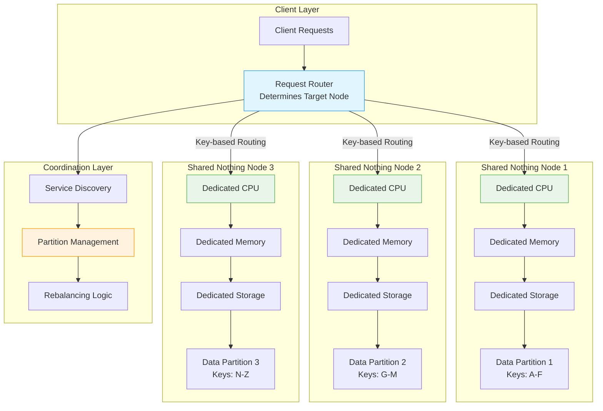

## The Complete Blueprint

Shared Nothing architecture is a distributed computing pattern where each processing node operates completely independently with its own dedicated CPU, memory, and storage resources, eliminating all shared state and resources between nodes. This architectural approach ensures that nodes never compete for resources, avoid bottlenecks from shared components, and can scale linearly by adding more independent nodes without coordination overhead. Each node processes its assigned partition of data locally, communicates only through well-defined network protocols, and maintains no shared memory or disk storage with other nodes. The pattern eliminates the fundamental scalability bottlenecks that plague shared-memory and shared-disk architectures, where contention for shared resources creates performance ceilings. Shared Nothing enables systems to achieve near-linear scalability because adding nodes increases both processing power and storage capacity proportionally, while fault isolation ensures that node failures don't cascade to other parts of the system. This architecture powers many large-scale distributed systems including Amazon DynamoDB, Google Spanner, and Apache Cassandra, where horizontal scaling requirements exceed what shared-resource architectures can deliver.

### What You'll Master

By implementing Shared Nothing architecture, you'll achieve **linear scalability** where adding nodes increases system capacity proportionally without diminishing returns, **resource isolation** that eliminates contention bottlenecks and provides predictable performance, **fault containment** where node failures don't cascade to other system components, **horizontal scaling mastery** through effective data partitioning and request routing strategies, and **distributed systems design** skills for building systems that can grow from thousands to millions of operations per second. You'll master the fundamental principles of building truly scalable systems that avoid the architectural ceilings that limit shared-resource approaches.

## Essential Question
## When to Use / When NOT to Use

### When to Use

| Scenario | Why It Fits | Alternative If Not |
|----------|-------------|-------------------|
| High availability required | Pattern provides resilience | Consider simpler approach |
| Scalability is critical | Handles load distribution | Monolithic might suffice |
| Distributed coordination needed | Manages complexity | Centralized coordination |

### When NOT to Use

| Scenario | Why to Avoid | Better Alternative |
|----------|--------------|-------------------|
| Simple applications | Unnecessary complexity | Direct implementation |
| Low traffic systems | Overhead not justified | Basic architecture |
| Limited resources | High operational cost | Simpler patterns |
**How do we structure our system architecture to leverage shared nothing architecture?**

# Shared Nothing Architecture

## 🎯 The Essence

!!! tip "Core Concept"
    Each node in the system owns its data and compute exclusively - no shared memory, no shared disk, no shared anything. Communication happens only through the network.

## 🔍 Intuition: The Restaurant Kitchen Analogy

Imagine two restaurant kitchen designs:

**Shared Kitchen** (Traditional): All chefs share the same stove, refrigerator, and prep stations. They constantly bump into each other, wait for equipment, and coordinate access.

**Station Kitchen** (Shared Nothing): Each chef has their own complete station - stove, ingredients, tools. They work independently and only communicate to pass completed dishes.

The station kitchen scales linearly - add more chefs, get proportionally more output. The shared kitchen hits bottlenecks quickly.

## 📊 Architecture Comparison

| Aspect | Shared Nothing | Shared Memory | Shared Disk |
|--------|----------------|---------------|-------------|
| **Scalability** | Linear (near-perfect) | Limited by memory bus | Limited by disk I/O |
| **Fault Isolation** | Excellent | Poor | Moderate |
| **Complexity** | Higher (coordination) | Lower | Moderate |
| **Cost** | Higher (duplication) | Lower | Moderate |
| **Use Cases** | Web scale systems | HPC, Databases | Traditional databases |

## 🏗️ Implementation Patterns

### 1. Data Partitioning Strategy

**System Flow:** Input → Processing → Output

### 2. Request Routing Implementation

**System Flow:** Input → Processing → Output

## 💥 Failure Modes & Mitigation

### 1. Node Failure Handling

📄 View mermaid code (10 lines)

**Process Overview:** See production implementations for details

### 2. Network Partition Handling

**System Flow:** Input → Processing → Output

View implementation code

**Process Overview:** See production implementations for details

📄 View implementation code

class PartitionTolerantNode(Node):
    def __init__(self, node_id: int, replicas: List[Node]):
        super().__init__(node_id)
        self.replicas = replicas
        self.partition_detector = PartitionDetector()
        
    def handle_cross_partition_request(self, keys: List[str]):
        """Handle requests that span partitions"""
        results = {}
        failed_keys = []
        
        # Group keys by partition
        partition_map = self._group_by_partition(keys)
        
        # Execute in parallel with timeout
        with ThreadPoolExecutor(max_workers=10) as executor:
            futures = {}
            for partition, partition_keys in partition_map.items():
                node = self._get_node_for_partition(partition)
                future = executor.submit(
                    self._fetch_with_timeout,
                    node,
                    partition_keys,
                    timeout=5.0
                )
                futures[future] = partition_keys
                
            # Collect results
            for future in as_completed(futures, timeout=10):
                try:
                    partition_results = future.result()
                    results.update(partition_results)
                except TimeoutError:
                    failed_keys.extend(futures[future])
                except NetworkPartitionError:
                    # Attempt replica read
                    self._attempt_replica_read(futures[future], results)
                    
        return results, failed_keys

## 🎯 Design Decisions

| Decision Point | Options | Trade-offs |
|----------------|---------|------------|
| **Partition Strategy** | Range, Hash, Geographic | Balance vs Locality |
| **Replication** | None, Leader-Follower, Multi-Master | Availability vs Complexity |
| **Consistency** | Eventual, Strong per-partition | Performance vs Guarantees |
| **Routing** | Client-side, Proxy, Gossip | Latency vs Flexibility |

## 🚀 Performance Characteristics

📄 View mermaid code (10 lines)

**System Flow:** Input → Processing → Output

## 🌍 Real-World Examples

### 1. **Amazon DynamoDB**
- Each node owns specific key ranges
- No shared state between nodes
- Achieves millions of requests/second

### 2. **Google Spanner**
- Sharded by key ranges
- Each shard is independent
- Cross-shard transactions via 2PC

### 3. **Cassandra**
- Ring-based architecture
- Each node owns token ranges
- Peer-to-peer, no single point of failure

## ⚖️ When to Use vs Avoid

### ✅ Use When:
- **Horizontal scalability** is critical
- **Workload is partitionable** by some key
- **Independence** between partitions
- **Fault isolation** is important

### ❌ Avoid When:
- **Complex joins** across data
- **Global transactions** required
- **Shared state** is fundamental
- **Small scale** (overhead not justified)

## 🔗 Related Patterns

- **[Sharding](../scaling/sharding.md)**: Data partitioning strategy
- **[Consistent Hashing](../data-management/consistent-hashing.md)**: Partition assignment
- **[Service Mesh](../communication/service-mesh.md)**: Inter-node communication
- **[Bulkhead](../resilience/bulkhead.md)**: Fault isolation principle

*Start your journey with relatable analogies*

### The Elevator Pitch
[Pattern explanation in simple terms]

### Real-World Analogy
[Everyday comparison that explains the concept]

*Build core understanding*

### Core Concepts
- Key principle 1
- Key principle 2
- Key principle 3

### Basic Example
**System Flow:** Input → Processing → Output

*Understand implementation details*

### How It Really Works
[Technical implementation details]

### Common Patterns
[Typical usage patterns]

*Master advanced techniques*

### Advanced Configurations
[Complex scenarios and optimizations]

### Performance Tuning
[Optimization strategies]

*Apply in production*

### Real-World Case Studies
[Production examples from major companies]

### Lessons from the Trenches
[Common pitfalls and solutions]

## Decision Matrix

### Quick Decision Table

| Factor | Low Complexity | Medium Complexity | High Complexity |
|--------|----------------|-------------------|-----------------|
| Team Size | < 5 developers | 5-20 developers | > 20 developers |
| Traffic | < 1K req/s | 1K-100K req/s | > 100K req/s |
| Data Volume | < 1GB | 1GB-1TB | > 1TB |
| **Recommendation** | ❌ Avoid | ⚠️ Consider | ✅ Implement |

