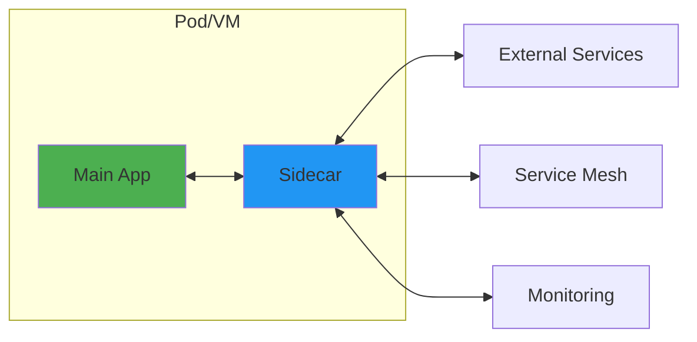
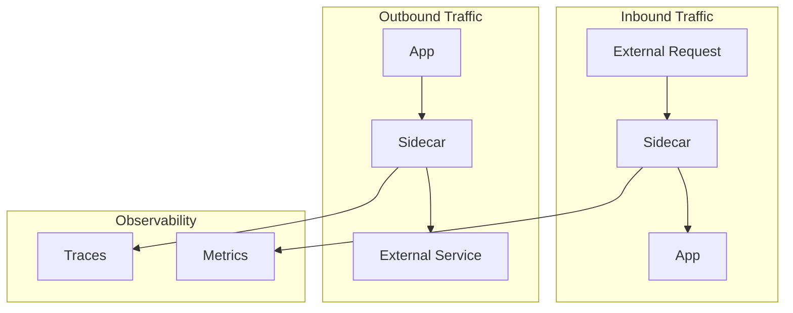

# Sidecar Pattern

!!! success "🏆 Gold Standard Pattern"
    **Container-Based Separation of Concerns** • Istio, Linkerd, Envoy proven
    
    The foundation of modern service mesh architectures. Sidecars enable platform-agnostic 
    deployment of cross-cutting concerns like security, observability, and traffic management 
    without modifying application code.

## Essential Question
**How do we add infrastructure capabilities without modifying application code?**

## When to Use / When NOT to Use

### Use When
| Scenario | Example | Benefit |
|----------|---------|---------|
| Service mesh adoption | Istio/Linkerd | Zero code changes |
| Cross-cutting concerns | Auth, logging, metrics | Centralized management |
| Polyglot environments | Multiple languages | Language-agnostic |
| Legacy modernization | Add capabilities to old apps | No source access needed |
| Protocol translation | HTTP to gRPC | Transparent conversion |

### DON'T Use When
| Scenario | Why | Alternative |
|----------|-----|-------------|
| Monolithic apps | Unnecessary complexity | Use libraries |
| < 5 microservices | Overhead not justified | Direct integration |
| Ultra-low latency | Added hop costs 0.5-2ms | In-process libraries |
| Resource-constrained | Doubles container count | Shared libraries |
| Simple apps | Over-engineering | Built-in features |

## Level 1: Intuition (5 min)

### The Motorcycle Sidecar
Like a motorcycle sidecar that carries extra equipment without modifying the bike, 
a software sidecar carries infrastructure concerns without touching your app.

### Visual Architecture


### Core Value
<div class="axiom-box">
<h4>⚛️ Separation of Concerns at Runtime</h4>

Your app focuses on business logic. The sidecar handles:
- Security (mTLS, auth)
- Observability (metrics, traces)
- Traffic (routing, retries)
- Configuration (dynamic updates)
</div>

## Level 2: Foundation (10 min)

### Architecture Patterns

| Pattern | Description | Use Case |
|---------|-------------|----------|
| Proxy Sidecar | Intercepts network traffic | Service mesh, API gateway |
| Agent Sidecar | Collects and ships data | Logging, monitoring |
| Adapter Sidecar | Protocol/format conversion | Legacy integration |
| Ambassador Sidecar | Simplifies external access | Database proxies |

### Basic Implementation
```yaml
# Kubernetes Pod with sidecar
apiVersion: v1
kind: Pod
metadata:
  name: app-with-sidecar
spec:
  containers:
  # Main application
  - name: app
    image: myapp:1.0
    ports:
    - containerPort: 8080
    
  # Envoy sidecar
  - name: envoy
    image: envoyproxy/envoy:v1.24
    ports:
    - containerPort: 15001
    volumeMounts:
    - name: envoy-config
      mountPath: /etc/envoy
    command: ["/usr/local/bin/envoy"]
    args: ["-c", "/etc/envoy/envoy.yaml"]
    
  volumes:
  - name: envoy-config
    configMap:
      name: envoy-config
```

### Communication Patterns


## Level 3: Deep Dive (15 min)

### Common Sidecar Types

<div class="decision-box">
<h4>Service Mesh Proxy (Envoy/Linkerd)</h4>

**Capabilities:**
- Automatic mTLS between services
- Load balancing with circuit breaking
- Distributed tracing injection
- Fine-grained traffic policies

**Trade-offs:**
- +0.5-2ms latency per hop
- ~50MB memory overhead
- Requires service mesh control plane
</div>

<div class="decision-box">
<h4>Logging/Monitoring Agent (Fluentd/Telegraf)</h4>

**Capabilities:**
- Log collection and forwarding
- Metrics aggregation
- Format transformation
- Buffering and retry

**Trade-offs:**
- ~30MB memory overhead
- CPU usage scales with log volume
- Requires log storage backend
</div>

### Implementation Patterns

#### 1. Transparent Proxy
```python
# App code - no changes needed
import requests

# This automatically goes through sidecar
response = requests.get("http://other-service/api/data")
```

```yaml
# Sidecar intercepts via iptables
initContainers:
- name: init-iptables
  image: istio/pilot
  command: ["iptables", "-t", "nat", "-A", 
            "OUTPUT", "-p", "tcp", "-j", "REDIRECT",
            "--to-port", "15001"]
```

#### 2. Explicit Proxy
```python
# App explicitly uses sidecar
SIDECAR_URL = "http://localhost:15001"

response = requests.get(
    f"{SIDECAR_URL}/proxy/other-service/api/data"
)
```

## Level 4: Expert (20 min)

### Production Considerations

| Aspect | Challenge | Solution |
|--------|-----------|----------|
| Startup Order | App starts before sidecar | Health check dependencies |
| Shutdown | Sidecar dies first | Graceful termination hooks |
| Resource Limits | Competition for resources | Careful limit tuning |
| Debugging | Extra hop complexity | Distributed tracing |
| Security | Shared pod/VM | Network policies |

### Advanced Patterns

#### Multi-Sidecar Architecture
```yaml
spec:
  containers:
  - name: app
    image: myapp:1.0
    
  # Traffic management
  - name: envoy
    image: envoyproxy/envoy:v1.24
    
  # Security scanning
  - name: falco
    image: falcosecurity/falco:latest
    
  # Log shipping
  - name: fluentbit
    image: fluent/fluent-bit:2.0
```

#### Sidecar Injection
```yaml
# Automatic injection via admission webhook
apiVersion: v1
kind: Namespace
metadata:
  name: production
  labels:
    istio-injection: enabled  # Auto-inject sidecars
```

### Performance Tuning
```yaml
# Resource allocation strategy
resources:
  # Main app gets majority
  app:
    requests:
      cpu: 800m
      memory: 1Gi
    limits:
      cpu: 1000m
      memory: 2Gi
      
  # Sidecar gets minimum needed
  sidecar:
    requests:
      cpu: 100m
      memory: 128Mi
    limits:
      cpu: 200m
      memory: 256Mi
```

## Level 5: Mastery (30 min)

### Real-World Implementations

#### Lyft's Envoy Architecture
```yaml
# Envoy sidecar configuration
static_resources:
  listeners:
  - name: ingress
    address:
      socket_address:
        address: 0.0.0.0
        port_value: 15001
    filter_chains:
    - filters:
      - name: envoy.http_connection_manager
        typed_config:
          stat_prefix: ingress_http
          codec_type: AUTO
          route_config:
            virtual_hosts:
            - name: backend
              domains: ["*"]
              routes:
              - match: {prefix: "/"}
                route:
                  cluster: local_app
                  timeout: 30s
                  retry_policy:
                    retry_on: "5xx"
                    num_retries: 3
          http_filters:
          - name: envoy.router
            
  clusters:
  - name: local_app
    type: STATIC
    connect_timeout: 0.25s
    lb_policy: ROUND_ROBIN
    load_assignment:
      cluster_name: local_app
      endpoints:
      - lb_endpoints:
        - endpoint:
            address:
              socket_address:
                address: 127.0.0.1
                port_value: 8080
```

#### Netflix's Sidecar Evolution
1. **Prana (2014)**: Simple HTTP sidecar for service discovery
2. **Ribbon (2015)**: Client-side load balancing
3. **Zuul2 (2018)**: Async non-blocking proxy
4. **Service Mesh (2020+)**: Full Envoy adoption

### Migration Strategy

<div class="truth-box">
<h4>🎯 Incremental Adoption Path</h4>

1. **Pilot**: One non-critical service
2. **Expand**: Similar services in same domain
3. **Critical Path**: After proving stability
4. **Full Mesh**: When benefits proven

**Timeline**: 6-12 months for full adoption
</div>

## Quick Reference

### Decision Matrix
| Factor | Use Sidecar | Use Library | Use Service |
|--------|------------|-------------|-------------|
| Language diversity | High | Low | Medium |
| Team autonomy | High | Low | Medium |
| Update frequency | Frequent | Rare | Moderate |
| Performance critical | No | Yes | Depends |
| Operational maturity | High | Low | Medium |

### Common Sidecars
```yaml
# Service Mesh
istio:
  image: istio/pilot:1.17
  purpose: Traffic management, security
  overhead: 50MB RAM, 0.5ms latency

# Logging
fluentbit:
  image: fluent/fluent-bit:2.0  
  purpose: Log collection, forwarding
  overhead: 30MB RAM, 5% CPU

# Monitoring  
telegraf:
  image: telegraf:1.26
  purpose: Metrics collection
  overhead: 40MB RAM, 2% CPU

# Security
falco:
  image: falcosecurity/falco:0.34
  purpose: Runtime security
  overhead: 60MB RAM, 10% CPU
```

### Production Checklist ✓
- [ ] Define container startup order
- [ ] Set appropriate resource limits
- [ ] Configure health checks for all containers
- [ ] Implement graceful shutdown
- [ ] Set up inter-container networking
- [ ] Configure security policies
- [ ] Monitor sidecar performance
- [ ] Document failure scenarios
- [ ] Test sidecar updates independently
- [ ] Plan for debugging complexity

## Related Patterns
- **[Service Mesh](../architecture/service-mesh.md)**: Multi-sidecar orchestration
- **[Ambassador](../architecture/ambassador.md)**: Specialized proxy pattern
- **[Adapter](../architecture/adapter.md)**: Format conversion pattern
- **[Circuit Breaker](../resilience/circuit-breaker.md)**: Often implemented in sidecars
- **[Bulkhead](../resilience/bulkhead.md)**: Isolation via sidecars
- **[API Gateway](../architecture/api-gateway.md)**: Centralized vs distributed

## References
- [Kubernetes Sidecar Pattern](https://kubernetes.io/docs/concepts/workloads/pods/sidecar-containers/)
- [Envoy Proxy Documentation](https://www.envoyproxy.io/docs/envoy/latest/)
- [Istio Architecture](https://istio.io/latest/docs/concepts/what-is-istio/)