# Sidecar Pattern

!!! success "🏆 Gold Standard Pattern"
    **Container-Based Separation of Concerns** • Istio, Linkerd, Envoy proven
    
    The foundation of modern service mesh architectures. Sidecars enable platform-agnostic 
    deployment of cross-cutting concerns without modifying application code.

## Essential Question
**How do we add infrastructure capabilities without modifying application code?**

## The Motorcycle Analogy

<div class="axiom-box">
<h4>🏍️ The Sidecar Intuition</h4>

Like a motorcycle sidecar that carries extra equipment without modifying the bike itself, 
a software sidecar carries infrastructure concerns without touching your application code.

**The motorcycle handles:** Transportation (business logic)  
**The sidecar handles:** Extra cargo (security, observability, routing)

Both work together but remain independent - you can upgrade the sidecar without changing the motorcycle.
</div>

## Architecture Overview


<details>
<summary>View implementation code</summary>


</details>

## Sidecar vs Alternatives

| Approach | Sidecar | Library | Service Mesh Only |
|----------|---------|---------|-------------------|
| **Code Changes** | None | Required | None |
| **Language Support** | Any | Language-specific | Any |
| **Deployment** | Per-instance | In-process | Cluster-wide |
| **Update Process** | Independent | Redeploy app | Rolling update |
| **Performance** | +0.5-2ms latency | Native speed | Network hop |
| **Resource Usage** | +50-100MB RAM | Shared with app | Control plane overhead |
| **Debugging** | Separate logs | Integrated | Distributed |
| **Best For** | Polyglot, legacy apps | Greenfield, performance-critical | Large-scale orchestration |

## When to Use Sidecars

### ✅ Use When
- **Service mesh adoption**: Zero code changes for mTLS, routing, observability
- **Polyglot environments**: Java, Python, Go services need same capabilities
- **Legacy modernization**: Add cloud-native features to unchangeable apps
- **Team autonomy**: Platform team manages sidecars, app teams focus on logic
- **Compliance requirements**: Centralized security/audit without touching apps

### ❌ Don't Use When
- **< 5 microservices**: Overhead exceeds benefits
- **Ultra-low latency**: Can't afford extra network hop
- **Resource-constrained**: Doubles container count
- **Simple CRUD apps**: Over-engineering for basic needs
- **Monolithic apps**: Use libraries instead

## Common Sidecar Types

```mermaid
graph LR
    subgraph "Service Mesh Proxy"
        SM[Envoy/Linkerd<br/>• mTLS<br/>• Load balancing<br/>• Circuit breaking]
    end
    
    subgraph "Observability Agent"
        OA[Fluentd/Telegraf<br/>• Log collection<br/>• Metrics export<br/>• Trace injection]
    end
    
    subgraph "Security Scanner"
        SS[Falco/OPA<br/>• Runtime protection<br/>• Policy enforcement<br/>• Threat detection]
    end
    
    subgraph "Protocol Adapter"
        PA[Custom Proxy<br/>• HTTP → gRPC<br/>• REST → GraphQL<br/>• Legacy → Modern]
    end
```




## Level 1: Intuition (5 minutes)

*Start your journey with relatable analogies*

### The Elevator Pitch
[Pattern explanation in simple terms]

### Real-World Analogy
[Everyday comparison that explains the concept]

## Level 2: Foundation (10 minutes)

*Build core understanding*

### Core Concepts
- Key principle 1
- Key principle 2
- Key principle 3

### Basic Example


## Level 3: Deep Dive (15 minutes)

*Understand implementation details*

### How It Really Works
[Technical implementation details]

### Common Patterns
[Typical usage patterns]

## Level 4: Expert (20 minutes)

*Master advanced techniques*

### Advanced Configurations
[Complex scenarios and optimizations]

### Performance Tuning
[Optimization strategies]

## Level 5: Mastery (30 minutes)

*Apply in production*

### Real-World Case Studies
[Production examples from major companies]

### Lessons from the Trenches
[Common pitfalls and solutions]


## Decision Matrix


### Quick Decision Table

| Factor | Low Complexity | Medium Complexity | High Complexity |
|--------|----------------|-------------------|-----------------|
| Team Size | < 5 developers | 5-20 developers | > 20 developers |
| Traffic | < 1K req/s | 1K-100K req/s | > 100K req/s |
| Data Volume | < 1GB | 1GB-1TB | > 1TB |
| **Recommendation** | ❌ Avoid | ⚠️ Consider | ✅ Implement |

## Implementation Example


<details>
<summary>View implementation code</summary>

```yaml
apiVersion: v1
kind: Pod
metadata:
  name: app-with-sidecar
spec:
  containers:
  # Main application
  - name: app
    image: myapp:1.0
    ports:
    - containerPort: 8080
    resources:
      requests:
        cpu: 800m
        memory: 1Gi
    
  # Envoy sidecar proxy
  - name: envoy
    image: envoyproxy/envoy:v1.24
    ports:
    - containerPort: 15001
    resources:
      requests:
        cpu: 100m
        memory: 128Mi
    volumeMounts:
    - name: envoy-config
      mountPath: /etc/envoy
      
  # Init container for traffic interception
  initContainers:
  - name: init-iptables
    image: istio/pilot
    securityContext:
      capabilities:
        add: ["NET_ADMIN"]
    command:
    - sh
    - -c
    - |
      iptables -t nat -A OUTPUT -p tcp -j REDIRECT --to-port 15001
      
  volumes:
  - name: envoy-config
    configMap:
      name: envoy-config
```

</details>

## Traffic Flow Patterns


## Production Considerations

### Resource Allocation Strategy

| Component | CPU Request | CPU Limit | Memory Request | Memory Limit |
|-----------|-------------|-----------|----------------|--------------|
| Main App | 800m | 1000m | 1Gi | 2Gi |
| Envoy Sidecar | 100m | 200m | 128Mi | 256Mi |
| Fluentd Sidecar | 50m | 100m | 64Mi | 128Mi |
| **Total Pod** | **950m** | **1300m** | **1.2Gi** | **2.4Gi** |

### Critical Design Decisions


## Real-World Examples

### Netflix Evolution
1. **2014**: Prana sidecar for service discovery
2. **2016**: Ribbon for client-side load balancing
3. **2018**: Zuul2 as async proxy sidecar
4. **2020+**: Full Envoy/service mesh adoption

### Lyft's Envoy Success
- **Scale**: 10,000+ sidecars in production
- **Performance**: < 1ms p99 latency overhead
- **Features**: Automatic retries, circuit breaking, observability
- **Result**: 50% reduction in service incidents

## Migration Path

<div class="decision-box">
<h4>📈 Incremental Adoption Strategy</h4>

**Phase 1 (Month 1-2): Pilot**
- Single non-critical service
- Monitor performance impact
- Establish operational patterns

**Phase 2 (Month 3-4): Expand**
- Similar services in domain
- Standardize configurations
- Build automation

**Phase 3 (Month 5-6): Critical Path**
- Customer-facing services
- Full observability integration
- Incident response procedures

**Phase 4 (Month 7-12): Full Mesh**
- All applicable services
- Advanced traffic management
- Multi-cluster deployment
</div>

## Anti-Patterns to Avoid

| Anti-Pattern | Problem | Solution |
|--------------|---------|----------|
| **Sidecar Sprawl** | 5+ sidecars per pod | Consolidate functionality |
| **Tight Coupling** | App depends on sidecar | Design for independence |
| **Resource Starvation** | Sidecars consume too much | Set strict limits |
| **Config Drift** | Inconsistent sidecar configs | Centralize management |
| **Missing Health Checks** | Silent failures | Monitor all containers |

## Quick Decision Framework


## Production Checklist ✓

**Before Deployment:**
- [ ] Resource limits defined for all containers
- [ ] Startup dependencies configured
- [ ] Health checks for app and sidecar
- [ ] Network policies between containers
- [ ] Logging aggregation setup

**During Operation:**
- [ ] Monitor sidecar overhead (CPU, memory, latency)
- [ ] Track sidecar-specific metrics
- [ ] Version sidecars independently
- [ ] Test failure scenarios regularly
- [ ] Document troubleshooting procedures

**For Incidents:**
- [ ] Can disable sidecar if needed
- [ ] Separate alerting for sidecar issues
- [ ] Runbooks for common problems
- [ ] Rollback procedures tested

## Related Patterns

- **[Service Mesh](../architecture/service-mesh.md)**: Orchestrates multiple sidecars
- **[Ambassador](../architecture/ambassador.md)**: Specialized proxy pattern
- **[Circuit Breaker](../resilience/circuit-breaker.md)**: Often implemented in sidecars
- **[Bulkhead](../resilience/bulkhead.md)**: Isolation via sidecars
- **[API Gateway](../architecture/api-gateway.md)**: Centralized alternative

## References

- [Envoy Proxy Architecture](https://www.envoyproxy.io/docs/envoy/latest/intro/arch_overview/intro/intro)
- [Kubernetes Sidecar Containers](https://kubernetes.io/docs/concepts/workloads/pods/sidecar-containers/)
- [Service Mesh Comparison](https://servicemesh.io/)