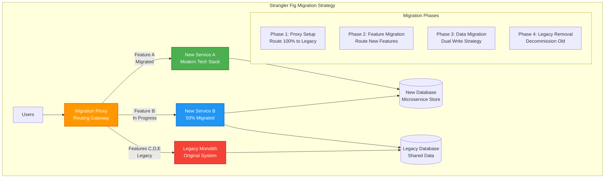

## The Complete Blueprint

The Strangler Fig Pattern is the **incremental modernization strategy** that enables teams to safely replace legacy systems by gradually routing functionality to new implementations, avoiding the catastrophic risks of big-bang rewrites. Named after the strangler fig plant that grows around and eventually replaces its host tree, this pattern **encapsulates legacy systems** while systematically migrating functionality to modern architectures. It provides a proven path for transforming monolithic applications into microservices, replacing outdated technologies, and modernizing critical business systems without service disruption.

📄 View Complete Strangler Fig Migration (18 lines)

This blueprint illustrates **progressive migration routing** through intelligent proxies, **parallel system operation** during transition periods, and **systematic legacy replacement** that minimizes disruption while enabling modernization.

### What You'll Master

- **Migration Proxy Architecture**: Design intelligent routing layers that can selectively direct traffic to legacy or modern systems based on feature readiness and user segments
- **Feature-by-Feature Migration**: Plan and execute systematic migration strategies that incrementally move functionality while maintaining business continuity
- **Dual-Write Data Strategies**: Implement data synchronization patterns that maintain consistency between legacy and modern data stores during transition periods
- **Risk Mitigation Techniques**: Build rollback mechanisms, parallel run capabilities, and monitoring systems that ensure migration safety
- **Legacy System Integration**: Design anti-corruption layers and adapters that enable new services to interact with legacy systems without inheriting technical debt

## Essential Question
## When to Use / When NOT to Use

### When to Use

| Scenario | Why It Fits | Alternative If Not |
|----------|-------------|-------------------|
| High availability required | Pattern provides resilience | Consider simpler approach |
| Scalability is critical | Handles load distribution | Monolithic might suffice |
| Distributed coordination needed | Manages complexity | Centralized coordination |

### When NOT to Use

| Scenario | Why to Avoid | Better Alternative |
|----------|--------------|-------------------|
| Simple applications | Unnecessary complexity | Direct implementation |
| Low traffic systems | Overhead not justified | Basic architecture |
| Limited resources | High operational cost | Simpler patterns |
**How do we structure our system architecture to leverage strangler fig?**

# Strangler Fig Pattern

!!! info "The Botanical Metaphor"
    The strangler fig tree starts life as a seed deposited high in another tree. It sends roots down and vines up, gradually enveloping the host tree. Eventually, the host dies and decomposes, leaving the strangler fig standing independently—a perfect metaphor for legacy system replacement.

## Problem Statement

<h4>The Big Bang Disaster</h4>

A major bank attempted a complete system rewrite over 3 years. On cutover weekend:

<ul>
<li>40% of transactions failed silently</li>
<li>Customer data inconsistencies affected 2M accounts</li>
<li>Rollback took 72 hours of downtime</li>
<li>$50M in losses and regulatory fines</li>
</ul>

<strong>Root cause:</strong> Attempting to replace everything at once instead of incremental migration

## Solution Overview

## Level 1: Intuition (5 minutes)

*Start your journey with relatable analogies*

### The Elevator Pitch
[Pattern explanation in simple terms]

### Real-World Analogy
[Everyday comparison that explains the concept]

## Level 2: Foundation (10 minutes)

*Build core understanding*

### Core Concepts
- Key principle 1
- Key principle 2
- Key principle 3

### Basic Example

## Level 3: Deep Dive (15 minutes)

*Understand implementation details*

### How It Really Works
[Technical implementation details]

### Common Patterns
[Typical usage patterns]

## Level 4: Expert (20 minutes)

*Master advanced techniques*

### Advanced Configurations
[Complex scenarios and optimizations]

### Performance Tuning
[Optimization strategies]

## Level 5: Mastery (30 minutes)

*Apply in production*

### Real-World Case Studies
[Production examples from major companies]

### Lessons from the Trenches
[Common pitfalls and solutions]

## Decision Matrix

### Quick Decision Table

| Factor | Low Complexity | Medium Complexity | High Complexity |
|--------|----------------|-------------------|-----------------|
| Team Size | < 5 developers | 5-20 developers | > 20 developers |
| Traffic | < 1K req/s | 1K-100K req/s | > 100K req/s |
| Data Volume | < 1GB | 1GB-1TB | > 1TB |
| **Recommendation** | ❌ Avoid | ⚠️ Consider | ✅ Implement |

## Implementation Strategies

### 1. Edge Proxy Strategy

### Strategy Comparison

| Feature | Edge Proxy | Branch by Abstraction | Parallel Run |
|---------|------------|----------------------|--------------|
| **Deployment Risk** | Low | Medium | Low |
| **Rollback Speed** | Instant | Code Deploy | Instant |
| **Performance Impact** | +5-10ms latency | Minimal | 2x resource usage |
| **Code Complexity** | External | Internal refactoring | Comparison logic |
| **Best For** | API-based systems | Monolithic codebases | Critical systems |

### Migration Decision Tree

### 2. Branch by Abstraction Strategy

### 3. Parallel Run Strategy

## Progressive Migration Patterns

### Database Strangling

### Feature Toggle Evolution

## Risk Mitigation Matrix

| Risk | Mitigation Strategy | Rollback Plan |
|------|-------------------|---------------|
| **Data Inconsistency** | Dual writes with reconciliation | Replay from event log |
| **Performance Degradation** | Shadow load testing | Route back to legacy |
| **Feature Parity Gap** | Parallel run comparison | Feature flags per endpoint |
| **Integration Failures** | Circuit breakers + fallbacks | Instant proxy reroute |
| **State Corruption** | Event sourcing + snapshots | Point-in-time recovery |

## Real-World Examples

### Example 1: Amazon Product Catalog Migration

<h4>Migration Strategy</h4>
<ul>
<li><strong>Duration:</strong> 18 months</li>
<li><strong>Approach:</strong> Category-by-category migration</li>
<li><strong>Key Success Factors:</strong>
  <ul>
  <li>Shadow traffic for 3 months per category</li>
  <li>Automated comparison of 100M+ requests daily</li>
  <li>Gradual traffic shift: 1% → 5% → 25% → 50% → 100%</li>
  </ul>
</li>
<li><strong>Result:</strong> Zero customer-facing incidents</li>
</ul>

### Example 2: Netflix Billing System Evolution

## Anti-Patterns to Avoid

### 1. The Incomplete Strangler

### 2. The Feature Disparity Trap

| Anti-Pattern | Symptoms | Solution |
|--------------|----------|----------|
| **Incomplete Feature Migration** | New system missing 20% features | Feature inventory before starting |
| **Data Model Mismatch** | Constant translation overhead | Gradual schema evolution |
| **Performance Regression** | New system 3x slower | Performance gates per migration |
| **Dependency Tangle** | Circular dependencies emerge | Clear bounded contexts |

## Integration with Other Patterns

### API Gateway Integration

### Service Mesh Enhancement

## Level 1: Intuition (5 minutes)

*Start your journey with relatable analogies*

### The Elevator Pitch
[Pattern explanation in simple terms]

### Real-World Analogy
[Everyday comparison that explains the concept]

## Level 2: Foundation (10 minutes)

*Build core understanding*

### Core Concepts
- Key principle 1
- Key principle 2
- Key principle 3

### Basic Example

## Level 3: Deep Dive (15 minutes)

*Understand implementation details*

### How It Really Works
[Technical implementation details]

### Common Patterns
[Typical usage patterns]

## Level 4: Expert (20 minutes)

*Master advanced techniques*

### Advanced Configurations
[Complex scenarios and optimizations]

### Performance Tuning
[Optimization strategies]

## Level 5: Mastery (30 minutes)

*Apply in production*

### Real-World Case Studies
[Production examples from major companies]

### Lessons from the Trenches
[Common pitfalls and solutions]

## Decision Matrix

### Quick Decision Table

| Factor | Low Complexity | Medium Complexity | High Complexity |
|--------|----------------|-------------------|-----------------|
| Team Size | < 5 developers | 5-20 developers | > 20 developers |
| Traffic | < 1K req/s | 1K-100K req/s | > 100K req/s |
| Data Volume | < 1GB | 1GB-1TB | > 1TB |
| **Recommendation** | ❌ Avoid | ⚠️ Consider | ✅ Implement |

## Implementation Checklist

<h4>Pre-Migration Checklist</h4>
<ul>
<li>☐ Complete feature inventory of legacy system</li>
<li>☐ Identify all integration points and dependencies</li>
<li>☐ Design routing/proxy layer architecture</li>
<li>☐ Establish metrics for comparison</li>
<li>☐ Create rollback procedures for each phase</li>
<li>☐ Set up parallel run infrastructure</li>
<li>☐ Define success criteria per component</li>
</ul>

<h4>During Migration Checklist</h4>
<ul>
<li>☐ Monitor error rates continuously</li>
<li>☐ Compare outputs in parallel run</li>
<li>☐ Validate data consistency daily</li>
<li>☐ Track performance metrics</li>
<li>☐ Maintain feature parity documentation</li>
<li>☐ Regular stakeholder communication</li>
<li>☐ Gradual traffic shift (1% → 5% → 25% → 50% → 100%)</li>
</ul>

## Monitoring and Observability

## Success Criteria

| Metric | Target | Measurement |
|--------|--------|-------------|
| **Error Rate** | < 0.01% increase | Compare legacy vs new |
| **Latency** | < 5% increase | p50, p95, p99 |
| **Consistency** | 99.999% match | Parallel run comparison |
| **Availability** | No degradation | Same SLA maintained |
| **Cost** | < 20% increase during migration | Include dual running |

## Related Patterns

- [API Gateway](../communication/api-gateway.md) - Front-door for routing during migration
- [Service Mesh](../communication/service-mesh.md) - Traffic management and observability
- [Anti-Corruption Layer](../architecture/anti-corruption-layer.md) - Protect new services from legacy
- [Event Sourcing](../data-management/event-sourcing.md) - Capture all changes for replay
- [Circuit Breaker](../resilience/circuit-breaker.md) - Protect during partial failures

## References

- Martin Fowler's original [Strangler Fig Application](https://martinfowler.com/bliki/StranglerFigApplication.html.md)
- [Monolith to Microservices](https://www.oreilly.com/library/view/monolith-to-microservices/9781492047834.md) by Sam Newman
- AWS [Strangler Fig Pattern Guide](https://docs.aws.amazon.com/prescriptive-guidance/latest/modernization-aspnet-web-services/fig-pattern.html.md)

