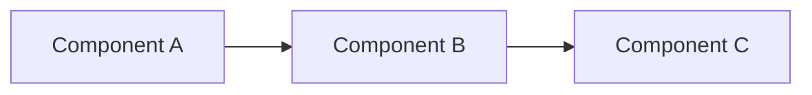
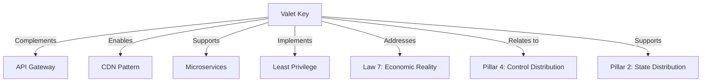

## Essential Question

**How do we structure our system architecture to leverage valet key pattern?**

# Valet Key Pattern

!!! abstract "Pattern Overview"
    **🎯 Purpose**: Grant temporary, limited access to resources without sharing credentials
    **🔑 Analogy**: Like a hotel valet key that only starts the car but can't open the trunk
    **💰 Benefit**: Eliminates proxy overhead for large file transfers
    **⚡ Performance**: Direct client-to-storage = 10-100x faster

## The Problem

### Traditional Approach: Everything Through Your Servers

### The Valet Key Solution

## How It Works

### Valet Key Flow

### Valet Key Components

| Component | Purpose | Example |
|-----------|---------|---------|
| **Resource URI** | What to access | `https://storage.example.com/bucket/file.pdf` |
| **Permissions** | What actions allowed | `READ`, `WRITE`, `DELETE` |
| **Expiration** | Time limit | `2024-01-26T15:30:00Z` |
| **Signature** | Tamper-proof validation | `HMAC-SHA256(data, secret)` |
| **Constraints** | Additional limits | IP range, file size, content type |

## Level 1: Intuition (5 minutes)

*Start your journey with relatable analogies*

### The Elevator Pitch
[Pattern explanation in simple terms]

### Real-World Analogy
[Everyday comparison that explains the concept]

## Level 2: Foundation (10 minutes)

*Build core understanding*

### Core Concepts
- Key principle 1
- Key principle 2
- Key principle 3

### Basic Example

## Level 3: Deep Dive (15 minutes)

*Understand implementation details*

### How It Really Works
[Technical implementation details]

### Common Patterns
[Typical usage patterns]

## Level 4: Expert (20 minutes)

*Master advanced techniques*

### Advanced Configurations
[Complex scenarios and optimizations]

### Performance Tuning
[Optimization strategies]

## Level 5: Mastery (30 minutes)

*Apply in production*

### Real-World Case Studies
[Production examples from major companies]

### Lessons from the Trenches
[Common pitfalls and solutions]

## Decision Matrix

### Quick Decision Table

| Factor | Low Complexity | Medium Complexity | High Complexity |
|--------|----------------|-------------------|-----------------|
| Team Size | < 5 developers | 5-20 developers | > 20 developers |
| Traffic | < 1K req/s | 1K-100K req/s | > 100K req/s |
| Data Volume | < 1GB | 1GB-1TB | > 1TB |
| **Recommendation** | ❌ Avoid | ⚠️ Consider | ✅ Implement |

## Implementation Examples

### AWS S3 Pre-signed URLs

## Trade-offs & Alternatives

### When to Use Valet Key vs Alternatives

| Use Case | Valet Key | API Gateway | CDN | Direct Public |
|----------|-----------|-------------|-----|---------------|
| **Large files** | ✅ Best | ❌ Poor | ✅ Good | ⚠️ No auth |
| **Temporary access** | ✅ Best | ✅ Good | ❌ Poor | ❌ Poor |
| **Fine-grained control** | ⚠️ Limited | ✅ Best | ❌ Poor | ❌ None |
| **Audit requirements** | ⚠️ Basic | ✅ Full | ⚠️ Basic | ❌ None |
| **Global distribution** | ✅ Good | ⚠️ Latency | ✅ Best | ✅ Best |
| **Cost at scale** | ✅ Lowest | ❌ Highest | ⚠️ Medium | ✅ Lowest |

### Hybrid Approaches

📄 View mermaid code (10 lines)

**Architecture Components:**
- Service layer
- Processing components
- Data storage
- External integrations

## Level 1: Intuition (5 minutes)

*Start your journey with relatable analogies*

### The Elevator Pitch
[Pattern explanation in simple terms]

### Real-World Analogy
[Everyday comparison that explains the concept]

## Level 2: Foundation (10 minutes)

*Build core understanding*

### Core Concepts
- Key principle 1
- Key principle 2
- Key principle 3

### Basic Example

## Level 3: Deep Dive (15 minutes)

*Understand implementation details*

### How It Really Works
[Technical implementation details]

### Common Patterns
[Typical usage patterns]

## Level 4: Expert (20 minutes)

*Master advanced techniques*

### Advanced Configurations
[Complex scenarios and optimizations]

### Performance Tuning
[Optimization strategies]

## Level 5: Mastery (30 minutes)

*Apply in production*

### Real-World Case Studies
[Production examples from major companies]

### Lessons from the Trenches
[Common pitfalls and solutions]

## Decision Matrix

### Quick Decision Table

| Factor | Low Complexity | Medium Complexity | High Complexity |
|--------|----------------|-------------------|-----------------|
| Team Size | < 5 developers | 5-20 developers | > 20 developers |
| Traffic | < 1K req/s | 1K-100K req/s | > 100K req/s |
| Data Volume | < 1GB | 1GB-1TB | > 1TB |
| **Recommendation** | ❌ Avoid | ⚠️ Consider | ✅ Implement |

## Implementation Checklist

### Pre-Implementation
- [ ] Identify resources needing direct access
- [ ] Define permission granularity requirements
- [ ] Choose appropriate expiration strategy
- [ ] Plan for revocation scenarios
- [ ] Design audit logging approach

### Security Implementation
- [ ] Use HTTPS exclusively
- [ ] Implement short expiration times (< 1 hour)
- [ ] Add IP-based restrictions where possible
- [ ] Include request signing/HMAC
- [ ] Never log full URLs

### Operational Implementation
- [ ] Monitor unusual access patterns
- [ ] Implement refresh mechanism for long operations
- [ ] Add metrics for URL generation rate
- [ ] Set up alerts for failed validations
- [ ] Test expiration behavior thoroughly

### Performance Implementation
- [ ] Cache generated URLs appropriately
- [ ] Implement connection pooling for generators
- [ ] Consider CDN integration
- [ ] Plan for geographic distribution
- [ ] Load test direct access paths

## Related Patterns & Laws

### Pattern Relationships

📄 View mermaid code (9 lines)

#
## Quick Reference

### Key Concepts
- **Primary Use Case**: [Main scenario where this pattern excels]
- **Complexity**: [Low/Medium/High]
- **Performance Impact**: [Latency/throughput implications]
- **Common Pitfalls**: [Top 2-3 mistakes to avoid]

### Decision Checklist
- [ ] Do you need [key requirement 1]?
- [ ] Can you handle [key challenge]?
- [ ] Is [alternative pattern] insufficient?
- [ ] Do benefits outweigh complexity?

## Related Resources

| Resource | Type | Relevance |
|----------|------|-----------|
| **[API Gateway Pattern](..../pattern-library/communication.md/api-gateway.md)** | Pattern | Alternative for complex auth |
| **[Circuit Breaker](..../pattern-library/resilience.md/circuit-breaker.md)** | Pattern | Protect storage services |
| **[Rate Limiting](..../pattern-library/scaling.md/rate-limiting.md)** | Pattern | Control valet key generation |
| **[Law 7: Economic Reality](core-principles/laws/economic-reality/index.md)** | Axiom | Cost optimization driver |
| **[Pillar 4: Control](core-principles../core-principles/pillars.md/control-distribution/index.md)** | Pillar | Access control principles |
| **[CDN Pattern](..../pattern-library/scaling.md/edge-computing.md)** | Pattern | Combine for global scale |
| **[Encryption at Rest](..../pattern-library/data-management.md/distributed-storage/#encryption/index.md)** | Pattern | Secure storage layer |

## Summary

!!! success "Key Takeaways"
    - **Direct Access**: Eliminate proxy overhead with temporary credentials
    - **Security First**: Short expiration, HTTPS only, never log URLs
    - **Cost Savings**: 50-100% bandwidth reduction, 99% CPU savings
    - **Scale Infinitely**: Storage provider handles all traffic
    - **Simple Implementation**: Native support in all major clouds

The Valet Key pattern is essential for any system handling large files or high-volume content delivery. By granting temporary, limited access directly to storage, you eliminate your servers as bottlenecks while maintaining security and control.

