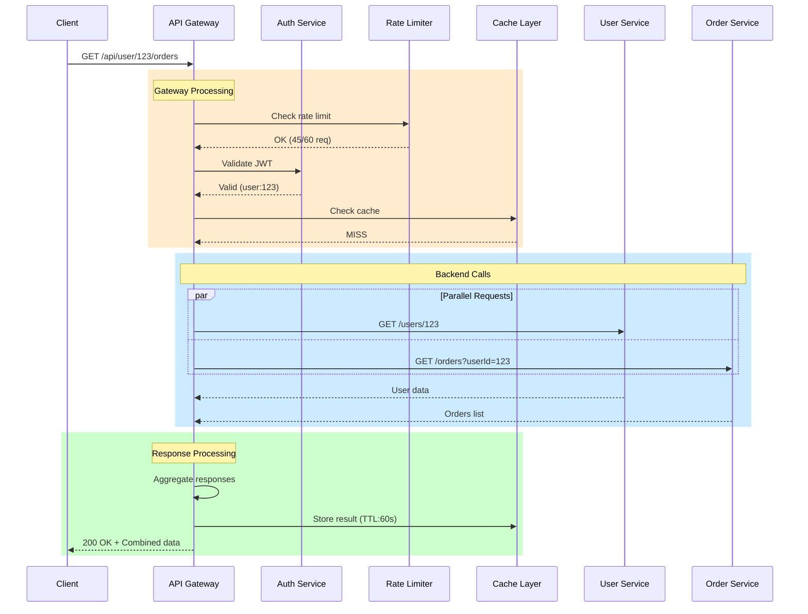
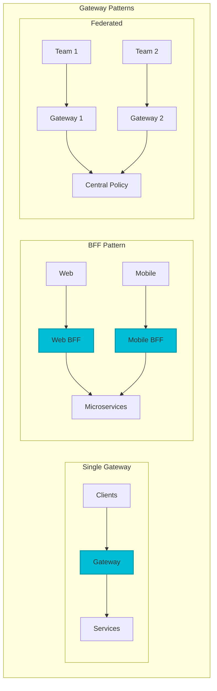
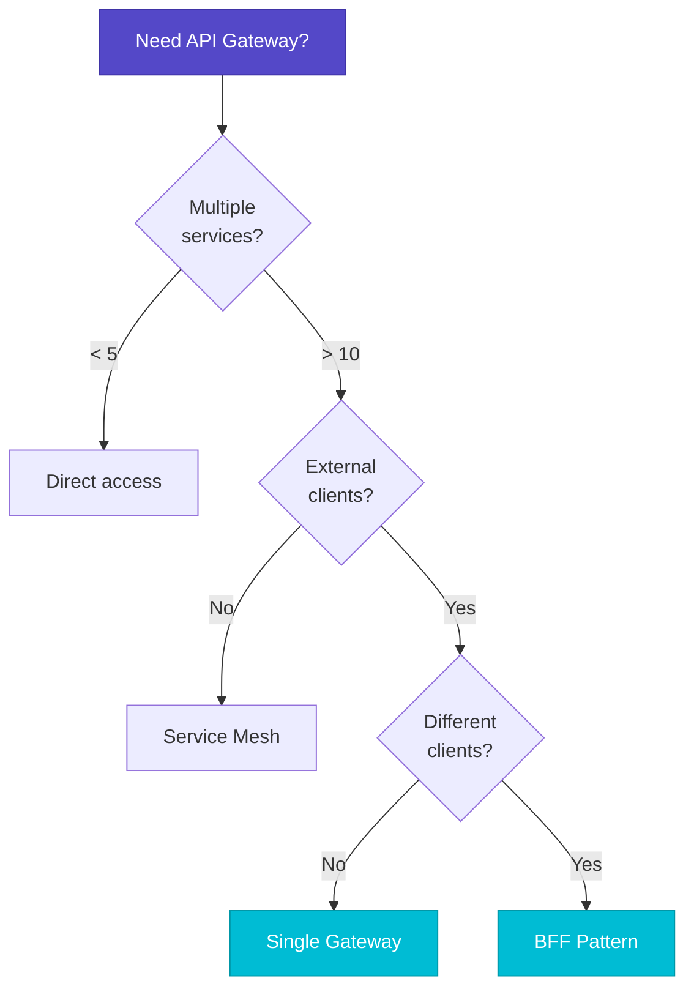
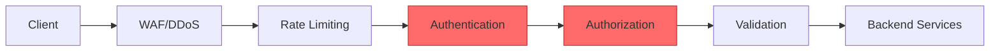
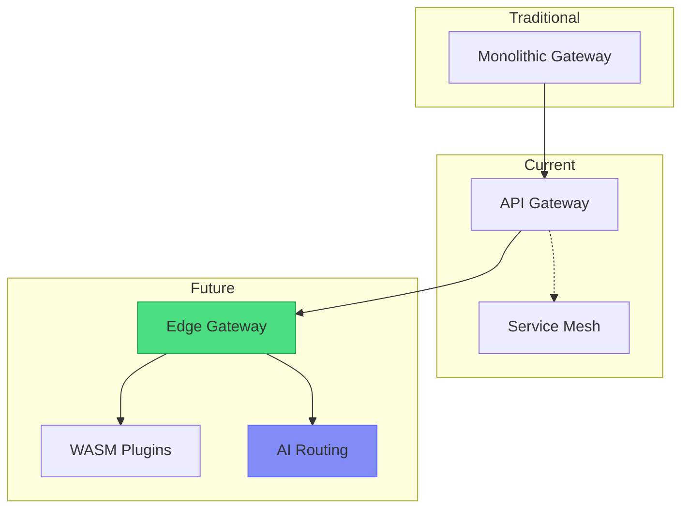

# API Gateway Pattern

!!! success "🏆 Gold Standard Pattern"
    **Single entry point for all your microservices** • Netflix, Amazon, Uber proven at 50B+ scale
    
    Simplifies client interactions by providing unified access to microservices with centralized authentication, routing, and protocol translation.

## When to Use / When NOT to Use

### ✅ Use When
| Scenario | Why | Example |
|----------|-----|--------|
| **10+ microservices** | Unified access point | Netflix (1000+ services) |
| **Multiple client types** | Client-specific optimization | Mobile, web, IoT |
| **Cross-cutting concerns** | Centralized handling | Auth, logging, rate limiting |
| **Protocol translation** | Single interface | REST→gRPC conversion |

### ❌ DON'T Use When
| Scenario | Why | Alternative |
|----------|-----|-------------|
| **< 5 services** | Overkill complexity | Direct communication |
| **Ultra-low latency** | Extra hop adds 5-10ms | Service mesh sidecar |
| **Internal services only** | Wrong tool | Service mesh |
| **Simple proxying** | Too heavyweight | nginx/HAProxy |


## Level 1: Intuition (5 min)

### The Hotel Concierge
API Gateway is like a luxury hotel concierge - one contact point for all services. Guests (clients) don't navigate hotel complexity; the concierge (gateway) handles routing, permissions, and coordination.

**API Gateway = Digital Concierge for your microservices**

### Visual Architecture

```mermaid
graph TD
    subgraph "Without API Gateway"
        C1[Client] --> AS[Auth Service]
        C1 --> US[User Service]
        C1 --> OS[Order Service]
        C1 --> PS[Payment Service]
        C1 --> IS[Inventory Service]
    end
    
    subgraph "With API Gateway"
        C2[Client] --> GW[API Gateway]
        GW -.-> AUTH[Auth: Handled]
        GW --> US2[User Service]
        GW --> OS2[Order Service]
        GW --> PS2[Payment Service]
        GW --> IS2[Inventory Service]
    end
    
    classDef client fill:#5448C8,stroke:#3f33a6,color:#fff
    classDf gateway fill:#00BCD4,stroke:#0097a7,color:#fff
    classDef service fill:#81c784,stroke:#388e3c,color:#000
    classDef crosscutting fill:#ffb74d,stroke:#f57c00,color:#000
    
    class C1,C2 client
    class GW gateway
    class AS,US,OS,PS,IS,US2,OS2,PS2,IS2 service
    class AUTH crosscutting
```

### API Gateway Request Flow


### API Gateway Components Architecture

```mermaid
graph TB
    subgraph "API Gateway Internal Architecture"
        subgraph "Ingress Layer"
            LB[Load Balancer]
            TLS[TLS Termination]
            DDoS[DDoS Protection]
        end
        
        subgraph "Security Layer"
            AUTH[Authentication<br/>JWT/OAuth2]
            AUTHZ[Authorization<br/>RBAC/ABAC]
            WAF[Web Application<br/>Firewall]
        end
        
        subgraph "Control Layer"
            RL[Rate Limiting<br/>Token Bucket]
            QOS[QoS/Priority<br/>Queue]
            CB[Circuit Breaker]
        end
        
        subgraph "Processing Layer"
            ROUTE[Request Router]
            TRANS[Protocol<br/>Translation]
            AGG[Response<br/>Aggregation]
        end
        
        subgraph "Performance Layer"
            CACHE[Response Cache<br/>Redis/Memcached]
            COMP[Compression<br/>gzip/brotli]
            CDN[CDN Integration]
        end
        
        subgraph "Backend Layer"
            SD[Service Discovery<br/>Consul/etcd]
            LB2[Load Balancing<br/>Round-robin/Least-conn]
            POOL[Connection Pooling]
        end
        
        CLIENT[Clients] --> LB
        LB --> TLS
        TLS --> DDoS
        DDoS --> AUTH
        AUTH --> AUTHZ
        AUTHZ --> WAF
        WAF --> RL
        RL --> QOS
        QOS --> CB
        CB --> ROUTE
        ROUTE --> TRANS
        TRANS --> AGG
        AGG --> CACHE
        CACHE --> COMP
        COMP --> SD
        SD --> LB2
        LB2 --> POOL
        POOL --> SERVICES[Microservices]
    end
    
    style AUTH fill:#ff6b6b,stroke:#c92a2a
    style RL fill:#4ecdc4,stroke:#38d9a9
    style CACHE fill:#95e1d3,stroke:#63e6be
    style CB fill:#f3a683,stroke:#ee5a24
```


**Key Insight**: Multiple connections vs. single entry point - Simple client interface instead of complex client logic

### Core Value
| Without Gateway | With Gateway |
|-----------------|-------------|
| N×M client-service connections | N clients → 1 gateway → M services |
| Each client handles auth | Centralized authentication |
| Protocol per service | Unified REST/GraphQL interface |
| Scattered rate limiting | Single point of control |

---

## Level 2: Foundation (10 min)

### The Problem Space

<div class="failure-vignette">
<h4>💥 Expedia's API Sprawl Crisis (2019)</h4>

**What Happened**: Mobile app performance degraded to 15-second load times

**Root Cause**: 
- Mobile clients calling 47 different microservices directly
- Each service had different authentication mechanisms
- Network overhead: 47 TCP handshakes per app launch
- API versioning nightmare - 200+ different API versions in production

**Impact**: 
- App store rating dropped from 4.5 to 2.1 stars
- 35% drop in mobile bookings ($180M revenue impact)
- Customer support overwhelmed with performance complaints

**Solution**:
- Implemented API Gateway pattern with request aggregation
- Reduced client connections from 47 to 1
- Load times improved from 15s to 2s
- Single authentication, versioning, and monitoring point
</div>

### Key Responsibilities

| Responsibility | Purpose | Implementation |
|---------------|---------|----------------|
| **Request Routing** | Direct to services | Path-based, header-based |
| **Authentication** | Centralized security | JWT, OAuth2, API keys |
| **Rate Limiting** | Protect backends | Token bucket, sliding window |
| **Protocol Translation** | Unified interface | HTTP→gRPC, REST→GraphQL |
| **Response Aggregation** | Reduce round trips | Parallel fetching |
| **Caching** | Performance | Redis, in-memory |
| **Monitoring** | Observability | Metrics, traces, logs |

### Architecture Patterns



### Pattern Selection Matrix

| Pattern | When to Use | Pros | Cons | Example |
|---------|-------------|------|------|----------|
| **Single Gateway** | <10 teams<br/>Uniform clients | Simple to manage<br/>Consistent policies | Single point of failure<br/>Bottleneck risk | Small startups |
| **BFF (Backend for Frontend)** | Multiple client types<br/>Different data needs | Optimized per client<br/>Independent evolution | More components<br/>Potential duplication | Netflix, Uber |
| **Federated Gateways** | Large organizations<br/>Team autonomy | Decentralized control<br/>Team ownership | Policy consistency<br/>Complex routing | Amazon, Microsoft |
| **Micro Gateway** | Edge locations<br/>Geographic distribution | Low latency<br/>Resilient | Synchronization<br/>Management overhead | CDN providers |

### Decision Matrix: Gateway Pattern Selection

| Factor | Single Gateway | BFF Pattern | Federated Gateway | Service Mesh |
|--------|----------------|-------------|-------------------|---------------|
| **Team Structure** | Centralized | Client teams | Domain teams | Platform team |
| **Client Diversity** | Low | High | Medium | N/A |
| **Deployment Complexity** | Low | Medium | High | Very High |
| **Customization** | Limited | Per-client | Per-domain | Per-service |
| **Operational Overhead** | Low | Medium | High | Highest |
| **Best For** | Start-ups | Mobile+Web | Large orgs | Service-to-service |

### Decision Matrix




---

## Level 3: Deep Dive (15 min)

### Core Implementation

```python
class APIGateway:
    def __init__(self):
        self.plugins = []  # Authentication, rate limiting, etc.
        self.routes = {}   # Path pattern -> service mapping
        self.cache = {}    # Response cache
    
    async def handle_request(self, request):
        # 1. Run plugins (auth, rate limit, etc.)
        for plugin in self.plugins:
            if response := await plugin.process(request):
                return response  # Plugin rejected request
        
        # 2. Route to service
        service = self.match_route(request.path)
        if not service:
            return Response(404, "Not Found")
        
        # 3. Check cache
        if cached := self.cache.get(request):
            return cached
        
        # 4. Forward request
        response = await self.forward_request(service, request)
        
        # 5. Cache if applicable
        if request.method == "GET" and response.status == 200:
            self.cache[request] = response
        
        return response
```

### Plugin Architecture

```python
class RateLimitPlugin:
    def __init__(self, limit=60):
        self.limit = limit
        self.buckets = {}  # client -> timestamps
    
    async def process(self, request):
        client = request.headers.get('X-API-Key', request.ip)
        now = time.time()
        
        # Clean old entries
        self.buckets[client] = [
            ts for ts in self.buckets.get(client, [])
            if now - ts < 60
        ]
        
        # Check limit
        if len(self.buckets[client]) >= self.limit:
            return Response(429, "Rate limit exceeded")
        
        # Record request
        self.buckets[client].append(now)
        return None  # Continue processing
```

### Advanced Patterns

| Pattern | Purpose | Example |
|---------|---------|----------|
| **BFF** | Client-specific APIs | Mobile BFF with reduced payloads |
| **GraphQL Gateway** | Flexible queries | Single query for multiple resources |
| **Request Aggregation** | Reduce round trips | Fetch user + orders in one call |
| **Circuit Breaking** | Fault tolerance | Fail fast when service is down |

---

## Level 4: Expert (20 min)

### Advanced Features

#### Dynamic Service Discovery
```python
class ServiceDiscovery:
    async def get_healthy_endpoint(self, service):
        # Query service registry (Consul/etcd)
        instances = await self.registry.get_instances(service)
        
        # Filter healthy instances
        healthy = [
            i for i in instances 
            if i['health_check'] == 'passing'
        ]
        
        # Load balance (round-robin, least-conn, etc.)
        return self.load_balancer.select(healthy)
```

#### API Versioning Strategy
```yaml
# Header-based versioning
GET /api/users
API-Version: v2

# URL-based versioning  
GET /api/v2/users

# Accept header versioning
GET /api/users
Accept: application/vnd.api+json;version=2
```

### Performance & Security

#### Performance Optimization
| Technique | Impact | Implementation |
|-----------|--------|----------------|
| **Connection Pooling** | -50% latency | Reuse backend connections |
| **Response Caching** | -80% backend load | Redis/in-memory cache |
| **HTTP/2** | -30% bandwidth | Multiplexing & compression |
| **Request Coalescing** | -60% duplicate calls | Merge concurrent requests |

#### Security Layers


---

## Level 5: Mastery (30 min)

### Case Study: Netflix's Edge Gateway

!!! info "🏢 Real-World Implementation"
 **Company**: Netflix
 **Scale**: 200M+ subscribers, 1000+ microservices, 100B+ requests/day
 **Challenge**: Provide optimal API for diverse clients (TV, mobile, web) across global infrastructure.
 **Architecture**:
 ```mermaid
 graph TB
 subgraph "Client Devices"
 TV[Smart TVs]
 MOB[Mobile Apps]
 WEB[Web Browsers]
 GAME[Game Consoles]
 end
 subgraph "Edge Tier"
 CDN[CDN/PoPs]
 ZUUL[Zuul Gateway]
 BFF1[TV BFF]
 BFF2[Mobile BFF]
 BFF3[Web BFF]
 end
 subgraph "Mid-Tier"
 API[API Services]
 FALCOR[Falcor Layer]
 end
 subgraph "Backend Services"
 US[User Service]
 RS[Recommendation Service]
 PS[Playback Service]
 AS[Account Service]
 end
 TV --> CDN --> ZUUL --> BFF1 --> FALCOR
 MOB --> CDN --> ZUUL --> BFF2 --> FALCOR
 WEB --> CDN --> ZUUL --> BFF3 --> FALCOR
 GAME --> CDN --> ZUUL --> BFF1 --> FALCOR
 FALCOR --> API
 API --> US
 API --> RS
 API --> PS
 API --> AS
 style ZUUL fill:#e91e63,stroke:#880e4f,stroke-width:3px
 ```
 **Key Decisions**:
 1. **Device-specific BFFs**: Optimize for each client's needs
 2. **Falcor for data fetching**: Efficient JSON graph queries
 3. **Zuul for edge routing**: Dynamic routing and filtering
 4. **Hystrix integration**: Circuit breaking and fallbacks
 **Results**:
 - 50% reduction in client requests
 - 75% decrease in payload sizes for mobile
 - 99.99% availability despite backend failures
 - Sub-second response times globally
 **Lessons**:
 1. One size doesn't fit all clients
 2. Edge caching crucial for performance
 3. Graceful degradation over perfect consistency
 4. Observability is non-negotiable

### Economic Impact

| Metric | Without Gateway | With Gateway | Savings |
|--------|----------------|--------------|----------|
| **Client Integration** | N clients × M services | N clients × 1 gateway | (N×M)-(N) connections |
| **Security Implementation** | M services × $5k | 1 gateway × $10k | M×$5k - $10k |
| **Bandwidth** | Direct calls | 30% reduction via caching | 30% cost reduction |
| **Development Time** | 40h per integration | 5h per client | 35h × N × M hours |

### Modern Evolution



---

## Quick Reference

<div class="truth-box">
<h4>💡 API Gateway Production Wisdom</h4>

**The 10 Commandments of API Gateway:**

1. **Thou shalt not do business logic in the gateway**
   - Route, authenticate, rate limit - nothing more
   - Business logic belongs in services

2. **Cache aggressively but invalidate wisely**
   - 80% of API calls are reads
   - Even 5-second caching can reduce backend load by 50%

3. **The gateway is not a database**
   - Don't store state beyond temporary caching
   - Use external stores (Redis) for shared state

4. **Monitor the monitors**
   - Gateway metrics are your early warning system
   - Alert on p99 latency, not average

5. **Rate limit by identity, not IP**
   - IPs change (mobile, NAT)
   - API keys or user tokens are stable

**Real-world truth**: 
> "Your API Gateway will become the most critical piece of infrastructure. Treat it with respect - high availability, gradual rollouts, and obsessive monitoring." - Netflix Engineering

**Performance reality**:
- Adding a gateway typically adds 5-10ms latency
- But saves 100-500ms by eliminating redundant calls
- Net win: 10-50x performance improvement for mobile clients
</div>

### Production Checklist ✓

- [ ] **Routing & Discovery**
  - [ ] Configure service discovery integration
  - [ ] Set up health checks for all backends
  - [ ] Implement retry logic with exponential backoff
  
- [ ] **Security**
  - [ ] Enable authentication (JWT/OAuth2)
  - [ ] Configure authorization policies
  - [ ] Implement rate limiting per client
  - [ ] Set up API key management
  
- [ ] **Performance**
  - [ ] Enable response caching (Redis)
  - [ ] Configure connection pooling
  - [ ] Set appropriate timeouts per service
  - [ ] Enable HTTP/2 for backend connections
  
- [ ] **Observability**
  - [ ] Configure distributed tracing
  - [ ] Set up metrics collection
  - [ ] Implement request/response logging
  - [ ] Create performance dashboards
  
- [ ] **Reliability**
  - [ ] Configure circuit breakers
  - [ ] Set up fallback responses
  - [ ] Implement request hedging for critical paths
  - [ ] Test under load and failure scenarios

### Configuration Template

```yaml
# API Gateway Configuration
api_gateway:
 server:
 port: 8080
 host: 0.0.0.0
 timeout: 30s
 
 routing:
 routes:
 - path: /api/users/*
 service: user-service
 methods: [GET, POST, PUT, DELETE]
 
 - path: /api/orders/*
 service: order-service
 strip_prefix: true
 
 - path: /api/products/*
 service: product-service
 load_balancer: round_robin
 
 plugins:
 - name: authentication
 config:
 type: jwt
 secret: ${JWT_SECRET}
 excluded_paths: [/health, /metrics]
 
 - name: rate_limiting
 config:
 requests_per_minute: 60
 burst: 100
 by: user_id
 
 - name: caching
 config:
 ttl: 300
 max_size: 1000
 
 - name: cors
 config:
 origins: ["https://example.com"]
 methods: [GET, POST, PUT, DELETE]
 headers: [Content-Type, Authorization]
 
 service_discovery:
 type: consul
 address: consul:8500
 refresh_interval: 30s
 
 circuit_breaker:
 failure_threshold: 5
 timeout: 60s
 half_open_requests: 3
 
 observability:
 metrics:
 enabled: true
 endpoint: /metrics
 
 tracing:
 enabled: true
 sample_rate: 0.1
 exporter: jaeger
 
 logging:
 level: info
 format: json
```

### Common Patterns

```bash
# Health Checks
GET /health
GET /ready

# Metrics
GET /metrics

# Service Discovery
GET /services
GET /services/{name}/endpoints

# Configuration
GET /config
POST /config/reload

# Circuit Breaker Status
GET /circuit-breakers
POST /circuit-breakers/{service}/reset
```

### Performance Benchmarks

| Gateway Type | Requests/sec | Latency (p99) | CPU Usage | Memory |
|--------------|--------------|---------------|-----------|---------|
| NGINX | 50,000 | 2ms | 20% | 100MB |
| Envoy | 45,000 | 3ms | 25% | 150MB |
| Kong | 25,000 | 5ms | 40% | 300MB |
| Zuul 2 | 20,000 | 8ms | 50% | 500MB |
| Express Gateway | 15,000 | 10ms | 60% | 200MB |


---

## Excellence Framework Integration

### Implementation Guides
- **[API Gateway Implementation Guide](../excellence/implementation-guides/api-gateway-implementation.md)**: Complete implementation guide
- **[Gateway Security Patterns](../excellence/implementation-guides/gateway-security.md)**: Authentication and authorization
- **[Gateway Performance Optimization](../excellence/implementation-guides/gateway-performance.md)**: Scaling and optimization

### Pattern Combinations
<div class="grid cards" markdown>

- :material-puzzle:{ .lg .middle } **With Circuit Breaker**
    
    ---
    
    Protect backend services from cascading failures:
    - Per-route circuit breakers
    - Graceful degradation
    - [View Integration Guide](../excellence/combinations/gateway-circuit-breaker.md)

- :material-puzzle:{ .lg .middle } **With Service Mesh**
    
    ---
    
    Modern gateway architectures:
    - Gateway as mesh ingress
    - Distributed rate limiting
    - [View Integration Guide](../excellence/combinations/gateway-service-mesh.md)

</div>

---

## Related Resources

### Patterns
- **[Service Mesh](../architecture/service-mesh.md)**: Service-to-service communication - complements API Gateway for internal traffic management
- **[Circuit Breaker](../resilience/circuit-breaker.md)**: Prevents cascade failures - essential for protecting backend services from API Gateway
- **[Rate Limiting](../scaling/rate-limiting.md)**: Controls request flow - implement at gateway level to protect all downstream services
- **[Saga Pattern](../coordination/saga.md)**: Manages distributed transactions - API Gateway can coordinate saga execution across services

### Laws
- [Law 6 (Cognitive Load )](part1-axioms/law6-human-api) - API design principles
- [Law 2 (Asynchronous Reality /index)](part1-axioms/law2-asynchrony) - Performance implications
- [Law 5 (Distributed Knowledge /index)](part1-axioms/law5-epistemology/index) - Monitoring and tracing

### Tools & Technologies
- **Open Source**: Kong, Zuul, Tyk, Express Gateway
- **Cloud Native**: Envoy, NGINX, HAProxy, Traefik
- **Commercial**: AWS API Gateway, Azure API Management, Google Apigee
- **Service Mesh**: Istio Gateway, Linkerd, Consul Connect

### Further Reading
- [Building Microservices](https://www.oreilly.com/library/view/building-microservices-2nd/9781492034018/) - Sam Newman
- [API Gateway Pattern](https://microservices.io/patterns/apigateway.html) - Chris Richardson
- [Netflix Zuul](https://github.com/Netflix/zuul/wiki) - How Netflix does API Gateway
- [API Design Patterns](https://www.manning.com/books/api-design-patterns) - JJ Geewax

---

<div class="page-nav" markdown>
[:material-arrow-left: Load Balancing](../scaling/load-balancing.md) | 
[:material-arrow-up: Communication Patterns](index.md) | 
[:material-arrow-right: Service Mesh](service-mesh.md)
</div>