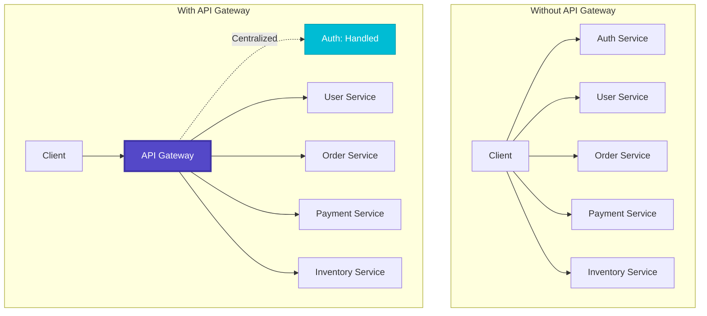
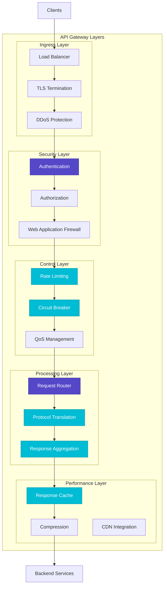
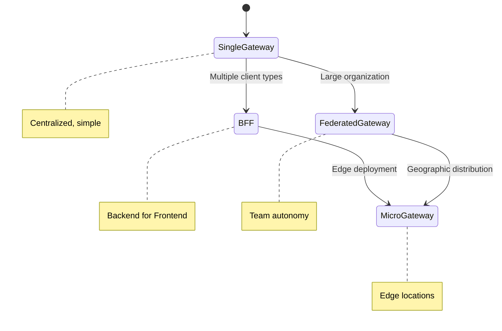
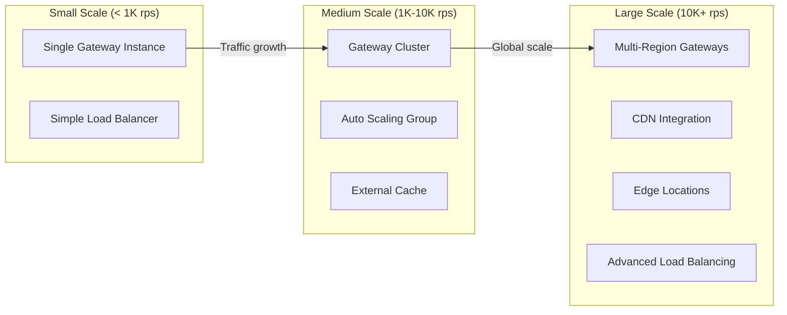
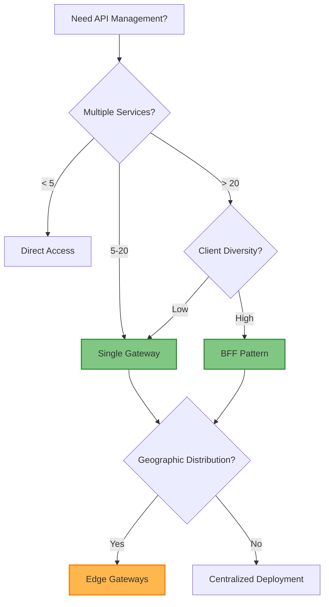

# API Gateway Pattern

!!! success "🏆 Gold Standard Pattern"
    **Single Entry Point for Microservices** • Netflix, Amazon, Uber proven at 50B+ scale
    
    Simplifies client interactions by providing unified access to microservices with centralized authentication, routing, and protocol translation. The de facto standard for external API management.
    
    **Key Success Metrics:**
    - Netflix: 50B+ requests/day with 99.99% availability
    - Amazon: Trillions of API calls with sub-100ms p95 latency
    - Uber: 18M+ trips/day across 3000+ microservices

## Essential Question

**How do we unify microservice access while handling auth, routing, and protocols?**

## When to Use / When NOT to Use

### ✅ Use When

| Scenario | Example | Impact |
|----------|---------|--------|
| Multiple microservices | 10+ services requiring unified access | Reduces client complexity by 90% |
| Multiple client types | Mobile, web, IoT with different needs | Custom APIs per client type |
| Cross-cutting concerns | Auth, logging, rate limiting | Centralized policy enforcement |
| Protocol translation | REST to gRPC, HTTP to WebSocket | Single interface regardless of backend |

### ❌ DON'T Use When

| Scenario | Why | Alternative |
|----------|-----|-------------|
| < 5 services | Overkill complexity | Direct service communication |
| Ultra-low latency needs | Extra hop adds 5-10ms | [Service Mesh](service-mesh.md) sidecar |
| Internal services only | Wrong abstraction level | Service mesh for service-to-service |
| Simple proxying | Too heavyweight | nginx/HAProxy |

## Level 1: Intuition (5 min) {#intuition}

### The Story

Imagine a luxury hotel concierge desk. Guests don't navigate the hotel's complexity—finding housekeeping, room service, concierge services, spa booking. They simply approach one desk (the concierge) who handles routing, authentication ("Are you a guest?"), and coordination with all hotel services.

### Visual Metaphor



### Core Insight

> **Key Takeaway:** API Gateway transforms N×M client-service connections into N×1 client-gateway connections, centralizing cross-cutting concerns while maintaining service independence.

### In One Sentence

API Gateway **unifies microservice access** by **routing requests and handling cross-cutting concerns** to achieve **simplified client integration and centralized policy enforcement**.

## Level 2: Foundation (10 min) {#foundation}

### The Problem Space

<div class="failure-vignette">
<h4>🚨 What Happens Without This Pattern</h4>

**E-commerce Mobile App, 2019**: Mobile client called 47 different microservices directly. Each service had different auth mechanisms, API versions, and response formats. App load time: 15 seconds with 47 network connections.

**Impact**: App store rating dropped from 4.5 to 2.1 stars, 35% drop in mobile bookings ($180M revenue loss)
</div>

### How It Works

#### Architecture Overview



#### Key Components

| Component | Purpose | Responsibility |
|-----------|---------|----------------|
| Request Router | Service selection | Path-based routing, load balancing |
| Authentication | Identity verification | JWT validation, API key management |
| Rate Limiter | Traffic control | Per-client request limiting |
| Circuit Breaker | Fault tolerance | Prevent cascading failures |

### Basic Example

```python
from typing import Dict, Optional
import asyncio
import time

class APIGateway:
    def __init__(self):
        self.routes = {}  # path_pattern -> service mapping
        self.plugins = []  # middleware plugins
        self.cache = {}   # response cache
        
    def add_route(self, path_pattern: str, service_url: str):
        """Register a route mapping"""
        self.routes[path_pattern] = service_url
        
    def add_plugin(self, plugin):
        """Add middleware plugin"""
        self.plugins.append(plugin)
        
    async def handle_request(self, request):
        """Main request processing pipeline"""
        
        # 1. Execute plugins (auth, rate limiting, etc.)
        for plugin in self.plugins:
            response = await plugin.process(request)
            if response:  # Plugin rejected request
                return response
        
        # 2. Route to appropriate service
        service_url = self._match_route(request.path)
        if not service_url:
            return {"error": "Not Found", "status": 404}
        
        # 3. Check cache
        cache_key = f"{request.method}:{request.path}"
        if cache_key in self.cache:
            return self.cache[cache_key]
        
        # 4. Forward request to service
        response = await self._forward_request(service_url, request)
        
        # 5. Cache response if applicable
        if request.method == "GET" and response.get("status") == 200:
            self.cache[cache_key] = response
        
        return response
    
    def _match_route(self, path: str) -> Optional[str]:
        """Match request path to service"""
        for pattern, service_url in self.routes.items():
            if path.startswith(pattern):
                return service_url
        return None

# Rate limiting plugin example
class RateLimitPlugin:
    def __init__(self, limit: int = 60):
        self.limit = limit
        self.requests = {}  # client_id -> request_times
        
    async def process(self, request):
        client_id = self._extract_client_id(request)
        now = time.time()
        
        # Clean old requests
        cutoff = now - 60  # 1-minute window
        self.requests[client_id] = [
            req_time for req_time in self.requests.get(client_id, [])
            if req_time > cutoff
        ]
        
        # Check rate limit
        if len(self.requests[client_id]) >= self.limit:
            return {"error": "Rate limit exceeded", "status": 429}
        
        # Record this request
        self.requests[client_id].append(now)
        return None  # Continue processing
```

## Level 3: Deep Dive (15 min) {#deep-dive}

### Implementation Details

#### Gateway Pattern Variants



#### Critical Design Decisions

| Decision | Options | Trade-off | Recommendation |
|----------|---------|-----------|----------------|
| Gateway Topology | Single gateway<br>Backend for Frontend (BFF) | Single: Simple<br>BFF: Client-optimized | BFF for diverse clients |
| Authentication | Gateway-only<br>Service-level | Gateway: Centralized<br>Service: Defense in depth | Both (gateway + critical services) |
| State Management | Stateless<br>Session storage | Stateless: Scalable<br>Stateful: Rich features | Stateless with external session store |
| Circuit Breaker Scope | Per-service<br>Per-endpoint | Service: Coarse-grained<br>Endpoint: Fine-grained | Per-endpoint for better isolation |

### Common Pitfalls

<div class="decision-box">
<h4>⚠️ Avoid These Mistakes</h4>

1. **Business Logic in Gateway**: Gateway becomes monolith → Keep gateway thin, logic in services
2. **No Circuit Breakers**: Cascading failures → Implement per-service circuit breakers  
3. **Overly Aggressive Caching**: Stale data issues → Cache only stable, non-personalized data
4. **Single Point of Failure**: Gateway becomes bottleneck → Deploy with high availability
</div>

### Production Considerations

#### Performance Characteristics

| Metric | Typical Range | Optimization Target |
|--------|---------------|-------------------|
| Request Latency | 5-20ms overhead | < 10ms for 95th percentile |
| Throughput | 10K-50K req/sec | Depends on payload and processing |
| Memory Usage | 100MB-1GB | Scale with connection pool size |
| CPU Usage | 20-60% | Optimize routing and transformation |

## Level 4: Expert (20 min) {#expert}

### Advanced Techniques

#### 1. Dynamic Service Discovery Integration

```python
import consul
import random

class ServiceDiscovery:
    def __init__(self, consul_host='localhost', consul_port=8500):
        self.consul = consul.Consul(host=consul_host, port=consul_port)
        self.service_cache = {}
        self.cache_ttl = 30  # seconds
        
    async def get_healthy_instances(self, service_name: str):
        """Get healthy service instances with caching"""
        cache_key = f"service:{service_name}"
        now = time.time()
        
        # Check cache
        if cache_key in self.service_cache:
            cached_data, timestamp = self.service_cache[cache_key]
            if now - timestamp < self.cache_ttl:
                return cached_data
        
        # Query Consul for healthy instances
        _, services = self.consul.health.service(service_name, passing=True)
        
        instances = []
        for service in services:
            instances.append({
                'id': service['Service']['ID'],
                'address': service['Service']['Address'],
                'port': service['Service']['Port'],
                'tags': service['Service']['Tags']
            })
        
        # Cache the results
        self.service_cache[cache_key] = (instances, now)
        return instances
    
    def select_instance(self, instances, strategy='round_robin'):
        """Select instance using load balancing strategy"""
        if not instances:
            return None
            
        if strategy == 'round_robin':
            # Simple round-robin (in production, use proper round-robin counter)
            return instances[random.randint(0, len(instances) - 1)]
        elif strategy == 'random':
            return random.choice(instances)
        else:
            return instances[0]
```

#### 2. Request Aggregation Pattern

```python
class RequestAggregator:
    """Aggregate multiple backend calls into single client response"""
    
    async def aggregate_user_dashboard(self, user_id: str):
        """Fetch user dashboard data from multiple services"""
        
        # Define parallel requests
        requests = [
            self._fetch_user_profile(user_id),
            self._fetch_user_orders(user_id),
            self._fetch_user_recommendations(user_id),
            self._fetch_user_notifications(user_id)
        ]
        
        # Execute requests in parallel with timeout
        try:
            results = await asyncio.wait_for(
                asyncio.gather(*requests, return_exceptions=True),
                timeout=5.0  # 5-second total timeout
            )
            
            profile, orders, recommendations, notifications = results
            
            # Handle partial failures gracefully
            dashboard = {
                'user_profile': profile if not isinstance(profile, Exception) else None,
                'recent_orders': orders if not isinstance(orders, Exception) else [],
                'recommendations': recommendations if not isinstance(recommendations, Exception) else [],
                'notifications': notifications if not isinstance(notifications, Exception) else []
            }
            
            return dashboard
            
        except asyncio.TimeoutError:
            # Return what we can get quickly
            return await self._fetch_minimal_dashboard(user_id)
    
    async def _fetch_user_profile(self, user_id: str):
        # Implementation for user service call
        pass
    
    async def _fetch_minimal_dashboard(self, user_id: str):
        """Fallback for timeout scenarios"""
        # Return cached or minimal data
        pass
```

### Scaling Considerations



### Monitoring & Observability

#### Key Metrics to Track

| Metric | Alert Threshold | Dashboard Panel |
|--------|----------------|-----------------|
| Request Latency | > 100ms p95 | Latency distribution histogram |
| Error Rate | > 1% 5xx errors | Error rate trend over time |
| Circuit Breaker State | Any open circuits | Circuit breaker status grid |
| Cache Hit Rate | < 70% hit rate | Cache performance metrics |

## Level 5: Mastery (30 min) {#mastery}

### Real-World Case Studies

#### Case Study 1: Netflix Edge Gateway Architecture

<div class="truth-box">
<h4>💡 Production Insights from Netflix</h4>

**Challenge**: Serve 200M+ subscribers globally with 1000+ microservices and diverse client devices

**Implementation**:
- Zuul gateway with device-specific Backend for Frontend (BFF) patterns
- Hystrix circuit breakers for fault tolerance
- Falcor for efficient data graph queries
- Edge caching with 30+ global locations

**Results**:
- 50% reduction in client API requests through aggregation
- 75% decrease in mobile payload sizes
- 99.99% availability despite backend service failures
- Sub-second response times globally

**Lessons Learned**: One-size-fits-all doesn't work; optimize gateways per client type and use aggressive edge caching
</div>

#### Case Study 2: Uber's Edge Gateway Evolution

<div class="truth-box">
<h4>💡 Production Insights from Uber</h4>

**Challenge**: Route requests across 3000+ microservices for 18M+ daily trips with strict latency requirements

**Implementation**:
- Multi-tier gateway architecture (Edge → Regional → Service)
- Dynamic routing based on service health and capacity
- Request hedging for critical path operations
- Intelligent fallbacks and graceful degradation

**Results**:
- 99.99% request success rate during peak hours
- Sub-100ms p95 latency for trip requests
- Automatic traffic failover during regional outages
- Zero-downtime deployments for gateway updates

**Lessons Learned**: Invest heavily in observability and automated failure detection; manual intervention at scale is impossible
</div>

### Pattern Evolution

#### Migration Strategy


#### Future Directions

| Trend | Impact on Pattern | Adaptation Strategy |
|-------|------------------|-------------------|
| WebAssembly (WASM) | Plugin ecosystem expansion | WASM-based custom plugins |
| AI/ML Integration | Intelligent routing and caching | ML-driven traffic optimization |
| Edge Computing | Distributed gateway deployment | Multi-tier edge architecture |

### Pattern Combinations

#### Works Well With

| Pattern | Combination Benefit | Integration Point |
|---------|-------------------|------------------|
| [Circuit Breaker](../resilience/circuit-breaker.md) | Fault isolation | Per-service failure protection |
| [Service Mesh](service-mesh.md) | Complete traffic management | Gateway as mesh ingress |
| [Rate Limiting](../scaling/rate-limiting.md) | Traffic control | Centralized quota enforcement |

## Quick Reference

### Decision Matrix



### Comparison with Alternatives

| Aspect | API Gateway | Service Mesh | Reverse Proxy |
|--------|-------------|--------------|---------------|
| Focus | External APIs | Service-to-service | Simple proxying |
| Features | Rich (auth, rate limiting) | Comprehensive | Basic |
| Complexity | Medium | High | Low |
| Client Integration | Simplified | No change | No change |
| When to use | External clients | Internal traffic | Simple routing |

### Implementation Checklist

**Pre-Implementation**
- [ ] Define gateway architecture pattern (single, BFF, federated)
- [ ] Plan service discovery and health check integration
- [ ] Design authentication and authorization strategy
- [ ] Plan monitoring and observability approach

**Implementation**
- [ ] Deploy gateway with high availability and auto-scaling
- [ ] Configure routing rules and service discovery
- [ ] Implement security policies (auth, rate limiting, CORS)
- [ ] Set up caching strategy and circuit breakers

**Post-Implementation**
- [ ] Monitor gateway performance and error rates
- [ ] Test failure scenarios and circuit breaker behavior
- [ ] Optimize routing and caching based on traffic patterns
- [ ] Establish gateway operational procedures and runbooks

### Related Resources

<div class="grid cards" markdown>

- :material-book-open-variant:{ .lg .middle } **Related Patterns**
    
    ---
    
    - [Service Mesh](service-mesh.md) - Service-to-service communication
    - [Circuit Breaker](../resilience/circuit-breaker.md) - Fault tolerance
    - [Rate Limiting](../scaling/rate-limiting.md) - Traffic control

- :material-flask:{ .lg .middle } **Fundamental Laws**
    
    ---
    
    - [Law 4: Multi-dimensional Optimization](../../part1-axioms/law4-tradeoffs/) - Gateway complexity trade-offs
    - [Law 6: Human-Centric API Design](../../part1-axioms/law6-human-api/) - Client experience focus

- :material-pillar:{ .lg .middle } **Foundational Pillars**
    
    ---
    
    - [Control Distribution](../../part2-pillars/control/) - Centralized policy enforcement
    - [Work Distribution](../../part2-pillars/work/) - Request routing and load balancing

- :material-tools:{ .lg .middle } **Implementation Guides**
    
    ---
    
    - [API Gateway Setup Guide](../../excellence/guides/api-gateway-setup.md)
    - [Gateway Security Patterns](../../excellence/guides/gateway-security.md)
    - [Performance Optimization](../../excellence/guides/gateway-performance.md)

</div>