# API Gateway Pattern

## The Complete Blueprint

An API Gateway is a server that acts as the single entry point for all client requests to a microservices-based application. Instead of clients communicating directly with multiple microservices, they interact with the API Gateway, which handles routing, authentication, rate limiting, request/response transformation, and other cross-cutting concerns. The gateway sits between clients and services, providing a unified interface that simplifies client interactions while centralizing common functionality like security, monitoring, and protocol translation.


### What You'll Master

- **Request Routing & Load Balancing**: Intelligently route requests to appropriate backend services with advanced load balancing strategies
- **Security & Authentication**: Implement centralized security policies including OAuth, JWT validation, API key management, and authorization
- **Traffic Management**: Control request flow with rate limiting, throttling, quotas, and circuit breakers to protect backend services
- **Protocol Translation**: Handle multiple protocols (HTTP, gRPC, WebSocket) and translate between them seamlessly
- **Response Optimization**: Implement caching strategies, response compression, and aggregation to improve client performance
- **Observability & Monitoring**: Build comprehensive monitoring, logging, and tracing systems for distributed API interactions

## Table of Contents

- [Essential Question](#essential-question)
- [Complete API Gateway Architecture](#complete-api-gateway-architecture)
- [Request Flow Scenarios](#request-flow-scenarios)
  - [Successful Authenticated Request Flow](#successful-authenticated-request-flow)
  - [Rate Limited Request Flow](#rate-limited-request-flow)
  - [Circuit Breaker Open Flow](#circuit-breaker-open-flow)
  - [Cache Hit Optimization Flow](#cache-hit-optimization-flow)
- [Routing Decision Trees](#routing-decision-trees)
  - [Path-Based Routing Strategy](#path-based-routing-strategy)
  - [Header-Based Routing with Canary Deployment](#header-based-routing-with-canary-deployment)
  - [Query Parameter and Method-Based Routing](#query-parameter-and-method-based-routing)
- [When to Use / When NOT to Use](#when-to-use-when-not-to-use)
  - [✅ Use When](#use-when)
  - [❌ DON'T Use When](#dont-use-when)
  - [The Story](#the-story)
  - [Core Insight](#core-insight)
  - [In One Sentence](#in-one-sentence)
- [Security Layer Architecture](#security-layer-architecture)
  - [Multi-Layer Security Model](#multi-layer-security-model)
  - [OAuth 2.0 / OpenID Connect Flow](#oauth-20-openid-connect-flow)
  - [API Key Management Strategy](#api-key-management-strategy)
  - [The Problem Space](#the-problem-space)
- [Performance Optimization Architecture](#performance-optimization-architecture)
  - [Multi-Level Caching Strategy](#multi-level-caching-strategy)
  - [Response Aggregation & Composition](#response-aggregation-composition)
  - [Circuit Breaker Pattern Implementation](#circuit-breaker-pattern-implementation)
  - [Load Balancing Strategies Comparison](#load-balancing-strategies-comparison)
- [API Gateway Solutions Comparison](#api-gateway-solutions-comparison)
  - [Enterprise Gateway Solutions](#enterprise-gateway-solutions)
  - [Feature Matrix Comparison](#feature-matrix-comparison)
  - [Architecture Decision Matrix](#architecture-decision-matrix)
  - [Cost-Performance Analysis](#cost-performance-analysis)
  - [Netflix's Multi-Region Architecture](#netflixs-multi-region-architecture)
  - [Uber's Edge Gateway Strategy](#ubers-edge-gateway-strategy)
  - [Amazon's API Gateway Multi-Tier Architecture](#amazons-api-gateway-multi-tier-architecture)
- [Scaling Patterns & Multi-Region Deployment](#scaling-patterns-multi-region-deployment)
  - [Horizontal Scaling Strategy](#horizontal-scaling-strategy)
  - [Multi-Region Failover Strategy](#multi-region-failover-strategy)
  - [Performance Metrics & SLA Targets](#performance-metrics-sla-targets)
- [Decision Matrix](#decision-matrix)
- [Production Implementation Insights](#production-implementation-insights)
  - [Netflix: Zuul Evolution Strategy](#netflix-zuul-evolution-strategy)
  - [Amazon: Multi-Tier Gateway Strategy](#amazon-multi-tier-gateway-strategy)
  - [Uber: City-Based Edge Architecture](#uber-city-based-edge-architecture)

!!! success "🏆 Gold Standard Pattern"
    **Single Entry Point for Microservices** • Netflix, Amazon, Uber proven at 50B+ scale
    
    Simplifies client interactions by providing unified access to microservices with centralized authentication, routing, and protocol translation. The de facto standard for external API management.
    
    **Key Success Metrics:**
    - Netflix: 50B+ requests/day with 99.99% availability
    - Amazon: Trillions of API calls with sub-100ms p95 latency
    - Uber: 18M+ trips/day across 3000+ microservices

## Essential Question

**How do we unify microservice access while handling auth, routing, and protocols?**

## Complete API Gateway Architecture


## Request Flow Scenarios

### Successful Authenticated Request Flow

```mermaid
sequenceDiagram
    participant Client
    participant Gateway
    participant Auth
    participant Cache
    participant Service
    participant Monitor
    
    Client->>Gateway: POST /api/v1/orders (with JWT)
    Gateway->>Auth: Validate JWT token
    Auth-->>Gateway: ✅ Valid (user_id: 12345)
    Gateway->>Cache: Check cache for user:12345:orders
    Cache-->>Gateway: ❌ Cache miss
    Gateway->>Service: Forward request + user context
    Service-->>Gateway: 200 OK + order data
    Gateway->>Cache: Store response (TTL: 60s)
    Gateway->>Monitor: Log success (200ms latency)
    Gateway-->>Client: 200 OK + transformed response
    
    Note over Gateway,Monitor: Correlation ID: req-uuid-12345 tracked throughout
```



### Rate Limited Request Flow


### Circuit Breaker Open Flow

```mermaid
sequenceDiagram
    participant Client
    participant Gateway
    participant CircuitBreaker
    participant Service
    participant Monitor
    participant Cache
    
    Client->>Gateway: GET /api/v1/recommendations
    Gateway->>CircuitBreaker: Check service health
    CircuitBreaker-->>Gateway: ❌ OPEN (50% failure rate)
    Gateway->>Cache: Check stale cache
    Cache-->>Gateway: ✅ Stale data (age: 5min)
    Gateway->>Monitor: Log circuit breaker activation
    Gateway-->>Client: 200 OK + stale data + warning header
    
    Note over Gateway: Fallback to cached response prevents cascade failure
```



### Cache Hit Optimization Flow

```mermaid
sequenceDiagram
    participant Client
    participant Gateway
    participant Cache
    participant Monitor
    
    Client->>Gateway: GET /api/v1/products?category=electronics
    Gateway->>Cache: Check cache key: products:electronics:v1
    Cache-->>Gateway: ✅ HIT (fresh data, age: 30s)
    Gateway->>Monitor: Log cache hit (2ms response)
    Gateway-->>Client: 200 OK + cached response + cache headers
    
    Note over Gateway: 98% latency reduction (2ms vs 100ms)
```



## Routing Decision Trees

### Path-Based Routing Strategy


### Header-Based Routing with Canary Deployment

```mermaid
graph TD
    Request[Incoming Request] --> HeaderCheck{Check Headers}
    
    HeaderCheck --> |X-Version: v2| V2Direct[Route to v2]
    HeaderCheck --> |X-Canary: true| CanaryCheck{Canary Logic}
    HeaderCheck --> |X-Partner-ID| PartnerCheck{Partner Routing}
    HeaderCheck --> |No special headers| DefaultFlow[Standard Routing]
    
    CanaryCheck --> |Random(10%)| CanaryRoute[v2 Canary Instance]
    CanaryCheck --> |Random(90%)| StableRoute[v1 Stable Instance]
    
    PartnerCheck --> |Premium Partner| PremiumPool[Premium Service Pool]
    PartnerCheck --> |Standard Partner| StandardPool[Standard Service Pool]
    PartnerCheck --> |Invalid Partner| RateLimited[Rate Limited Pool]
    
    DefaultFlow --> PathRouting[Path-based routing]
    
    V2Direct --> HealthCheck1{v2 Health Check}
    CanaryRoute --> HealthCheck2{Canary Health}
    StableRoute --> HealthCheck3{v1 Health Check}
    
    HealthCheck1 --> |Healthy| V2Service[v2 Service]
    HealthCheck1 --> |Unhealthy| Fallback1[Fallback to v1]
    
    HealthCheck2 --> |Healthy| CanaryService[v2 Canary]
    HealthCheck2 --> |Unhealthy| Fallback2[Fallback to v1]
    
    style HeaderCheck fill:#FF5722
    style CanaryCheck fill:#FFC107
    style PartnerCheck fill:#3F51B5
    style HealthCheck1 fill:#4CAF50
```

### Query Parameter and Method-Based Routing


## When to Use / When NOT to Use

### ✅ Use When

| Scenario | Example | Impact |
|----------|---------|--------|
| Multiple microservices | 10+ services requiring unified access | Reduces client complexity by 90% |
| Multiple client types | Mobile, web, IoT with different needs | Custom APIs per client type |
| Cross-cutting concerns | Auth, logging, rate limiting | Centralized policy enforcement |
| Protocol translation | REST to gRPC, HTTP to WebSocket | Single interface regardless of backend |

### ❌ DON'T Use When

| Scenario | Why | Alternative |
|----------|-----|-------------|
| < 5 services | Overkill complexity | Direct service communication |
| Ultra-low latency needs | Extra hop adds 5-10ms | [Service Mesh](../communication/service-mesh.md) sidecar |
| Internal services only | Wrong abstraction level | Service mesh for service-to-service |
| Simple proxying | Too heavyweight | nginx/HAProxy |

### The Story

Imagine a luxury hotel concierge desk. Guests don't navigate the hotel's complexity—finding housekeeping, room service, concierge services, spa booking. They simply approach one desk (the concierge) who handles routing, authentication ("Are you a guest?"), and coordination with all hotel services.

### Core Insight

> **Key Takeaway:** API Gateway transforms N×M client-service connections into N×1 client-gateway connections, centralizing cross-cutting concerns while maintaining service independence.

### In One Sentence

API Gateway **unifies microservice access** by **routing requests and handling cross-cutting concerns** to achieve **simplified client integration and centralized policy enforcement**.

## Security Layer Architecture

### Multi-Layer Security Model


### OAuth 2.0 / OpenID Connect Flow


### API Key Management Strategy


### The Problem Space

<div class="failure-vignette">
<h4>🚨 What Happens Without This Pattern</h4>

**E-commerce Mobile App, 2019**: Mobile client called 47 different microservices directly. Each service had different auth mechanisms, API versions, and response formats. App load time: 15 seconds with 47 network connections.

**Impact**: App store rating dropped from 4.5 to 2.1 stars, 35% drop in mobile bookings ($180M revenue loss)
</div>

## Performance Optimization Architecture

### Multi-Level Caching Strategy

```mermaid
graph TB
    subgraph "Caching Hierarchy"
        subgraph "Edge Caching (CDN)"
            CDN1[CDN Node 1]
            CDN2[CDN Node 2] 
            CDN3[CDN Node 3]
        end
        
        subgraph "Gateway Caching"
            L1Cache[L1: In-Memory Cache]
            L2Cache[L2: Redis Cluster]
            ResponseCache[Response Cache]
            SessionCache[Session Cache]
        end
        
        subgraph "Backend Caching"
            DBCache[Database Cache]
            ServiceCache[Service-level Cache]
            ComputeCache[Computed Results Cache]
        end
    end
    
    subgraph "Cache Strategies"
        CacheAside[Cache-Aside]
        WriteThrough[Write-Through]
        WriteBehind[Write-Behind]
        Refresh[Refresh-Ahead]
    end
    
    Client[Client Request] --> CDN1
    CDN1 --> |Cache Miss| L1Cache
    CDN2 --> |Cache Miss| L1Cache
    CDN3 --> |Cache Miss| L1Cache
    
    L1Cache --> |Miss (hot data)| L2Cache
    L2Cache --> |Miss (warm data)| ResponseCache
    ResponseCache --> |Miss (cold data)| Backend[Backend Services]
    
    L1Cache -.-> |TTL: 30s| CacheAside
    L2Cache -.-> |TTL: 5min| WriteThrough
    ResponseCache -.-> |TTL: 1hr| WriteBehind
    ServiceCache -.-> |TTL: 24hr| Refresh
    
    style CDN1 fill:#4CAF50
    style L1Cache fill:#FF9800
    style L2Cache fill:#2196F3
    style ResponseCache fill:#9C27B0
```

### Response Aggregation & Composition

```mermaid
graph LR
    subgraph "Request Processing"
        Client[Mobile Client] --> Gateway[API Gateway]
        Gateway --> Orchestrator[Response Orchestrator]
    end
    
    subgraph "Parallel Service Calls"
        Orchestrator --> UserSvc[User Service]
        Orchestrator --> OrderSvc[Order Service] 
        Orchestrator --> RecommendSvc[Recommendation Service]
        Orchestrator --> InventorySvc[Inventory Service]
    end
    
    subgraph "Response Assembly"
        UserSvc --> |Profile data| Aggregator[Response Aggregator]
        OrderSvc --> |Order history| Aggregator
        RecommendSvc --> |Personalized recs| Aggregator
        InventorySvc --> |Stock levels| Aggregator
        
        Aggregator --> Transform[Data Transformer]
        Transform --> Filter[Response Filter]
        Filter --> Compress[Compression]
    end
    
    Compress --> |Single optimized response| Client
    
    Note1[4 parallel calls → 1 response]
    Note2[Latency: max(services) + 10ms overhead]
    Note3[Payload reduction: 60% via filtering]
    
    style Orchestrator fill:#FF9800
    style Aggregator fill:#4CAF50
    style Transform fill:#2196F3
```

### Circuit Breaker Pattern Implementation


### Load Balancing Strategies Comparison

| Strategy | Algorithm | Use Case | Pros | Cons |
|----------|-----------|----------|------|------|
| **Round Robin** | Sequential rotation | Uniform server capacity | Simple, fair distribution | Ignores server load |
| **Weighted Round Robin** | Rotation with weights | Mixed server capacity | Accounts for server differences | Static weight assignment |
| **Least Connections** | Route to lowest active connections | Persistent connections | Dynamic load awareness | Connection tracking overhead |
| **Least Response Time** | Route to fastest server | Latency-sensitive apps | Optimizes for performance | Requires response time monitoring |
| **IP Hash** | Hash client IP to server | Session affinity needed | Sticky sessions | Uneven distribution possible |
| **Geographic** | Route by client location | Global deployments | Reduces latency | Complex geo-routing logic |
| **Health-based** | Exclude unhealthy servers | High availability | Automatic failover | Health check overhead |

#### Key Components

| Component | Purpose | Responsibility |
|-----------|---------|----------------|
| Request Router | Service selection | Path-based routing, load balancing |
| Authentication | Identity verification | JWT validation, API key management |
| Rate Limiter | Traffic control | Per-client request limiting |
| Circuit Breaker | Fault tolerance | Prevent cascading failures |

## API Gateway Solutions Comparison

### Enterprise Gateway Solutions

| Solution | Type | Strengths | Weaknesses | Best For | Scale Examples |
|----------|------|-----------|------------|----------|----------------|
| **Kong** | Open Source + Enterprise | Plugin ecosystem, high performance | Complex configuration | Custom plugins, high throughput | Nasdaq: 1M+ RPS |
| **AWS API Gateway** | Managed Service | Serverless, auto-scaling, AWS integration | Vendor lock-in, cold starts | AWS ecosystems, rapid deployment | Prime Video: Billions/day |
| **Zuul 2** | Netflix OSS | Battle-tested, reactive, async | Java-only, complex setup | High-scale Netflix-style | Netflix: 50B+ requests/day |
| **Envoy Proxy** | CNCF Project | Service mesh ready, observability | Learning curve, config complexity | Kubernetes, service mesh | Uber: 18M trips/day |
| **Istio Gateway** | Service Mesh | K8s native, advanced traffic mgmt | Complexity, resource overhead | Kubernetes microservices | Spotify: 4B+ API calls/day |
| **Ambassador** | K8s Native | Developer-friendly, GitOps | K8s only, enterprise features cost | Cloud-native teams | Microsoft Teams |

### Feature Matrix Comparison

| Feature | Kong | AWS API Gateway | Zuul 2 | Envoy | Istio | Ambassador |
|---------|------|-----------------|--------|--------|-------|------------|
| **Rate Limiting** | ✅ Advanced | ✅ Basic | ✅ Custom | ✅ Advanced | ✅ Advanced | ✅ Basic |
| **Authentication** | ✅ OAuth/JWT/Key | ✅ AWS IAM/Cognito | ✅ Custom filters | ✅ External auth | ✅ mTLS/JWT | ✅ OAuth/OIDC |
| **Caching** | ✅ Multi-level | ✅ Basic | ✅ Custom | ❌ External only | ❌ External only | ❌ External only |
| **Circuit Breaking** | ✅ Plugin | ❌ Manual Lambda | ✅ Built-in | ✅ Built-in | ✅ Built-in | ✅ Built-in |
| **Request Transformation** | ✅ Lua plugins | ✅ VTL templates | ✅ Java filters | ✅ WASM/Lua | ✅ EnvoyFilter | ✅ Filters |
| **Observability** | ✅ Prometheus/Grafana | ✅ CloudWatch | ✅ Custom metrics | ✅ Rich metrics | ✅ Comprehensive | ✅ Datadog/Prom |
| **Multi-Protocol** | ✅ HTTP/gRPC/TCP | ✅ HTTP/WebSocket | ✅ HTTP only | ✅ HTTP/gRPC/TCP | ✅ All protocols | ✅ HTTP/gRPC |
| **Deployment Model** | Self-hosted/Cloud | Fully managed | Self-hosted | Self-hosted | K8s only | K8s only |

### Architecture Decision Matrix

| Factor | Weight | Kong | AWS API Gateway | Zuul 2 | Envoy | Istio |
|--------|--------|------|-----------------|--------|--------|-------|
| **Performance** | 25% | 9/10 | 6/10 | 8/10 | 9/10 | 7/10 |
| **Feature Richness** | 20% | 9/10 | 7/10 | 6/10 | 8/10 | 9/10 |
| **Operational Complexity** | 20% | 6/10 | 9/10 | 5/10 | 6/10 | 4/10 |
| **Vendor Lock-in** | 15% | 8/10 | 3/10 | 8/10 | 9/10 | 8/10 |
| **Community/Support** | 10% | 8/10 | 7/10 | 7/10 | 9/10 | 8/10 |
| **Cost** | 10% | 7/10 | 5/10 | 9/10 | 9/10 | 8/10 |
| ****Total Score*** | **100%** | **7.8** | **6.5** | **6.9** | **8.2** | **7.2** |

*Higher scores indicate better fit for enterprise microservices architecture*

### Cost-Performance Analysis


### Netflix's Multi-Region Architecture

```mermaid
graph TB
    subgraph "Netflix Global Architecture"
        subgraph "US East Region"
            USGateway[Zuul Gateway Cluster]
            USServices[Microservices: 1000+]
            USCDN[CDN: Video Content]
        end
        
        subgraph "EU West Region"
            EUGateway[Zuul Gateway Cluster]
            EUServices[Microservices: 800+]
            EUCDN[CDN: Video Content]
        end
        
        subgraph "APAC Region"
            APACGateway[Zuul Gateway Cluster]
            APACServices[Microservices: 600+]
            APACCDN[CDN: Video Content]
        end
        
        subgraph "Global Services"
            AuthService[Global Auth Service]
            ProfileService[User Profile Service]
            RecommendationEngine[ML Recommendation Engine]
            BillingService[Billing Service]
        end
        
        subgraph "Cross-Region Data"
            GlobalCache[Global Redis Cluster]
            ContentDB[Content Metadata DB]
            UserDB[User Database (Multi-master)]
        end
    end
    
    USGateway --> USServices
    USGateway --> AuthService
    USGateway --> ProfileService
    USGateway --> GlobalCache
    
    EUGateway --> EUServices
    EUGateway --> AuthService
    EUGateway --> ProfileService
    EUGateway --> GlobalCache
    
    APACGateway --> APACServices
    APACGateway --> AuthService
    APACGateway --> ProfileService
    APACGateway --> GlobalCache
    
    AuthService --> UserDB
    ProfileService --> UserDB
    RecommendationEngine --> ContentDB
    
    style USGateway fill:#FF6B6B
    style EUGateway fill:#4ECDC4
    style APACGateway fill:#45B7D1
    style AuthService fill:#FFA07A
    style GlobalCache fill:#98D8C8
```

### Uber's Edge Gateway Strategy


### Amazon's API Gateway Multi-Tier Architecture


## Scaling Patterns & Multi-Region Deployment

### Horizontal Scaling Strategy


### Multi-Region Failover Strategy

```mermaid
graph LR
    subgraph "Primary Region (US-East)"
        PrimaryGW[Primary Gateway Cluster]
        PrimaryServices[Core Services]
        PrimaryDB[Primary Database]
    end
    
    subgraph "Secondary Region (US-West)"
        SecondaryGW[Secondary Gateway Cluster]
        SecondaryServices[Core Services]
        SecondaryDB[Read Replica]
    end
    
    subgraph "Tertiary Region (EU-West)"
        TertiaryGW[Tertiary Gateway Cluster]
        TertiaryServices[Core Services]
        TertiaryDB[Read Replica]
    end
    
    subgraph "Failover Logic"
        HealthMonitor[Health Monitoring]
        DNSFailover[DNS Failover]
        TrafficManager[Traffic Manager]
    end
    
    Client[Global Clients] --> TrafficManager
    TrafficManager --> |100% Normal| PrimaryGW
    TrafficManager --> |0% Standby| SecondaryGW
    TrafficManager --> |0% Standby| TertiaryGW
    
    HealthMonitor --> |Monitor| PrimaryGW
    HealthMonitor --> |Failure detected| DNSFailover
    DNSFailover --> |Switch traffic| SecondaryGW
    
    PrimaryDB --> |Async replication| SecondaryDB
    PrimaryDB --> |Async replication| TertiaryDB
    
    style PrimaryGW fill:#4CAF50
    style SecondaryGW fill:#FF9800
    style TertiaryGW fill:#9E9E9E
    style HealthMonitor fill:#F44336
```

### Performance Metrics & SLA Targets

| Metric | Netflix Target | Amazon Target | Uber Target | Industry Standard |
|--------|---------------|---------------|-------------|------------------|
| **Latency (P95)** | < 100ms | < 50ms | < 200ms | < 200ms |
| **Latency (P99)** | < 500ms | < 100ms | < 1000ms | < 1000ms |
| **Availability** | 99.99% | 99.95% | 99.9% | 99.9% |
| **Throughput/Instance** | 50K RPS | 25K RPS | 30K RPS | 10K-50K RPS |
| **Error Rate** | < 0.01% | < 0.1% | < 0.1% | < 0.1% |
| **Cache Hit Rate** | > 95% | > 90% | > 85% | > 80% |
| **MTTR (Mean Time to Recovery)** | < 5 min | < 10 min | < 15 min | < 30 min |

## Decision Matrix

| Factor | Score (1-5) | Reasoning |
|--------|-------------|-----------|
| **Complexity** | 4 | Requires handling routing, auth, rate limiting, monitoring, and service discovery |
| **Performance Impact** | 3 | Adds network hop (~5-10ms), but enables caching and request optimization |
| **Operational Overhead** | 4 | High availability requirements, monitoring, configuration management, scaling |
| **Team Expertise Required** | 3 | Understanding of HTTP protocols, auth mechanisms, routing, and microservices |
| **Scalability** | 5 | Essential for microservices architecture, handles traffic aggregation and scaling |

**Overall Recommendation: ✅ HIGHLY RECOMMENDED** - Critical for microservices architectures with multiple client types and services.

## Production Implementation Insights

### Netflix: Zuul Evolution Strategy

| Aspect | Zuul 1 (2013-2018) | Zuul 2 (2018-Present) | Key Learning |
|--------|-------------------|----------------------|--------------|
| **Architecture** | Synchronous, blocking | Reactive, non-blocking | Async processing essential at scale |
| **Throughput** | 20K RPS/instance | 50K RPS/instance | Non-blocking I/O improves resource utilization |
| **Latency P95** | 200ms | 80ms | Event-driven architecture reduces latency |
| **Memory Usage** | 4GB per instance | 2GB per instance | Reactive streams optimize memory |
| **Failure Isolation** | Thread-based | Event-loop based | Better fault isolation with reactive patterns |
| **Deployment** | Blue-green | Canary (1-5-25-100%) | Gradual rollouts reduce blast radius |

### Amazon: Multi-Tier Gateway Strategy

| Tier | Purpose | Technology | Scale Metrics | Key Features |
|------|---------|------------|---------------|--------------|
| **Edge Tier** | Global content delivery | CloudFront CDN | 400+ edge locations | Geographic routing, DDoS protection |
| **Regional Tier** | API management | AWS API Gateway | 10K RPS per endpoint | Throttling, API keys, caching |
| **Service Tier** | Internal routing | Application Load Balancer | 100K connections | Health checks, SSL termination |
| **Microservice Tier** | Service mesh | AWS App Mesh/Envoy | Millions of requests | Circuit breaking, retries, observability |

### Uber: City-Based Edge Architecture

```mermaid
graph LR
    subgraph "Uber's Geographic Strategy"
        subgraph "City Clusters"
            SF[San Francisco<br/>150K active drivers<br/>2M trips/day]
            NYC[New York<br/>200K active drivers<br/>3M trips/day]
            London[London<br/>100K active drivers<br/>1M trips/day]
        end
        
        subgraph "Edge Capabilities"
            LocalCache[City-specific caching<br/>Driver locations, surge pricing]
            LocalRateLimit[Geo-based rate limiting<br/>Different limits per city]
            LocalRouting[Intelligent routing<br/>Based on traffic patterns]
        end
        
        SF --> LocalCache
        NYC --> LocalRateLimit  
        London --> LocalRouting
    end
    
    style SF fill:#1DB954
    style NYC fill:#FF6B35
    style London fill:#4A90E2
```

**Key Insights:**
- **Geographic partitioning** reduces latency by 60% (400ms → 160ms average)
- **City-specific configurations** enable surge pricing and local regulations
- **Edge caching** of driver locations improves matching efficiency by 40%
- **Local rate limiting** prevents city-wide service degradation

