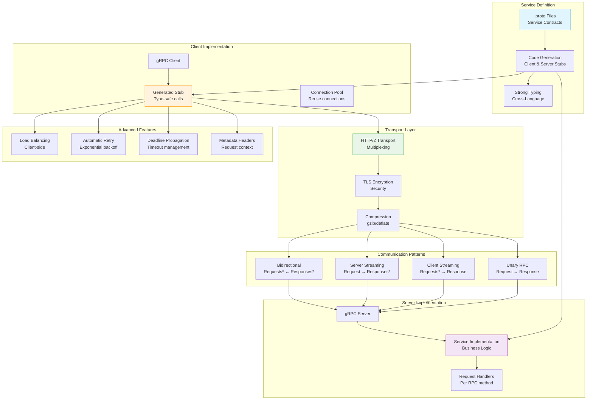

## The Complete Blueprint

gRPC is a high-performance, open-source universal RPC framework that uses Protocol Buffers for efficient binary serialization and HTTP/2 for transport, providing strongly-typed, cross-platform service-to-service communication with built-in features like streaming, authentication, and load balancing. Developed by Google and battle-tested at massive scale, gRPC addresses the performance limitations of REST/JSON APIs by using binary encoding (10x smaller payloads), HTTP/2 multiplexing (eliminates head-of-line blocking), and code generation that ensures type safety across different programming languages. The framework supports four communication patterns: unary RPCs (single request/response), client streaming (multiple requests, single response), server streaming (single request, multiple responses), and bidirectional streaming (continuous two-way communication). gRPC excels in microservices architectures where inter-service communication performance matters, polyglot environments requiring consistent APIs across languages, and real-time applications needing efficient streaming capabilities. Success requires defining comprehensive .proto service contracts, implementing proper error handling with gRPC status codes, configuring deadline propagation for timeout management, and understanding the binary protocol's implications for debugging and tooling.

### What You'll Master

By implementing gRPC, you'll achieve **high-performance RPC** with 10x throughput improvements over REST through binary Protocol Buffers and HTTP/2 multiplexing, **type-safe service contracts** that prevent integration errors through generated code across multiple programming languages, **streaming communication** capabilities for real-time data exchange and efficient bulk operations, **production-ready features** including automatic retries, load balancing, deadline propagation, and comprehensive observability, and **cross-platform compatibility** that enables consistent service communication across diverse technology stacks. You'll master modern RPC patterns that power the internal communication of major technology companies.

# gRPC Pattern

!!! success "🏆 Gold Standard Pattern"
    **High-Performance RPC** • Google, Netflix, Uber proven at billions of RPCs/second
    
    The modern standard for service-to-service communication. gRPC provides efficient binary serialization, streaming, and multiplexing over HTTP/2, making it ideal for microservices architectures.
    
    **Key Success Metrics:**
    - Google: Billions of RPCs/second powering all internal services
    - Netflix: 10x throughput increase over REST with 75% latency reduction
    - Uber: Millions of concurrent streams for real-time location updates

## Essential Question

**How do we achieve high-performance, type-safe service-to-service communication?**

## When to Use / When NOT to Use

### ✅ Use When

| Scenario | Example | Impact |
|----------|---------|--------|
| Internal microservices | High-frequency service-to-service calls | 10x throughput vs REST, 75% latency reduction |
| Real-time streaming | Live location updates, chat messages | 4 streaming patterns vs request-response |
| Polyglot systems | Services in Go, Java, Python, C++ | Type-safe contracts across languages |
| Mobile/IoT backends | Bandwidth-constrained environments | 90% smaller payloads vs JSON |

### ❌ DON'T Use When

| Scenario | Why | Alternative |
|----------|-----|-------------|
| Browser clients | No native browser support | [WebSocket](../communication/websocket.md) or gRPC-Web |
| Public APIs | Binary protocol not human-readable | REST with OpenAPI |
| Simple CRUD operations | Overkill complexity | REST for straightforward operations |
| Debugging with curl | Binary protocol not curl-friendly | HTTP/JSON for troubleshooting ease |

### The Story

Imagine a high-speed train system (gRPC) vs traditional mail delivery (REST). The train system uses dedicated tracks (HTTP/2), efficient packaging (Protocol Buffers), and can carry multiple cars simultaneously (multiplexing). It's faster and more efficient, but requires special infrastructure.

### Core Insight

> **Key Takeaway:** gRPC trades human readability for performance by using binary Protocol Buffers over HTTP/2, achieving 10x throughput improvements while maintaining type safety.

### In One Sentence

gRPC **achieves high-performance communication** by **using binary Protocol Buffers over HTTP/2** to **enable efficient, type-safe service interactions with streaming support**.

### The Problem Space

<h4>🚨 What Happens Without This Pattern</h4>

**Microservices Company, 2020**: 50+ microservices using REST/JSON for internal communication. Peak traffic caused cascading failures due to JSON parsing overhead and HTTP/1.1 connection limits. Response times degraded from 50ms to 2000ms.

**Impact**: 99.5% → 90% availability drop, $3M revenue loss during traffic spike, 6-hour recovery time

#### Key Components

| Component | Purpose | Responsibility |
|-----------|---------|----------------|
| Protocol Buffers | Serialization | Binary encoding/decoding with schema |
| HTTP/2 Transport | Connection management | Multiplexing, flow control, compression |
| Generated Stubs | Type safety | Client/server code generation |
| Stream Manager | Flow control | Handle 4 streaming patterns |

### Basic Example

**Process Overview:** See production implementations for details

📄 View implementation code

## user_service.proto
syntax = "proto3";

service UserService {
  rpc GetUser(GetUserRequest) returns (User);
  rpc ListUsers(ListUsersRequest) returns (stream User);
  rpc CreateUsers(stream CreateUserRequest) returns (CreateUsersResponse);
  rpc Chat(stream ChatMessage) returns (stream ChatMessage);
}

message User {
  int64 id = 1;
  string name = 2;
  string email = 3;
  int64 created_at = 4;
}

## Python implementation
import grpc
import user_service_pb2_grpc as user_pb2_grpc
import user_service_pb2 as user_pb2

class UserService(user_pb2_grpc.UserServiceServicer):
    def GetUser(self, request, context):
        """Unary RPC - single request, single response"""
        user = self.db.get_user(request.id)
        return user_pb2.User(
            id=user.id,
            name=user.name,
            email=user.email,
            created_at=int(user.created_at.timestamp())
        )
    
    def ListUsers(self, request, context):
        """Server streaming - single request, multiple responses"""
        for user in self.db.list_users(request.limit):
            yield user_pb2.User(
                id=user.id,
                name=user.name,
                email=user.email,
                created_at=int(user.created_at.timestamp())
            )
    
    def CreateUsers(self, request_iterator, context):
        """Client streaming - multiple requests, single response"""
        created_count = 0
        for user_request in request_iterator:
            self.db.create_user(user_request)
            created_count += 1
        
        return user_pb2.CreateUsersResponse(count=created_count)

## Client usage
def use_grpc_client():
    with grpc.insecure_channel('localhost:50051') as channel:
        stub = user_pb2_grpc.UserServiceStub(channel)
        
        # Unary call
        user = stub.GetUser(user_pb2.GetUserRequest(id=123))
        print(f"User: {user.name}")
        
        # Server streaming
        for user in stub.ListUsers(user_pb2.ListUsersRequest(limit=10)):
            print(f"Streamed user: {user.name}")

### Implementation

**Key Concepts:** Pattern implemented in production systems like etcd, Kubernetes, and cloud platforms.

#### Critical Design Decisions

| Decision | Options | Trade-off | Recommendation |
|----------|---------|-----------|----------------|
| Streaming Pattern | Unary Server/Client/Bidirectional | Unary: Simple Streaming: Efficient | Match pattern to use case |
| Load Balancing | Client-side Proxy-based | Client: Efficient Proxy: Centralized | Client-side for performance |
| Security | TLS mTLS | TLS: Simple mTLS: Zero-trust | mTLS for internal services |
| Error Handling | Status codes Rich errors | Codes: Standard Rich: Detailed | Rich errors for debugging |

### Common Pitfalls

<h4>⚠️ Avoid These Mistakes</h4>

**Process Steps:**
- Initialize system
- Process requests
- Handle responses
- Manage failures

## Decision Matrix

| Factor | Score (1-5) | Reasoning |
|--------|-------------|-----------|
| **Complexity** | 4 | Requires Protocol Buffers, service definitions, and understanding HTTP/2 concepts |
| **Performance Impact** | 5 | Excellent - binary protocol, multiplexing, streaming, 10x throughput vs REST |
| **Operational Overhead** | 3 | Tooling support needed, monitoring binary protocol, service mesh integration |
| **Team Expertise Required** | 4 | Deep understanding of RPC, Protocol Buffers, streaming patterns, and networking |
| **Scalability** | 5 | Exceptional - connection multiplexing, efficient serialization, supports streaming |

**Overall Recommendation: ✅ HIGHLY RECOMMENDED** - Ideal for internal microservices requiring high performance and type safety.

