# gRPC Pattern

!!! success "🏆 Gold Standard Pattern"
    **High-Performance RPC** • Google, Netflix, Uber proven
    
    The modern standard for service-to-service communication. gRPC provides efficient binary serialization, streaming, and multiplexing over HTTP/2, making it ideal for microservices architectures.
    
    **Key Success Metrics:**
    - Google: Billions of RPCs/second powering all services
    - Netflix: 10x throughput increase over REST
    - Uber: Millions of concurrent streams for real-time updates

## Essential Questions This Pattern Answers

!!! question "Critical Decision Points"
    1. **Do you need high-performance service-to-service communication?**
       - If yes → gRPC with binary Protocol Buffers
       - If no → Consider REST for simplicity
    
    2. **Do you require real-time streaming capabilities?**
       - If yes → gRPC supports 4 streaming patterns
       - If no → Simple request-response may suffice
    
    3. **Is your system polyglot with multiple languages?**
       - If yes → gRPC generates type-safe clients for 10+ languages
       - If no → Language-specific RPC might be simpler
    
    4. **Do you control both client and server?**
       - If yes → gRPC works perfectly
       - If no → REST/GraphQL for public APIs

---

## When to Use vs When NOT to Use

### Use gRPC When:
✅ **Internal microservices** need low-latency communication
✅ **Real-time streaming** requirements (chat, telemetry, live updates)
✅ **Polyglot services** need type-safe contracts
✅ **Mobile/IoT backends** require efficient bandwidth usage
✅ **High throughput** systems (>10K requests/second)

### DON'T Use gRPC When:
❌ **Browser clients** need direct access (use gRPC-Web or REST gateway)
❌ **Public APIs** for third parties (REST is more accessible)
❌ **Simple CRUD** operations (REST is simpler)
❌ **Debugging with curl** is needed (binary protocol)
❌ **Proxy/firewall** restrictions exist (some don't support HTTP/2)

## Level 1: Core Architecture

### gRPC Communication Flow

### Performance Comparison Matrix

| Aspect | REST/JSON | gRPC/Protobuf | GraphQL | WebSocket |
|--------|-----------|---------------|----------|----------|
| **Serialization Speed** | 150μs | 15μs ⚡ | 200μs | 100μs |
| **Message Size** | 1KB | 100B ⚡ | 800B | 500B |
| **Throughput** | 10K/s | 100K/s ⚡ | 8K/s | 50K/s |
| **CPU Usage** | 80% | 20% ⚡ | 85% | 40% |
| **Streaming** | ❌ | ✅ (4 types) | ✅ (subscriptions) | ✅ |
| **Type Safety** | ❌ | ✅ | ✅ | ❌ |
| **Browser Support** | ✅ | ⚠️ (needs proxy) | ✅ | ✅ |

---

## Level 2: Implementation Patterns

### gRPC Communication Patterns

### Decision Matrix: Which Pattern to Use?

| Use Case | Pattern | Example | Why |
|----------|---------|---------|-----|
| **Simple request-response** | Unary | GetUser(id) | Traditional RPC, easiest to reason about |
| **Real-time updates** | Server Streaming | Stock prices, logs | Server pushes data as available |
| **Bulk upload** | Client Streaming | File upload, batch insert | Client controls data flow |
| **Real-time chat** | Bidirectional | Chat, gaming | Both sides send independently |

### Protocol Buffer Schema Design

### Production Architecture

### Load Balancing Strategies

### Error Handling Strategy

| Status Code | Meaning | Retry? | Client Action |
|-------------|---------|--------|---------------|
| `OK` | Success | No | Process response |
| `CANCELLED` | Client cancelled | No | Clean up resources |
| `DEADLINE_EXCEEDED` | Timeout | Maybe | Increase timeout or optimize |
| `NOT_FOUND` | Resource missing | No | Handle missing resource |
| `UNAVAILABLE` | Service down | Yes | Exponential backoff |
| `RESOURCE_EXHAUSTED` | Rate limited | Yes | Backoff with jitter |
| `INTERNAL` | Server error | Maybe | Log and alert |

---

## Level 3: Production Considerations

### Security Architecture

```mermaid
graph TB
    subgraph "Security Layers"
        A[Client] -->|"1. TLS/mTLS"| B[Edge Proxy]
        B -->|"2. Auth Token"| C[Auth Interceptor]
        C -->|"3. Authorization"| D[Service]
        D -->|"4. Data Encryption"| E[Database]
        
        F["🔒 Transport Security: TLS 1.3"]
        G["🔑 Authentication: JWT/OAuth2"]
        H["🛡️ Authorization: RBAC/ABAC"]
        I["🔐 Data Security: Field-level encryption"]
        
        B --> F
        C --> G
        D --> H
        E --> I
    end
    
    style F fill:#ffebee
    style G fill:#ffebee
    style H fill:#ffebee
    style I fill:#ffebee
```

### Interceptor Chain Pattern

### Monitoring & Observability

### Performance Optimization Strategies

| Optimization | Impact | Implementation | Trade-off |
|--------------|--------|----------------|-----------||
| **Connection Pooling** | 50% latency reduction | Reuse HTTP/2 connections | Memory overhead |
| **Message Compression** | 70% bandwidth saving | gzip/snappy compression | CPU overhead |
| **Streaming vs Unary** | 90% memory reduction | Use for large datasets | Complexity |
| **Client-side caching** | 95% fewer requests | Cache immutable data | Stale data risk |
| **Batch requests** | 80% overhead reduction | Combine multiple calls | Latency increase |

### Resource Limits Configuration

---

## Level 4: Migration & Evolution

### REST to gRPC Migration Strategy

### Version Evolution Pattern

| Stage | Action | Example | Backward Compatible |
|-------|--------|---------|--------------------|
| **1. Add Field** | Add optional field | `string middle_name = 5;` | ✅ Yes |
| **2. Deprecate Field** | Mark as deprecated | `string name = 2 [deprecated=true];` | ✅ Yes |
| **3. New Service Version** | Create v2 service | `package user.v2;` | ✅ Yes |
| **4. Remove Old Version** | After migration | Delete v1 files | ❌ No |

---

## Production Readiness Checklist

### Essential Implementation

| Component | Required | Configuration | Validation |
|-----------|----------|---------------|------------|
| **Protocol Buffers** | ✅ | Version strategy, field numbers | Proto lint |
| **TLS/mTLS** | ✅ | Certificates, rotation | Security scan |
| **Health Checks** | ✅ | Liveness, readiness | Continuous monitoring |
| **Timeouts** | ✅ | Client: 5-30s, Server: 30-60s | Load testing |
| **Retries** | ✅ | Exponential backoff, max 3 | Error rate analysis |
| **Load Balancing** | ✅ | Client-side or proxy | Distribution metrics |
| **Monitoring** | ✅ | Metrics, traces, logs | Dashboard alerts |
| **Rate Limiting** | ✅ | Per-client quotas | Throttle testing |

### Common Pitfalls & Solutions

---

## Related Patterns
- [Request-Reply](request-reply.md) - Alternative async pattern
- [Service Mesh](service-mesh.md) - For gRPC traffic management
- [Circuit Breaker](../resilience/circuit-breaker.md) - For gRPC fault tolerance
- [API Gateway](api-gateway.md) - gRPC to REST translation

---

[:material-arrow-left: Request-Reply](request-reply.md) | 
[:material-arrow-up: Communication Patterns](index.md) | 
[:material-arrow-right: WebSocket](websocket.md)

