# gRPC Pattern

!!! success "🏆 Gold Standard Pattern"
    **High-Performance RPC** • Google, Netflix, Uber proven at billions of RPCs/second
    
    The modern standard for service-to-service communication. gRPC provides efficient binary serialization, streaming, and multiplexing over HTTP/2, making it ideal for microservices architectures.
    
    **Key Success Metrics:**
    - Google: Billions of RPCs/second powering all internal services
    - Netflix: 10x throughput increase over REST with 75% latency reduction
    - Uber: Millions of concurrent streams for real-time location updates

## Essential Question

**How do we achieve high-performance, type-safe service-to-service communication?**

## When to Use / When NOT to Use

### ✅ Use When

| Scenario | Example | Impact |
|----------|---------|--------|
| Internal microservices | High-frequency service-to-service calls | 10x throughput vs REST, 75% latency reduction |
| Real-time streaming | Live location updates, chat messages | 4 streaming patterns vs request-response |
| Polyglot systems | Services in Go, Java, Python, C++ | Type-safe contracts across languages |
| Mobile/IoT backends | Bandwidth-constrained environments | 90% smaller payloads vs JSON |

### ❌ DON'T Use When

| Scenario | Why | Alternative |
|----------|-----|-------------|
| Browser clients | No native browser support | [WebSocket](websocket.md) or gRPC-Web |
| Public APIs | Binary protocol not human-readable | REST with OpenAPI |
| Simple CRUD operations | Overkill complexity | REST for straightforward operations |
| Debugging with curl | Binary protocol not curl-friendly | HTTP/JSON for troubleshooting ease |

## Level 1: Intuition (5 min) {#intuition}

### The Story

Imagine a high-speed train system (gRPC) vs traditional mail delivery (REST). The train system uses dedicated tracks (HTTP/2), efficient packaging (Protocol Buffers), and can carry multiple cars simultaneously (multiplexing). It's faster and more efficient, but requires special infrastructure.

### Visual Metaphor


### Core Insight

> **Key Takeaway:** gRPC trades human readability for performance by using binary Protocol Buffers over HTTP/2, achieving 10x throughput improvements while maintaining type safety.

### In One Sentence

gRPC **achieves high-performance communication** by **using binary Protocol Buffers over HTTP/2** to **enable efficient, type-safe service interactions with streaming support**.

## Level 2: Foundation (10 min) {#foundation}

### The Problem Space

<div class="failure-vignette">
<h4>🚨 What Happens Without This Pattern</h4>

**Microservices Company, 2020**: 50+ microservices using REST/JSON for internal communication. Peak traffic caused cascading failures due to JSON parsing overhead and HTTP/1.1 connection limits. Response times degraded from 50ms to 2000ms.

**Impact**: 99.5% → 90% availability drop, $3M revenue loss during traffic spike, 6-hour recovery time
</div>

### How It Works

#### Architecture Overview


#### Key Components

| Component | Purpose | Responsibility |
|-----------|---------|----------------|
| Protocol Buffers | Serialization | Binary encoding/decoding with schema |
| HTTP/2 Transport | Connection management | Multiplexing, flow control, compression |
| Generated Stubs | Type safety | Client/server code generation |
| Stream Manager | Flow control | Handle 4 streaming patterns |

### Basic Example

```python
# user_service.proto
syntax = "proto3";

service UserService {
  rpc GetUser(GetUserRequest) returns (User);
  rpc ListUsers(ListUsersRequest) returns (stream User);
  rpc CreateUsers(stream CreateUserRequest) returns (CreateUsersResponse);
  rpc Chat(stream ChatMessage) returns (stream ChatMessage);
}

message User {
  int64 id = 1;
  string name = 2;
  string email = 3;
  int64 created_at = 4;
}

# Python implementation
import grpc
import user_service_pb2_grpc as user_pb2_grpc
import user_service_pb2 as user_pb2

class UserService(user_pb2_grpc.UserServiceServicer):
    def GetUser(self, request, context):
        """Unary RPC - single request, single response"""
        user = self.db.get_user(request.id)
        return user_pb2.User(
            id=user.id,
            name=user.name,
            email=user.email,
            created_at=int(user.created_at.timestamp())
        )
    
    def ListUsers(self, request, context):
        """Server streaming - single request, multiple responses"""
        for user in self.db.list_users(request.limit):
            yield user_pb2.User(
                id=user.id,
                name=user.name,
                email=user.email,
                created_at=int(user.created_at.timestamp())
            )
    
    def CreateUsers(self, request_iterator, context):
        """Client streaming - multiple requests, single response"""
        created_count = 0
        for user_request in request_iterator:
            self.db.create_user(user_request)
            created_count += 1
        
        return user_pb2.CreateUsersResponse(count=created_count)

# Client usage
def use_grpc_client():
    with grpc.insecure_channel('localhost:50051') as channel:
        stub = user_pb2_grpc.UserServiceStub(channel)
        
        # Unary call
        user = stub.GetUser(user_pb2.GetUserRequest(id=123))
        print(f"User: {user.name}")
        
        # Server streaming
        for user in stub.ListUsers(user_pb2.ListUsersRequest(limit=10)):
            print(f"Streamed user: {user.name}")
```

## Level 3: Deep Dive (15 min) {#deep-dive}

### Implementation Details

#### gRPC Communication Patterns

```mermaid
stateDiagram-v2
    [*] --> Unary
    [*] --> ServerStreaming
    [*] --> ClientStreaming
    [*] --> BidirectionalStreaming
    
    Unary: Single Request → Single Response
    ServerStreaming: Single Request → Stream Response
    ClientStreaming: Stream Request → Single Response
    BidirectionalStreaming: Stream Request ↔ Stream Response
    
    note right of Unary: Traditional RPC pattern
    note right of ServerStreaming: Real-time data feeds
    note right of ClientStreaming: Bulk uploads
    note right of BidirectionalStreaming: Real-time chat
```



#### Critical Design Decisions

| Decision | Options | Trade-off | Recommendation |
|----------|---------|-----------|----------------|
| Streaming Pattern | Unary<br>Server/Client/Bidirectional | Unary: Simple<br>Streaming: Efficient | Match pattern to use case |
| Load Balancing | Client-side<br>Proxy-based | Client: Efficient<br>Proxy: Centralized | Client-side for performance |
| Security | TLS<br>mTLS | TLS: Simple<br>mTLS: Zero-trust | mTLS for internal services |
| Error Handling | Status codes<br>Rich errors | Codes: Standard<br>Rich: Detailed | Rich errors for debugging |

### Common Pitfalls

<div class="decision-box">
<h4>⚠️ Avoid These Mistakes</h4>

1. **Large Message Sizes**: Can cause memory issues → Use streaming for >1MB payloads
2. **No Deadline Setting**: Leads to hanging requests → Always set deadlines (5-30s)
3. **Connection Pool Neglect**: Poor performance → Configure connection pooling properly
4. **Breaking Proto Changes**: Client incompatibility → Use field numbering and optional fields
</div>

### Production Considerations

#### Performance Characteristics

| Metric | Typical Range | Optimization Target |
|--------|---------------|-------------------|
| Serialization Time | 10-50μs | < 20μs for p95 |
| Message Size | 100B-10KB | Minimize payload size |
| Throughput | 50K-200K req/sec | Depends on message complexity |
| Connection Overhead | 5-10 connections | Reuse connections via pooling |

## Level 4: Expert (20 min) {#expert}

### Advanced Techniques

#### 1. Interceptor Chain Pattern

```python
import grpc
import time
from concurrent import futures

class AuthInterceptor(grpc.ServerInterceptor):
    def intercept_service(self, continuation, handler_call_details):
        """Authentication interceptor"""
        metadata = dict(handler_call_details.invocation_metadata)
        
        if 'authorization' not in metadata:
            context = grpc.ServicerContext()
            context.abort(grpc.StatusCode.UNAUTHENTICATED, 'Missing auth token')
        
        # Validate token
        token = metadata['authorization']
        if not self._validate_token(token):
            context = grpc.ServicerContext()
            context.abort(grpc.StatusCode.PERMISSION_DENIED, 'Invalid token')
        
        return continuation(handler_call_details)

class RateLimitInterceptor(grpc.ServerInterceptor):
    def __init__(self, max_requests_per_second=100):
        self.max_requests = max_requests_per_second
        self.requests = {}
        
    def intercept_service(self, continuation, handler_call_details):
        """Rate limiting interceptor"""
        client_ip = self._extract_client_ip(handler_call_details)
        current_time = time.time()
        
        # Clean old requests
        minute_ago = current_time - 60
        self.requests[client_ip] = [
            req_time for req_time in self.requests.get(client_ip, [])
            if req_time > minute_ago
        ]
        
        # Check rate limit
        if len(self.requests[client_ip]) >= self.max_requests:
            context = grpc.ServicerContext()
            context.abort(grpc.StatusCode.RESOURCE_EXHAUSTED, 'Rate limit exceeded')
        
        self.requests[client_ip].append(current_time)
        return continuation(handler_call_details)

# Server setup with interceptors
def serve():
    interceptors = [
        AuthInterceptor(),
        RateLimitInterceptor(max_requests_per_second=1000)
    ]
    
    server = grpc.server(
        futures.ThreadPoolExecutor(max_workers=100),
        interceptors=interceptors
    )
    
    user_pb2_grpc.add_UserServiceServicer_to_server(UserService(), server)
    server.add_insecure_port('[::]:50051')
    server.start()
    server.wait_for_termination()
```

#### 2. Advanced Load Balancing

```python
import grpc
import random
from grpc._channel import _MultiCallableIterator

class CustomLoadBalancer:
    def __init__(self, endpoints):
        self.endpoints = endpoints
        self.stats = {ep: {'requests': 0, 'errors': 0} for ep in endpoints}
    
    def pick_endpoint(self):
        """Weighted random selection based on success rate"""
        weights = []
        for endpoint in self.endpoints:
            stats = self.stats[endpoint]
            success_rate = 1.0
            if stats['requests'] > 0:
                success_rate = 1 - (stats['errors'] / stats['requests'])
            weights.append(max(success_rate, 0.1))  # Minimum 10% weight
        
        return random.choices(self.endpoints, weights=weights)[0]

class LoadBalancedChannel:
    def __init__(self, endpoints):
        self.load_balancer = CustomLoadBalancer(endpoints)
        self.channels = {
            ep: grpc.insecure_channel(ep) 
            for ep in endpoints
        }
    
    def unary_unary(self, method, request_serializer, response_deserializer):
        def call_method(request, timeout=None, metadata=None):
            endpoint = self.load_balancer.pick_endpoint()
            channel = self.channels[endpoint]
            
            try:
                stub = channel.unary_unary(
                    method,
                    request_serializer=request_serializer,
                    response_deserializer=response_deserializer
                )
                response = stub(request, timeout=timeout, metadata=metadata)
                
                # Record success
                self.load_balancer.stats[endpoint]['requests'] += 1
                return response
                
            except grpc.RpcError as e:
                # Record error
                self.load_balancer.stats[endpoint]['requests'] += 1
                self.load_balancer.stats[endpoint]['errors'] += 1
                raise
        
        return call_method
```

### Scaling Considerations


### Monitoring & Observability

#### Key Metrics to Track

| Metric | Alert Threshold | Dashboard Panel |
|--------|----------------|-----------------|
| RPC Latency | > 100ms p95 | Latency percentile chart |
| Error Rate | > 1% failed RPCs | Error rate by method |
| Connection Count | > 1000 per client | Connection pool metrics |
| Message Size | > 1MB average | Payload size distribution |

## Level 5: Mastery (30 min) {#mastery}

### Real-World Case Studies

#### Case Study 1: Google's Internal RPC Migration

<div class="truth-box">
<h4>💡 Production Insights from Google</h4>

**Challenge**: Replace internal Stubby RPC system with open-source gRPC while maintaining performance

**Implementation**:
- Gradual migration using adapter patterns
- Extensive load testing with production traffic
- Custom load balancing for Google's scale
- Integration with Borg scheduler for service discovery

**Results**:
- Zero downtime migration across 1000+ services
- 20% improvement in CPU efficiency
- Reduced operational complexity with standard tooling
- Open-sourced for industry benefit

**Lessons Learned**: Gradual migration with production traffic validation is essential for large-scale RPC changes
</div>

#### Case Study 2: Netflix's Performance Optimization

<div class="truth-box">
<h4>💡 Production Insights from Netflix</h4>

**Challenge**: Optimize gRPC for streaming video metadata and recommendation services

**Implementation**:
- Custom connection pooling for high-concurrency workloads
- Protocol Buffer optimization for payload size
- Circuit breakers integrated with gRPC interceptors
- Region-aware load balancing for global deployment

**Results**:
- 10x throughput improvement over REST/JSON
- 75% reduction in serialization CPU usage
- 50% reduction in network bandwidth
- Sub-10ms p95 latency for metadata calls

**Lessons Learned**: Protocol Buffer schema design significantly impacts performance; optimize for your specific use case
</div>

### Pattern Evolution

#### Migration Strategy


#### Future Directions

| Trend | Impact on Pattern | Adaptation Strategy |
|-------|------------------|-------------------|
| HTTP/3 (QUIC) | Lower latency, better mobile | Migrate transport layer |
| WebAssembly | Client-side protocol compilation | WASM-based client generation |
| Edge Computing | Distributed RPC calls | Regional service mesh integration |

### Pattern Combinations

#### Works Well With

| Pattern | Combination Benefit | Integration Point |
|---------|-------------------|------------------|
| [Service Mesh](service-mesh.md) | Traffic management | Envoy proxy with gRPC support |
| [Circuit Breaker](../resilience/circuit-breaker.md) | Fault tolerance | gRPC interceptor integration |
| [API Gateway](api-gateway.md) | Protocol translation | gRPC-to-REST conversion |

## Quick Reference

### Decision Matrix


### Comparison with Alternatives

| Aspect | gRPC | REST/JSON | GraphQL |
|--------|------|-----------|---------|
| Performance | Excellent (binary) | Good (text) | Good (optimized queries) |
| Type Safety | Strong (Protocol Buffers) | Weak (manual validation) | Strong (schema) |
| Streaming | 4 patterns | Server-Sent Events | Subscriptions |
| Browser Support | Requires proxy | Native | Native |
| When to use | Internal services | Public APIs | Flexible querying |

### Implementation Checklist

**Pre-Implementation**
- [ ] Define Protocol Buffer schemas with versioning strategy
- [ ] Choose appropriate streaming patterns for use cases
- [ ] Plan authentication and authorization approach
- [ ] Design load balancing and service discovery strategy

**Implementation**
- [ ] Generate client/server code from .proto files
- [ ] Implement proper error handling with status codes
- [ ] Configure connection pooling and timeouts
- [ ] Set up monitoring and observability

**Post-Implementation**
- [ ] Load test with realistic traffic patterns
- [ ] Monitor RPC latency and error rates
- [ ] Optimize Protocol Buffer schemas based on usage
- [ ] Plan schema evolution and backward compatibility

### Related Resources

<div class="grid cards" markdown>

- :material-book-open-variant:{ .lg .middle } **Related Patterns**
    
    ---
    
    - [Request-Reply](request-reply.md) - Alternative async communication
    - [Service Mesh](service-mesh.md) - gRPC traffic management
    - [Circuit Breaker](../resilience/circuit-breaker.md) - Fault tolerance

- :material-flask:{ .lg .middle } **Fundamental Laws**
    
    ---
    
    - [Law 2: Asynchronous Reality](../../part1-axioms/law2-asynchrony/) - Streaming communication
    - [Law 4: Multi-dimensional Optimization](../../part1-axioms/law4-tradeoffs/) - Performance vs complexity

- :material-pillar:{ .lg .middle } **Foundational Pillars**
    
    ---
    
    - [Work Distribution](../../part2-pillars/work/) - Efficient RPC load balancing
    - [Control Distribution](../../part2-pillars/control/) - Type-safe communication contracts

- :material-tools:{ .lg .middle } **Implementation Guides**
    
    ---
    
    - [gRPC Setup Guide](../../excellence/guides/grpc-setup.md)
    - [Protocol Buffer Design](../../excellence/guides/protobuf-design.md)
    - [gRPC Performance Tuning](../../excellence/guides/grpc-performance.md)

</div>