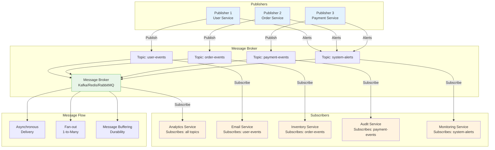

## The Complete Blueprint

Publish-Subscribe (Pub-Sub) is a messaging pattern that enables loosely coupled, asynchronous communication between publishers (message producers) and subscribers (message consumers) through an intermediary message broker or event bus. Publishers emit messages to named topics without knowledge of specific subscribers, while subscribers register interest in topics and receive all messages published to those topics without knowing the publishers. This decoupling allows systems to evolve independently—new subscribers can be added without modifying publishers, publishers can change without affecting existing subscribers, and the system can scale horizontally by adding more publishers or subscribers as needed. The pattern supports multiple communication scenarios including one-to-many (broadcast), many-to-one (aggregation), and many-to-many (event mesh) messaging. Modern implementations like Apache Kafka, Redis Pub/Sub, and Google Cloud Pub/Sub provide features such as message persistence, ordering guarantees, delivery semantics (at-least-once, at-most-once, exactly-once), and topic partitioning for scalability. Success requires careful design of topic hierarchies, message schemas, error handling strategies, and consideration of delivery guarantees appropriate for your use case.

### What You'll Master

By implementing publish-subscribe patterns, you'll achieve **loose coupling** where publishers and subscribers can evolve independently without breaking system integration, **scalable fan-out** that allows one message to reach multiple interested consumers efficiently, **asynchronous processing** that prevents blocking operations and improves system responsiveness, **event-driven architecture** mastery where systems react to state changes through events rather than direct calls, and **resilient messaging** with features like message persistence, retry mechanisms, and dead letter queues. You'll learn to design systems where components communicate through well-defined events while maintaining operational independence.

# Publish-Subscribe Pattern

!!! success "🏆 Gold Standard Pattern"
    **Decoupled Event Distribution** • Kafka, Redis, Google Pub/Sub proven
    
    The cornerstone of event-driven architectures. Pub-sub enables scalable, decoupled communication where publishers and subscribers operate independently, supporting everything from real-time notifications to event streaming.
    
    **Key Success Metrics:**
    - LinkedIn Kafka: 7 trillion messages/day powering all services
    - Redis Pub/Sub: Microsecond latency for real-time features
    - Google Pub/Sub: 500M messages/sec with global distribution

## Essential Questions This Pattern Answers

!!! question "Critical Decision Points"
    **Process Steps:**
- Initialize system
- Process requests
- Handle responses
- Manage failures

## Decision Matrix

| Factor | Score (1-5) | Reasoning |
|--------|-------------|-----------|
| **Complexity** | 3 | Message broker setup, topic management, but well-understood patterns |
| **Performance Impact** | 4 | Excellent throughput (millions/sec), async processing, minimal request latency |
| **Operational Overhead** | 4 | Broker management, monitoring consumer lag, message retention, dead letter queues |
| **Team Expertise Required** | 3 | Understanding of messaging concepts, delivery semantics, and event-driven architecture |
| **Scalability** | 5 | Outstanding - horizontal scaling, partitioning, fan-out to multiple consumers |

**Overall Recommendation: ✅ HIGHLY RECOMMENDED** - Essential for event-driven architectures and microservices communication.

