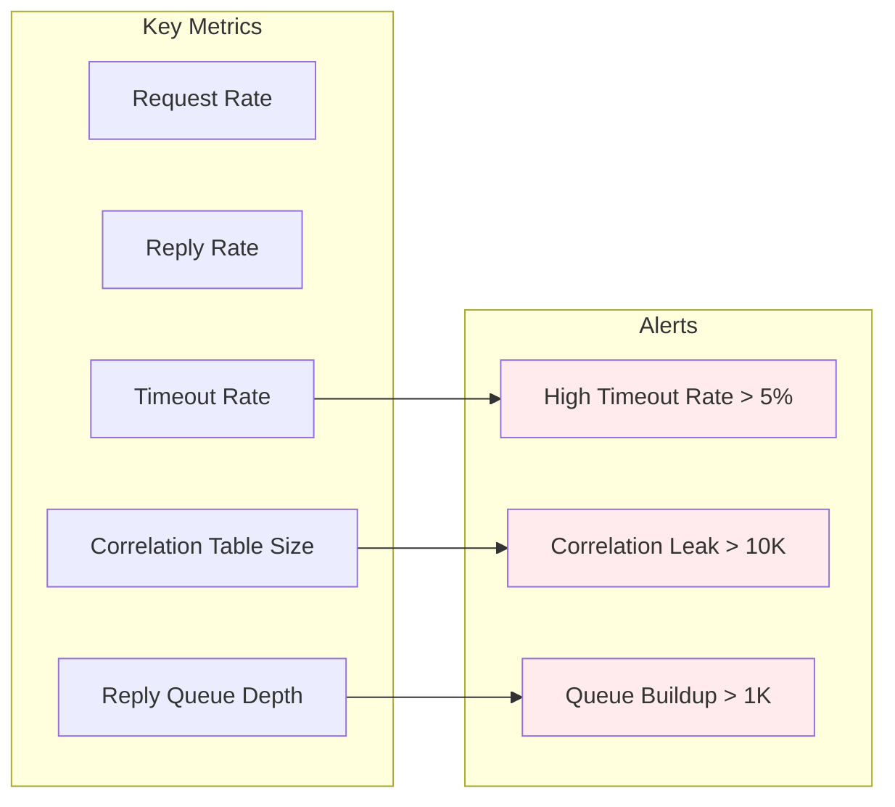
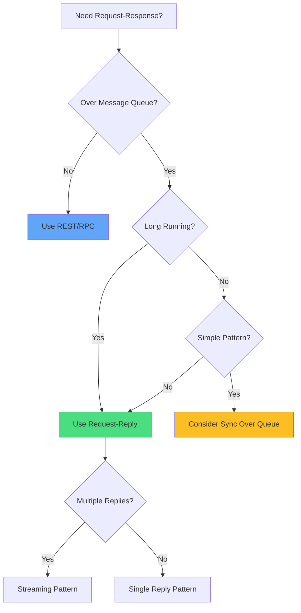

# Request-Reply Pattern

!!! warning "🥈 Silver Pattern - Use with Expertise"
    **Complexity**: Medium • **Expertise Required**: Message correlation and state management
    
    Request-Reply enables asynchronous communication but requires careful handling of correlation IDs, timeouts, and reply queues. Consider simpler synchronous patterns for basic use cases.

**Asynchronous request-response communication over messaging systems**

> *"When you can't wait for an answer, but you still need one eventually."*

---

## Level 1: Intuition

### Core Concept

Request-Reply extends basic messaging to support request-response semantics over inherently one-way message channels. The client sends a request message and receives a reply message asynchronously, enabling temporal decoupling.

### Visual Metaphor

```
Synchronous RPC:              Request-Reply Pattern:
                             
Client → Server              Client → Request Queue → Server
  ↓        ↑                   ↓                         ↓
  [waits]  ↓                   ↓                         ↓
  ←────────←                   ↓                         ↓
                               ↓                         ↓
                               ←─── Reply Queue ←────────←
                               
Blocks until response         Non-blocking with correlation
```

---

## Level 2: Foundation

### The Problem

Traditional RPC blocks the client until receiving a response, wasting resources and creating tight coupling. In distributed systems, we need:
- Non-blocking communication
- Temporal decoupling
- Support for long-running operations
- Multiple reply patterns

### Basic Implementation

```python
import uuid
import asyncio
from dataclasses import dataclass
from typing import Dict, Callable, Optional
import json

@dataclass
class Message:
    correlation_id: str
    reply_to: str
    body: dict
    
class RequestReplyClient:
    def __init__(self, send_channel, receive_channel):
        self.send_channel = send_channel
        self.receive_channel = receive_channel
        self.pending_requests: Dict[str, asyncio.Future] = {}
        self.reply_queue = f"reply.{uuid.uuid4()}"
        
    async def start(self):
        """Start listening for replies"""
        await self.receive_channel.subscribe(self.reply_queue)
        asyncio.create_task(self._process_replies())
        
    async def request(self, destination: str, body: dict, timeout: float = 30.0) -> dict:
        """Send request and wait for reply"""
        correlation_id = str(uuid.uuid4())
        
        # Create future for response
        future = asyncio.create_future()
        self.pending_requests[correlation_id] = future
        
        # Send request
        message = Message(
            correlation_id=correlation_id,
            reply_to=self.reply_queue,
            body=body
        )
        await self.send_channel.publish(destination, message)
        
        # Wait for reply with timeout
        try:
            response = await asyncio.wait_for(future, timeout)
            return response
        except asyncio.TimeoutError:
            del self.pending_requests[correlation_id]
            raise TimeoutError(f"Request {correlation_id} timed out")
            
    async def _process_replies(self):
        """Process incoming replies"""
        async for message in self.receive_channel:
            correlation_id = message.correlation_id
            
            if correlation_id in self.pending_requests:
                future = self.pending_requests.pop(correlation_id)
                future.set_result(message.body)
```

### Pattern Variations

| Variation | Description | Use Case |
|-----------|-------------|----------|
| **Single Reply** | One request, one reply | Simple queries |
| **Multiple Replies** | One request, many replies | Scatter-gather |
| **Streaming Reply** | Continuous reply stream | Progress updates |
| **Reply Optional** | Reply only on success | Fire-and-forget with confirmation |

---

## Level 3: Deep Dive

### Advanced Implementation with Patterns

```python
class AdvancedRequestReplyClient:
    """Enhanced client with multiple reply patterns"""
    
    def __init__(self, messaging_system):
        self.messaging = messaging_system
        self.pending = {}
        self.reply_handlers = {}
        
    async def request_single(self, service: str, request: dict) -> dict:
        """Traditional request-reply"""
        correlation_id = self._generate_correlation_id()
        future = asyncio.create_future()
        
        self.pending[correlation_id] = {
            'type': 'single',
            'future': future,
            'timeout_handle': None
        }
        
        await self._send_request(service, request, correlation_id)
        return await future
        
    async def request_stream(self, service: str, request: dict) -> AsyncIterator[dict]:
        """Streaming replies"""
        correlation_id = self._generate_correlation_id()
        queue = asyncio.Queue()
        
        self.pending[correlation_id] = {
            'type': 'stream',
            'queue': queue,
            'active': True
        }
        
        await self._send_request(service, request, correlation_id)
        
        # Yield replies as they arrive
        while True:
            reply = await queue.get()
            if reply is None:  # End of stream
                break
            yield reply
            
    async def scatter_gather(self, services: List[str], request: dict, 
                           min_replies: int = None) -> List[dict]:
        """Send to multiple services, gather replies"""
        correlation_id = self._generate_correlation_id()
        replies = []
        expected = len(services)
        min_replies = min_replies or expected
        
        event = asyncio.Event()
        self.pending[correlation_id] = {
            'type': 'scatter_gather',
            'replies': replies,
            'expected': expected,
            'min_replies': min_replies,
            'event': event
        }
        
        # Send to all services
        for service in services:
            await self._send_request(service, request, correlation_id)
            
        # Wait for minimum replies
        await event.wait()
        return replies
```

### Correlation Management

```python
class CorrelationManager:
    """Manages request-reply correlations"""
    
    def __init__(self, ttl_seconds: int = 300):
        self.correlations: Dict[str, CorrelationContext] = {}
        self.ttl = ttl_seconds
        
    def create_correlation(self, metadata: dict) -> str:
        """Create new correlation with timeout"""
        correlation_id = str(uuid.uuid4())
        
        context = CorrelationContext(
            id=correlation_id,
            created_at=time.time(),
            metadata=metadata,
            timeout_handle=asyncio.create_task(
                self._timeout_correlation(correlation_id)
            )
        )
        
        self.correlations[correlation_id] = context
        return correlation_id
        
    async def _timeout_correlation(self, correlation_id: str):
        """Handle correlation timeout"""
        await asyncio.sleep(self.ttl)
        
        if correlation_id in self.correlations:
            context = self.correlations.pop(correlation_id)
            # Notify timeout
            if context.callback:
                await context.callback(None, TimeoutError())
```

### Production Considerations

!!! warning "Common Pitfalls"
    - **Orphaned correlations**: Always implement timeouts
    - **Reply queue cleanup**: Delete temporary queues
    - **Message ordering**: Replies may arrive out of order
    - **Duplicate replies**: Implement idempotency

---

## Level 4: Expert Practitioner

### Integration Patterns

```python
class RequestReplyGateway:
    """Gateway pattern for request-reply"""
    
    def __init__(self, message_broker):
        self.broker = message_broker
        self.routers = {}
        self.interceptors = []
        
    def register_service(self, name: str, handler: Callable):
        """Register service handler"""
        async def service_wrapper(message):
            try:
                # Extract request
                request = message.body
                correlation_id = message.correlation_id
                reply_to = message.reply_to
                
                # Process request
                response = await handler(request)
                
                # Send reply
                reply = Message(
                    correlation_id=correlation_id,
                    body=response
                )
                await self.broker.publish(reply_to, reply)
                
            except Exception as e:
                # Send error reply
                error_reply = Message(
                    correlation_id=correlation_id,
                    body={'error': str(e)}
                )
                await self.broker.publish(reply_to, error_reply)
                
        self.routers[name] = service_wrapper
        
    async def start(self):
        """Start gateway"""
        for service_name, handler in self.routers.items():
            await self.broker.subscribe(service_name, handler)
```

### Performance Optimization Strategies

| Strategy | Technique | Impact | Trade-off |
|----------|-----------|--------|-----------||
| **Batching** | Group requests | 5x less overhead | Higher latency |
| **Pooling** | Reuse connections | 10x throughput | Memory usage |
| **Caching** | Store frequent replies | 90% hit rate | Stale data risk |
| **Prefetch** | Anticipate requests | 50% faster | Wasted work |
| **Compression** | Compress large replies | 70% bandwidth | CPU overhead |

### Monitoring & Observability



---

## Production Checklist

### Essential Implementation

| Component | Required | Configuration | Validation |
|-----------|----------|---------------|------------|
| **Correlation IDs** | ✅ | UUID or business key | Uniqueness test |
| **Timeouts** | ✅ | 30s default, configurable | Load testing |
| **Reply Queues** | ✅ | Auto-delete, exclusive | Queue metrics |
| **Error Handling** | ✅ | Timeout, error replies | Error scenarios |
| **Monitoring** | ✅ | Correlation table size | Leak detection |
| **Cleanup** | ✅ | TTL-based eviction | Memory profiling |
| **Retries** | ✅ | Exponential backoff | Circuit breaker |
| **Idempotency** | ✅ | Dedup by correlation | Duplicate tests |

### Decision Matrix



---

## Related Patterns
- [Message Queue](message-queue.md) - Foundation for request-reply
- [Publish-Subscribe](publish-subscribe.md) - Alternative communication model
- [Saga Pattern](../coordination/saga.md) - For distributed transactions
- [Circuit Breaker](../resilience/circuit-breaker.md) - For failure handling

---

<div class="page-nav" markdown>
[:material-arrow-left: Publish-Subscribe](publish-subscribe.md) | 
[:material-arrow-up: Communication Patterns](index.md) | 
[:material-arrow-right: gRPC](grpc.md)
</div>