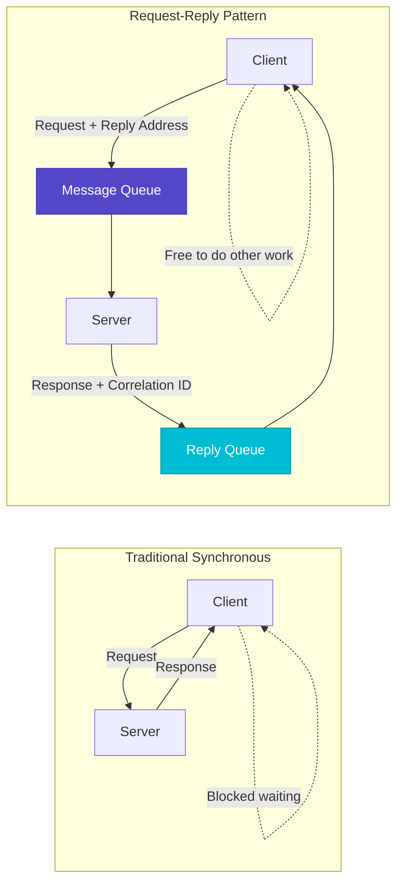
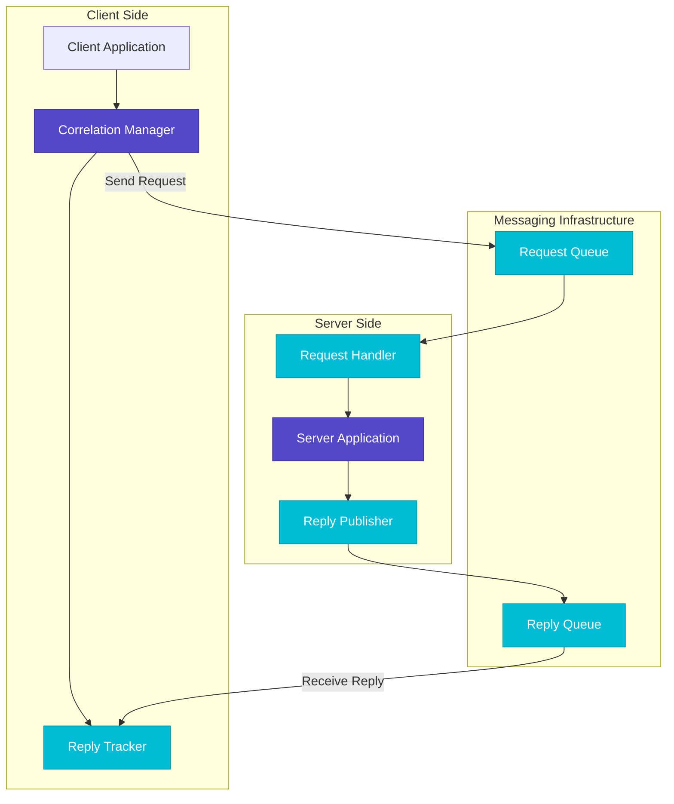
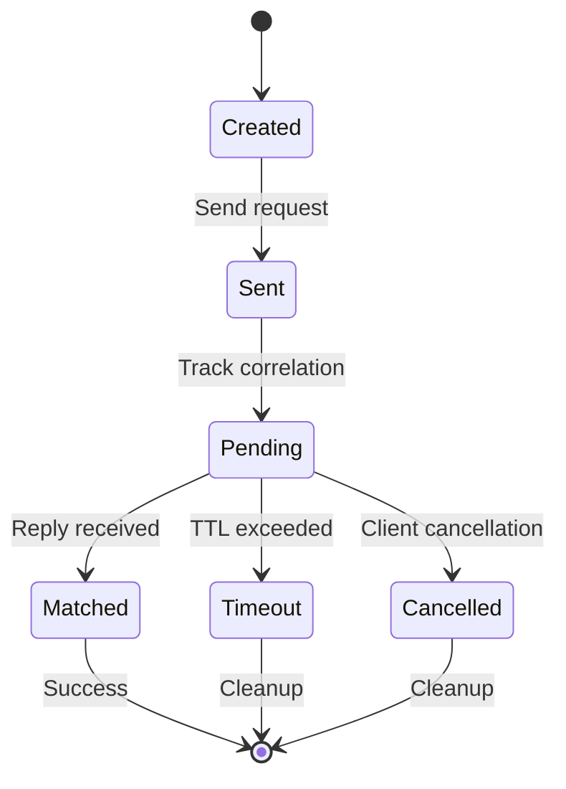
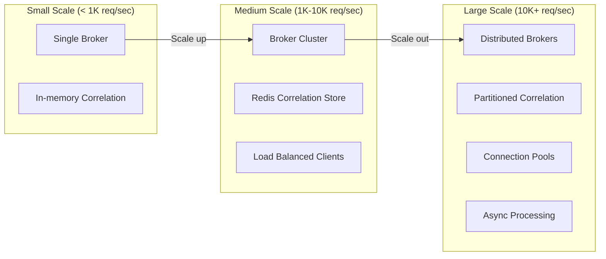
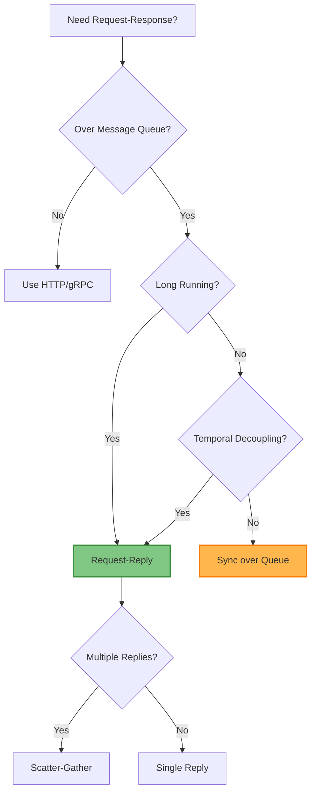

# Request-Reply Pattern

!!! info "🥈 Silver Tier Pattern"
    **Asynchronous Request-Response** • IBM MQ, Apache Camel, RabbitMQ proven
    
    Request-Reply enables asynchronous request-response over messaging systems but requires careful correlation management. Essential for queue-based systems needing response confirmation.
    
    **Best For:** Long-running operations and temporal decoupling over message queues

## Essential Question

**How do we achieve request-response semantics over asynchronous messaging systems?**

## When to Use / When NOT to Use

### ✅ Use When

| Scenario | Example | Impact |
|----------|---------|--------|
| Long-running operations | File processing taking 5+ minutes | Frees client resources, enables parallel work |
| Legacy system integration | Mainframe communication via MQ | Bridges sync/async boundaries gracefully |
| Variable response times | Machine learning inference jobs | Handles unpredictable processing durations |
| Queue-based architectures | Order processing with confirmation | Provides response semantics over messaging |

### ❌ DON'T Use When

| Scenario | Why | Alternative |
|----------|-----|-------------|
| Simple synchronous calls | Added complexity without benefit | [gRPC](grpc.md) or REST |
| Real-time requirements | Messaging adds latency | [WebSocket](websocket.md) |
| Stateless operations | No need for response correlation | [Publish-Subscribe](publish-subscribe.md) |
| High-frequency trading | Every millisecond matters | Direct TCP connections |

## Level 1: Intuition (5 min) {#intuition}

### The Story

Imagine sending a letter with a pre-paid return envelope. Unlike email (immediate) or dropping a letter in a mailbox (fire-and-forget), you send your request knowing a response will come back asynchronously. You don't wait by the mailbox—you go about your business and handle the reply when it arrives.

### Visual Metaphor



### Core Insight

> **Key Takeaway:** Request-Reply transforms blocking synchronous calls into non-blocking asynchronous communication by using correlation IDs to match responses with requests.

### In One Sentence

Request-Reply **enables async request-response** by **using correlation IDs and reply queues** to achieve **temporal decoupling while maintaining response semantics**.

## Level 2: Foundation (10 min) {#foundation}

### The Problem Space

<div class="failure-vignette">
<h4>🚨 What Happens Without This Pattern</h4>

**Financial Services Company, 2021**: Trading system made synchronous calls to risk engine for each trade validation. Under peak load, 10,000 concurrent trades caused thread pool exhaustion. System froze for 3 minutes during market volatility.

**Impact**: $5M trading losses, regulatory compliance violation, client confidence damaged
</div>

### How It Works

#### Architecture Overview



#### Key Components

| Component | Purpose | Responsibility |
|-----------|---------|----------------|
| Correlation Manager | Request tracking | Generate IDs, manage timeouts, match responses |
| Reply Queue | Response delivery | Temporary queue for async responses |
| Request Handler | Server processing | Extract correlation, process, send reply |
| Timeout Manager | Cleanup | Remove expired correlations, prevent memory leaks |

### Basic Example

```python
import uuid
import asyncio
from dataclasses import dataclass
from typing import Dict, Optional

@dataclass
class Message:
    correlation_id: str
    reply_to: str
    body: dict
    timestamp: float

class RequestReplyClient:
    def __init__(self, message_broker):
        self.broker = message_broker
        self.pending_requests: Dict[str, asyncio.Future] = {}
        self.reply_queue = f"reply-{uuid.uuid4()}"
        
    async def start(self):
        """Initialize client and start reply listener"""
        await self.broker.create_queue(self.reply_queue, exclusive=True)
        asyncio.create_task(self._process_replies())
        
    async def request(self, service: str, request_data: dict, timeout: float = 30.0) -> dict:
        """Send request and wait for reply"""
        correlation_id = str(uuid.uuid4())
        
        # Create future for response
        future = asyncio.create_future()
        self.pending_requests[correlation_id] = future
        
        # Send request
        message = Message(
            correlation_id=correlation_id,
            reply_to=self.reply_queue,
            body=request_data,
            timestamp=asyncio.get_event_loop().time()
        )
        
        await self.broker.publish(service, message)
        
        # Wait for reply with timeout
        try:
            return await asyncio.wait_for(future, timeout)
        except asyncio.TimeoutError:
            self.pending_requests.pop(correlation_id, None)
            raise TimeoutError(f"Request {correlation_id} timed out after {timeout}s")
    
    async def _process_replies(self):
        """Process incoming replies"""
        async for message in self.broker.consume(self.reply_queue):
            correlation_id = message.correlation_id
            
            if correlation_id in self.pending_requests:
                future = self.pending_requests.pop(correlation_id)
                future.set_result(message.body)
```

## Level 3: Deep Dive (15 min) {#deep-dive}

### Implementation Details

#### Correlation Management Strategies



#### Critical Design Decisions

| Decision | Options | Trade-off | Recommendation |
|----------|---------|-----------|----------------|
| Correlation ID Strategy | UUID<br>Sequential numbers | UUID: No collisions<br>Sequential: Predictable | UUID for production systems |
| Reply Queue Management | Temporary queues<br>Shared reply queue | Temporary: Isolation<br>Shared: Efficiency | Temporary for security/isolation |
| Timeout Handling | Client-side only<br>Server-side cleanup | Client: Simple<br>Server: Robust | Both for comprehensive coverage |
| Error Propagation | Exception replies<br>Error codes | Exception: Rich context<br>Codes: Simple | Exception replies with structured errors |

### Common Pitfalls

<div class="decision-box">
<h4>⚠️ Avoid These Mistakes</h4>

1. **No Timeout Management**: Leads to memory leaks → Implement TTL-based cleanup
2. **Reply Queue Persistence**: Creates resource leaks → Use temporary, auto-delete queues
3. **Correlation ID Collisions**: Causes response mixing → Use globally unique identifiers
4. **Missing Error Handling**: Silent failures → Always handle timeout and error scenarios
</div>

### Production Considerations

#### Performance Characteristics

| Metric | Typical Range | Optimization Target |
|--------|---------------|-------------------|
| Request Latency | 50-500ms | < 100ms for 95th percentile |
| Correlation Overhead | 1-5ms | Minimal ID generation time |
| Memory per Request | 1-10KB | Optimize correlation storage |
| Timeout Precision | ±100ms | Balance accuracy vs efficiency |

## Level 4: Expert (20 min) {#expert}

### Advanced Techniques

#### 1. Multiple Reply Patterns

```python
class AdvancedRequestReply:
    """Supports multiple reply patterns"""
    
    async def scatter_gather(self, services: List[str], request: dict, 
                           min_replies: int = None) -> List[dict]:
        """Send to multiple services, collect replies"""
        correlation_id = str(uuid.uuid4())
        replies = []
        expected_count = len(services)
        min_replies = min_replies or expected_count
        
        # Set up collection
        reply_event = asyncio.Event()
        self.pending_scatter[correlation_id] = {
            'replies': replies,
            'expected': expected_count,
            'min_replies': min_replies,
            'event': reply_event,
            'received_count': 0
        }
        
        # Send to all services
        for service in services:
            await self._send_request(service, request, correlation_id)
        
        # Wait for minimum replies
        await reply_event.wait()
        return replies
    
    async def request_stream(self, service: str, request: dict) -> AsyncIterator[dict]:
        """Handle streaming replies"""
        correlation_id = str(uuid.uuid4())
        stream_queue = asyncio.Queue()
        
        self.pending_streams[correlation_id] = {
            'queue': stream_queue,
            'active': True
        }
        
        await self._send_request(service, request, correlation_id)
        
        while True:
            reply = await stream_queue.get()
            if reply is None:  # End of stream marker
                break
            yield reply
```

#### 2. Circuit Breaker Integration

```python
class ResilientRequestReply:
    """Request-Reply with circuit breaker pattern"""
    
    def __init__(self, broker, circuit_breaker):
        self.broker = broker
        self.circuit_breaker = circuit_breaker
        self.stats = {}
    
    async def request_with_fallback(self, service: str, request: dict, 
                                  fallback_fn=None) -> dict:
        """Request with circuit breaker and fallback"""
        
        # Check circuit breaker
        if not self.circuit_breaker.can_execute(service):
            if fallback_fn:
                return await fallback_fn(request)
            raise CircuitBreakerOpenError(f"Circuit breaker open for {service}")
        
        try:
            start_time = time.time()
            response = await self.request(service, request)
            
            # Record success
            latency = time.time() - start_time
            self.circuit_breaker.record_success(service, latency)
            
            return response
            
        except Exception as e:
            # Record failure
            self.circuit_breaker.record_failure(service, e)
            
            if fallback_fn:
                return await fallback_fn(request)
            raise
```

### Scaling Considerations



### Monitoring & Observability

#### Key Metrics to Track

| Metric | Alert Threshold | Dashboard Panel |
|--------|----------------|-----------------|
| Request Response Time | > 5s p95 | Latency histogram |
| Timeout Rate | > 2% of requests | Error rate over time |
| Correlation Table Size | > 10K entries | Memory usage chart |
| Reply Queue Depth | > 100 messages | Queue backlog trend |

## Level 5: Mastery (30 min) {#mastery}

### Real-World Case Studies

#### Case Study 1: Financial Trading System

<div class="truth-box">
<h4>💡 Production Insights from Trading Platform</h4>

**Challenge**: Process 50K trading requests/second with risk validation requiring 100-500ms per trade

**Implementation**:
- Request-Reply for risk engine communication
- Correlation sharding across 16 partitions
- Circuit breakers for risk service failures
- Fallback to cached risk scores

**Results**:
- 99.9% of trades processed within SLA
- Zero thread pool exhaustion incidents
- 40% reduction in resource usage vs synchronous approach

**Lessons Learned**: Partition correlation management by request type for better performance isolation
</div>

#### Case Study 2: E-commerce Order Processing

<div class="truth-box">
<h4>💡 Production Insights from E-commerce Platform</h4>

**Challenge**: Coordinate order fulfillment across inventory, payment, and shipping services

**Implementation**:
- Scatter-gather pattern for parallel service calls
- Timeout escalation (5s → 15s → failure)
- Request deduplication using business correlation IDs
- Dead letter queues for failed correlations

**Results**:
- Order processing time reduced from 8s to 2s
- 99.95% success rate for complex order flows
- Automatic recovery from transient service failures

**Lessons Learned**: Business-meaningful correlation IDs enable better debugging and deduplication
</div>

### Pattern Evolution

#### Migration from Synchronous


#### Future Directions

| Trend | Impact on Pattern | Adaptation Strategy |
|-------|------------------|-------------------|
| Event Streaming | Shift from request-reply to event flows | Hybrid patterns with stream processing |
| Serverless | Function-based request handling | Event-driven invocation patterns |
| GraphQL | Declarative data fetching | Schema-driven request aggregation |

### Pattern Combinations

#### Works Well With

| Pattern | Combination Benefit | Integration Point |
|---------|-------------------|------------------|
| [Circuit Breaker](../resilience/circuit-breaker.md) | Failure isolation | Wrap request calls with circuit breaker |
| [Saga](../coordination/saga.md) | Distributed transactions | Use for saga step coordination |
| [Message Queue](message-queue.md) | Reliable messaging | Foundation messaging layer |

## Quick Reference

### Decision Matrix



### Comparison with Alternatives

| Aspect | Request-Reply | Synchronous RPC | Publish-Subscribe |
|--------|---------------|-----------------|------------------|
| Coupling | Temporal decoupling | Tight coupling | Loose coupling |
| Complexity | Medium | Low | Low |
| Response guarantee | Yes | Yes | No |
| Resource usage | Efficient | Resource intensive | Very efficient |
| When to use | Long operations | Simple calls | Event distribution |

### Implementation Checklist

**Pre-Implementation**
- [ ] Identify operations requiring async request-response
- [ ] Design correlation ID strategy and timeout policies
- [ ] Plan reply queue management and cleanup
- [ ] Design error handling and fallback strategies

**Implementation**
- [ ] Deploy message broker with reply queue support
- [ ] Implement correlation management with TTL cleanup
- [ ] Add timeout handling and error propagation
- [ ] Create monitoring for correlation table and timeouts

**Post-Implementation**
- [ ] Monitor correlation table size and cleanup efficiency
- [ ] Test timeout scenarios and error handling
- [ ] Optimize reply queue configuration and performance
- [ ] Document correlation debugging procedures

### Related Resources

<div class="grid cards" markdown>

- :material-book-open-variant:{ .lg .middle } **Related Patterns**
    
    ---
    
    - [Message Queue](message-queue.md) - Foundation messaging pattern
    - [Publish-Subscribe](publish-subscribe.md) - Alternative async communication
    - [Circuit Breaker](../resilience/circuit-breaker.md) - Failure handling

- :material-flask:{ .lg .middle } **Fundamental Laws**
    
    ---
    
    - [Law 2: Asynchronous Reality](../../part1-axioms/law2-asynchrony/) - Temporal decoupling reality
    - [Law 4: Multi-dimensional Optimization](../../part1-axioms/law4-tradeoffs/) - Complexity vs capability

- :material-pillar:{ .lg .middle } **Foundational Pillars**
    
    ---
    
    - [Work Distribution](../../part2-pillars/work/) - Async work coordination
    - [Control Distribution](../../part2-pillars/control/) - Request flow control

- :material-tools:{ .lg .middle } **Implementation Guides**
    
    ---
    
    - [Async Messaging Setup](../../excellence/guides/async-messaging.md)
    - [Correlation Management](../../excellence/guides/correlation-management.md)
    - [Request-Reply Testing](../../excellence/guides/request-reply-testing.md)

</div>