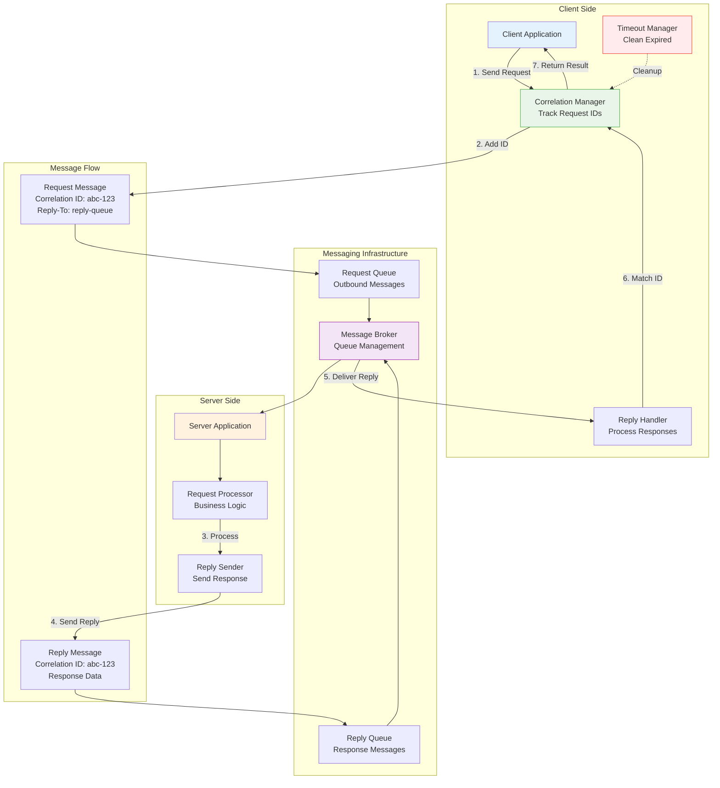

## The Complete Blueprint

Request-Reply is an asynchronous messaging pattern that provides request-response semantics over message queues, enabling temporal decoupling between clients and servers while maintaining the familiar request-response interaction model. Unlike synchronous RPC calls where clients block waiting for responses, this pattern allows clients to send requests to a queue and continue processing other work while the response arrives asynchronously on a separate reply queue. The pattern uses correlation IDs to match responses with their originating requests, enabling multiple concurrent requests without blocking threads. This approach is particularly valuable for long-running operations, systems integration where response times are unpredictable, and scenarios where clients need to remain responsive while waiting for potentially slow services. The pattern requires careful management of reply queues (temporary vs. persistent), correlation ID lifecycle, timeout handling to prevent memory leaks from abandoned requests, and error propagation mechanisms. Success depends on implementing robust correlation tracking, proper cleanup of expired correlations, and designing clients that can handle the asynchronous response flow effectively.

### What You'll Master

By implementing request-reply patterns, you'll achieve **asynchronous request-response** that provides familiar semantics without blocking threads, **temporal decoupling** where clients and servers operate independently with different availability patterns, **concurrent request handling** through correlation ID management that allows multiple outstanding requests, **resilient communication** with timeout handling and error propagation across asynchronous boundaries, and **scalable messaging** where request processing can be distributed across multiple server instances. You'll master the complexities of maintaining request-response semantics in asynchronous, distributed systems.

# Request-Reply Pattern

!!! info "🥈 Silver Tier Pattern"
**Implementation available in production systems**

## Essential Question

**How do we achieve request-response semantics over asynchronous messaging systems?**

## When to Use / When NOT to Use

### ✅ Use When

| Scenario | Example | Impact |
|----------|---------|--------|
| Long-running operations | File processing taking 5+ minutes | Frees client resources, enables parallel work |
| Legacy system integration | Mainframe communication via MQ | Bridges sync/async boundaries gracefully |
| Variable response times | Machine learning inference jobs | Handles unpredictable processing durations |
| Queue-based architectures | Order processing with confirmation | Provides response semantics over messaging |

### ❌ DON'T Use When

| Scenario | Why | Alternative |
|----------|-----|-------------|
| Simple synchronous calls | Added complexity without benefit | [gRPC](../communication/grpc.md) or REST |
| Real-time requirements | Messaging adds latency | [WebSocket](../communication/websocket.md) |
| Stateless operations | No need for response correlation | [Publish-Subscribe](../communication/publish-subscribe.md) |
| High-frequency trading | Every millisecond matters | Direct TCP connections |

### The Story

Imagine sending a letter with a pre-paid return envelope. Unlike email (immediate) or dropping a letter in a mailbox (fire-and-forget), you send your request knowing a response will come back asynchronously. You don't wait by the mailbox—you go about your business and handle the reply when it arrives.

### Core Insight

> **Key Takeaway:** Request-Reply transforms blocking synchronous calls into non-blocking asynchronous communication by using correlation IDs to match responses with requests.

### In One Sentence

Request-Reply **enables async request-response** by **using correlation IDs and reply queues** to achieve **temporal decoupling while maintaining response semantics**.

### The Problem Space

<h4>🚨 What Happens Without This Pattern</h4>

**Financial Services Company, 2021**: Trading system made synchronous calls to risk engine for each trade validation. Under peak load, 10,000 concurrent trades caused thread pool exhaustion. System froze for 3 minutes during market volatility.

**Impact**: $5M trading losses, regulatory compliance violation, client confidence damaged

#### Key Components

| Component | Purpose | Responsibility |
|-----------|---------|----------------|
| Correlation Manager | Request tracking | Generate IDs, manage timeouts, match responses |
| Reply Queue | Response delivery | Temporary queue for async responses |
| Request Handler | Server processing | Extract correlation, process, send reply |
| Timeout Manager | Cleanup | Remove expired correlations, prevent memory leaks |

### Basic Example

**Process Overview:** See production implementations for details

📄 View implementation code

import uuid
import asyncio
from dataclasses import dataclass
from typing import Dict, Optional

@dataclass
class Message:
**Implementation available in production systems**

class RequestReplyClient:
**Implementation available in production systems**

#### Critical Design Decisions

| Decision | Options | Trade-off | Recommendation |
|----------|---------|-----------|----------------|
| Correlation ID Strategy | UUID Sequential numbers | UUID: No collisions Sequential: Predictable | UUID for production systems |
| Reply Queue Management | Temporary queues Shared reply queue | Temporary: Isolation Shared: Efficiency | Temporary for security/isolation |
| Timeout Handling | Client-side only Server-side cleanup | Client: Simple Server: Robust | Both for comprehensive coverage |
| Error Propagation | Exception replies Error codes | Exception: Rich context Codes: Simple | Exception replies with structured errors |

### Decision Matrix

| Factor | Score (1-5) | Reasoning |
|--------|-------------|-----------|
| **Complexity** | 4 | Significant complexity managing correlation IDs, timeouts, reply queues, and asynchronous state |
| **Performance Impact** | 3 | Better resource utilization for long operations but adds messaging overhead and latency |
| **Operational Overhead** | 4 | Requires monitoring correlation state, managing timeouts, debugging async flows, and queue management |
| **Team Expertise Required** | 4 | Deep understanding of async programming, messaging patterns, and distributed systems timing |
| **Scalability** | 4 | Excellent for decoupling and handling variable load patterns without blocking resources |

**Overall Recommendation**: ⚠️ **USE WITH EXPERTISE** - Powerful for asynchronous processing but requires careful implementation of correlation management and timeout handling.

### Common Pitfalls

<h4>⚠️ Avoid These Mistakes</h4>

**Process Steps:**
- Initialize system
- Process requests
- Handle responses
- Manage failures

