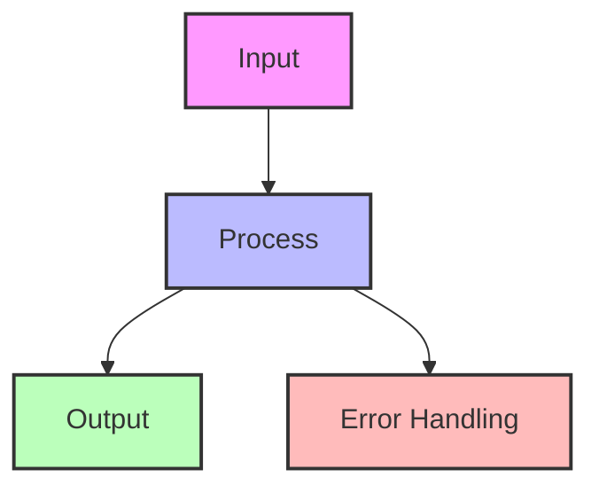
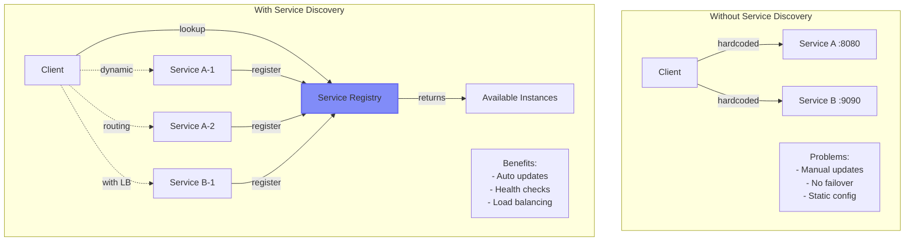
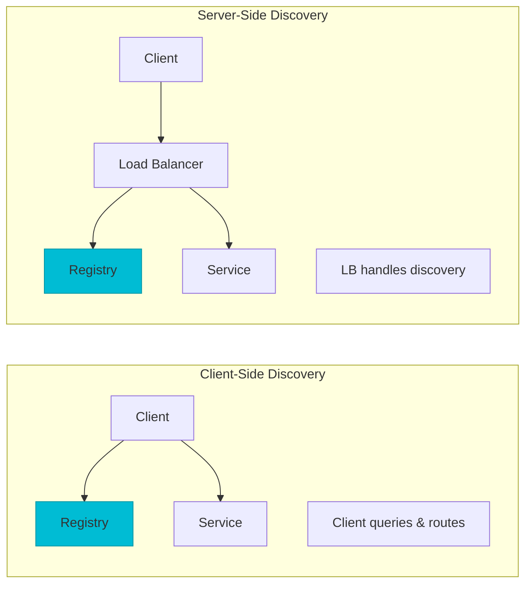

---
best-for:
- Microservices architectures
- Cloud-native applications
- Dynamic scaling environments
- Multi-region deployments
- Container orchestration
category: communication
current_relevance: mainstream
description: Dynamic service location in distributed systems
difficulty: intermediate
essential_question: How do we enable efficient communication between services using
  service discovery pattern?
excellence_tier: silver
introduced: 2024-01
pattern_status: recommended
reading-time: 20 min
tagline: Master service discovery pattern for distributed systems success
title: Service Discovery Pattern
trade-offs:
  cons:
  - Additional infrastructure complexity
  - Single point of failure risk
  - Network overhead for lookups
  - Consistency challenges
  - Cache invalidation complexity
  pros:
  - Dynamic service registration/deregistration
  - Automatic failover and load balancing
  - No hardcoded endpoints
  - Health-aware routing
  - Service metadata support
type: pattern
---


# Service Discovery Pattern

!!! info "🥈 Silver Tier Pattern"
    **Dynamic Service Location** • Netflix Eureka, Consul, etcd proven
    
    Essential for microservices at scale. Service discovery enables services to find and communicate with each other dynamically, eliminating hardcoded endpoints and enabling elastic scaling.
    
    **Key Success Metrics:**
    - Netflix: 100k+ service instances discovered
    - Uber: 5000+ services registered
    - Kubernetes: De facto standard for containers

## Essential Question
**How do services find each other in a dynamic environment where instances come and go?**

## When to Use / When NOT to Use

### ✅ Use When
| Scenario | Why | Example |
|----------|-----|---------|
| **Dynamic scaling** | Instances change frequently | Auto-scaling groups |
| **Microservices** | Many services to coordinate | Netflix architecture |
| **Multi-environment** | Dev/staging/prod configs | Kubernetes namespaces |
| **Health-based routing** | Skip unhealthy instances | Circuit breaker integration |

### ❌ DON'T Use When
| Scenario | Why | Alternative |
|----------|-----|-------------|
| **Static infrastructure** | Endpoints don't change | Configuration files |
| **< 5 services** | Overhead not justified | Direct connection |
| **Monolithic apps** | Single deployment | Load balancer |
| **Latency critical** | Lookup adds delay | Client-side caching |

## Level 1: Intuition (5 min)

### The Phone Directory Analogy
Service discovery is like a dynamic phone directory. Instead of memorizing everyone's phone number (IP addresses), you look them up by name when needed. As people change numbers (instances scale), the directory updates automatically.

### Visual Architecture



<details>
<summary>View implementation code</summary>



</details>

### Core Value
| Aspect | Hardcoded | Service Discovery |
|--------|-----------|-------------------|
| **Flexibility** | Change requires redeploy | Dynamic updates |
| **Scaling** | Manual config updates | Automatic registration |
| **Failover** | No built-in support | Health-based routing |
| **Configuration** | Per-environment files | Centralized registry |

## Level 2: Foundation (10 min)

### Architecture Patterns



### Implementation Approaches

| Pattern | Description | Trade-offs |
|---------|-------------|------------|
| **Client-Side** | Clients query registry directly | More client logic, less hops |
| **Server-Side** | Load balancer queries registry | Simple clients, extra hop |
| **DNS-Based** | DNS as service registry | Standard protocol, limited metadata |
| **Platform-Native** | K8s Services, AWS ELB | Tight coupling, less flexibility |

### Basic Implementation


<details>
<summary>View implementation code</summary>

```python
class ServiceRegistry:
    def __init__(self):
        self.services = {}  # name -> [instances]
        self.health_checks = {}
    
    def register(self, name, host, port, metadata=None):
        """Register service instance"""
        instance = {
            'id': f"{name}-{host}:{port}",
            'host': host,
            'port': port,
            'metadata': metadata or {},
            'registered_at': time.time(),
            'last_heartbeat': time.time()
        }
        
        if name not in self.services:
            self.services[name] = []
        self.services[name].append(instance)
        
        return instance['id']
    
    def discover(self, name):
        """Get healthy instances of service"""
        if name not in self.services:
            return []
        
        # Filter healthy instances
        healthy = []
        for instance in self.services[name]:
            if self._is_healthy(instance):
                healthy.append(instance)
        
        return healthy
    
    def _is_healthy(self, instance):
        # Check heartbeat recency
        return time.time() - instance['last_heartbeat'] < 30
```

</details>

## Level 3: Deep Dive (15 min)

### Decision Matrix

```mermaid
graph TD
    Start[Need Service Discovery?] --> Q1{Services<br/>Scale?}
    Q1 -->|Static| Config[Use Config Files]
    Q1 -->|Dynamic| Q2{Deployment<br/>Platform?}
    
    Q2 -->|Kubernetes| K8s[Use K8s Services]
    Q2 -->|Cloud| Q3{Multi-Region?}
    Q2 -->|On-Prem| Consul[Use Consul/etcd]
    
    Q3 -->|Yes| GlobalSD[Global Service Discovery<br/>(Route53, Global LB)]
    Q3 -->|No| CloudSD[Cloud Service Discovery<br/>(ECS, Cloud Map)]
    
    style K8s fill:#4ade80,stroke:#16a34a
    style Consul fill:#4ade80,stroke:#16a34a
    style CloudSD fill:#4ade80,stroke:#16a34a
```

### Advanced Features


<details>
<summary>View implementation code</summary>

```python
class AdvancedServiceDiscovery:
    def __init__(self):
        self.registry = ServiceRegistry()
        self.watchers = {}  # service -> [callbacks]
    
    def register_with_health_check(self, service, endpoint):
        """Register with health endpoint"""
        instance_id = self.registry.register(
            service['name'],
            service['host'],
            service['port'],
            {'health_endpoint': endpoint}
        )
        
        # Start health checking
        asyncio.create_task(
            self._health_check_loop(instance_id)
        )
        
        return instance_id
    
    def discover_with_criteria(self, name, criteria):
        """Discover with filtering"""
        instances = self.registry.discover(name)
        
        # Apply criteria filters
        filtered = []
        for inst in instances:
            if self._matches_criteria(inst, criteria):
                filtered.append(inst)
        
        return filtered
    
    def watch(self, service, callback):
        """Watch for service changes"""
        if service not in self.watchers:
            self.watchers[service] = []
        self.watchers[service].append(callback)
        
        # Start watching
        asyncio.create_task(
            self._watch_loop(service)
        )
```

</details>

### Common Pitfalls

| Pitfall | Impact | Solution |
|---------|--------|----------|
| **Stale cache** | Routing to dead instances | TTL + health checks |
| **Thundering herd** | Registry overload | Jittered polling |
| **Split brain** | Inconsistent views | Consensus protocols |
| **DNS caching** | Slow failover | Short TTLs |

## Level 4: Expert (20 min)

### Production Patterns


<details>
<summary>View implementation code</summary>

```yaml
# Consul service definition
services:
  - name: payment-service
    port: 8080
    tags:
      - primary
      - v2.1.0
    check:
      http: http://localhost:8080/health
      interval: 10s
      timeout: 5s
      deregister_critical_service_after: 30s
    
    # Advanced health criteria
    checks:
      - name: deep_health
        http: http://localhost:8080/health/deep
        interval: 30s
      - name: dependencies
        script: /opt/check-deps.sh
        interval: 60s
```

</details>

### Multi-Region Discovery


<details>
<summary>View implementation code</summary>

```python
class GlobalServiceDiscovery:
    def __init__(self, regions):
        self.regions = regions
        self.local_region = self._detect_region()
    
    def discover_global(self, service, strategy='nearest'):
        """Discover across regions"""
        all_instances = []
        
        # Gather from all regions
        for region in self.regions:
            instances = self._discover_region(
                service, region
            )
            for inst in instances:
                inst['region'] = region
                inst['latency'] = self._measure_latency(
                    region
                )
            all_instances.extend(instances)
        
        # Apply strategy
        if strategy == 'nearest':
            return sorted(
                all_instances, 
                key=lambda x: x['latency']
            )
        elif strategy == 'round_robin':
            return self._round_robin_regions(
                all_instances
            )
```

</details>

### Integration Patterns

| Integration | Purpose | Implementation |
|-------------|---------|----------------|
| **Circuit Breaker** | Fail fast on unhealthy | Track success rates |
| **Load Balancer** | Distribute requests | Weighted round-robin |
| **Service Mesh** | Advanced routing | Envoy integration |
| **Tracing** | Request flow | Correlation IDs |

## Level 5: Mastery (30 min)

### Case Study: Netflix Eureka

!!! info "🏢 Real-World Implementation"
    **Scale**: 100k+ instances, 800+ services
    **Challenge**: AWS doesn't provide mid-tier load balancing
    **Solution**: Client-side discovery with Eureka
    
    **Architecture**:
    - Regional Eureka clusters
    - 30-second heartbeats
    - Client-side caching
    - Zone-aware routing
    
    **Results**:
    - < 1s discovery time
    - 99.99% registry availability
    - Seamless auto-scaling
    - Cross-region failover

### Performance Optimization


<details>
<summary>View implementation code</summary>

```python
class OptimizedDiscoveryClient:
    def __init__(self, registry_url):
        self.registry_url = registry_url
        self.cache = {}
        self.cache_ttl = 30
        self.prefetch_services = set()
        
        # Start background refresh
        asyncio.create_task(self._refresh_loop())
    
    async def discover_fast(self, service):
        """Optimized discovery with caching"""
        # Try cache first
        if service in self.cache:
            entry = self.cache[service]
            if time.time() - entry['updated'] < self.cache_ttl:
                return entry['instances']
        
        # Cache miss - fetch async
        instances = await self._fetch_instances(service)
        
        # Update cache
        self.cache[service] = {
            'instances': instances,
            'updated': time.time()
        }
        
        # Add to prefetch if frequently used
        self._track_usage(service)
        
        return instances
    
    async def _refresh_loop(self):
        """Proactive cache refresh"""
        while True:
            for service in self.prefetch_services:
                try:
                    await self.discover_fast(service)
                except Exception as e:
                    logger.error(f"Refresh failed: {e}")
            
            await asyncio.sleep(self.cache_ttl / 2)
```

</details>

## Quick Reference

### Production Checklist ✓
- [ ] **Registration**
  - [ ] Unique instance IDs
  - [ ] Metadata for routing
  - [ ] Graceful deregistration
  - [ ] Heartbeat mechanism
  
- [ ] **Discovery**
  - [ ] Client-side caching
  - [ ] Fallback mechanisms
  - [ ] Load balancing strategy
  - [ ] Health filtering
  
- [ ] **Reliability**
  - [ ] Registry high availability
  - [ ] Network partition handling
  - [ ] Consistent health checks
  - [ ] Monitoring/alerting
  
- [ ] **Performance**
  - [ ] Connection pooling
  - [ ] Batch operations
  - [ ] Async discovery
  - [ ] Regional awareness

### Common Configurations


<details>
<summary>View implementation code</summary>

```yaml
# Kubernetes Service
apiVersion: v1
kind: Service
metadata:
  name: payment-service
  annotations:
    service.beta.kubernetes.io/aws-load-balancer-type: "nlb"
spec:
  selector:
    app: payment
  ports:
    - port: 80
      targetPort: 8080
  type: LoadBalancer

---
# Consul Connect
Kind = "service-defaults"
Name = "payment-service"
Protocol = "http"
MeshGateway = {
  Mode = "local"
}
HealthCheck = {
  Interval = "10s"
  Timeout = "5s"
}
```

</details>

## Related Patterns

- **[Service Mesh](service-mesh.md)** - Advanced service discovery with traffic management
- **[Load Balancing](../scaling/load-balancing.md)** - Distribute discovered instances
- **[Circuit Breaker](../resilience/circuit-breaker.md)** - Handle discovery failures
- **[Health Check](../observability/health-check.md)** - Determine instance availability
- **[API Gateway](api-gateway.md)** - Centralized service discovery
- **[Configuration Management](../architecture/configuration-management.md)** - Dynamic configuration

## References

- [Netflix Eureka](https://github.com/Netflix/eureka/wiki)
- [Consul by HashiCorp](https://www.consul.io/)
- [Kubernetes Service Discovery](https://kubernetes.io/docs/concepts/services-networking/service/)
- [AWS Cloud Map](https://aws.amazon.com/cloud-map/)

---

**Previous**: [Publish-Subscribe Pattern](publish-subscribe.md) | **Next**: [WebSocket Pattern](websocket.md)