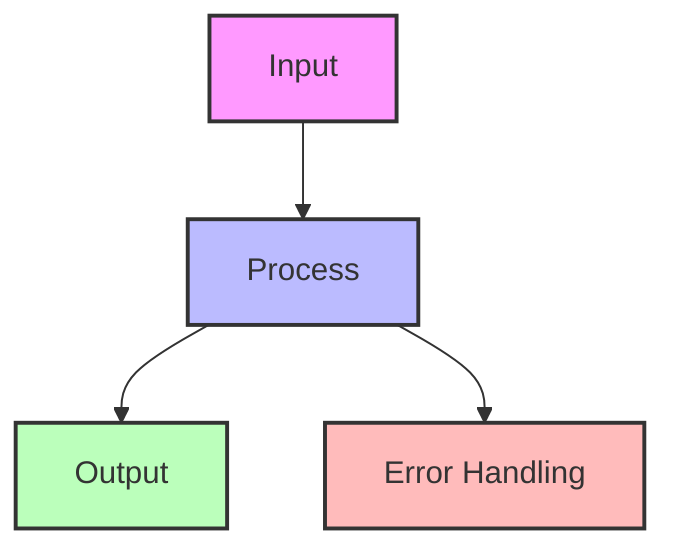

---
best-for:
- Microservices architectures
- Cloud-native applications
- Dynamic scaling environments
- Multi-region deployments
- Container orchestration
category: communication
current_relevance: mainstream
description: Dynamic service location in distributed systems
difficulty: intermediate
essential_question: How do we enable efficient communication between services using
  service discovery pattern?
excellence_tier: silver
introduced: 2024-01
pattern_status: recommended
reading-time: 20 min
tagline: Master service discovery pattern for distributed systems success
title: Service Discovery Pattern
trade-offs:
  cons:
  - Additional infrastructure complexity
  - Single point of failure risk
  - Network overhead for lookups
  - Consistency challenges
  - Cache invalidation complexity
  pros:
  - Dynamic service registration/deregistration
  - Automatic failover and load balancing
  - No hardcoded endpoints
  - Health-aware routing
  - Service metadata support
type: pattern
---

# Service Discovery Pattern

!!! info "🥈 Silver Tier Pattern"
    **Dynamic Service Location** • Netflix Eureka, Consul, etcd proven
    
    Essential for microservices at scale. Service discovery enables services to find and communicate with each other dynamically, eliminating hardcoded endpoints and enabling elastic scaling.
    
    **Key Success Metrics:**
    - Netflix: 100k+ service instances discovered
    - Uber: 5000+ services registered
    - Kubernetes: De facto standard for containers

## Essential Question
**How do services find each other in a dynamic environment where instances come and go?**

## When to Use / When NOT to Use

### ✅ Use When
| Scenario | Why | Example |
|----------|-----|---------|
| **Dynamic scaling** | Instances change frequently | Auto-scaling groups |
| **Microservices** | Many services to coordinate | Netflix architecture |
| **Multi-environment** | Dev/staging/prod configs | Kubernetes namespaces |
| **Health-based routing** | Skip unhealthy instances | Circuit breaker integration |

### ❌ DON'T Use When
| Scenario | Why | Alternative |
|----------|-----|-------------|
| **Static infrastructure** | Endpoints don't change | Configuration files |
| **< 5 services** | Overhead not justified | Direct connection |
| **Monolithic apps** | Single deployment | Load balancer |
| **Latency critical** | Lookup adds delay | Client-side caching |

## Level 1: Intuition (5 min)

### The Phone Directory Analogy
Service discovery is like a dynamic phone directory. Instead of memorizing everyone's phone number (IP addresses), you look them up by name when needed. As people change numbers (instances scale), the directory updates automatically.

### Visual Architecture

### Core Value
| Aspect | Hardcoded | Service Discovery |
|--------|-----------|-------------------|
| **Flexibility** | Change requires redeploy | Dynamic updates |
| **Scaling** | Manual config updates | Automatic registration |
| **Failover** | No built-in support | Health-based routing |
| **Configuration** | Per-environment files | Centralized registry |

## Level 2: Foundation (10 min)

### Architecture Patterns

### Implementation Approaches

| Pattern | Description | Trade-offs |
|---------|-------------|------------|
| **Client-Side** | Clients query registry directly | More client logic, less hops |
| **Server-Side** | Load balancer queries registry | Simple clients, extra hop |
| **DNS-Based** | DNS as service registry | Standard protocol, limited metadata |
| **Platform-Native** | K8s Services, AWS ELB | Tight coupling, less flexibility |

### Basic Implementation

### Decision Matrix

| Factor | Score (1-5) | Reasoning |
|--------|-------------|-----------|
| **Complexity** | 3 | Moderate complexity with service registration, health checks, and client integration |
| **Performance Impact** | 4 | Eliminates hardcoded endpoints and enables health-aware routing with minor lookup overhead |
| **Operational Overhead** | 3 | Requires registry maintenance, monitoring service health, and managing discovery infrastructure |
| **Team Expertise Required** | 3 | Understanding of service registration patterns, health checks, and distributed systems networking |
| **Scalability** | 4 | Excellent scalability enabling dynamic service scaling and load distribution |

**Overall Recommendation**: ✅ **RECOMMENDED** - Essential for microservices architectures, providing dynamic service location with proven patterns.

### Multi-Region Discovery

## Related Patterns

- **[Service Mesh](service-mesh.md)** - Advanced service discovery with traffic management
- **[Load Balancing](../scaling/load-balancing.md)** - Distribute discovered instances
- **[Circuit Breaker](../resilience/circuit-breaker.md)** - Handle discovery failures
- **[Health Check](../observability/health-check.md)** - Determine instance availability
- **[API Gateway](api-gateway.md)** - Centralized service discovery
- **[Configuration Management](../architecture/configuration-management.md)** - Dynamic configuration

## References

- [Netflix Eureka](https://github.com/Netflix/eureka/wiki)
- [Consul by HashiCorp](https://www.consul.io/)
- [Kubernetes Service Discovery](https://kubernetes.io/docs/concepts/services-networking/service/)
- [AWS Cloud Map](https://aws.amazon.com/cloud-map/)

---

**Previous**: [Publish-Subscribe Pattern](publish-subscribe.md) | **Next**: [WebSocket Pattern](websocket.md)

