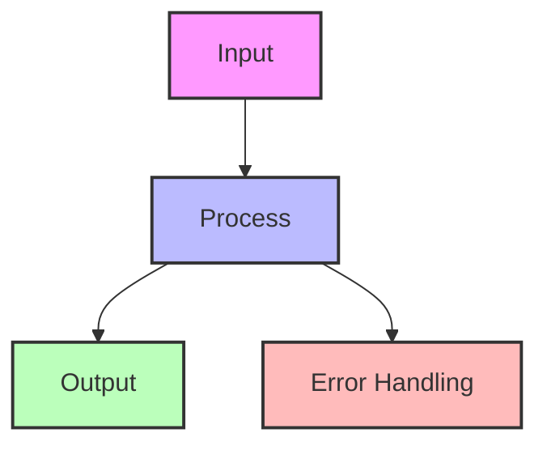
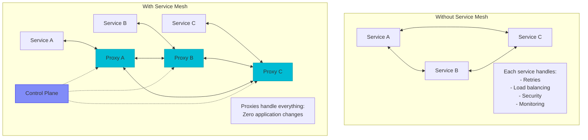
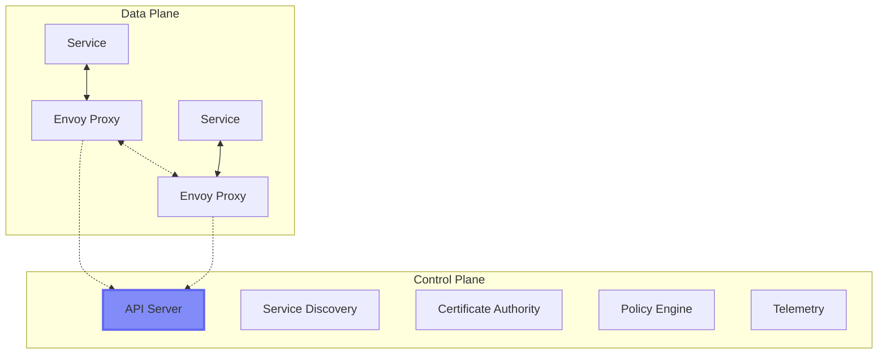
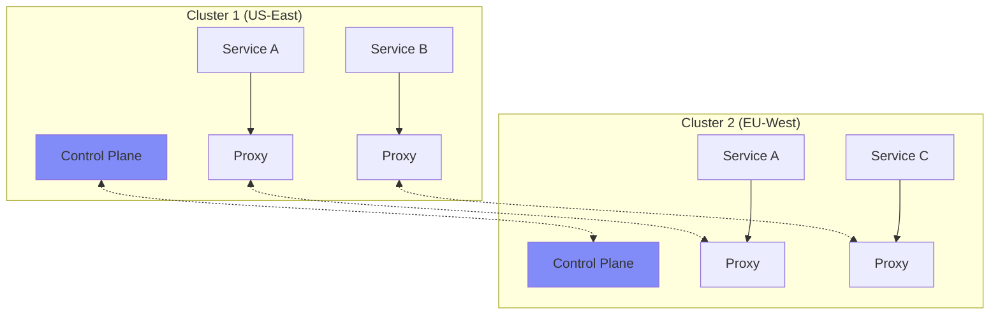

---
best-for:
- Large microservice deployments (>20 services)
- Multi-team organizations needing consistency
- Zero-trust security requirements
- Complex traffic patterns (A/B, canary)
- Regulatory compliance needs
category: communication
current_relevance: mainstream
description: Infrastructure layer providing service-to-service communication, security,
  and observability
essential_question: How do we enable efficient communication between services using
  service mesh?
excellence_tier: silver
introduced: 2024-01
pattern_status: recommended
tagline: Master service mesh for distributed systems success
title: Service Mesh
trade-offs:
  cons:
  - Operational complexity to manage
  - Performance overhead (~1-2ms latency)
  - Resource consumption (sidecars)
  - Learning curve for teams
  - Debugging complexity with proxies
  pros:
  - Centralized control of service communication
  - Automatic mTLS and security policies
  - Built-in observability (traces, metrics, logs)
  - Traffic management capabilities
  - Consistent policies across services
---


# Service Mesh

!!! info "🥈 Silver Tier Pattern"
    **Microservices Infrastructure Standard** • Netflix, Uber, Twitter production proven
    
    Service mesh has become the de facto standard for managing microservice communication at scale. It provides essential features like mTLS, observability, and traffic management out of the box.
    
    **Key Success Metrics:**
    - Netflix: 1000+ services unified
    - Uber: 3000+ services managed
    - Twitter: Global scale deployment

## Essential Question
**How do we manage service-to-service communication without touching application code?**

## When to Use / When NOT to Use

### ✅ Use When
| Scenario | Why | Example |
|----------|-----|---------|
| **20+ microservices** | Management complexity | Uber (3000+ services) |
| **Multi-team organization** | Consistent policies | Netflix teams |
| **Zero-trust security** | Automatic mTLS | Financial services |
| **Complex traffic patterns** | A/B testing, canary | E-commerce |

### ❌ DON'T Use When  
| Scenario | Why | Alternative |
|----------|-----|-------------|
| **< 10 services** | Overkill complexity | Client libraries |
| **Monolithic architecture** | No service communication | Not needed |
| **Ultra-low latency** | Proxy adds 1-2ms | Direct communication |
| **Limited expertise** | Operational burden | Cloud load balancers |

## Level 1: Intuition (5 min)

### The Phone Network Analogy
Service mesh is like a modern phone network. You don't build telephone infrastructure into every phone - you use the network's built-in features (routing, quality, security). Similarly, service mesh provides networking features without modifying your services.

### Visual Architecture



<details>
<summary>View implementation code</summary>



</details>

### Core Value
| Aspect | Without Mesh | With Mesh |
|--------|--------------|-----------|  
| **Retry logic** | In every service | In proxy config |
| **Security (mTLS)** | Complex setup | Automatic |
| **Observability** | Code instrumentation | Built-in |
| **Traffic control** | Custom code | Policy files |
| **Updates** | Redeploy services | Update config |

## Level 2: Foundation (10 min)

### Architecture Components



### Key Features Matrix

| Feature | Implementation | Benefit |
|---------|----------------|---------|
| **Traffic Management** | Load balancing, retry, timeout | Reliability |
| **Security** | mTLS, RBAC, encryption | Zero-trust |
| **Observability** | Metrics, traces, logs | Visibility |
| **Policy** | Rate limiting, access control | Governance |

### Basic Configuration


<details>
<summary>View implementation code</summary>

```yaml
# Service mesh traffic policy
apiVersion: networking.istio.io/v1beta1
kind: VirtualService
metadata:
  name: productpage
spec:
  http:
  - match:
    - headers:
        version:
          exact: v2
    route:
    - destination:
        host: productpage
        subset: v2
      weight: 100
  - route:
    - destination:
        host: productpage
        subset: v1
      weight: 90
    - destination:
        host: productpage
        subset: v2
      weight: 10  # 10% canary
```

</details>

## Level 3: Deep Dive (15 min)

### Traffic Management Patterns

```mermaid
graph LR
    subgraph "Load Balancing"
        LB[Proxy] --> S1[Instance 1]
        LB --> S2[Instance 2]
        LB --> S3[Instance 3]
    end
    
    subgraph "Circuit Breaking"
        CB[Proxy] --> H1[Healthy]
        CB -.x.-> U1[Unhealthy]
        CB --> H2[Healthy]
    end
    
    subgraph "Retry Logic"
        R[Proxy] -->|Attempt 1| F1[Failed]
        R -->|Attempt 2| F2[Failed]
        R -->|Attempt 3| S[Success]
    end
```

### Security Implementation


<details>
<summary>View implementation code</summary>

```python
# Automatic mTLS configuration
class ServiceMeshSecurity:
    def configure_mtls(self, namespace):
        return {
            "apiVersion": "security.istio.io/v1beta1",
            "kind": "PeerAuthentication",
            "metadata": {"name": "default", "namespace": namespace},
            "spec": {"mtls": {"mode": "STRICT"}}
        }
    
    def configure_authorization(self, service, allowed_clients):
        return {
            "apiVersion": "security.istio.io/v1beta1",
            "kind": "AuthorizationPolicy",
            "metadata": {"name": f"{service}-authz"},
            "spec": {
                "selector": {"matchLabels": {"app": service}},
                "rules": [{
                    "from": [{"source": {"principals": allowed_clients}}],
                    "to": [{"operation": {"methods": ["GET", "POST"]}}]
                }]
            }
        }
```

</details>

### Observability Stack

| Layer | Tools | Metrics |
|-------|-------|---------|
| **Metrics** | Prometheus | Request rate, error rate, latency |
| **Tracing** | Jaeger/Zipkin | Request flow, bottlenecks |
| **Logs** | Fluentd/ELK | Application logs, access logs |
| **Dashboards** | Grafana/Kiali | Visual topology, health |

## Level 4: Expert (20 min)

### Advanced Traffic Management


<details>
<summary>View implementation code</summary>

```yaml
# Sophisticated canary deployment
apiVersion: networking.istio.io/v1beta1
kind: VirtualService
metadata:
  name: reviews
spec:
  http:
  - match:
    - headers:
        user-agent:
          regex: ".*Chrome.*"
    route:
    - destination:
        host: reviews
        subset: v3  # Chrome users get v3
  - match:
    - headers:
        cookie:
          regex: "^(.*?;)?(canary=true)(;.*)?$"
    route:
    - destination:
        host: reviews
        subset: v2  # Canary testers
  - route:
    - destination:
        host: reviews
        subset: v1
      weight: 95
    - destination:
        host: reviews
        subset: v2
      weight: 5  # 5% random canary
```

</details>

### Multi-Cluster Mesh



### Performance Optimization

| Technique | Impact | Configuration |
|-----------|--------|---------------|
| **Connection Pooling** | -30% latency | `connectionPool.http.http2MaxRequests` |
| **Circuit Breaking** | Prevent cascades | `outlierDetection.consecutiveErrors` |
| **Retry Budgets** | Controlled retries | `retry.perTryTimeout` |
| **Load Balancing** | Even distribution | `consistentHash.httpCookie` |

## Level 5: Mastery (30 min)

### Case Study: Uber's Service Mesh Journey

!!! info "🏢 Real-World Implementation"
    **Scale**: 3000+ microservices, 4000+ engineers
    **Challenge**: Consistent networking across polyglot services
    **Solution**: Custom service mesh built on Envoy
    
    **Implementation Timeline**:
    - Month 1-2: Pilot with 10 services
    - Month 3-4: Critical path services
    - Month 5-8: 50% adoption
    - Month 9-12: Full rollout
    
    **Results**:
    - 99.99% availability (up from 99.9%)
    - 60% reduction in networking code
    - 90% faster incident resolution
    - Zero-downtime deployments standard

### Production Patterns


<details>
<summary>View implementation code</summary>

```python
# Health-aware load balancing
class MeshLoadBalancer:
    def configure_health_checking(self):
        return {
            "healthChecks": [{
                "timeout": "3s",
                "interval": "5s",
                "unhealthyThreshold": 2,
                "healthyThreshold": 1,
                "path": "/health",
                "httpHeaders": [{"name": "x-health-check", "value": "mesh"}]
            }]
        }
    
    def configure_outlier_detection(self):
        return {
            "consecutiveErrors": 5,
            "interval": "30s",
            "baseEjectionTime": "30s",
            "maxEjectionPercent": 50,
            "minHealthPercent": 30
        }
```

</details>

### Decision Matrix

```mermaid
graph TD
    Start[Evaluating Service Mesh?] --> Size{Service<br/>Count?}
    Size -->|< 10| No[Skip mesh:<br/>Use libraries]
    Size -->|10-50| Maybe{Traffic<br/>Patterns?}
    Size -->|> 50| Yes[Adopt mesh]
    
    Maybe -->|Simple| APIGw[API Gateway<br/>sufficient]
    Maybe -->|Complex| YesMesh[Consider mesh]
    
    YesMesh --> Team{Team<br/>Expertise?}
    Team -->|Low| Managed[Managed mesh<br/>(AWS App Mesh)]
    Team -->|High| Self[Self-managed<br/>(Istio/Linkerd)]
    
    style Yes fill:#4ade80
    style YesMesh fill:#4ade80
    style No fill:#f87171
```

## Quick Reference

### Production Checklist ✓
- [ ] **Planning**
  - [ ] Service inventory and dependencies mapped
  - [ ] Team training completed
  - [ ] Rollback strategy defined
  
- [ ] **Implementation**
  - [ ] Start with observability (metrics/traces)
  - [ ] Enable mTLS gradually
  - [ ] Add traffic management policies
  - [ ] Configure circuit breakers
  
- [ ] **Operations**
  - [ ] Monitoring dashboards configured
  - [ ] Runbooks for common issues
  - [ ] Backup control plane data
  - [ ] Capacity planning for proxies

### Common Pitfalls
1. **Starting too big** - Begin with non-critical services
2. **Ignoring overhead** - Each proxy uses ~50MB RAM
3. **Over-engineering** - Start simple, add features gradually
4. **Poor observability** - Set up monitoring first

### Performance Impact
```
Latency overhead: 0.5-2ms per hop
Memory per proxy: 50-100MB
CPU per proxy: 0.1-0.5 cores
Network overhead: 5-10% (mTLS + headers)
```

## Related Patterns

- **[API Gateway](api-gateway.md)** - North-south traffic complement
- **[Circuit Breaker](../resilience/circuit-breaker.md)** - Built-in resilience
- **[Service Discovery](service-discovery.md)** - Automatic registration
- **[Distributed Tracing](../observability/distributed-tracing.md)** - Request flow visibility
- **[Zero Trust Networking](../security/zero-trust.md)** - Security foundation

## References

- [Istio Documentation](https://istio.io/latest/docs/)
- [Linkerd Documentation](https://linkerd.io/2/overview/)
- [Envoy Proxy](https://www.envoyproxy.io/)
- [CNCF Service Mesh Landscape](https://landscape.cncf.io/card-mode?category=service-mesh)

---

**Previous**: [API Gateway Pattern](api-gateway.md) | **Next**: [Publish-Subscribe Pattern](publish-subscribe.md)