## The Complete Blueprint

Service Mesh is the infrastructure abstraction pattern that transforms microservice communication from a complex, code-heavy burden into a declarative, policy-driven foundation for distributed systems. At its architectural core, a service mesh consists of a data plane of lightweight network proxies (sidecars) deployed alongside each service instance, and a control plane that manages configuration, security policies, and traffic routing rules across the entire mesh. The pattern's revolutionary insight is complete separation of concerns: application developers focus purely on business logic while the mesh handles all networking complexity including service discovery, load balancing, retries, timeouts, circuit breaking, and mutual TLS encryption. The control plane acts as the central nervous system, pushing configurations to thousands of sidecar proxies and collecting telemetry data that provides unprecedented visibility into service-to-service communication patterns, performance metrics, and security posture. This approach has proven essential for organizations operating at scale, enabling Netflix to manage 1000+ services, Uber to coordinate 3000+ services, and countless enterprises to achieve zero-trust security, advanced traffic management, and comprehensive observability without modifying a single line of application code.

```mermaid
flowchart TB
    subgraph "Control Plane"
        CP1["🧠 Pilot<br/>(Configuration)"]
        CP2["🔒 Citadel<br/>(Certificate Authority)"]
        CP3["📊 Galley<br/>(Config Validation)"]
        CP4["📊 Telemetry<br/>(Metrics Collection)"]
    end
    
    subgraph "Data Plane - Service A"
        SA["⚙️ Service A<br/>(Business Logic)"]
        PA["🛑 Envoy Proxy<br/>(Sidecar)"]
    end
    
    subgraph "Data Plane - Service B" 
        SB["⚙️ Service B<br/>(Business Logic)"]
        PB["🛑 Envoy Proxy<br/>(Sidecar)"]
    end
    
    subgraph "Data Plane - Service C"
        SC["⚙️ Service C<br/>(Business Logic)"]
        PC["🛑 Envoy Proxy<br/>(Sidecar)"]
    end
    
    subgraph "Cross-Cutting Capabilities"
        CC1["🔐 mTLS Encryption"]
        CC2["📊 Traffic Management"]
        CC3["🔍 Observability"]
        CC4["🛡️ Security Policies"]
    end
    
    CP1 -.-> PA & PB & PC
    CP2 -.-> PA & PB & PC
    CP3 -.-> PA & PB & PC
    CP4 -.-> PA & PB & PC
    
    SA <--> PA
    SB <--> PB 
    SC <--> PC
    
    PA <--"🔐 mTLS"--> PB
    PB <--"🔐 mTLS"--> PC
    PC <--"🔐 mTLS"--> PA
    
    PA & PB & PC --> CC1 & CC2 & CC3 & CC4
    
    style CP1 fill:#4ecdc4,stroke:#45a29e
    style CP2 fill:#ff6b6b,stroke:#e55353
    style SA fill:#51cf66,stroke:#37b24d
    style PA fill:#ffd43b,stroke:#fab005
```

### What You'll Master

- **Sidecar Architecture Design**: Deploy and manage lightweight proxy sidecars that handle all network communication without application code changes
- **Control Plane Operations**: Configure and operate the centralized control plane for policy distribution, certificate management, and configuration validation
- **Zero-Trust Security Implementation**: Implement automatic mutual TLS, identity-based access control, and encryption-in-transit across all services
- **Advanced Traffic Management**: Deploy sophisticated routing rules, A/B testing, canary deployments, and failure injection using declarative policies
- **Comprehensive Observability**: Leverage built-in metrics, distributed tracing, and access logs for complete visibility into service interactions
- **Multi-Cluster Orchestration**: Design and manage service meshes spanning multiple Kubernetes clusters and cloud regions for global applications

# Service Mesh

!!! info "🥈 Silver Tier Pattern"
    **Microservices Infrastructure Standard** • Netflix, Uber, Twitter production proven
    
    Service mesh has become the de facto standard for managing microservice communication at scale. It provides essential features like mTLS, observability, and traffic management out of the box.
    
    **Key Success Metrics:**
    - Netflix: 1000+ services unified
    - Uber: 3000+ services managed
    - Twitter: Global scale deployment

## Essential Question
**How do we manage service-to-service communication without touching application code?**

## When to Use / When NOT to Use

### ✅ Use When
| Scenario | Why | Example |
|----------|-----|---------|
| **20+ microservices** | Management complexity | Uber (3000+ services) |
| **Multi-team organization** | Consistent policies | Netflix teams |
| **Zero-trust security** | Automatic mTLS | Financial services |
| **Complex traffic patterns** | A/B testing, canary | E-commerce |

### ❌ DON'T Use When  
| Scenario | Why | Alternative |
|----------|-----|-------------|
| **< 10 services** | Overkill complexity | Client libraries |
| **Monolithic architecture** | No service communication | Not needed |
| **Ultra-low latency** | Proxy adds 1-2ms | Direct communication |
| **Limited expertise** | Operational burden | Cloud load balancers |

### The Phone Network Analogy
Service mesh is like a modern phone network. You don't build telephone infrastructure into every phone - you use the network's built-in features (routing, quality, security). Similarly, service mesh provides networking features without modifying your services.

### Visual Architecture

### Core Value
| Aspect | Without Mesh | With Mesh |
|--------|--------------|-----------|  
| **Retry logic** | In every service | In proxy config |
| **Security (mTLS)** | Complex setup | Automatic |
| **Observability** | Code instrumentation | Built-in |
| **Traffic control** | Custom code | Policy files |
| **Updates** | Redeploy services | Update config |

### Key Features Matrix

| Feature | Implementation | Benefit |
|---------|----------------|---------|
| **Traffic Management** | Load balancing, retry, timeout | Reliability |
| **Security** | mTLS, RBAC, encryption | Zero-trust |
| **Observability** | Metrics, traces, logs | Visibility |
| **Policy** | Rate limiting, access control | Governance |

### Basic Configuration
**System Flow:** Input → Processing → Output

### Security Implementation

**System Flow:** Input → Processing → Output

### Performance Optimization

| Technique | Impact | Configuration |
|-----------|--------|---------------|
| **Connection Pooling** | -30% latency | `connectionPool.http.http2MaxRequests` |
| **Circuit Breaking** | Prevent cascades | `outlierDetection.consecutiveErrors` |
| **Retry Budgets** | Controlled retries | `retry.perTryTimeout` |
| **Load Balancing** | Even distribution | `consistentHash.httpCookie` |

### Case Study: Uber's Service Mesh Journey

!!! info "🏢 Real-World Implementation"
    **Scale**: 3000+ microservices, 4000+ engineers
    **Challenge**: Consistent networking across polyglot services
    **Solution**: Custom service mesh built on Envoy
    
    **Implementation Timeline**:
    - Month 1-2: Pilot with 10 services
    - Month 3-4: Critical path services
    - Month 5-8: 50% adoption
    - Month 9-12: Full rollout
    
    **Results**:
    - 99.99% availability (up from 99.9%)
    - 60% reduction in networking code
    - 90% faster incident resolution
    - Zero-downtime deployments standard

### Production Patterns

**System Flow:** Input → Processing → Output

View implementation code

**Process Overview:** See production implementations for details

📄 View implementation code

## Health-aware load balancing
class MeshLoadBalancer:
    def configure_health_checking(self):
        return {
            "healthChecks": [{
                "timeout": "3s",
                "interval": "5s",
                "unhealthyThreshold": 2,
                "healthyThreshold": 1,
                "path": "/health",
                "httpHeaders": [{"name": "x-health-check", "value": "mesh"}]
            }]
        }
    
    def configure_outlier_detection(self):
        return {
            "consecutiveErrors": 5,
            "interval": "30s",
            "baseEjectionTime": "30s",
            "maxEjectionPercent": 50,
            "minHealthPercent": 30
        }

### Decision Matrix

## Quick Reference

### Production Checklist ✓
- [ ] **Planning**
  - [ ] Service inventory and dependencies mapped
  - [ ] Team training completed
  - [ ] Rollback strategy defined
  
- [ ] **Implementation**
  - [ ] Start with observability (metrics/traces)
  - [ ] Enable mTLS gradually
  - [ ] Add traffic management policies
  - [ ] Configure circuit breakers
  
- [ ] **Operations**
  - [ ] Monitoring dashboards configured
  - [ ] Runbooks for common issues
  - [ ] Backup control plane data
  - [ ] Capacity planning for proxies

### Common Pitfalls
**Process Steps:**
- Initialize system
- Process requests
- Handle responses
- Manage failures
## Related Laws

- [Law: Cognitive Load](../../core-principles/laws/cognitive-load.md)

