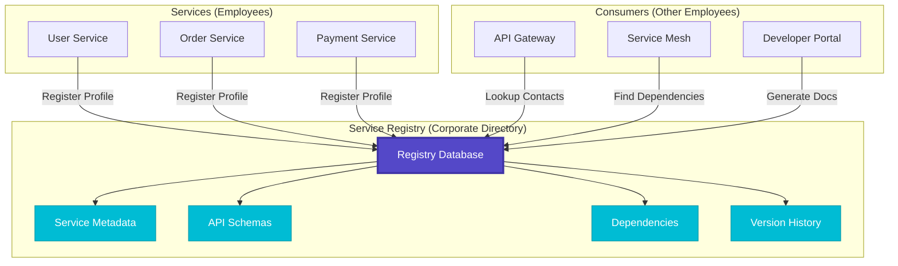
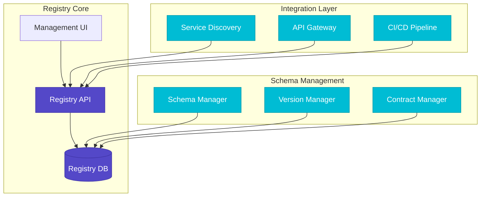
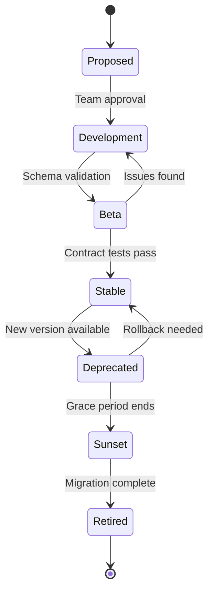
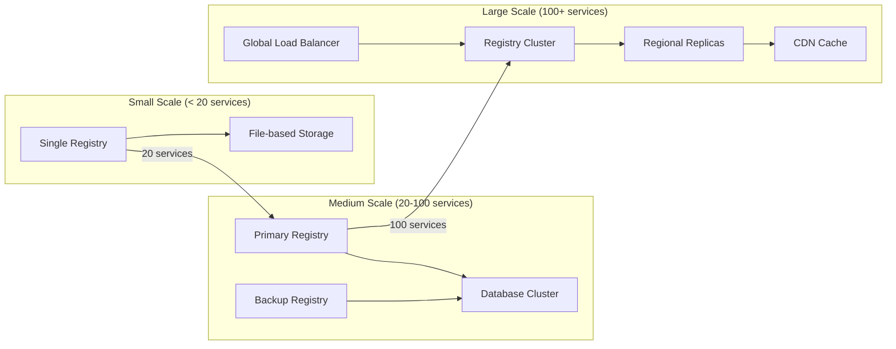
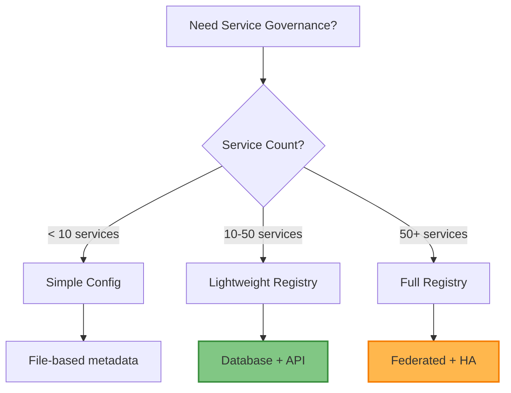

# Service Registry Pattern

!!! info "🥈 Silver Tier Pattern"
    **Central Service Governance** • Netflix Eureka, HashiCorp Consul, Kubernetes proven
    
    Service Registry provides centralized service contract management but requires careful governance to prevent schema drift. Essential for complex microservice architectures with strict API contracts.
    
    **Best For:** Large-scale microservices requiring contract governance and dependency management

## Essential Question

**How do we maintain authoritative metadata about service contracts and dependencies across a distributed system?**

## When to Use / When NOT to Use

### ✅ Use When

| Scenario | Example | Impact |
|----------|---------|--------|
| Complex service dependencies | 50+ microservices with interdependencies | Clear dependency tracking prevents cascading failures |
| Multi-team environments | Teams need to discover and integrate services | Shared contracts reduce integration time by 60% |
| API governance requirements | Banking system needing strict contract validation | Prevents breaking changes from reaching production |
| Schema evolution needs | Services evolving with backward compatibility | Safe schema migrations with impact analysis |

### ❌ DON'T Use When

| Scenario | Why | Alternative |
|----------|-----|-------------|
| Simple service architectures | < 10 services with minimal interdependencies | [Service Discovery](service-discovery.md) |
| Same-team ownership | All services owned by single team | Direct configuration management |
| Rapid prototyping | Need fast iteration without governance | Embedded service metadata |
| Simple request-response | Basic API calls without complex contracts | [API Gateway](api-gateway.md) routing |

## Level 1: Intuition (5 min) {#intuition}

### The Story

Imagine a large enterprise directory system. Just as employees need to know who does what, when they're available, and how to contact them, services in a distributed system need comprehensive metadata about other services—their contracts, versions, dependencies, and capabilities.

### Visual Metaphor



### Core Insight

> **Key Takeaway:** Service Registry is the "phone book" of distributed systems—it stores not just who's available, but their complete professional profile including capabilities, contracts, and relationships.

### In One Sentence

Service Registry **centralizes service metadata** by **storing contracts, schemas, and dependencies** to achieve **consistent service governance and safe evolution**.

## Level 2: Foundation (10 min) {#foundation}

### The Problem Space

<div class="failure-vignette">
<h4>🚨 What Happens Without This Pattern</h4>

**E-commerce Company, 2022**: 120 microservices with no central registry. Teams hard-coded service URLs and API contracts. When payment service changed its schema, 15 dependent services broke in production. Took 8 hours to identify all affected services and deploy fixes.

**Impact**: $2.3M revenue loss, 40-hour engineering effort, customer trust damaged
</div>

### How It Works

#### Architecture Overview



#### Key Components

| Component | Purpose | Responsibility |
|-----------|---------|----------------|
| Registry Database | Central storage | Service metadata, schemas, dependency graph |
| Schema Manager | Contract validation | API schema versioning and compatibility checks |
| Version Manager | Evolution tracking | Service lifecycle and version management |
| Discovery Bridge | Runtime integration | Sync with service discovery systems |

### Basic Example

```python
from dataclasses import dataclass
from typing import List, Dict, Optional
from datetime import datetime

@dataclass
class ServiceMetadata:
    name: str
    version: str
    description: str
    owner_team: str
    api_schema: dict
    dependencies: List[str]
    endpoints: List[dict]
    
class ServiceRegistry:
    def __init__(self):
        self.services = {}  # service_name -> versions -> metadata
        
    def register_service(self, metadata: ServiceMetadata):
        """Register service with metadata"""
        service_name = metadata.name
        version = metadata.version
        
        if service_name not in self.services:
            self.services[service_name] = {}
        
        self.services[service_name][version] = metadata
        return f"Registered {service_name} v{version}"
    
    def get_service(self, name: str, version: str = None) -> Optional[ServiceMetadata]:
        """Get service metadata by name and version"""
        if name not in self.services:
            return None
            
        if version:
            return self.services[name].get(version)
        
        # Return latest version
        versions = sorted(self.services[name].keys(), reverse=True)
        return self.services[name][versions[0]] if versions else None
```

## Level 3: Deep Dive (15 min) {#deep-dive}

### Implementation Details

#### Schema Evolution Management



#### Critical Design Decisions

| Decision | Options | Trade-off | Recommendation |
|----------|---------|-----------|----------------|
| Storage Backend | SQL Database<br>NoSQL Document Store | SQL: ACID, complex queries<br>NoSQL: Flexible schema, scale | SQL for governance-heavy environments |
| Schema Validation | Strict enforcement<br>Advisory warnings | Strict: Prevents errors<br>Advisory: Faster deployment | Strict for production systems |
| Versioning Strategy | Semantic versioning<br>Git-based versioning | SemVer: Clear compatibility<br>Git: Complete history | SemVer for API contracts |
| Sync with Discovery | Real-time sync<br>Periodic batch sync | Real-time: Always current<br>Batch: Lower overhead | Real-time for critical services |

### Common Pitfalls

<div class="decision-box">
<h4>⚠️ Avoid These Mistakes</h4>

1. **Manual Registry Updates**: Leads to schema drift → Automate via CI/CD pipelines
2. **No Breaking Change Detection**: Breaks dependent services → Implement compatibility validation
3. **Single Registry Instance**: Creates SPOF → Deploy with high availability and backups
4. **Ignoring Dependencies**: Creates hidden coupling → Maintain and validate dependency graph
</div>

### Production Considerations

#### Performance Characteristics

| Metric | Typical Range | Optimization Target |
|--------|---------------|-------------------|
| Query Latency | 10-50ms | < 20ms for 95th percentile |
| Registration Time | 100-500ms | < 200ms with validation |
| Storage per Service | 1-10KB | Optimize schema size |
| Concurrent Users | 100-1000 | Support team scaling |

## Level 4: Expert (20 min) {#expert}

### Advanced Techniques

#### 1. Contract Testing Integration

```python
class ContractRegistry:
    def __init__(self):
        self.contracts = {}
        self.test_results = {}
    
    def register_contract(self, provider: str, consumer: str, contract: dict):
        """Register consumer-provider contract"""
        key = f"{provider}:{consumer}"
        self.contracts[key] = contract
        
    def validate_contracts(self, provider: str, provider_version: str):
        """Run contract tests for all consumers"""
        results = {}
        for key, contract in self.contracts.items():
            if key.startswith(f"{provider}:"):
                consumer = key.split(":")[1]
                # Run Pact verification
                result = self._run_contract_test(provider, provider_version, consumer, contract)
                results[consumer] = result
        return results
    
    def _run_contract_test(self, provider: str, version: str, consumer: str, contract: dict):
        """Execute contract validation (simplified)"""
        # In production: integrate with Pact Broker or similar
        return {"status": "passed", "details": "Contract validated"}
```

#### 2. Dependency Impact Analysis

```python
import networkx as nx

class DependencyAnalyzer:
    def __init__(self):
        self.graph = nx.DiGraph()
    
    def add_dependency(self, service: str, dependency: str):
        """Add service dependency to graph"""
        self.graph.add_edge(service, dependency)
    
    def analyze_impact(self, service: str) -> dict:
        """Analyze impact of changing a service"""
        # Find all services that depend on this service
        dependents = list(self.graph.predecessors(service))
        
        # Calculate cascade depth
        cascade_levels = {}
        for dependent in dependents:
            cascade_levels[dependent] = nx.shortest_path_length(
                self.graph, dependent, service
            )
        
        return {
            "direct_dependents": dependents,
            "cascade_depth": max(cascade_levels.values()) if cascade_levels else 0,
            "total_affected": len(cascade_levels)
        }
```

### Scaling Considerations



### Monitoring & Observability

#### Key Metrics to Track

| Metric | Alert Threshold | Dashboard Panel |
|--------|----------------|-----------------|
| Registry Query Latency | > 100ms p95 | Latency distribution chart |
| Schema Validation Failures | > 5% failure rate | Error rate over time |
| Dependency Graph Depth | > 5 levels deep | Network topology view |
| Stale Service Registrations | > 24 hours old | Staleness heatmap |

## Level 5: Mastery (30 min) {#mastery}

### Real-World Case Studies

#### Case Study 1: Netflix Eureka Evolution

<div class="truth-box">
<h4>💡 Production Insights from Netflix</h4>

**Challenge**: Manage 1000+ microservices across multiple AWS regions with dynamic scaling

**Implementation**: 
- Extended Eureka with custom metadata for deployment tracking
- Integrated with Spinnaker for deployment pipeline validation
- Added circuit breaker integration with Hystrix

**Results**: 
- 99.99% registry availability
- Sub-100ms service lookup latency
- Zero-downtime deployments for 95% of services

**Lessons Learned**: Registry must be treated as critical infrastructure with same reliability standards as core business services
</div>

#### Case Study 2: Kubernetes Service Catalog

<div class="truth-box">
<h4>💡 Production Insights from Kubernetes Ecosystem</h4>

**Challenge**: Standardize service registration across heterogeneous container environments

**Implementation**:
- Custom Resource Definitions (CRDs) for service metadata
- Operator pattern for automated registration
- Integration with service mesh control planes

**Results**:
- 80% reduction in service onboarding time
- Unified service discovery across multi-cloud
- Automated compliance checking

**Lessons Learned**: Registry abstraction enables portability across infrastructure platforms
</div>

### Pattern Evolution

#### Migration from Legacy


#### Future Directions

| Trend | Impact on Pattern | Adaptation Strategy |
|-------|------------------|-------------------|
| Service Mesh Adoption | Registry integrates with mesh control plane | Standardize on xDS protocol |
| GitOps | Registry as code with version control | YAML-based service definitions |
| AI/ML Workloads | Dynamic service capabilities | Extend metadata schema |

### Pattern Combinations

#### Works Well With

| Pattern | Combination Benefit | Integration Point |
|---------|-------------------|------------------|
| [Service Discovery](service-discovery.md) | Runtime + metadata management | Registry provides schemas for discovery |
| [API Gateway](api-gateway.md) | Centralized routing with contracts | Gateway validates against registered schemas |
| [Circuit Breaker](../resilience/circuit-breaker.md) | Dependency-aware failure handling | Registry provides dependency graph |

## Quick Reference

### Decision Matrix



### Comparison with Alternatives

| Aspect | Service Registry | Service Discovery | API Gateway |
|--------|-----------------|------------------|-------------|
| Focus | Contract metadata | Runtime instances | Request routing |
| Complexity | High | Medium | Medium |
| Governance | Strong | Weak | Medium |
| Runtime Impact | Low | High | High |
| When to use | Contract-heavy systems | Dynamic scaling | Request mediation |

### Implementation Checklist

**Pre-Implementation**
- [ ] Define service metadata schema standards
- [ ] Establish governance processes and approval workflows
- [ ] Plan integration with existing CI/CD pipelines
- [ ] Design high availability and backup strategies

**Implementation**
- [ ] Deploy registry infrastructure with monitoring
- [ ] Implement schema validation and contract testing
- [ ] Integrate with service discovery systems
- [ ] Create developer tools and documentation portal

**Post-Implementation**
- [ ] Monitor registry performance and availability
- [ ] Establish service lifecycle management processes
- [ ] Train teams on registry usage and best practices
- [ ] Implement automated compliance checking

### Related Resources

<div class="grid cards" markdown>

- :material-book-open-variant:{ .lg .middle } **Related Patterns**
    
    ---
    
    - [Service Discovery](service-discovery.md) - Runtime service location
    - [API Gateway](api-gateway.md) - Request routing and mediation
    - [Circuit Breaker](../resilience/circuit-breaker.md) - Failure handling

- :material-flask:{ .lg .middle } **Fundamental Laws**
    
    ---
    
    - [Law 4: Multi-dimensional Optimization](../../part1-axioms/law4-tradeoffs/) - Registry adds governance overhead
    - [Law 6: Human-Centric API Design](../../part1-axioms/law6-human-api/) - Developer experience matters

- :material-pillar:{ .lg .middle } **Foundational Pillars**
    
    ---
    
    - [Control Distribution](../../part2-pillars/control/) - Centralized governance
    - [Truth Distribution](../../part2-pillars/truth/) - Authoritative metadata

- :material-tools:{ .lg .middle } **Implementation Guides**
    
    ---
    
    - [Service Governance Guide](../../excellence/guides/service-governance.md)
    - [Contract Testing Setup](../../excellence/guides/contract-testing.md)
    - [Registry Migration Guide](../../excellence/migrations/to-service-registry.md)

</div>