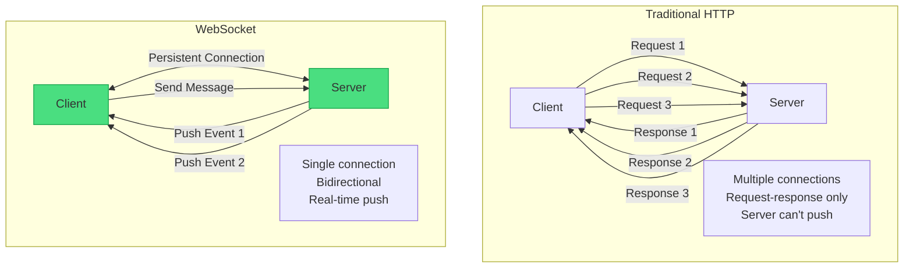
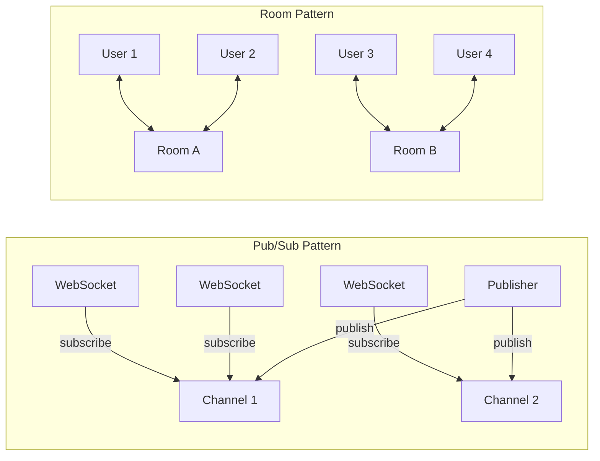

# WebSocket Pattern

!!! success "🏆 Gold Standard Pattern"
    **Real-Time Bidirectional Communication** • Discord, Slack, Binance proven
    
    The standard for real-time, bidirectional communication in modern applications. WebSockets enable instant data exchange with minimal overhead, powering chat, gaming, and financial applications at massive scale.
    
    **Key Success Metrics:**
    - Discord: 15M concurrent connections for gaming communities
    - Slack: Sub-100ms message delivery for 12M+ daily users
    - Binance: 1.2M messages/second for real-time trading

## Essential Question
**How do we maintain persistent, bidirectional communication between clients and servers efficiently?**

## When to Use / When NOT to Use

### ✅ Use When
| Scenario | Why | Example |
|----------|-----|---------|
| **Real-time updates** | Push data instantly | Stock tickers, live scores |
| **Bidirectional flow** | Both sides initiate | Chat applications |
| **Low latency critical** | Minimal overhead | Online gaming |
| **High frequency updates** | Avoid polling overhead | Collaborative editing |

### ❌ DON'T Use When
| Scenario | Why | Alternative |
|----------|-----|-------------|
| **Request-response only** | Overhead not justified | REST API |
| **Unidirectional data** | One-way is simpler | Server-Sent Events |
| **Stateless operations** | Connection overhead | HTTP/2 |
| **Resource constrained** | Memory per connection | Long polling |

## Level 1: Intuition (5 min)

### The Phone Call Analogy
HTTP is like sending letters - you send a request and wait for a response. WebSocket is like a phone call - once connected, both parties can speak anytime without hanging up and redialing.

### Visual Architecture



### Core Value
| Aspect | HTTP | WebSocket |
|--------|------|-----------|
| **Connection** | New for each request | Persistent |
| **Direction** | Client initiates only | Bidirectional |
| **Overhead** | Headers each time | One-time handshake |
| **Real-time** | Polling required | Native push |

## Level 2: Foundation (10 min)

### Connection Lifecycle

```mermaid
sequenceDiagram
    participant Client
    participant Server
    
    Note over Client,Server: 1. Handshake (HTTP Upgrade)
    Client->>Server: GET /ws HTTP/1.1<br/>Upgrade: websocket
    Server->>Client: HTTP/1.1 101 Switching Protocols<br/>Upgrade: websocket
    
    Note over Client,Server: 2. WebSocket Connection Open
    
    Client<->Server: Bidirectional Messages
    
    Client->>Server: Ping
    Server->>Client: Pong
    
    Note over Client,Server: 3. Connection Close
    Client->>Server: Close Frame
    Server->>Client: Close Frame
```

### Basic Implementation

```python
# Server (using websockets library)
import asyncio
import websockets
import json

class WebSocketServer:
    def __init__(self):
        self.clients = set()
    
    async def handler(self, websocket, path):
        # Register client
        self.clients.add(websocket)
        try:
            async for message in websocket:
                data = json.loads(message)
                
                # Handle different message types
                if data['type'] == 'broadcast':
                    await self.broadcast(data['payload'])
                elif data['type'] == 'echo':
                    await websocket.send(message)
                    
        finally:
            # Unregister client
            self.clients.remove(websocket)
    
    async def broadcast(self, message):
        # Send to all connected clients
        if self.clients:
            await asyncio.gather(
                *[client.send(json.dumps(message)) 
                  for client in self.clients]
            )

# Client (JavaScript)
const ws = new WebSocket('ws://localhost:8080');

ws.onopen = () => {
    console.log('Connected');
    ws.send(JSON.stringify({
        type: 'broadcast',
        payload: { message: 'Hello everyone!' }
    }));
};

ws.onmessage = (event) => {
    const data = JSON.parse(event.data);
    console.log('Received:', data);
};

ws.onerror = (error) => {
    console.error('WebSocket error:', error);
};
```

## Level 3: Deep Dive (15 min)

### Message Patterns



### Advanced Features

```python
class AdvancedWebSocketServer:
    def __init__(self):
        self.clients = {}  # id -> connection
        self.rooms = {}    # room -> set of clients
        self.subscriptions = {}  # topic -> set of clients
    
    async def handle_connection(self, websocket, client_id):
        self.clients[client_id] = {
            'ws': websocket,
            'rooms': set(),
            'subscriptions': set(),
            'metadata': {}
        }
        
        try:
            await self.send_message(websocket, {
                'type': 'connected',
                'client_id': client_id
            })
            
            async for message in websocket:
                await self.route_message(client_id, message)
                
        except websockets.exceptions.ConnectionClosed:
            pass
        finally:
            await self.cleanup_client(client_id)
    
    async def route_message(self, client_id, message):
        data = json.loads(message)
        msg_type = data.get('type')
        
        if msg_type == 'join_room':
            await self.join_room(client_id, data['room'])
        elif msg_type == 'leave_room':
            await self.leave_room(client_id, data['room'])
        elif msg_type == 'room_message':
            await self.send_to_room(data['room'], data['payload'])
        elif msg_type == 'subscribe':
            await self.subscribe(client_id, data['topic'])
        elif msg_type == 'publish':
            await self.publish(data['topic'], data['payload'])
    
    async def join_room(self, client_id, room):
        if room not in self.rooms:
            self.rooms[room] = set()
        
        self.rooms[room].add(client_id)
        self.clients[client_id]['rooms'].add(room)
        
        # Notify room members
        await self.send_to_room(room, {
            'type': 'user_joined',
            'user': client_id
        })
    
    async def send_to_room(self, room, message):
        if room in self.rooms:
            tasks = []
            for client_id in self.rooms[room]:
                if client_id in self.clients:
                    ws = self.clients[client_id]['ws']
                    tasks.append(self.send_message(ws, message))
            
            await asyncio.gather(*tasks, return_exceptions=True)
```

### Connection Management

| Challenge | Solution | Implementation |
|-----------|----------|----------------|
| **Disconnections** | Auto-reconnect | Exponential backoff |
| **Message loss** | Queue + ACK | In-memory/Redis queue |
| **Scale** | Horizontal scaling | Sticky sessions + pub/sub |
| **Security** | Authentication | Token validation |

## Level 4: Expert (20 min)

### Scaling WebSockets

```python
# Horizontal scaling with Redis pub/sub
import aioredis

class ScalableWebSocketServer:
    def __init__(self, node_id):
        self.node_id = node_id
        self.local_clients = {}
        self.redis = None
    
    async def setup(self):
        self.redis = await aioredis.create_redis_pool(
            'redis://localhost'
        )
    
    async def handle_local_message(self, client_id, message):
        data = json.loads(message)
        
        if data.get('broadcast'):
            # Publish to Redis for other nodes
            await self.redis.publish(
                'ws:broadcast',
                json.dumps({
                    'from_node': self.node_id,
                    'from_client': client_id,
                    'payload': data['payload']
                })
            )
    
    async def redis_listener(self):
        # Subscribe to Redis channels
        channel = (await self.redis.subscribe('ws:broadcast'))[0]
        
        while await channel.wait_message():
            message = await channel.get()
            data = json.loads(message)
            
            # Skip if from same node
            if data['from_node'] != self.node_id:
                await self.broadcast_local(data['payload'])
    
    async def broadcast_local(self, message):
        # Send to all local clients
        tasks = []
        for client in self.local_clients.values():
            tasks.append(
                client['ws'].send(json.dumps(message))
            )
        
        await asyncio.gather(*tasks, return_exceptions=True)
```

### Production Patterns

```yaml
# Load balancer configuration (nginx)
upstream websocket_backend {
    ip_hash;  # Sticky sessions
    server ws1.example.com:8080;
    server ws2.example.com:8080;
    server ws3.example.com:8080;
}

server {
    location /ws {
        proxy_pass http://websocket_backend;
        proxy_http_version 1.1;
        proxy_set_header Upgrade $http_upgrade;
        proxy_set_header Connection "upgrade";
        proxy_read_timeout 86400;
        
        # WebSocket specific
        proxy_set_header X-Real-IP $remote_addr;
        proxy_set_header X-Forwarded-For $proxy_add_x_forwarded_for;
        proxy_set_header Host $http_host;
    }
}
```

### Performance Optimization

| Technique | Impact | Configuration |
|-----------|--------|---------------|
| **Message batching** | -70% syscalls | Buffer 10ms |
| **Binary frames** | -50% bandwidth | Use ArrayBuffer |
| **Compression** | -80% for text | permessage-deflate |
| **Connection pooling** | -90% handshakes | Reuse connections |

## Level 5: Mastery (30 min)

### Case Study: Discord's WebSocket Infrastructure

!!! info "🏢 Real-World Implementation"
    **Scale**: 15M concurrent connections, 150M+ users
    **Challenge**: Voice + text chat with minimal latency
    **Solution**: Custom WebSocket infrastructure
    
    **Architecture**:
    - Elixir/Erlang for connection handling
    - Consistent hashing for session affinity
    - ETF (External Term Format) for efficiency
    - Guild-based sharding
    
    **Optimizations**:
    - zlib compression per connection
    - Lazy loading of message history
    - Intelligent reconnection with resume
    - Regional WebSocket gateways
    
    **Results**:
    - < 100ms message delivery globally
    - 99.99% uptime for WebSocket layer
    - Handles 1M+ events/second per node

### Advanced Reconnection

```javascript
class ResilientWebSocket {
    constructor(url, options = {}) {
        this.url = url;
        this.options = {
            reconnectDelay: 1000,
            maxReconnectDelay: 30000,
            reconnectDecay: 1.5,
            maxReconnectAttempts: null,
            ...options
        };
        
        this.messageQueue = [];
        this.reconnectAttempts = 0;
        this.shouldReconnect = true;
        this.sessionId = null;
        
        this.connect();
    }
    
    connect() {
        this.ws = new WebSocket(this.url);
        
        this.ws.onopen = () => {
            console.log('WebSocket connected');
            this.reconnectAttempts = 0;
            
            // Resume session if available
            if (this.sessionId) {
                this.send({
                    type: 'resume',
                    session_id: this.sessionId
                });
            }
            
            // Flush queued messages
            while (this.messageQueue.length > 0) {
                const msg = this.messageQueue.shift();
                this.ws.send(msg);
            }
        };
        
        this.ws.onclose = (event) => {
            if (this.shouldReconnect && !event.wasClean) {
                this.scheduleReconnect();
            }
        };
        
        this.ws.onerror = (error) => {
            console.error('WebSocket error:', error);
        };
        
        this.ws.onmessage = (event) => {
            const data = JSON.parse(event.data);
            
            // Handle session info
            if (data.type === 'session') {
                this.sessionId = data.session_id;
            }
            
            // Emit to handlers
            this.emit('message', data);
        };
    }
    
    scheduleReconnect() {
        if (this.options.maxReconnectAttempts && 
            this.reconnectAttempts >= this.options.maxReconnectAttempts) {
            return;
        }
        
        const delay = Math.min(
            this.options.reconnectDelay * 
            Math.pow(this.options.reconnectDecay, this.reconnectAttempts),
            this.options.maxReconnectDelay
        );
        
        this.reconnectAttempts++;
        
        setTimeout(() => {
            console.log(`Reconnecting... (attempt ${this.reconnectAttempts})`);
            this.connect();
        }, delay);
    }
    
    send(data) {
        const message = JSON.stringify(data);
        
        if (this.ws.readyState === WebSocket.OPEN) {
            this.ws.send(message);
        } else {
            // Queue for later
            this.messageQueue.push(message);
        }
    }
}
```

## Quick Reference

### Production Checklist ✓
- [ ] **Connection Management**
  - [ ] Implement heartbeat/ping-pong
  - [ ] Auto-reconnection with backoff
  - [ ] Connection pooling for scale
  - [ ] Graceful shutdown handling
  
- [ ] **Message Handling**
  - [ ] Message queuing for offline
  - [ ] Implement acknowledgments
  - [ ] Binary format for efficiency
  - [ ] Compression for large payloads
  
- [ ] **Security**
  - [ ] Authentication on connect
  - [ ] Rate limiting per connection
  - [ ] Input validation
  - [ ] Origin verification
  
- [ ] **Monitoring**
  - [ ] Connection count metrics
  - [ ] Message throughput
  - [ ] Latency percentiles
  - [ ] Error rates by type

### Common Pitfalls

| Pitfall | Impact | Solution |
|---------|--------|----------|
| **No heartbeat** | Silent disconnections | Ping/pong every 30s |
| **Memory leaks** | Server crash | Cleanup on disconnect |
| **No rate limiting** | DoS vulnerability | Per-connection limits |
| **Blocking operations** | Thread starvation | Use async everywhere |

### Performance Benchmarks

```
Single server capacity:
- Connections: 100k-1M (depending on memory)
- Messages/sec: 100k-500k
- Latency: < 1ms local, < 100ms global
- Memory: ~10KB per idle connection
- CPU: 1 core per 10k active connections
```

## Related Patterns

- **[Publish-Subscribe](publish-subscribe.md)** - Message distribution pattern
- **[Long Polling](long-polling.md)** - Fallback for WebSocket
- **[Server-Sent Events](server-sent-events.md)** - Unidirectional alternative
- **[API Gateway](api-gateway.md)** - WebSocket routing and scaling
- **[Circuit Breaker](../resilience/circuit-breaker.md)** - Connection resilience
- **[Message Queue](distributed-queue.md)** - Offline message handling

## References

- [RFC 6455 - The WebSocket Protocol](https://tools.ietf.org/html/rfc6455)
- [WebSocket API (MDN)](https://developer.mozilla.org/en-US/docs/Web/API/WebSocket)
- [Socket.IO](https://socket.io/) - WebSocket library with fallbacks
- [Discord's WebSocket Gateway](https://discord.com/developers/docs/topics/gateway)

---

**Previous**: [Service Discovery Pattern](service-discovery.md) | **Next**: [Communication Patterns Index](index.md)