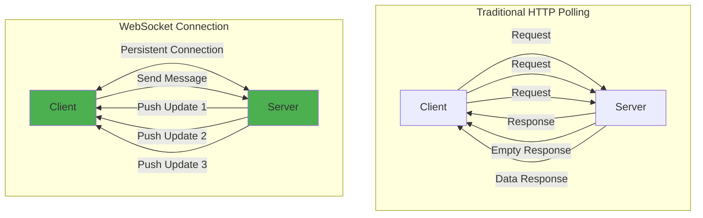
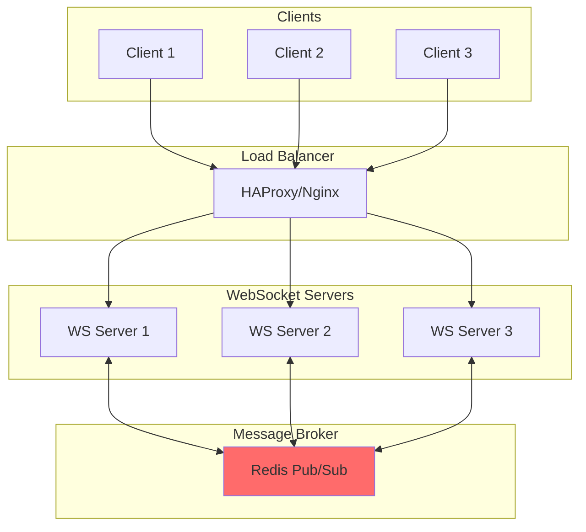

# WebSocket Pattern

!!! success "🏆 Gold Standard Pattern"
    **Real-Time Bidirectional Communication** • Discord, Slack, Binance proven
    
    The standard for real-time, bidirectional communication in modern applications. WebSockets enable instant data exchange with minimal overhead, powering chat, gaming, and financial applications at massive scale.
    
    **Key Success Metrics:**
    - Discord: 15M concurrent connections for gaming communities
    - Slack: Sub-100ms message delivery for 12M+ daily users
    - Binance: 1.2M messages/second for real-time trading

**Persistent bidirectional communication channels for real-time distributed systems**

> *"HTTP is like sending letters back and forth. WebSockets are like having a phone call - the connection stays open for instant communication."*

---

## Problem Statement

!!! warning "The Request-Response Limitation"

 Traditional HTTP follows a request-response model:
 - **Client must initiate**: Server can't push data proactively
 - **Connection overhead**: New TCP connection for each request
 - **Polling inefficiency**: Constant checking for updates wastes resources
 - **Latency penalty**: Round-trip time for every interaction
 - **Stateless nature**: No built-in session continuity

## Core Architecture



## How WebSockets Work

### Connection Lifecycle

```mermaid
sequenceDiagram
 participant Client
 participant Server
 
 Note over Client,Server: 1. HTTP Upgrade Handshake
 Client->>Server: GET /websocket HTTP/1.1<br/>Upgrade: websocket<br/>Connection: Upgrade<br/>Sec-WebSocket-Key: dGhlIHNhbXBsZSBub25jZQ==
 
 Server->>Client: HTTP/1.1 101 Switching Protocols<br/>Upgrade: websocket<br/>Connection: Upgrade<br/>Sec-WebSocket-Accept: s3pPLMBiTxaQ9kYGzzhZRbK+xOo=
 
 Note over Client,Server: 2. WebSocket Connection Established
 
 Client<->Server: Bidirectional Message Exchange
 
 Note over Client,Server: 3. Connection Closure
 Client->>Server: Close Frame
 Server->>Client: Close Frame ACK
```

### Frame Structure

<table class="responsive-table">
<thead>
<tr>
<th>Frame Type</th>
<th>Opcode</th>
<th>Purpose</th>
<th>Payload</th>
</tr>
</thead>
<tbody>
<tr>
<td data-label="Frame Type"><strong>Text</strong></td>
<td data-label="Opcode">0x1</td>
<td data-label="Purpose">UTF-8 text data</td>
<td data-label="Payload">String messages</td>
</tr>
<tr>
<td data-label="Frame Type"><strong>Binary</strong></td>
<td data-label="Opcode">0x2</td>
<td data-label="Purpose">Binary data</td>
<td data-label="Payload">Byte arrays, files</td>
</tr>
<tr>
<td data-label="Frame Type"><strong>Close</strong></td>
<td data-label="Opcode">0x8</td>
<td data-label="Purpose">Close connection</td>
<td data-label="Payload">Status code + reason</td>
</tr>
<tr>
<td data-label="Frame Type"><strong>Ping</strong></td>
<td data-label="Opcode">0x9</td>
<td data-label="Purpose">Heartbeat request</td>
<td data-label="Payload">Optional data</td>
</tr>
<tr>
<td data-label="Frame Type"><strong>Pong</strong></td>
<td data-label="Opcode">0xA</td>
<td data-label="Purpose">Heartbeat response</td>
<td data-label="Payload">Echo ping data</td>
</tr>
</tbody>
</table>

## Implementation Patterns

### 1. Basic WebSocket Server

```python
import asyncio
import websockets
import json
from typing import Set, Dict
import logging

class WebSocketServer:
 def __init__(self):
 self.clients: Set[websockets.WebSocketServerProtocol] = set()
 self.rooms: Dict[str, Set[websockets.WebSocketServerProtocol]] = {}
 
 async def register(self, websocket):
 """Register new client connection"""
 self.clients.add(websocket)
 logging.info(f"Client {websocket.remote_address} connected")
 
 async def unregister(self, websocket):
 """Clean up disconnected client"""
 self.clients.remove(websocket)
# Remove from all rooms
 for room_clients in self.rooms.values():
 room_clients.discard(websocket)
 logging.info(f"Client {websocket.remote_address} disconnected")
 
 async def handle_message(self, websocket, message):
 """Process incoming message"""
 try:
 data = json.loads(message)
 message_type = data.get('type')
 
 if message_type == 'join_room':
 room_id = data.get('room_id')
 if room_id not in self.rooms:
 self.rooms[room_id] = set()
 self.rooms[room_id].add(websocket)
 await websocket.send(json.dumps({
 'type': 'joined_room',
 'room_id': room_id
 }))
 
 elif message_type == 'broadcast':
# Send to all clients
 await self.broadcast(data.get('content'))
 
 elif message_type == 'room_message':
# Send to specific room
 room_id = data.get('room_id')
 await self.room_broadcast(room_id, data.get('content'))
 
 except json.JSONDecodeError:
 await websocket.send(json.dumps({
 'type': 'error',
 'message': 'Invalid JSON'
 }))
 
 async def broadcast(self, message):
 """Send message to all connected clients"""
 if self.clients:
 await asyncio.gather(
 *[client.send(json.dumps(message)) for client in self.clients],
 return_exceptions=True
 )
 
 async def room_broadcast(self, room_id: str, message):
 """Send message to all clients in a room"""
 if room_id in self.rooms:
 room_clients = self.rooms[room_id]
 await asyncio.gather(
 *[client.send(json.dumps(message)) for client in room_clients],
 return_exceptions=True
 )
 
 async def handler(self, websocket, path):
 """Handle WebSocket connection"""
 await self.register(websocket)
 try:
 async for message in websocket:
 await self.handle_message(websocket, message)
 finally:
 await self.unregister(websocket)

# Start server
async def main():
 server = WebSocketServer()
 async with websockets.serve(server.handler, "localhost", 8765):
 await asyncio.Future() # Run forever

if __name__ == "__main__":
 asyncio.run(main())
```

### 2. Scalable WebSocket Architecture



### 3. Production WebSocket Handler

```python
import aioredis
import websockets
import asyncio
import json
import time
from contextlib import asynccontextmanager

class ScalableWebSocketServer:
 def __init__(self, server_id: str):
 self.server_id = server_id
 self.local_clients = {}
 self.redis_pool = None
 self.heartbeat_interval = 30
 self.connection_timeout = 60
 
 async def setup_redis(self):
 """Initialize Redis connection pool"""
 self.redis_pool = await aioredis.create_redis_pool(
 'redis://localhost',
 minsize=5,
 maxsize=10
 )
 
 @asynccontextmanager
 async def redis_client(self):
 """Get Redis client from pool"""
 client = await self.redis_pool.acquire()
 try:
 yield client
 finally:
 self.redis_pool.release(client)
 
 async def handle_client(self, websocket, path):
 """Handle individual WebSocket connection"""
 client_id = f"{self.server_id}:{id(websocket)}"
 
# Store client info
 self.local_clients[client_id] = {
 'websocket': websocket,
 'last_heartbeat': time.time(),
 'subscriptions': set()
 }
 
# Start heartbeat task
 heartbeat_task = asyncio.create_task(
 self.heartbeat_handler(client_id)
 )
 
# Start Redis subscription task
 sub_task = asyncio.create_task(
 self.redis_subscription_handler(client_id)
 )
 
 try:
 async for message in websocket:
 await self.process_message(client_id, message)
 except websockets.ConnectionClosed:
 pass
 finally:
# Cleanup
 heartbeat_task.cancel()
 sub_task.cancel()
 await self.cleanup_client(client_id)
 
 async def process_message(self, client_id: str, message: str):
 """Process incoming WebSocket message"""
 try:
 data = json.loads(message)
 message_type = data.get('type')
 
# Update heartbeat
 self.local_clients[client_id]['last_heartbeat'] = time.time()
 
 if message_type == 'subscribe':
 channel = data.get('channel')
 await self.subscribe_client(client_id, channel)
 
 elif message_type == 'publish':
 channel = data.get('channel')
 content = data.get('content')
 await self.publish_message(channel, content)
 
 elif message_type == 'ping':
# Respond to ping
 await self.send_to_client(client_id, {
 'type': 'pong',
 'timestamp': time.time()
 })
 
 except Exception as e:
 await self.send_to_client(client_id, {
 'type': 'error',
 'message': str(e)
 })
 
 async def subscribe_client(self, client_id: str, channel: str):
 """Subscribe client to a channel"""
 self.local_clients[client_id]['subscriptions'].add(channel)
 
# Subscribe to Redis channel
 async with self.redis_client() as redis:
 await redis.subscribe(channel)
 
 await self.send_to_client(client_id, {
 'type': 'subscribed',
 'channel': channel
 })
 
 async def publish_message(self, channel: str, content: any):
 """Publish message to all subscribers via Redis"""
 message = {
 'server_id': self.server_id,
 'channel': channel,
 'content': content,
 'timestamp': time.time()
 }
 
 async with self.redis_client() as redis:
 await redis.publish(channel, json.dumps(message))
 
 async def redis_subscription_handler(self, client_id: str):
 """Handle Redis pub/sub messages"""
 async with self.redis_client() as redis:
 while client_id in self.local_clients:
 try:
# Get messages from subscribed channels
 channel, message = await redis.blpop(
 *self.local_clients[client_id]['subscriptions'],
 timeout=1
 )
 
 if message:
 data = json.loads(message)
# Don't echo back to the same server
 if data['server_id'] != self.server_id:
 await self.send_to_client(client_id, data)
 
 except asyncio.CancelledError:
 break
 except Exception as e:
 logging.error(f"Redis subscription error: {e}")
 
 async def heartbeat_handler(self, client_id: str):
 """Send periodic heartbeats and check connection health"""
 while client_id in self.local_clients:
 try:
 client = self.local_clients[client_id]
 
# Check if client is still responsive
 last_heartbeat = client['last_heartbeat']
 if time.time() - last_heartbeat > self.connection_timeout:
# Client timeout - close connection
 await client['websocket'].close()
 break
 
# Send heartbeat
 await self.send_to_client(client_id, {
 'type': 'heartbeat',
 'timestamp': time.time()
 })
 
 await asyncio.sleep(self.heartbeat_interval)
 
 except asyncio.CancelledError:
 break
 except Exception as e:
 logging.error(f"Heartbeat error: {e}")
 break
 
 async def send_to_client(self, client_id: str, message: dict):
 """Send message to specific client"""
 if client_id in self.local_clients:
 try:
 websocket = self.local_clients[client_id]['websocket']
 await websocket.send(json.dumps(message))
 except Exception as e:
 logging.error(f"Failed to send to {client_id}: {e}")
 await self.cleanup_client(client_id)
 
 async def cleanup_client(self, client_id: str):
 """Clean up disconnected client"""
 if client_id in self.local_clients:
# Unsubscribe from all channels
 async with self.redis_client() as redis:
 for channel in self.local_clients[client_id]['subscriptions']:
 await redis.unsubscribe(channel)
 
 del self.local_clients[client_id]
```

## Advanced Features

### 1. Connection State Management

```python
class ConnectionManager:
 def __init__(self):
 self.connections = {}
 self.reconnect_tokens = {}
 
 def generate_reconnect_token(self, client_id: str) -> str:
 """Generate token for reconnection"""
 token = secrets.token_urlsafe(32)
 self.reconnect_tokens[token] = {
 'client_id': client_id,
 'expires': time.time() + 300 # 5 minutes
 }
 return token
 
 async def handle_reconnect(self, token: str, websocket):
 """Handle client reconnection"""
 if token in self.reconnect_tokens:
 token_data = self.reconnect_tokens[token]
 if time.time() < token_data['expires']:
# Valid reconnection
 client_id = token_data['client_id']
 await self.restore_client_state(client_id, websocket)
 del self.reconnect_tokens[token]
 return True
 return False
```

### 2. Message Compression

```python
import zlib

class CompressedWebSocket:
 def __init__(self, websocket, compression_threshold=1024):
 self.websocket = websocket
 self.compression_threshold = compression_threshold
 
 async def send(self, message: str):
 """Send message with optional compression"""
 if len(message) > self.compression_threshold:
# Compress large messages
 compressed = zlib.compress(message.encode())
 await self.websocket.send(compressed)
 else:
 await self.websocket.send(message)
```

### 3. Rate Limiting

```python
from collections import deque
import time

class RateLimiter:
 def __init__(self, max_messages: int, window_seconds: int):
 self.max_messages = max_messages
 self.window_seconds = window_seconds
 self.client_history = {}
 
 def is_allowed(self, client_id: str) -> bool:
 """Check if client can send message"""
 now = time.time()
 
 if client_id not in self.client_history:
 self.client_history[client_id] = deque()
 
 history = self.client_history[client_id]
 
# Remove old entries
 while history and history[0] < now - self.window_seconds:
 history.popleft()
 
# Check limit
 if len(history) >= self.max_messages:
 return False
 
# Add current request
 history.append(now)
 return True
```

## Performance Optimization

<table class="responsive-table">
<thead>
<tr>
<th>Optimization</th>
<th>Impact</th>
<th>Implementation</th>
<th>Trade-off</th>
</tr>
</thead>
<tbody>
<tr>
<td data-label="Optimization"><strong>Message Batching</strong></td>
<td data-label="Impact">Reduce overhead</td>
<td data-label="Implementation">Queue and send together</td>
<td data-label="Trade-off">Increased latency</td>
</tr>
<tr>
<td data-label="Optimization"><strong>Binary Protocol</strong></td>
<td data-label="Impact">Smaller payload</td>
<td data-label="Implementation">Use MessagePack/Protobuf</td>
<td data-label="Trade-off">Complexity</td>
</tr>
<tr>
<td data-label="Optimization"><strong>Connection Pooling</strong></td>
<td data-label="Impact">Resource efficiency</td>
<td data-label="Implementation">Reuse connections</td>
<td data-label="Trade-off">State management</td>
</tr>
<tr>
<td data-label="Optimization"><strong>Edge Servers</strong></td>
<td data-label="Impact">Lower latency</td>
<td data-label="Implementation">Deploy globally</td>
<td data-label="Trade-off">Infrastructure cost</td>
</tr>
</tbody>
</table>

## Security Considerations

### 1. Authentication

```python
import jwt

class SecureWebSocketServer:
 def __init__(self, secret_key: str):
 self.secret_key = secret_key
 
 async def authenticate_connection(self, websocket, path):
 """Authenticate WebSocket connection"""
# Extract token from query string or headers
 token = self.extract_token(path)
 
 try:
 payload = jwt.decode(token, self.secret_key, algorithms=['HS256'])
 user_id = payload['user_id']
 
# Store authenticated user
 websocket.user_id = user_id
 return True
 
 except jwt.InvalidTokenError:
 await websocket.close(code=4001, reason="Unauthorized")
 return False
```

### 2. Message Validation

```python
from pydantic import BaseModel, ValidationError

class MessageSchema(BaseModel):
 type: str
 content: dict
 timestamp: float
 
class MessageValidator:
 @staticmethod
 def validate_message(raw_message: str) -> Optional[dict]:
 """Validate and sanitize incoming messages"""
 try:
 data = json.loads(raw_message)
 validated = MessageSchema(**data)
 return validated.dict()
 except (json.JSONDecodeError, ValidationError):
 return None
```

## Monitoring and Observability

```python
class WebSocketMetrics:
 def __init__(self):
 self.metrics = {
 'active_connections': 0,
 'messages_sent': 0,
 'messages_received': 0,
 'errors': 0,
 'reconnections': 0
 }
 
 def record_connection(self):
 self.metrics['active_connections'] += 1
 
 def record_disconnection(self):
 self.metrics['active_connections'] -= 1
 
 def record_message(self, direction: str):
 if direction == 'sent':
 self.metrics['messages_sent'] += 1
 else:
 self.metrics['messages_received'] += 1
 
 def get_metrics(self) -> dict:
 return {
 **self.metrics,
 'timestamp': time.time()
 }
```

## Common Pitfalls

!!! danger "⚠️ Memory Leak from Unclosed Connections"
 **Problem**: Connections not properly cleaned up
 **Symptom**: Memory usage grows unbounded
 **Solution**: Implement connection timeout and proper cleanup
 ```python
 # Always use try/finally for cleanup
 try:
 async for message in websocket:
 await process_message(message)
 finally:
 await cleanup_connection(websocket)
 ```

!!! danger "⚠️ Message Ordering Issues"
 **Problem**: Messages arrive out of order
 **Symptom**: UI inconsistencies, data corruption
 **Solution**: Add sequence numbers or timestamps
 ```python
 class OrderedMessageHandler:
 def __init__(self):
 self.message_buffer = {}
 self.expected_seq = 0
 async def handle_message(self, message):
 seq = message['sequence']
 if seq == self.expected_seq:
 await self.process_message(message)
 self.expected_seq += 1
 # Process buffered messages
 while self.expected_seq in self.message_buffer:
 await self.process_message(
 self.message_buffer.pop(self.expected_seq)
 )
 self.expected_seq += 1
 else:
 # Buffer out-of-order message
 self.message_buffer[seq] = message
 ```

## When to Use WebSockets

!!! note "✅ Good Fit"
 - **Real-time collaboration**: Google Docs, Figma
 - **Live notifications**: Social media, monitoring
 - **Chat applications**: Slack, Discord
 - **Financial data**: Stock tickers, trading
 - **Gaming**: Multiplayer games, live scores
 - **IoT**: Device monitoring, control

!!! note "❌ Poor Fit"
 - **Simple CRUD**: REST is simpler
 - **File uploads**: HTTP is more suitable
 - **Caching needed**: HTTP has better support
 - **Stateless operations**: Overhead not justified
 - **Limited client support**: Fallbacks needed

## Implementation Checklist

- [ ] Choose WebSocket library (ws, socket.io, etc.)
- [ ] Design message protocol and schemas
- [ ] Implement authentication mechanism
- [ ] Set up connection management
- [ ] Add heartbeat/keepalive logic
- [ ] Implement reconnection strategy
- [ ] Add rate limiting and quotas
- [ ] Set up horizontal scaling (Redis pub/sub)
- [ ] Configure load balancer (sticky sessions)
- [ ] Implement monitoring and metrics
- [ ] Plan graceful shutdown procedure
- [ ] Test under load and failure scenarios

## Related Patterns

- [Event-Driven Architecture](../../patterns/event-driven.md) - WebSockets enable real-time events
- [Circuit Breaker](../resilience/circuit-breaker.md) - Protect WebSocket endpoints
- [Load Balancing](../scaling/load-balancing.md) - Distribute WebSocket connections
- [Backpressure](../../patterns/backpressure.md) - Handle message flooding
- [Pub-Sub](publish-subscribe.md) - Scale WebSocket systems

## References

- [Chat System Case Study](case-studies/chat-system) - WhatsApp-scale implementation
- RFC 6455: The WebSocket Protocol
- "Scaling WebSockets" - High Scalability
- "WebSocket Security" - OWASP Guidelines