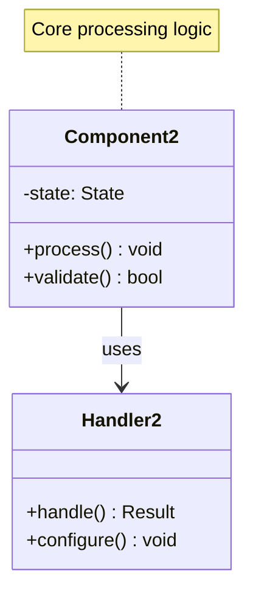
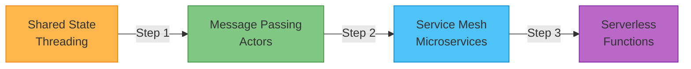

# Actor Model

!!! warning "🥉 Bronze Tier Pattern"
    **Legacy concurrency model - Consider modern alternatives** • Modern patterns provide better solutions
    
    While the Actor Model pioneered important concurrency concepts, service mesh, serverless, and event-driven architectures provide better solutions for most use cases. The complexity without clear benefits makes it unsuitable for new projects.
    
    **Migration Path:** See [Service Mesh](../architecture/service-mesh.md) or [Event-Driven Architecture](../../pattern-library/architecture/event-driven.md) for current best practices

## Essential Question

**How do we handle millions of concurrent entities without shared state complexity?**

## When to Use / When NOT to Use

### ✅ Use When

| Scenario | Example | Impact |
|----------|---------|--------|
| **Erlang/Elixir Systems** | Existing BEAM VM infrastructure | Leverage ecosystem strengths |
| **Massive Entity Simulation** | IoT device simulation with millions of entities | Natural entity-per-actor mapping |
| **Telecoms/Messaging** | WhatsApp-style messaging systems | Proven at massive scale |

### ❌ DON'T Use When

| Scenario | Why | Alternative |
|----------|-----|-------------|
| **Microservices** | Service mesh provides better patterns | [Service Mesh](../architecture/service-mesh.md) |
| **Serverless Workloads** | Functions are simpler isolated units | [Serverless Functions](../scaling/serverless.md) |
| **Event Processing** | Stream processing is more efficient | [Event-Driven Architecture](../../pattern-library/architecture/event-driven.md) |
| **Simple CRUD** | Over-engineered for basic operations | Traditional REST APIs |
| **Team Learning** | Steep learning curve without clear benefits | Start with proven patterns |

## Level 1: Intuition (5 min) {#intuition}

### The Story

Imagine a massive office building where employees never share documents or talk face-to-face. Instead, they only communicate by sending memos through pneumatic tubes. Each employee works independently in their office, processes memos one at a time, and can send memos to any other employee. If someone quits, their supervisor hires a replacement instantly.

### Visual Metaphor

### Core Insight

> **Key Takeaway:** The Actor Model eliminates shared state complexity by making everything a message-passing entity, but modern patterns achieve the same goals with less complexity.

### In One Sentence

The Actor Model handles concurrency by creating isolated entities that communicate only through asynchronous messages, providing fault tolerance through supervision hierarchies.

## Level 2: Foundation (10 min) {#foundation}

### The Problem Space

<h4>🚨 What Happens Without Isolation</h4>

**Traditional Threading, 2020**: E-commerce platform using shared state for inventory management experienced race conditions during Black Friday. Multiple threads updating inventory counters led to overselling products.

**Impact**: 15% of orders oversold, $2M in losses from order cancellations and expedited shipping costs to fulfill promises.

### How It Works

#### Actor System Architecture

#### Key Components

| Component | Purpose | Responsibility |
|-----------|---------|----------------|
| **Actor** | Isolated processing unit | Maintain state, process messages sequentially |
| **Mailbox** | Message queue | Store incoming messages, enforce ordering |
| **Supervisor** | Fault management | Monitor children, restart on failure |
| **Message** | Communication unit | Immutable data passed between actors |

### Basic Example

📄 View implementation code

# Conceptual actor implementation
class Actor:
    def __init__(self):
        self.mailbox = Queue()
        self.state = {}
        
    def send(self, message):
        """Non-blocking message send"""
        self.mailbox.put(message)
        
    def receive(self):
        """Process one message"""
        message = self.mailbox.get()
        self.handle_message(message)

## Level 3: Deep Dive (15 min) {#deep-dive}

### Implementation Details

#### Message Flow Patterns

#### Critical Design Decisions

| Decision | Options | Trade-off | Recommendation |
|----------|---------|-----------|----------------|
| **Mailbox Type** | Bounded Unbounded | Bounded: Memory safe, backpressure Unbounded: Risk of OOM | Bounded with overflow strategy |
| **Message Ordering** | FIFO Priority | FIFO: Simple, fair Priority: Complex but flexible | FIFO unless priority needed |
| **Supervision Strategy** | One-for-One All-for-One | One: Isolated failures All: Consistent state | One-for-One for independence |

### Common Pitfalls

<h4>⚠️ Avoid These Mistakes</h4>

1. **Blocking Operations**: Never block message processing → Use separate actors for I/O
2. **Large Messages**: Avoid copying big data → Send references or use streaming
3. **Synchronous Patterns**: Don't wait for replies → Embrace async messaging

### Production Considerations

#### Performance Characteristics

| Metric | Typical Range | Optimization Target |
|--------|---------------|-------------------|
| Message Latency | 1-100 μs | < 10 μs for local actors |
| Throughput | 1M-50M msgs/sec | Depends on message complexity |
| Memory per Actor | 300B-2KB | Minimize state size |
| Actor Creation | 1M actors/sec | Pool reuse for short-lived actors |

## Level 4: Expert (20 min) {#expert}

### Advanced Techniques

#### Optimization Strategies

1. **Actor Pooling**
   - When to apply: High actor churn scenarios
   - Impact: 10x reduction in allocation overhead
   - Trade-off: More complex lifecycle management

2. **Message Batching**
   - When to apply: High message volume with processing overhead
   - Impact: 3-5x throughput improvement
   - Trade-off: Increased latency for individual messages

### Scaling Considerations

### Monitoring & Observability

#### Key Metrics to Track

| Metric | Alert Threshold | Dashboard Panel |
|--------|----------------|-----------------|
| Mailbox Depth | > 10,000 messages | Histogram with P95/P99 |
| Message Processing Time | > 100ms P95 | Time series by actor type |
| Actor Restart Rate | > 10 restarts/min | Counter with cause breakdown |
| Memory per Actor | > 10KB average | Memory usage distribution |

## Level 5: Mastery (30 min) {#mastery}

### Real-World Case Studies

#### Case Study 1: WhatsApp at Scale

<h4>💡 Production Insights from WhatsApp</h4>

**Challenge**: Handle 2 million concurrent connections per server with 99.999% uptime

**Implementation**: 
- One Erlang actor per user session
- Supervision trees for automatic recovery
- Hot code deployment without downtime

**Results**: 
- **Concurrent Users**: 2M connections/server
- **Uptime**: 99.999% availability
- **Staff Efficiency**: 50 engineers supporting 900M users

**Lessons Learned**: Actor model excels when each entity has natural state isolation and the platform (BEAM VM) is designed for it.

### Pattern Evolution

#### Migration from Legacy

📄 View mermaid code (9 lines)

#### Future Directions

| Trend | Impact on Pattern | Adaptation Strategy |
|-------|------------------|-------------------|
| **Serverless Computing** | Functions replace actors | Migrate to event-driven serverless |
| **Service Mesh** | Better microservice patterns | Use mesh for service communication |
| **Edge Computing** | Need for lighter patterns | Consider reactive streams |

### Pattern Combinations

#### Works Well With

| Pattern | Combination Benefit | Integration Point |
|---------|-------------------|------------------|
| [Event Sourcing](../../pattern-library/data-management/event-sourcing.md) | Actors naturally emit events | Actor state changes → events |
| [CQRS](../architecture/cqrs.md) | Actors handle commands | Command actors + query services |
| [Circuit Breaker](../../pattern-library/resilience/circuit-breaker.md) | Protect external calls | Wrap external services in actors |

## Quick Reference

### Decision Matrix

### Comparison with Alternatives

| Aspect | Actor Model | Service Mesh | Serverless | Event-Driven |
|--------|-------------|--------------|------------|--------------|
| **Complexity** | High | Medium | Low | Medium |
| **Learning Curve** | Steep | Moderate | Gentle | Moderate |
| **Scalability** | Excellent | Excellent | Excellent | Good |
| **Ecosystem** | Limited | Growing | Mature | Mature |
| **When to use** | BEAM platforms | Microservices | Event-driven workloads | Async processing |

### Implementation Checklist

**Pre-Implementation**
- [ ] Validated that entity isolation is natural for the domain
- [ ] Confirmed team has expertise or can invest in learning
- [ ] Evaluated modern alternatives (service mesh, serverless)
- [ ] Assessed platform ecosystem (Erlang/Akka/Orleans)

**Implementation**
- [ ] Designed supervision hierarchy
- [ ] Defined message protocols (immutable)
- [ ] Configured mailbox strategies
- [ ] Implemented monitoring and metrics

**Post-Implementation**
- [ ] Load tested message throughput
- [ ] Validated fault tolerance scenarios
- [ ] Created operational runbooks
- [ ] Planned migration to modern patterns if needed

### Related Resources

- :material-book-open-variant:{ .lg .middle } **Modern Alternatives**
    
    ---
    
    - [Service Mesh](../architecture/service-mesh.md) - Better for microservices
    - [Serverless Functions](../scaling/serverless.md) - Simpler isolation
    - [Event-Driven Architecture](../../pattern-library/architecture/event-driven.md) - Modern async patterns

- :material-flask:{ .lg .middle } **Fundamental Laws**
    
    ---
    
    - [Law 2: Asynchronous Reality](../../core-principles/laws/asynchronous-reality/) - Message passing nature
    - [Law 3: Emergent Chaos](../../core-principles/laws/emergent-chaos/) - Supervision hierarchies

- :material-pillar:{ .lg .middle } **Foundational Pillars**
    
    ---
    
    - [Work Distribution](../../core-principles/pillars/work-distribution/) - Actor-based work distribution
    - [Control Distribution](../../core-principles/pillars/control-distribution/) - Supervision patterns

- :material-tools:{ .lg .middle } **Migration Guides**
    
    ---
    
    - [Actor to Service Mesh](../../excellence/migrations/actor-to-service-mesh.md)
    - [Actor to Serverless](../../excellence/migrations/actor-to-serverless.md)
    - [Modern Concurrency Patterns](../../excellence/guides/modern-concurrency.md)

