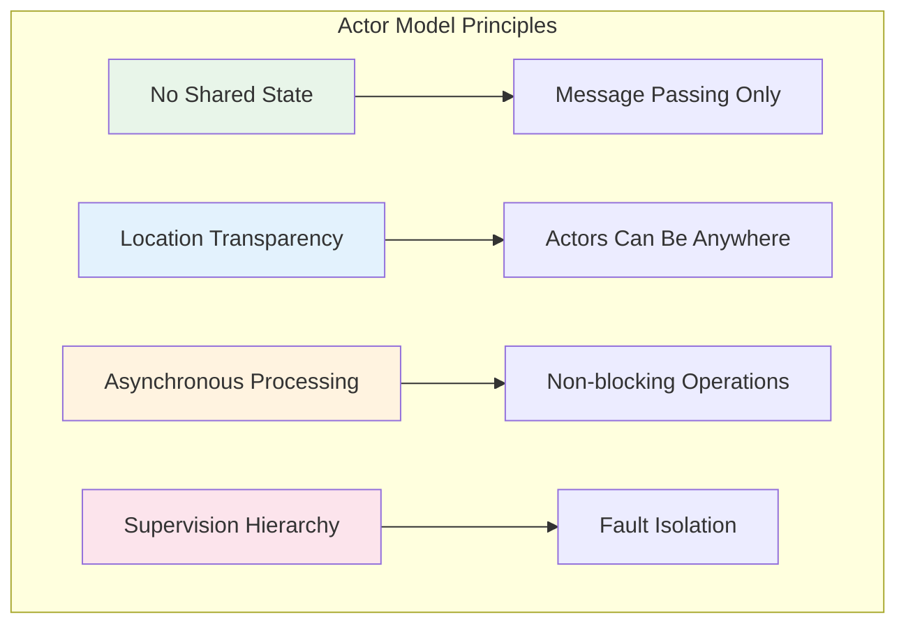
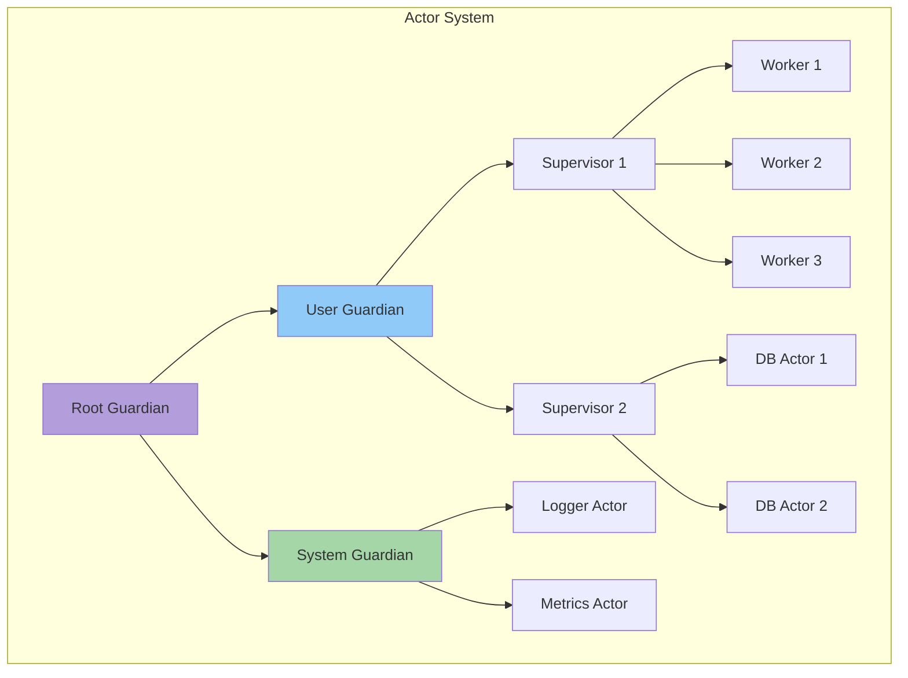
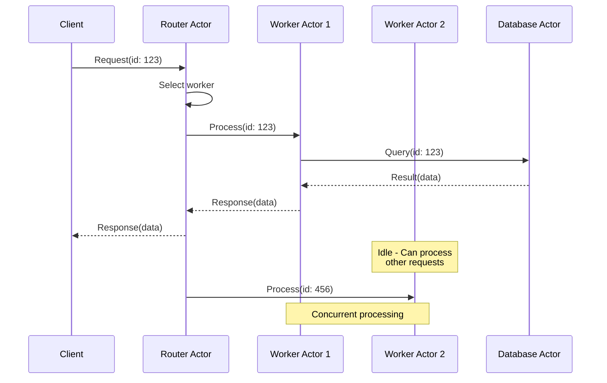
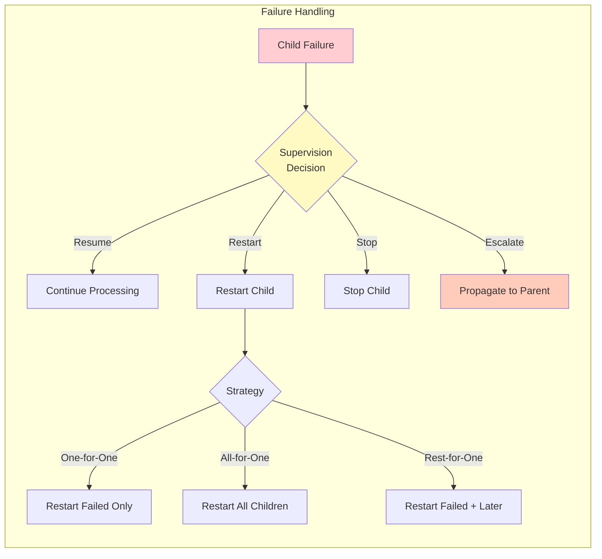
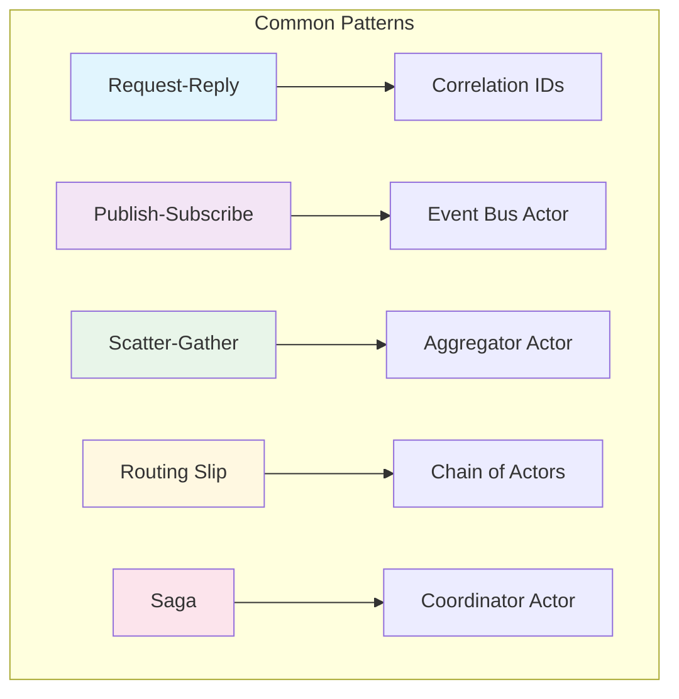

# Actor Model

!!! info "🥉 Bronze Tier Pattern"
    **Legacy pattern with limited modern applicability**
    
    While the Actor Model pioneered important concurrency concepts, modern alternatives like service mesh and serverless provide better solutions for most use cases. The complexity without clear benefits makes it unsuitable for new projects.
    
    **Consider instead:**
    - **Service Mesh** for microservice communication
    - **Serverless Functions** for isolated compute
    - **Event-Driven Architecture** for async processing

> *"Don't communicate by sharing memory; share memory by communicating."* - The actor model takes this principle to its logical extreme.

## Core Principles



## Actor Hierarchy & Supervision



## Message Flow Architecture



## Actor Implementation Components

| Component | Purpose | Key Features |
|-----------|---------|--------------|
| **Mailbox** | Message queue for actor | - FIFO or priority ordering<br/>- Bounded/unbounded options<br/>- Overflow strategies |
| **Message Handler** | Process incoming messages | - Pattern matching<br/>- State transitions<br/>- Side effect isolation |
| **Supervision Strategy** | Handle child failures | - One-for-one restart<br/>- All-for-one restart<br/>- Escalate to parent |
| **Actor Context** | Runtime environment | - Self reference<br/>- Parent/children refs<br/>- System access |
| **Dispatcher** | Thread management | - Thread pool config<br/>- Scheduling strategy<br/>- Blocking I/O handling |

## Concurrency Models Comparison

| Aspect | Actor Model | Thread-Based | CSP (Channels) | Event Loop |
|--------|-------------|--------------|----------------|------------|
| **Communication** | Async messages | Shared memory + locks | Synchronous channels | Callbacks/Promises |
| **Isolation** | Complete | Manual via locks | Channel-based | Single thread |
| **Scalability** | Millions of actors | Limited by OS threads | Good | Limited by one thread |
| **Fault Tolerance** | Built-in supervision | Manual try-catch | Manual | Error callbacks |
| **Debugging** | Message traces | Thread dumps | Channel monitoring | Stack traces |
| **Use Case** | Distributed systems | CPU-bound tasks | Pipeline processing | I/O-bound tasks |

## Supervision Strategies



## Real-World Implementations

### Erlang/Elixir (BEAM VM)

<div class="decision-box">
<h4>WhatsApp Architecture</h4>

- **2M connections/server** using Erlang actors
- **Supervision trees** for 99.999% uptime
- **Hot code swapping** without downtime
- **Pattern**: One actor per user session

</div>

### Akka (JVM)

```scala
// Actor definition
class OrderProcessor extends Actor {
  def receive = {
    case Order(id, items) =>
      val total = items.map(_.price).sum
      sender() ! OrderConfirmation(id, total)
    case Cancel(id) =>
      // Handle cancellation
  }
}

// Supervision
class OrderSupervisor extends Actor {
  override val supervisorStrategy = 
    OneForOneStrategy(maxNrOfRetries = 10) {
      case _: SQLException => Restart
      case _: Exception => Escalate
    }
}
```

### Orleans (Virtual Actors)

| Feature | Orleans Approach | Traditional Actors |
|---------|------------------|-------------------|
| **Lifecycle** | Automatic activation/deactivation | Manual management |
| **Location** | Transparent migration | Fixed placement |
| **Persistence** | Built-in state management | Manual implementation |
| **Concurrency** | Turn-based (single-threaded) | Message interleaving |

## Message Patterns



## When to Use Actor Model

<div class="axiom-box">
<h4>Use Actor Model When:</h4>

✅ **High Concurrency**: Millions of independent entities  
✅ **Fault Tolerance**: Isolated failure domains required  
✅ **Distribution**: Natural fit for distributed systems  
✅ **State Encapsulation**: Each entity owns its state  
✅ **Event-Driven**: Async message processing fits domain  

</div>

<div class="failure-vignette">
<h4>Avoid Actor Model When:</h4>

❌ **Shared State**: Need efficient shared data structures  
❌ **Synchronous Operations**: Require immediate responses  
❌ **Simple CRUD**: Over-engineering for basic operations  
❌ **Data Processing**: Better suited for stream processing  
❌ **Team Expertise**: Steep learning curve for teams  

</div>

## Performance Characteristics

| Metric | Typical Range | Factors |
|--------|---------------|---------|
| **Message Throughput** | 1M-50M msgs/sec | Mailbox implementation, message size |
| **Actor Creation** | 1M actors/sec | Memory allocation, supervision setup |
| **Latency** | 1-100 μs | Message passing overhead, scheduling |
| **Memory/Actor** | 300B-2KB | State size, mailbox depth |

## Anti-Patterns to Avoid

<div class="failure-vignette">
<h4>Common Actor Model Mistakes</h4>

1. **Blocking Operations**: Never block in message handler
2. **Shared Mutable State**: Breaks isolation guarantees  
3. **Synchronous Asks**: Defeats async benefits
4. **Deep Hierarchies**: Hard to reason about failures
5. **Large Messages**: Use references for big data

</div>

## Implementation Checklist

- [ ] **Message Protocol**: Define immutable message types
- [ ] **Supervision Tree**: Design failure handling hierarchy
- [ ] **Mailbox Strategy**: Choose bounded vs unbounded
- [ ] **Dispatcher Config**: Tune thread pools for workload
- [ ] **Monitoring**: Add metrics for mailbox depth, processing time
- [ ] **Testing**: Use test probes for message verification
- [ ] **Deployment**: Plan for actor distribution across nodes

## Related Patterns

- [Event Sourcing](event-sourcing.md) - Natural fit for actor state
- [CQRS](cqrs.md) - Actors for command processing
- [Saga](saga.md) - Coordinate with actor supervisors
- [Circuit Breaker](circuit-breaker.md) - Protect external calls

## References

- [Hewitt's Original Paper (1973)](https://doi.org/10.3233/978-1-58603-578-1-151)
- [Akka Documentation](https://doc.akka.io/)
- [Orleans Documentation](https://dotnet.github.io/orleans/)
- [Erlang OTP Principles](https://erlang.org/doc/design_principles/des_princ.html)