## The Complete Blueprint

Compare-and-Swap (CAS) is a fundamental atomic operation that enables lock-free concurrent programming by atomically comparing a memory location's current value with an expected value and updating it to a new value only if they match. This CPU-level primitive operation forms the foundation of lock-free data structures and algorithms, providing a way to achieve thread-safe operations without the overhead and complexity of traditional locking mechanisms. CAS operations typically complete in nanoseconds and avoid the problems of deadlock, priority inversion, and thread blocking that plague lock-based synchronization. The operation returns a boolean indicating success or failure, allowing algorithms to implement optimistic concurrency where operations proceed assuming success and retry when conflicts occur. While powerful for specific use cases like atomic counters, reference updates, and simple state machines, CAS introduces complexity through the ABA problem (where values change A→B→A, appearing unchanged), potential livelock under high contention, and the need for careful memory ordering semantics. Success with CAS requires understanding when contention levels are appropriate, implementing proper retry strategies with exponential backoff, and designing algorithms that work correctly with the optimistic, retry-based execution model.

```mermaid
graph TB
    subgraph "CAS Operation Flow"
        START[Start CAS Operation]
        READ[Read Current Value]
        COMPARE[Compare with Expected]
        MATCH{Values Match?}
        UPDATE[Atomic Update<br/>Set New Value]
        SUCCESS[Return Success]
        FAILURE[Return Failure]
        RETRY[Retry Logic<br/>Exponential Backoff]
    end
    
    subgraph "Memory State"
        MEMORY[Memory Location<br/>Current Value: X]
        EXPECTED[Expected Value<br/>What we think X is]
        NEW_VAL[New Value<br/>What we want to set]
    end
    
    subgraph "Concurrency Scenarios"
        LOW_CONTENTION[Low Contention<br/>95%+ Success Rate]
        MED_CONTENTION[Medium Contention<br/>70-90% Success Rate]
        HIGH_CONTENTION[High Contention<br/><50% Success Rate]
    end
    
    subgraph "Common Problems"
        ABA[ABA Problem<br/>Value changes A→B→A]
        LIVELOCK[Livelock<br/>Threads keep retrying]
        ORDERING[Memory Ordering<br/>Visibility issues]
    end
    
    START --> READ
    READ --> MEMORY
    MEMORY --> EXPECTED
    READ --> COMPARE
    COMPARE --> MATCH
    MATCH -->|Yes| UPDATE
    MATCH -->|No| FAILURE
    UPDATE --> NEW_VAL
    UPDATE --> SUCCESS
    FAILURE --> RETRY
    RETRY --> START
    
    SUCCESS --> LOW_CONTENTION
    RETRY --> MED_CONTENTION
    MED_CONTENTION --> HIGH_CONTENTION
    
    HIGH_CONTENTION -.-> ABA
    RETRY -.-> LIVELOCK
    UPDATE -.-> ORDERING
    
    style SUCCESS fill:#e8f5e8,stroke:#4caf50
    style FAILURE fill:#ffebee,stroke:#f44336
    style LOW_CONTENTION fill:#e8f5e8,stroke:#4caf50
    style HIGH_CONTENTION fill:#ffebee,stroke:#f44336
    style ABA fill:#fff3e0,stroke:#ff9800
    style LIVELOCK fill:#fff3e0,stroke:#ff9800
    style ORDERING fill:#fff3e0,stroke:#ff9800
```

### What You'll Master

By implementing CAS operations, you'll achieve **lock-free concurrency** that eliminates deadlock risks and thread blocking while providing nanosecond-level atomic operations, **optimistic synchronization** where operations proceed assuming success and handle conflicts through retry mechanisms, **high-performance atomic updates** for counters, flags, and simple data structures without mutex overhead, **understanding of memory models** and the importance of proper memory ordering semantics in concurrent systems, and **advanced concurrency techniques** including hazard pointers, epoch-based reclamation, and lock-free data structure design. You'll master the fundamental building blocks of modern concurrent programming while understanding when traditional locks remain the better choice.

# CAS (Compare-and-Swap)

!!! info "🥈 Silver Tier Pattern"
    **Lock-free power with complexity** • Use for specific performance-critical needs
    
    CAS enables lock-free programming but comes with significant complexity. The ABA problem and debugging challenges mean traditional locks are often the better choice unless you have specific performance requirements and expertise.
    
    **Best For:** High-performance counters, specialized concurrent data structures where contention is moderate

## Essential Question

**How do we achieve thread-safe updates without locks and their overhead?**

## When to Use / When NOT to Use

### ✅ Use When

| Scenario | Example | Impact |
|----------|---------|--------|
| **High-Performance Counters** | Metrics collection with millions of increments/sec | 10x faster than mutex-based counters |
| **Low-Contention Updates** | Configuration flags, status fields | Minimal retry loops, predictable performance |
| **Lock-Free Data Structures** | Concurrent stacks, queues for specialized use cases | Eliminate blocking, improve scalability |

### ❌ DON'T Use When

| Scenario | Why | Alternative |
|----------|-----|-------------|
| **High Contention** | Causes livelock and performance degradation | [Locks with backoff](../coordination/distributed-lock.md) |
| **Complex Operations** | Multi-step updates can't be atomic | [Transactional Memory](../coordination/stm.md) |
| **Team Inexperience** | Subtle bugs are hard to debug | Traditional synchronization primitives |
| **General Purpose** | Locks provide better guarantees | Standard mutex/semaphore patterns |

## Level 1: Intuition (5 min) {#intuition}

### The Story

Imagine updating a shared scoreboard at a sports stadium. The traditional approach requires locking the entire board, making your change, then unlocking it - causing everyone else to wait. CAS is like having a magic marker that only works if the current score matches what you expect. If someone else changed it while you were calculating, your marker won't write, and you need to check the new score and try again.

### Visual Metaphor

### Core Insight

> **Key Takeaway:** CAS trades the guaranteed success of locks for optimistic, retry-based operations that avoid blocking but require careful handling of failures.

### In One Sentence

CAS atomically checks if a memory location contains an expected value and updates it to a new value, returning success/failure without blocking other threads.

## Level 2: Foundation (10 min) {#foundation}

### The Problem Space

<h4>🚨 What Happens With Lock Contention</h4>

**High-Frequency Trading System, 2021**: Order processing system used mutex-protected counters for tracking. Under peak load, lock contention caused 95th percentile latency to spike from 50μs to 15ms.

**Impact**: 12% reduction in successful trades, $8M daily revenue loss during market volatility periods when low latency was critical.

### How It Works

#### CAS Operation Flow

#### Key Components

| Component | Purpose | Responsibility |
|-----------|---------|----------------|
| **Expected Value** | Consistency check | Ensure no intermediate changes occurred |
| **New Value** | Update target | Value to store if comparison succeeds |
| **Return Status** | Operation result | Indicate success/failure for retry logic |
| **Memory Ordering** | Synchronization | Ensure proper visibility across threads |

### Basic Example

## Level 3: Deep Dive (15 min) {#deep-dive}

### Implementation Details

#### CAS vs Traditional Locking

#### Critical Design Decisions

| Decision | Options | Trade-off | Recommendation |
|----------|---------|-----------|----------------|
| **Memory Ordering** | Relaxed Acquire-Release Sequential | Relaxed: Faster, complex reasoning Seq: Slower, easier reasoning | Acquire-Release for most cases |
| **Retry Strategy** | Immediate Backoff Yield | Immediate: Livelock risk Backoff: Better under contention | Exponential backoff |
| **Failure Handling** | Loop until success Limited retries | Loop: Guaranteed progress Limited: Bounded latency | Context-dependent choice |

### Common Pitfalls

<h4>⚠️ Avoid These Mistakes</h4>

1. **ABA Problem**: Value changes A→B→A between read and CAS → Use versioned references
2. **Livelock**: High contention causes infinite retries → Implement exponential backoff
3. **Memory Ordering**: Wrong synchronization semantics → Use acquire-release semantics

### Production Considerations

#### Performance Characteristics

| Metric | Low Contention | Medium Contention | High Contention |
|--------|---------------|-------------------|-----------------|
| Latency | 1-5 ns | 10-50 ns | 100-1000 ns |
| Success Rate | >95% | 70-90% | <50% |
| CPU Usage | Minimal | Moderate | High (spinning) |
| Throughput | Excellent | Good | Poor |

## Level 4: Expert (20 min) {#expert}

### Advanced Techniques

#### Optimization Strategies

1. **Hazard Pointers for Memory Safety**
   - When to apply: Lock-free data structures with pointers
   - Impact: Safe memory reclamation without garbage collection
   - Trade-off: Additional complexity and memory overhead

2. **Tagged Pointers (ABA Solution)**
   - When to apply: Pointer-based data structures
   - Impact: Eliminates ABA problem completely
   - Trade-off: Requires extra bits for version tags

### Lock-Free Data Structures

### Monitoring & Observability

#### Key Metrics to Track

| Metric | Alert Threshold | Dashboard Panel |
|--------|----------------|-----------------|
| CAS Success Rate | < 80% | Success rate histogram |
| Retry Count | > 10 per operation | Retry distribution chart |
| Contention Level | > 50% operations retrying | Contention heat map |
| Livelock Detection | Same thread retrying >1000x | Thread activity timeline |

## Level 5: Mastery (30 min) {#mastery}

### Real-World Case Studies

#### Case Study 1: Intel Performance Primitives

<h4>💡 Production Insights from Intel</h4>

**Challenge**: Atomic counters in high-performance computing libraries needed to scale across 100+ cores

**Implementation**: 
- Hardware-optimized CAS operations
- Hierarchical counting to reduce contention
- NUMA-aware data placement

**Results**: 
- **Scalability**: Linear scaling to 128 cores
- **Performance**: 40x faster than mutex-based counters
- **Adoption**: Used in TensorFlow, NumPy core operations

**Lessons Learned**: CAS excels in read-heavy scenarios with infrequent updates. Careful data placement is critical for NUMA systems.

### Pattern Evolution

#### From Locks to Lock-Free

📄 View mermaid code (9 lines)

#### Future Directions

| Trend | Impact on Pattern | Adaptation Strategy |
|-------|------------------|-------------------|
| **Hardware Transactional Memory** | May replace CAS for complex operations | Hybrid HTM/CAS approaches |
| **Many-Core Processors** | Higher contention scenarios | Hierarchical and distributed algorithms |
| **Persistent Memory** | Need for crash-consistent CAS | Integration with persistent memory primitives |

### Pattern Combinations

#### Works Well With

| Pattern | Combination Benefit | Integration Point |
|---------|-------------------|------------------|
| [Optimistic Locking](../data-management/optimistic-locking.md) | Version-based conflict resolution | CAS for version updates |
| [CRDT](../data-management/crdt.md) | Conflict-free concurrent updates | CAS for operation ordering |
| [Event Sourcing](../data-management/event-sourcing.md) | Append-only conflict resolution | CAS for sequence numbers |

## Quick Reference

### Decision Matrix

### Comparison with Alternatives

| Aspect | CAS | Mutex | Atomic Operations | Transactional Memory |
|--------|-----|-------|-------------------|---------------------|
| **Blocking** | No | Yes | No | No |
| **Deadlock Risk** | No | Yes | No | No |
| **Composability** | Limited | Good | Limited | Excellent |
| **Performance** | Variable | Predictable | Excellent | Good |
| **When to use** | Low contention | High contention | Simple operations | Complex operations |

### Implementation Checklist

**Pre-Implementation**
- [ ] Measured contention levels in target scenario
- [ ] Verified operations are simple enough for CAS
- [ ] Assessed team expertise with lock-free programming
- [ ] Considered ABA problem implications

**Implementation**
- [ ] Used proper memory ordering semantics
- [ ] Implemented retry logic with backoff
- [ ] Added contention monitoring
- [ ] Tested under realistic load patterns

**Post-Implementation**
- [ ] Validated performance improvements over locks
- [ ] Monitored for livelock scenarios
- [ ] Created debugging and profiling guides
- [ ] Documented memory model assumptions

### Related Resources

- :material-book-open-variant:{ .lg .middle } **Related Patterns**
    
    ---
    
    - [Optimistic Locking](../data-management/optimistic-locking.md) - Database-level CAS
    - [CRDT](../data-management/crdt.md) - Conflict-free updates
    - [Atomic Broadcast](../coordination/atomic-broadcast.md) - Ordered operations

- :material-flask:{ .lg .middle } **Fundamental Laws**
    
    ---
    
    - [Law 2: Asynchronous Reality](../../core-principles/laws/asynchronous-reality.md) - Non-blocking nature
    - [Law 4: Multidimensional Optimization](../../core-principles/laws/multidimensional-optimization.md) - Performance tradeoffs

- :material-pillar:{ .lg .middle } **Foundational Pillars**
    
    ---
    
    - [Work Distribution](../../core-principles/pillars/work-distribution.md) - Lock-free task coordination
    - [State Distribution](../../core-principles/pillars/state-distribution.md) - Atomic state updates

- :material-tools:{ .lg .middle } **Implementation Guides**
    
    ---
    
    - [Lock-Free Programming Guide](../../architects-handbook/implementation-playbooks/guides/lock-free-programming.md)
    - [Memory Model Tutorial](../../architects-handbook/implementation-playbooks/guides/memory-models.md)
    - [Performance Testing Guide](../../architects-handbook/implementation-playbooks/guides/concurrency-testing.md)

