# CAS (Compare-and-Swap)

!!! warning "🥈 Silver Tier Pattern"
    **Lock-Free Power with Complexity** • Use for specific performance needs
    
    CAS enables lock-free programming but comes with significant complexity. The ABA problem and debugging challenges mean locks are often the better choice unless you have specific performance requirements.

## Overview

Compare-and-Swap (CAS) is a fundamental atomic operation used in concurrent programming to achieve synchronization without locks. It compares the contents of a memory location with a given value and, only if they are the same, modifies the contents to a new value - all in a single atomic operation.

CAS is the foundation of many lock-free and wait-free data structures, enabling high-performance concurrent systems by avoiding the overhead and complexity of traditional locking mechanisms.

## Core Concepts

### How CAS Works

```mermaid
sequenceDiagram
    participant Thread1 as Thread 1
    participant Memory as Memory Location
    participant Thread2 as Thread 2
    
    Note over Memory: Current value: 10
    
    Thread1->>Memory: Read value (10)
    Thread2->>Memory: Read value (10)
    
    Thread1->>Memory: CAS(10, 15)
    Note over Memory: Compare: 10 == 10 ✓
    Note over Memory: Swap: value = 15
    Memory-->>Thread1: Success (true)
    
    Thread2->>Memory: CAS(10, 20)
    Note over Memory: Compare: 15 == 10 ✗
    Memory-->>Thread2: Failure (false)
    
    Thread2->>Memory: Read value (15)
    Thread2->>Memory: CAS(15, 20)
    Note over Memory: Compare: 15 == 15 ✓
    Note over Memory: Swap: value = 20
    Memory-->>Thread2: Success (true)
```



### The ABA Problem

```mermaid
graph TB
    subgraph "ABA Problem Timeline"
        T1[Thread 1 reads A]
        T2[Thread 2: A→B→A]
        T3[Thread 1 CAS succeeds<br/>but misses intermediate state]
        
        T1 --> T2
        T2 --> T3
    end
    
    subgraph "Solution: Tagged Pointers"
        P1[Value: A, Tag: 1]
        P2[Value: B, Tag: 2]
        P3[Value: A, Tag: 3]
        
        P1 --> P2
        P2 --> P3
    end
```



## Implementation Examples

### Basic CAS Operations

```java
// Java AtomicReference example
public class CASCounter {
    private AtomicLong value = new AtomicLong(0);
    
    public long increment() {
        long current, next;
        do {
            current = value.get();
            next = current + 1;
        } while (!value.compareAndSet(current, next));
        return next;
    }
    
    public long add(long delta) {
        long current, next;
        do {
            current = value.get();
            next = current + delta;
        } while (!value.compareAndSet(current, next));
        return next;
    }
}
```

### Lock-Free Stack

```cpp
// C++ lock-free stack using CAS
template <typename T>
class LockFreeStack {
private:
    struct Node {
        T data;
        Node* next;
        Node(T val) : data(std::move(val)), next(nullptr) {}
    };
    
    std::atomic<Node*> head{nullptr};
    
public:
    void push(T item) {
        Node* new_node = new Node(std::move(item));
        Node* current_head;
        
        do {
            current_head = head.load();
            new_node->next = current_head;
        } while (!head.compare_exchange_weak(current_head, new_node));
    }
    
    std::optional<T> pop() {
        Node* current_head;
        Node* new_head;
        
        do {
            current_head = head.load();
            if (current_head == nullptr) {
                return std::nullopt;
            }
            new_head = current_head->next;
        } while (!head.compare_exchange_weak(current_head, new_head));
        
        T result = std::move(current_head->data);
        delete current_head;
        return result;
    }
};
```

### Lock-Free Queue (Michael & Scott Algorithm)

```java
public class LockFreeQueue<T> {
    private static class Node<T> {
        final AtomicReference<T> item;
        final AtomicReference<Node<T>> next;
        
        Node(T item) {
            this.item = new AtomicReference<>(item);
            this.next = new AtomicReference<>(null);
        }
    }
    
    private final AtomicReference<Node<T>> head;
    private final AtomicReference<Node<T>> tail;
    
    public LockFreeQueue() {
        Node<T> dummy = new Node<>(null);
        head = new AtomicReference<>(dummy);
        tail = new AtomicReference<>(dummy);
    }
    
    public void enqueue(T item) {
        Node<T> newNode = new Node<>(item);
        while (true) {
            Node<T> last = tail.get();
            Node<T> next = last.next.get();
            
            if (last == tail.get()) {
                if (next == null) {
                    // Try to link new node at the end
                    if (last.next.compareAndSet(null, newNode)) {
                        // Update tail pointer
                        tail.compareAndSet(last, newNode);
                        return;
                    }
                } else {
                    // Help advance tail
                    tail.compareAndSet(last, next);
                }
            }
        }
    }
    
    public T dequeue() {
        while (true) {
            Node<T> first = head.get();
            Node<T> last = tail.get();
            Node<T> next = first.next.get();
            
            if (first == head.get()) {
                if (first == last) {
                    if (next == null) {
                        return null; // Queue is empty
                    }
                    // Help advance tail
                    tail.compareAndSet(last, next);
                } else {
                    // Read value before CAS
                    T value = next.item.get();
                    if (head.compareAndSet(first, next)) {
                        return value;
                    }
                }
            }
        }
    }
}
```

## Advanced Techniques

### Double-Width CAS (DCAS)

```cpp
// Simulated DCAS using LL/SC or hardware transactional memory
template <typename T>
class DoubleWidthCAS {
    struct Pair {
        T first;
        T second;
        uint64_t version;
    };
    
    std::atomic<Pair> data;
    
public:
    bool compareAndSwap2(T expected1, T expected2, T new1, T new2) {
        Pair current = data.load();
        if (current.first == expected1 && current.second == expected2) {
            Pair new_pair{new1, new2, current.version + 1};
            return data.compare_exchange_strong(current, new_pair);
        }
        return false;
    }
};
```

### Hazard Pointers for Memory Management

```cpp
class HazardPointer {
private:
    static thread_local std::atomic<void*>* hazard_pointer;
    static std::vector<std::atomic<void*>*> all_hazard_pointers;
    static std::mutex hp_mutex;
    
public:
    template<typename T>
    T* acquire(std::atomic<T*>& ptr) {
        T* p;
        do {
            p = ptr.load();
            hazard_pointer->store(p);
            // Memory fence to ensure the store is visible
            std::atomic_thread_fence(std::memory_order_seq_cst);
        } while (p != ptr.load());
        return p;
    }
    
    void release() {
        hazard_pointer->store(nullptr);
    }
    
    template<typename T>
    void retire(T* ptr) {
        // Check if any hazard pointer points to this object
        for (auto& hp : all_hazard_pointers) {
            if (hp->load() == ptr) {
                // Defer deletion
                defer_delete(ptr);
                return;
            }
        }
        // Safe to delete immediately
        delete ptr;
    }
};
```

## Use Cases

### 1. High-Performance Counters

```go
// Go atomic counter implementation
type Counter struct {
    value int64
}

func (c *Counter) Increment() int64 {
    return atomic.AddInt64(&c.value, 1)
}

func (c *Counter) Add(delta int64) int64 {
    return atomic.AddInt64(&c.value, delta)
}

func (c *Counter) CompareAndSwap(old, new int64) bool {
    return atomic.CompareAndSwapInt64(&c.value, old, new)
}

// Usage in metrics collection
type Metrics struct {
    requests  Counter
    errors    Counter
    latencies Counter
}

func (m *Metrics) RecordRequest(latency int64) {
    m.requests.Increment()
    m.latencies.Add(latency)
}
```

### 2. Lock-Free Memory Pools

```rust
use std::sync::atomic::{AtomicPtr, Ordering};
use std::ptr;

struct Block {
    next: AtomicPtr<Block>,
    data: [u8; 4096],
}

pub struct MemoryPool {
    free_list: AtomicPtr<Block>,
}

impl MemoryPool {
    pub fn allocate(&self) -> Option<*mut Block> {
        loop {
            let head = self.free_list.load(Ordering::Acquire);
            if head.is_null() {
                return None; // Pool exhausted
            }
            
            unsafe {
                let next = (*head).next.load(Ordering::Relaxed);
                if self.free_list.compare_exchange_weak(
                    head, next,
                    Ordering::Release,
                    Ordering::Acquire
                ).is_ok() {
                    return Some(head);
                }
            }
            // CAS failed, retry
        }
    }
    
    pub fn deallocate(&self, block: *mut Block) {
        unsafe {
            loop {
                let head = self.free_list.load(Ordering::Acquire);
                (*block).next.store(head, Ordering::Relaxed);
                
                if self.free_list.compare_exchange_weak(
                    head, block,
                    Ordering::Release,
                    Ordering::Acquire
                ).is_ok() {
                    return;
                }
                // CAS failed, retry
            }
        }
    }
}
```

### 3. Optimistic Locking in Databases

```python
class OptimisticLockRecord:
    """Database record with version-based optimistic locking."""
    
    def __init__(self, id, data, version=0):
        self.id = id
        self.data = data
        self.version = version
    
    def update(self, new_data, db_connection):
        """Update with optimistic concurrency control."""
# This simulates a CAS operation at the database level
        result = db_connection.execute(
            """
            UPDATE records 
            SET data = %s, version = version + 1 
            WHERE id = %s AND version = %s
            """,
            (new_data, self.id, self.version)
        )
        
        if result.rowcount == 0:
            raise OptimisticLockException("Version mismatch - retry needed")
        
        self.data = new_data
        self.version += 1
        return True

# Usage pattern
def update_with_retry(record, new_data, db_conn, max_retries=3):
    for attempt in range(max_retries):
        try:
# Read current version
            current = db_conn.fetch_one(
                "SELECT data, version FROM records WHERE id = %s",
                (record.id,)
            )
            
# Apply business logic
            updated_data = transform_data(current.data, new_data)
            
# Try to update
            record.version = current.version
            record.update(updated_data, db_conn)
            return True
            
        except OptimisticLockException:
            if attempt == max_retries - 1:
                raise
            time.sleep(0.1 * (2 ** attempt))  # Exponential backoff
    
    return False
```

## Performance Considerations

### CAS vs Locks Performance


### When to Use CAS

**Ideal Scenarios:**
- Low to moderate contention
- Simple data structures (counters, flags)
- Read-heavy workloads
- Latency-sensitive operations

**Avoid CAS When:**
- High contention expected
- Complex multi-step operations
- Need fairness guarantees
- Memory ordering is complex

## Common Pitfalls

### 1. The ABA Problem
```java
// Vulnerable to ABA
class Node {
    int value;
    Node next;
}

// Solution: Use tagged pointers or hazard pointers
class TaggedNode {
    int value;
    AtomicStampedReference<Node> next;
}
```

### 2. Livelock Under Contention
```java
// Bad: Tight retry loop causes livelock
while (!cas(expected, newValue)) {
    // Immediate retry causes contention
}

// Good: Exponential backoff
int backoff = 1;
while (!cas(expected, newValue)) {
    Thread.sleep(backoff);
    backoff = Math.min(backoff * 2, MAX_BACKOFF);
}
```

### 3. Memory Ordering Issues
```cpp
// Incorrect: Relaxed ordering may reorder operations
value.store(42, std::memory_order_relaxed);
flag.store(true, std::memory_order_relaxed);

// Correct: Proper memory ordering
value.store(42, std::memory_order_relaxed);
flag.store(true, std::memory_order_release);
```

## Best Practices

1. **Use Standard Libraries**: Prefer `std::atomic`, `java.util.concurrent.atomic`
2. **Handle Spurious Failures**: Always retry CAS operations in a loop
3. **Avoid Complex Logic**: Keep CAS operations simple and fast
4. **Consider Alternatives**: Sometimes locks are simpler and sufficient
5. **Test Under Load**: CAS behavior changes dramatically under contention
6. **Profile Performance**: Measure actual performance, don't assume

## Related Patterns
- [Optimistic Locking](patterns/optimistic-locking) - Database-level CAS
- [Event Sourcing](patterns/event-sourcing) - Append-only updates avoid conflicts
- Actor Model (Coming Soon) - Alternative concurrency model
- [CRDT](patterns/crdt) - Conflict-free replicated data types

## References
- [The Art of Multiprocessor Programming](https://www.elsevier.com/books/the-art-of-multiprocessor-programming/herlihy/978-0-12-415950-1)
- [C++ Concurrency in Action](https://www.manning.com/books/c-plus-plus-concurrency-in-action)
- [Java Concurrency in Practice](https://jcip.net/)
- [Lock-Free Data Structures](https://www.cl.cam.ac.uk/research/srg/netos/papers/2001-caslists.pdf)

> **Note**: This pattern documentation is planned for future development with more production examples and advanced techniques.