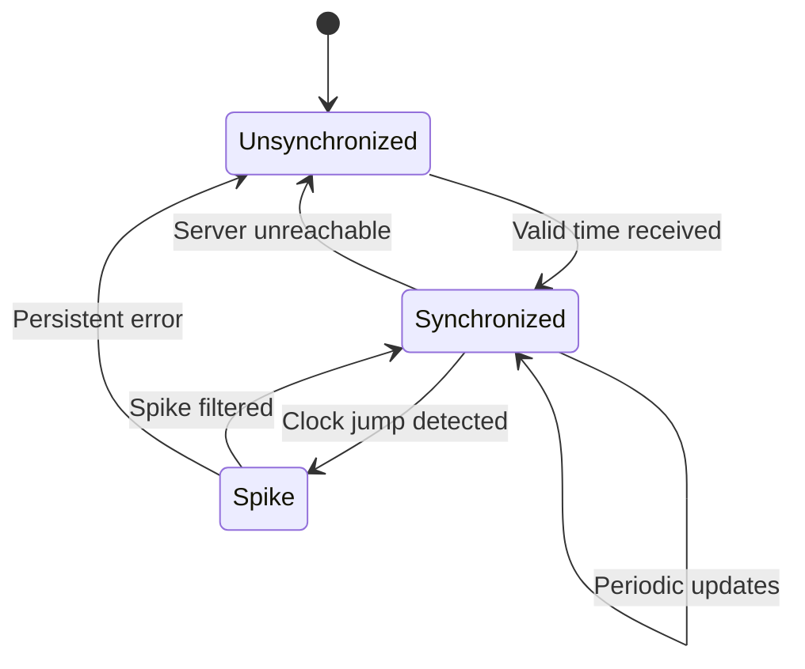

# Clock Synchronization

!!! info "🥈 Silver Tier Pattern"
    **Necessary Evil for Time-Based Systems** • Specialized solution for wall-clock coordination
    
    Clock synchronization is fundamental for systems requiring wall-clock time consistency. While perfect synchronization is physically impossible, protocols like NTP and PTP provide bounded accuracy for most use cases.
    
    **Best For:** Distributed databases, audit systems, financial transactions, multi-node coordination

## Essential Question

**How do you maintain consistent time across distributed nodes when clocks drift and network delays are variable?**

## When to Use / When NOT to Use

### ✅ Use When

| Scenario | Example | Impact |
|----------|---------|--------|
| Audit/Compliance Requirements | Financial trading logs must be timestamped | Legal compliance and forensic analysis |
| Cross-System Event Correlation | Correlating logs across microservices | Debugging distributed system failures |
| Time-Based Business Logic | SLA calculations, billing windows | Accurate business metrics and billing |
| Global Distributed Databases | Multi-region consistency with timestamps | Consistent global state management |

### ❌ DON'T Use When

| Scenario | Why | Alternative |
|----------|-----|-------------|
| Pure Event Ordering | Logical ordering sufficient | [Logical Clocks](../coordination/logical-clocks.md) |
| High-Performance Local Systems | Synchronization overhead unnecessary | Local monotonic clocks |
| Causality Tracking | Vector clocks more accurate | [Vector Clocks](../data-management/vector-clocks.md) |
| Simple Request-Response | No coordination needed | Application-level timestamps |

## Level 1: Intuition (5 min) {#intuition}

### The Orchestra Analogy

Clock synchronization is like getting an orchestra to play in perfect time:
- **Conductor (Time Server)**: Provides the beat for everyone
- **Musicians (Nodes)**: Try to stay synchronized with conductor
- **Sound Delay**: Musicians far from conductor hear beat later
- **Tempo Drift**: Each musician's internal sense of timing drifts
- **Good Enough**: Perfect sync impossible, but close enough works

### Visual Metaphor

### Core Insight

> **Key Takeaway:** Perfect synchronization is physically impossible, but bounded accuracy is achievable for most practical purposes.

### In One Sentence

Clock Synchronization maintains approximate time consistency across distributed nodes by periodically adjusting local clocks based on authoritative time sources, accepting that perfect synchronization is impossible due to network delays and relativity.

## Level 2: Foundation (10 min) {#foundation}

### The Problem Space

<h4>🚨 What Happens Without Clock Synchronization</h4>

**Company X, 2019**: Financial trading firm's clocks drifted by 3 seconds across data centers. Trade timestamps became inconsistent, leading to regulatory violations and a $50M fine when audit showed impossible transaction sequences.

**Impact**: Loss of trading license for 6 months, reputation damage, and implementation of GPS-synchronized atomic clocks costing $2M.

### How It Works

#### Architecture Overview

#### Key Components

| Component | Purpose | Responsibility |
|-----------|---------|----------------|
| **Time Source** | Authoritative reference | GPS, atomic clock, radio signal |
| **Time Server** | Distribute time | NTP daemon, PTP master |
| **Sync Client** | Local time adjustment | Clock correction, drift compensation |
| **Network Stack** | Transport timestamps | Handle delays, measure RTT |

### Basic Example

📄 View decision logic

# Simplified NTP client implementation
def sync_with_time_server(server_address):
    """Basic time synchronization with NTP protocol"""
    # Record timestamps (NTP 4-timestamp model)
    t1 = time.time()  # Client send time
    server_time = request_time(server_address)  # t2, t3 from server
    t4 = time.time()  # Client receive time
    
    # Calculate network delay and clock offset
    delay = (t4 - t1) - (server_time['t3'] - server_time['t2'])
    offset = ((server_time['t2'] - t1) + (server_time['t3'] - t4)) / 2
    
    # Gradual clock adjustment (slewing)
    if abs(offset) < 0.5:  # Small adjustments
        adjust_clock_rate(offset)
    else:  # Large adjustments
        step_clock(offset)
    
    return offset, delay / 2

## Level 3: Deep Dive (15 min) {#deep-dive}

### Implementation Details

#### NTP Protocol Timing Sequence

#### NTP Protocol State Machine

📄 View mermaid code (8 lines)

#### Critical Design Decisions

| Decision | Options | Trade-off | Recommendation |
|----------|---------|-----------|----------------|
| **Sync Frequency** | 1-60 seconds 1-10 minutes | Frequent: Higher overhead Rare: More drift | 64 seconds (NTP default) |
| **Adjustment Method** | Step change Gradual slew | Step: Fast but disruptive Slew: Smooth but slow | Slew for small changes |
| **Server Count** | Single server Multiple servers | Single: Fast but fragile Multiple: Robust but complex | 3-5 servers for redundancy |
| **Accuracy Target** | Microseconds Milliseconds | μs: Expensive hardware ms: Standard network | Match business requirements |

### Common Pitfalls

<h4>⚠️ Avoid These Mistakes</h4>

1. **Ignoring Network Asymmetry**: Assuming equal send/receive delays → Use multiple measurements and statistical filtering
2. **VM Clock Drift**: Virtual machines can "time warp" → Monitor for sudden jumps and implement VM-aware sync
3. **Leap Second Handling**: UTC has discontinuities → Plan for leap seconds with smearing or stepping strategies

### Production Considerations

#### Performance Characteristics

| Metric | NTP (Internet) | NTP (LAN) | PTP | GPS |
|--------|---------------|-----------|-----|-----|
| **Typical Accuracy** | 1-50ms | 0.1-1ms | 1-100μs | 100ns |
| **Best Case** | 1ms | 10μs | 10ns | 10ns |
| **Sync Interval** | 64s | 16s | 1s | 1s |
| **Hardware Cost** | $0 | $100 | $1000 | $5000 |

## Level 4: Expert (20 min) {#expert}

### Advanced Techniques

#### 1. **Clock Filtering and Selection**
   - When to apply: Multiple time sources available
   - Impact: 90% improvement in accuracy through outlier rejection
   - Trade-off: Increased complexity and convergence time

#### 2. **Frequency Compensation**
   - When to apply: Predictable clock drift patterns
   - Impact: 10x reduction in sync frequency needed
   - Trade-off: Requires long-term drift measurement

### Scaling Considerations

### Key Metrics

| Metric | Threshold | Action |
|--------|-----------|--------|
| **Clock Offset** | > 100ms | Alert |
| **Sync Success** | < 95% | Check network |
| **Network Delay** | > 500ms | Find closer server |
| **Drift** | > 500ppm | Replace hardware |

## Level 5: Mastery (30 min) {#mastery}

### Real-World Case Studies

#### Case Study 1: Google Spanner TrueTime

<h4>💡 Production Insights from Google</h4>

**Challenge**: Global consistency for distributed SQL database

**Implementation**: TrueTime API provides time intervals with bounded uncertainty, backed by GPS and atomic clocks

**Results**: 
- **Consistency**: Externally consistent transactions globally
- **Uncertainty**: < 7ms average, < 10ms 99.9th percentile
- **Scale**: Powers Google's global services with millions of QPS

**Lessons Learned**: Explicit uncertainty bounds enable correct distributed algorithms, expensive but worth it for global consistency

### Pattern Evolution

#### Migration from Basic NTP

📄 View mermaid code (7 lines)

#### Future Directions

| Trend | Impact on Pattern | Adaptation Strategy |
|-------|------------------|-------------------|
| **Edge Computing** | More distributed time sources | Local GPS, mesh synchronization |
| **5G Networks** | Sub-millisecond requirements | Hardware-assisted PTP |
| **Quantum Networks** | Fundamental timing changes | Research quantum time sync |

### Pattern Combinations

#### Works Well With

| Pattern | Combination Benefit | Integration Point |
|---------|-------------------|------------------|
| [Consensus](../coordination/consensus.md) | Timestamp-ordered proposals | Leader election with time bounds |
| [Event Sourcing](../data-management/event-sourcing.md) | Consistent event timestamps | Global event ordering |
| [Distributed Locking](../coordination/distributed-lock.md) | Time-based lease expiration | Lease timeout coordination |

## Quick Reference

### Decision Matrix

### Comparison with Alternatives

| Aspect | Physical Clock Sync | Logical Clocks | Vector Clocks | HLC |
|--------|-------------------|---------------|---------------|-----|
| **Wall-clock Accuracy** | High | None | None | Medium |
| **Causality Preservation** | Weak | Strong | Perfect | Strong |
| **Network Overhead** | Medium | Low | High | Medium |
| **Implementation Complexity** | High | Low | Medium | Medium |
| **When to use** | Audit, correlation | Event ordering | Causality tracking | Both needs |

### Implementation Checklist

**Pre-Implementation**
- [ ] Determined accuracy requirements
- [ ] Assessed network reliability
- [ ] Chosen synchronization protocol
- [ ] Planned monitoring strategy

**Implementation**
- [ ] Deployed time servers
- [ ] Configured client synchronization
- [ ] Implemented drift compensation
- [ ] Added leap second handling

**Post-Implementation**
- [ ] Monitoring clock offsets
- [ ] Testing failure scenarios
- [ ] Documenting procedures
- [ ] Training operations team

### Related Resources

- :material-book-open-variant:{ .lg .middle } **Related Patterns**
    
    ---
    
    - [Logical Clocks](../coordination/logical-clocks.md) - Event ordering without time
    - [HLC](../coordination/hlc.md) - Hybrid physical-logical approach  
    - [Generation Clock](../coordination/generation-clock.md) - Epoch-based coordination

- :material-flask:{ .lg .middle } **Fundamental Laws**
    
    ---
    
    - [Law 2: Asynchronous Reality](../../core-principles/laws/asynchronous-reality.md) - Network delays
    - [Law 1: Correlated Failure](../../core-principles/laws/correlated-failure.md) - Time server failures

- :material-pillar:{ .lg .middle } **Foundational Pillars**
    
    ---
    
    - [Truth Distribution](../../core-principles/pillars/truth-distribution.md) - Consistent time truth
    - [Control Distribution](../../core-principles/pillars/control-distribution.md) - Coordinated control

- :material-tools:{ .lg .middle } **Implementation Guides**
    
    ---
    
    - [NTP Setup Guide](../../architects-handbook/implementation-playbooks/guides/ntp-setup.md)
    - [PTP Configuration](../../architects-handbook/implementation-playbooks/guides/ptp-config.md)
    - [Time Monitoring](../../architects-handbook/implementation-playbooks/guides/time-monitoring.md)

