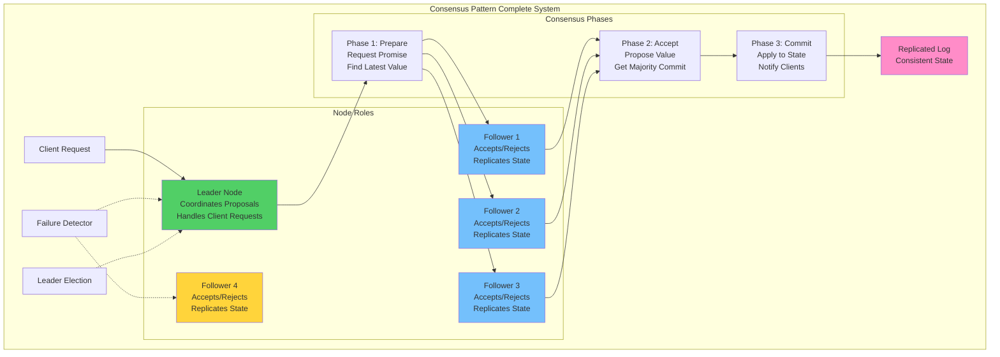

## The Complete Blueprint

Consensus patterns enable distributed systems to achieve agreement on shared state even in the presence of network partitions, node failures, and message delays, forming the foundation for strongly consistent distributed databases, configuration management systems, and leader election protocols. These algorithms solve one of the most fundamental problems in distributed computing: how multiple nodes can agree on a single value or sequence of operations while tolerating failures and maintaining system availability. At the heart of consensus lies the challenge of the CAP theorem - balancing consistency, availability, and partition tolerance - with algorithms like Raft, Paxos, and PBFT providing different trade-offs and guarantees. The consensus process typically involves a leader or proposer node coordinating with a majority quorum of followers or acceptors to ensure that once a value is chosen, it remains stable and consistent across all nodes. Modern implementations power critical infrastructure including etcd for Kubernetes configuration, Apache Kafka's controller election, CockroachDB's transaction coordination, and blockchain networks where consensus ensures the immutable ordering of transactions across a decentralized network of untrusted nodes.

### What You'll Master

!!! success "By understanding Consensus patterns, you'll be able to:"
    - **Achieve strong consistency** - Ensure all nodes agree on the same state and ordering
    - **Handle network partitions** - Maintain correctness even when nodes can't communicate
    - **Implement leader election** - Coordinate distributed systems with elected coordinators
    - **Build distributed databases** - Create systems with ACID guarantees across multiple nodes
    - **Manage configuration systems** - Ensure consistent configuration across distributed services
    - **Design fault-tolerant systems** - Build systems that continue operating despite node failures

# Consensus Patterns

Consensus algorithms like Raft and Paxos

## See Also

- [Eventual Consistency](/pattern-library/data-management/eventual-consistency)
- [Event Streaming](/pattern-library/architecture/event-streaming)
- [Rate Limiting Pattern](/pattern-library/scaling/rate-limiting)
