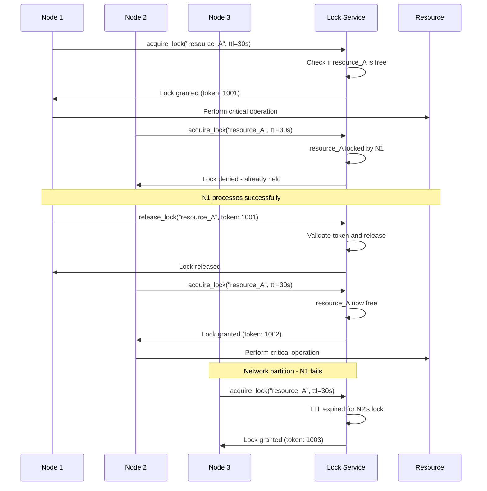

## The Complete Blueprint

Distributed Lock is the cornerstone coordination pattern that enables safe mutual exclusion across multiple nodes in distributed systems, preventing the chaos that ensues when multiple processes simultaneously access shared resources. This pattern operates by establishing a centralized authority (lock service) that grants exclusive access tokens to requesting nodes, ensuring that only one node can hold a lock on a specific resource at any given time. The pattern's architecture involves three critical components: a lock acquisition mechanism that atomically checks and sets lock ownership, a time-to-live (TTL) system that automatically releases locks if holders fail, and fencing tokens that prevent split-brain scenarios where old lock holders continue operating after network partitions. Beyond simple mutual exclusion, distributed locks serve as the foundation for leader election, resource scheduling, and critical section coordination in systems ranging from database cluster management to distributed job processing, making them essential for maintaining data consistency and preventing race conditions in modern distributed architectures.



### What You'll Master

- **Lock Service Architecture**: Design and implement robust lock services using Redis, etcd, or database-backed approaches with proper consistency guarantees
- **Fencing Token Implementation**: Prevent split-brain scenarios through monotonic token generation and validation at the resource level
- **TTL and Lease Management**: Configure automatic lock expiration and renewal mechanisms that balance safety with availability
- **Lock Hierarchy Design**: Structure lock ordering and dependencies to prevent deadlocks in complex resource coordination scenarios
- **High Availability Patterns**: Implement lock service clustering, failover, and partitioning strategies for production resilience
- **Performance Optimization**: Tune lock acquisition latency, contention handling, and throughput for high-scale distributed systems

# Distributed Lock Pattern

!!! success "🏆 Gold Standard Pattern"
    **Safe mutual exclusion in distributed systems with automatic failover** • Google, Netflix, Uber proven at scale
    
    Essential for coordinating access to shared resources when multiple nodes need exclusive access. Prevents race conditions and ensures consistency across distributed systems.
    
    **Key Success Metrics:**
    - Google Chubby: 99.99% availability for BigTable/GFS coordination
    - Netflix: Sub-second failover for 1000+ microservices
    - Uber: <10ms lock acquisition for 15M+ daily trips

## Essential Question

**How do we ensure only one process can access a shared resource across multiple distributed nodes?**

## When to Use / When NOT to Use

### ✅ Use When

| Scenario | Example | Impact |
|----------|---------|--------|
| Resource coordination | Database schema migrations | Prevents corruption from concurrent changes |
| Leader election | Active-passive service setup | Ensures single decision maker |
| Critical sections | Inventory updates in e-commerce | Prevents overselling |
| Distributed cron jobs | Daily report generation | Prevents duplicate executions |

### ❌ DON'T Use When

| Scenario | Why | Alternative |
|----------|-----|-------------|
| Local-only resources | Single node, no coordination needed | Thread locks, mutexes |
| High-frequency operations | Lock overhead > operation time | Lock-free algorithms, CRDT |
| Eventually consistent is OK | Temporary inconsistency acceptable | Eventual consistency patterns |
| Read-heavy workloads | Most operations don't conflict | Read-write locks, optimistic locking |

## Level 1: Intuition (5 min) {#intuition}

### The Story

A distributed lock is like a public bathroom with a special key system. Multiple people (nodes) want to use the same facility (shared resource), but only one person can be inside at a time. The key (lock) ensures exclusive access, but what happens if someone faints inside? That's why we need a master key (timeout) and a way to verify the person holding the key is still alive.

### Visual Metaphor

### Core Insight

> **Key Takeaway:** The hardest part isn't getting the lock—it's ensuring it's released when the holder fails.

### In One Sentence

Distributed Lock **ensures mutual exclusion** by **coordinating through a central authority** to achieve **safe resource access across multiple nodes**.

## Level 2: Foundation (10 min) {#foundation}

### The Problem Space

<div class="failure-vignette">
<h4>🚨 What Happens Without This Pattern</h4>

**E-commerce Giant, Black Friday 2019**: During peak shopping, multiple inventory services simultaneously updated the same product stock without coordination.

**Impact**: 10,000 oversold items, $2.3M in compensation costs, and 48 hours to reconcile inventory across 15 data centers.
</div>

### How It Works

#### Architecture Overview

#### Key Components

| Component | Purpose | Responsibility |
|-----------|---------|----------------|
| Lock Service | Coordination hub | Grant/revoke locks, manage timeouts |
| Lock Storage | State persistence | Store lock ownership and metadata |
| Lease Manager | Automatic cleanup | Handle TTL expiration and renewals |
| Fencing Token Store | Split-brain prevention | Generate monotonic tokens for safety |

### Basic Example

<details>
<summary>📄 View python code (10 lines)</summary>

```python
## Minimal distributed lock implementation
def acquire_lock(resource_id, ttl_seconds=30):
    """Acquire exclusive lock with automatic expiration"""
    lock_key = f"lock:{resource_id}"
    owner_id = generate_unique_id()
    
    # Atomic set-if-not-exists with TTL
    if redis.set(lock_key, owner_id, nx=True, ex=ttl_seconds):
        return LockHandle(lock_key, owner_id)
    return None  # Lock already held
```

</details>

## Level 3: Deep Dive (15 min) {#deep-dive}

### Implementation Details

#### State Management

#### Critical Design Decisions

| Decision | Options | Trade-off | Recommendation |
|----------|---------|-----------|----------------|
| **Lock Backend** | Redis<br>Database<br>etcd/ZooKeeper | Redis: Fast but less safe<br>DB: ACID but SPOF<br>etcd: Safe but slower | etcd for critical, Redis for performance |
| **Timeout Strategy** | Fixed TTL<br>Renewable lease | Fixed: Simple but inflexible<br>Renewable: Complex but adaptive | Renewable for long operations |
| **Failure Detection** | Heartbeat<br>Passive expiry | Heartbeat: Active monitoring<br>Passive: Simpler but slower | Passive for most cases |

### Common Pitfalls

<div class="decision-box">
<h4>⚠️ Avoid These Mistakes</h4>

1. **Clock Dependency**: Relying on synchronized clocks → Use logical timestamps or consensus
2. **Process Pauses**: GC pauses causing lock expiry → Implement fencing tokens
3. **Split Brain**: Two nodes thinking they hold the lock → Use quorum-based decisions
</div>

### Production Considerations

#### Performance Characteristics

| Metric | Redis Locks | Database Locks | etcd Locks |
|--------|-------------|----------------|------------|
| Latency | 1-5ms | 10-50ms | 10-100ms |
| Throughput | 10K+ ops/sec | 1K ops/sec | 5K ops/sec |
| Consistency | Eventual | Strong | Strong |
| Fault Tolerance | Moderate | Low | High |

## Level 4: Expert (20 min) {#expert}

### Advanced Techniques

#### Optimization Strategies

1. **Lock Hierarchies**
   - When to apply: Complex resource dependencies
   - Impact: Prevents deadlocks, improves ordering
   - Trade-off: Added complexity in lock management

2. **Lease Renewal**
   - When to apply: Long-running operations
   - Impact: Prevents premature expiration
   - Trade-off: Additional network overhead

### Scaling Considerations

### Monitoring & Observability

#### Key Metrics to Track

| Metric | Alert Threshold | Dashboard Panel |
|--------|----------------|-----------------|
| Lock acquisition time | P99 > 100ms | Latency distribution |
| Lock contention rate | > 20% | Contention heatmap |
| Stuck lock count | > 5 stuck locks | Lock health status |
| Fencing violations | Any occurrence | Security alerts |

## Level 5: Mastery (30 min) {#mastery}

### Real-World Case Studies

#### Case Study 1: Google's Chubby at Scale

<div class="truth-box">
<h4>💡 Production Insights from Google</h4>

**Challenge**: Coordinate BigTable, GFS, and MapReduce across thousands of servers

**Implementation**: 
- Paxos-based consensus for lock decisions
- Hierarchical namespace for lock organization  
- Client-side caching with invalidation callbacks
- Graceful degradation during partitions

**Results**:
- 99.99% availability across global deployments
- <50ms lock acquisition in 95% of cases
- Zero split-brain incidents in production
- Handles millions of concurrent locks

**Lessons Learned**: Strong consistency is worth the complexity for critical infrastructure coordination
</div>

### Pattern Evolution

#### Migration from Legacy

<details>
<summary>📄 View mermaid code (7 lines)</summary>


</details>

#### Future Directions

| Trend | Impact on Pattern | Adaptation Strategy |
|-------|------------------|-------------------|
| Serverless Computing | Short-lived functions need fast locks | Optimize for sub-second acquisitions |
| Edge Computing | Regional lock coordination needed | Hierarchical lock management |
| Blockchain Integration | Immutable lock history | Append-only lock logs |

### Pattern Combinations

#### Works Well With

| Pattern | Combination Benefit | Integration Point |
|---------|-------------------|------------------|
| Leader Election | Prevents split-brain scenarios | Use same consensus mechanism |
| Circuit Breaker | Graceful degradation on lock failures | Fallback when locks unavailable |
| Saga Pattern | Coordinate distributed transactions | Lock critical resources during saga steps |

## Quick Reference

### Decision Matrix

### Comparison with Alternatives

| Aspect | Distributed Lock | Optimistic Locking | Lock-Free Algorithms |
|--------|-----------------|-------------------|---------------------|
| Complexity | Medium | Low | High |
| Performance | Good | Very Good | Excellent |
| Consistency | Strong | Eventual | Eventual |
| Deadlock Risk | Possible | None | None |
| When to use | Critical sections | High contention | Performance critical |

### Implementation Checklist

**Pre-Implementation**
- [ ] Validated use case matches pattern strengths
- [ ] Reviewed "When NOT to use" section
- [ ] Capacity planning completed
- [ ] Monitoring strategy defined

**Implementation**
- [ ] Lock service deployed with redundancy
- [ ] Fencing tokens implemented
- [ ] TTL and renewal logic configured
- [ ] Error handling for all failure modes

**Post-Implementation**
- [ ] Load testing with network partitions
- [ ] Deadlock detection tools deployed
- [ ] Team trained on lock debugging
- [ ] Performance baselines established

### Related Resources

<div class="grid cards" markdown>

- :material-book-open-variant:{ .lg .middle } **Related Patterns**
    
    ---
    
    - [Leader Election](../coordination/leader-election.md) - Uses locks for coordination
    - [Consensus](../coordination/consensus.md) - Foundation for safe locks
    - [Circuit Breaker](../resilience/circuit-breaker.md) - Protect against lock failures

- :material-flask:{ .lg .middle } **Fundamental Laws**
    
    ---
    
    - [Law 2: Asynchronous Reality](../../core-principles/laws/asynchronous-reality.md) - Network delays affect timing
    - [Law 3: Emergent Chaos](../../core-principles/laws/emergent-chaos.md) - Lock contention creates complexity

- :material-pillar:{ .lg .middle } **Foundational Pillars**
    
    ---
    
    - [Pillar 3: Truth Distribution](../../core-principles/pillars/truth-distribution.md) - Single source of lock truth
    - [Pillar 4: Control Distribution](../../core-principles/pillars/control-distribution.md) - Coordinated access control

- :material-tools:{ .lg .middle } **Implementation Guides**
    
    ---
    
    - [Lock Setup Guide](../../architects-handbook/implementation-playbooks/guides/lock-setup.md)
    - [Testing Guide](../../architects-handbook/implementation-playbooks/guides/distributed-testing.md)
    - [Redis to etcd Migration](../../architects-handbook/implementation-playbooks/migrations/redis-to-etcd.md)

</div>

---

