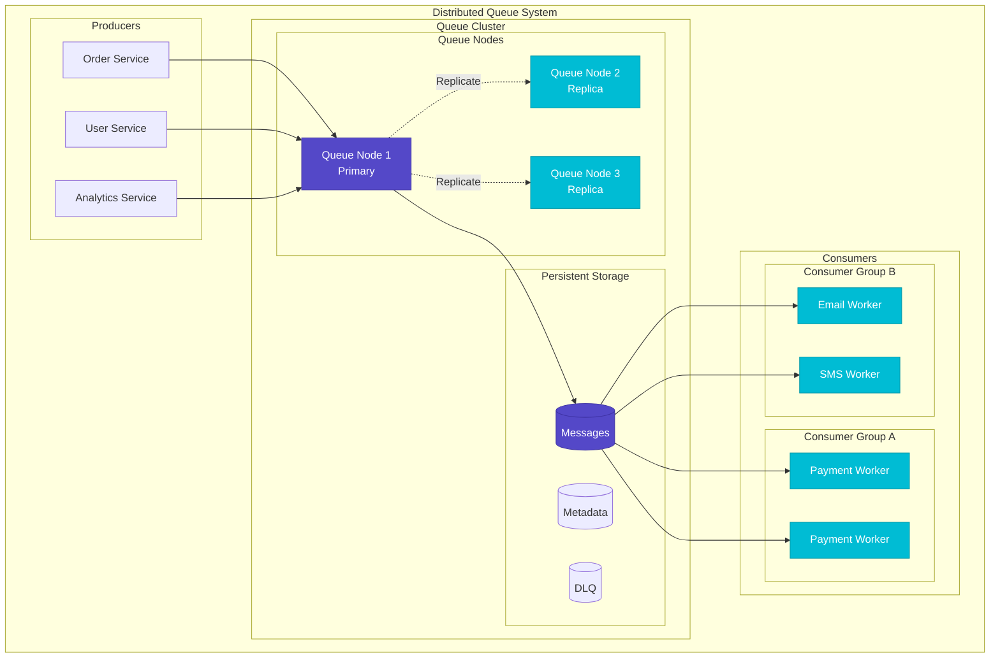
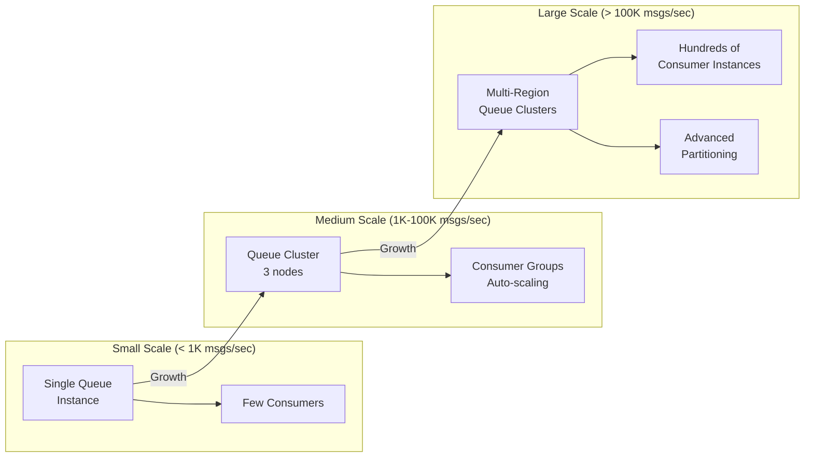
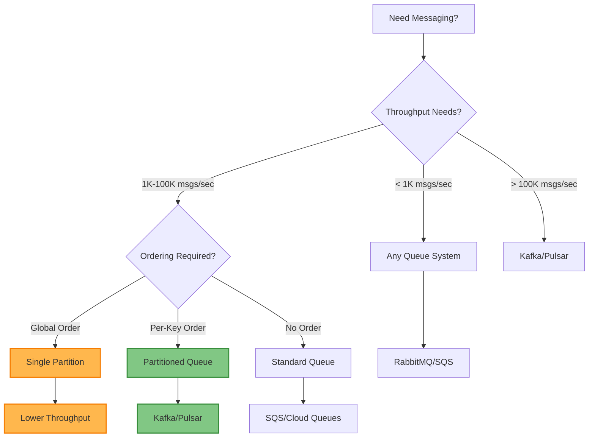

# Distributed Queue

!!! success "🏆 Gold Standard Pattern"
    **The backbone of asynchronous communication** • AWS SQS, Kafka, RabbitMQ proven at massive scale
    
    From AWS SQS processing trillions of messages to LinkedIn's Kafka handling 7 trillion daily messages, distributed queues enable reliable asynchronous communication at unprecedented scale with configurable delivery guarantees.
    
    **Key Success Metrics:**
    - AWS SQS: Trillions of messages/year across millions of queues
    - LinkedIn Kafka: 7 trillion messages/day with 100,000+ partitions
    - RabbitMQ: 1M+ messages/second sustained throughput

## Essential Question

**How do we reliably pass messages between distributed components while handling failures, ensuring ordering, and preventing duplication?**

## When to Use / When NOT to Use

### ✅ Use When

| Scenario | Example | Impact |
|----------|---------|--------|
| **Service Decoupling** | Order service → Payment service | Eliminates tight coupling and cascade failures |
| **Load Leveling** | Black Friday traffic spikes | Smooth out traffic bursts automatically |
| **Reliable Delivery** | Financial transactions | Guarantee message delivery with retry logic |
| **Work Distribution** | Video encoding farm | Distribute processing across workers |
| **Temporal Decoupling** | Batch job processing | Producers and consumers operate at different speeds |

### ❌ DON'T Use When

| Scenario | Why | Alternative |
|----------|-----|-------------|
| **Synchronous Response** | Need immediate result from operation | REST API or RPC calls |
| **Ultra-low Latency** | Sub-10ms response requirements | In-memory cache or direct calls |
| **Simple Pub/Sub** | No persistence or reliability needed | Redis Pub/Sub or WebSockets |
| **Request-Reply** | Two-way synchronous communication | gRPC or HTTP with correlation IDs |
| **Single Machine** | Local processing only | In-process threading or channels |

## Level 1: Intuition (5 min) {#intuition}

### The Story

Imagine you're running a busy restaurant. Without a queuing system, customers would crowd around the kitchen shouting orders, chefs would be overwhelmed, and chaos would ensue. A distributed queue is like having multiple order stations, kitchen displays showing pending orders, and a system that ensures every order gets cooked and delivered - even if one chef goes on break or one station breaks down.

### Visual Metaphor

```mermaid
graph TB
    subgraph "Without Queue: Chaos"
        A1[Service A] -->|Direct Call| B1[Service B]
        A1 -->|❌ B is down| X[Request Fails]
        A2[Service A2] -->|Overloads| B1
        Note1[⚠️ Both must be online<br/>⚠️ Synchronous blocking<br/>⚠️ No retry logic]
    end
    
    subgraph "With Queue: Order"
        A3[Service A] -->|Send Message| Q[Distributed Queue]
        A4[Service A2] -->|Send Message| Q
        Q -->|Poll Messages| B2[Service B]
        Q -->|Persistent Storage| S[(Storage)]
        Note2[✅ Temporal decoupling<br/>✅ Automatic retries<br/>✅ Load leveling]
    end
    
    style Q fill:#81c784,stroke:#388e3c
    style X fill:#ef5350,color:#fff
    style Note1 fill:#ffebee,stroke:#f44336
    style Note2 fill:#e8f5e9,stroke:#4caf50
```



### Core Insight

> **Key Takeaway:** Distributed queues transform fragile synchronous coupling into resilient asynchronous communication, enabling systems to handle failures gracefully and scale independently.

### In One Sentence

Distributed queues provide reliable, ordered message delivery between services with configurable guarantees, enabling asynchronous processing and fault tolerance across distributed systems.

## Level 2: Foundation (10 min) {#foundation}

### The Problem Space

<div class="failure-vignette">
<h4>🚨 What Happens Without Reliable Messaging</h4>

**E-commerce Platform, 2020**: During Black Friday, direct service-to-service calls caused cascade failures when payment service became overloaded. Order confirmations were lost, customers were double-charged, and inventory became inconsistent.

**Impact**: 6-hour outage during peak sales, $12M in lost revenue, 48 hours to reconcile data inconsistencies, and 15% customer churn from poor experience.
</div>

### How It Works

#### Queue Architecture Components



#### Key Components

| Component | Purpose | Responsibility |
|-----------|---------|----------------|
| **Producer** | Message sender | Create and send messages to queues |
| **Queue** | Message storage | Persist messages with ordering guarantees |
| **Consumer** | Message processor | Receive and process messages reliably |
| **Broker** | Queue coordinator | Manage partitions, routing, and replication |

### Basic Example

```python
# Simple distributed queue interface
class DistributedQueue:
    async def send(self, message: dict, queue_name: str) -> str:
        """Send message with automatic retry and persistence"""
        message_id = generate_id()
        
        # Add metadata
        envelope = {
            'id': message_id,
            'body': message,
            'timestamp': time.time(),
            'queue': queue_name,
            'retry_count': 0
        }
        
        # Persist with replication
        await self._replicate_message(envelope)
        return message_id
    
    async def receive(self, queue_name: str, max_messages: int = 1) -> List[dict]:
        """Receive messages with visibility timeout"""
        messages = await self._fetch_visible_messages(queue_name, max_messages)
        
        # Make messages invisible for processing
        for msg in messages:
            await self._set_visibility_timeout(msg['id'], 30)  # 30 seconds
        
        return messages
```

## Level 3: Deep Dive (15 min) {#deep-dive}

### Implementation Details

#### Message Delivery Guarantees

```mermaid
graph TB
    subgraph "At-Most-Once (Fire & Forget)"
        AM1[Send Message] --> AM2[Delete Immediately]
        AM2 --> AM3[Process Message]
        AM3 -.->|Process Fails| AM4[❌ Message Lost]
    end
    
    subgraph "At-Least-Once (Retry on Failure)" 
        AL1[Send Message] --> AL2[Process Message]
        AL2 -->|Success| AL3[Delete Message]
        AL2 -.->|Failure| AL4[Retry Processing]
        AL4 --> AL5[⚠️ Possible Duplicates]
    end
    
    subgraph "Exactly-Once (Idempotent Processing)"
        EO1[Send + Unique ID] --> EO2[Check if Processed]
        EO2 -->|New| EO3[Process Message]
        EO2 -->|Duplicate| EO4[Skip Processing]
        EO3 --> EO5[Mark as Processed]
    end
    
    style AM4 fill:#ffcdd2,stroke:#d32f2f
    style AL5 fill:#fff3e0,stroke:#f57c00
    style EO5 fill:#e8f5e9,stroke:#388e3c
```



#### Critical Design Decisions

| Decision | Options | Trade-off | Recommendation |
|----------|---------|-----------|----------------|
| **Delivery Guarantee** | At-most-once<br>At-least-once<br>Exactly-once | Performance vs Reliability vs Complexity | At-least-once + idempotency |
| **Ordering** | FIFO<br>Per-partition<br>None | Throughput vs Consistency | Per-partition for scale |
| **Durability** | In-memory<br>Persistent<br>Replicated | Speed vs Reliability | Replicated for production |
| **Consumer Pattern** | Push<br>Pull | Latency vs Control | Pull for backpressure |

### Common Pitfalls

<div class="decision-box">
<h4>⚠️ Avoid These Mistakes</h4>

1. **Poison Messages**: One bad message stops entire queue → Implement DLQ and error handling
2. **Queue Overflow**: Unbounded growth crashes system → Set limits and implement backpressure
3. **Processing Timeouts**: Messages reappear while processing → Use heartbeats and extend timeouts
</div>

### Production Considerations

#### Performance Characteristics

| Metric | Local Queue | Network Queue | Distributed Queue |
|--------|-------------|---------------|------------------|
| **Latency** | 1-10 μs | 1-10 ms | 10-100 ms |
| **Throughput** | 1M+ msgs/sec | 100K msgs/sec | 10K+ msgs/sec |
| **Durability** | Process crash loses data | Single node failure | Survives multiple failures |
| **Scaling** | Single machine limit | Single node limit | Horizontal scaling |

## Level 4: Expert (20 min) {#expert}

### Advanced Techniques

#### Optimization Strategies

1. **Message Batching**
   - When to apply: High-volume scenarios with acceptable latency
   - Impact: 10x throughput improvement by amortizing overhead
   - Trade-off: Increased latency for individual messages

2. **Partitioning Strategies**
   - When to apply: Need to scale beyond single queue capacity
   - Impact: Linear scaling with number of partitions
   - Trade-off: Global ordering becomes impossible

### Scaling Considerations



### Monitoring & Observability

#### Key Metrics to Track

| Metric | Alert Threshold | Dashboard Panel |
|--------|----------------|-----------------|
| Consumer Lag | > 1000 messages behind | Real-time lag chart |
| Queue Depth | > 10,000 messages | Queue depth histogram |
| Processing Rate | < 50% of expected | Throughput time series |
| Error Rate | > 1% of messages | Error rate by consumer |

## Level 5: Mastery (30 min) {#mastery}

### Real-World Case Studies

#### Case Study 1: Netflix Kafka Infrastructure

<div class="truth-box">
<h4>💡 Production Insights from Netflix</h4>

**Challenge**: Process 4 trillion messages/day for real-time recommendations and content analytics across global infrastructure

**Implementation**: 
- Multi-region Kafka clusters with cross-region replication
- Consumer groups auto-scaling based on lag metrics
- Schema registry for message evolution
- Dead letter queues for poison message handling

**Results**: 
- **Scale**: 4 trillion messages/day processed globally
- **Availability**: 99.99% message delivery success rate
- **Performance**: <10ms P95 end-to-end latency
- **Efficiency**: 30% reduction in infrastructure costs vs alternatives

**Lessons Learned**: Proper partitioning strategy is crucial for scale. Schema evolution must be planned from day one. Consumer group rebalancing can cause latency spikes - use sticky assignment.
</div>

### Pattern Evolution

#### Migration Path from Synchronous to Queue-based


#### Future Directions

| Trend | Impact on Pattern | Adaptation Strategy |
|-------|------------------|-------------------|
| **Serverless Computing** | Queues become event triggers | Queue → Lambda/Function integration |
| **Edge Computing** | Need regional queues | Hierarchical queue topologies |
| **ML/AI Workloads** | GPU batch processing | Specialized queue priorities |

### Pattern Combinations

#### Works Well With

| Pattern | Combination Benefit | Integration Point |
|---------|-------------------|------------------|
| [Event Sourcing](../data-management/event-sourcing.md) | Events flow through queues | Queue as event transport |
| [Saga Pattern](../coordination/saga.md) | Coordinate distributed transactions | Queue for saga orchestration |
| [Circuit Breaker](../resilience/circuit-breaker.md) | Protect downstream services | Circuit breaker in consumers |

## Quick Reference

### Decision Matrix



### Comparison with Alternatives

| Aspect | Distributed Queue | Direct RPC | Event Streaming | Message Bus |
|--------|------------------|-----------|-----------------|-------------|
| **Coupling** | Loose | Tight | Loose | Loose |
| **Durability** | High | None | High | Medium |
| **Ordering** | Configurable | None | Strong | Weak |
| **Throughput** | High | Very High | Very High | Medium |
| **When to use** | Reliable async | Immediate response | Event processing | Simple pub/sub |

### Implementation Checklist

**Pre-Implementation**
- [ ] Determined delivery guarantee requirements (exactly/at-least/at-most once)
- [ ] Planned message schema and versioning strategy
- [ ] Estimated throughput and scaling requirements
- [ ] Chosen appropriate queue technology (Kafka/SQS/RabbitMQ)

**Implementation**
- [ ] Implemented idempotent message processing
- [ ] Added comprehensive error handling and DLQ
- [ ] Set up monitoring for lag and depth metrics
- [ ] Configured appropriate timeouts and retries

**Post-Implementation**
- [ ] Load tested at expected peak capacity
- [ ] Implemented consumer auto-scaling
- [ ] Created runbooks for common failure scenarios
- [ ] Trained team on queue operations and troubleshooting

### Related Resources

<div class="grid cards" markdown>

- :material-book-open-variant:{ .lg .middle } **Related Patterns**
    
    ---
    
    - [Event Sourcing](../data-management/event-sourcing.md) - Events through queues
    - [Saga Pattern](../coordination/saga.md) - Distributed transactions
    - [Circuit Breaker](../resilience/circuit-breaker.md) - Consumer protection

- :material-flask:{ .lg .middle } **Fundamental Laws**
    
    ---
    
    - [Law 2: Asynchronous Reality](../../part1-axioms/law2-asynchrony/) - Async messaging nature
    - [Law 1: Correlated Failure](../../part1-axioms/law1-failure/) - Cascade failure prevention

- :material-pillar:{ .lg .middle } **Foundational Pillars**
    
    ---
    
    - [Work Distribution](../../part2-pillars/work/) - Queue-based work distribution
    - [State Distribution](../../part2-pillars/state/) - Message state management

- :material-tools:{ .lg .middle } **Implementation Guides**
    
    ---
    
    - [Kafka Setup Guide](../../excellence/guides/kafka-setup.md)
    - [Queue Monitoring Guide](../../excellence/guides/queue-monitoring.md)
    - [DLQ Strategies](../../excellence/guides/dlq-patterns.md)

</div>