# Distributed Queue

!!! success "🏆 Gold Standard Pattern"
    **The Backbone of Asynchronous Communication** • AWS SQS, Kafka, RabbitMQ proven
    
    From AWS SQS processing trillions of messages to LinkedIn's Kafka handling 7 trillion daily messages, distributed queues enable reliable asynchronous communication at unprecedented scale.
    
    **Key Success Metrics:**
    - AWS SQS: Trillions of messages/year across millions of queues
    - LinkedIn Kafka: 7 trillion messages/day with 100,000+ partitions
    - RabbitMQ: 1M+ messages/second sustained throughput

**Reliable message queuing across distributed systems with configurable delivery guarantees**

> *"A distributed queue is the postal service of the digital world - ensuring every message reaches its destination, no matter what happens along the way."*

---

## The Essential Question

**How do we reliably pass messages between distributed components while handling failures, ensuring ordering, and preventing duplication?**

## When to Use / When NOT to Use

### ✅ Use Distributed Queues When

| Scenario | Why Queues Win | Example |
|----------|----------------|---------|
| **Decoupling Services** | Async communication | Order service → Payment service |
| **Load Leveling** | Handle traffic spikes | Black Friday surge protection |
| **Reliability Required** | Guarantee delivery | Financial transactions |
| **Work Distribution** | Parallel processing | Video encoding farm |
| **Temporal Decoupling** | Producers/consumers at different times | Batch job processing |

### ❌ Don't Use Queues When

| Scenario | Why It's Wrong | Better Alternative |
|----------|----------------|-------------------|
| **Synchronous Response** | Need immediate result | REST API or RPC |
| **Ultra-low Latency** | < 10ms requirement | In-memory cache |
| **Simple Pub/Sub** | No persistence needed | Redis Pub/Sub |
| **Request-Reply** | Two-way communication | gRPC or HTTP |
| **Local Processing** | Single machine | In-process queue |

### Decision Framework


---

## Level 1: Intuition

### The Postal Service Metaphor

<div class="axiom-box">
<h4>📮 Digital Postal Service</h4>

A distributed queue is like a global postal service:
- **Mailbox** = Queue (holds messages)
- **Letters** = Messages (data to deliver)
- **Post Office** = Queue nodes (distributed storage)
- **Mail Carriers** = Consumers (process messages)
- **Tracking Number** = Message ID (ensures delivery)

Just like mail can be redirected if a post office closes, messages survive node failures through replication.
</div>

### Visual Architecture

```mermaid
graph TB
    subgraph "Without Queue: Tight Coupling"
        A1[Service A] -->|Direct Call| B1[Service B]
        A1 -->|❌ B is down| X[Request Fails]
        Note1[⚠️ Both must be online<br/>⚠️ Synchronous blocking<br/>⚠️ No retry logic]
    end
    
    subgraph "With Queue: Loose Coupling"
        A2[Service A] -->|Send Message| Q[Queue]
        Q -->|Poll Messages| B2[Service B]
        Q -->|Store & Forward| S[(Persistent Storage)]
        Note2[✅ Temporal decoupling<br/>✅ Automatic retries<br/>✅ Load leveling]
    end
    
    style Q fill:#4CAF50,stroke:#333,stroke-width:3px
    style X fill:#f44336,color:#fff
    style Note1 fill:#ffebee,stroke:#f44336
    style Note2 fill:#e8f5e9,stroke:#4CAF50
```



### Real-World Example

```python
# ❌ Without Queue: Fragile direct coupling
async def process_order_direct(order):
    try:
        # If payment service is down, entire order fails
        payment_result = await payment_service.charge(order.total)
        
        # If inventory is slow, customer waits
        inventory_result = await inventory_service.reserve(order.items)
        
        # If email is down, order is stuck
        await email_service.send_confirmation(order.email)
        
    except ServiceUnavailable:
        # Entire order fails, customer frustrated
        return {"error": "Please try again later"}

# ✅ With Queue: Resilient asynchronous processing
async def process_order_queued(order):
    # Immediately acknowledge order
    order_id = generate_order_id()
    
    # Queue messages for async processing
    await payment_queue.send({
        "order_id": order_id,
        "amount": order.total,
        "retry_count": 0
    })
    
    await inventory_queue.send({
        "order_id": order_id,
        "items": order.items
    })
    
    await notification_queue.send({
        "order_id": order_id,
        "email": order.email,
        "type": "order_confirmation"
    })
    
    # Customer gets immediate response
    return {"order_id": order_id, "status": "processing"}
```

---

## Level 2: Foundation

### Core Queue Concepts

| Concept | Definition | Purpose |
|---------|------------|---------|
| **Producer** | Sends messages to queue | Decouples sender from processing |
| **Consumer** | Receives and processes messages | Scales processing independently |
| **Message** | Unit of data with metadata | Carries information between services |
| **Queue** | Ordered collection of messages | Provides reliable storage |
| **Acknowledgment** | Confirms message processing | Ensures delivery guarantees |

### Delivery Guarantees

```mermaid
graph LR
    subgraph "At-Most-Once (Fire & Forget)"
        AM1[Send] --> AM2[Delete]
        AM2 --> AM3[Process]
        AM3 -.->|Failure| AM4[❌ Message Lost]
    end
    
    subgraph "At-Least-Once (Retry on Failure)"
        AL1[Send] --> AL2[Process]
        AL2 -->|Success| AL3[Delete]
        AL2 -.->|Failure| AL4[Retry]
        AL4 --> AL5[⚠️ Possible Duplicate]
    end
    
    subgraph "Exactly-Once (Idempotent)"
        E1[Send + ID] --> E2[Check Processed]
        E2 -->|New| E3[Process]
        E2 -->|Duplicate| E4[Skip]
        E3 --> E5[Mark Complete]
    end
    
    style AM4 fill:#ffcccc
    style AL5 fill:#fff3cd
    style E5 fill:#d4edda
```



### Queue Types Comparison

| Type | Ordering | Throughput | Use Case |
|------|----------|------------|----------|
| **FIFO Queue** | Strict order | Lower | Event processing, audit trails |
| **Standard Queue** | Best effort | Higher | High-volume tasks |
| **Priority Queue** | By priority | Medium | VIP processing |
| **Delay Queue** | Scheduled | Medium | Retry logic, scheduling |

### Basic Implementation Pattern

```python
from abc import ABC, abstractmethod
from dataclasses import dataclass
from datetime import datetime
from typing import Optional, List
import uuid

@dataclass
class Message:
    id: str
    body: any
    attributes: dict
    timestamp: datetime
    receipt_handle: Optional[str] = None
    
    @staticmethod
    def create(body, **attributes):
        return Message(
            id=str(uuid.uuid4()),
            body=body,
            attributes=attributes,
            timestamp=datetime.utcnow()
        )

class DistributedQueue(ABC):
    """Abstract base for distributed queue implementations"""
    
    @abstractmethod
    async def send(self, message: Message) -> str:
        """Send message to queue, return message ID"""
        pass
    
    @abstractmethod
    async def receive(self, max_messages: int = 1, 
                     visibility_timeout: int = 30) -> List[Message]:
        """Receive messages from queue"""
        pass
    
    @abstractmethod
    async def delete(self, receipt_handle: str) -> bool:
        """Delete processed message"""
        pass
    
    @abstractmethod
    async def change_visibility(self, receipt_handle: str, 
                               timeout: int) -> bool:
        """Extend processing time for message"""
        pass
```

---

## Level 3: Deep Dive

### Distributed Queue Architecture

```mermaid
graph TB
    subgraph "Complete Queue System"
        subgraph "Producers"
            P1[API Service]
            P2[Web App]
            P3[Mobile App]
        end
        
        subgraph "Queue Cluster"
            subgraph "Primary"
                Q1[Queue Node 1<br/>Leader]
                S1[(Partition 1)]
                S2[(Partition 2)]
            end
            
            subgraph "Replicas"
                Q2[Queue Node 2<br/>Follower]
                R1[(Replica 1)]
                R2[(Replica 2)]
                
                Q3[Queue Node 3<br/>Follower]
                R3[(Replica 1)]
                R4[(Replica 2)]
            end
            
            Coord[Coordination Service<br/>(ZooKeeper/Etcd)]
        end
        
        subgraph "Consumers"
            subgraph "Consumer Group A"
                C1[Worker 1]
                C2[Worker 2]
            end
            subgraph "Consumer Group B"
                C3[Worker 3]
                C4[Worker 4]
            end
        end
        
        P1 --> Q1
        P2 --> Q1
        P3 --> Q1
        
        Q1 --> S1
        Q1 --> S2
        
        S1 -.->|Replicate| R1
        S1 -.->|Replicate| R3
        S2 -.->|Replicate| R2
        S2 -.->|Replicate| R4
        
        Q1 <--> Coord
        Q2 <--> Coord
        Q3 <--> Coord
        
        S1 --> C1
        S2 --> C2
        S1 --> C3
        S2 --> C4
    end
    
    style Q1 fill:#4CAF50,stroke:#333,stroke-width:3px
    style Coord fill:#2196F3,stroke:#333,stroke-width:2px
```

### Consensus-Based Queue Implementation

```python
import asyncio
import hashlib
from collections import deque
from datetime import datetime, timedelta
from typing import Dict, List, Optional
import json

class ConsensusQueue:
    """Distributed queue with Raft consensus"""
    
    def __init__(self, node_id: str, peers: List[str]):
        self.node_id = node_id
        self.peers = peers
        self.is_leader = False
        
        # Queue state
        self.messages: Dict[str, Message] = {}
        self.queues: Dict[str, deque] = {}  # queue_name -> message_ids
        self.visibility: Dict[str, datetime] = {}  # message_id -> invisible_until
        
        # Raft state
        self.current_term = 0
        self.voted_for = None
        self.log = []
        
        # Replication state
        self.commit_index = 0
        self.last_applied = 0
        
    async def send_message(self, queue_name: str, message: Message) -> str:
        """Send message with replication"""
        if not self.is_leader:
            return await self._forward_to_leader('send', {
                'queue_name': queue_name,
                'message': message
            })
        
        # Create log entry
        entry = {
            'term': self.current_term,
            'operation': 'send',
            'queue_name': queue_name,
            'message': message.__dict__,
            'timestamp': datetime.utcnow().isoformat()
        }
        
        # Replicate to majority
        if await self._replicate_entry(entry):
            # Apply to state machine
            self._apply_send(queue_name, message)
            return message.id
        
        raise Exception("Failed to replicate message")
    
    async def receive_messages(self, queue_name: str, 
                             max_messages: int = 1,
                             visibility_timeout: int = 30) -> List[Message]:
        """Receive messages with visibility timeout"""
        messages = []
        now = datetime.utcnow()
        
        if queue_name not in self.queues:
            return messages
        
        queue = self.queues[queue_name]
        checked = 0
        
        # Find visible messages
        for message_id in list(queue):
            if checked >= len(queue):  # Prevent infinite loop
                break
                
            checked += 1
            
            # Check visibility
            if message_id in self.visibility:
                if self.visibility[message_id] > now:
                    continue  # Still invisible
            
            # Make invisible
            self.visibility[message_id] = now + timedelta(seconds=visibility_timeout)
            
            # Create receipt handle
            receipt = self._generate_receipt(message_id, queue_name)
            
            message = self.messages[message_id]
            message.receipt_handle = receipt
            messages.append(message)
            
            if len(messages) >= max_messages:
                break
        
        # Replicate visibility changes
        if messages and self.is_leader:
            await self._replicate_visibility_changes(messages)
        
        return messages
    
    async def delete_message(self, receipt_handle: str) -> bool:
        """Delete message after processing"""
        message_id, queue_name = self._parse_receipt(receipt_handle)
        
        if not self.is_leader:
            return await self._forward_to_leader('delete', {
                'receipt_handle': receipt_handle
            })
        
        # Create delete entry
        entry = {
            'term': self.current_term,
            'operation': 'delete',
            'message_id': message_id,
            'queue_name': queue_name
        }
        
        # Replicate deletion
        if await self._replicate_entry(entry):
            self._apply_delete(message_id, queue_name)
            return True
        
        return False
    
    def _apply_send(self, queue_name: str, message: Message):
        """Apply send operation to state"""
        self.messages[message.id] = message
        
        if queue_name not in self.queues:
            self.queues[queue_name] = deque()
        
        self.queues[queue_name].append(message.id)
    
    def _apply_delete(self, message_id: str, queue_name: str):
        """Apply delete operation to state"""
        if message_id in self.messages:
            del self.messages[message_id]
        
        if message_id in self.visibility:
            del self.visibility[message_id]
        
        if queue_name in self.queues:
            try:
                self.queues[queue_name].remove(message_id)
            except ValueError:
                pass  # Already removed
    
    async def _replicate_entry(self, entry: dict) -> bool:
        """Replicate log entry to followers"""
        self.log.append(entry)
        
        # Send AppendEntries to all followers
        responses = await asyncio.gather(*[
            self._send_append_entries(peer, [entry])
            for peer in self.peers
        ], return_exceptions=True)
        
        # Count successful replications
        successes = sum(1 for r in responses if r is True) + 1  # +1 for self
        
        # Check majority
        return successes > len(self.peers) // 2
    
    def _generate_receipt(self, message_id: str, queue_name: str) -> str:
        """Generate secure receipt handle"""
        data = f"{message_id}:{queue_name}:{self.node_id}:{datetime.utcnow().isoformat()}"
        return hashlib.sha256(data.encode()).hexdigest()
    
    def _parse_receipt(self, receipt_handle: str) -> tuple:
        """Parse receipt handle to extract message info"""
        # In production, store mapping or encode in receipt
        # Simplified for example
        for queue_name, queue in self.queues.items():
            for message_id in queue:
                if self._generate_receipt(message_id, queue_name) == receipt_handle:
                    return message_id, queue_name
        raise ValueError("Invalid receipt handle")
```

### Dead Letter Queue Pattern


### Advanced Features Implementation

```python
class EnhancedDistributedQueue(ConsensusQueue):
    """Production-ready queue with advanced features"""
    
    def __init__(self, node_id: str, peers: List[str]):
        super().__init__(node_id, peers)
        
        # Additional features
        self.dlq_threshold = 3  # Max retries before DLQ
        self.message_ttl = 7 * 24 * 3600  # 7 days
        self.max_message_size = 256 * 1024  # 256KB
        
        # Metrics
        self.metrics = {
            'messages_sent': 0,
            'messages_received': 0,
            'messages_deleted': 0,
            'messages_dlq': 0,
            'processing_errors': 0
        }
        
    async def send_with_delay(self, queue_name: str, message: Message, 
                            delay_seconds: int) -> str:
        """Send message with delivery delay"""
        if delay_seconds > 0:
            message.attributes['DelaySeconds'] = delay_seconds
            message.attributes['NotVisibleUntil'] = (
                datetime.utcnow() + timedelta(seconds=delay_seconds)
            ).isoformat()
        
        return await self.send_message(queue_name, message)
    
    async def send_batch(self, queue_name: str, 
                        messages: List[Message]) -> List[str]:
        """Send multiple messages efficiently"""
        if len(messages) > 10:
            raise ValueError("Batch size cannot exceed 10 messages")
        
        # Validate total size
        total_size = sum(len(json.dumps(m.__dict__)) for m in messages)
        if total_size > self.max_message_size:
            raise ValueError("Batch size exceeds maximum")
        
        # Send as single replicated operation
        entry = {
            'term': self.current_term,
            'operation': 'send_batch',
            'queue_name': queue_name,
            'messages': [m.__dict__ for m in messages]
        }
        
        if await self._replicate_entry(entry):
            for message in messages:
                self._apply_send(queue_name, message)
            return [m.id for m in messages]
        
        raise Exception("Failed to send batch")
    
    async def move_to_dlq(self, message: Message, queue_name: str, 
                         error_reason: str):
        """Move failed message to Dead Letter Queue"""
        dlq_name = f"{queue_name}_dlq"
        
        # Add failure metadata
        message.attributes['OriginalQueue'] = queue_name
        message.attributes['ErrorReason'] = error_reason
        message.attributes['FailureTime'] = datetime.utcnow().isoformat()
        message.attributes['RetryCount'] = message.attributes.get('RetryCount', 0) + 1
        
        # Send to DLQ
        await self.send_message(dlq_name, message)
        
        # Delete from original queue
        await self.delete_message(message.receipt_handle)
        
        self.metrics['messages_dlq'] += 1
    
    async def process_with_retry(self, queue_name: str, processor_func):
        """Process messages with automatic retry and DLQ"""
        while True:
            messages = await self.receive_messages(queue_name, max_messages=10)
            
            for message in messages:
                retry_count = message.attributes.get('RetryCount', 0)
                
                try:
                    # Process message
                    await processor_func(message)
                    
                    # Success - delete message
                    await self.delete_message(message.receipt_handle)
                    self.metrics['messages_deleted'] += 1
                    
                except Exception as e:
                    self.metrics['processing_errors'] += 1
                    
                    if retry_count >= self.dlq_threshold:
                        # Move to DLQ
                        await self.move_to_dlq(message, queue_name, str(e))
                    else:
                        # Return to queue for retry
                        message.attributes['RetryCount'] = retry_count + 1
                        await self.change_visibility(message.receipt_handle, 
                                                   60 * (2 ** retry_count))  # Exponential backoff
            
            if not messages:
                await asyncio.sleep(1)  # No messages, wait before polling
```

---

## Level 4: Expert

### Production Queue Systems

#### Apache Kafka Architecture


<div class="failure-vignette">
<h4>💥 The Great Netflix Kafka Outage (2019)</h4>

**What Happened**: Netflix's main Kafka cluster handling 4 trillion messages/day went down for 3 hours.

**Root Cause Chain**:
1. Routine ZooKeeper upgrade triggered leader election storm
2. 50,000 partitions tried to elect leaders simultaneously  
3. ZooKeeper overwhelmed, causing cascading timeouts
4. Producers backed up, consumers starved
5. Retry storms made recovery impossible

**Impact**:
- 3-hour streaming degradation globally
- Recommendations frozen on old data
- A/B tests corrupted
- $2M estimated revenue impact

**Lessons Learned**:
- Partition count matters (keep < 10K per cluster)
- Stagger leader elections 
- Implement producer backpressure
- Use hierarchical clusters for scale
- Have manual leader assignment capability
</div>

#### AWS SQS Implementation

```python
class SQSDistributedQueue:
    """AWS SQS wrapper with best practices"""
    
    def __init__(self, queue_url: str, region: str = 'us-east-1'):
        self.queue_url = queue_url
        self.sqs = boto3.client('sqs', region_name=region)
        
        # Queue attributes
        attrs = self.sqs.get_queue_attributes(
            QueueUrl=queue_url,
            AttributeNames=['All']
        )['Attributes']
        
        self.is_fifo = attrs.get('FifoQueue', 'false') == 'true'
        self.visibility_timeout = int(attrs.get('VisibilityTimeout', 30))
        self.max_receives = int(attrs.get('MaxReceiveCount', 3))
        
    async def send_message(self, body: str, 
                          group_id: Optional[str] = None,
                          dedup_id: Optional[str] = None,
                          delay: int = 0) -> str:
        """Send message with SQS best practices"""
        params = {
            'QueueUrl': self.queue_url,
            'MessageBody': body,
            'DelaySeconds': delay
        }
        
        # FIFO queue parameters
        if self.is_fifo:
            if not group_id:
                raise ValueError("MessageGroupId required for FIFO queue")
            params['MessageGroupId'] = group_id
            params['MessageDeduplicationId'] = dedup_id or hashlib.sha256(
                f"{group_id}:{body}:{time.time()}".encode()
            ).hexdigest()
        
        response = await asyncio.to_thread(
            self.sqs.send_message, **params
        )
        
        return response['MessageId']
    
    async def receive_messages(self, max_messages: int = 10,
                             wait_time: int = 20) -> List[Dict]:
        """Receive with long polling"""
        response = await asyncio.to_thread(
            self.sqs.receive_message,
            QueueUrl=self.queue_url,
            MaxNumberOfMessages=min(max_messages, 10),  # SQS limit
            WaitTimeSeconds=wait_time,  # Long polling
            AttributeNames=['All'],
            MessageAttributeNames=['All']
        )
        
        return response.get('Messages', [])
    
    async def process_messages(self, processor_func, 
                             concurrency: int = 10):
        """Process messages with concurrency control"""
        semaphore = asyncio.Semaphore(concurrency)
        
        async def process_with_semaphore(message):
            async with semaphore:
                try:
                    # Process message
                    await processor_func(message)
                    
                    # Delete on success
                    await asyncio.to_thread(
                        self.sqs.delete_message,
                        QueueUrl=self.queue_url,
                        ReceiptHandle=message['ReceiptHandle']
                    )
                    
                except Exception as e:
                    # Let SQS retry logic handle failures
                    logger.error(f"Processing failed: {e}")
                    # Message will become visible again after timeout
        
        while True:
            messages = await self.receive_messages()
            
            if messages:
                # Process batch concurrently
                await asyncio.gather(*[
                    process_with_semaphore(msg) 
                    for msg in messages
                ], return_exceptions=True)
            else:
                # No messages, wait before next poll
                await asyncio.sleep(1)
```

### Performance Optimization Strategies

| Strategy | Impact | Implementation |
|----------|--------|----------------|
| **Batching** | 10x throughput | Group messages, amortize overhead |
| **Partitioning** | Linear scaling | Distribute by key hash |
| **Compression** | 70% less bandwidth | GZIP/Snappy for large messages |
| **Prefetching** | Hide latency | Pull messages before needed |
| **Connection Pooling** | Reduce overhead | Reuse TCP connections |

```python
class OptimizedQueueClient:
    """High-performance queue client"""
    
    def __init__(self, queue_config):
        self.config = queue_config
        
        # Connection pooling
        self.connection_pool = ConnectionPool(
            max_connections=100,
            max_idle_time=300
        )
        
        # Batching
        self.send_buffer = []
        self.send_buffer_size = 0
        self.max_batch_size = 1024 * 1024  # 1MB
        self.batch_timeout = 0.1  # 100ms
        
        # Compression
        self.compression_threshold = 1024  # 1KB
        
        # Start background flusher
        asyncio.create_task(self._batch_flusher())
    
    async def send(self, message: Message):
        """Send with automatic batching"""
        message_size = len(json.dumps(message.__dict__))
        
        # Compress if beneficial
        if message_size > self.compression_threshold:
            message.body = self._compress(message.body)
            message.attributes['Compressed'] = 'gzip'
        
        # Add to batch
        async with self.batch_lock:
            self.send_buffer.append(message)
            self.send_buffer_size += message_size
            
            # Flush if batch is full
            if self.send_buffer_size >= self.max_batch_size:
                await self._flush_batch()
    
    async def _flush_batch(self):
        """Flush message batch to queue"""
        if not self.send_buffer:
            return
        
        batch = self.send_buffer
        self.send_buffer = []
        self.send_buffer_size = 0
        
        # Get connection from pool
        conn = await self.connection_pool.acquire()
        
        try:
            # Send batch in single request
            await conn.send_batch(batch)
        finally:
            await self.connection_pool.release(conn)
    
    def _compress(self, data: bytes) -> bytes:
        """Compress message data"""
        return gzip.compress(data)
```

---

## Level 5: Mastery

### Theoretical Foundations

<div class="axiom-box">
<h4>🔬 Queue Theory Fundamentals</h4>

**Little's Law**: L = λW
- L = Average number of messages in queue
- λ = Arrival rate (messages/second)
- W = Average time in system

**Implications**:
- Queue depth = Arrival rate × Processing time
- To reduce queue depth: Process faster OR reduce arrivals
- Backpressure prevents unbounded growth
</div>

### Advanced Patterns

#### 1. Competing Consumers with Work Stealing


#### 2. Saga Pattern with Queues

```python
class QueueBasedSaga:
    """Distributed transaction via queues"""
    
    def __init__(self, queues: Dict[str, DistributedQueue]):
        self.queues = queues
        self.saga_log = []
    
    async def execute_saga(self, saga_id: str, steps: List[SagaStep]):
        """Execute saga with compensation"""
        completed_steps = []
        
        try:
            # Forward path
            for step in steps:
                # Send command
                await self.queues[step.service].send(Message.create(
                    body={
                        'saga_id': saga_id,
                        'command': step.command,
                        'data': step.data
                    },
                    SagaId=saga_id,
                    StepIndex=len(completed_steps)
                ))
                
                # Wait for completion
                result = await self._wait_for_result(saga_id, step.service)
                
                if not result.success:
                    raise SagaError(f"Step {step.name} failed")
                
                completed_steps.append(step)
                self.saga_log.append({
                    'saga_id': saga_id,
                    'step': step.name,
                    'status': 'completed'
                })
        
        except SagaError:
            # Compensation path
            for step in reversed(completed_steps):
                await self.queues[step.service].send(Message.create(
                    body={
                        'saga_id': saga_id,
                        'command': step.compensation,
                        'data': step.data
                    },
                    SagaId=saga_id,
                    Compensation=True
                ))
```

### Economic Analysis

```python
def queue_economics():
    """ROI analysis for distributed queue adoption"""
    
    # Direct coupling costs
    direct_costs = {
        'downtime_per_year': 50,  # hours
        'downtime_cost_per_hour': 10000,  # $
        'engineering_overhead': 200000,  # $ annual for retry logic
        'customer_impact': 500000  # $ from poor experience
    }
    
    # Queue implementation costs  
    queue_costs = {
        'infrastructure': {
            'kafka_cluster': 50000,  # $ annual
            'monitoring': 10000,
            'operations': 100000  # 1 FTE
        },
        'development': {
            'initial': 200000,  # One-time
            'training': 50000
        }
    }
    
    # Benefits
    benefits = {
        'availability': 0.95,  # 95% reduction in downtime
        'development_velocity': 1.5,  # 50% faster feature development
        'scalability': 'infinite',  # No more scaling bottlenecks
        'customer_satisfaction': 300000  # $ annual from better UX
    }
    
    annual_savings = (
        direct_costs['downtime_per_year'] * 
        direct_costs['downtime_cost_per_hour'] * 
        benefits['availability'] +
        direct_costs['engineering_overhead'] * 
        (benefits['development_velocity'] - 1) +
        benefits['customer_satisfaction']
    )
    
    annual_cost = sum(queue_costs['infrastructure'].values())
    roi_first_year = (annual_savings - annual_cost - 
                     sum(queue_costs['development'].values())) / \
                     sum(queue_costs['development'].values())
    
    return {
        'annual_savings': annual_savings,
        'payback_months': 12 / (annual_savings / annual_cost),
        'five_year_roi': (annual_savings * 5 - annual_cost * 5 - 
                         sum(queue_costs['development'].values())) / \
                         sum(queue_costs['development'].values()) * 100
    }
```

<div class="truth-box">
<h4>💡 Hard-Won Queue Wisdom</h4>

**The 80/20 Rule of Queues**:
- 80% of problems: Wrong delivery guarantee chosen
- 20% of messages cause 80% of processing time
- 80% of outages: Poison messages or queue overflow

**Production Truths**:
1. **"At-least-once + Idempotency > Exactly-once"** - Simpler and more reliable
2. **"FIFO is a lie at scale"** - Network reordering happens
3. **"DLQ is not optional"** - Poison messages will happen
4. **"Monitor consumer lag, not queue depth"** - Lag tells the real story

**Scaling Wisdom**:
- < 1K msg/s: Any queue works (RabbitMQ, Redis)
- 1K-100K msg/s: Need distributed queue (Kafka, Pulsar)  
- > 100K msg/s: Need partitioning strategy
- > 1M msg/s: Need multiple clusters

**The Three Stages of Queue Maturity**:
1. **Enthusiasm**: "Queues solve everything!"
2. **Disillusionment**: "Why is everything so complex?"
3. **Enlightenment**: "Right tool for right job"
</div>

---

## 📚 Quick Reference

### Queue Selection Flowchart


### Common Patterns Cheat Sheet

```python
# 1. Retry with Exponential Backoff
async def process_with_retry(queue, message):
    for attempt in range(MAX_RETRIES):
        try:
            await process_message(message)
            await queue.delete(message.receipt_handle)
            return
        except TransientError:
            delay = min(300, (2 ** attempt) + random.uniform(0, 1))
            await queue.change_visibility(message.receipt_handle, delay)
    
    # Max retries exceeded
    await queue.move_to_dlq(message)

# 2. Batch Processing  
async def batch_processor(queue):
    while True:
        messages = await queue.receive_messages(max_messages=10)
        if messages:
            await process_batch(messages)
            await queue.delete_batch([m.receipt_handle for m in messages])
        else:
            await asyncio.sleep(1)

# 3. Priority Processing
class PriorityQueue:
    def __init__(self):
        self.high = DistributedQueue("high-priority")
        self.normal = DistributedQueue("normal-priority")
        self.low = DistributedQueue("low-priority")
    
    async def process(self):
        # Check queues in priority order
        for queue in [self.high, self.normal, self.low]:
            if message := await queue.receive_message():
                return message
```

### Production Checklist

- [ ] **Design Decisions**
  - [ ] Choose delivery guarantee (exactly/at-least/at-most-once)
  - [ ] Define message schema and versioning
  - [ ] Set TTL and message size limits
  - [ ] Plan partitioning strategy

- [ ] **Implementation**
  - [ ] Implement idempotent consumers
  - [ ] Add comprehensive error handling
  - [ ] Set up DLQ and alerting
  - [ ] Implement graceful shutdown

- [ ] **Operations**
  - [ ] Monitor consumer lag and queue depth
  - [ ] Set up autoscaling for consumers
  - [ ] Implement circuit breakers
  - [ ] Plan capacity for peak load

- [ ] **Testing**
  - [ ] Test poison message handling
  - [ ] Verify exactly-once semantics
  - [ ] Load test to find limits
  - [ ] Chaos test queue failures

---

## Related Patterns

- [Event Streaming](../architecture/event-streaming.md) - For unbounded streams
- [Saga Pattern](saga.md) - Distributed transactions via queues
- [Circuit Breaker](../resilience/circuit-breaker.md) - Protect queue consumers
- [Event Sourcing](../architecture/event-sourcing.md) - Store events in queues
- [Publish-Subscribe](../architecture/pub-sub.md) - Multi-consumer pattern

---

**Previous**: [← Event Streaming](../architecture/event-streaming.md) | **Next**: [Consensus Algorithms →](consensus.md)