# Emergent Leader Pattern

**Leadership emerges from gossip consensus without explicit election**

> *"Like birds in a flock, leaders emerge not by appointment but by collective recognition."*

---

## Level 1: Intuition

### The Flock of Birds Analogy

Emergent leadership is like how birds form flocks:
- **No designated leader**: Any bird can lead
- **Local decisions**: Each bird follows neighbors
- **Emergent behavior**: V-formation emerges naturally
- **Dynamic leadership**: Leader changes based on conditions
- **Consensus through observation**: All birds agree without voting

The leader emerges from local interactions, not global election.

### Visual Concept

```mermaid
graph TB
    subgraph "Traditional Election"
        E1[Node A: "Vote for me!"]
        E2[Node B: "No, vote for me!"]
        E3[Node C: Casting vote...]
        Elect[Explicit Election Process]
        
        E1 --> Elect
        E2 --> Elect
        E3 --> Elect
        
        style Elect fill:#fbbf24,stroke:#f59e0b
    end
    
    subgraph "Emergent Leader"
        G1[Node A: Score 85]
        G2[Node B: Score 72]
        G3[Node C: Score 91]
        G4[Node D: Score 88]
        
        G1 -.->|gossip| G2
        G2 -.->|gossip| G3
        G3 -.->|gossip| G4
        G4 -.->|gossip| G1
        
        Leader[Node C emerges as leader<br/>Highest score known by all]
        
        G3 ==> Leader
        
        style Leader fill:#10b981,stroke:#059669
        style G3 fill:#10b981,stroke:#059669
    end
```

### State Evolution

```mermaid
stateDiagram-v2
    [*] --> Peer: Node starts
    
    Peer --> Candidate: Score increases<br/>above threshold
    
    Candidate --> Leader: All peers agree<br/>highest score
    
    Leader --> Candidate: Higher score<br/>discovered
    
    Candidate --> Peer: Lower score<br/>than others
    
    note right of Leader
        Leadership maintained by:
        • Continuous high score
        • Peer acknowledgment
        • No better candidate
    end note
    
    note left of Peer
        All nodes gossip:
        • Their scores
        • Known leaders
        • Peer states
    end note
```



---

## Level 2: Foundation

### Core Concepts

| Concept | Description | Purpose |
|---------|-------------|---------|
| **Score Function** | Metric for leadership suitability | Objective comparison |
| **Gossip Protocol** | Spread scores and opinions | Eventual agreement |
| **Emergence Threshold** | Minimum difference to lead | Prevent thrashing |
| **Convergence Time** | Time to agree on leader | Bounded by gossip rounds |

### Score Functions

```mermaid
graph LR
    subgraph "Common Score Components"
        Load[CPU/Memory<br/>Available]
        Uptime[Node<br/>Stability]
        Network[Network<br/>Centrality]
        Resources[Available<br/>Resources]
    end
    
    subgraph "Score Calculation"
        Formula[Score = w₁×Load +<br/>w₂×Uptime +<br/>w₃×Network +<br/>w₄×Resources]
    end
    
    Load --> Formula
    Uptime --> Formula
    Network --> Formula
    Resources --> Formula
    
    Formula --> Score[Leadership Score]
    
    style Score fill:#10b981,stroke:#059669
```



### Emergent vs Elected Leaders

| Aspect | Emergent Leader | Elected Leader |
|--------|-----------------|----------------|
| **Selection** | Natural from metrics | Explicit voting |
| **Speed** | Gradual (O(log n) rounds) | Fast (1-2 rounds) |
| **Consensus** | Eventual | Immediate |
| **Fault tolerance** | Very high | Depends on quorum |
| **Network overhead** | Continuous gossip | Burst during election |
| **Flexibility** | Self-adjusting | Requires re-election |

---

## Level 3: Deep Dive

### Production Implementation

```python
from dataclasses import dataclass, field
from typing import Dict, Set, Optional, Callable, List, Tuple
from datetime import datetime, timedelta
import asyncio
import random
import math
from collections import defaultdict
from abc import ABC, abstractmethod

@dataclass
class NodeScore:
    """Score representing leadership suitability"""
    node_id: str
    score: float
    timestamp: datetime
    components: Dict[str, float] = field(default_factory=dict)
    
    def is_better_than(self, other: 'NodeScore', threshold: float = 0.1) -> bool:
        """Check if significantly better (with threshold to prevent thrashing)"""
        return self.score > other.score * (1 + threshold)
    
    def age_seconds(self) -> float:
        """Age of this score in seconds"""
        return (datetime.utcnow() - self.timestamp).total_seconds()

class ScoreCalculator(ABC):
    """Abstract base for score calculation strategies"""
    
    @abstractmethod
    async def calculate_score(self) -> Dict[str, float]:
        """Calculate score components"""
        pass

class ResourceBasedScorer(ScoreCalculator):
    """Score based on available resources"""
    
    async def calculate_score(self) -> Dict[str, float]:
        # Simulate resource metrics
        return {
            'cpu_available': random.uniform(0.2, 0.9),
            'memory_available': random.uniform(0.3, 0.8),
            'network_quality': random.uniform(0.5, 1.0),
            'uptime_hours': random.uniform(1, 1000),
            'load_average': random.uniform(0.1, 4.0)
        }

class EmergentLeaderNode:
    """Node participating in emergent leader selection"""
    
    def __init__(
        self,
        node_id: str,
        scorer: ScoreCalculator,
        gossip_interval: float = 1.0,
        score_ttl: float = 10.0,
        emergence_threshold: float = 0.1,
        convergence_rounds: int = 5
    ):
        self.node_id = node_id
        self.scorer = scorer
        self.gossip_interval = gossip_interval
        self.score_ttl = score_ttl
        self.emergence_threshold = emergence_threshold
        self.convergence_rounds = convergence_rounds
        
        # State
        self.known_scores: Dict[str, NodeScore] = {}
        self.peers: Set[str] = set()
        self.current_leader: Optional[str] = None
        self.leader_confidence: float = 0.0
        self.is_leader = False
        
        # Metrics
        self.leader_changes = 0
        self.rounds_as_leader = 0
        self.last_score_update = datetime.utcnow()
        
        # Callbacks
        self.on_leadership_change: Optional[Callable] = None
    
    async def start(self):
        """Start the emergent leader protocol"""
        # Start background tasks
        asyncio.create_task(self._score_update_loop())
        asyncio.create_task(self._gossip_loop())
        asyncio.create_task(self._leader_determination_loop())
        asyncio.create_task(self._cleanup_loop())
    
    async def _score_update_loop(self):
        """Periodically update own score"""
        while True:
            try:
                # Calculate new score
                components = await self.scorer.calculate_score()
                
                # Weighted combination
                score = self._combine_score_components(components)
                
                # Update own score
                self.known_scores[self.node_id] = NodeScore(
                    node_id=self.node_id,
                    score=score,
                    timestamp=datetime.utcnow(),
                    components=components
                )
                
                self.last_score_update = datetime.utcnow()
                
            except Exception as e:
                print(f"Error updating score: {e}")
            
            await asyncio.sleep(self.gossip_interval * 2)
    
    def _combine_score_components(self, components: Dict[str, float]) -> float:
        """Combine score components into single value"""
        # Example weighted scoring
        weights = {
            'cpu_available': 0.3,
            'memory_available': 0.3,
            'network_quality': 0.2,
            'uptime_hours': 0.1,
            'load_average': -0.1  # Negative weight
        }
        
        score = 0.0
        for component, value in components.items():
            weight = weights.get(component, 0.0)
            
            # Normalize certain components
            if component == 'uptime_hours':
                # Logarithmic scaling for uptime
                value = math.log(value + 1) / 10
            elif component == 'load_average':
                # Inverse scaling for load
                value = 1.0 / (value + 1)
            
            score += weight * value
        
        # Normalize to 0-100 range
        return max(0, min(100, score * 100))
    
    async def _gossip_loop(self):
        """Gossip scores with peers"""
        while True:
            try:
                if self.peers:
                    # Select random peers for gossip
                    num_peers = min(3, len(self.peers))
                    selected_peers = random.sample(list(self.peers), num_peers)
                    
                    # Send our known scores
                    await self._gossip_to_peers(selected_peers)
                
            except Exception as e:
                print(f"Gossip error: {e}")
            
            await asyncio.sleep(self.gossip_interval)
    
    async def _gossip_to_peers(self, peers: List[str]):
        """Send known scores to selected peers"""
        # Get fresh scores (not expired)
        fresh_scores = {
            node_id: score
            for node_id, score in self.known_scores.items()
            if score.age_seconds() < self.score_ttl
        }
        
        for peer in peers:
            # Simulate network call
            asyncio.create_task(
                self._send_gossip_message(peer, fresh_scores)
            )
    
    async def _send_gossip_message(self, peer: str, scores: Dict[str, NodeScore]):
        """Simulate sending gossip message"""
        # In production, this would be actual network call
        # For demo, we'll just print
        if scores:
            print(f"{self.node_id} gossips to {peer}: {len(scores)} scores")
    
    async def receive_gossip(self, sender: str, scores: Dict[str, NodeScore]):
        """Process received gossip"""
        updates = 0
        
        for node_id, score in scores.items():
            # Skip expired scores
            if score.age_seconds() > self.score_ttl:
                continue
            
            # Update if newer or unknown
            if (node_id not in self.known_scores or
                score.timestamp > self.known_scores[node_id].timestamp):
                self.known_scores[node_id] = score
                updates += 1
        
        if updates > 0:
            print(f"{self.node_id} updated {updates} scores from {sender}")
    
    async def _leader_determination_loop(self):
        """Determine leader based on known scores"""
        convergence_history = []
        
        while True:
            try:
                # Find best score among fresh scores
                best_node = None
                best_score = NodeScore("none", -1, datetime.utcnow())
                
                for node_id, score in self.known_scores.items():
                    if score.age_seconds() < self.score_ttl:
                        if score.score > best_score.score:
                            best_score = score
                            best_node = node_id
                
                # Track convergence
                convergence_history.append(best_node)
                if len(convergence_history) > self.convergence_rounds:
                    convergence_history.pop(0)
                
                # Check if converged (same leader for N rounds)
                converged = (
                    len(convergence_history) == self.convergence_rounds and
                    len(set(convergence_history)) == 1
                )
                
                # Update leader if converged and significantly better
                if converged and best_node:
                    new_leader = best_node
                    
                    # Check if leader changed
                    if new_leader != self.current_leader:
                        old_leader = self.current_leader
                        self.current_leader = new_leader
                        self.leader_changes += 1
                        
                        # Update our role
                        self.is_leader = (new_leader == self.node_id)
                        
                        # Calculate confidence based on score difference
                        if len(self.known_scores) > 1:
                            scores = sorted(
                                [s.score for s in self.known_scores.values()
                                 if s.age_seconds() < self.score_ttl],
                                reverse=True
                            )
                            if len(scores) > 1:
                                self.leader_confidence = (scores[0] - scores[1]) / scores[0]
                        
                        print(f"{self.node_id}: Leader changed from {old_leader} to "
                              f"{new_leader} (confidence: {self.leader_confidence:.2f})")
                        
                        # Notify callback
                        if self.on_leadership_change:
                            asyncio.create_task(
                                self._notify_leadership_change(old_leader, new_leader)
                            )
                
                # Track rounds as leader
                if self.is_leader:
                    self.rounds_as_leader += 1
                
            except Exception as e:
                print(f"Leader determination error: {e}")
            
            await asyncio.sleep(self.gossip_interval)
    
    async def _notify_leadership_change(self, old_leader: Optional[str], new_leader: str):
        """Notify about leadership change"""
        try:
            if asyncio.iscoroutinefunction(self.on_leadership_change):
                await self.on_leadership_change(old_leader, new_leader, self.is_leader)
            else:
                self.on_leadership_change(old_leader, new_leader, self.is_leader)
        except Exception as e:
            print(f"Leadership callback error: {e}")
    
    async def _cleanup_loop(self):
        """Clean up expired scores"""
        while True:
            try:
                # Remove expired scores
                expired = []
                for node_id, score in self.known_scores.items():
                    if score.age_seconds() > self.score_ttl * 2:
                        expired.append(node_id)
                
                for node_id in expired:
                    del self.known_scores[node_id]
                    if node_id in self.peers:
                        self.peers.remove(node_id)
                
                if expired:
                    print(f"{self.node_id} cleaned up {len(expired)} expired scores")
                
            except Exception as e:
                print(f"Cleanup error: {e}")
            
            await asyncio.sleep(self.score_ttl)
    
    def add_peer(self, peer_id: str):
        """Add a peer to gossip with"""
        self.peers.add(peer_id)
    
    def get_status(self) -> Dict:
        """Get current node status"""
        own_score = self.known_scores.get(self.node_id)
        
        return {
            'node_id': self.node_id,
            'is_leader': self.is_leader,
            'current_leader': self.current_leader,
            'leader_confidence': self.leader_confidence,
            'own_score': own_score.score if own_score else 0,
            'known_nodes': len(self.known_scores),
            'active_peers': len(self.peers),
            'leader_changes': self.leader_changes,
            'rounds_as_leader': self.rounds_as_leader
        }

# Advanced patterns

class NetworkAwareScorer(ScoreCalculator):
    """Score based on network topology position"""
    
    def __init__(self, node_id: str):
        self.node_id = node_id
        self.peer_latencies: Dict[str, float] = {}
        self.message_counts: Dict[str, int] = defaultdict(int)
    
    async def calculate_score(self) -> Dict[str, float]:
        # Calculate network centrality
        if not self.peer_latencies:
            return {'network_centrality': 0.5}
        
        # Average latency (lower is better)
        avg_latency = sum(self.peer_latencies.values()) / len(self.peer_latencies)
        
        # Message flow (higher is better)
        total_messages = sum(self.message_counts.values())
        
        # Combine into centrality score
        centrality = (1.0 / (avg_latency + 1)) * math.log(total_messages + 1)
        
        return {
            'network_centrality': min(1.0, centrality),
            'avg_latency': avg_latency,
            'message_flow': total_messages
        }

class WorkloadAwareScorer(ScoreCalculator):
    """Score based on workload characteristics"""
    
    def __init__(self):
        self.current_workload = 0
        self.workload_history = []
        self.capacity = 100
    
    async def calculate_score(self) -> Dict[str, float]:
        # Track workload history
        self.workload_history.append(self.current_workload)
        if len(self.workload_history) > 60:  # Keep 1 minute
            self.workload_history.pop(0)
        
        # Calculate stability (low variance is good)
        if len(self.workload_history) > 1:
            mean = sum(self.workload_history) / len(self.workload_history)
            variance = sum((x - mean) ** 2 for x in self.workload_history) / len(self.workload_history)
            stability = 1.0 / (1.0 + variance)
        else:
            stability = 0.5
        
        # Available capacity
        available = (self.capacity - self.current_workload) / self.capacity
        
        return {
            'available_capacity': available,
            'workload_stability': stability,
            'current_load': self.current_workload / self.capacity
        }

# Example: Multi-region emergent leader
async def multi_region_example():
    """Demonstrate emergent leader across regions"""
    
    # Create nodes in different regions
    regions = {
        'us-east': ['us-east-1', 'us-east-2', 'us-east-3'],
        'eu-west': ['eu-west-1', 'eu-west-2'],
        'ap-south': ['ap-south-1', 'ap-south-2']
    }
    
    nodes = {}
    for region, node_ids in regions.items():
        for node_id in node_ids:
            # Use network-aware scorer
            scorer = NetworkAwareScorer(node_id)
            
            # Simulate regional latencies
            for other_region, other_nodes in regions.items():
                if other_region != region:
                    for other_node in other_nodes:
                        # Higher latency across regions
                        scorer.peer_latencies[other_node] = random.uniform(50, 150)
                else:
                    for other_node in other_nodes:
                        if other_node != node_id:
                            # Lower latency within region
                            scorer.peer_latencies[other_node] = random.uniform(1, 10)
            
            node = EmergentLeaderNode(
                node_id=node_id,
                scorer=scorer,
                gossip_interval=0.5,
                convergence_rounds=10  # Slower convergence for stability
            )
            
            nodes[node_id] = node
    
    # Connect all nodes
    for node_id, node in nodes.items():
        for other_id in nodes:
            if other_id != node_id:
                node.add_peer(other_id)
    
    # Add leadership change handler
    async def on_leader_change(old_leader, new_leader, is_self_leader):
        if is_self_leader:
            region = next(r for r, nodes in regions.items() if new_leader in nodes)
            print(f"*** {new_leader} ({region}) became leader ***")
    
    for node in nodes.values():
        node.on_leadership_change = on_leader_change
    
    # Start all nodes
    for node in nodes.values():
        await node.start()
    
    # Simulate for a while
    await asyncio.sleep(15)
    
    # Print final status
    print("\n=== Final Status ===")
    for node_id, node in sorted(nodes.items()):
        status = node.get_status()
        if status['is_leader']:
            print(f"LEADER: {node_id} (score: {status['own_score']:.1f}, "
                  f"confidence: {status['leader_confidence']:.2f})")
        else:
            print(f"  {node_id}: score={status['own_score']:.1f}, "
                  f"leader={status['current_leader']}")
```

### Convergence Analysis

```mermaid
graph TB
    subgraph "Convergence Factors"
        GossipRate[Gossip Rate]
        NetworkSize[Network Size]
        ScoreStability[Score Stability]
        Threshold[Emergence Threshold]
    end
    
    subgraph "Convergence Time"
        Formula["O(log n × rounds)<br/>rounds = stability factor"]
    end
    
    GossipRate --> Formula
    NetworkSize --> Formula
    ScoreStability --> Formula
    Threshold --> Formula
    
    subgraph "Typical Values"
        Small["10 nodes: ~5 seconds"]
        Medium["100 nodes: ~10 seconds"]
        Large["1000 nodes: ~20 seconds"]
    end
    
    Formula --> Small
    Formula --> Medium
    Formula --> Large
```



---

## Level 4: Expert

### Advanced Emergent Patterns

#### 1. Hierarchical Emergence


#### 2. Score Function Evolution

```python
class EvolvingScorer(ScoreCalculator):
    """Score function that evolves based on system performance"""
    
    def __init__(self):
        self.weights = {
            'cpu': 0.25,
            'memory': 0.25,
            'network': 0.25,
            'stability': 0.25
        }
        self.performance_history = []
    
    async def calculate_score(self) -> Dict[str, float]:
        # Get base metrics
        metrics = {
            'cpu': random.uniform(0, 1),
            'memory': random.uniform(0, 1),
            'network': random.uniform(0, 1),
            'stability': random.uniform(0, 1)
        }
        
        # Apply evolved weights
        score = sum(
            self.weights[k] * v 
            for k, v in metrics.items()
        )
        
        return {'evolved_score': score, **metrics}
    
    def evolve_weights(self, performance_metric: float):
        """Adjust weights based on leader performance"""
        # Simple evolutionary approach
        if performance_metric < 0.5:
            # Poor performance - randomize weights
            total = 0
            for key in self.weights:
                self.weights[key] = random.uniform(0.1, 0.4)
                total += self.weights[key]
            
            # Normalize
            for key in self.weights:
                self.weights[key] /= total
```

### Production Considerations

| Challenge | Solution | Implementation |
|-----------|----------|----------------|
| **Network partitions** | Region-aware scoring | Prefer local leaders |
| **Score oscillation** | Hysteresis thresholds | Require significant difference |
| **Byzantine nodes** | Score validation | Verify claimed scores |
| **Convergence speed** | Adaptive gossip rate | Increase rate during instability |
| **Resource overhead** | Gossip aggregation | Batch multiple updates |

### Performance Characteristics

```mermaid
graph LR
    subgraph "Metrics"
        Conv[Convergence Time<br/>O(log n) rounds]
        Msg[Message Complexity<br/>O(n log n) per round]
        State[State Size<br/>O(n) scores]
        Fault[Fault Tolerance<br/>n-1 failures]
    end
    
    subgraph "Trade-offs"
        Fast[Fast Gossip<br/>Quick convergence<br/>High overhead]
        Slow[Slow Gossip<br/>Slow convergence<br/>Low overhead]
    end
    
    Conv --> Fast
    Msg --> Slow
```

---

## Level 5: Mastery

### Theoretical Foundations

Emergent leadership leverages principles from:

1. **Complex Systems Theory**: Order from local interactions
2. **Swarm Intelligence**: Collective behavior without central control
3. **Game Theory**: Nash equilibrium in leader selection
4. **Information Theory**: Gossip as information diffusion

```mermaid
graph TB
    subgraph "Mathematical Model"
        Local[Local Information]
        Gossip[Gossip Protocol]
        Global[Global Consensus]
        
        Local -->|P(spread)| Gossip
        Gossip -->|O(log n)| Global
    end
    
    subgraph "Properties"
        P1[Self-stabilizing]
        P2[Eventually consistent]
        P3[Partition tolerant]
        P4[Byzantine resistant*]
    end
    
    Global --> P1
    Global --> P2
    Global --> P3
    Global --> P4
```

### Formal Analysis

```python
class EmergentLeaderAnalysis:
    """Formal analysis of emergent leader properties"""
    
    @staticmethod
    def convergence_probability(
        rounds: int,
        nodes: int,
        gossip_fanout: int
    ) -> float:
        """Probability all nodes know the leader after r rounds"""
        # Epidemic spreading model
        p_single_round = 1 - (1 - gossip_fanout/nodes) ** rounds
        return p_single_round ** nodes
    
    @staticmethod
    def expected_convergence_rounds(
        nodes: int,
        gossip_fanout: int,
        confidence: float = 0.99
    ) -> int:
        """Expected rounds to achieve convergence"""
        import math
        # Based on rumor spreading analysis
        return math.ceil(
            math.log(nodes) / math.log(gossip_fanout) * 
            math.log(1 / (1 - confidence))
        )
    
    @staticmethod
    def stability_analysis(
        score_variance: float,
        threshold: float
    ) -> float:
        """Probability of stable leadership"""
        # Higher threshold = more stable
        # Higher variance = less stable
        return 1 - math.exp(-threshold / score_variance)
```

### Future Directions

1. **Quantum Gossip**: Quantum entanglement for instant convergence
2. **ML-Optimized Scoring**: Neural networks for score functions
3. **Blockchain Integration**: Immutable leader history
4. **Edge Computing**: Emergent leaders in IoT networks

---

## Quick Reference

### When to Use Emergent Leader

| ✅ Use When | ❌ Don't Use When |
|-------------|-------------------|
| Large, dynamic networks | Small, static clusters |
| Peer-to-peer systems | Strong consistency needed |
| No central authority | Fast failover required |
| Gradual leadership OK | Explicit control needed |
| High fault tolerance | Byzantine majority |

### Implementation Checklist

- [ ] Define meaningful score function
- [ ] Choose appropriate gossip parameters
- [ ] Set convergence thresholds
- [ ] Implement score validation
- [ ] Add hysteresis to prevent thrashing
- [ ] Monitor convergence metrics
- [ ] Test with network partitions
- [ ] Handle Byzantine scores

### Common Pitfalls

1. **Score gaming**: Nodes lying about scores
2. **Slow convergence**: Gossip rate too low
3. **Leadership thrashing**: Threshold too small
4. **Network overhead**: Gossip fanout too high
5. **Unfair scoring**: Biased score functions

---

## Related Laws & Pillars

### Fundamental Laws
This pattern directly addresses:

- **[Law 1: Correlated Failure ⛓️](part1-axioms/law1-failure/index)**: No single point of failure
- **[Law 2: Asynchronous Reality ⏱️](part1-axioms/law2-asynchrony/)**: Gossip handles async networks
- **[Law 3: Emergent Chaos 🌪️](part1-axioms/law3-emergence/)**: Order from local rules
- **[Law 5: Distributed Knowledge 🧠](part1-axioms/law5-epistemology/index)**: Partial view convergence

### Foundational Pillars
Emergent Leader implements:

- **[Pillar 3: Distribution of Truth 🔍](part2-pillars/truth/index)**: Consensus without coordination
- **[Pillar 4: Distribution of Control 🎮](part2-pillars/control/index)**: Decentralized leadership
- **[Pillar 5: Distribution of Intelligence 🤖](part2-pillars/intelligence/index)**: Collective decision making

## Related Patterns

### Core Dependencies
- **[Gossip Protocol](patterns/gossip)**: Foundation for score spreading
- **[Phi Accrual Failure Detector](patterns/phi-accrual)**: Detect failed leaders
- **[Vector Clock](patterns/vector-clock)**: Order score updates

### Alternative Approaches
- **[Leader Election](patterns/leader-election)**: Explicit election
- **[Consensus](patterns/consensus)**: Strong consistency
- **[Bully Algorithm](patterns/bully)**: Highest ID wins

### Supporting Patterns
- **[Heartbeat](patterns/heartbeat)**: Liveness detection
- **[Membership](patterns/membership)**: Track active nodes
- **[Anti-Entropy](patterns/anti-entropy)**: Gossip repair

---

*"Leadership is not about being chosen, but about being recognized."*