---
best-for:
- Leader election protocols (Raft, Paxos)
- Configuration versioning
- Cluster membership changes
- Database primary selection
category: coordination
current_relevance: mainstream
description: Monotonic counter to detect stale leaders and prevent split-brain in
  distributed systems
difficulty: intermediate
essential_question: How do we coordinate distributed components effectively using
  generation clock?
excellence_tier: silver
introduced: 2024-01
last-updated: 2025-07-26
pattern_status: recommended
prerequisites:
- patterns/leader-election.md
- patterns/consensus.md
reading-time: 20 min
status: complete
tagline: Master generation clock for distributed systems success
title: Generation Clock
trade-offs:
  cons:
  - Requires persistent storage
  - Can grow unbounded
  - No relation to real time
  - Needs consensus for updates
  pros:
  - Simple monotonic counter
  - Prevents split-brain scenarios
  - No clock synchronization needed
  - Survives network partitions
type: pattern
when-not-to-use: Simple systems without leadership, eventually consistent systems
when-to-use: Leader election, split-brain prevention, configuration management, cluster
  membership
---

## Essential Question

**How do we coordinate distributed components effectively using generation clock?**


# Generation Clock

**Essential Question:** How do you prevent split-brain scenarios and detect stale leaders in distributed systems without synchronized clocks?

**Tagline:** Monotonic epochs that create total ordering for leadership transitions

!!! question "Essential Questions"
    - **How do you prevent multiple active leaders?** → Only highest generation number is valid
    - **What happens when partitions heal?** → Lower generation leaders automatically step down  
    - **Why not use timestamps?** → Generations are logical epochs, not time-dependent

## When to Use / When NOT to Use

### ✅ Use When

| Scenario | Why Generation Clock | Impact |
|----------|---------------------|--------|
| Leader Election | Prevents split-brain during partitions | System safety |
| Configuration Management | Version changes atomically | Data consistency |
| Primary Selection | Clear succession order | Automated failover |
| Cluster Membership | Detect outdated nodes | Prevent corruption |

### ❌ DON'T Use When

| Scenario | Why Not | Alternative |
|----------|---------|-------------|
| Eventually Consistent Systems | Unnecessary ordering overhead | [Vector Clocks](vector-clock.md) |
| Single Node Systems | No leadership needed | Local counters |
| Real-time Requirements | Logical ordering insufficient | [Physical Timestamps](clock-sync.md) |
| Simple Request-Response | No coordination needed | Session tokens |

## Decision Matrix

```mermaid
graph TD
    Start[Need Leadership?] --> Multi{Multiple Leaders<br/>Possible?}
    Multi -->|No| Simple[Simple Primary/Secondary]
    Multi -->|Yes| Partition{Network Partitions<br/>Possible?}
    Partition -->|No| Basic[Basic Leader Election]
    Partition -->|Yes| Stale{Must Detect<br/>Stale Leaders?}
    Stale -->|No| Lease[Use Lease Pattern]
    Stale -->|Yes| GC[✓ Use Generation Clock]
    
    style GC fill:#90EE90
```



## Core Concept

<div class="axiom-box">
<h4>💡 Generation Clock Principles</h4>

**Generation = Monotonic Counter (logical time, not wall clock)**

- **Monotonic**: Only increases (0 → 1 → 2 → 3...)
- **Persistent**: Survives restarts and failures  
- **Atomic**: Updated atomically with leadership changes
- **Comparable**: Simple integer comparison for conflicts

</div>

### Visual: Split-Brain Prevention


<details>
<summary>View implementation code</summary>


</details>

## Algorithm

### Leadership State Machine

```mermaid
stateDiagram-v2
    [*] --> Follower: Gen=0
    
    Follower --> Candidate: Election timeout<br/>Gen = max_seen + 1
    
    Candidate --> Leader: Majority votes<br/>Same Gen
    
    Candidate --> Follower: Higher Gen seen<br/>Update to new Gen
    
    Leader --> Follower: Higher Gen discovered<br/>Step down immediately
    
    note right of Leader
        Leader Rules:
        • Reject Gen < current
        • Step down if Gen > current  
        • Tag all messages with Gen
    end note
```



### Generation Update Rules

| Event | Action | New Generation |
|-------|--------|----------------|
| **Start Election** | `gen = max_known + 1` | Increment |
| **Receive Higher** | `gen = received_gen` | Update |
| **Win Election** | `gen = current` | Keep same |
| **Step Down** | `gen = higher_gen` | Accept new |

## Properties & Guarantees

| Property | Guarantee | Benefit |
|----------|-----------|----------|
| **Safety** | At most one leader per generation | No split-brain |
| **Liveness** | Eventually elect leader | System progress |
| **Monotonic** | Generations only increase | Clear ordering |
| **Persistence** | Survives crashes | No regression |


## Level 1: Intuition (5 minutes)

*Start your journey with relatable analogies*

### The Elevator Pitch
[Pattern explanation in simple terms]

### Real-World Analogy
[Everyday comparison that explains the concept]

## Level 2: Foundation (10 minutes)

*Build core understanding*

### Core Concepts
- Key principle 1
- Key principle 2
- Key principle 3

### Basic Example


## Level 3: Deep Dive (15 minutes)

*Understand implementation details*

### How It Really Works
[Technical implementation details]

### Common Patterns
[Typical usage patterns]

## Level 4: Expert (20 minutes)

*Master advanced techniques*

### Advanced Configurations
[Complex scenarios and optimizations]

### Performance Tuning
[Optimization strategies]

## Level 5: Mastery (30 minutes)

*Apply in production*

### Real-World Case Studies
[Production examples from major companies]

### Lessons from the Trenches
[Common pitfalls and solutions]

## Implementation

### Simple Python Implementation


<details>
<summary>View implementation code</summary>

```python
class GenerationClock:
    def __init__(self, initial_gen: int = 0):
        self.generation = initial_gen
        self.leader_id = None
        
    def start_election(self, node_id: str, max_known_gen: int) -> int:
        """Start election with incremented generation"""
        self.generation = max(self.generation, max_known_gen) + 1
        return self.generation
        
    def handle_higher_generation(self, gen: int, leader: str) -> bool:
        """Handle discovery of higher generation"""
        if gen > self.generation:
            self.generation = gen
            self.leader_id = leader
            return True  # Step down
        return False
        
    def is_stale(self, other_gen: int) -> bool:
        """Check if other generation is stale"""
        return other_gen < self.generation
```

</details>

### Production Implementation


<details>
<summary>View implementation code</summary>

```python
from dataclasses import dataclass
import asyncio
from datetime import datetime
from enum import Enum
from typing import Optional, Set

class NodeRole(Enum):
    FOLLOWER = "follower"
    CANDIDATE = "candidate"
    LEADER = "leader"

@dataclass
class GenerationClock:
    """Monotonic generation counter for leadership epochs"""
    
    generation: int
    leader_id: Optional[str] = None
    started_at: Optional[datetime] = None
    
    def __post_init__(self):
        if self.generation < 0:
            raise ValueError("Generation must be non-negative")
    
    def is_newer_than(self, other: 'GenerationClock') -> bool:
        """Check if this generation is newer than other"""
        return self.generation > other.generation
    
    def increment(self) -> 'GenerationClock':
        """Create next generation"""
        return GenerationClock(
            generation=self.generation + 1,
            leader_id=None,
            started_at=None
        )
    
    def with_leader(self, leader_id: str) -> 'GenerationClock':
        """Set leader for this generation"""
        return GenerationClock(
            generation=self.generation,
            leader_id=leader_id,
            started_at=datetime.utcnow()
        )

class GenerationStore(ABC):
    """Persistent storage for generation clock"""
    
    @abstractmethod
    async def get_current(self) -> GenerationClock:
        """Get current generation"""
        pass
    
    @abstractmethod
    async def try_update(self, new_gen: GenerationClock) -> bool:
        """Atomically update if newer"""
        pass
    
    @abstractmethod
    async def force_update(self, new_gen: GenerationClock):
        """Force update (use carefully)"""
        pass

class InMemoryGenerationStore(GenerationStore):
    """In-memory generation store for testing"""
    
    def __init__(self, initial: GenerationClock = None):
        self.current = initial or GenerationClock(generation=0)
        self._lock = asyncio.Lock()
    
    async def get_current(self) -> GenerationClock:
        async with self._lock:
            return self.current
    
    async def try_update(self, new_gen: GenerationClock) -> bool:
        async with self._lock:
            if new_gen.is_newer_than(self.current):
                self.current = new_gen
                return True
            return False
    
    async def force_update(self, new_gen: GenerationClock):
        async with self._lock:
            self.current = new_gen

class LeaderElectionWithGeneration:
    """Leader election using generation clock"""
    
    def __init__(
        self,
        node_id: str,
        generation_store: GenerationStore,
        peers: List[str]
    ):
        self.node_id = node_id
        self.generation_store = generation_store
        self.peers = peers
        self.role = NodeRole.FOLLOWER
        self.current_leader: Optional[str] = None
        self.last_heartbeat = datetime.utcnow()
        
        # Election state
        self.votes_received = set()
        self.voted_for = None
        self.election_timeout = 5.0
    
    async def start_election(self) -> bool:
        """Start new election with incremented generation"""
        
        # Get current generation and increment
        current_gen = await self.generation_store.get_current()
        new_gen = current_gen.increment()
        
        # Try to update generation (someone else might be faster)
        if not await self.generation_store.try_update(new_gen):
            # Someone else started election with higher generation
            return False
        
        self.role = NodeRole.CANDIDATE
        self.votes_received = {self.node_id}  # Vote for self
        self.voted_for = self.node_id
        
        print(f"Node {self.node_id} starting election for generation {new_gen.generation}")
        
        # Request votes from peers
        vote_requests = []
        for peer in self.peers:
            vote_requests.append(
                self._request_vote(peer, new_gen)
            )
        
        # Wait for votes
        results = await asyncio.gather(*vote_requests, return_exceptions=True)
        
        # Count votes
        for i, result in enumerate(results):
            if isinstance(result, bool) and result:
                self.votes_received.add(self.peers[i])
        
        # Check if won majority
        majority = (len(self.peers) + 1) // 2 + 1
        if len(self.votes_received) >= majority:
            # Become leader
            await self._become_leader(new_gen)
            return True
        else:
            # Lost election
            self.role = NodeRole.FOLLOWER
            return False
    
    async def _request_vote(self, peer: str, generation: GenerationClock) -> bool:
        """Request vote from peer"""
        # Simulate RPC to peer
        # In production, this would be actual network call
        
        # Peer logic:
        # 1. Only vote if generation is higher than current
        # 2. Only vote once per generation
        # 3. Reset voted_for when seeing higher generation
        
        # Simulated response (would come from network)
        peer_current_gen = await self.generation_store.get_current()
        
        if generation.is_newer_than(peer_current_gen):
            # Vote granted
            return True
        else:
            # Vote denied - peer has same or higher generation
            return False
    
    async def _become_leader(self, generation: GenerationClock):
        """Become leader for given generation"""
        self.role = NodeRole.LEADER
        self.current_leader = self.node_id
        
        # Update generation with leader info
        leader_gen = generation.with_leader(self.node_id)
        await self.generation_store.force_update(leader_gen)
        
        print(f"Node {self.node_id} became leader for generation {generation.generation}")
        
        # Start heartbeat task
        asyncio.create_task(self._leader_heartbeat(generation))
    
    async def _leader_heartbeat(self, generation: GenerationClock):
        """Send periodic heartbeats as leader"""
        while self.role == NodeRole.LEADER:
            # Check if still have valid generation
            current_gen = await self.generation_store.get_current()
            if not generation.generation == current_gen.generation:
                # Lost leadership - higher generation exists
                print(f"Node {self.node_id} stepping down - found generation {current_gen.generation}")
                self.role = NodeRole.FOLLOWER
                self.current_leader = current_gen.leader_id
                break
            
            # Send heartbeats to followers
            # In production, this would be network RPCs
            await asyncio.sleep(1.0)
    
    async def handle_request(self, request: Dict, sender_generation: int) -> Dict:
        """Handle request checking generation"""
        
        current_gen = await self.generation_store.get_current()
        
        # Reject if sender has old generation
        if sender_generation < current_gen.generation:
            return {
                'status': 'rejected',
                'reason': 'stale_generation',
                'current_generation': current_gen.generation,
                'current_leader': current_gen.leader_id
            }
        
        # Update our generation if sender has newer
        if sender_generation > current_gen.generation:
            # Step down if we're leader
            if self.role == NodeRole.LEADER:
                self.role = NodeRole.FOLLOWER
                print(f"Node {self.node_id} stepping down - request has generation {sender_generation}")
            
            # Update to newer generation
            new_gen = GenerationClock(generation=sender_generation)
            await self.generation_store.try_update(new_gen)
            
            return {
                'status': 'rejected',
                'reason': 'not_leader',
                'current_generation': sender_generation
            }
        
        # Same generation - process if we're leader
        if self.role == NodeRole.LEADER:
            # Process request
            return {
                'status': 'accepted',
                'result': f"Processed by leader {self.node_id}",
                'generation': current_gen.generation
            }
        else:
            return {
                'status': 'rejected',
                'reason': 'not_leader',
                'current_leader': current_gen.leader_id,
                'generation': current_gen.generation
            }

# Configuration management with generation
class ConfigurationManager:
    """Manage configuration versions using generation clock"""
    
    def __init__(self):
        self.configurations: Dict[int, Dict] = {}
        self.current_generation = GenerationClock(generation=0)
        self._lock = asyncio.Lock()
    
    async def update_configuration(
        self,
        new_config: Dict,
        expected_generation: Optional[int] = None
    ) -> Tuple[bool, GenerationClock]:
        """Update configuration with generation check"""
        
        async with self._lock:
            # Check expected generation (optimistic concurrency)
            if expected_generation is not None:
                if expected_generation != self.current_generation.generation:
                    return False, self.current_generation
            
            # Create new generation
            new_generation = self.current_generation.increment()
            
            # Store configuration
            self.configurations[new_generation.generation] = {
                'config': new_config,
                'timestamp': datetime.utcnow(),
                'generation': new_generation.generation
            }
            
            self.current_generation = new_generation
            
            # Trim old configurations (keep last 10)
            if len(self.configurations) > 10:
                oldest = min(self.configurations.keys())
                del self.configurations[oldest]
            
            return True, new_generation
    
    async def get_configuration(
        self,
        min_generation: Optional[int] = None
    ) -> Optional[Dict]:
        """Get configuration if generation is acceptable"""
        
        async with self._lock:
            if min_generation and self.current_generation.generation < min_generation:
                # Our configuration is too old
                return None
            
            return self.configurations.get(self.current_generation.generation)

# Split-brain prevention
class SplitBrainDetector:
    """Detect and prevent split-brain using generation clock"""
    
    def __init__(self, node_id: str):
        self.node_id = node_id
        self.known_leaders: Dict[int, str] = {}  # generation -> leader_id
        self.current_generation = 0
        self.is_isolated = False
    
    async def report_leader_claim(
        self,
        claimed_leader_id: str,
        claimed_generation: int
    ) -> str:
        """Process leader claim and detect split-brain"""
        
        # Check if this is a newer generation
        if claimed_generation > self.current_generation:
            # Accept new leader
            self.current_generation = claimed_generation
            self.known_leaders[claimed_generation] = claimed_leader_id
            self.is_isolated = False
            return "accepted"
        
        # Check if same generation but different leader
        elif claimed_generation == self.current_generation:
            existing_leader = self.known_leaders.get(claimed_generation)
            if existing_leader and existing_leader != claimed_leader_id:
                # SPLIT BRAIN DETECTED!
                print(f"SPLIT BRAIN: Generation {claimed_generation} has leaders: "
                      f"{existing_leader} and {claimed_leader_id}")
                
                # In production: trigger reconciliation protocol
                return "split_brain_detected"
            else:
                self.known_leaders[claimed_generation] = claimed_leader_id
                return "accepted"
        
        else:
            # Old generation - reject
            return "rejected_stale"
    
    async def check_isolation(self, peer_generations: List[int]) -> bool:
        """Check if we're isolated based on peer generations"""
        
        if not peer_generations:
            self.is_isolated = True
            return True
        
        # If majority of peers have higher generation, we're isolated
        higher_count = sum(1 for gen in peer_generations if gen > self.current_generation)
        
        if higher_count > len(peer_generations) // 2:
            self.is_isolated = True
            return True
        
        self.is_isolated = False
        return False

# Example usage
async def generation_clock_demo():
    """Demonstrate generation clock in action"""
    
    # Create three nodes
    stores = {
        'node1': InMemoryGenerationStore(),
        'node2': InMemoryGenerationStore(),
        'node3': InMemoryGenerationStore()
    }
    
    nodes = {
        'node1': LeaderElectionWithGeneration('node1', stores['node1'], ['node2', 'node3']),
        'node2': LeaderElectionWithGeneration('node2', stores['node2'], ['node1', 'node3']),
        'node3': LeaderElectionWithGeneration('node3', stores['node3'], ['node1', 'node2'])
    }
    
    # Node1 becomes leader
    print("=== Node1 starting election ===")
    result = await nodes['node1'].start_election()
    print(f"Node1 election result: {result}")
    
    # Simulate network partition - Node3 starts its own election
    print("\n=== Network partition - Node3 isolated ===")
    stores['node3'] = InMemoryGenerationStore()  # Isolated view
    isolated_node3 = LeaderElectionWithGeneration('node3', stores['node3'], [])
    result = await isolated_node3.start_election()
    print(f"Node3 election result: {result}")
    
    # Check generations
    gen1 = await stores['node1'].get_current()
    gen3 = await stores['node3'].get_current()
    print(f"\nNode1 generation: {gen1.generation}, leader: {gen1.leader_id}")
    print(f"Node3 generation: {gen3.generation}, leader: {gen3.leader_id}")
    
    # Partition heals - Node3 sees Node1's higher generation
    print("\n=== Partition heals ===")
    if gen1.generation > gen3.generation:
        print(f"Node3 accepts Node1's leadership (gen {gen1.generation} > {gen3.generation})")
    else:
        print(f"Node1 accepts Node3's leadership (gen {gen3.generation} > {gen1.generation})")
```

</details>

### Design Variants

| Variant | Format | Pros | Cons | Use Case |
|---------|--------|------|------|----------|
| **Simple** | `int` | Fast comparison | No tie-breaking | Basic leadership |
| **Tuple** | `(gen, node_id)` | Handles ties | Complex ordering | Multi-candidate |
| **Hybrid** | `(gen, timestamp)` | Time context | Clock dependency | Auditing needs |

## Advanced Patterns

### Multi-Raft Coordination


<details>
<summary>View implementation code</summary>


</details>

### Configuration Versioning

```python
class ConfigManager:
    def __init__(self):
        self.configs = {}  # generation -> config
        self.current_gen = 0
    
    def update_config(self, config, expected_gen=None):
        if expected_gen and expected_gen != self.current_gen:
            return False, "Stale generation"
        
        self.current_gen += 1
        self.configs[self.current_gen] = config
        return True, self.current_gen
```

```python
# Generation-based Garbage Collection
class GenerationGC:
    def __init__(self, retention: int = 5):
        self.data = {}  # gen -> data
        self.current_gen = 0
        self.retention = retention
    
    def add(self, generation: int, data):
        self.data[generation] = data
        self._cleanup(generation)
    
    def _cleanup(self, current: int):
        cutoff = current - self.retention
        for gen in list(self.data.keys()):
            if gen < cutoff:
                del self.data[gen]
```

## Production Usage

| System | Implementation | Scale | Key Insight |
|--------|---------------|-------|-------------|
| **Raft** | Term numbers | Thousands of nodes | Combines with log indices |
| **ZooKeeper** | Epoch numbers | Global scale | 64-bit counters |
| **MongoDB** | Election IDs | Replica sets | ObjectId timestamps |
| **etcd** | Revision numbers | Large clusters | MVCC integration |

## Performance & Monitoring

### Key Metrics

| Metric | Alert Threshold | Meaning |
|--------|----------------|----------|
| Generation jumps | > 10 per minute | Unstable leadership |
| Stale requests | > 1% of traffic | Clock sync issues |
| Election frequency | > 1 per hour | Network problems |

### Storage Trade-offs

| Storage | Latency | Durability | Cost |
|---------|---------|------------|------|
| Memory | 1μs | Low | High |
| Disk | 1ms | High | Medium |
| Consensus | 10ms | Very High | Low |

## Theory & Guarantees

### Theoretical Foundation

Generation clocks provide **total ordering** in asynchronous systems:


### Formal Properties

| Property | Definition | Verification |
|----------|------------|-------------|
| **Monotonicity** | `gen[i] < gen[i+1]` | `all(g1 < g2 for g1,g2 in zip(gens, gens[1:]))` |
| **Uniqueness** | At most one leader per generation | `len(leaders_per_gen) <= 1` |
| **Progress** | Eventually elect new leader | `new_gen_time < timeout_bound` |

## Common Pitfalls

| Pitfall | Problem | Solution |
|---------|---------|----------|
| **Generation Reuse** | Split-brain possible | Always increment |
| **Non-atomic Updates** | Race conditions | Use compare-and-swap |
| **Missing Persistence** | Regression on restart | Write to stable storage |
| **Clock Overflow** | 64-bit limit reached | Plan for wraparound |

## Quick Reference

### Essential Rules

1. **Always increment** - Never reuse generations
2. **Persist first** - Durability before acknowledgment  
3. **Reject stale** - Compare before accepting
4. **Step down immediately** - On higher generation

#
## Level 1: Intuition (5 minutes)

*Start your journey with relatable analogies*

### The Elevator Pitch
[Pattern explanation in simple terms]

### Real-World Analogy
[Everyday comparison that explains the concept]

## Level 2: Foundation (10 minutes)

*Build core understanding*

### Core Concepts
- Key principle 1
- Key principle 2
- Key principle 3

### Basic Example


## Level 3: Deep Dive (15 minutes)

*Understand implementation details*

### How It Really Works
[Technical implementation details]

### Common Patterns
[Typical usage patterns]

## Level 4: Expert (20 minutes)

*Master advanced techniques*

### Advanced Configurations
[Complex scenarios and optimizations]

### Performance Tuning
[Optimization strategies]

## Level 5: Mastery (30 minutes)

*Apply in production*

### Real-World Case Studies
[Production examples from major companies]

### Lessons from the Trenches
[Common pitfalls and solutions]

## Implementation Checklist

**Planning**
- [ ] Choose storage (memory/disk/distributed)
- [ ] Define scope (service/cluster/global)
- [ ] Plan for overflow (32-bit/64-bit)

**Implementation**  
- [ ] Atomic generation increment
- [ ] Persistence before use
- [ ] Stale request rejection
- [ ] All messages tagged

**Operations**
- [ ] Monitor election frequency  
- [ ] Alert on generation jumps
- [ ] Test partition scenarios

### Comparison with Alternatives

| Aspect | Generation Clock | Vector Clock | Physical Time |
|--------|------------------|--------------|---------------|
| **Ordering** | Total | Partial | Total |
| **Size** | Fixed (8 bytes) | O(n) | Fixed (8 bytes) |
| **Clock Sync** | Not needed | Not needed | Required |
| **Use Case** | Leadership | Causality | Timestamps |

---

## Related Laws & Pillars

### Fundamental Laws
This pattern directly addresses:

- **[Law 1: Correlated Failure ⛓️](part1-axioms/law1-failure/index)**: Generation persists through failures
- **[Law 2: Asynchronous Reality ⏱️](part1-axioms/law2-asynchrony/)**: No synchronized clocks needed
- **[Law 3: Emergent Chaos 🌪️](part1-axioms/law3-emergence/)**: Order from simple counter
- **[Law 5: Distributed Knowledge 🧠](part1-axioms/law5-epistemology/index)**: Agree on leader via generation

### Foundational Pillars
Generation Clock implements:

- **[Pillar 3: Distribution of Truth 🔍](part2-pillars/truth/index)**: Generation defines truth epoch
- **[Pillar 4: Distribution of Control 🎮](part2-pillars/control/index)**: Leader per generation
- **[Pillar 2: Distribution of State 🗃️](part2-pillars/state/index)**: Generation state replication

## Related Patterns

### Core Dependencies
- **[Leader Election](patterns/leader-election)**: Primary use case
- **[Consensus](patterns/consensus)**: Often uses generations
- **[State Watch](patterns/state-watch)**: Watch generation changes

### Supporting Patterns
- **[Fencing Token](patterns/distributed-lock)**: Similar monotonic counter
- **[Vector Clock](patterns/vector-clock)**: Alternative ordering
- **[Heartbeat](patterns/heartbeat)**: Detect generation changes

### Similar Concepts
- **[Epoch](patterns/epoch)**: Similar time-based periods
- **[Term](patterns/raft)**: Raft's generation clock
- **[Ballot Number](patterns/paxos)**: Paxos equivalent

---

*"Time is an illusion, but generation numbers are forever incrementing."*