```mermaid
graph TD
    Start[Need Leadership?] --> Multi{Multiple Leaders<br/>Possible?}
    Multi -->|No| Simple[Simple Primary/Secondary]
    Multi -->|Yes| Partition{Network Partitions<br/>Possible?}
    Partition -->|No| Basic[Basic Leader Election]
    Partition -->|Yes| Stale{Must Detect<br/>Stale Leaders?}
    Stale -->|No| Lease[Use Lease Pattern]
    Stale -->|Yes| GC[✓ Use Generation Clock]
    
    style GC fill:#90EE90
```

# Generation Clock

!!! question "Essential Questions for Leadership Coordination"
    - **Q: How do you prevent two nodes from both thinking they're leader?**  
      A: Generation numbers - only the highest generation is valid
    - **Q: What happens when a network partition heals?**  
      A: Lower generation leaders automatically step down
    - **Q: How is this different from timestamps?**  
      A: Generations are monotonic epochs, not time-based

<div class="decision-box">
<h3>🎯 When to Use Generation Clocks</h3>


</div>

## Core Concept: Epochs Not Time

<div class="axiom-box">
<h4>💡 The Generation Clock Formula</h4>

**Generation = Monotonic Counter (not timestamp)**

- Starts at 0 or 1
- Increments by 1 for each new leader/configuration
- Higher number = more recent leader
- Must be persisted to survive restarts

</div>

### Visual: Split-Brain Prevention


## State Machine Model

```mermaid
stateDiagram-v2
    [*] --> Follower: Start (Gen=0)
    
    Follower --> Candidate: Election timeout<br/>Gen = highest_seen + 1
    
    Candidate --> Leader: Win majority<br/>Keep same Gen
    
    Candidate --> Follower: See higher Gen<br/>Update to new Gen
    
    Leader --> Follower: See higher Gen<br/>Immediately step down
    
    note right of Leader
        Rules for Leader:
        • Reject requests with Gen < mine
        • Step down if see Gen > mine
        • Include Gen in all messages
    end note
```



## Generation Clock Properties

| Property | Description | Why It Matters |
|----------|-------------|----------------|
| **Monotonic** | Only increases, never decreases | Ensures clear leader succession |
| **Persistent** | Survives crashes/restarts | Prevents regression after failure |
| **Atomic** | Updated atomically with state | No split-brain during transitions |
| **Comparable** | Simple integer comparison | Fast conflict resolution |

---

## Level 3: Deep Dive

### Production Implementation

```python
from dataclasses import dataclass
from typing import Optional, Dict, List, Tuple
from datetime import datetime
import asyncio
from abc import ABC, abstractmethod
from enum import Enum
import json

class NodeRole(Enum):
    FOLLOWER = "follower"
    CANDIDATE = "candidate"
    LEADER = "leader"

@dataclass
class GenerationClock:
    """Monotonic generation counter for leadership epochs"""
    
    generation: int
    leader_id: Optional[str] = None
    started_at: Optional[datetime] = None
    
    def __post_init__(self):
        if self.generation < 0:
            raise ValueError("Generation must be non-negative")
    
    def is_newer_than(self, other: 'GenerationClock') -> bool:
        """Check if this generation is newer than other"""
        return self.generation > other.generation
    
    def increment(self) -> 'GenerationClock':
        """Create next generation"""
        return GenerationClock(
            generation=self.generation + 1,
            leader_id=None,
            started_at=None
        )
    
    def with_leader(self, leader_id: str) -> 'GenerationClock':
        """Set leader for this generation"""
        return GenerationClock(
            generation=self.generation,
            leader_id=leader_id,
            started_at=datetime.utcnow()
        )

class GenerationStore(ABC):
    """Persistent storage for generation clock"""
    
    @abstractmethod
    async def get_current(self) -> GenerationClock:
        """Get current generation"""
        pass
    
    @abstractmethod
    async def try_update(self, new_gen: GenerationClock) -> bool:
        """Atomically update if newer"""
        pass
    
    @abstractmethod
    async def force_update(self, new_gen: GenerationClock):
        """Force update (use carefully)"""
        pass

class InMemoryGenerationStore(GenerationStore):
    """In-memory generation store for testing"""
    
    def __init__(self, initial: GenerationClock = None):
        self.current = initial or GenerationClock(generation=0)
        self._lock = asyncio.Lock()
    
    async def get_current(self) -> GenerationClock:
        async with self._lock:
            return self.current
    
    async def try_update(self, new_gen: GenerationClock) -> bool:
        async with self._lock:
            if new_gen.is_newer_than(self.current):
                self.current = new_gen
                return True
            return False
    
    async def force_update(self, new_gen: GenerationClock):
        async with self._lock:
            self.current = new_gen

class LeaderElectionWithGeneration:
    """Leader election using generation clock"""
    
    def __init__(
        self,
        node_id: str,
        generation_store: GenerationStore,
        peers: List[str]
    ):
        self.node_id = node_id
        self.generation_store = generation_store
        self.peers = peers
        self.role = NodeRole.FOLLOWER
        self.current_leader: Optional[str] = None
        self.last_heartbeat = datetime.utcnow()
        
        # Election state
        self.votes_received: Set[str] = set()
        self.voted_for: Optional[str] = None
        self.election_timeout = 5.0  # seconds
    
    async def start_election(self) -> bool:
        """Start new election with incremented generation"""
        
        # Get current generation and increment
        current_gen = await self.generation_store.get_current()
        new_gen = current_gen.increment()
        
        # Try to update generation (someone else might be faster)
        if not await self.generation_store.try_update(new_gen):
            # Someone else started election with higher generation
            return False
        
        self.role = NodeRole.CANDIDATE
        self.votes_received = {self.node_id}  # Vote for self
        self.voted_for = self.node_id
        
        print(f"Node {self.node_id} starting election for generation {new_gen.generation}")
        
        # Request votes from peers
        vote_requests = []
        for peer in self.peers:
            vote_requests.append(
                self._request_vote(peer, new_gen)
            )
        
        # Wait for votes
        results = await asyncio.gather(*vote_requests, return_exceptions=True)
        
        # Count votes
        for i, result in enumerate(results):
            if isinstance(result, bool) and result:
                self.votes_received.add(self.peers[i])
        
        # Check if won majority
        majority = (len(self.peers) + 1) // 2 + 1
        if len(self.votes_received) >= majority:
            # Become leader
            await self._become_leader(new_gen)
            return True
        else:
            # Lost election
            self.role = NodeRole.FOLLOWER
            return False
    
    async def _request_vote(self, peer: str, generation: GenerationClock) -> bool:
        """Request vote from peer"""
        # Simulate RPC to peer
        # In production, this would be actual network call
        
        # Peer logic:
        # 1. Only vote if generation is higher than current
        # 2. Only vote once per generation
        # 3. Reset voted_for when seeing higher generation
        
        # Simulated response (would come from network)
        peer_current_gen = await self.generation_store.get_current()
        
        if generation.is_newer_than(peer_current_gen):
            # Vote granted
            return True
        else:
            # Vote denied - peer has same or higher generation
            return False
    
    async def _become_leader(self, generation: GenerationClock):
        """Become leader for given generation"""
        self.role = NodeRole.LEADER
        self.current_leader = self.node_id
        
        # Update generation with leader info
        leader_gen = generation.with_leader(self.node_id)
        await self.generation_store.force_update(leader_gen)
        
        print(f"Node {self.node_id} became leader for generation {generation.generation}")
        
        # Start heartbeat task
        asyncio.create_task(self._leader_heartbeat(generation))
    
    async def _leader_heartbeat(self, generation: GenerationClock):
        """Send periodic heartbeats as leader"""
        while self.role == NodeRole.LEADER:
            # Check if still have valid generation
            current_gen = await self.generation_store.get_current()
            if not generation.generation == current_gen.generation:
                # Lost leadership - higher generation exists
                print(f"Node {self.node_id} stepping down - found generation {current_gen.generation}")
                self.role = NodeRole.FOLLOWER
                self.current_leader = current_gen.leader_id
                break
            
            # Send heartbeats to followers
            # In production, this would be network RPCs
            await asyncio.sleep(1.0)
    
    async def handle_request(self, request: Dict, sender_generation: int) -> Dict:
        """Handle request checking generation"""
        
        current_gen = await self.generation_store.get_current()
        
        # Reject if sender has old generation
        if sender_generation < current_gen.generation:
            return {
                'status': 'rejected',
                'reason': 'stale_generation',
                'current_generation': current_gen.generation,
                'current_leader': current_gen.leader_id
            }
        
        # Update our generation if sender has newer
        if sender_generation > current_gen.generation:
            # Step down if we're leader
            if self.role == NodeRole.LEADER:
                self.role = NodeRole.FOLLOWER
                print(f"Node {self.node_id} stepping down - request has generation {sender_generation}")
            
            # Update to newer generation
            new_gen = GenerationClock(generation=sender_generation)
            await self.generation_store.try_update(new_gen)
            
            return {
                'status': 'rejected',
                'reason': 'not_leader',
                'current_generation': sender_generation
            }
        
        # Same generation - process if we're leader
        if self.role == NodeRole.LEADER:
            # Process request
            return {
                'status': 'accepted',
                'result': f"Processed by leader {self.node_id}",
                'generation': current_gen.generation
            }
        else:
            return {
                'status': 'rejected',
                'reason': 'not_leader',
                'current_leader': current_gen.leader_id,
                'generation': current_gen.generation
            }

# Configuration management with generation
class ConfigurationManager:
    """Manage configuration versions using generation clock"""
    
    def __init__(self):
        self.configurations: Dict[int, Dict] = {}
        self.current_generation = GenerationClock(generation=0)
        self._lock = asyncio.Lock()
    
    async def update_configuration(
        self,
        new_config: Dict,
        expected_generation: Optional[int] = None
    ) -> Tuple[bool, GenerationClock]:
        """Update configuration with generation check"""
        
        async with self._lock:
            # Check expected generation (optimistic concurrency)
            if expected_generation is not None:
                if expected_generation != self.current_generation.generation:
                    return False, self.current_generation
            
            # Create new generation
            new_generation = self.current_generation.increment()
            
            # Store configuration
            self.configurations[new_generation.generation] = {
                'config': new_config,
                'timestamp': datetime.utcnow(),
                'generation': new_generation.generation
            }
            
            self.current_generation = new_generation
            
            # Trim old configurations (keep last 10)
            if len(self.configurations) > 10:
                oldest = min(self.configurations.keys())
                del self.configurations[oldest]
            
            return True, new_generation
    
    async def get_configuration(
        self,
        min_generation: Optional[int] = None
    ) -> Optional[Dict]:
        """Get configuration if generation is acceptable"""
        
        async with self._lock:
            if min_generation and self.current_generation.generation < min_generation:
                # Our configuration is too old
                return None
            
            return self.configurations.get(self.current_generation.generation)

# Split-brain prevention
class SplitBrainDetector:
    """Detect and prevent split-brain using generation clock"""
    
    def __init__(self, node_id: str):
        self.node_id = node_id
        self.known_leaders: Dict[int, str] = {}  # generation -> leader_id
        self.current_generation = 0
        self.is_isolated = False
    
    async def report_leader_claim(
        self,
        claimed_leader_id: str,
        claimed_generation: int
    ) -> str:
        """Process leader claim and detect split-brain"""
        
        # Check if this is a newer generation
        if claimed_generation > self.current_generation:
            # Accept new leader
            self.current_generation = claimed_generation
            self.known_leaders[claimed_generation] = claimed_leader_id
            self.is_isolated = False
            return "accepted"
        
        # Check if same generation but different leader
        elif claimed_generation == self.current_generation:
            existing_leader = self.known_leaders.get(claimed_generation)
            if existing_leader and existing_leader != claimed_leader_id:
                # SPLIT BRAIN DETECTED!
                print(f"SPLIT BRAIN: Generation {claimed_generation} has leaders: "
                      f"{existing_leader} and {claimed_leader_id}")
                
                # In production: trigger reconciliation protocol
                return "split_brain_detected"
            else:
                self.known_leaders[claimed_generation] = claimed_leader_id
                return "accepted"
        
        else:
            # Old generation - reject
            return "rejected_stale"
    
    async def check_isolation(self, peer_generations: List[int]) -> bool:
        """Check if we're isolated based on peer generations"""
        
        if not peer_generations:
            self.is_isolated = True
            return True
        
        # If majority of peers have higher generation, we're isolated
        higher_count = sum(1 for gen in peer_generations if gen > self.current_generation)
        
        if higher_count > len(peer_generations) // 2:
            self.is_isolated = True
            return True
        
        self.is_isolated = False
        return False

# Example usage
async def generation_clock_demo():
    """Demonstrate generation clock in action"""
    
    # Create three nodes
    stores = {
        'node1': InMemoryGenerationStore(),
        'node2': InMemoryGenerationStore(),
        'node3': InMemoryGenerationStore()
    }
    
    nodes = {
        'node1': LeaderElectionWithGeneration('node1', stores['node1'], ['node2', 'node3']),
        'node2': LeaderElectionWithGeneration('node2', stores['node2'], ['node1', 'node3']),
        'node3': LeaderElectionWithGeneration('node3', stores['node3'], ['node1', 'node2'])
    }
    
    # Node1 becomes leader
    print("=== Node1 starting election ===")
    result = await nodes['node1'].start_election()
    print(f"Node1 election result: {result}")
    
    # Simulate network partition - Node3 starts its own election
    print("\n=== Network partition - Node3 isolated ===")
    stores['node3'] = InMemoryGenerationStore()  # Isolated view
    isolated_node3 = LeaderElectionWithGeneration('node3', stores['node3'], [])
    result = await isolated_node3.start_election()
    print(f"Node3 election result: {result}")
    
    # Check generations
    gen1 = await stores['node1'].get_current()
    gen3 = await stores['node3'].get_current()
    print(f"\nNode1 generation: {gen1.generation}, leader: {gen1.leader_id}")
    print(f"Node3 generation: {gen3.generation}, leader: {gen3.leader_id}")
    
    # Partition heals - Node3 sees Node1's higher generation
    print("\n=== Partition heals ===")
    if gen1.generation > gen3.generation:
        print(f"Node3 accepts Node1's leadership (gen {gen1.generation} > {gen3.generation})")
    else:
        print(f"Node1 accepts Node3's leadership (gen {gen3.generation} > {gen1.generation})")
```

### Generation Clock Patterns


---

## Level 4: Expert

### Advanced Generation Clock Usage

#### 1. Multi-Raft Generation Coordination


#### 2. Generation-Based Garbage Collection

```python
class GenerationBasedGC:
    """Garbage collect old data based on generation"""
    
    def __init__(self, retention_generations: int = 3):
        self.retention_generations = retention_generations
        self.data_by_generation: Dict[int, List[Any]] = {}
        self.current_generation = 0
    
    def add_data(self, data: Any, generation: int):
        """Add data tagged with generation"""
        if generation not in self.data_by_generation:
            self.data_by_generation[generation] = []
        self.data_by_generation[generation].append(data)
    
    def advance_generation(self, new_generation: int):
        """Advance to new generation and GC old data"""
        if new_generation > self.current_generation:
            self.current_generation = new_generation
            
            # GC generations older than retention window
            cutoff = new_generation - self.retention_generations
            
            for gen in list(self.data_by_generation.keys()):
                if gen < cutoff:
                    del self.data_by_generation[gen]
                    print(f"GC'd generation {gen} data")
```

### Production Systems Using Generation Clocks

| System | Usage | Implementation | Scale |
|--------|-------|----------------|-------|
| **Raft** | Term number | Integer counter | Clusters |
| **Viewstamped Replication** | View number | Integer + config | Replicas |
| **Zab (ZooKeeper)** | Epoch number | 64-bit counter | Global |
| **MongoDB** | Election ID | ObjectId | Replica sets |
| **etcd** | Revision number | Monotonic int64 | Large clusters |

### Performance Considerations

```mermaid
graph LR
    subgraph "Generation Storage"
        Mem[Memory<br/>Fast, volatile]
        Disk[Disk<br/>Slow, durable]
        ConsensusStore[Consensus<br/>Consistent, slower]
    end
    
    subgraph "Trade-offs"
        Speed[Speed ⚡]
        Durability[Durability 💾]
        Consistency[Consistency ✓]
    end
    
    Mem --> Speed
    Disk --> Durability
    ConsensusStore --> Consistency
```



---

## Level 5: Mastery

### Theoretical Foundations

Generation clocks solve the **asynchronous leader election problem**:


### Formal Properties

```python
class GenerationClockProperties:
    """Formal properties of generation clocks"""
    
    @staticmethod
    def monotonicity(generations: List[int]) -> bool:
        """Property: Generations always increase"""
        return all(g1 < g2 for g1, g2 in zip(generations, generations[1:]))
    
    @staticmethod
    def uniqueness(gen_leader_pairs: List[Tuple[int, str]]) -> bool:
        """Property: Each generation has at most one leader"""
        gen_to_leaders = {}
        for gen, leader in gen_leader_pairs:
            if gen in gen_to_leaders:
                gen_to_leaders[gen].add(leader)
            else:
                gen_to_leaders[gen] = {leader}
        
        return all(len(leaders) <= 1 for leaders in gen_to_leaders.values())
    
    @staticmethod
    def progress(max_generation: int, time_elapsed: float, timeout: float) -> bool:
        """Property: New generations created within bounded time"""
        expected_generations = time_elapsed / timeout
        return max_generation >= expected_generations * 0.5  # Allow some slack
```

### Future Directions

1. **Blockchain Integration**: Generation as block height
2. **Quantum-Resistant Generations**: Post-quantum signatures on generation changes
3. **ML-Optimized Elections**: Predict optimal generation advancement timing
4. **Geo-Distributed Generations**: Region-aware generation increments

---

## Quick Reference

### Generation Clock Rules

1. **Increment on leader change** - Never reuse generations
2. **Persist before using** - Survive restarts
3. **Compare before accepting** - Reject stale operations
4. **Monotonic only** - Never decrease
5. **Atomic updates** - Prevent concurrent modifications

### Implementation Checklist

- [ ] Choose storage backend (memory/disk/consensus)
- [ ] Define generation scope (per-service/global)
- [ ] Implement atomic increment
- [ ] Add generation to all RPCs
- [ ] Reject stale operations
- [ ] Handle generation overflow (64-bit)
- [ ] Monitor generation advancement rate
- [ ] Test with network partitions

### Common Pitfalls

1. **Reusing generations**: Causes confusion and split-brain
2. **Non-atomic updates**: Concurrent leaders in same generation
3. **Forgetting persistence**: Generation resets on restart
4. **No stale rejection**: Accepting old leader commands
5. **Generation leaps**: Large jumps indicate problems

---

## Related Laws & Pillars

### Fundamental Laws
This pattern directly addresses:

- **[Law 1: Correlated Failure ⛓️](part1-axioms/law1-failure/index)**: Generation persists through failures
- **[Law 2: Asynchronous Reality ⏱️](part1-axioms/law2-asynchrony/)**: No synchronized clocks needed
- **[Law 3: Emergent Chaos 🌪️](part1-axioms/law3-emergence/)**: Order from simple counter
- **[Law 5: Distributed Knowledge 🧠](part1-axioms/law5-epistemology/index)**: Agree on leader via generation

### Foundational Pillars
Generation Clock implements:

- **[Pillar 3: Distribution of Truth 🔍](part2-pillars/truth/index)**: Generation defines truth epoch
- **[Pillar 4: Distribution of Control 🎮](part2-pillars/control/index)**: Leader per generation
- **[Pillar 2: Distribution of State 🗃️](part2-pillars/state/index)**: Generation state replication

## Related Patterns

### Core Dependencies
- **[Leader Election](patterns/leader-election)**: Primary use case
- **[Consensus](patterns/consensus)**: Often uses generations
- **[State Watch](patterns/state-watch)**: Watch generation changes

### Supporting Patterns
- **[Fencing Token](patterns/distributed-lock)**: Similar monotonic counter
- **[Vector Clock](patterns/vector-clock)**: Alternative ordering
- **[Heartbeat](patterns/heartbeat)**: Detect generation changes

### Similar Concepts
- **[Epoch](patterns/epoch)**: Similar time-based periods
- **[Term](patterns/raft)**: Raft's generation clock
- **[Ballot Number](patterns/paxos)**: Paxos equivalent

---

*"Time is an illusion, but generation numbers are forever incrementing."*