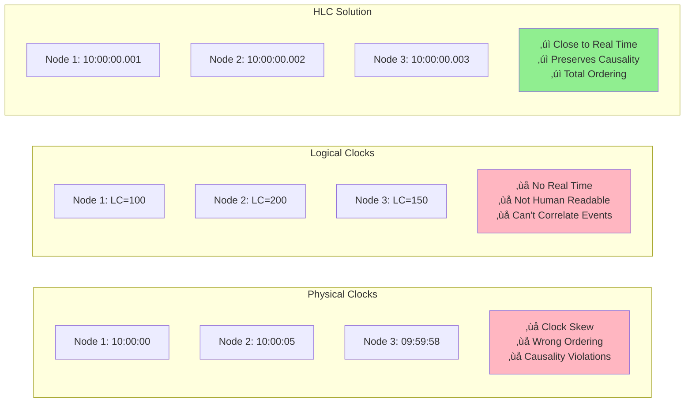

# Hybrid Logical Clocks (HLC) Pattern

!!! success "🏆 Gold Standard Pattern"
    **Best of Both Worlds: Physical Time + Logical Ordering**
    
    HLC solves the distributed timestamp problem by combining wall-clock time with logical counters. Used by CockroachDB (petabyte scale), MongoDB (millions ops/sec), and YugabyteDB (global ACID).

!!! question "Essential Questions for Modern Distributed Systems"
    - **Q: How do you get both wall-clock time AND causal consistency?**  
      A: Combine physical timestamp with logical counter in single 64-bit value
    - **Q: What happens when clocks drift between nodes?**  
      A: HLC absorbs drift up to configured bounds while maintaining causality
    - **Q: How does this compare to Google's TrueTime?**  
      A: Similar guarantees without specialized hardware - trades wait time for logical counter

<div class="decision-box">
<h3>🎯 When to Use HLC</h3>


</div>

## The Problem: Physical vs Logical Time



## HLC Core Concept

<div class="axiom-box">
<h4>💡 The HLC Formula</h4>

**HLC Timestamp = Physical Time + Logical Counter**

- **Physical Part (48 bits)**: Milliseconds since epoch (close to wall clock)
- **Logical Part (16 bits)**: Disambiguates events at same physical time
- **Format**: `physical_time.logical_counter` (e.g., `1706280000.42`)

</div>

## The Three HLC Rules

### Visual Algorithm


### Simple Rules

<div class="grid">
<div class="card">
<h4>Rule 1: Local Event</h4>

```python
if now > pt:
    pt = now
    c = 0
else:
    c = c + 1
```
</div>

<div class="card">
<h4>Rule 2: Send Message</h4>

```python
# Update local HLC first
hlc_update_local()
# Attach timestamp
msg.hlc = (pt, c)
```
</div>

<div class="card">
<h4>Rule 3: Receive Message</h4>

```python
pt_new = max(pt_local, pt_msg, now)
if pt_new == now:
    c = 0
elif pt_new == pt_local == pt_msg:
    c = max(c_local, c_msg) + 1
else:
    c = c_of_max + 1
```
</div>
</div>

## Key Properties

### Property 1: Bounded Drift

<div class="axiom-box">
<h4>📏 Drift Bound Guarantee</h4>

**|HLC_time - Physical_time| ≤ ε**

Where ε = max_clock_error + max_message_delay

- **Datacenter**: ε ≈ 11ms (1ms clock + 10ms network)
- **Cloud**: ε ≈ 110ms (10ms clock + 100ms network)
- **GPS-synced**: ε ≈ 10.1ms (100μs clock + 10ms network)
</div>

### Property 2: Causality Preservation


## Clock Type Comparison

| Feature | Physical | Lamport | Vector | **HLC** |
|---------|----------|---------|---------|---------|
| **Wall Time** | ✓ Exact | ✗ None | ✗ None | ✓ Approximate |
| **Causality** | ✗ May violate | ✓ Preserves | ✓ Detects concurrent | ✓ Preserves |
| **Size** | 8 bytes | 4-8 bytes | O(n) × 8 bytes | 8 bytes |
| **Clock Sync** | Required | Not needed | Not needed | Beneficial |
| **Best For** | Timestamps | Event ordering | Conflict detection | **Modern databases** |

## Simple Implementation

```python
class HLC:
    def __init__(self):
        self.pt = 0  # physical time
        self.c = 0   # logical counter
    
    def update(self, msg_pt=None, msg_c=None):
        """Update HLC for local event or message"""
        now = current_time_ms()
        
        if msg_pt is None:  # Local event
            if now > self.pt:
                self.pt = now
                self.c = 0
            else:
                self.c += 1
        else:  # Receive message
            new_pt = max(self.pt, msg_pt, now)
            
            if new_pt == now:
                self.c = 0
            elif new_pt == self.pt == msg_pt:
                self.c = max(self.c, msg_c) + 1
            else:
                self.c = (self.c if new_pt == self.pt else msg_c) + 1
            
            self.pt = new_pt
        
        return (self.pt, self.c)
```

## Production Considerations

<div class="grid">
<div class="card">
<h4>⚠️ Counter Overflow</h4>

**Problem**: 16-bit counter = 65,535 max  
**At 1M events/sec**: Overflow in 65ms  
**Solution**: Wait for physical time tick  
**Better**: Use microsecond precision
</div>

<div class="card">
<h4>💾 Persistence</h4>

**Problem**: Clock reset on restart  
**Impact**: Causality violations  
**Solution**: Save HLC to disk  
**On restart**: max(saved, current_time)
</div>

<div class="card">
<h4>🕐 Clock Jumps</h4>

**Problem**: NTP adjustments  
**Forward jump**: Accept if < 1 min  
**Backward jump**: Keep using old time  
**Monitor**: Alert on large jumps
</div>
</div>

## Real-World Examples

### Production Usage Patterns

| System | HLC Usage | Scale | Key Benefit |
|--------|-----------|-------|-------------|
| **CockroachDB** | MVCC timestamps | Petabyte clusters | Global consistency |
| **MongoDB** | Session consistency | Millions ops/sec | Causal reads |
| **YugabyteDB** | Transaction ordering | Global deployment | ACID guarantees |
| **Kafka** | Event timestamps | Trillion events/day | Order preservation |

### Visual: HLC in Distributed Database


## HLC vs TrueTime

<div class="axiom-box">
<h4>🆚 Key Difference</h4>

**TrueTime**: Uses specialized hardware (GPS/atomic clocks) to bound uncertainty, then waits out the uncertainty interval

**HLC**: Uses standard NTP clocks with logical counters to handle uncertainty without waiting

Trade-off: TrueTime guarantees external consistency, HLC provides best-effort with no special hardware
</div>

| Feature | TrueTime | HLC |
|---------|----------|-----|
| **Hardware** | GPS + Atomic clocks | Standard NTP |
| **Commit Latency** | Wait 2×ε (14ms typical) | No wait |
| **Guarantees** | External consistency | Causal consistency |
| **Cost** | Very high | Low |
| **Complexity** | High | Medium |

## Common Pitfalls

<div class="grid">
<div class="card">
<h4>❌ Clock Skew Assumptions</h4>

**Don't**: Assume ±1ms sync  
**Reality**: Can be ±30s+  
**Do**: Monitor actual skew  
**Alert**: When > threshold
</div>

<div class="card">
<h4>❌ Counter Overflow</h4>

**Don't**: Ignore at high rate  
**Problem**: 65K events = overflow  
**Do**: Use μs precision  
**Or**: Implement wait logic
</div>

<div class="card">
<h4>❌ Physical Comparison</h4>

**Don't**: Compare HLC to wall clock  
**Why**: HLC can be "ahead"  
**Do**: Use HLC everywhere  
**Or**: Track drift separately
</div>
</div>

## Summary

<div class="axiom-box">
<h3>🎯 HLC Design Principles</h3>

1. **Best of Both Worlds**: Combines wall-clock approximation with logical consistency
2. **Bounded Uncertainty**: Drift from physical time is bounded by clock error + network delay
3. **Causality Preservation**: Always respects happens-before relationships
4. **Constant Overhead**: Fixed 64-bit size regardless of cluster size
5. **Practical Consistency**: Achieves consistency without specialized hardware

</div>

### When to Use HLC

✅ **Perfect for:**
- Distributed databases requiring global timestamps
- Event streaming with causal ordering
- Systems needing human-readable timestamps
- Multi-region deployments with clock skew

❌ **Avoid when:**
- Need to detect concurrent updates (use vector clocks)
- Have perfect clock synchronization
- Only need logical ordering (use Lamport clocks)
- Building single-node systems

### Implementation Checklist

| ✓ | Task | Why Important |
|---|------|---------------|
| ☐ | Choose time precision (ms/μs/ns) | Affects overflow rate |
| ☐ | Implement counter overflow handling | Prevents stalls |
| ☐ | Add persistence across restarts | Maintains monotonicity |
| ☐ | Monitor clock synchronization | Ensures bounded drift |
| ☐ | Handle backward time jumps | Prevents violations |
| ☐ | Add comprehensive metrics | Production visibility |

## Related Patterns

- [Logical Clocks](logical-clocks.md) - Simpler causality tracking
- [Vector Clocks](vector-clocks.md) - Full concurrency detection
- [Clock Synchronization](clock-sync.md) - Physical time coordination
- [Event Sourcing](event-sourcing.md) - Event streams with HLC
- [Consensus](consensus.md) - Often combined with HLC

## References

- [Logical Physical Clocks and Consistent Snapshots](https://cse.buffalo.edu/tech-reports/2014-04.pdf) - Original HLC paper
- [CockroachDB Clock Synchronization](https://www.cockroachlabs.com/docs/stable/architecture/transaction-layer.html#time-and-hybrid-logical-clocks) 
- [YugabyteDB Hybrid Time](https://docs.yugabyte.com/preview/architecture/transactions/transactions-overview/#hybrid-time-as-an-mvcc-timestamp)
- [Time, Clocks, and the Ordering of Events](https://lamport.azurewebsites.net/pubs/time-clocks.pdf) - Lamport's foundational work
- [Spanner: Google's Globally-Distributed Database](https://research.google/pubs/pub39966/) - TrueTime comparison