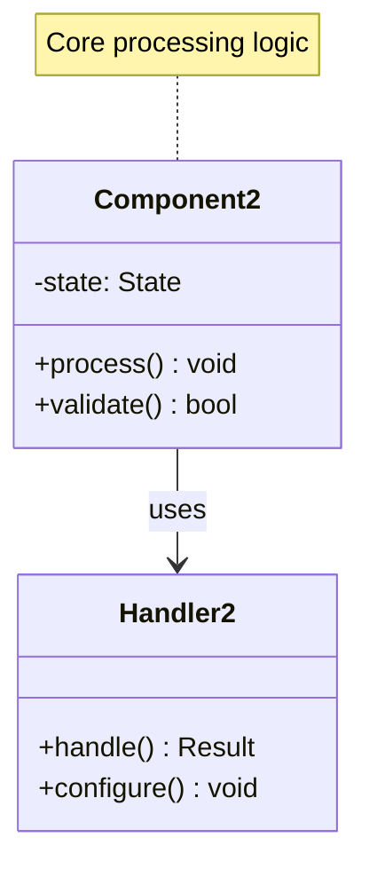
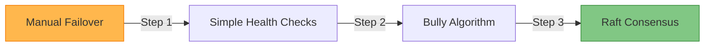

# Leader Election Pattern

!!! success "🏆 Gold Standard Pattern"
    **Preventing split-brain through coordinated leadership with automatic failover** • Kubernetes, Kafka, MongoDB proven at scale
    
    Essential for maintaining system consistency by ensuring exactly one decision-maker. Prevents conflicts and chaos in distributed coordination while providing automatic failover.
    
    **Key Success Metrics:**
    - Kubernetes: Manages millions of clusters with sub-second failover
    - Kafka: Coordinates thousands of brokers handling trillion+ messages
    - MongoDB: Sub-30-second automatic failover for millions of databases

## Essential Question

**How do we ensure exactly one node has authority to make decisions in a distributed system?**

## When to Use / When NOT to Use

### ✅ Use When

| Scenario | Example | Impact |
|----------|---------|--------|
| Single writer coordination | Database primary election | Prevents conflicting writes |
| Resource management | Cluster scheduler leader | Ensures optimal resource allocation |
| Configuration management | Service registry leader | Maintains consistent global state |
| Task coordination | Job scheduler master | Prevents duplicate job execution |

### ❌ DON'T Use When

| Scenario | Why | Alternative |
|----------|-----|-------------|
| All nodes equal | No coordination needed | Peer-to-peer consensus |
| Read-only workloads | No conflicts to prevent | Load balancing |
| Stateless operations | No shared state to manage | Round-robin distribution |
| High-frequency decisions | Election overhead too high | Pre-partitioned responsibilities |

## Level 1: Intuition (5 min) {#intuition}

### The Story

Leader election is like choosing a team captain before a game. Everyone could potentially be captain, but having multiple captains causes chaos—conflicting decisions, confused players. The team needs a fair way to choose one captain that everyone agrees to follow, and if the captain gets injured, they need a quick way to elect a replacement.

### Visual Metaphor

### Core Insight

> **Key Takeaway:** Better to have brief periods with no leader than multiple leaders causing chaos.

### In One Sentence

Leader Election **prevents split-brain scenarios** by **coordinating node consensus** to achieve **exactly one decision-maker with automatic failover**.

## Level 2: Foundation (10 min) {#foundation}

### The Problem Space

<h4>🚨 What Happens Without This Pattern</h4>

**Financial Services, 2018**: MongoDB cluster entered election storm during peak trading—127 elections in 6 hours due to network micro-partitions.

**Impact**: $12M in missed trades, 48-hour data reconciliation, $3M customer compensation, and regulatory investigation.

### How It Works

#### Architecture Overview

#### Key Components

| Component | Purpose | Responsibility |
|-----------|---------|----------------|
| Election Service | Coordinate voting | Manage election rounds and vote counting |
| Vote Storage | Persist election state | Store votes and terms for consistency |
| Term Management | Prevent old leaders | Increment terms to invalidate stale leaders |
| Health Monitor | Detect failures | Trigger elections when leader fails |

### Basic Example

📄 View implementation code

# Simplified leader election state machine
class NodeState:
    def __init__(self):
        self.state = "FOLLOWER"  # FOLLOWER, CANDIDATE, LEADER
        self.current_term = 0
        self.voted_for = None
        self.election_timeout = random.randint(150, 300)  # ms

    def start_election(self):
        self.state = "CANDIDATE"
        self.current_term += 1
        self.voted_for = self.node_id
        # Request votes from other nodes

## Level 3: Deep Dive (15 min) {#deep-dive}

### Implementation Details

#### State Management

#### Critical Design Decisions

| Decision | Options | Trade-off | Recommendation |
|----------|---------|-----------|----------------|
| **Algorithm Choice** | Raft Bully Lease-based | Raft: Safe but complex Bully: Simple but fragile Lease: Fast but eventual | Raft for critical systems |
| **Election Timeout** | Fixed Randomized Adaptive | Fixed: Split votes Random: Better distribution Adaptive: Complex tuning | Randomized 150-300ms |
| **Quorum Size** | Majority All nodes Fixed count | Majority: Available during partitions All: Fragile Fixed: Inflexible | Majority (N/2+1) |

### Common Pitfalls

<h4>⚠️ Avoid These Mistakes</h4>

1. **Split Vote Prevention**: Use randomized timeouts → Prevents endless tied elections
2. **Network Partition Handling**: Require majority quorum → Ensures at most one leader
3. **Stale Leader Detection**: Increment terms on each election → Invalidates old leaders

### Production Considerations

#### Performance Characteristics

| Metric | Raft | Bully Algorithm | Lease-based |
|--------|------|----------------|-------------|
| Election time | 100-500ms | 50-200ms | 10-100ms |
| Network messages | O(n²) | O(n²) | O(n) |
| Partition tolerance | High | Low | Medium |
| Complexity | High | Low | Medium |

## Level 4: Expert (20 min) {#expert}

### Advanced Techniques

#### Optimization Strategies

1. **Pre-Vote Phase**
   - When to apply: Reduce disruptions from partitioned nodes
   - Impact: Prevents unnecessary term increments
   - Trade-off: Additional complexity and latency

2. **Leadership Transfer**
   - When to apply: Planned maintenance or load rebalancing
   - Impact: Zero-downtime leader changes
   - Trade-off: Protocol complexity for graceful handoff

### Scaling Considerations

### Monitoring & Observability

#### Key Metrics to Track

| Metric | Alert Threshold | Dashboard Panel |
|--------|----------------|-----------------|
| Election frequency | > 1 per hour | Election timeline |
| Election duration | > 10 seconds | Election latency |
| Leadership stability | < 95% uptime | Leader health |
| Split brain events | Any occurrence | Critical alerts |

## Level 5: Mastery (30 min) {#mastery}

### Real-World Case Studies

#### Case Study 1: Kubernetes at Scale

<h4>💡 Production Insights from Kubernetes</h4>

**Challenge**: Coordinate controller managers across millions of clusters without split-brain

**Implementation**:
- etcd-based leader election with lease mechanism
- 15-second lease renewals with 10-second timeout
- Graceful shutdown with leadership transfer
- Circuit breakers for election service failures

**Results**:
- 99.9% leader availability across global deployments
- Sub-second failover for controller manager elections
- Zero split-brain incidents in production
- Scales to thousands of concurrent elections

**Lessons Learned**: Simple lease-based election often outperforms complex consensus for non-critical decisions

### Pattern Evolution

#### Migration from Legacy

📄 View mermaid code (7 lines)

#### Future Directions

| Trend | Impact on Pattern | Adaptation Strategy |
|-------|------------------|-------------------|
| Cloud-native | Multi-region elections needed | Hierarchical leader structures |
| Edge Computing | Latency-sensitive elections | Regional election domains |
| AI/ML Workloads | Dynamic leadership based on load | Adaptive election algorithms |

### Pattern Combinations

#### Works Well With

| Pattern | Combination Benefit | Integration Point |
|---------|-------------------|------------------|
| Distributed Lock | Serialize critical operations | Leader coordinates lock grants |
| Circuit Breaker | Prevent election storms | Break election cycles on failures |
| Heartbeat | Failure detection mechanism | Trigger elections on heartbeat loss |

## Quick Reference

### Decision Matrix

### Comparison with Alternatives

| Aspect | Leader Election | Consensus | Distributed Lock |
|--------|----------------|-----------|------------------|
| Purpose | Single coordinator | Agreement on value | Mutual exclusion |
| Availability | High | Medium | Medium |
| Consistency | Strong | Strong | Strong |
| Complexity | Medium | High | Medium |
| When to use | Coordination | State machine | Resource access |

### Implementation Checklist

**Pre-Implementation**
- [ ] Identified single-point-of-control requirements
- [ ] Analyzed network partition scenarios
- [ ] Planned election timeout configuration
- [ ] Designed leader responsibility boundaries

**Implementation**
- [ ] Election algorithm implemented with proper state machine
- [ ] Quorum requirements configured correctly
- [ ] Health monitoring and failure detection active
- [ ] Split-brain prevention mechanisms in place

**Post-Implementation**
- [ ] Election storm scenarios tested
- [ ] Leadership transfer procedures verified
- [ ] Monitoring dashboards configured
- [ ] Runbooks created for common failure modes

### Related Resources

- :material-book-open-variant:{ .lg .middle } **Related Patterns**
    
    ---
    
    - [Distributed Lock](../../pattern-library/coordination/distributed-lock.md) - Uses election for coordination
    - [Consensus](../../pattern-library/coordination/consensus.md) - Foundation for safe elections
    - [Heartbeat](../communication/heartbeat.md) - Failure detection mechanism

- :material-flask:{ .lg .middle } **Fundamental Laws**
    
    ---
    
    - [Law 4: Multidimensional Optimization](../../core-principles/laws/multidimensional-optimization/) - Safety vs availability trade-offs
    - [Law 2: Asynchronous Reality](../../core-principles/laws/asynchronous-reality/) - Network delays affect elections

- :material-pillar:{ .lg .middle } **Foundational Pillars**
    
    ---
    
    - [Pillar 4: Control Distribution](../../core-principles/pillars/control-distribution/) - Centralized decision making
    - [Pillar 3: Truth Distribution](../../core-principles/pillars/truth-distribution/) - Single source of authority

- :material-tools:{ .lg .middle } **Implementation Guides**
    
    ---
    
    - [Election Setup Guide](../../excellence/guides/election-setup.md)
    - [Testing Guide](../../excellence/guides/partition-testing.md)
    - [Raft Implementation](../../excellence/guides/raft-implementation.md)

---

