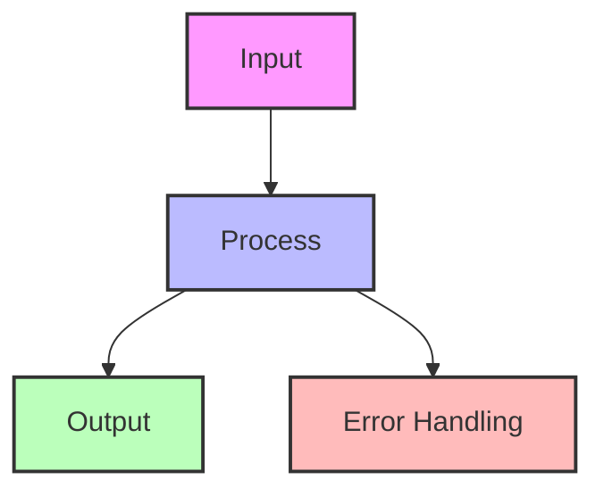
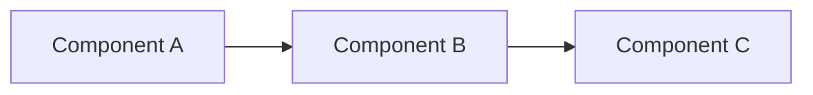
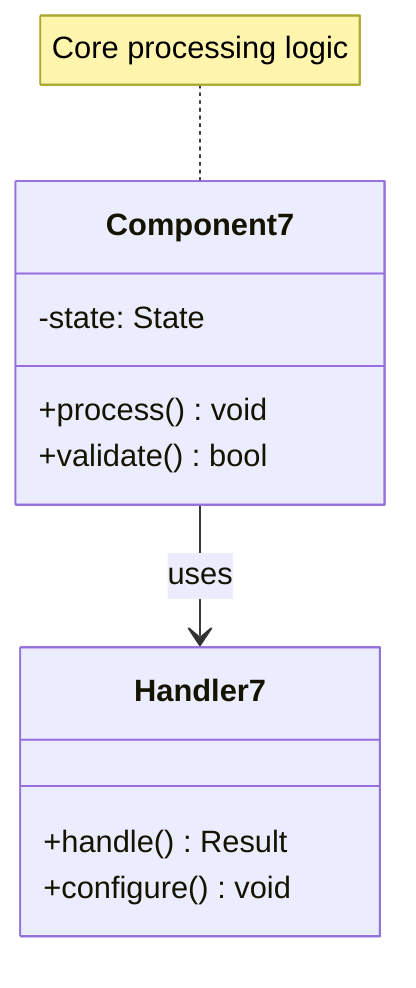
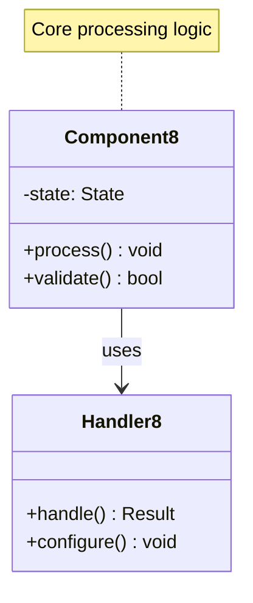
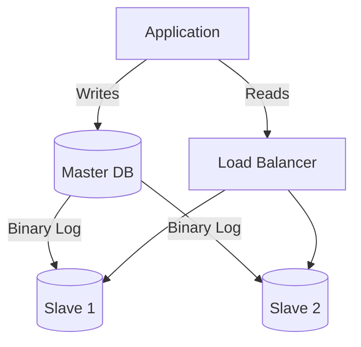

## Essential Question

**How do we coordinate distributed components effectively using leader-follower pattern?**

# Leader-Follower Pattern

Coordination Pattern
 Designate one node as leader to coordinate all writes, ensuring consistency while followers serve reads for scalability.

## Problem Context

!!! warning "🎯 The Challenge"

 In distributed systems, when multiple nodes can accept writes:
 - **Conflicts arise** from concurrent updates
 - **Ordering is ambiguous** without coordination
 - **Split-brain scenarios** cause data divergence
 - **Consistency is hard** to maintain

 The leader-follower pattern solves this by establishing a single source of truth.

## Solution Architecture

## How It Works

### 1. Leader Election Process

### 2. Write Operation Flow

### 3. Read Strategies

<table class="responsive-table">
<thead>
<tr>
<th>Strategy</th>
<th>Consistency</th>
<th>Performance</th>
<th>Use Case</th>
</tr>
</thead>
<tbody>
<tr>
<td data-label="Strategy"><strong>Read from Leader</strong></td>
<td data-label="Consistency">Strong</td>
<td data-label="Performance">Lower (bottleneck)</td>
<td data-label="Use Case">Financial data</td>
</tr>
<tr>
<td data-label="Strategy"><strong>Read from Followers</strong></td>
<td data-label="Consistency">Eventual</td>
<td data-label="Performance">Higher (distributed)</td>
<td data-label="Use Case">Product catalog</td>
</tr>
<tr>
<td data-label="Strategy"><strong>Read Your Writes</strong></td>
<td data-label="Consistency">Session</td>
<td data-label="Performance">Medium</td>
<td data-label="Use Case">User profiles</td>
</tr>
<tr>
<td data-label="Strategy"><strong>Quorum Reads</strong></td>
<td data-label="Consistency">Strong</td>
<td data-label="Performance">Medium</td>
<td data-label="Use Case">Critical queries</td>
</tr>
</tbody>
</table>

## Level 1: Intuition (5 minutes)

*Start your journey with relatable analogies*

### The Elevator Pitch
[Pattern explanation in simple terms]

### Real-World Analogy
[Everyday comparison that explains the concept]

## Level 2: Foundation (10 minutes)

*Build core understanding*

### Core Concepts
- Key principle 1
- Key principle 2
- Key principle 3

### Basic Example

## Level 3: Deep Dive (15 minutes)

*Understand implementation details*

### How It Really Works
[Technical implementation details]

### Common Patterns
[Typical usage patterns]

## Level 4: Expert (20 minutes)

*Master advanced techniques*

### Advanced Configurations
[Complex scenarios and optimizations]

### Performance Tuning
[Optimization strategies]

## Level 5: Mastery (30 minutes)

*Apply in production*

### Real-World Case Studies
[Production examples from major companies]

### Lessons from the Trenches
[Common pitfalls and solutions]

## Decision Matrix

### Quick Decision Table

| Factor | Low Complexity | Medium Complexity | High Complexity |
|--------|----------------|-------------------|-----------------|
| Team Size | < 5 developers | 5-20 developers | > 20 developers |
| Traffic | < 1K req/s | 1K-100K req/s | > 100K req/s |
| Data Volume | < 1GB | 1GB-1TB | > 1TB |
| **Recommendation** | ❌ Avoid | ⚠️ Consider | ✅ Implement |

## Implementation Patterns

### Pattern 1: Synchronous Replication

📄 View implementation code

class SynchronousLeader:
 def write(self, key, value):
# Write to leader's log
 self.log.append((key, value))
 
# Replicate to all followers
 acks = 0
 for follower in self.followers:
 if follower.replicate(key, value):
 acks += 1
 
# Wait for majority
 if acks >= len(self.followers) // 2:
 self.commit(key, value)
 return True
 else:
 self.rollback(key)
 return False

### Pattern 2: Asynchronous Replication

📄 View implementation code

class AsynchronousLeader:
 def write(self, key, value):
# Write locally first
 self.commit(key, value)
 
# Replicate in background
 for follower in self.followers:
 self.replication_queue.put({
 'follower': follower,
 'operation': (key, value)
 })
 
 return True # Immediate success

### Pattern 3: Chain Replication

## Failure Handling

### Leader Failure Detection

### Split Brain Prevention

!!! note "🧠 Preventing Split Brain"
 **Problem**: Network partition creates two leaders
 **Solutions**:
 1. **Quorum-based decisions**: Require majority for any operation
 2. **Fencing tokens**: Monotonically increasing leader epochs
 3. **External arbitrator**: ZooKeeper or etcd for coordination
 4. **Lease-based leadership**: Time-bound leader terms
 ## Performance Considerations

### Scalability Limits

### Optimization Strategies

1. **Batching**: Group multiple writes for efficient replication
2. **Pipelining**: Send next batch before previous acknowledges
3. **Compression**: Reduce replication bandwidth
4. **Read replicas**: Scale read capacity horizontally

## Real-World Examples

### 1. Database Systems

<h4>MySQL/PostgreSQL Replication</h4>

📄 View mermaid code (8 lines)

- Single master for writes
- Multiple slaves for read scaling
- Binary log for replication
- Configurable consistency levels

### 2. Consensus Systems

<h4>Raft Consensus</h4>

- Leaders elected by majority vote
- All changes go through leader
- Log replication ensures consistency
- Automatic failover on leader failure

### 3. Distributed Coordination

<h4>Apache Kafka</h4>

- Partition leaders handle all writes
- In-sync replicas (ISR) for durability
- Controller manages leader election
- Consumers can read from followers

## Trade-offs Analysis

<table class="responsive-table">
<thead>
<tr>
<th>Aspect</th>
<th>Advantages</th>
<th>Disadvantages</th>
</tr>
</thead>
<tbody>
<tr>
<td data-label="Aspect"><strong>Consistency</strong></td>
<td data-label="Advantages">Strong consistency for writes Clear ordering guarantees</td>
<td data-label="Disadvantages">Read consistency depends on strategy Replication lag issues</td>
</tr>
<tr>
<td data-label="Aspect"><strong>Availability</strong></td>
<td data-label="Advantages">Read availability scales Automatic failover possible</td>
<td data-label="Disadvantages">Write availability limited to leader Failover causes downtime</td>
</tr>
<tr>
<td data-label="Aspect"><strong>Performance</strong></td>
<td data-label="Advantages">Read scaling with followers Simple conflict resolution</td>
<td data-label="Disadvantages">Write bottleneck at leader Replication overhead</td>
</tr>
<tr>
<td data-label="Aspect"><strong>Complexity</strong></td>
<td data-label="Advantages">Conceptually simple Clear responsibility</td>
<td data-label="Disadvantages">Leader election complexity Split-brain handling</td>
</tr>
</tbody>
</table>

## When to Use

✅ **Good Fit**:
- Need strong consistency
- Read-heavy workloads
- Clear write patterns
- Can tolerate brief unavailability

❌ **Poor Fit**:
- Write-heavy workloads
- Need 100% write availability
- Geographically distributed writes
- Cannot tolerate replication lag

## Level 1: Intuition (5 minutes)

*Start your journey with relatable analogies*

### The Elevator Pitch
[Pattern explanation in simple terms]

### Real-World Analogy
[Everyday comparison that explains the concept]

## Level 2: Foundation (10 minutes)

*Build core understanding*

### Core Concepts
- Key principle 1
- Key principle 2
- Key principle 3

### Basic Example

## Level 3: Deep Dive (15 minutes)

*Understand implementation details*

### How It Really Works
[Technical implementation details]

### Common Patterns
[Typical usage patterns]

## Level 4: Expert (20 minutes)

*Master advanced techniques*

### Advanced Configurations
[Complex scenarios and optimizations]

### Performance Tuning
[Optimization strategies]

## Level 5: Mastery (30 minutes)

*Apply in production*

### Real-World Case Studies
[Production examples from major companies]

### Lessons from the Trenches
[Common pitfalls and solutions]

## Decision Matrix

### Quick Decision Table

| Factor | Low Complexity | Medium Complexity | High Complexity |
|--------|----------------|-------------------|-----------------|
| Team Size | < 5 developers | 5-20 developers | > 20 developers |
| Traffic | < 1K req/s | 1K-100K req/s | > 100K req/s |
| Data Volume | < 1GB | 1GB-1TB | > 1TB |
| **Recommendation** | ❌ Avoid | ⚠️ Consider | ✅ Implement |

## Implementation Checklist

- [ ] Leader election mechanism
- [ ] Heartbeat/failure detection
- [ ] Replication protocol
- [ ] Consistency guarantees
- [ ] Split-brain prevention
- [ ] Monitoring and alerting
- [ ] Failover procedures
- [ ] Read routing strategy

## Related Patterns

- [Leader Election](/pattern-library/coordination/leader-election/) - Choosing the leader
- [Consensus](/pattern-library/coordination/consensus/) - Agreement protocols
- [Primary-Backup](primary-backup.md) - Similar but simpler
- [Multi-Master](multi-master.md) - Alternative approach
- [Chain Replication](chain-replication.md) - Variation

## Law Connections

- **[Law 1: Correlated Failure](core-principles/laws/correlated-failure/index)**: Leader failure affects all writes
- **[Law 4: Trade-offs](core-principles/laws/multidimensional-optimization/index)**: Consistency vs availability balance
- **[Law 5: Distributed Knowledge](core-principles/laws/distributed-knowledge/index)**: Split-brain from partial knowledge

