# Logical Clocks (Lamport Clocks) Pattern

!!! question "Essential Questions for Distributed Coordination"
    - **Q: How do you order events when clocks aren't synchronized?**  
      A: Use logical timestamps based on causality, not physical time
    - **Q: What's the minimum information needed to preserve causality?**  
      A: A single monotonic counter per process plus message timestamps
    - **Q: How do you create total order from partial order?**  
      A: Add process IDs as tie-breakers for events with same timestamp

<div class="decision-box">
<h3>🎯 When to Use Logical Clocks</h3>


</div>

## Core Concept: Logical Time

### Visual: Physical vs Logical Time

```mermaid
graph TB
    subgraph "Physical Time Problems"
        PC1[Clock 1: 10:00:00] 
        PC2[Clock 2: 10:00:05]
        PC3[Clock 3: 09:59:58]
        Skew[⚠️ Clock Skew:<br/>Can't agree on "now"]
        PC1 --> Skew
        PC2 --> Skew
        PC3 --> Skew
    end
    
    subgraph "Logical Time Solution"
        LC1[Process 1: Counter = 0]
        LC2[Process 2: Counter = 0]
        LC3[Process 3: Counter = 0]
        Logic[✓ Start at 0<br/>Increment on events]
        LC1 --> Logic
        LC2 --> Logic
        LC3 --> Logic
    end
    
    style Skew fill:#FFB6C1
    style Logic fill:#90EE90
```

### The Happens-Before Relation (→)

<div class="axiom-box">
<h4>🔑 Lamport's Three Rules</h4>

1. **Same Process**: If A and B are events in the same process, and A comes before B, then A → B
2. **Message Passing**: If A is sending a message and B is receiving that message, then A → B  
3. **Transitivity**: If A → B and B → C, then A → C

</div>

### Visual Timeline Example

```mermaid
sequenceDiagram
    participant P1 as Process 1
    participant P2 as Process 2
    participant P3 as Process 3
    
    Note over P1,P3: All start with Clock = 0
    
    P1->>P1: Event A (Clock: 0→1)
    P1->>P2: Send M1 with timestamp 1
    Note over P2: Receive M1<br/>Clock = max(0,1)+1 = 2
    P2->>P2: Event B (Clock: 2→3)
    P2->>P3: Send M2 with timestamp 3
    Note over P3: Receive M2<br/>Clock = max(0,3)+1 = 4
    P3->>P3: Event C (Clock: 4→5)
    
    Note over P1,P3: Final ordering: A(1) → M1 → B(3) → M2 → C(5)
```



## Algorithm: Three Simple Rules

```mermaid
graph LR
    Event[Local Event] --> Inc[Clock++]
    Inc --> New[New Timestamp]
    
    Example[Example: Clock 5 → 6]
```

<div class="grid">
<div class="card">
<h4>📝 Rule 1: Local Event</h4>



**Before any local event, increment your clock**
</div>

<div class="card">
<h4>📤 Rule 2: Send Message</h4>

```mermaid
graph LR
    Send[Send Message] --> Inc[Clock++]
    Inc --> Attach[Attach Timestamp]
    Attach --> Transmit[Send with TS]
    
    Example[Example: Send(data, ts=6)]
```

**Increment clock and attach timestamp to message**
</div>

<div class="card">
<h4>📥 Rule 3: Receive Message</h4>

```mermaid
graph LR
    Recv[Receive TS] --> Max[max(local, received)]
    Max --> Inc[Result + 1]
    Inc --> Update[Update Clock]
    
    Example[Example: max(5,8)+1 = 9]
```

**Set clock to max(local, received) + 1**
</div>
</div>

### Visual Algorithm in Action

```mermaid
graph TB
    subgraph "Process States"
        P1_0[P1: Clock=0]
        P2_0[P2: Clock=0]
        P3_0[P3: Clock=0]
    end
    
    subgraph "Step 1: Local Events"
        P1_1[P1: Event A<br/>Clock=0→1]
        P2_1[P2: Event B<br/>Clock=0→1]
        P3_1[P3: Clock=0]
    end
    
    subgraph "Step 2: P1 sends to P2"
        P1_2[P1: Send M1<br/>Clock=1]
        P2_2[P2: Recv M1<br/>Clock=max(1,1)+1=2]
        P3_2[P3: Clock=0]
    end
    
    subgraph "Step 3: P2 sends to P3"
        P1_3[P1: Clock=1]
        P2_3[P2: Send M2<br/>Clock=2→3]
        P3_3[P3: Recv M2<br/>Clock=max(0,3)+1=4]
    end
    
    P1_0 --> P1_1 --> P1_2 --> P1_3
    P2_0 --> P2_1 --> P2_2 --> P2_3
    P3_0 --> P3_1 --> P3_2 --> P3_3
    
    style P1_1 fill:#E3F2FD
    style P2_1 fill:#E3F2FD
    style P2_2 fill:#C5E1A5
    style P3_3 fill:#C5E1A5
```

## Implementation

### Simple Python Implementation

```python
class LamportClock:
    def __init__(self):
        self.clock = 0
    
    def tick(self):
        """Rule 1: Increment on local event"""
        self.clock += 1
        return self.clock
    
    def send(self):
        """Rule 2: Increment and return timestamp for message"""
        self.clock += 1
        return self.clock
    
    def receive(self, timestamp):
        """Rule 3: Update to max(local, received) + 1"""
        self.clock = max(self.clock, timestamp) + 1
        return self.clock

# Example usage
p1_clock = LamportClock()
p2_clock = LamportClock()

# P1 does local work
p1_clock.tick()  # P1 clock = 1

# P1 sends message to P2
msg_timestamp = p1_clock.send()  # P1 clock = 2, sends ts=2

# P2 receives message
p2_clock.receive(msg_timestamp)  # P2 clock = max(0,2)+1 = 3
```

### Total Ordering: Breaking Ties

<div class="axiom-box">
<h4>⚖️ Creating Total Order from Partial Order</h4>

When two events have the same Lamport timestamp, we need a tie-breaker:
- Use process IDs as secondary sort key
- Event (timestamp=5, process=A) < Event (timestamp=5, process=B)

</div>

```python
def total_order(event1, event2):
    """Compare events for total ordering"""
    if event1.timestamp != event2.timestamp:
        return event1.timestamp < event2.timestamp
    else:
        # Break ties with process ID
        return event1.process_id < event2.process_id
```

## Practical Applications

### Application Comparison Matrix

| Use Case | Why Lamport Clocks? | Alternative | Trade-off |
|----------|-------------------|-------------|-----------|
| **Distributed Logs** | Order log entries causally | Physical timestamps | No clock sync needed |
| **State Machine Replication** | Ensure same operation order | Vector clocks | Simpler, less space |
| **Distributed Debugging** | Trace causality chains | No ordering | See cause-effect |
| **Database Replication** | Order updates consistently | 2PC | Eventually consistent |
| **Message Queues** | FIFO with causality | Sequence numbers | Handles partitions |

### Visual: Distributed Mutual Exclusion


### Real-World Example: Distributed Log Ordering

```mermaid
graph TB
    subgraph "Without Lamport Clocks"
        L1[Server A: User login @ 10:00:01]
        L2[Server B: Update profile @ 10:00:00]
        L3[Server C: Logout @ 10:00:02]
        
        Problem[❌ Profile updated before login?<br/>Clock skew causes wrong order]
        
        L1 --> Problem
        L2 --> Problem
        L3 --> Problem
    end
    
    subgraph "With Lamport Clocks"
        LL1[Server A: User login (LC=5)]
        LL2[Server B: Update profile (LC=8)]
        LL3[Server C: Logout (LC=12)]
        
        Correct[✓ Correct causal order:<br/>Login → Update → Logout]
        
        LL1 --> Correct
        LL2 --> Correct
        LL3 --> Correct
    end
    
    style Problem fill:#FFB6C1
    style Correct fill:#90EE90
```

## Limitations & Solutions

### Visual: Key Limitations

```mermaid
graph TB
    subgraph "Limitation 1: No Concurrency Detection"
        E1[Event A: LC=5]
        E2[Event B: LC=5]
        Q1[Are A and B concurrent?<br/>Can't tell!]
        E1 --> Q1
        E2 --> Q1
    end
    
    subgraph "Limitation 2: Unbounded Growth"
        Clock[Clock Value]
        Growth[Keeps growing: 1→2→3→...→∞]
        Clock --> Growth
    end
    
    subgraph "Limitation 3: No Real Time"
        LC[LC=1000]
        Time[What time is it?<br/>No idea!]
        LC --> Time
    end
    
    style Q1 fill:#FFE0B2
    style Growth fill:#FFCDD2
    style Time fill:#E1BEE7
```



### Solutions Overview

<div class="grid">
<div class="card">
<h4>🔍 Need Concurrency Detection?</h4>

**Use Vector Clocks**
- Tracks per-process counters
- Can detect concurrent events
- Higher space overhead O(n)
</div>

<div class="card">
<h4>⏰ Need Wall Clock Time?</h4>

**Use Hybrid Logical Clocks**
- Combines physical + logical time
- Bounded drift from real time
- Best of both worlds
</div>

<div class="card">
<h4>♾️ Worried About Overflow?</h4>

**Use Epoch-based Clocks**
- Reset counter periodically
- Track epoch number
- (epoch, counter) tuple
</div>
</div>

## Clock Type Comparison

| Feature | Physical Clock | Lamport Clock | Vector Clock | Hybrid Clock |
|---------|---------------|---------------|--------------|--------------|
| **Space Complexity** | O(1) | O(1) | O(n) processes | O(1) |
| **Time Relation** | ✓ Wall time | ✗ No | ✗ No | ✓ Approximate |
| **Causality** | ✗ May violate | ✓ Preserves | ✓ Preserves | ✓ Preserves |
| **Concurrency Detection** | ✗ No | ✗ No | ✓ Yes | ✗ No |
| **Clock Sync Needed** | ✓ Yes (NTP) | ✗ No | ✗ No | ~ Beneficial |
| **Main Use Case** | Timestamps | Event ordering | Conflict detection | Modern databases |

### Visual Clock Comparison


## Best Practices

<div class="grid">
<div class="card">
<h4>✅ Do's</h4>

- **Always increment** before any event
- **Thread-safe** updates (use locks/CAS)
- **Include timestamp** in all messages
- **Persist clock** value across restarts
- **Use process ID** for total ordering
</div>

<div class="card">
<h4>❌ Don'ts</h4>

- **Don't forget** to increment
- **Don't compare** with wall clock
- **Don't assume** synchronization
- **Don't ignore** overflow possibility
- **Don't use** for concurrency detection
</div>
</div>

## Real-World Examples

### Example 1: Distributed Log Aggregation


### Example 2: Replicated State Machine

```python
class ReplicatedStateMachine:
    def __init__(self, node_id):
        self.clock = LamportClock()
        self.state = {}
        self.operation_log = []
    
    def apply_operation(self, op):
        # Assign Lamport timestamp
        timestamp = self.clock.tick()
        
        # Log operation with timestamp
        self.operation_log.append({
            'timestamp': timestamp,
            'node_id': self.node_id,
            'operation': op
        })
        
        # Apply to state machine
        self.execute(op)
    
    def sync_with_peer(self, peer_ops):
        # Merge operations maintaining causal order
        all_ops = self.operation_log + peer_ops
        all_ops.sort(key=lambda x: (x['timestamp'], x['node_id']))
        
        # Rebuild state from ordered operations
        self.rebuild_state(all_ops)
```

## Summary

<div class="axiom-box">
<h3>🎯 Lamport Clocks in a Nutshell</h3>

**What**: A simple counter that creates logical time from causality  
**Why**: Order events without synchronized clocks  
**How**: Three rules - increment, send, receive  
**When**: Need total order, don't need concurrency detection  
**Cost**: Single integer per process, simple algorithm  

Remember: *"Time is an illusion, causality is real"* - Lamport clocks capture what matters.
</div>

## Implementation Checklist

| Step | Task | Why |
|------|------|-----|
| ☐ | Choose clock storage (int32/int64) | Prevent overflow |
| ☐ | Add thread synchronization | Concurrent safety |
| ☐ | Implement three rules | Core algorithm |
| ☐ | Add process ID for ties | Total ordering |
| ☐ | Persist clock value | Survive restarts |
| ☐ | Monitor clock growth | Detect issues |
| ☐ | Test concurrent scenarios | Verify correctness |

## Related Patterns

- [Vector Clocks](vector-clocks.md) - Detect concurrent events
- [Hybrid Logical Clocks](hlc.md) - Add wall-clock approximation
- [Generation Clock](generation-clock.md) - Leadership epochs
- [Event Sourcing](../data-management/event-sourcing.md) - Ordered event streams

## References

- ["Time, Clocks, and the Ordering of Events"](https://lamport.azurewebsites.net/pubs/time-clocks.pdf) - Lamport's original paper
- [The TLA+ Book](https://lamport.azurewebsites.net/tla/book.html) - Formal specification by Lamport
- ["Distributed Systems for Fun and Profit"](http://book.mixu.net/distsys/) - Chapter on time and order