## Essential Question
## When to Use / When NOT to Use

### When to Use

| Scenario | Why It Fits | Alternative If Not |
|----------|-------------|-------------------|
| High availability required | Pattern provides resilience | Consider simpler approach |
| Scalability is critical | Handles load distribution | Monolithic might suffice |
| Distributed coordination needed | Manages complexity | Centralized coordination |

### When NOT to Use

| Scenario | Why to Avoid | Better Alternative |
|----------|--------------|-------------------|
| Simple applications | Unnecessary complexity | Direct implementation |
| Low traffic systems | Overhead not justified | Basic architecture |
| Limited resources | High operational cost | Simpler patterns |
**How do we coordinate distributed components effectively using logical clocks (lamport clocks)?**

# Logical Clocks (Lamport Clocks) Pattern

!!! question "Essential Questions for Distributed Coordination"
    - **Q: How do you order events when clocks aren't synchronized?**  
      A: Use logical timestamps based on causality, not physical time
    - **Q: What's the minimum information needed to preserve causality?**  
      A: A single monotonic counter per process plus message timestamps
    - **Q: How do you create total order from partial order?**  
      A: Add process IDs as tie-breakers for events with same timestamp

<h3>🎯 When to Use Logical Clocks</h3>

### The Happens-Before Relation (→)

<h4>🔑 Lamport's Three Rules</h4>

1. **Same Process**: If A and B are events in the same process, and A comes before B, then A → B
2. **Message Passing**: If A is sending a message and B is receiving that message, then A → B  
3. **Transitivity**: If A → B and B → C, then A → C

### Visual Timeline Example

## Algorithm: Three Simple Rules

```mermaid
graph LR
    Event[Local Event] --> Inc[Clock++]
    Inc --> New[New Timestamp]
    
    Example[Example: Clock 5 → 6]
```

<h4>📝 Rule 1: Local Event</h4>

**Before any local event, increment your clock**

<h4>📤 Rule 2: Send Message</h4>

## Level 1: Intuition (5 minutes)

*Start your journey with relatable analogies*

### The Elevator Pitch
[Pattern explanation in simple terms]

### Real-World Analogy
[Everyday comparison that explains the concept]

## Level 2: Foundation (10 minutes)

*Build core understanding*

### Core Concepts
- Key principle 1
- Key principle 2
- Key principle 3

### Basic Example

## Level 3: Deep Dive (15 minutes)

*Understand implementation details*

### How It Really Works
[Technical implementation details]

### Common Patterns
[Typical usage patterns]

## Level 4: Expert (20 minutes)

*Master advanced techniques*

### Advanced Configurations
[Complex scenarios and optimizations]

### Performance Tuning
[Optimization strategies]

## Level 5: Mastery (30 minutes)

*Apply in production*

### Real-World Case Studies
[Production examples from major companies]

### Lessons from the Trenches
[Common pitfalls and solutions]

## Decision Matrix

### Quick Decision Table

| Factor | Low Complexity | Medium Complexity | High Complexity |
|--------|----------------|-------------------|-----------------|
| Team Size | < 5 developers | 5-20 developers | > 20 developers |
| Traffic | < 1K req/s | 1K-100K req/s | > 100K req/s |
| Data Volume | < 1GB | 1GB-1TB | > 1TB |
| **Recommendation** | ❌ Avoid | ⚠️ Consider | ✅ Implement |

## Implementation

### Simple Python Implementation

### Real-World Example: Distributed Log Ordering

## Limitations & Solutions

### Visual: Key Limitations

### Solutions Overview

<h4>🔍 Need Concurrency Detection?</h4>

**Use Vector Clocks**
- Tracks per-process counters
- Can detect concurrent events
- Higher space overhead O(n)

<h4>⏰ Need Wall Clock Time?</h4>

**Use Hybrid Logical Clocks**
- Combines physical + logical time
- Bounded drift from real time
- Best of both worlds

<h4>♾️ Worried About Overflow?</h4>

**Use Epoch-based Clocks**
- Reset counter periodically
- Track epoch number
- (epoch, counter) tuple

## Clock Type Comparison

| Feature | Physical Clock | Lamport Clock | Vector Clock | Hybrid Clock |
|---------|---------------|---------------|--------------|--------------|
| **Space Complexity** | O(1) | O(1) | O(n) processes | O(1) |
| **Time Relation** | ✓ Wall time | ✗ No | ✗ No | ✓ Approximate |
| **Causality** | ✗ May violate | ✓ Preserves | ✓ Preserves | ✓ Preserves |
| **Concurrency Detection** | ✗ No | ✗ No | ✓ Yes | ✗ No |
| **Clock Sync Needed** | ✓ Yes (NTP) | ✗ No | ✗ No | ~ Beneficial |
| **Main Use Case** | Timestamps | Event ordering | Conflict detection | Modern databases |

### Visual Clock Comparison

## Best Practices

<h4>✅ Do's</h4>

- **Always increment** before any event
- **Thread-safe** updates (use locks/CAS)
- **Include timestamp** in all messages
- **Persist clock** value across restarts
- **Use process ID** for total ordering

<h4>❌ Don'ts</h4>

- **Don't forget** to increment
- **Don't compare** with wall clock
- **Don't assume** synchronization
- **Don't ignore** overflow possibility
- **Don't use** for concurrency detection

## Real-World Examples

### Example 1: Distributed Log Aggregation

### Example 2: Replicated State Machine

View implementation code

📄 View implementation code

class ReplicatedStateMachine:
    def __init__(self, node_id):
        self.clock = LamportClock()
        self.state = {}
        self.operation_log = []
    
    def apply_operation(self, op):
        # Assign Lamport timestamp
        timestamp = self.clock.tick()
        
        # Log operation with timestamp
        self.operation_log.append({
            'timestamp': timestamp,
            'node_id': self.node_id,
            'operation': op
        })
        
        # Apply to state machine
        self.execute(op)
    
    def sync_with_peer(self, peer_ops):
        # Merge operations maintaining causal order
        all_ops = self.operation_log + peer_ops
        all_ops.sort(key=lambda x: (x['timestamp'], x['node_id']))
        
        # Rebuild state from ordered operations
        self.rebuild_state(all_ops)

## Summary

<h3>🎯 Lamport Clocks in a Nutshell</h3>

**What**: A simple counter that creates logical time from causality  
**Why**: Order events without synchronized clocks  
**How**: Three rules - increment, send, receive  
**When**: Need total order, don't need concurrency detection  
**Cost**: Single integer per process, simple algorithm  

Remember: *"Time is an illusion, causality is real"* - Lamport clocks capture what matters.

## Level 1: Intuition (5 minutes)

*Start your journey with relatable analogies*

### The Elevator Pitch
[Pattern explanation in simple terms]

### Real-World Analogy
[Everyday comparison that explains the concept]

## Level 2: Foundation (10 minutes)

*Build core understanding*

### Core Concepts
- Key principle 1
- Key principle 2
- Key principle 3

### Basic Example

## Level 3: Deep Dive (15 minutes)

*Understand implementation details*

### How It Really Works
[Technical implementation details]

### Common Patterns
[Typical usage patterns]

## Level 4: Expert (20 minutes)

*Master advanced techniques*

### Advanced Configurations
[Complex scenarios and optimizations]

### Performance Tuning
[Optimization strategies]

## Level 5: Mastery (30 minutes)

*Apply in production*

### Real-World Case Studies
[Production examples from major companies]

### Lessons from the Trenches
[Common pitfalls and solutions]

## Decision Matrix

### Quick Decision Table

| Factor | Low Complexity | Medium Complexity | High Complexity |
|--------|----------------|-------------------|-----------------|
| Team Size | < 5 developers | 5-20 developers | > 20 developers |
| Traffic | < 1K req/s | 1K-100K req/s | > 100K req/s |
| Data Volume | < 1GB | 1GB-1TB | > 1TB |
| **Recommendation** | ❌ Avoid | ⚠️ Consider | ✅ Implement |

## Implementation Checklist

| Step | Task | Why |
|------|------|-----|
| ☐ | Choose clock storage (int32/int64) | Prevent overflow |
| ☐ | Add thread synchronization | Concurrent safety |
| ☐ | Implement three rules | Core algorithm |
| ☐ | Add process ID for ties | Total ordering |
| ☐ | Persist clock value | Survive restarts |
| ☐ | Monitor clock growth | Detect issues |
| ☐ | Test concurrent scenarios | Verify correctness |

## Related Patterns

- [Vector Clocks](../coordination/logical-clocks.md) - Detect concurrent events
- [Hybrid Logical Clocks](../coordination/hlc.md) - Add wall-clock approximation
- [Generation Clock](../coordination/generation-clock.md) - Leadership epochs
- [Event Sourcing](../data-management/event-sourcing.md) - Ordered event streams

## References

- ["Time, Clocks, and the Ordering of Events"](https://lamport.azurewebsites.net/pubs/time-clocks.pdf/) - Lamport's original paper
- [The TLA+ Book](https://lamport.azurewebsites.net/tla/book.html/) - Formal specification by Lamport
- ["Distributed Systems for Fun and Profit"](http:/book.mixu.net/distsys/) - Chapter on time and order

