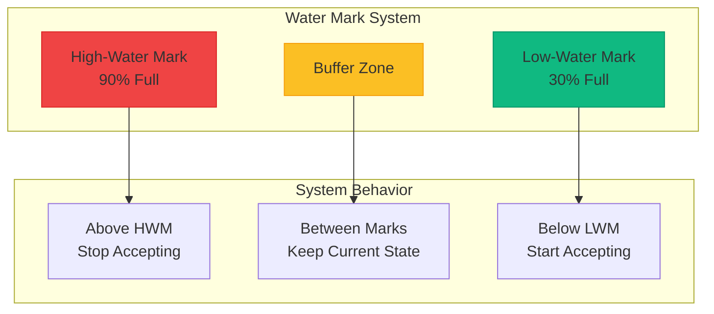
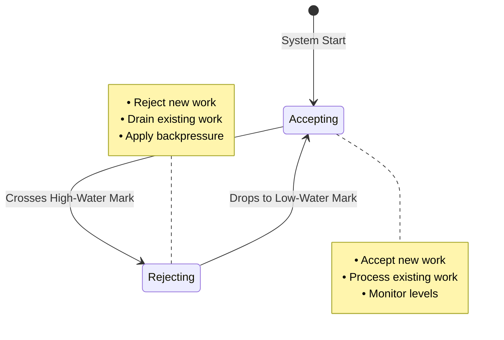
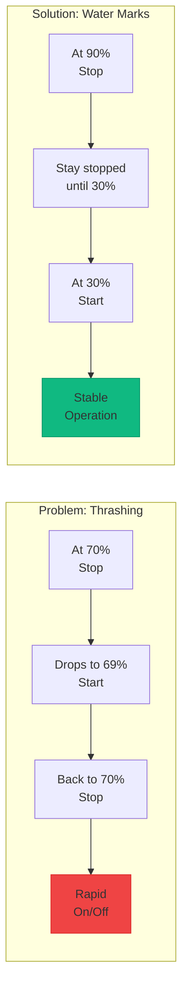
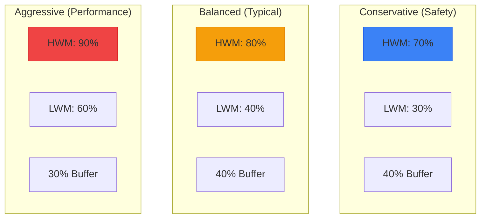
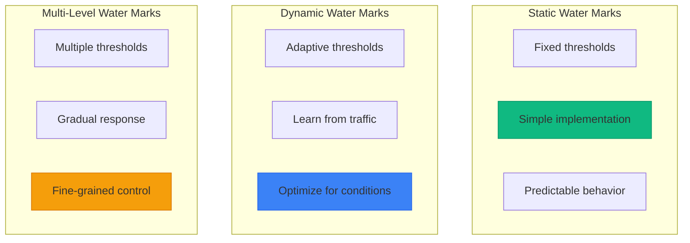
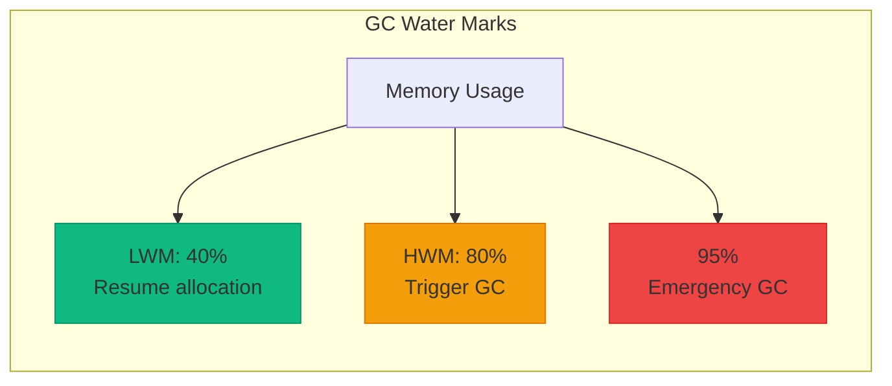
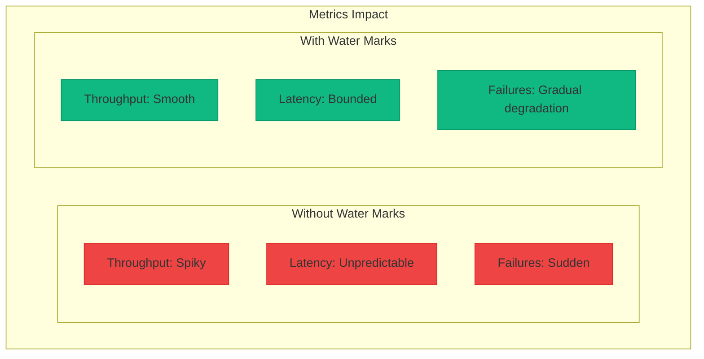
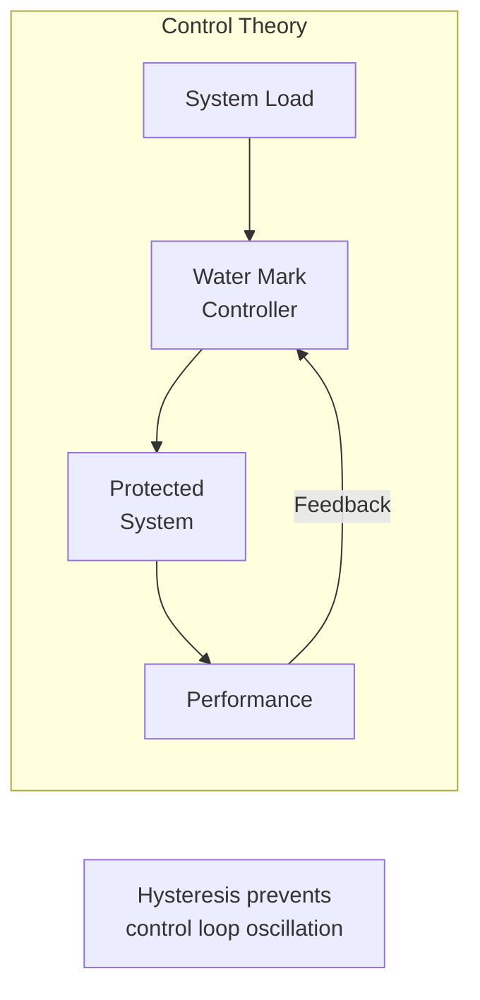

# Low-Water/High-Water Marks

**Flow control boundaries for distributed systems**

> *"Like a river between its banks, data flows best when contained by well-defined boundaries."*

---

## Level 1: Intuition

### The Dam Analogy

Low and high water marks work like a dam system:
- **High-water mark**: When water reaches this level, open the gates (stop accepting)
- **Low-water mark**: When water drops to this level, close the gates (start accepting)
- **Buffer zone**: The space between prevents rapid on/off switching
- **Overflow protection**: Prevents system flooding

This pattern prevents resource exhaustion while maintaining smooth operation.

### Visual Concept



### State Machine



---

## Level 2: Foundation

### Core Applications

| Use Case | Low Mark | High Mark | Purpose |
|----------|----------|-----------|---------|
| **TCP Flow Control** | 25% buffer | 75% buffer | Prevent packet loss |
| **Replication Lag** | 100 txns behind | 1000 txns behind | Control follower lag |
| **Message Queue** | 1K messages | 10K messages | Prevent memory exhaustion |
| **Thread Pool** | 20% utilized | 80% utilized | Scale workers |
| **Disk Usage** | 50% full | 90% full | Trigger cleanup |

### Hysteresis Prevention



### Common Configurations



---

## Level 3: Deep Dive

### Production Implementation

```python
from dataclasses import dataclass
from typing import Generic, TypeVar, Optional, Callable, List
from collections import deque
from datetime import datetime
import asyncio
from abc import ABC, abstractmethod
from enum import Enum

T = TypeVar('T')

class FlowState(Enum):
    ACCEPTING = "accepting"
    REJECTING = "rejecting"

@dataclass
class WaterMarkConfig:
    """Configuration for water mark thresholds"""
    low_water_mark: int
    high_water_mark: int
    capacity: int
    
    def __post_init__(self):
        if not 0 < self.low_water_mark < self.high_water_mark <= self.capacity:
            raise ValueError(
                f"Invalid water marks: 0 < {self.low_water_mark} < "
                f"{self.high_water_mark} <= {self.capacity}"
            )
    
    @property
    def hysteresis_gap(self) -> int:
        """Gap between marks to prevent thrashing"""
        return self.high_water_mark - self.low_water_mark

class WaterMarkBuffer(Generic[T]):
    """Buffer with high/low water mark flow control"""
    
    def __init__(
        self,
        config: WaterMarkConfig,
        on_state_change: Optional[Callable[[FlowState], None]] = None
    ):
        self.config = config
        self.buffer: deque[T] = deque(maxlen=config.capacity)
        self.state = FlowState.ACCEPTING
        self.on_state_change = on_state_change
        self._lock = asyncio.Lock()
        
        # Metrics
        self.total_accepted = 0
        self.total_rejected = 0
        self.state_changes = 0
        self.last_state_change = datetime.utcnow()
    
    async def try_add(self, item: T) -> bool:
        """Try to add item to buffer"""
        async with self._lock:
            current_size = len(self.buffer)
            
            # Check if we should accept
            if self.state == FlowState.REJECTING:
                if current_size <= self.config.low_water_mark:
                    # Transition to accepting
                    await self._change_state(FlowState.ACCEPTING)
                else:
                    # Still rejecting
                    self.total_rejected += 1
                    return False
            
            # Check capacity
            if current_size >= self.config.capacity:
                self.total_rejected += 1
                return False
            
            # Add item
            self.buffer.append(item)
            self.total_accepted += 1
            
            # Check if we should start rejecting
            if current_size + 1 >= self.config.high_water_mark:
                await self._change_state(FlowState.REJECTING)
            
            return True
    
    async def remove(self, count: int = 1) -> List[T]:
        """Remove items from buffer"""
        async with self._lock:
            items = []
            for _ in range(min(count, len(self.buffer))):
                if self.buffer:
                    items.append(self.buffer.popleft())
            
            # Check if we should start accepting
            if (self.state == FlowState.REJECTING and 
                len(self.buffer) <= self.config.low_water_mark):
                await self._change_state(FlowState.ACCEPTING)
            
            return items
    
    async def _change_state(self, new_state: FlowState):
        """Change flow control state"""
        if self.state != new_state:
            self.state = new_state
            self.state_changes += 1
            self.last_state_change = datetime.utcnow()
            
            if self.on_state_change:
                # Run callback without blocking
                asyncio.create_task(
                    self._run_callback(new_state)
                )
    
    async def _run_callback(self, state: FlowState):
        """Run state change callback safely"""
        try:
            if asyncio.iscoroutinefunction(self.on_state_change):
                await self.on_state_change(state)
            else:
                self.on_state_change(state)
        except Exception as e:
            print(f"State change callback error: {e}")
    
    @property
    def fill_percentage(self) -> float:
        """Current fill level as percentage"""
        return (len(self.buffer) / self.config.capacity) * 100
    
    @property
    def metrics(self) -> dict:
        """Get buffer metrics"""
        return {
            'current_size': len(self.buffer),
            'fill_percentage': self.fill_percentage,
            'state': self.state.value,
            'total_accepted': self.total_accepted,
            'total_rejected': self.total_rejected,
            'rejection_rate': self.total_rejected / max(1, self.total_accepted + self.total_rejected),
            'state_changes': self.state_changes,
            'time_in_state': (datetime.utcnow() - self.last_state_change).total_seconds()
        }

# Replication lag control
class ReplicationLagController:
    """Control replication lag using water marks"""
    
    def __init__(
        self,
        low_lag_threshold: int = 100,    # transactions
        high_lag_threshold: int = 1000,   # transactions
    ):
        self.low_threshold = low_lag_threshold
        self.high_threshold = high_lag_threshold
        self.accepting_writes = True
        self.current_lag = 0
        self.write_throttle_rate = 1.0  # 1.0 = no throttle
    
    async def update_lag(self, leader_position: int, follower_position: int):
        """Update replication lag and adjust flow control"""
        self.current_lag = leader_position - follower_position
        
        if self.accepting_writes and self.current_lag >= self.high_threshold:
            # Start throttling writes
            self.accepting_writes = False
            self.write_throttle_rate = 0.1  # Accept 10% of writes
            print(f"High water mark reached ({self.current_lag}), throttling writes")
            
        elif not self.accepting_writes and self.current_lag <= self.low_threshold:
            # Resume normal writes
            self.accepting_writes = True
            self.write_throttle_rate = 1.0
            print(f"Low water mark reached ({self.current_lag}), resuming writes")
        
        # Gradual throttling between marks
        elif self.low_threshold < self.current_lag < self.high_threshold:
            # Linear interpolation
            range_size = self.high_threshold - self.low_threshold
            position = self.current_lag - self.low_threshold
            self.write_throttle_rate = 1.0 - (0.9 * position / range_size)
    
    def should_accept_write(self) -> bool:
        """Decide if write should be accepted based on throttle rate"""
        import random
        return random.random() < self.write_throttle_rate

# TCP-style flow control
class TCPFlowController:
    """TCP-style sliding window with water marks"""
    
    def __init__(
        self,
        window_size: int = 65536,  # 64KB
        low_water_percentage: float = 0.25,
        high_water_percentage: float = 0.75
    ):
        self.window_size = window_size
        self.low_water = int(window_size * low_water_percentage)
        self.high_water = int(window_size * high_water_percentage)
        
        self.unacked_bytes = 0
        self.window_open = True
        self.last_advertised_window = window_size
    
    def on_data_sent(self, bytes_sent: int) -> bool:
        """Called when data is sent"""
        if not self.window_open and self.unacked_bytes > 0:
            return False  # Window closed
        
        self.unacked_bytes += bytes_sent
        
        # Check high water mark
        if self.unacked_bytes >= self.high_water:
            self.window_open = False
            self.advertise_window(0)  # Tell sender to stop
        
        return True
    
    def on_ack_received(self, bytes_acked: int):
        """Called when ACK is received"""
        self.unacked_bytes = max(0, self.unacked_bytes - bytes_acked)
        
        # Check low water mark
        if not self.window_open and self.unacked_bytes <= self.low_water:
            self.window_open = True
            available = self.window_size - self.unacked_bytes
            self.advertise_window(available)
    
    def advertise_window(self, size: int):
        """Advertise window size to sender"""
        self.last_advertised_window = size
        print(f"Advertising window: {size} bytes")

# Dynamic water marks
class DynamicWaterMarkController:
    """Adjust water marks based on system conditions"""
    
    def __init__(self, initial_config: WaterMarkConfig):
        self.config = initial_config
        self.performance_history = deque(maxlen=100)
        self.adjustment_interval = 60  # seconds
        self.last_adjustment = datetime.utcnow()
    
    def record_performance(self, throughput: float, latency: float, rejection_rate: float):
        """Record system performance metrics"""
        self.performance_history.append({
            'timestamp': datetime.utcnow(),
            'throughput': throughput,
            'latency': latency,
            'rejection_rate': rejection_rate
        })
    
    def adjust_water_marks(self) -> Optional[WaterMarkConfig]:
        """Dynamically adjust water marks based on performance"""
        if len(self.performance_history) < 10:
            return None  # Not enough data
        
        # Calculate recent trends
        recent = list(self.performance_history)[-10:]
        avg_rejection = sum(p['rejection_rate'] for p in recent) / len(recent)
        avg_latency = sum(p['latency'] for p in recent) / len(recent)
        
        new_config = WaterMarkConfig(
            low_water_mark=self.config.low_water_mark,
            high_water_mark=self.config.high_water_mark,
            capacity=self.config.capacity
        )
        
        # Adjust based on rejection rate
        if avg_rejection > 0.1:  # >10% rejection
            # Increase high water mark (accept more)
            new_config.high_water_mark = min(
                int(self.config.high_water_mark * 1.1),
                self.config.capacity - 1
            )
        elif avg_rejection < 0.01 and avg_latency > 100:  # <1% rejection but high latency
            # Decrease high water mark (be more conservative)
            new_config.high_water_mark = int(self.config.high_water_mark * 0.9)
        
        # Maintain hysteresis gap
        min_gap = int(self.config.capacity * 0.2)  # 20% minimum gap
        if new_config.high_water_mark - new_config.low_water_mark < min_gap:
            new_config.low_water_mark = new_config.high_water_mark - min_gap
        
        self.last_adjustment = datetime.utcnow()
        return new_config if new_config != self.config else None

# Example: Producer-Consumer with backpressure
async def producer_consumer_example():
    """Example of water marks for backpressure"""
    
    # Create buffer with water marks
    config = WaterMarkConfig(
        low_water_mark=20,
        high_water_mark=80,
        capacity=100
    )
    
    async def on_state_change(state: FlowState):
        if state == FlowState.REJECTING:
            print("Buffer full - applying backpressure to producers")
        else:
            print("Buffer available - resuming production")
    
    buffer = WaterMarkBuffer[int](config, on_state_change)
    
    # Producer
    async def producer(producer_id: int):
        """Produce items respecting backpressure"""
        produced = 0
        rejected = 0
        
        for i in range(200):
            item = i + (producer_id * 1000)
            
            if await buffer.try_add(item):
                produced += 1
                await asyncio.sleep(0.01)  # Fast producer
            else:
                rejected += 1
                await asyncio.sleep(0.1)  # Backoff when rejected
        
        print(f"Producer {producer_id}: produced={produced}, rejected={rejected}")
    
    # Consumer
    async def consumer(consumer_id: int):
        """Consume items from buffer"""
        consumed = 0
        
        while consumed < 150:  # Consume 150 items
            items = await buffer.remove(5)  # Batch consumption
            consumed += len(items)
            
            if items:
                await asyncio.sleep(0.05 * len(items))  # Simulate processing
            else:
                await asyncio.sleep(0.1)  # Wait if buffer empty
        
        print(f"Consumer {consumer_id}: consumed={consumed}")
    
    # Run producers and consumers
    await asyncio.gather(
        producer(1),
        producer(2),
        consumer(1),
        consumer(2)
    )
    
    print(f"Final metrics: {buffer.metrics}")
```

### Water Mark Patterns



---

## Level 4: Expert

### Advanced Applications

#### 1. Distributed Garbage Collection



#### 2. Multi-Tier Water Marks

```python
class MultiTierWaterMarks:
    """Multiple water mark levels for graduated response"""
    
    def __init__(self):
        self.tiers = [
            (0.5, "normal"),      # <50%: normal operation
            (0.7, "warning"),     # 50-70%: warning, prepare to throttle
            (0.85, "throttle"),   # 70-85%: throttle new requests
            (0.95, "critical"),   # 85-95%: accept only critical
            (1.0, "reject_all")   # >95%: reject everything
        ]
    
    def get_tier(self, usage: float) -> str:
        """Get current tier based on usage"""
        for threshold, tier in self.tiers:
            if usage < threshold:
                return tier
        return "reject_all"
```

### Production Case Studies

| System | Use Case | Low Mark | High Mark | Result |
|--------|----------|----------|-----------|---------|
| **Kafka** | Partition lag | 1K messages | 10K messages | 50% less OOM |
| **RabbitMQ** | Memory usage | 40% RAM | 80% RAM | Stable under load |
| **PostgreSQL** | WAL size | 1GB | 8GB | Prevented disk full |
| **Cassandra** | Compaction | 20% pending | 50% pending | Smoother performance |

### Performance Impact



---

## Level 5: Mastery

### Theoretical Foundations

Water marks implement hysteresis to prevent oscillation:



### Optimal Water Mark Selection

```python
def calculate_optimal_water_marks(
    system_capacity: int,
    arrival_rate: float,      # requests/second
    processing_rate: float,   # requests/second
    response_time_sla: float, # seconds
    rejection_cost: float,    # per request
    overload_cost: float      # per incident
) -> tuple[int, int]:
    """Calculate optimal water marks using queueing theory"""
    
    # Little's Law: L = λW
    # L = average number in system
    # λ = arrival rate
    # W = average time in system
    
    max_queue_size = int(arrival_rate * response_time_sla)
    
    # High water mark: when queue would violate SLA
    high_water = min(int(max_queue_size * 0.8), int(system_capacity * 0.9))
    
    # Low water mark: ensure hysteresis prevents oscillation
    # Rule of thumb: 40-60% of high water mark
    low_water = int(high_water * 0.5)
    
    # Validate viable configuration
    if low_water >= high_water - 10:
        # Not enough gap, adjust
        low_water = max(10, high_water - max(20, int(high_water * 0.3)))
    
    return low_water, high_water
```

### Future Directions

1. **ML-Driven Water Marks**: Predict optimal thresholds using historical patterns
2. **Coordinated Water Marks**: Distributed agreement on flow control across cluster
3. **Application-Aware Marks**: Different thresholds based on request priority/type
4. **Economic Water Marks**: Adjust based on cost models and business impact

---

## Quick Reference

### Setting Water Marks

| System Type | Low Mark | High Mark | Gap | Notes |
|-------------|----------|-----------|-----|-------|
| **High-throughput** | 60% | 90% | 30% | Maximize utilization |
| **Low-latency** | 30% | 70% | 40% | Early backpressure |
| **Bursty traffic** | 20% | 80% | 60% | Large buffer zone |
| **Critical systems** | 40% | 60% | 20% | Conservative |

### Implementation Checklist

- [ ] Define capacity limits
- [ ] Set appropriate thresholds
- [ ] Implement hysteresis gap
- [ ] Add monitoring/metrics
- [ ] Test edge cases
- [ ] Handle threshold crossing atomically
- [ ] Document behavior
- [ ] Plan for adjustment strategy

### Common Pitfalls

1. **Gap too small**: Rapid state changes (thrashing)
2. **Gap too large**: Poor resource utilization
3. **Static thresholds**: Don't adapt to changing conditions
4. **No monitoring**: Can't detect problems
5. **Binary response**: Should consider gradual throttling

---

## Related Laws & Pillars

### Fundamental Laws
This pattern directly addresses:

- **[Law 1: Correlated Failure ⛓️](part1-axioms/law1-failure/index)**: Prevents cascade from overload
- **[Law 2: Asynchronous Reality ⏱️](part1-axioms/law2-asynchrony/)**: Buffers handle timing variations
- **[Law 3: Emergent Chaos 🌪️](part1-axioms/law3-emergence/)**: Simple rules create stable behavior
- **[Law 7: Economic Reality 💰](part1-axioms/law7-economics/index)**: Balance resource usage vs rejection

### Foundational Pillars
Water Marks implement:

- **[Pillar 1: Distribution of Work 🔨](part2-pillars/work/index)**: Control work distribution rate
- **[Pillar 4: Distribution of Control 🎮](part2-pillars/control/index)**: Decentralized flow control
- **[Pillar 2: Distribution of State 🗃️](part2-pillars/state/index)**: Buffer state management

## Related Patterns

### Core Dependencies
- **[Backpressure](../patterns/backpressure.md)**: Water marks trigger backpressure
- **[Circuit Breaker](../pattern-library/resilience/circuit-breaker.md)**: Similar state-based protection
- **[Rate Limiting](../patterns/rate-limiting.md)**: Enforcement mechanism

### Supporting Patterns
- **[Queue](../patterns/distributed-queue.md)**: Often uses water marks
- **[Timeout](../pattern-library/resilience/timeout.md)**: Drain timeout at high water
- **[Bulkhead](../pattern-library/resilience/bulkhead.md)**: Isolate resources with marks

### Similar Concepts
- **[Admission Control](../patterns/rate-limiting.md#admission-control)**: Entry-point flow control
- **[Load Shedding](../pattern-library/resilience/load-shedding.md)**: Beyond high water mark
- **[Throttling](../patterns/rate-limiting.md#throttling)**: Between water marks

---

*"The tide of data rises and falls, but water marks keep your system from drowning."*