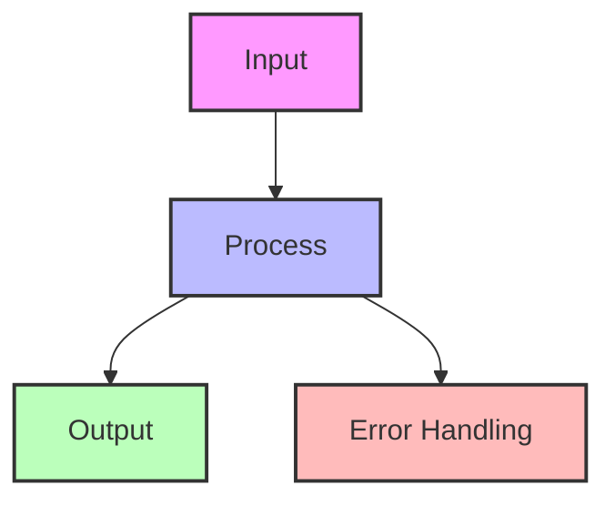
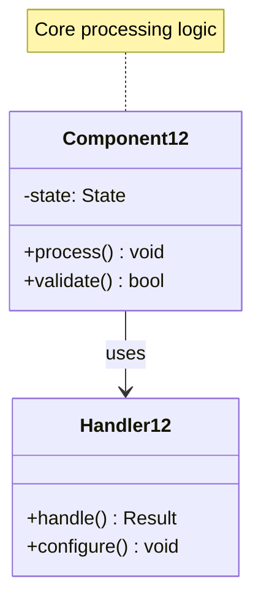

## Essential Question
## When to Use / When NOT to Use

### When to Use

| Scenario | Why It Fits | Alternative If Not |
|----------|-------------|-------------------|
| High availability required | Pattern provides resilience | Consider simpler approach |
| Scalability is critical | Handles load distribution | Monolithic might suffice |
| Distributed coordination needed | Manages complexity | Centralized coordination |

### When NOT to Use

| Scenario | Why to Avoid | Better Alternative |
|----------|--------------|-------------------|
| Simple applications | Unnecessary complexity | Direct implementation |
| Low traffic systems | Overhead not justified | Basic architecture |
| Limited resources | High operational cost | Simpler patterns |
**How do we coordinate distributed components effectively using low-water/high-water marks?**

# Low-Water/High-Water Marks

**Flow control boundaries for distributed systems**

> *"Like a river between its banks, data flows best when contained by well-defined boundaries."*

---

## Level 1: Intuition

### The Dam Analogy

Low and high water marks work like a dam system:
- **High-water mark**: When water reaches this level, open the gates (stop accepting)
- **Low-water mark**: When water drops to this level, close the gates (start accepting)
- **Buffer zone**: The space between prevents rapid on/off switching
- **Overflow protection**: Prevents system flooding

This pattern prevents resource exhaustion while maintaining smooth operation.

### Visual Concept

### State Machine

---

## Level 2: Foundation

### Core Applications

| Use Case | Low Mark | High Mark | Purpose |
|----------|----------|-----------|---------|
| **TCP Flow Control** | 25% buffer | 75% buffer | Prevent packet loss |
| **Replication Lag** | 100 txns behind | 1000 txns behind | Control follower lag |
| **Message Queue** | 1K messages | 10K messages | Prevent memory exhaustion |
| **Thread Pool** | 20% utilized | 80% utilized | Scale workers |
| **Disk Usage** | 50% full | 90% full | Trigger cleanup |

### Hysteresis Prevention

### Common Configurations

---

## Level 3: Deep Dive

### Production Implementation

---

## Level 4: Expert

### Advanced Applications

#### 1. Distributed Garbage Collection

#### 2. Multi-Tier Water Marks

---

## Level 5: Mastery

### Theoretical Foundations

Water marks implement hysteresis to prevent oscillation:

### Optimal Water Mark Selection

### Future Directions

1. **ML-Driven Water Marks**: Predict optimal thresholds using historical patterns
2. **Coordinated Water Marks**: Distributed agreement on flow control across cluster
3. **Application-Aware Marks**: Different thresholds based on request priority/type
4. **Economic Water Marks**: Adjust based on cost models and business impact

---

## Quick Reference

### Setting Water Marks

| System Type | Low Mark | High Mark | Gap | Notes |
|-------------|----------|-----------|-----|-------|
| **High-throughput** | 60% | 90% | 30% | Maximize utilization |
| **Low-latency** | 30% | 70% | 40% | Early backpressure |
| **Bursty traffic** | 20% | 80% | 60% | Large buffer zone |
| **Critical systems** | 40% | 60% | 20% | Conservative |

#
## Decision Matrix

### Quick Decision Table

| Factor | Low Complexity | Medium Complexity | High Complexity |
|--------|----------------|-------------------|-----------------|
| Team Size | < 5 developers | 5-20 developers | > 20 developers |
| Traffic | < 1K req/s | 1K-100K req/s | > 100K req/s |
| Data Volume | < 1GB | 1GB-1TB | > 1TB |
| **Recommendation** | ❌ Avoid | ⚠️ Consider | ✅ Implement |

## Implementation Checklist

- [ ] Define capacity limits
- [ ] Set appropriate thresholds
- [ ] Implement hysteresis gap
- [ ] Add monitoring/metrics
- [ ] Test edge cases
- [ ] Handle threshold crossing atomically
- [ ] Document behavior
- [ ] Plan for adjustment strategy

### Common Pitfalls

1. **Gap too small**: Rapid state changes (thrashing)
2. **Gap too large**: Poor resource utilization
3. **Static thresholds**: Don't adapt to changing conditions
4. **No monitoring**: Can't detect problems
5. **Binary response**: Should consider gradual throttling

---

## Related Laws & Pillars

### Fundamental Laws
This pattern directly addresses:

- **[Law 1: Correlated Failure ⛓️](part1-axioms/law1-failure/index)**: Prevents cascade from overload
- **[Law 2: Asynchronous Reality ⏱️](part1-axioms/law2-asynchrony/)**: Buffers handle timing variations
- **[Law 3: Emergent Chaos 🌪️](part1-axioms/law3-emergence/)**: Simple rules create stable behavior
- **[Law 7: Economic Reality 💰](part1-axioms/law7-economics/index)**: Balance resource usage vs rejection

### Foundational Pillars
Water Marks implement:

- **[Pillar 1: Distribution of Work 🔨](part2-pillars/work/index)**: Control work distribution rate
- **[Pillar 4: Distribution of Control 🎮](part2-pillars/control/index)**: Decentralized flow control
- **[Pillar 2: Distribution of State 🗃️](part2-pillars/state/index)**: Buffer state management

## Related Patterns

### Core Dependencies
- **[Backpressure](../pattern-library/scaling/backpressure.md)**: Water marks trigger backpressure
- **[Circuit Breaker](../pattern-library/resilience/circuit-breaker.md)**: Similar state-based protection
- **[Rate Limiting](../pattern-library/scaling/rate-limiting.md)**: Enforcement mechanism

### Supporting Patterns
- **[Queue](../pattern-library/coordination/distributed-queue.md)**: Often uses water marks
- **[Timeout](../pattern-library/resilience/timeout.md)**: Drain timeout at high water
- **[Bulkhead](../pattern-library/resilience/bulkhead.md)**: Isolate resources with marks

### Similar Concepts
- **[Admission Control](../pattern-library/rate-limiting.md#admission-control)**: Entry-point flow control
- **[Load Shedding](../pattern-library/load-shedding.md)**: Beyond high water mark
- **[Throttling](../pattern-library/rate-limiting.md#throttling)**: Between water marks

---

*"The tide of data rises and falls, but water marks keep your system from drowning."*

