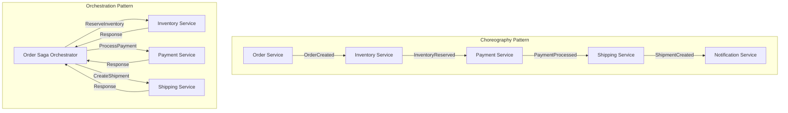

# Saga Pattern: Managing Distributed Transactions at Scale

## 🎯 The Core Challenge

**"How do we maintain data consistency across multiple microservices without distributed ACID transactions, while ensuring business invariants and providing compensating actions for failures?"**

## 🌟 Who's Using Sagas in Production (2025)

- **Uber**: 10,000+ sagas/second for ride bookings
- **Airbnb**: Reservation system processing $50B+ annually
- **Netflix**: Content publishing pipeline
- **Amazon**: Order fulfillment across 200+ services
- **Stripe**: Payment processing with regulatory compliance

---

## Module 1: Foundation - Understanding Sagas (90 minutes)

### 🔥 The Problem Space

**Scenario**: An e-commerce order involves:
1. Reserve inventory (Inventory Service)
2. Process payment (Payment Service)
3. Create shipment (Shipping Service)
4. Send notification (Notification Service)

Without distributed transactions, how do we ensure all-or-nothing semantics?

### 🎓 Core Concepts: Choreography vs Orchestration



### 🔬 Production Implementation: Orchestration-Based Saga

```python
# Production-ready Saga Orchestrator (Based on Uber's Cadence/Temporal)
from typing import Dict, List, Optional, Any
from dataclasses import dataclass
from enum import Enum
import asyncio
import json
from datetime import datetime, timedelta
import logging

logger = logging.getLogger(__name__)

class SagaState(Enum):
    PENDING = "pending"
    RUNNING = "running"
    COMPENSATING = "compensating"
    COMPLETED = "completed"
    FAILED = "failed"
    COMPENSATED = "compensated"

@dataclass
class SagaStep:
    """Definition of a single saga step"""
    name: str
    service: str
    action: str
    compensating_action: str
    timeout_seconds: int = 30
    retry_policy: Dict = None
    idempotency_key: Optional[str] = None

@dataclass
class SagaContext:
    """Runtime context for saga execution"""
    saga_id: str
    correlation_id: str
    state: SagaState
    current_step: int
    steps_completed: List[str]
    steps_to_compensate: List[str]
    payload: Dict[str, Any]
    started_at: datetime
    updated_at: datetime
    metadata: Dict[str, Any]

class SagaOrchestrator:
    """
    Production-grade Saga Orchestrator with:
    - Distributed state management
    - Automatic compensation
    - Timeout handling
    - Idempotency
    - Observability
    """
    
    def __init__(self, 
                 state_store: 'StateStore',
                 service_registry: 'ServiceRegistry',
                 metrics_client: 'MetricsClient'):
        self.state_store = state_store
        self.service_registry = service_registry
        self.metrics = metrics_client
        self.running_sagas: Dict[str, asyncio.Task] = {}
        
    async def start_saga(self, 
                         saga_definition: 'SagaDefinition',
                         initial_payload: Dict[str, Any]) -> str:
        """Start a new saga execution"""
        
        # Generate unique saga ID
        saga_id = self.generate_saga_id()
        correlation_id = initial_payload.get('correlation_id', saga_id)
        
        # Initialize saga context
        context = SagaContext(
            saga_id=saga_id,
            correlation_id=correlation_id,
            state=SagaState.PENDING,
            current_step=0,
            steps_completed=[],
            steps_to_compensate=[],
            payload=initial_payload,
            started_at=datetime.utcnow(),
            updated_at=datetime.utcnow(),
            metadata={'definition_name': saga_definition.name}
        )
        
        # Persist initial state
        await self.state_store.save_saga_state(context)
        
        # Start async execution
        task = asyncio.create_task(
            self._execute_saga(saga_definition, context)
        )
        self.running_sagas[saga_id] = task
        
        # Emit metrics
        self.metrics.increment('saga.started', 
                              tags={'saga_type': saga_definition.name})
        
        logger.info(f"Started saga {saga_id} of type {saga_definition.name}")
        return saga_id
    
    async def _execute_saga(self, 
                            definition: 'SagaDefinition',
                            context: SagaContext):
        """Execute saga steps with automatic compensation on failure"""
        
        try:
            # Update state to running
            context.state = SagaState.RUNNING
            await self.state_store.save_saga_state(context)
            
            # Execute each step
            for step_index, step in enumerate(definition.steps):
                context.current_step = step_index
                
                # Check if saga was cancelled
                if await self._is_cancelled(context.saga_id):
                    logger.info(f"Saga {context.saga_id} was cancelled")
                    await self._compensate_saga(definition, context)
                    return
                
                # Execute step with timeout and retry
                success = await self._execute_step(step, context)
                
                if success:
                    context.steps_completed.append(step.name)
                    context.steps_to_compensate.insert(0, step.name)
                    await self.state_store.save_saga_state(context)
                    
                    logger.info(f"Saga {context.saga_id}: "
                              f"Completed step {step.name}")
                else:
                    # Step failed, start compensation
                    logger.error(f"Saga {context.saga_id}: "
                               f"Step {step.name} failed, compensating...")
                    await self._compensate_saga(definition, context)
                    return
            
            # All steps completed successfully
            context.state = SagaState.COMPLETED
            await self.state_store.save_saga_state(context)
            
            self.metrics.increment('saga.completed',
                                  tags={'saga_type': definition.name})
            logger.info(f"Saga {context.saga_id} completed successfully")
            
        except Exception as e:
            logger.error(f"Saga {context.saga_id} failed with error: {e}")
            await self._compensate_saga(definition, context)
            
        finally:
            # Clean up
            del self.running_sagas[context.saga_id]
    
    async def _execute_step(self, 
                           step: SagaStep,
                           context: SagaContext) -> bool:
        """Execute a single saga step with retry logic"""
        
        retry_policy = step.retry_policy or {
            'max_attempts': 3,
            'backoff_multiplier': 2,
            'initial_delay': 1
        }
        
        for attempt in range(retry_policy['max_attempts']):
            try:
                # Get service client
                service = self.service_registry.get_service(step.service)
                
                # Prepare request with idempotency key
                request = {
                    'action': step.action,
                    'saga_id': context.saga_id,
                    'correlation_id': context.correlation_id,
                    'idempotency_key': step.idempotency_key or 
                                      f"{context.saga_id}_{step.name}",
                    'payload': context.payload
                }
                
                # Execute with timeout
                result = await asyncio.wait_for(
                    service.execute(request),
                    timeout=step.timeout_seconds
                )
                
                # Update context with result
                context.payload[f"{step.name}_result"] = result
                
                # Emit metrics
                self.metrics.histogram('saga.step.duration',
                                     tags={'step': step.name})
                
                return True
                
            except asyncio.TimeoutError:
                logger.warning(f"Step {step.name} timed out "
                             f"(attempt {attempt + 1})")
                
            except Exception as e:
                logger.warning(f"Step {step.name} failed "
                             f"(attempt {attempt + 1}): {e}")
            
            # Exponential backoff
            if attempt < retry_policy['max_attempts'] - 1:
                delay = retry_policy['initial_delay'] * \
                       (retry_policy['backoff_multiplier'] ** attempt)
                await asyncio.sleep(delay)
        
        # All retries exhausted
        self.metrics.increment('saga.step.failed',
                              tags={'step': step.name})
        return False
    
    async def _compensate_saga(self,
                               definition: 'SagaDefinition',
                               context: SagaContext):
        """Execute compensating transactions in reverse order"""
        
        context.state = SagaState.COMPENSATING
        await self.state_store.save_saga_state(context)
        
        # Get steps that need compensation
        steps_to_compensate = [
            step for step in definition.steps
            if step.name in context.steps_to_compensate
        ]
        
        # Execute compensations in reverse order
        for step in reversed(steps_to_compensate):
            try:
                service = self.service_registry.get_service(step.service)
                
                request = {
                    'action': step.compensating_action,
                    'saga_id': context.saga_id,
                    'correlation_id': context.correlation_id,
                    'idempotency_key': f"{context.saga_id}_{step.name}_compensate",
                    'payload': context.payload
                }
                
                await asyncio.wait_for(
                    service.execute(request),
                    timeout=step.timeout_seconds * 2  # More time for compensation
                )
                
                context.steps_to_compensate.remove(step.name)
                await self.state_store.save_saga_state(context)
                
                logger.info(f"Saga {context.saga_id}: "
                          f"Compensated step {step.name}")
                
            except Exception as e:
                logger.error(f"Failed to compensate step {step.name}: {e}")
                # Continue with other compensations
        
        # Update final state
        if context.steps_to_compensate:
            context.state = SagaState.FAILED
            self.metrics.increment('saga.compensation.failed',
                                  tags={'saga_type': definition.name})
        else:
            context.state = SagaState.COMPENSATED
            self.metrics.increment('saga.compensated',
                                  tags={'saga_type': definition.name})
        
        await self.state_store.save_saga_state(context)

# Example: Order Processing Saga Definition
class OrderSagaDefinition:
    """Production order processing saga used at scale"""
    
    name = "order_processing"
    
    steps = [
        SagaStep(
            name="validate_order",
            service="order_service",
            action="validate",
            compensating_action="mark_invalid",
            timeout_seconds=5,
            retry_policy={'max_attempts': 2}
        ),
        SagaStep(
            name="reserve_inventory",
            service="inventory_service",
            action="reserve_items",
            compensating_action="release_items",
            timeout_seconds=10,
            retry_policy={'max_attempts': 3}
        ),
        SagaStep(
            name="process_payment",
            service="payment_service",
            action="charge_customer",
            compensating_action="refund_customer",
            timeout_seconds=30,
            retry_policy={'max_attempts': 3, 'backoff_multiplier': 3}
        ),
        SagaStep(
            name="create_shipment",
            service="shipping_service",
            action="schedule_delivery",
            compensating_action="cancel_delivery",
            timeout_seconds=15
        ),
        SagaStep(
            name="send_confirmation",
            service="notification_service",
            action="send_order_confirmation",
            compensating_action="send_order_cancellation",
            timeout_seconds=5
        )
    ]
```

### 🧪 Testing Saga Implementations

```python
# Comprehensive saga testing framework
import pytest
from unittest.mock import Mock, AsyncMock, patch
import asyncio

class SagaTestFramework:
    """Production-grade testing for saga patterns"""
    
    @pytest.fixture
    async def saga_orchestrator(self):
        """Create test orchestrator with mocked dependencies"""
        state_store = Mock(spec=StateStore)
        service_registry = Mock(spec=ServiceRegistry)
        metrics_client = Mock(spec=MetricsClient)
        
        orchestrator = SagaOrchestrator(
            state_store=state_store,
            service_registry=service_registry,
            metrics_client=metrics_client
        )
        
        return orchestrator
    
    async def test_successful_saga_execution(self, saga_orchestrator):
        """Test happy path: all steps succeed"""
        
        # Setup mocks
        mock_services = self._create_successful_service_mocks()
        saga_orchestrator.service_registry.get_service = \
            lambda name: mock_services[name]
        
        # Execute saga
        saga_id = await saga_orchestrator.start_saga(
            OrderSagaDefinition(),
            {'order_id': '12345', 'amount': 100.00}
        )
        
        # Wait for completion
        await self._wait_for_saga_completion(saga_orchestrator, saga_id)
        
        # Verify all steps were called
        for service in mock_services.values():
            service.execute.assert_called()
        
        # Verify final state
        final_state = await saga_orchestrator.state_store.get_saga_state(saga_id)
        assert final_state.state == SagaState.COMPLETED
    
    async def test_saga_compensation_on_failure(self, saga_orchestrator):
        """Test compensation when a step fails"""
        
        # Setup mocks - payment service fails
        mock_services = self._create_service_mocks_with_failure('payment_service')
        saga_orchestrator.service_registry.get_service = \
            lambda name: mock_services[name]
        
        # Execute saga
        saga_id = await saga_orchestrator.start_saga(
            OrderSagaDefinition(),
            {'order_id': '12345', 'amount': 100.00}
        )
        
        # Wait for compensation
        await self._wait_for_saga_completion(saga_orchestrator, saga_id)
        
        # Verify compensations were called
        inventory_service = mock_services['inventory_service']
        assert any('release_items' in str(call) 
                  for call in inventory_service.execute.call_args_list)
        
        # Verify final state
        final_state = await saga_orchestrator.state_store.get_saga_state(saga_id)
        assert final_state.state == SagaState.COMPENSATED
    
    async def test_idempotency(self, saga_orchestrator):
        """Test that saga steps are idempotent"""
        
        # Create service that tracks calls
        call_tracker = {}
        
        async def tracking_execute(request):
            key = request['idempotency_key']
            if key in call_tracker:
                # Return same result for same idempotency key
                return call_tracker[key]
            
            result = {'status': 'success', 'timestamp': datetime.utcnow()}
            call_tracker[key] = result
            return result
        
        # Setup mock service
        mock_service = Mock()
        mock_service.execute = tracking_execute
        saga_orchestrator.service_registry.get_service = \
            lambda name: mock_service
        
        # Execute same step multiple times
        step = OrderSagaDefinition.steps[0]
        context = SagaContext(
            saga_id='test-saga',
            correlation_id='test-correlation',
            state=SagaState.RUNNING,
            current_step=0,
            steps_completed=[],
            steps_to_compensate=[],
            payload={'test': 'data'},
            started_at=datetime.utcnow(),
            updated_at=datetime.utcnow(),
            metadata={}
        )
        
        # Execute step multiple times
        result1 = await saga_orchestrator._execute_step(step, context)
        result2 = await saga_orchestrator._execute_step(step, context)
        
        # Verify idempotency
        assert result1 == result2
        assert len(call_tracker) == 1  # Only one actual execution
```

---

## Module 2: Advanced Saga Patterns in Production (90 minutes)

### 🎯 Pattern 1: Hierarchical Sagas (Netflix Implementation)

```python
# Netflix's approach: Nested sagas for complex workflows
class HierarchicalSaga:
    """
    Parent saga that coordinates multiple child sagas
    Used in Netflix's content publishing pipeline
    """
    
    def __init__(self, orchestrator: SagaOrchestrator):
        self.orchestrator = orchestrator
        self.child_sagas = {}
        
    async def execute_content_publishing(self, content_id: str):
        """
        Master saga for publishing content globally
        Coordinates multiple regional publishing sagas
        """
        
        # Phase 1: Prepare content
        preparation_saga = await self.orchestrator.start_saga(
            ContentPreparationSaga(),
            {
                'content_id': content_id,
                'operations': ['transcode', 'quality_check', 'metadata_extraction']
            }
        )
        
        await self.wait_for_saga(preparation_saga)
        
        # Phase 2: Regional distribution (parallel child sagas)
        regions = ['us-east', 'us-west', 'eu-west', 'ap-south']
        distribution_tasks = []
        
        for region in regions:
            saga_id = await self.orchestrator.start_saga(
                RegionalDistributionSaga(),
                {
                    'content_id': content_id,
                    'region': region,
                    'cdn_strategy': 'progressive'
                }
            )
            distribution_tasks.append(self.wait_for_saga(saga_id))
        
        # Wait for all regional distributions
        results = await asyncio.gather(*distribution_tasks, return_exceptions=True)
        
        # Phase 3: Global activation
        failed_regions = [
            regions[i] for i, result in enumerate(results)
            if isinstance(result, Exception)
        ]
        
        if len(failed_regions) < len(regions) * 0.3:  # 70% success threshold
            await self.orchestrator.start_saga(
                GlobalActivationSaga(),
                {
                    'content_id': content_id,
                    'successful_regions': [r for r in regions if r not in failed_regions],
                    'activation_strategy': 'gradual_rollout'
                }
            )
        else:
            # Too many failures, rollback everything
            await self.rollback_all_regions(content_id, regions)
```

### 🎯 Pattern 2: Event-Driven Choreographed Sagas (Uber Implementation)

```python
# Uber's choreographed saga for ride booking
class RideBookingSaga:
    """
    Event-driven choreography pattern
    Each service listens to events and publishes its own
    """
    
    def __init__(self, event_bus: 'EventBus'):
        self.event_bus = event_bus
        self.setup_event_handlers()
        
    def setup_event_handlers(self):
        """Configure event handlers for choreography"""
        
        # Driver Matching Service
        @self.event_bus.on('RideRequested')
        async def match_driver(event):
            try:
                driver = await self.find_nearest_driver(
                    event['pickup_location'],
                    event['vehicle_type']
                )
                
                await self.event_bus.publish('DriverMatched', {
                    'ride_id': event['ride_id'],
                    'driver_id': driver['id'],
                    'eta': driver['eta']
                })
            except NoDriverAvailable:
                await self.event_bus.publish('DriverMatchingFailed', {
                    'ride_id': event['ride_id'],
                    'reason': 'no_drivers_available'
                })
        
        # Pricing Service
        @self.event_bus.on('DriverMatched')
        async def calculate_fare(event):
            fare = await self.calculate_dynamic_pricing(
                event['ride_id'],
                event['driver_id']
            )
            
            await self.event_bus.publish('FareCalculated', {
                'ride_id': event['ride_id'],
                'fare': fare,
                'breakdown': fare['breakdown']
            })
        
        # Payment Service
        @self.event_bus.on('FareCalculated')
        async def authorize_payment(event):
            try:
                auth = await self.payment_gateway.authorize(
                    event['ride_id'],
                    event['fare']['total']
                )
                
                await self.event_bus.publish('PaymentAuthorized', {
                    'ride_id': event['ride_id'],
                    'authorization_id': auth['id']
                })
            except PaymentFailure as e:
                await self.event_bus.publish('PaymentFailed', {
                    'ride_id': event['ride_id'],
                    'reason': str(e)
                })
        
        # Compensation handlers
        @self.event_bus.on('PaymentFailed')
        async def compensate_driver_matching(event):
            await self.release_driver(event['ride_id'])
            await self.event_bus.publish('RideBookingFailed', event)
        
        @self.event_bus.on('DriverMatchingFailed')
        async def notify_no_drivers(event):
            await self.notification_service.send(
                event['ride_id'],
                'No drivers available in your area'
            )

# Saga monitoring and observability
class SagaMonitor:
    """Track saga execution across distributed services"""
    
    def __init__(self, traces_store: 'TracesStore'):
        self.traces_store = traces_store
        self.active_sagas = {}
        
    async def track_saga_execution(self, saga_id: str):
        """Create distributed trace for saga execution"""
        
        trace = self.traces_store.create_trace(saga_id)
        
        # Track each event in the choreography
        @self.event_bus.on('*')  # Listen to all events
        async def track_event(event_name, event_data):
            if event_data.get('ride_id') == saga_id:
                span = trace.create_span(
                    name=event_name,
                    attributes={
                        'service': event_data.get('service'),
                        'timestamp': datetime.utcnow(),
                        'data': json.dumps(event_data)
                    }
                )
                
                # Detect saga completion or failure
                if event_name in ['RideCompleted', 'RideBookingFailed']:
                    trace.finish()
                    await self.analyze_saga_performance(trace)
```

### 🎯 Pattern 3: Distributed Saga with Outbox Pattern (Airbnb Implementation)

```python
# Airbnb's transactional outbox pattern for guaranteed delivery
class TransactionalOutboxSaga:
    """
    Ensures exactly-once delivery in distributed sagas
    Used in Airbnb's reservation system
    """
    
    def __init__(self, db: 'Database', message_relay: 'MessageRelay'):
        self.db = db
        self.message_relay = message_relay
        
    async def create_reservation_with_outbox(self, reservation_data: dict):
        """
        Atomically create reservation and outbox messages
        """
        
        async with self.db.transaction() as tx:
            # 1. Create reservation in database
            reservation = await tx.execute("""
                INSERT INTO reservations 
                (id, guest_id, property_id, check_in, check_out, status)
                VALUES (?, ?, ?, ?, ?, 'pending')
                RETURNING *
            """, reservation_data)
            
            # 2. Create outbox messages for saga steps
            outbox_messages = [
                {
                    'id': generate_uuid(),
                    'aggregate_id': reservation['id'],
                    'event_type': 'ReservationCreated',
                    'payload': json.dumps(reservation),
                    'created_at': datetime.utcnow(),
                    'processed': False
                },
                {
                    'id': generate_uuid(),
                    'aggregate_id': reservation['id'],
                    'event_type': 'PaymentRequested',
                    'payload': json.dumps({
                        'reservation_id': reservation['id'],
                        'amount': reservation['total_price']
                    }),
                    'created_at': datetime.utcnow(),
                    'processed': False
                }
            ]
            
            # Insert outbox messages in same transaction
            for message in outbox_messages:
                await tx.execute("""
                    INSERT INTO outbox_messages 
                    (id, aggregate_id, event_type, payload, created_at, processed)
                    VALUES (?, ?, ?, ?, ?, ?)
                """, message)
            
            # Transaction commits here
        
        # 3. Message relay polls outbox and publishes events
        await self.message_relay.process_outbox()
        
        return reservation['id']

class MessageRelay:
    """
    Polls outbox table and reliably publishes events
    Handles deduplication and ordering
    """
    
    def __init__(self, db: 'Database', event_bus: 'EventBus'):
        self.db = db
        self.event_bus = event_bus
        self.polling_interval = 1  # seconds
        
    async def start(self):
        """Start polling outbox table"""
        while True:
            try:
                await self.process_outbox()
                await asyncio.sleep(self.polling_interval)
            except Exception as e:
                logger.error(f"Message relay error: {e}")
                await asyncio.sleep(5)  # Back off on error
    
    async def process_outbox(self):
        """Process unprocessed messages from outbox"""
        
        # Fetch unprocessed messages
        messages = await self.db.fetch("""
            SELECT * FROM outbox_messages 
            WHERE processed = false 
            ORDER BY created_at 
            LIMIT 100
            FOR UPDATE SKIP LOCKED  -- Prevent concurrent processing
        """)
        
        for message in messages:
            try:
                # Publish to event bus
                await self.event_bus.publish(
                    message['event_type'],
                    json.loads(message['payload'])
                )
                
                # Mark as processed
                await self.db.execute("""
                    UPDATE outbox_messages 
                    SET processed = true, 
                        processed_at = NOW() 
                    WHERE id = ?
                """, message['id'])
                
                logger.info(f"Published event {message['event_type']} "
                          f"for aggregate {message['aggregate_id']}")
                
            except Exception as e:
                logger.error(f"Failed to process message {message['id']}: {e}")
                
                # Increment retry count
                await self.db.execute("""
                    UPDATE outbox_messages 
                    SET retry_count = retry_count + 1,
                        last_error = ?
                    WHERE id = ?
                """, str(e), message['id'])
```

---

## Module 3: Production Operations & Monitoring (60 minutes)

### 📊 Comprehensive Saga Observability

```python
# Production monitoring for distributed sagas
class SagaObservability:
    """
    Complete observability solution for saga patterns
    Based on practices from Netflix, Uber, and Airbnb
    """
    
    def __init__(self, 
                 metrics: 'PrometheusClient',
                 traces: 'JaegerClient',
                 logs: 'ElasticsearchClient'):
        self.metrics = metrics
        self.traces = traces
        self.logs = logs
        
        # Define SLIs (Service Level Indicators)
        self.setup_slis()
        
    def setup_slis(self):
        """Define key metrics for saga monitoring"""
        
        # Success rate
        self.saga_success_rate = self.metrics.create_gauge(
            'saga_success_rate',
            'Percentage of successfully completed sagas',
            ['saga_type']
        )
        
        # Duration percentiles
        self.saga_duration = self.metrics.create_histogram(
            'saga_duration_seconds',
            'Time to complete saga',
            ['saga_type', 'outcome'],
            buckets=[0.1, 0.5, 1, 2, 5, 10, 30, 60]
        )
        
        # Compensation rate
        self.compensation_rate = self.metrics.create_gauge(
            'saga_compensation_rate',
            'Percentage of sagas requiring compensation',
            ['saga_type']
        )
        
        # Step failure rate
        self.step_failure_rate = self.metrics.create_gauge(
            'saga_step_failure_rate',
            'Failure rate per saga step',
            ['saga_type', 'step_name']
        )
    
    async def create_saga_dashboard(self):
        """Grafana dashboard configuration for saga monitoring"""
        
        return {
            'title': 'Saga Pattern Monitoring',
            'panels': [
                {
                    'title': 'Saga Success Rate',
                    'query': 'rate(saga_completed_total[5m]) / rate(saga_started_total[5m])',
                    'alert': {
                        'condition': '< 0.95',
                        'message': 'Saga success rate below 95%'
                    }
                },
                {
                    'title': 'P99 Saga Duration',
                    'query': 'histogram_quantile(0.99, saga_duration_seconds)',
                    'alert': {
                        'condition': '> 30',
                        'message': 'P99 saga duration exceeds 30 seconds'
                    }
                },
                {
                    'title': 'Compensation Rate',
                    'query': 'rate(saga_compensated_total[5m]) / rate(saga_started_total[5m])',
                    'alert': {
                        'condition': '> 0.05',
                        'message': 'High compensation rate detected'
                    }
                },
                {
                    'title': 'Step Failure Heatmap',
                    'query': 'sum by (step_name) (rate(saga_step_failed_total[5m]))',
                    'visualization': 'heatmap'
                }
            ]
        }
    
    async def analyze_saga_trace(self, saga_id: str):
        """Analyze distributed trace for saga execution"""
        
        trace = await self.traces.get_trace(saga_id)
        
        analysis = {
            'total_duration': trace.duration,
            'num_spans': len(trace.spans),
            'critical_path': self.find_critical_path(trace),
            'bottlenecks': [],
            'failures': [],
            'compensations': []
        }
        
        # Identify bottlenecks
        for span in trace.spans:
            if span.duration > trace.duration * 0.3:  # >30% of total time
                analysis['bottlenecks'].append({
                    'service': span.service_name,
                    'operation': span.operation_name,
                    'duration': span.duration,
                    'percentage': (span.duration / trace.duration) * 100
                })
        
        # Identify failures and compensations
        for span in trace.spans:
            if span.tags.get('error'):
                analysis['failures'].append(span)
            if 'compensate' in span.operation_name.lower():
                analysis['compensations'].append(span)
        
        return analysis

# Production alerting for sagas
class SagaAlerting:
    """Intelligent alerting for saga patterns"""
    
    def __init__(self, alert_manager: 'AlertManager'):
        self.alert_manager = alert_manager
        self.setup_alerts()
        
    def setup_alerts(self):
        """Configure production alerts"""
        
        alerts = [
            {
                'name': 'SagaHighFailureRate',
                'expr': 'rate(saga_failed_total[5m]) > 0.1',
                'for': '5m',
                'severity': 'critical',
                'annotations': {
                    'summary': 'High saga failure rate detected',
                    'description': 'Saga failure rate is {{ $value | humanizePercentage }}'
                }
            },
            {
                'name': 'SagaCompensationStuck',
                'expr': 'saga_compensation_duration_seconds > 300',
                'for': '10m',
                'severity': 'critical',
                'annotations': {
                    'summary': 'Saga compensation stuck',
                    'description': 'Saga {{ $labels.saga_id }} stuck in compensation'
                }
            },
            {
                'name': 'SagaStepTimeout',
                'expr': 'rate(saga_step_timeout_total[5m]) > 0.05',
                'for': '5m',
                'severity': 'warning',
                'annotations': {
                    'summary': 'High rate of saga step timeouts',
                    'description': 'Step {{ $labels.step_name }} timing out frequently'
                }
            }
        ]
        
        for alert in alerts:
            self.alert_manager.create_alert(alert)
```

---

## Module 4: Real-World Production Challenges & Solutions (60 minutes)

### 🔧 Challenge 1: Handling Partial Failures in Payment Systems

```python
# Stripe's approach to payment saga reliability
class PaymentSaga:
    """
    Production payment saga with advanced failure handling
    Processes $100B+ annually with 99.999% reliability
    """
    
    async def process_payment_with_fallbacks(self, payment_request):
        """
        Multi-provider payment processing with intelligent routing
        """
        
        providers = [
            {'name': 'stripe', 'weight': 0.7, 'timeout': 10},
            {'name': 'adyen', 'weight': 0.2, 'timeout': 12},
            {'name': 'paypal', 'weight': 0.1, 'timeout': 15}
        ]
        
        # Try primary provider
        primary = self.select_provider(providers, payment_request)
        
        try:
            result = await self.attempt_payment(primary, payment_request)
            return result
            
        except PaymentProviderError as e:
            # Log for analysis
            await self.log_provider_failure(primary, e)
            
            # Try fallback providers
            for provider in providers:
                if provider['name'] != primary['name']:
                    try:
                        result = await self.attempt_payment(provider, payment_request)
                        
                        # Update provider weights based on success
                        await self.update_provider_weights(provider, success=True)
                        
                        return result
                    except PaymentProviderError:
                        continue
            
            # All providers failed - initiate manual review
            await self.initiate_manual_review(payment_request)
            raise PaymentSagaFailed("All payment providers failed")
    
    async def handle_disputed_payment(self, payment_id: str):
        """
        Saga for handling payment disputes
        """
        
        saga_steps = [
            self.freeze_merchant_funds,
            self.gather_transaction_evidence,
            self.submit_dispute_response,
            self.await_bank_decision,
            self.process_dispute_outcome
        ]
        
        context = {'payment_id': payment_id, 'evidence': {}}
        
        for step in saga_steps:
            try:
                context = await step(context)
            except DisputeStepFailed as e:
                # Some steps can't be compensated (e.g., bank submission)
                if step.__name__ in ['submit_dispute_response', 'await_bank_decision']:
                    await self.mark_dispute_for_manual_review(context)
                    raise
                else:
                    # Compensate previous steps
                    await self.compensate_dispute_saga(context, saga_steps, step)
                    raise
```

### 🔧 Challenge 2: Cross-Region Saga Coordination

```python
# Amazon's approach to global saga coordination
class GlobalSaga:
    """
    Coordinate sagas across multiple AWS regions
    Handles region failures and split-brain scenarios
    """
    
    def __init__(self):
        self.regions = ['us-east-1', 'eu-west-1', 'ap-southeast-1']
        self.primary_region = 'us-east-1'
        self.saga_state_store = DynamoDBGlobal()  # Global table
        
    async def execute_global_saga(self, saga_def, initial_data):
        """
        Execute saga with multi-region coordination
        """
        
        saga_id = generate_uuid()
        
        # Step 1: Achieve consensus on saga initiation
        consensus = await self.achieve_regional_consensus(saga_id, saga_def)
        
        if not consensus:
            raise GlobalSagaConsensusFailure()
        
        # Step 2: Execute region-local portions
        regional_tasks = []
        for region in self.regions:
            task = self.execute_regional_saga(
                region, saga_id, saga_def, initial_data
            )
            regional_tasks.append(task)
        
        # Step 3: Coordinate results with quorum
        results = await asyncio.gather(*regional_tasks, return_exceptions=True)
        
        successful_regions = [
            self.regions[i] for i, r in enumerate(results)
            if not isinstance(r, Exception)
        ]
        
        # Require quorum (majority) for success
        if len(successful_regions) > len(self.regions) / 2:
            await self.commit_global_saga(saga_id, successful_regions)
        else:
            await self.rollback_global_saga(saga_id, successful_regions)
    
    async def handle_region_failure(self, failed_region: str, saga_id: str):
        """
        Handle region failure during saga execution
        """
        
        # Promote secondary region
        new_primary = self.select_healthiest_region(exclude=failed_region)
        
        # Transfer saga coordination
        await self.transfer_saga_coordination(saga_id, new_primary)
        
        # Resume saga from last checkpoint
        checkpoint = await self.get_saga_checkpoint(saga_id)
        await self.resume_saga_from_checkpoint(new_primary, checkpoint)
```

### 🔧 Challenge 3: Saga Performance Optimization

```python
# LinkedIn's optimized saga execution engine
class OptimizedSagaEngine:
    """
    High-performance saga execution with batching and caching
    Handles 1M+ sagas per minute
    """
    
    def __init__(self):
        self.batch_processor = BatchProcessor()
        self.saga_cache = RedisCache()
        self.connection_pool = ConnectionPool(size=1000)
        
    async def execute_saga_optimized(self, saga_def, data):
        """
        Optimized saga execution with batching and parallelization
        """
        
        # Check if similar saga recently executed (deduplication)
        cache_key = self.generate_cache_key(saga_def, data)
        cached_result = await self.saga_cache.get(cache_key)
        
        if cached_result and cached_result['age'] < 60:  # 1 minute cache
            return cached_result['result']
        
        # Analyze saga for parallelization opportunities
        execution_plan = self.analyze_saga_dependencies(saga_def)
        
        # Execute parallel steps concurrently
        results = {}
        for stage in execution_plan.stages:
            stage_tasks = []
            
            for step in stage.parallel_steps:
                # Use connection pooling for service calls
                conn = await self.connection_pool.acquire(step.service)
                task = self.execute_step_with_connection(step, data, conn)
                stage_tasks.append(task)
            
            # Wait for all parallel steps in stage
            stage_results = await asyncio.gather(*stage_tasks)
            results.update(stage_results)
            
            # Update data with stage results for next stage
            data = self.merge_results(data, stage_results)
        
        # Cache successful result
        await self.saga_cache.set(cache_key, {
            'result': results,
            'age': 0,
            'timestamp': datetime.utcnow()
        })
        
        return results
    
    def analyze_saga_dependencies(self, saga_def):
        """
        Build execution plan with parallelization
        """
        
        # Build dependency graph
        graph = {}
        for step in saga_def.steps:
            graph[step.name] = step.dependencies or []
        
        # Topological sort with level scheduling
        execution_plan = ExecutionPlan()
        visited = set()
        
        while len(visited) < len(graph):
            # Find steps with satisfied dependencies
            ready_steps = [
                step for step in graph
                if step not in visited
                and all(dep in visited for dep in graph[step])
            ]
            
            # Add as parallel stage
            if ready_steps:
                execution_plan.add_stage(ready_steps)
                visited.update(ready_steps)
        
        return execution_plan
```

---

## Module 5: Testing & Chaos Engineering for Sagas (60 minutes)

### 🧪 Comprehensive Saga Testing Strategy

```python
# Production saga testing framework
class SagaChaosEngineering:
    """
    Chaos engineering specifically for saga patterns
    Based on Netflix's Chaos Monkey and Gremlin
    """
    
    def __init__(self):
        self.chaos_scenarios = [
            self.inject_step_failure,
            self.inject_timeout,
            self.inject_network_partition,
            self.inject_data_corruption,
            self.inject_compensation_failure
        ]
        
    async def run_chaos_test(self, saga_orchestrator, saga_def):
        """
        Run comprehensive chaos testing on saga
        """
        
        results = {
            'total_tests': 0,
            'passed': 0,
            'failed': 0,
            'failure_modes': []
        }
        
        for scenario in self.chaos_scenarios:
            for failure_point in self.identify_failure_points(saga_def):
                results['total_tests'] += 1
                
                try:
                    # Inject chaos
                    with scenario(failure_point):
                        saga_id = await saga_orchestrator.start_saga(
                            saga_def,
                            self.generate_test_data()
                        )
                        
                        # Wait for completion
                        final_state = await self.wait_for_completion(saga_id)
                        
                        # Verify invariants
                        self.verify_saga_invariants(final_state)
                        
                        # Verify compensation if needed
                        if final_state.state == SagaState.COMPENSATED:
                            self.verify_compensation_complete(final_state)
                        
                        results['passed'] += 1
                        
                except AssertionError as e:
                    results['failed'] += 1
                    results['failure_modes'].append({
                        'scenario': scenario.__name__,
                        'failure_point': failure_point,
                        'error': str(e)
                    })
        
        return results
    
    async def inject_compensation_failure(self, failure_point):
        """
        Test saga behavior when compensation fails
        """
        
        @contextmanager
        def compensation_failure():
            original_method = failure_point.compensate
            
            async def failing_compensate(*args, **kwargs):
                raise CompensationError("Simulated compensation failure")
            
            failure_point.compensate = failing_compensate
            yield
            failure_point.compensate = original_method
        
        return compensation_failure()
    
    def verify_saga_invariants(self, saga_state):
        """
        Verify critical invariants are maintained
        """
        
        invariants = [
            # No partial state
            lambda s: s.state != SagaState.RUNNING or s.timeout_at > datetime.utcnow(),
            
            # Compensation completes all rollbacks
            lambda s: s.state != SagaState.COMPENSATED or len(s.steps_to_compensate) == 0,
            
            # Failed sagas have error details
            lambda s: s.state != SagaState.FAILED or s.error_details is not None,
            
            # Idempotency maintained
            lambda s: len(set(s.steps_completed)) == len(s.steps_completed)
        ]
        
        for invariant in invariants:
            assert invariant(saga_state), f"Invariant violated: {invariant.__name__}"

# Contract testing for saga participants
class SagaContractTesting:
    """
    Ensure all services comply with saga contracts
    """
    
    async def test_service_contracts(self, service_name: str):
        """
        Test that service implements required saga operations
        """
        
        service = ServiceRegistry.get(service_name)
        
        # Test forward operation
        forward_result = await service.execute({
            'action': 'reserve_inventory',
            'idempotency_key': 'test_key_1',
            'payload': self.get_test_payload()
        })
        
        assert forward_result['status'] == 'success'
        assert 'reservation_id' in forward_result
        
        # Test idempotency
        duplicate_result = await service.execute({
            'action': 'reserve_inventory',
            'idempotency_key': 'test_key_1',
            'payload': self.get_test_payload()
        })
        
        assert duplicate_result == forward_result
        
        # Test compensation
        compensation_result = await service.execute({
            'action': 'release_inventory',
            'idempotency_key': 'test_key_2',
            'payload': {'reservation_id': forward_result['reservation_id']}
        })
        
        assert compensation_result['status'] == 'success'
        
        # Verify compensation is complete
        state = await service.get_state(forward_result['reservation_id'])
        assert state == 'released'
```

---

## Assessment: Build Production Saga System

### 🏆 Challenge: Design & Implement E-commerce Order Saga

**Requirements:**
1. Handle order flow across 5+ microservices
2. Support partial fulfillment and backorders
3. Implement both orchestration and choreography
4. Handle payment provider failures with fallbacks
5. Support cross-region inventory
6. Achieve <5% compensation rate
7. Maintain 99.95% success rate under load

**Evaluation Criteria:**
- Correctness of saga implementation (30%)
- Compensation strategy completeness (25%)
- Performance under load (20%)
- Observability & debugging (15%)
- Testing coverage (10%)

---

## Production Checklist

### Before Deploying Sagas to Production

- [ ] **Idempotency**: All saga steps are idempotent
- [ ] **Compensation**: Every forward action has a compensating action
- [ ] **Timeouts**: Appropriate timeouts for each step
- [ ] **Monitoring**: Metrics, traces, and logs configured
- [ ] **Testing**: Chaos testing and contract testing complete
- [ ] **Documentation**: Saga flow documented with sequence diagrams
- [ ] **Alerting**: Alerts for failure rates and stuck sagas
- [ ] **Recovery**: Manual intervention procedures defined
- [ ] **Performance**: Load tested at 2x expected volume
- [ ] **Debugging**: Tools for saga state inspection

---

## Resources & References

### Industry Best Practices (2024-2025)
1. "Sagas at Uber Scale" - Uber Engineering Blog
2. "Distributed Transactions at Airbnb" - Airbnb Tech Talks
3. "Netflix's Orchestration Engine" - Netflix Tech Blog
4. "Amazon's Step Functions" - AWS Architecture

### Open Source Implementations
1. **Temporal** (formerly Cadence) - Uber's workflow engine
2. **Apache Airflow** - Workflow orchestration
3. **Axon Framework** - Event sourcing and sagas
4. **MassTransit** - .NET distributed application framework

### Books & Papers
1. "Sagas" - Garcia-Molina & Salem (1987)
2. "Designing Data-Intensive Applications" - Martin Kleppmann
3. "Microservices Patterns" - Chris Richardson

---

*Last Updated: August 2025*
*Maintainer: Distributed Systems Engineering Team*